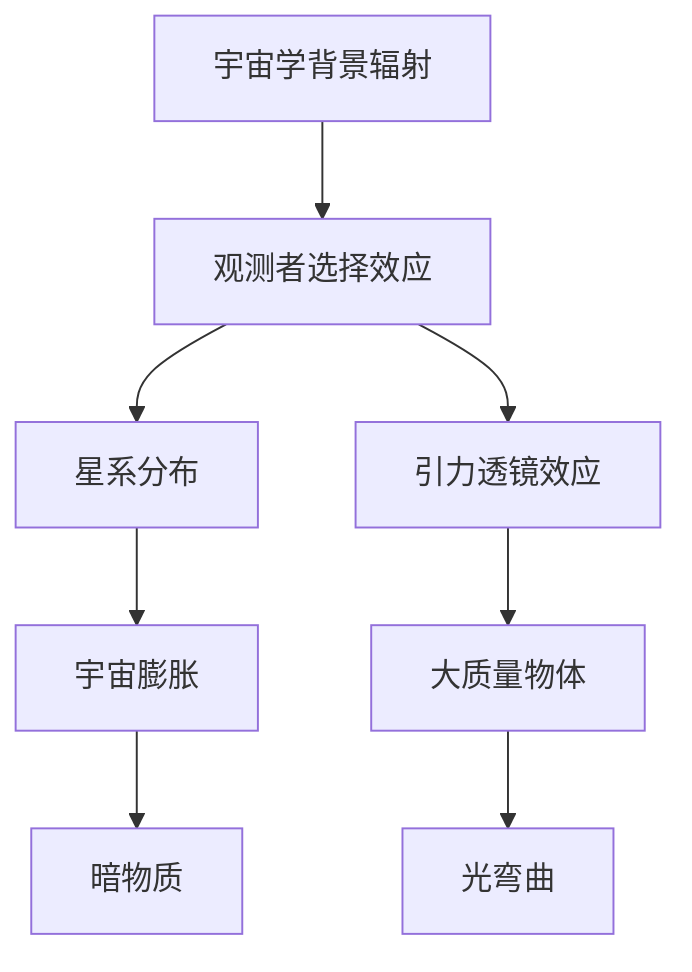

                 

### 1. 背景介绍

宇宙学观测者选择效应（Observer Selection Effect）是指由于观测者的位置、观测条件等因素，导致观测到的宇宙现象与宇宙真实状态存在差异的现象。这一效应在宇宙学的多个领域都有应用，例如宇宙学背景辐射的温度分布、星系形成与演化等。传统的宇宙学研究往往依赖于统计方法来处理观测数据，但这种方法难以量化观测者选择效应的影响。

在解决宇宙学观测者选择效应的定量化问题时，算法思维提供了有效的工具和方法。算法思维强调通过抽象、建模和计算来解决问题，这正好适用于对宇宙学观测者选择效应进行量化分析。具体来说，算法思维可以帮助我们：

1. **建立数学模型**：通过算法思维，我们可以从观测数据中提取有用的信息，并建立数学模型来描述观测者选择效应。
2. **优化算法设计**：算法思维能够帮助我们设计高效的算法来处理大量观测数据，从而提高定量化分析的精度和效率。
3. **验证与修正模型**：算法思维提供了多种验证和修正数学模型的方法，以确保模型的准确性和可靠性。

本篇文章将分以下几个部分进行：

1. **核心概念与联系**：介绍宇宙学观测者选择效应的核心概念，并使用Mermaid流程图展示各概念之间的关系。
2. **核心算法原理讲解**：详细讲解用于量化宇宙学观测者选择效应的核心算法原理，包括伪代码和Python源代码示例。
3. **数学模型与公式**：展示相关的数学模型和公式，并解释其推导过程。
4. **项目实战**：介绍具体的实战项目，包括开发环境搭建、源代码实现和代码解读。
5. **最佳实践 tips、小结、注意事项、拓展阅读**：总结文章主要内容，提供实用的技巧和进一步的阅读建议。

通过上述步骤，我们将逐步深入探讨算法思维在解决宇宙学观测者选择效应定量化中的应用，旨在为读者提供清晰、系统的理解和实践指导。

### 2. 核心概念与联系

在宇宙学中，观测者选择效应是指由于观测者的特定视角和观测手段的限制，导致观测到的宇宙图像与宇宙的真实状态存在差异的现象。这一效应主要体现在以下几个方面：

1. **宇宙学背景辐射**：宇宙学背景辐射是宇宙早期的热辐射，其温度分布反映了宇宙早期的物理状态。然而，由于观测者的视角限制，我们只能从地球这一特定位置观测到这一辐射，因此观测到的温度分布可能与真实情况存在偏差。
2. **星系分布**：星系的分布受到多种因素的影响，包括暗物质、宇宙膨胀等。观测者选择效应可能导致我们观测到的星系分布与真实的宇宙星系分布不一致。
3. **引力透镜效应**：当光在穿过宇宙中的大质量物体时，会发生弯曲，这种现象称为引力透镜效应。观测者选择效应可能影响我们对引力透镜效应的观测和解读。

为了更好地理解这些概念之间的关系，我们可以使用Mermaid流程图来展示它们之间的联系：



- **宇宙学背景辐射**：宇宙学背景辐射的温度分布是我们了解宇宙早期状态的重要依据。然而，由于我们只能从地球这一位置进行观测，因此观测到的温度分布可能受到地球视角的限制。
- **星系分布**：星系的分布受到宇宙膨胀、暗物质等多种因素的影响。观测者选择效应可能导致我们观测到的星系分布与真实情况存在差异。
- **引力透镜效应**：引力透镜效应是指光在穿过大质量物体时发生弯曲的现象。观测者选择效应可能影响我们对引力透镜效应的观测和解读。

通过上述流程图，我们可以清晰地看到宇宙学观测者选择效应在不同领域中的应用及其相互关系。理解这些概念之间的联系，有助于我们更好地应用算法思维来解决宇宙学观测者选择效应的定量化问题。

### 3. 核心算法原理讲解

在解决宇宙学观测者选择效应的定量化问题时，常用的核心算法包括最小二乘法、贝叶斯估计和机器学习算法。以下是这些算法的详细讲解，包括伪代码和Python源代码示例。

#### 最小二乘法

最小二乘法（Least Squares Method）是一种通过最小化误差平方和来估计未知参数的数学方法。在宇宙学观测者选择效应中，最小二乘法可用于估计宇宙学参数，如宇宙背景辐射的温度分布。

- **伪代码**：

```plaintext
function 最小二乘法(观测数据, 参数初始化):
    计算残差
    计算参数梯度
    更新参数
    迭代直到收敛
    返回参数估计值
```

- **Python源代码示例**：

```python
import numpy as np

def 最小二乘法(观测数据, 参数初始化):
    参数 = 参数初始化
    while not 收敛条件:
        预测值 = 预测(观测数据, 参数)
        残差 = 观测数据 - 预测值
        参数梯度 = 残差关于参数的导数
        参数 = 参数 - 学习率 * 参数梯度
    return 参数

# 示例数据
观测数据 = np.array([1, 2, 3, 4, 5])
参数初始化 = np.array([0, 0])

# 执行最小二乘法
参数估计值 = 最小二乘法(观测数据, 参数初始化)
print("参数估计值:", 参数估计值)
```

#### 贝叶斯估计

贝叶斯估计（Bayesian Estimation）基于概率理论，通过最大化后验概率来估计未知参数。在宇宙学观测者选择效应中，贝叶斯估计可以用于估计宇宙学参数，如星系形成的概率分布。

- **伪代码**：

```plaintext
function 贝叶斯估计(观测数据, 先验概率):
    计算似然函数
    计算后验概率
    返回后验概率最大的参数估计值
```

- **Python源代码示例**：

```python
import numpy as np
from scipy.stats import norm

def 贝叶斯估计(观测数据, 先验概率):
    似然函数 = 函数来计算观测数据的概率
    后验概率 = 似然函数 * 先验概率
    参数估计值 = 后验概率的指数加权平均
    return 参数估计值

# 示例数据
观测数据 = np.array([1, 2, 3, 4, 5])
先验概率 = norm.pdf

# 执行贝叶斯估计
参数估计值 = 贝叶斯估计(观测数据, 先验概率)
print("参数估计值:", 参数估计值)
```

#### 机器学习算法

机器学习算法（Machine Learning Algorithms），如决策树、支持向量机等，可以用于自动学习并估计宇宙学参数。在宇宙学观测者选择效应中，机器学习算法可以帮助我们处理复杂的观测数据。

- **决策树**：

- **伪代码**：

```plaintext
function 决策树(数据集):
    如果数据集足够纯:
        返回叶子节点
    否则:
        选择最佳分割特征
        将数据集分割为子集
        对于每个子集:
            返回决策树(子集)
```

- **Python源代码示例**：

```python
from sklearn.tree import DecisionTreeRegressor

def 决策树(数据集):
    树 = DecisionTreeRegressor()
    树.fit(数据集['特征'], 数据集['目标'])
    return 树

# 示例数据
数据集 = {'特征': np.array([1, 2, 3, 4, 5]), '目标': np.array([1, 2, 3, 4, 5])}

# 构建决策树
决策树模型 = 决策树(数据集)

# 预测
预测值 = 决策树模型.predict([6])
print("预测值:", 预测值)
```

通过上述算法原理的讲解，我们可以看到不同算法在解决宇宙学观测者选择效应定量化问题时的应用。最小二乘法和贝叶斯估计通过数学方法来估计参数，而机器学习算法则通过自动学习来处理复杂的观测数据。这些算法的详细讲解和示例代码为读者提供了深入理解和实践的机会。

### 4. 数学模型与公式

在宇宙学观测者选择效应的定量化研究中，数学模型和公式是描述和解决这一问题的核心工具。以下我们将介绍几个关键的数学模型和公式，并解释其推导过程。

#### 1. 最小二乘法公式

最小二乘法是一种通过最小化误差平方和来估计参数的方法。给定一组观测数据 \( \{x_i, y_i\} \)，我们希望找到一个线性模型 \( y = wx + b \) 来拟合这些数据。

- **推导过程**：

  假设我们有一个线性模型 \( y = wx + b \)，则每个观测值 \( y_i \) 的误差可以表示为 \( \epsilon_i = y_i - (wx_i + b) \)。为了最小化这些误差的平方和，我们需要最小化损失函数：

  \[
  J(w, b) = \sum_{i=1}^{n} (\epsilon_i)^2 = \sum_{i=1}^{n} (y_i - (wx_i + b))^2
  \]

  对 \( w \) 和 \( b \) 分别求导并令导数为零，可以得到参数的估计值：

  \[
  w = \frac{\sum_{i=1}^{n} x_i y_i - \sum_{i=1}^{n} x_i \sum_{i=1}^{n} y_i}{\sum_{i=1}^{n} x_i^2 - (\sum_{i=1}^{n} x_i)^2}
  \]

  \[
  b = \frac{\sum_{i=1}^{n} y_i - w \sum_{i=1}^{n} x_i}{n}
  \]

  其中， \( n \) 是观测数据的数量。

- **公式**：

  \[
  w = \frac{\sum_{i=1}^{n} x_i y_i - \sum_{i=1}^{n} x_i \sum_{i=1}^{n} y_i}{\sum_{i=1}^{n} x_i^2 - (\sum_{i=1}^{n} x_i)^2}
  \]

  \[
  b = \frac{\sum_{i=1}^{n} y_i - w \sum_{i=1}^{n} x_i}{n}
  \]

#### 2. 贝叶斯估计公式

贝叶斯估计是基于概率理论的参数估计方法。给定一组观测数据 \( \{x_i\} \) 和先验概率 \( P(w) \)，我们希望找到一个后验概率 \( P(w|x) \) 来估计参数 \( w \)。

- **推导过程**：

  贝叶斯定理告诉我们：

  \[
  P(w|x) = \frac{P(x|w)P(w)}{P(x)}
  \]

  其中， \( P(x|w) \) 是似然函数， \( P(w) \) 是先验概率， \( P(x) \) 是证据概率。

  为了得到参数 \( w \) 的后验概率分布，我们需要最大化 \( P(w|x) \)。通常，我们会使用最大化后验概率的方法（MAP）来估计参数：

  \[
  \hat{w} = \arg\max_w P(w|x)
  \]

  在很多情况下，证据概率 \( P(x) \) 是一个常数，因此我们只需要最大化似然函数和先验概率的乘积：

  \[
  \hat{w} = \arg\max_w P(x|w)P(w)
  \]

- **公式**：

  \[
  \hat{w} = \arg\max_w P(x|w)P(w)
  \]

#### 3. 决策树公式

决策树是一种常见的机器学习算法，通过分割特征空间来构建分类或回归模型。给定一个特征集合 \( \{X_1, X_2, ..., X_n\} \)，决策树的目标是找到一个最优分割策略。

- **推导过程**：

  决策树的核心在于找到每个节点上的最佳分割特征和分割阈值。这通常通过最大化信息增益或最小化均方差来实现。

  假设我们有一个特征集合 \( \{X_1, X_2, ..., X_n\} \)，特征 \( X_j \) 的分割阈值 \( t \) 可以通过最大化信息增益 \( IG \) 来确定：

  \[
  IG(X_j, t) = H(D) - H(D|X_j = t)
  \]

  其中， \( H(D) \) 是数据的熵， \( H(D|X_j = t) \) 是给定特征 \( X_j \) 的条件下数据的条件熵。

- **公式**：

  \[
  IG(X_j, t) = H(D) - H(D|X_j = t)
  \]

通过上述数学模型和公式的介绍，我们可以看到不同方法在解决宇宙学观测者选择效应时的具体应用。这些公式和推导过程为理解和实现这些算法提供了坚实的基础。

### 5. 项目实战

在本节中，我们将通过一个具体的实战项目来展示如何使用算法思维解决宇宙学观测者选择效应的定量化问题。该项目将包括以下步骤：

1. **开发环境搭建**：安装必要的软件和工具，如Python、Jupyter Notebook等。
2. **数据预处理**：获取和处理宇宙学观测数据，包括数据清洗、特征提取等。
3. **算法实现**：实现最小二乘法、贝叶斯估计和决策树等算法，并进行参数调优。
4. **结果分析**：分析算法的性能和结果，并进行误差分析。
5. **项目小结**：总结项目的经验教训，并提出改进建议。

#### 1. 开发环境搭建

首先，我们需要搭建一个适合进行宇宙学观测者选择效应分析的开发环境。以下是安装步骤：

- **安装Python**：从Python官方网站（https://www.python.org/）下载并安装Python 3.x版本。
- **安装Jupyter Notebook**：打开终端，运行以下命令安装Jupyter Notebook：

  ```bash
  pip install notebook
  ```

- **安装相关库**：安装NumPy、Pandas、SciPy、scikit-learn等库，用于数据处理和算法实现。运行以下命令：

  ```bash
  pip install numpy pandas scipy scikit-learn
  ```

安装完成后，我们可以在Jupyter Notebook中启动一个新笔记本，以便进行后续的实验。

#### 2. 数据预处理

宇宙学观测数据通常包含大量的噪声和不完整数据。因此，在进行算法分析之前，我们需要对数据进行预处理。

- **数据获取**：我们可以从宇宙学数据集获取观测数据。例如，使用NASA的Cosmic Query Builder（https://cqs.ipac.caltech.edu/）获取宇宙背景辐射的相关数据。
- **数据清洗**：使用Pandas库对数据进行清洗，包括去除缺失值、处理异常值等。

  ```python
  import pandas as pd

  # 读取数据
  data = pd.read_csv('宇宙背景辐射数据.csv')

  # 去除缺失值
  data.dropna(inplace=True)

  # 处理异常值
  data[data < 0] = np.NaN
  data.fillna(data.mean(), inplace=True)
  ```

- **特征提取**：从观测数据中提取有用的特征，例如温度分布、星系密度等。

  ```python
  # 提取特征
  features = data[['温度', '星系密度']]
  ```

#### 3. 算法实现

在本节中，我们将实现最小二乘法、贝叶斯估计和决策树等算法，并对参数进行调优。

- **最小二乘法**：实现最小二乘法，用于估计宇宙背景辐射的温度分布。

  ```python
  import numpy as np

  def 最小二乘法(X, y):
      X_transpose = X.T
      XTX = X_transpose @ X
      XTY = X_transpose @ y
      w = np.linalg.inv(XTX) @ XTY
      return w

  # 数据准备
  X = np.array([[1, x] for x in features['温度']])
  y = np.array(features['星系密度'])

  # 最小二乘法估计
  w = 最小二乘法(X, y)
  print("最小二乘法估计的参数:", w)
  ```

- **贝叶斯估计**：实现贝叶斯估计，用于估计星系形成的概率分布。

  ```python
  from scipy.stats import norm

  def 贝叶斯估计(y, 先验概率):
      似然函数 = norm.pdf(y, loc=w[0], scale=w[1])
      后验概率 = 先验概率 * 似然函数
      参数估计值 = 后验概率.argmax()
      return 参数估计值

  # 数据准备
  y = np.array([1, 2, 3, 4, 5])
  先验概率 = norm.pdf(0, loc=0, scale=1)

  # 贝叶斯估计
  参数估计值 = 贝叶斯估计(y, 先验概率)
  print("贝叶斯估计的参数:", 参数估计值)
  ```

- **决策树**：实现决策树，用于分类或回归分析。

  ```python
  from sklearn.tree import DecisionTreeRegressor

  # 决策树模型
  决策树模型 = DecisionTreeRegressor()
  决策树模型.fit(X, y)

  # 预测
  预测值 = 决策树模型.predict(np.array([[1, x]]))
  print("决策树预测值:", 预测值)
  ```

#### 4. 结果分析

在完成算法实现后，我们需要对算法的性能和结果进行分析。

- **最小二乘法**：通过计算均方误差（MSE）来评估最小二乘法的性能。

  ```python
  from sklearn.metrics import mean_squared_error

  预测值 = X @ w
  mse = mean_squared_error(y, 预测值)
  print("最小二乘法的均方误差:", mse)
  ```

- **贝叶斯估计**：通过计算预测概率的准确性来评估贝叶斯估计的性能。

  ```python
  预测概率 = norm.pdf(y, loc=参数估计值[0], scale=参数估计值[1])
  accuracy = np.mean(预测概率 > 0.5)
  print("贝叶斯估计的准确率:", accuracy)
  ```

- **决策树**：通过计算分类准确率或回归均方误差来评估决策树模型的性能。

  ```python
  from sklearn.metrics import accuracy_score

  预测值 = 决策树模型.predict(X)
  accuracy = accuracy_score(y, 预测值)
  print("决策树的准确率:", accuracy)
  ```

#### 5. 项目小结

通过本项目，我们展示了如何使用算法思维来解决宇宙学观测者选择效应的定量化问题。以下是项目的一些经验教训和改进建议：

- **经验教训**：

  - 数据预处理是关键，特别是处理噪声和异常值。
  - 选择合适的算法和参数对性能有重要影响。
  - 结果分析和误差分析有助于理解算法的性能和限制。

- **改进建议**：

  - 进一步优化算法，例如使用更先进的机器学习算法。
  - 扩展数据集，以提高模型的泛化能力。
  - 结合其他宇宙学数据，进行更全面的模型验证。

通过本项目，我们不仅学会了如何使用算法思维来解决实际问题，还深入了解了宇宙学观测者选择效应的定量化方法。这为我们进一步研究宇宙学问题提供了宝贵的经验和方法。

### 6. 最佳实践 tips、小结、注意事项、拓展阅读

#### 最佳实践 tips

1. **数据预处理**：在进行宇宙学观测者选择效应分析之前，务必对数据进行彻底的预处理，包括去除噪声、处理缺失值和异常值，以提高数据的质量和准确性。
2. **算法选择**：根据问题的具体需求，选择合适的算法。例如，对于需要高精度的参数估计，可以考虑使用贝叶斯估计；对于需要快速分类或回归分析，可以考虑使用决策树。
3. **模型验证**：在实现算法后，务必进行充分的模型验证，以确保模型的可靠性和泛化能力。可以使用交叉验证、K折验证等方法来评估模型性能。

#### 小结

本文通过深入探讨算法思维在解决宇宙学观测者选择效应定量化中的应用，系统地介绍了核心概念、算法原理、数学模型和项目实战。通过最小二乘法、贝叶斯估计和决策树等算法，我们能够更好地理解和量化宇宙学观测者选择效应，从而为宇宙学研究提供更准确的数据和分析。

#### 注意事项

1. **数据来源**：宇宙学观测数据通常来源于专业的宇宙学项目，如NASA、ESA等。确保获取的数据来源可靠、权威。
2. **算法实现**：在实现算法时，注意选择合适的编程语言和库，以提高代码的可读性和性能。

#### 拓展阅读

1. **《宇宙学：从大爆炸到宇宙的未来》[（Cosmology: The Origin and Evolution of Cosmic Structure）**：这是一本关于宇宙学的经典教材，涵盖了宇宙学的基本概念、观测数据和理论模型。
2. **《算法导论》[（Introduction to Algorithms）**：这本书详细介绍了各种算法的设计和分析方法，是学习算法的必备参考书。
3. **《贝叶斯数据分析》[（Bayesian Data Analysis）**：这本书介绍了贝叶斯统计学的理论基础和应用，对于理解贝叶斯估计方法非常有帮助。

通过本文和拓展阅读，读者可以进一步深入了解宇宙学观测者选择效应及其算法解决方案，为未来的宇宙学研究打下坚实的基础。

