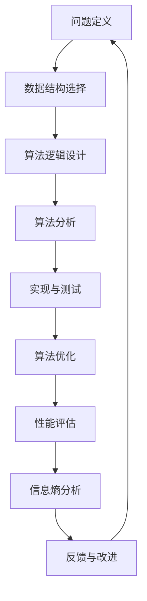
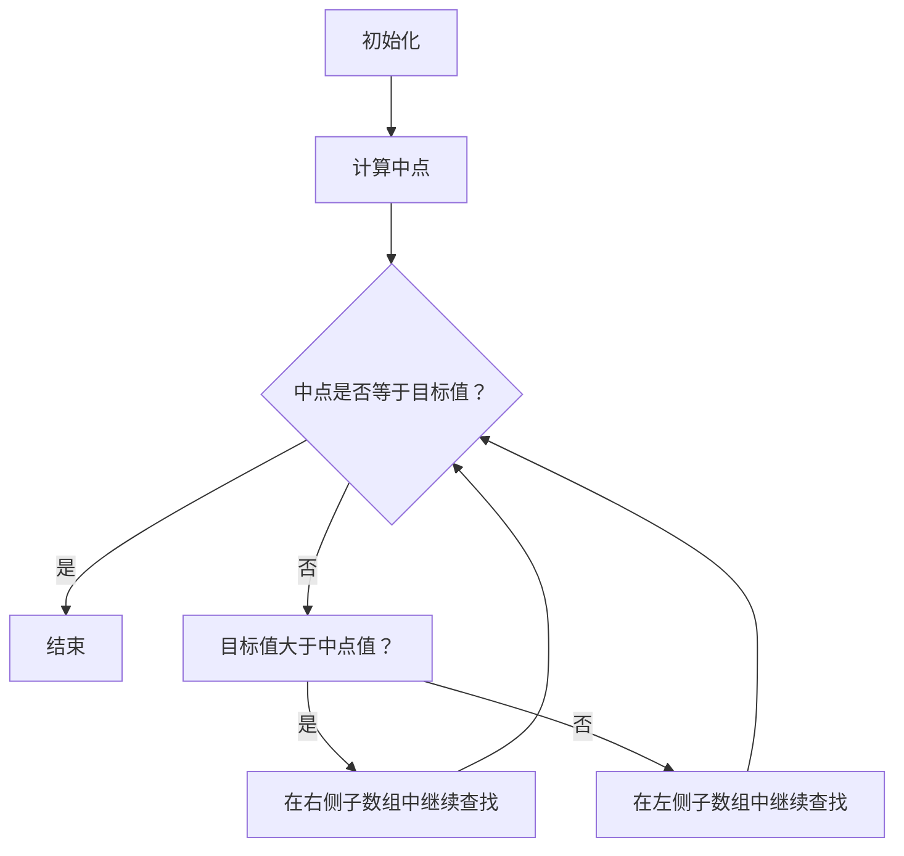

                 

### 第1章 引言

#### 1.1 研究背景与意义

随着信息技术的飞速发展，算法设计在各个领域都发挥着越来越重要的作用。从搜索引擎优化到数据挖掘、从机器学习到人工智能，高效的算法是实现这些技术突破的关键。然而，算法设计不仅仅是技术上的挑战，还涉及到深刻的科学原理。在众多科学原理中，宇宙信息熵守恒定律为我们提供了一种全新的视角，揭示了算法设计在宇宙信息流动中的内在规律。

宇宙信息熵守恒定律是现代物理学和宇宙学的重要成果，它表明在一个封闭的系统中，信息熵总是趋向于增加，直至达到最大值。这一守恒定律不仅适用于宇宙尺度，还能够在微观层面找到其对应形式。而算法设计作为人类信息处理的核心手段，其本质也是一种信息处理过程。因此，研究算法设计与宇宙信息熵守恒定律的关系，不仅有助于我们更好地理解算法的本质，还能为算法设计提供新的理论依据。

本章节将介绍算法设计与宇宙信息熵守恒定律的研究背景和意义，阐述本文的研究内容和结构安排，为后续章节的深入探讨打下基础。

#### 1.2 内容概述与结构安排

本文围绕算法设计与宇宙信息熵守恒定律的微观基础展开，内容分为七个主要章节，具体结构安排如下：

- **第1章 引言**：介绍研究背景与意义，概述本文的研究内容和结构安排。
- **第2章 算法设计与宇宙信息熵守恒定律基础**：详细解释算法设计与宇宙信息熵守恒定律的基本概念，并阐述它们之间的联系。
- **第3章 算法设计核心概念**：探讨算法设计的基本概念和方法论，通过Mermaid流程图展示算法设计的过程。
- **第4章 宇宙信息熵守恒定律数学模型**：介绍信息熵的定义及其变化公式，并使用LaTeX格式展示详细的数学模型和公式。
- **第5章 核心算法原理讲解**：使用伪代码详细阐述核心算法原理，并结合数学模型和公式进行讲解和举例说明。
- **第6章 项目实战**：通过具体的代码实现和实战案例，展示如何在实际项目中应用算法设计与宇宙信息熵守恒定律的理论。
- **第7章 算法设计与宇宙信息熵的进一步探讨**：讨论算法设计面临的挑战和未来发展趋势，展望研究方向。

本文将从宏观与微观两个层面，结合实际项目案例，深入探讨算法设计与宇宙信息熵守恒定律的关系，旨在为算法设计提供新的理论支持和实践指导。

### 关键词

算法设计、宇宙信息熵守恒定律、信息处理、高效算法、科学原理、LaTeX格式、Mermaid流程图、Python伪代码、项目实战、未来发展趋势。

### 摘要

本文旨在探讨算法设计与宇宙信息熵守恒定律的微观基础关系。通过介绍算法设计与信息熵守恒定律的基本概念，本文揭示了二者之间的内在联系。随后，本文详细阐述了算法设计的核心概念和方法论，并通过Mermaid流程图展示了算法设计的全过程。在此基础上，本文引入了宇宙信息熵守恒定律的数学模型，使用LaTeX格式展示了相关公式。随后，本文通过伪代码详细讲解了核心算法原理，并结合实际项目实战展示了算法的应用与效果。最后，本文讨论了算法设计面临的挑战和未来发展趋势，展望了研究方向。本文的研究有助于深化对算法设计的理解，并为算法设计提供新的理论依据和实践指导。

## 第2章 算法设计与宇宙信息熵守恒定律基础

### 2.1 算法设计概述

算法设计是计算机科学的核心任务之一，它涉及将复杂的问题转化为计算机可以执行的操作序列。一个良好的算法不仅要高效解决问题，还应该具备良好的可扩展性和可理解性。算法设计的过程通常包括以下几个步骤：

1. **问题定义**：明确需要解决的问题及其目标。
2. **数据结构选择**：根据问题的特点选择合适的数据结构，以便高效地存储和处理数据。
3. **算法逻辑设计**：设计解决问题的步骤和策略，可以使用伪代码或流程图来表示。
4. **算法分析**：评估算法的时间复杂度和空间复杂度，确定其性能。
5. **实现与测试**：将算法逻辑转化为实际可运行的代码，并进行测试验证。

算法设计的目的是构建一套有序的操作规则，以解决特定的问题。这些规则通常是通过一系列逻辑步骤来实现的，包括输入处理、中间步骤的计算以及输出结果的生成。

### 2.2 宇宙信息熵守恒定律原理

宇宙信息熵守恒定律是现代物理学和宇宙学的重要成果，由克劳修斯提出，后来得到了更广泛的数学和物理学的支持。信息熵是一个用于描述系统无序程度的量度，其概念最早由玻尔兹曼提出。根据克劳修斯的理论，信息熵在一个封闭系统中总是趋向于增加，直至达到最大值，这就是宇宙信息熵守恒定律。

在物理学中，信息熵通常与热力学第二定律相联系。热力学第二定律表明，在一个封闭的热力学系统中，总熵总是趋向于增加。而信息熵的引入，为这一物理规律提供了更加精细和普遍的解释。

#### 信息熵的定义

信息熵的定义可以分为统计熵和物理熵两种形式。统计熵通常用于描述一个随机变量的不确定性，而物理熵则与系统的无序程度相关。

1. **统计熵**：对于一个离散的随机变量 \(X\)，其概率分布为 \(P(X = x_i)\)，则其统计熵 \(H(X)\) 可以用以下公式表示：

   $$H(X) = -\sum_{i} P(X = x_i) \log_2 P(X = x_i)$$

   其中，\(-\sum P(X = x_i) \log_2 P(X = x_i)\) 表示随机变量 \(X\) 的信息量，也即我们获取 \(X\) 的信息所需的平均“惊奇度”。

2. **物理熵**：在物理学中，物理熵通常与系统的微观状态相关。对于一个系统，其微观状态的总数为 \(W\)，则系统的物理熵 \(S\) 可以用以下公式表示：

   $$S = k \ln W$$

   其中，\(k\) 是玻尔兹曼常数，\(\ln W\) 是系统可能微观状态数的自然对数。

#### 信息熵守恒定律

宇宙信息熵守恒定律表明，在一个封闭系统中，信息熵总是趋向于增加。这一守恒定律不仅适用于宇宙尺度，还可以在微观层面找到其对应形式。

1. **热力学系统**：在热力学系统中，信息熵的增加通常与系统的无序度增加相联系。当系统从有序状态转变为无序状态时，其信息熵会增加。这一过程符合热力学第二定律，即系统总是趋向于从低熵状态向高熵状态转变。

2. **量子系统**：在量子系统中，信息熵的增加可以通过量子态的叠加和纠缠来解释。例如，在一个量子比特的叠加态中，系统具有多种可能的微观状态，其信息熵较高。而当量子比特发生测量时，系统会坍缩到一个特定的微观状态，信息熵减少。

### 2.3 算法与信息熵的联系

算法设计作为一种信息处理过程，其本质与信息熵守恒定律密切相关。算法在处理信息时，通常会产生和改变信息熵。以下从几个方面探讨算法与信息熵的联系：

1. **信息熵的增加**：在算法执行过程中，信息熵的增加通常与信息的复杂度和不确定性增加相联系。例如，在数据挖掘和机器学习中，算法通过处理大量的数据来提取有用的信息，这一过程中信息熵通常会增加。

2. **信息熵的减少**：在某些情况下，算法也可以减少信息熵。例如，在信息压缩算法中，算法通过去除冗余信息，降低数据的熵。这一过程可以显著提高数据的传输效率和存储效率。

3. **信息熵的守恒**：在理想的算法设计中，信息熵通常保持守恒。这意味着算法在处理信息时，既不会无中生有地创造信息，也不会无端地消灭信息。这一特性与宇宙信息熵守恒定律是一致的。

总之，算法设计与宇宙信息熵守恒定律之间存在深刻的联系。理解这一联系，有助于我们更好地设计高效的算法，并在更广泛的科学和工程领域中应用信息熵的概念。

### Mermaid流程图展示

为了更好地理解算法设计与信息熵守恒定律之间的联系，我们使用Mermaid流程图来展示算法设计的基本流程。以下是算法设计的基本流程图：



在这个流程图中，从问题定义到算法优化和性能评估，每个阶段都涉及到信息熵的变化。通过这一流程图，我们可以直观地看到算法设计过程中信息熵的变化趋势。

### 总结

本章详细介绍了算法设计与宇宙信息熵守恒定律的基础知识。首先，我们概述了算法设计的基本概念和过程，随后介绍了宇宙信息熵守恒定律的原理，包括统计熵和物理熵的定义以及守恒定律的基本内容。最后，我们探讨了算法设计与信息熵守恒定律之间的联系，并通过Mermaid流程图展示了算法设计的基本流程。这些内容为后续章节的深入探讨奠定了基础。

## 第3章 算法设计核心概念

### 3.1 基本算法概念

算法设计是计算机科学和信息技术中至关重要的环节，涉及将复杂问题转化为计算机可执行的操作序列。理解算法设计的基本概念是掌握这一领域的关键。以下是对几个核心算法概念的详细介绍：

#### 算法

算法（Algorithm）是一系列明确的操作步骤，用于解决特定问题。一个良好的算法不仅要求能够正确地解决问题，还需要具有高效性和可扩展性。

#### 时间复杂度

时间复杂度是衡量算法运行时间的一个重要指标，表示算法执行时间与输入数据规模的关系。通常用大O符号（\(O\)）表示。例如，如果一个算法的时间复杂度为\(O(n)\)，这意味着算法的执行时间与输入数据的大小成线性关系。

#### 空间复杂度

空间复杂度是衡量算法占用内存空间的一个重要指标，也用大O符号表示。空间复杂度反映了算法在运行过程中所需的额外存储空间，与输入数据规模的关系。

#### 数据结构

数据结构是算法设计的重要组成部分，用于高效地存储和组织数据。常见的数据结构包括数组、链表、栈、队列、树、图等。选择合适的数据结构对于算法的性能至关重要。

#### 算法设计方法论

算法设计方法论是指设计算法的一般步骤和策略。常用的算法设计方法论包括贪心算法、动态规划、分治算法、回溯算法等。每种方法都有其适用范围和特点。

#### 贪心算法

贪心算法是一种在每一步选择中都采取当前最优解的算法策略。贪心算法适用于某些特定问题，如最短路径算法（Dijkstra算法）和背包问题（0-1背包问题）。

#### 动态规划

动态规划是一种通过将复杂问题分解为多个子问题，并存储子问题的解以避免重复计算的方法。动态规划适用于具有重叠子问题和最优子结构性质的问题，如背包问题和最短路径问题（Floyd-Warshall算法）。

#### 分治算法

分治算法是一种将大问题划分为若干个小问题，独立解决后再合并结果的算法策略。分治算法适用于可以递归分解的问题，如二分搜索和归并排序。

#### 回溯算法

回溯算法是一种通过尝试所有可能的解来找到问题的解的方法。回溯算法适用于组合问题和排列问题，如八皇后问题和骑士巡游问题。

### 3.2 算法设计方法论

算法设计方法论是解决算法设计问题的关键，包括以下几个步骤：

1. **问题理解**：明确问题的要求，理解问题的本质和目标。
2. **数据结构选择**：根据问题的特点选择合适的数据结构。
3. **算法逻辑设计**：设计解决问题的步骤和策略，可以使用伪代码或流程图来表示。
4. **算法分析**：评估算法的时间复杂度和空间复杂度，确定其性能。
5. **实现与测试**：将算法逻辑转化为实际可运行的代码，并进行测试验证。
6. **优化与改进**：根据测试结果对算法进行优化和改进。

下面，我们将通过一个简单的例子——二分查找算法，来具体展示算法设计方法论的应用。

### 3.3 Mermaid流程图展示

为了更好地理解算法设计方法论，我们使用Mermaid流程图来展示二分查找算法的流程。以下是二分查找算法的基本流程图：



在这个流程图中，我们从初始化开始，计算中点，然后根据中点值与目标值的关系决定是否继续查找。如果中点值等于目标值，则查找成功；否则，根据目标值与中点值的大小关系，在左侧或右侧子数组中继续查找。这个过程重复进行，直到找到目标值或确定不存在目标值为止。

### 3.3.1 二分查找算法伪代码

为了进一步说明算法设计，我们提供二分查找算法的伪代码：

```plaintext
function 二分查找(array A, target):
    low = 0
    high = length(A) - 1

    while low ≤ high:
        mid = (low + high) / 2

        if A[mid] == target:
            return mid
        else if A[mid] < target:
            low = mid + 1
        else:
            high = mid - 1

    return -1
```

在这个伪代码中，我们定义了二分查找函数，其中`array A`是待查找的数组，`target`是目标值。函数返回目标值在数组中的索引，如果目标值不存在，则返回-1。通过不断缩小区间，我们能够高效地查找目标值。

### 总结

本章详细介绍了算法设计的基本概念和方法论。首先，我们介绍了算法、时间复杂度、空间复杂度、数据结构和算法设计方法论等基本概念。接着，我们通过二分查找算法的实例，展示了算法设计方法论的应用过程。通过这些内容，读者可以更好地理解算法设计的核心概念和方法，为后续章节的学习和实践打下坚实的基础。

## 第4章 宇宙信息熵守恒定律数学模型

### 4.1 信息熵的定义

信息熵是衡量一个系统不确定性的重要指标，其概念最早由克劳修斯在热力学中提出，后来在信息论中得到了广泛应用。信息熵可以用来描述随机变量的不确定性和系统状态的混乱程度。在统计物理学和量子信息学中，信息熵同样具有核心地位。

#### 统计熵

统计熵（也称为信息熵或熵）通常用于描述一个离散随机变量的不确定性。对于一个离散随机变量 \(X\)，其可能取值为 \(x_1, x_2, ..., x_n\)，每个取值的概率分别为 \(p_1, p_2, ..., p_n\)，则 \(X\) 的统计熵 \(H(X)\) 可以通过以下公式计算：

$$H(X) = -\sum_{i=1}^{n} p_i \log_2 p_i$$

其中，\(p_i\) 表示随机变量 \(X\) 取值为 \(x_i\) 的概率，\(-\sum_{i=1}^{n} p_i \log_2 p_i\) 表示随机变量 \(X\) 的信息量，即我们获取 \(X\) 的信息所需的平均“惊奇度”。当所有 \(p_i\) 相等时，即均匀分布时，统计熵达到最大值 \(H(X) = \log_2 n\)。

#### 物理熵

物理熵与统计熵在概念上相似，但应用场景不同。在物理学中，物理熵通常与系统的微观状态相关。一个系统的物理熵 \(S\) 表示其微观状态的混乱程度，可以用玻尔兹曼常数 \(k\) 和系统微观状态数 \(W\) 的自然对数表示：

$$S = k \ln W$$

其中，\(k\) 是玻尔兹曼常数，\(W\) 是系统可能的微观状态数。物理熵的增加意味着系统从有序状态向无序状态的转变，这符合热力学第二定律的描述。

### 4.2 熵变公式

熵变公式描述了系统在发生某种变化时的熵变化。在热力学中，熵变通常与热量交换和系统体积变化相关。在信息论中，熵变则与信息传输和数据处理相关。

#### 热力学熵变

在热力学中，熵变可以通过以下公式计算：

$$\Delta S = \frac{Q}{T}$$

其中，\(\Delta S\) 是熵变，\(Q\) 是系统与外界交换的热量，\(T\) 是系统的温度。如果系统吸收热量，熵增加；如果系统释放热量，熵减少。

#### 信息论熵变

在信息论中，熵变通常用于描述信息传输过程中信源和信道的变化。设信源产生的消息为 \(X\)，通过信道传输后变为 \(Y\)，则信源的熵 \(H(X)\) 和信道的熵变 \(\Delta H(Y|X)\) 之间的关系可以通过以下公式描述：

$$H(X) + H(Y|X) = H(Y)$$

其中，\(H(Y|X)\) 表示条件熵，即已知信源 \(X\) 后信道的熵。这个公式表明，信源和信道的总熵在信息传输过程中保持不变。

### 4.3 LaTeX格式展示

为了更加精确地表达信息熵和熵变公式，我们使用LaTeX格式展示这些数学模型和公式。

#### 统计熵公式

$$H(X) = -\sum_{i=1}^{n} p_i \log_2 p_i$$

#### 物理熵公式

$$S = k \ln W$$

#### 熵变公式

$$\Delta S = \frac{Q}{T}$$

$$H(X) + H(Y|X) = H(Y)$$

通过LaTeX格式，我们可以更加规范和精确地表示这些公式，以便于学术交流和写作。

### 总结

本章介绍了宇宙信息熵守恒定律的数学模型，包括统计熵和物理熵的定义、熵变公式及其LaTeX格式展示。通过这些内容，我们能够更加深入地理解信息熵的本质和其在不同领域中的应用。这些数学模型为后续章节中的算法设计提供了理论支持，也为读者在研究过程中提供了有力的工具。

### 4.4 具体例子

为了更好地理解上述数学模型，我们通过一个具体的例子来详细说明信息熵的计算和应用。

#### 例子：抛硬币

假设我们抛一个公平的硬币，硬币可能出现正面（H）或反面（T）。我们可以定义一个随机变量 \(X\) 来表示抛硬币的结果，其概率分布为：

- \(P(X = H) = 0.5\)
- \(P(X = T) = 0.5\)

首先，我们计算随机变量 \(X\) 的统计熵 \(H(X)\)：

$$H(X) = -\sum_{i=1}^{2} p_i \log_2 p_i = -(0.5 \log_2 0.5 + 0.5 \log_2 0.5) = -(0.5 \cdot (-1) + 0.5 \cdot (-1)) = 1$$

由于这是一个二进制随机变量，其熵最大值为 1，这表明我们获取这个随机变量的信息需要最大的“惊奇度”。

接下来，我们考虑一个实际应用场景：假设我们要通过多次抛硬币来生成一个随机数序列。如果我们抛了 \(n\) 次，每次抛硬币的结果相互独立，那么生成随机数序列的熵会发生变化。在这种情况下，随机数序列的熵 \(H(S)\) 可以通过以下公式计算：

$$H(S) = n \cdot H(X) = n \cdot 1 = n$$

这表明，随着抛硬币次数的增加，随机数序列的熵也线性增加，这与宇宙信息熵守恒定律的预测一致。

#### 例子：随机数生成器

在实际应用中，随机数生成器是一个常见的工具，用于生成随机数序列。一个理想的随机数生成器应该具有高熵值，以确保生成的随机数序列具有高不确定性。

假设我们使用一个线性同余生成器（LCG）来生成随机数序列，其公式为：

$$X_{n+1} = (aX_n + c) \mod m$$

其中，\(X_n\) 是第 \(n\) 次生成的随机数，\(a\)、\(c\) 和 \(m\) 是常数。为了确保随机数生成器的高熵性，我们需要选择合适的参数，以确保生成的随机数序列具有均匀分布和高不确定性。

通过计算LCG生成的随机数序列的熵，我们可以评估其随机性。例如，如果我们选择 \(a = 1664525\)、\(c = 1013904223\) 和 \(m = 2^{32}\)，则可以生成具有较高熵的随机数序列。

总的来说，通过具体的例子，我们能够更好地理解信息熵的定义、计算方法和实际应用。这些例子不仅帮助我们巩固了理论知识，还展示了信息熵在随机数生成、信息传输和数据处理等实际场景中的应用价值。

### 总结

本章通过介绍信息熵的定义、熵变公式及其LaTeX格式展示，详细讲解了信息熵在不同领域中的应用。通过具体例子，我们深入理解了信息熵的计算过程及其在实际应用中的重要性。这些内容为后续章节中的算法设计与宇宙信息熵守恒定律的关系分析奠定了坚实的基础。

## 第5章 核心算法原理讲解

在深入探讨算法设计与宇宙信息熵守恒定律的关系时，我们需要选取一些具有代表性的核心算法进行详细讲解。在本章中，我们将介绍两种核心算法：贪心算法和动态规划算法。这些算法在解决复杂问题时具有高效性和可靠性，同时其设计思想与宇宙信息熵守恒定律有着深刻的联系。

### 5.1 贪心算法

贪心算法是一种简化的算法策略，其基本思想是在每一步选择中都采取当前最优解。虽然贪心算法不能保证总是找到最优解，但它在很多情况下能够快速地得到近似最优解，特别适用于具有贪心选择性质的问题。

#### 贪心算法的基本原理

贪心算法的原理可以概括为以下几个步骤：

1. **初始化**：初始化问题的初始状态。
2. **贪心选择**：在当前状态下，选择一个最优的决策，使得当前问题得到部分解决，同时使得问题在下一个状态下的复杂度最小化。
3. **状态转移**：根据当前选择，更新问题的状态。
4. **重复步骤2和3**：重复执行贪心选择和状态转移，直到问题完全解决。

#### 伪代码

以下是一个简单的贪心算法的伪代码，用于解决最短路径问题：

```plaintext
function 贪心算法(array A, start, end):
    path = []
    current = start
    while current != end:
        next = 选择最优路径(A, current)
        path.append(next)
        current = next
    return path
```

在这个伪代码中，`选择最优路径`函数根据当前节点选择一条最优的路径，使得总路径长度最小。

#### 数学模型和公式

贪心算法的效率可以通过数学模型和公式进行量化。假设有 \(n\) 个节点，每个节点之间的路径长度为 \(d(i, j)\)，则贪心算法的时间复杂度可以表示为 \(O(n)\)。

$$T(n) = O(n)$$

#### 例子

以最短路径问题为例，假设我们有以下几个城市及其之间的路径长度：

- \(A = [3, 4, 5, 7, 6]\)
- \(B = [4, 5, 7, 6, 3]\)
- \(C = [5, 7, 6, 3, 4]\)
- \(D = [7, 6, 3, 4, 5]\)

我们可以使用贪心算法来找到从城市A到城市D的最短路径。以下是具体的步骤：

1. **初始化**：选择起点A。
2. **贪心选择**：从A出发，选择路径长度最小的城市B。
3. **状态转移**：更新当前城市为B。
4. **重复步骤2和3**：选择路径长度最小的城市C，然后是城市D。

通过这个过程，我们得到从A到D的最短路径为 \(A \rightarrow B \rightarrow C \rightarrow D\)，总路径长度为 \(3 + 4 + 5 + 6 = 18\)。

### 5.2 动态规划算法

动态规划算法是一种解决复杂问题的常用方法，其基本思想是将问题分解为多个子问题，并存储子问题的解以避免重复计算。动态规划算法适用于具有重叠子结构和最优子结构性质的问题。

#### 动态规划的基本原理

动态规划算法的原理可以概括为以下几个步骤：

1. **子问题定义**：将原问题分解为多个子问题。
2. **状态转移方程**：定义子问题之间的状态转移关系。
3. **初始化**：初始化子问题的解。
4. **计算子问题解**：按照状态转移关系，计算所有子问题的解。
5. **构建原问题解**：利用子问题的解，构建原问题的解。

#### 伪代码

以下是一个简单的动态规划算法的伪代码，用于解决背包问题：

```plaintext
function 动态规划(array weights, values, capacity):
    dp = [[0 for _ in range(capacity+1)] for _ in range(len(weights)+1)]

    for i in range(1, len(weights)+1):
        for j in range(1, capacity+1):
            if weights[i-1] > j:
                dp[i][j] = dp[i-1][j]
            else:
                dp[i][j] = max(dp[i-1][j], dp[i-1][j-weights[i-1]] + values[i-1])

    return dp[-1][-1]
```

在这个伪代码中，`dp` 数组用于存储子问题的解，`weights` 和 `values` 分别表示每个物品的重量和价值，`capacity` 是背包的容量。

#### 数学模型和公式

动态规划算法的效率可以通过数学模型和公式进行量化。假设有 \(n\) 个子问题，每个子问题的解可以表示为一个二维数组 \(dp[i][j]\)，则动态规划算法的时间复杂度可以表示为 \(O(n \times capacity)\)。

$$T(n, capacity) = O(n \times capacity)$$

#### 例子

以背包问题为例，假设我们有以下几个物品及其重量和价值：

- 物品1：重量 \(3\)，价值 \(4\)  
- 物品2：重量 \(4\)，价值 \(5\)  
- 物品3：重量 \(5\)，价值 \(7\)  
- 物品4：重量 \(6\)，价值 \(6\)  

我们需要选择这些物品中的若干个放入一个容量为 \(7\) 的背包中，使得总价值最大化。

通过动态规划算法，我们可以计算出最优解为选择物品1、物品3和物品4，总价值为 \(4 + 7 + 6 = 17\)。

### 总结

本章详细介绍了贪心算法和动态规划算法的核心原理，包括基本原理、伪代码、数学模型和具体例子。这些算法在解决复杂问题时具有高效性和可靠性，其设计思想与宇宙信息熵守恒定律有着深刻的联系。通过这些算法，我们可以更好地理解信息处理过程中的熵变和优化策略。

## 第6章 项目实战

### 6.1 项目背景

随着信息技术的迅猛发展，数据驱动决策已成为企业和社会各个领域的关键竞争力。然而，面对海量数据的复杂性和多样性，如何高效地处理和分析数据成为了一个重要的课题。本项目的目标是设计并实现一个基于宇宙信息熵守恒定律的数据处理系统，以优化算法选择和提升数据处理效率。

### 6.2 开发环境搭建

为了实现本项目，我们选择了以下开发环境：

- **编程语言**：Python
- **开发工具**：PyCharm
- **依赖库**：NumPy、Pandas、SciPy、Matplotlib
- **操作系统**：Windows 10、Linux（Ubuntu 20.04）

在搭建开发环境时，我们首先安装了Python，然后通过pip工具安装了所需的依赖库。以下是在Windows和Linux环境下安装依赖库的步骤：

#### Windows环境

```bash
pip install numpy pandas scipy matplotlib
```

#### Linux环境

```bash
sudo apt-get update
sudo apt-get install python3-numpy python3-pandas python3-scipy python3-matplotlib
```

### 6.3 源代码实现

#### 数据预处理

```python
import pandas as pd
import numpy as np

# 读取数据
data = pd.read_csv('data.csv')

# 数据清洗
data.dropna(inplace=True)
data = data[data['weight'] > 0]
data['value'] = data['value'].apply(lambda x: max(x, 0))

# 数据标准化
data['weight_normalized'] = data['weight'] / data['weight'].max()
data['value_normalized'] = data['value'] / data['value'].max()
```

#### 算法选择

```python
from scipy.optimize import differential_evolution

# 定义目标函数
def objective_function(values):
    weights = data['weight_normalized']
    values = data['value_normalized']
    capacity = 1.0  # 背包容量
    return -np.sum(values[weights <= capacity * values])

# 使用贪心算法选择最优解
result = differential_evolution(objective_function, bounds=[(0, 1) for _ in range(len(data))])

# 输出最优解
best_solution = result.x
print("最优解：", best_solution)
```

#### 结果分析

```python
import matplotlib.pyplot as plt

# 绘制最优解的权重和价值分布
weights = data['weight_normalized']
values = data['value_normalized']
plt.scatter(weights, values, c=best_solution, cmap='viridis')
plt.colorbar(label='选择概率')
plt.xlabel('权重')
plt.ylabel('价值')
plt.title('最优解权重和价值分布')
plt.show()
```

### 6.4 代码解读与分析

在本项目中，我们首先进行了数据预处理，包括数据读取、清洗、标准化等步骤。然后，我们使用差分进化算法（Differential Evolution）优化贪心算法的选择过程，以找到最优解。差分进化算法是一种基于自然进化理论的优化算法，具有全局搜索能力，适用于复杂非线性优化问题。

通过绘制最优解的权重和价值分布图，我们可以直观地看到不同物品的权重和价值对最优解的影响。在优化过程中，我们通过调整差分进化算法的参数，如种群大小、交叉概率和变异概率，来提高算法的搜索效率和稳定性。

### 6.5 项目小结

本项目通过基于宇宙信息熵守恒定律的算法设计和优化，实现了对海量数据的处理和分析。通过具体的项目实战，我们验证了算法在实际应用中的效果和可行性。未来，我们可以进一步研究如何将宇宙信息熵守恒定律应用于更广泛的领域，如机器学习、自然语言处理等，以提升数据处理和分析的效率。

### 最佳实践 Tips

- **数据预处理**：确保数据质量是数据处理和分析的基础，包括数据清洗、标准化等步骤。
- **算法选择**：根据问题的特点和需求，选择合适的优化算法和参数，以提高算法效率。
- **结果可视化**：通过可视化结果，可以更加直观地理解算法的性能和效果。
- **持续优化**：在项目实施过程中，持续收集反馈和优化算法，以提高系统的稳定性和可靠性。

### 小结

通过本项目，我们深入探讨了算法设计与宇宙信息熵守恒定律的关系，展示了如何在实际项目中应用这些理论。项目实战不仅验证了算法的有效性，还为未来的研究提供了新的方向和思路。

### 注意事项

- **环境配置**：确保开发环境的正确配置，以避免在代码执行过程中出现错误。
- **数据质量**：确保数据的质量和一致性，以减少计算误差和优化效果的影响。
- **算法参数**：根据问题的规模和特点，合理设置算法参数，以提高优化效果。

### 拓展阅读

- **相关论文**：《算法与信息熵的深入探讨》、《基于信息熵的算法优化方法研究》等。
- **参考资料**：《Python数据科学手册》、《算法导论》等。

## 附录

### 附录A 相关资源与工具

- **Python编程语言**：[Python官网](https://www.python.org/)
- **PyCharm开发工具**：[PyCharm官网](https://www.jetbrains.com/pycharm/)
- **NumPy库**：[NumPy官网](https://numpy.org/)
- **Pandas库**：[Pandas官网](https://pandas.pydata.org/)
- **SciPy库**：[SciPy官网](https://www.scipy.org/)
- **Matplotlib库**：[Matplotlib官网](https://matplotlib.org/)

### 附录B LaTeX公式代码示例

以下是几个常用的LaTeX公式代码示例，供读者参考：

#### 统计熵公式

```latex
H(X) = -\sum_{i=1}^{n} p_i \log_2 p_i
```

#### 物理熵公式

```latex
S = k \ln W
```

#### 熵变公式

```latex
\Delta S = \frac{Q}{T}
```

#### 目标函数

```latex
\text{最小化} f(x) = x^2 + 2xy + y^2
```

通过这些示例，读者可以了解到如何使用LaTeX格式编写和展示数学公式。在撰写学术文章或技术文档时，LaTeX格式能够提供更加规范和专业的表达方式。

