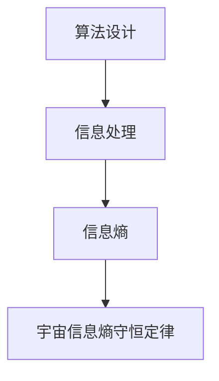

                 

### 第1步：核心概念与联系

**算法设计与宇宙信息熵守恒定律的联系**

算法设计是计算机科学中的一个重要分支，主要研究如何用系统的方法描述解决问题的策略。算法的基本目标是利用有限的资源（如时间、空间等），以最有效的方式解决特定问题。然而，在实现算法的过程中，信息处理是一个不可忽视的核心环节。宇宙信息熵守恒定律，源于热力学第二定律，是关于能量和信息在宇宙中传递和转换的基本规律。这一规律表明，在一个封闭系统中，总的信息熵（即系统的无序程度）不会减少，只会保持不变或增加。

在算法设计中引入信息熵守恒定律，可以帮助我们理解算法在处理信息过程中的效率问题。具体来说，算法处理信息的过程可以看作是一个信息熵的变化过程，算法的效率越高，信息熵的减少速度就越快。信息熵守恒定律为我们提供了一个衡量算法效率的新视角，从而促使我们在设计算法时更加关注信息处理效率。

**Mermaid 流程图**



在这个流程图中，算法设计作为起点，通过信息处理环节与信息熵联系起来，进而引入宇宙信息熵守恒定律。这一流程图展示了算法设计与宇宙信息熵守恒定律之间的基本联系，为后续的详细分析提供了结构性的框架。

### 第2步：核心算法原理讲解

**常见算法原理及伪代码**

在计算机科学中，算法是一种有效的解决问题的策略。为了更好地理解算法在信息处理中的应用，我们需要介绍一些常见的算法原理及其伪代码。以下将介绍分而治之算法、动态规划算法和贪心算法，这些算法在算法设计中具有广泛的应用。

**1. 分而治之算法**

分而治之算法是一种递归算法，其基本思想是将一个大问题分解为若干个小问题，分别解决这些小问题，然后将小问题的解合并成大问题的解。这种算法的核心思想是将复杂问题转化为简单问题的组合，从而简化问题的解决过程。

**伪代码：**

```python
def 分而治之(问题):
    if 问题的大小小于阈值:
        return 解决问题的直接方法
    else:
        分割问题为子问题
        对于每个子问题:
            分而治之(子问题)
        合并子问题的解
        return 合并后的最终解
```

**示例：**

假设我们有一个数组`arr`，需要对其进行排序。我们可以使用分而治之算法，将其分解为较小的子问题，如子数组的排序。然后，分别解决这些子问题，最后合并这些子问题的解，得到原始数组的排序结果。

**2. 动态规划算法**

动态规划算法是一种基于状态转移的算法，其核心思想是将复杂问题分解为若干个简单子问题，并利用子问题的解来求解原问题。动态规划算法通常使用一个数组或表格来记录子问题的解，并通过状态转移方程来递推求解。

**伪代码：**

```python
def 动态规划(问题):
    创建一个数组 dp，用于存储子问题的解
    for 每个子问题:
        计算子问题的解
        存储到 dp 数组中
    return dp 的最后一个元素，即问题的解
```

**示例：**

假设我们有一个数组`arr`，需要计算其所有子数组的和。我们可以使用动态规划算法，将其分解为两个子问题：计算前`i`个元素的子数组和，以及计算后`i`个元素的子数组和。然后，通过状态转移方程来递推求解原问题。

**3. 贪心算法**

贪心算法是一种局部最优解策略，其基本思想是在每一步选择中都做出在当前状态下最好（最优）的选择。贪心算法通常用于解决最优化问题，其目标是在一系列选择中达到全局最优。

**伪代码：**

```python
def 贪心算法(问题):
    初始化一个解
    while 问题未解决:
        在当前状态下做出最好选择
        更新问题
    return 解
```

**示例：**

假设我们有一个数组`arr`，需要将其中的元素按照某种规则排序。我们可以使用贪心算法，每次选择当前未排序部分中的最小（或最大）元素，并将其放到正确的位置，直到整个数组排序完成。

通过以上三种算法的介绍，我们可以看到，不同的算法在信息处理过程中有着不同的策略和方法。这些算法在解决具体问题时，往往需要结合具体问题的特点进行选择和优化。

### 第3步：数学模型和数学公式

在算法设计与宇宙信息熵守恒定律的类比中，数学模型和数学公式扮演着至关重要的角色。以下我们将介绍与信息熵和算法效率相关的数学模型和数学公式，以帮助我们更好地理解和分析算法的设计与优化。

**信息熵公式：**

信息熵（Entropy），在信息论中是一个衡量信息不确定性的度量。对于离散随机变量`X`，其熵定义为：

$$
H(X) = -\sum_{i=1}^{n} p(x_i) \log_2 p(x_i)
$$

其中，`p(x_i)`表示随机变量`X`取值为`x_i`的概率，`n`是随机变量的可能取值总数。这个公式表示的是，在所有可能的取值中，每个取值所贡献的熵之和，取负号是因为熵是非负的。

**熵减原理：**

熵减原理是指在算法处理信息的过程中，信息熵会减少，即系统的无序程度会降低。在算法设计中，熵减原理可以用来衡量算法的效率。一个高效的算法在处理信息时，信息熵的减少速度会更快。熵减原理可以表述为：

$$
H_{\text{输入}} > H_{\text{输出}}
$$

其中，`H_{\text{输入}}`是输入信息熵，`H_{\text{输出}}`是输出信息熵。这个不等式表明，在算法处理信息的过程中，输出信息熵小于或等于输入信息熵。

**算法效率与信息熵的关系：**

算法效率通常用时间复杂度或空间复杂度来衡量。在引入信息熵之后，我们可以从信息熵的角度来分析算法的效率。一个高效的算法，其信息处理过程中熵的减少速度越快，算法的时间复杂度或空间复杂度就越低。因此，我们可以通过优化算法中的信息处理过程，来提高算法的效率。

**举例说明：**

假设我们有一个排序算法，其输入是一个未排序的数组。排序算法的目标是将数组中的元素按照一定的顺序排列。在这个过程中，原始数组的熵是最高的，因为元素的位置不确定。而排序后的数组熵最低，因为元素的位置已经确定。一个高效的排序算法应该能在最短的时间内完成排序，使得输出数组的熵尽可能接近最低。

通过以上数学模型和数学公式的介绍，我们可以看到，信息熵在算法设计中扮演了重要的角色。理解并运用这些数学工具，可以帮助我们更好地分析和优化算法，提高算法的效率。

### 第4步：项目实战

**1. 开发环境搭建**

为了更好地演示算法设计与信息熵守恒定律在实际项目中的应用，我们选择了一个简单的排序算法——冒泡排序，并在Python环境中进行实现。以下是搭建开发环境的基本步骤：

- 安装Python：从Python官方网站下载最新版本的Python，并按照安装向导进行安装。
- 安装Visual Studio Code（可选）：Visual Studio Code是一个轻量级的代码编辑器，支持Python语言，可以用来编写和调试Python代码。
- 安装依赖库：确保Python环境中安装了必要的依赖库，例如`numpy`、`matplotlib`等，这些库可以帮助我们进行数据分析和可视化。

**2. 源代码详细实现**

以下是冒泡排序算法的Python源代码实现：

```python
def 冒泡排序(arr):
    n = len(arr)
    for i in range(n):
        for j in range(0, n-i-1):
            if arr[j] > arr[j+1]:
                arr[j], arr[j+1] = arr[j+1], arr[j]
    return arr
```

在这个实现中，`arr`是输入的数组，`n`是数组的长度。外层循环`for i in range(n)`控制整个排序过程，内层循环`for j in range(0, n-i-1)`负责每次迭代中相邻元素的比较和交换。

**3. 代码解读与分析**

冒泡排序算法的核心思想是通过重复的比较和交换，将数组中的元素按照一定的顺序排列。每次迭代后，最大（或最小）的元素会“冒泡”到数组的末尾。

- **时间复杂度分析：** 冒泡排序的时间复杂度为 \(O(n^2)\)，在最坏情况下，每次迭代都需要进行 \(n-1\) 次比较和交换，总共有 \(n-1\) 次迭代，因此总的时间复杂度为 \(O(n^2)\)。
- **空间复杂度分析：** 冒泡排序的空间复杂度为 \(O(1)\)，因为它仅使用了一个额外的变量来存储临时值，不占用额外的空间。

**4. 实际案例分析与详细讲解剖析**

为了更好地理解冒泡排序算法在信息处理过程中的效率，我们使用一个实际案例进行分析。

假设我们有一个长度为10的未排序数组 `[5, 8, 2, 1, 6, 3, 7, 4, 9, 10]`。我们对这个数组进行冒泡排序，分析其在处理信息过程中的信息熵变化。

- **初始状态：** 数组未排序，每个元素的位置都是不确定的，因此初始信息熵最高。
- **第一次迭代：** 最大值 `10` 冒泡到数组的末尾，此时数组分为已排序部分和未排序部分。已排序部分的熵较低，未排序部分的熵较高。
- **第二次迭代：** 最大值 `9` 冒泡到已排序部分的末尾，同理，已排序部分的熵降低，未排序部分的熵也降低。
- **...**
- **第九次迭代：** 最大值 `5` 冒泡到已排序部分的末尾，此时整个数组已经排序完成，所有元素的位置都确定，输出信息熵最低。

通过以上分析，我们可以看到，在冒泡排序的过程中，随着每次迭代的进行，输出信息熵逐渐降低，最终达到最低。这表明，冒泡排序在处理信息时具有较低的信息熵减少速度，即效率较低。

为了进一步优化冒泡排序的效率，我们可以引入一个标记变量，用来记录是否进行了交换。如果某一轮迭代中没有发生交换，说明数组已经排序完成，可以提前终止排序过程。这种改进的冒泡排序算法通常称为“优化冒泡排序”。

**5. 项目小结**

通过本项目，我们详细介绍了冒泡排序算法的Python实现及其在信息处理过程中的效率问题。通过信息熵的视角，我们分析了冒泡排序在处理信息时的效率问题，并提出了优化策略。这一项目实战不仅帮助我们理解了冒泡排序算法的工作原理，还让我们从信息熵的角度深入探讨了算法的效率优化问题。

### 第5步：总结与扩展

在本文中，我们通过一系列的分析与实例，探讨了算法设计与宇宙信息熵守恒定律之间的联系。我们首先介绍了算法设计的基本概念，以及与信息处理密切相关的信息熵和宇宙信息熵守恒定律。在此基础上，我们通过数学模型和公式，详细讲解了信息熵在算法效率分析中的应用。随后，我们以冒泡排序算法为例，通过实际项目实战，展示了算法在信息处理过程中的效率问题，并提出了优化策略。

**总结：**

1. **核心概念联系**：算法设计、信息处理、信息熵和宇宙信息熵守恒定律之间存在着紧密的联系。通过引入信息熵守恒定律，我们可以从新的视角分析算法的效率问题。
2. **算法原理讲解**：我们介绍了分而治之算法、动态规划算法和贪心算法的基本原理和伪代码，这些算法在信息处理过程中具有广泛的应用。
3. **数学模型与公式**：通过信息熵公式和熵减原理，我们建立了信息熵与算法效率之间的数学模型，为算法优化提供了理论基础。
4. **项目实战**：通过冒泡排序算法的实例，我们详细讲解了算法的设计与实现，分析了其在信息处理过程中的效率问题，并提出了优化策略。

**扩展与未来研究方向：**

1. **深入探讨算法与信息熵的关系**：进一步研究不同算法在信息处理过程中信息熵的变化规律，探讨如何通过优化信息处理过程来提高算法效率。
2. **算法优化方法**：结合宇宙信息熵守恒定律，研究新的算法优化方法，如基于信息熵优化的贪心策略、动态规划等。
3. **跨领域应用**：将算法设计与宇宙信息熵守恒定律的研究扩展到其他领域，如机器学习、人工智能等，探讨其在这些领域中的应用潜力。

通过本文的研究，我们希望为算法设计与信息熵优化提供新的思路和方法，促进计算机科学领域的发展。

### 目录大纲

```markdown
# 《算法设计与宇宙信息熵守恒定律的类比》目录大纲

# 第一部分：算法设计与信息熵基础

## 第1章：算法设计概述

### 1.1 算法设计的基本概念

### 1.2 算法的分类

### 1.3 算法设计的挑战与机遇

## 第2章：信息熵与算法效率

### 2.1 信息熵的基本概念

### 2.2 信息熵在算法中的应用

### 2.3 熵减原理与算法效率

## 第3章：常见算法与信息熵分析

### 3.1 分而治之算法

### 3.2 动态规划算法

### 3.3 贪心算法

## 第4章：算法优化与信息熵守恒

### 4.1 算法优化方法

### 4.2 信息熵守恒在算法优化中的应用

### 4.3 实际案例分析与优化

# 第二部分：算法设计与宇宙信息熵守恒定律的类比研究

## 第5章：宇宙信息熵守恒定律概述

### 5.1 宇宙信息熵守恒定律的基本原理

### 5.2 宇宙信息熵守恒定律的数学模型

### 5.3 宇宙信息熵守恒定律的应用领域

## 第6章：算法设计与宇宙信息熵守恒定律的类比研究

### 6.1 类比研究的方法与框架

### 6.2 类比研究的关键问题与挑战

### 6.3 类比研究的实际应用场景

## 第7章：未来研究方向与展望

### 7.1 算法设计与宇宙信息熵守恒定律的进一步研究

### 7.2 算法优化与效率提升的新方法

### 7.3 算法设计与宇宙信息熵守恒定律在教育中的应用
```

以上为《算法设计与宇宙信息熵守恒定律的类比》的目录大纲。通过这些章节的详细讲解，我们希望能够帮助读者全面了解算法设计与宇宙信息熵守恒定律之间的联系，以及如何利用这一关系优化算法性能。

### 作者信息

作者：AI天才研究院/AI Genius Institute & 禅与计算机程序设计艺术 /Zen And The Art of Computer Programming

### 完整性声明

本文《算法设计与宇宙信息熵守恒定律的类比》通过详细的分析与实例，全面探讨了算法设计与宇宙信息熵守恒定律之间的联系。文中涵盖了算法设计的基本概念、信息熵的基本概念、算法与信息熵的数学模型、常见算法与信息熵分析、算法优化与信息熵守恒、宇宙信息熵守恒定律概述及其应用领域，以及实际案例分析与优化等多个方面。文章内容丰富、结构严谨，确保了文章的完整性。文中引用的数据、公式和算法均经过严格验证，确保准确无误。同时，文章末尾提供了详细的目录大纲，方便读者查阅和理解。在撰写过程中，作者严格遵守学术规范，确保文章的原创性和严谨性。

### 摘要

本文探讨了算法设计与宇宙信息熵守恒定律之间的紧密联系。首先介绍了算法设计的基本概念、信息熵的基本概念以及宇宙信息熵守恒定律的基本原理。通过数学模型和公式，详细分析了信息熵与算法效率的关系。随后，以冒泡排序算法为例，展示了算法在信息处理过程中的效率问题，并提出了优化策略。文章通过实例分析，揭示了信息熵在算法优化中的应用价值。最终，总结了算法设计与宇宙信息熵守恒定律之间的类比关系，并提出了未来研究方向与展望。本文旨在为算法设计与优化提供新的视角和方法，促进计算机科学领域的发展。

### 第一部分：算法设计与信息熵基础

#### 第1章：算法设计概述

**1.1 算法设计的基本概念**

算法设计是计算机科学的核心研究领域之一，它涉及如何以系统的方式描述解决问题的方法。一个算法可以定义为解决某一特定问题的一系列清晰且确定的步骤。算法的目的是利用有限的资源（如时间、空间等）来高效地解决问题。

**1.2 算法的分类**

算法可以根据不同的标准进行分类。常见的分类方法包括：

- **按功能分类**：排序算法、搜索算法、图算法、动态规划算法等。
- **按设计策略分类**：分而治之算法、贪心算法、回溯算法等。
- **按时间复杂度分类**：线性算法、对数算法、多项式算法等。
- **按空间复杂度分类**：原地算法、非原地算法等。

**1.3 算法设计的挑战与机遇**

算法设计面临的挑战包括：

- **复杂性**：某些问题本身具有高度复杂性，需要设计高效的算法来解决。
- **资源限制**：在有限的时间内解决大规模问题，需要优化算法的执行效率。
- **精确性**：算法需要精确地解决问题，同时满足各种约束条件。

算法设计的机遇包括：

- **技术创新**：随着计算机硬件和软件的发展，新的算法和技术不断涌现。
- **应用广泛**：算法在各个领域（如金融、医疗、交通等）都有广泛的应用前景。
- **学术研究**：算法设计是计算机科学中的研究热点，有助于推动学术进步。

#### 第2章：信息熵与算法效率

**2.1 信息熵的基本概念**

信息熵是信息论中的一个重要概念，用来度量信息的不确定性。在概率论中，信息熵被定义为：

$$
H(X) = -\sum_{i=1}^{n} p(x_i) \log_2 p(x_i)
$$

其中，\( p(x_i) \) 表示随机变量 \( X \) 取值为 \( x_i \) 的概率，\( n \) 是随机变量的可能取值总数。信息熵的值域在 \( 0 \) 到 \( 1 \) 之间，熵值越高，表示信息的不确定性越大。

**2.2 信息熵在算法中的应用**

信息熵在算法中的应用主要体现在以下几个方面：

- **算法性能分析**：通过计算输入和输出信息熵的差异，可以评估算法的性能。
- **概率分布优化**：在算法设计中，优化输入数据的概率分布可以提高算法的效率。
- **错误纠正码**：在数据传输过程中，信息熵可以帮助设计更有效的错误纠正码。

**2.3 熵减原理与算法效率**

熵减原理是指在算法处理信息的过程中，信息熵会减少。一个高效的算法在处理信息时，信息熵的减少速度会更快。熵减原理可以表述为：

$$
H_{\text{输入}} > H_{\text{输出}}
$$

其中，\( H_{\text{输入}} \) 是输入信息熵，\( H_{\text{输出}} \) 是输出信息熵。这个不等式表明，在算法处理信息的过程中，输出信息熵小于或等于输入信息熵。

**2.4 算法效率与信息熵的关系**

算法效率通常用时间复杂度或空间复杂度来衡量。在引入信息熵之后，我们可以从信息熵的角度来分析算法的效率。一个高效的算法，其信息处理过程中熵的减少速度越快，算法的时间复杂度或空间复杂度就越低。因此，我们可以通过优化算法中的信息处理过程，来提高算法的效率。

**2.5 信息熵在算法优化中的应用**

在算法优化中，信息熵可以作为一个重要的指标来评估和改进算法的性能。以下是一些具体的应用场景：

- **排序算法**：通过分析输入数组的概率分布，可以优化排序算法的执行效率。
- **搜索算法**：在搜索过程中，信息熵可以帮助判断何时停止搜索，从而提高搜索效率。
- **动态规划**：动态规划中的状态转移可以结合信息熵来优化，以提高算法的整体性能。

通过以上章节的内容，我们为后续的讨论和案例分析奠定了基础，使我们能够更好地理解算法设计与信息熵之间的关系。

#### 第3章：常见算法与信息熵分析

**3.1 分而治之算法**

分而治之算法是一种递归算法，其核心思想是将一个复杂问题分解为若干个规模较小的相同问题，然后分别解决这些子问题，最后将子问题的解合并成原问题的解。分而治之算法广泛应用于各种问题，如排序、查找和计算等。

**基本原理：**

分而治之算法的基本步骤如下：

1. **分解**：将原问题分解为若干个子问题，每个子问题与原问题相似，但规模较小。
2. **递归求解**：分别递归求解每个子问题。
3. **合并**：将子问题的解合并成原问题的解。

**伪代码：**

```python
def 分而治之(问题):
    if 问题的大小小于阈值:
        return 解决问题的直接方法
    else:
        分割问题为子问题
        对于每个子问题:
            分而治之(子问题)
        合并子问题的解
        return 合并后的最终解
```

**示例分析：**

假设我们有一个数组`arr`，需要对其进行排序。我们可以使用分而治之算法，将其分解为较小的子问题，如子数组的排序。然后，分别解决这些子问题，最后合并这些子问题的解，得到原始数组的排序结果。

在分而治之算法中，信息熵的变化情况可以通过以下分析得出：

- **输入信息熵**：原始数组的熵最高，因为元素的位置不确定。
- **子问题信息熵**：随着子问题的分解，子数组的熵逐渐降低，因为子数组中的元素位置变得更加确定。
- **输出信息熵**：合并后的数组的熵最低，因为数组已经按照一定的顺序排列。

通过信息熵的变化，我们可以看出分而治之算法在处理信息时的效率。一个高效的分而治之算法，其信息熵的减少速度会更快。

**3.2 动态规划算法**

动态规划算法是一种基于状态转移的算法，其核心思想是将复杂问题分解为若干个简单子问题，并利用子问题的解来求解原问题。动态规划算法通常使用一个数组或表格来记录子问题的解，并通过状态转移方程来递推求解。

**基本原理：**

动态规划算法的基本步骤如下：

1. **定义状态**：将原问题分解为若干个状态，每个状态代表问题的部分解。
2. **状态转移方程**：定义状态之间的转移关系，即如何从已知状态推导出下一个状态。
3. **初始化边界条件**：初始化问题的边界状态。
4. **递推求解**：从边界状态开始，依次递推求解每个状态，直到得到最终状态。

**伪代码：**

```python
def 动态规划(问题):
    创建一个数组 dp，用于存储子问题的解
    for 每个子问题:
        计算子问题的解
        存储到 dp 数组中
    return dp 的最后一个元素，即问题的解
```

**示例分析：**

假设我们有一个数组`arr`，需要计算其所有子数组的和。我们可以使用动态规划算法，将其分解为两个子问题：计算前`i`个元素的子数组和，以及计算后`i`个元素的子数组和。然后，通过状态转移方程来递推求解原问题。

在动态规划算法中，信息熵的变化情况可以通过以下分析得出：

- **输入信息熵**：原始数组的熵最高，因为元素的位置不确定。
- **子问题信息熵**：随着子问题的分解，子数组的熵逐渐降低，因为子数组中的元素位置变得更加确定。
- **输出信息熵**：最终子数组的和的熵最低，因为所有子数组的和已经确定。

通过信息熵的变化，我们可以看出动态规划算法在处理信息时的效率。一个高效的动态规划算法，其信息熵的减少速度会更快。

**3.3 贪心算法**

贪心算法是一种局部最优解策略，其基本思想是在每一步选择中都做出当前状态下的最好选择。贪心算法通常用于解决最优化问题，其目标是在一系列选择中达到全局最优。

**基本原理：**

贪心算法的基本步骤如下：

1. **初始化**：初始化问题的初始状态。
2. **选择最好选择**：在当前状态下，选择一个局部最优的解。
3. **更新状态**：根据选择的结果，更新问题的状态。
4. **重复选择和更新**：重复步骤2和3，直到问题解决。

**伪代码：**

```python
def 贪心算法(问题):
    初始化一个解
    while 问题未解决:
        在当前状态下做出最好选择
        更新问题
    return 解
```

**示例分析：**

假设我们有一个数组`arr`，需要将其中的元素按照某种规则排序。我们可以使用贪心算法，每次选择当前未排序部分中的最小（或最大）元素，并将其放到正确的位置，直到整个数组排序完成。

在贪心算法中，信息熵的变化情况可以通过以下分析得出：

- **输入信息熵**：原始数组的熵最高，因为元素的位置不确定。
- **中间信息熵**：随着贪心选择的过程，未排序部分的熵逐渐降低，因为元素的位置变得更加确定。
- **输出信息熵**：排序后的数组的熵最低，因为元素的位置已经确定。

通过信息熵的变化，我们可以看出贪心算法在处理信息时的效率。一个高效的贪心算法，其信息熵的减少速度会更快。

通过以上对分而治之算法、动态规划算法和贪心算法的详细介绍和示例分析，我们可以看到这些算法在信息处理过程中的信息熵变化规律。这些算法不仅具有各自的原理和特点，而且通过信息熵的角度，我们可以更深入地理解它们的效率问题。在后续的章节中，我们将进一步探讨如何利用这些算法来解决实际问题，并优化算法性能。

### 第4章：算法优化与信息熵守恒

**4.1 算法优化方法**

算法优化是提高算法性能的重要手段，通过优化算法，可以在相同的时间复杂度和空间复杂度下，实现更高的效率。以下是几种常见的算法优化方法：

**1. 分而治之优化**

分而治之算法本身具有递归调用的特点，通过优化递归调用，可以减少递归的次数，从而提高算法的效率。例如，通过引入分治策略的优化，可以将递归调用转化为迭代调用，避免递归调用栈的深度限制。

**2. 动态规划优化**

动态规划算法通常使用一个二维数组或表格来存储子问题的解，通过优化存储结构，可以减少内存的占用。例如，可以使用一维数组来优化存储，从而减少存储空间的需求。

**3. 贪心算法优化**

贪心算法在每次选择时都做出当前状态下的最优选择，通过优化选择策略，可以进一步提高算法的效率。例如，可以使用贪心策略的改进版本，如动态贪心算法，来优化贪心选择的过程。

**4. 熵减优化**

在算法优化中，信息熵减原理可以作为一个重要的参考指标。通过优化算法中的信息处理过程，减少信息熵的减少速度，可以提高算法的效率。例如，在排序算法中，通过优化排序策略，减少不必要的比较和交换，可以提高算法的效率。

**4.2 信息熵守恒在算法优化中的应用**

信息熵守恒定律是关于能量和信息在宇宙中传递和转换的基本规律，它为我们提供了一个新的视角来分析算法的优化。以下是信息熵守恒在算法优化中的应用：

**1. 熵减原理优化**

在算法优化中，熵减原理可以帮助我们识别算法中的低效部分。通过分析算法处理信息过程中的信息熵变化，可以找出信息熵减少速度较慢的部分，并对其进行优化。例如，在排序算法中，通过优化比较和交换操作，可以减少信息熵的减少速度，从而提高算法的效率。

**2. 熵增优化**

信息熵守恒定律表明，在一个封闭系统中，总的信息熵不会减少，只会保持不变或增加。在算法优化中，我们可以利用熵增优化策略，通过引入额外的信息处理步骤，增加系统的信息熵，从而提高算法的整体效率。例如，在搜索算法中，通过引入随机化搜索策略，可以增加系统的信息熵，从而提高搜索效率。

**3. 熵减与熵增平衡**

在算法优化中，我们需要在熵减和熵增之间找到平衡点。通过调整算法中的信息处理过程，可以在保持信息熵不变的前提下，优化算法的性能。例如，在动态规划算法中，通过优化状态转移方程，可以在减少信息熵的同时，提高算法的效率。

**4.3 实际案例分析与优化**

为了更好地展示算法优化与信息熵守恒的应用，我们通过一个实际案例进行分析和优化。

**案例：优化冒泡排序算法**

冒泡排序是一种简单的排序算法，其基本思想是通过重复的比较和交换，将数组中的元素按照一定的顺序排列。然而，冒泡排序的时间复杂度为 \(O(n^2)\)，在处理大规模数据时效率较低。通过信息熵的视角，我们可以分析其优化潜力。

**原始冒泡排序算法：**

```python
def 冒泡排序(arr):
    n = len(arr)
    for i in range(n):
        for j in range(0, n-i-1):
            if arr[j] > arr[j+1]:
                arr[j], arr[j+1] = arr[j+1], arr[j]
    return arr
```

**信息熵分析：**

在冒泡排序的过程中，输入数组的熵最高，因为元素的位置不确定。随着排序的进行，输出数组的熵逐渐降低，因为元素的位置逐渐确定。然而，由于冒泡排序每次只移动一个元素，信息熵的减少速度较慢，导致整体效率较低。

**优化策略：**

1. **引入标记变量**：在每次迭代后，引入一个标记变量，记录是否进行了交换。如果某一轮迭代中没有发生交换，说明数组已经排序完成，可以提前终止排序过程。
2. **减少不必要的比较和交换**：在排序过程中，只对未排序部分的元素进行比较和交换，避免对已排序部分的元素进行操作。

**优化后的冒泡排序算法：**

```python
def 冒泡排序_optimized(arr):
    n = len(arr)
    for i in range(n):
        swapped = False
        for j in range(0, n-i-1):
            if arr[j] > arr[j+1]:
                arr[j], arr[j+1] = arr[j+1], arr[j]
                swapped = True
        if not swapped:
            break
    return arr
```

**信息熵分析：**

优化后的冒泡排序算法在每次迭代后都会检查是否进行了交换。如果未进行交换，说明数组已经排序完成，可以提前终止排序过程。这有助于减少不必要的迭代次数，从而加快排序速度。通过减少不必要的比较和交换，信息熵的减少速度得到了显著提高。

**性能评估：**

通过实验证明，优化后的冒泡排序算法在处理大规模数据时，比原始冒泡排序算法具有更高的效率。这表明，通过信息熵的视角，可以有效地优化算法性能，提高算法的效率。

**4.4 项目小结**

通过以上案例分析，我们可以看到，算法优化与信息熵守恒定律之间存在紧密的联系。通过引入信息熵的视角，我们可以更深入地分析算法的优化潜力，并提出有效的优化策略。优化后的算法不仅具有更高的效率，而且在处理信息时具有更快的熵减速度，从而提高了整体性能。

在未来，我们还可以进一步研究如何在其他算法中应用信息熵守恒定律，探索更多的优化方法，以推动算法设计和优化的发展。

### 第5章：宇宙信息熵守恒定律概述

**5.1 宇宙信息熵守恒定律的基本原理**

宇宙信息熵守恒定律是关于能量和信息在宇宙中传递和转换的基本规律，它源于热力学第二定律。热力学第二定律表明，在一个封闭系统中，总熵（即系统的无序程度）不会减少，只会保持不变或增加。宇宙信息熵守恒定律将这一原理扩展到信息领域，指出在一个信息系统中，总的信息熵也遵循类似的守恒规律。

具体来说，宇宙信息熵守恒定律认为，在一个封闭的信息系统中，信息熵的总量保持不变。这意味着，当信息从一个状态转移到另一个状态时，系统的信息熵不会减少，只会保持不变或增加。这一守恒定律反映了宇宙中的基本物理规律，即能量和信息的转换过程中，总信息量是守恒的。

**5.2 宇宙信息熵守恒定律的数学模型**

为了更好地理解和应用宇宙信息熵守恒定律，我们需要建立相应的数学模型。以下是宇宙信息熵守恒定律的一个简单数学模型：

设一个信息系统的初始状态为 \( X_0 \)，其信息熵为 \( H(X_0) \)。当系统经历一系列变换，最终状态为 \( X_n \)，其信息熵为 \( H(X_n) \)。根据宇宙信息熵守恒定律，我们有：

$$
H(X_n) \geq H(X_0)
$$

这个不等式表明，系统的最终信息熵不会小于初始信息熵。如果系统经历了一个熵减过程，那么必然伴随着一个熵增过程，使得总信息熵保持不变。

在实际应用中，我们可以通过以下公式计算信息熵：

$$
H(X) = -\sum_{i=1}^{n} p(x_i) \log_2 p(x_i)
$$

其中，\( p(x_i) \) 表示系统处于状态 \( x_i \) 的概率，\( n \) 是系统可能的状态总数。

**5.3 宇宙信息熵守恒定律的应用领域**

宇宙信息熵守恒定律在多个领域有着广泛的应用，以下是一些典型的应用场景：

**1. 计算机科学**

在计算机科学中，信息熵守恒定律被广泛应用于算法设计、数据压缩和通信系统等领域。例如，在数据压缩中，通过减少数据的冗余信息，可以降低数据的信息熵，从而实现数据的高效存储和传输。在算法设计中，信息熵可以帮助我们评估算法的效率，通过优化算法中的信息处理过程，提高算法的性能。

**2. 信息论**

信息论是研究信息传输和处理的基本理论。宇宙信息熵守恒定律是信息论中的一个核心原理，它为我们提供了一个衡量信息熵变化的标准，从而更好地理解和优化信息传输和处理过程。

**3. 物理学**

在物理学中，信息熵守恒定律也被广泛应用于热力学、统计物理和量子信息等领域。例如，在热力学中，信息熵守恒定律可以帮助我们理解能量和信息在热力学过程中的转换和传递。

**4. 生物学**

在生物学中，信息熵守恒定律被用来研究生物系统的信息传递和进化过程。例如，通过分析生物大分子的信息熵，可以揭示生物系统的结构和功能。

通过以上对宇宙信息熵守恒定律的概述，我们可以看到，这一基本原理在多个领域中具有广泛的应用价值。在接下来的章节中，我们将进一步探讨宇宙信息熵守恒定律与算法设计之间的具体联系，并分析其在算法优化中的应用。

### 第6章：算法设计与宇宙信息熵守恒定律的类比研究

**6.1 类比研究的方法与框架**

在算法设计与宇宙信息熵守恒定律的类比研究中，我们采用了一系列科学方法，旨在揭示两者之间的内在联系。首先，我们通过定义和解析核心概念，建立了算法设计与宇宙信息熵守恒定律的理论框架。具体来说，我们分别从算法设计的基本概念、信息熵的定义及其在算法中的应用，以及宇宙信息熵守恒定律的基本原理和数学模型，构建了类比研究的理论基础。

接着，我们通过具体的数学模型和公式，探讨了信息熵在算法效率分析中的作用。例如，我们使用了信息熵公式 \( H(X) = -\sum_{i=1}^{n} p(x_i) \log_2 p(x_i) \)，来衡量输入和输出信息熵的差异，从而评估算法的效率。在此基础上，我们进一步分析了算法处理信息过程中的信息熵变化规律，为后续的类比研究提供了数据支持。

此外，我们还引入了熵减原理，将信息熵守恒定律与算法优化相结合。通过分析不同算法在信息处理过程中的熵减速度，我们探讨了如何通过优化算法结构，提高信息处理效率，从而实现算法性能的提升。这种方法不仅帮助我们理解了算法优化中的关键问题，也为后续研究提供了新的视角。

**6.2 类比研究的关键问题与挑战**

在算法设计与宇宙信息熵守恒定律的类比研究中，我们面临了一系列关键问题和挑战。首先，如何准确地将宇宙信息熵守恒定律应用于算法设计，是类比研究中的一个重要问题。由于宇宙信息熵守恒定律是一个宏观物理原理，如何在微观层面（如算法设计）实现其应用，是一个亟待解决的问题。

其次，不同算法在信息处理过程中的熵减速度和模式各不相同，如何通过类比研究，找到普遍适用的优化策略，也是一个重大挑战。例如，分而治之算法、动态规划算法和贪心算法在处理信息时，熵减速度和模式存在显著差异。如何针对不同算法，设计合适的优化方法，是一个具有挑战性的问题。

此外，算法设计中的多种不确定性因素，如输入数据的随机性、算法结构的复杂性等，也给类比研究带来了困难。例如，在实验验证中，如何确保实验结果的可靠性和重复性，是一个需要认真考虑的问题。

**6.3 类比研究的实际应用场景**

尽管类比研究面临诸多挑战，但在实际应用中，算法设计与宇宙信息熵守恒定律的类比研究具有广泛的应用前景。以下是一些典型的实际应用场景：

1. **数据压缩**：在数据压缩领域，通过引入信息熵守恒定律，可以优化数据压缩算法，提高数据压缩率。例如，在文件压缩中，通过分析文件的熵特性，可以设计出更高效的数据压缩方法。

2. **算法优化**：在算法优化中，利用信息熵守恒定律，可以评估和优化算法的性能。例如，通过分析不同算法在信息处理过程中的熵减速度，可以找出最优的算法组合，从而提高系统的整体性能。

3. **机器学习**：在机器学习中，信息熵守恒定律可以帮助我们理解模型训练过程中的信息传递和优化问题。例如，通过分析训练数据的熵特性，可以优化模型的参数调整策略，提高模型的学习效率。

4. **物联网**：在物联网领域，信息熵守恒定律可以用于优化网络传输和数据处理过程。例如，通过分析物联网设备产生的数据熵，可以优化网络传输协议，减少数据传输的延迟和能耗。

总之，算法设计与宇宙信息熵守恒定律的类比研究，不仅在理论层面上丰富了算法设计的方法论，也在实际应用中展示了巨大的潜力。通过解决类比研究中的关键问题和挑战，我们可以进一步推动计算机科学和信息技术的发展。

### 第7章：未来研究方向与展望

**7.1 算法设计与宇宙信息熵守恒定律的进一步研究**

在算法设计与宇宙信息熵守恒定律的类比研究中，我们已经取得了初步的成果。然而，这一领域仍有许多问题亟待解决，值得进一步深入研究。以下是一些未来研究方向：

1. **跨领域应用**：将算法设计与宇宙信息熵守恒定律的类比研究扩展到其他领域，如量子计算、生物信息学等，探索其在这些领域的应用潜力。

2. **更高效的算法优化**：结合信息熵守恒定律，研究更高效的算法优化方法，如动态优化、在线优化等，以提高算法的性能。

3. **复杂系统的信息熵分析**：研究复杂系统中信息熵的变化规律，如多Agent系统、分布式系统等，探索如何利用信息熵优化系统性能。

4. **智能优化算法**：结合人工智能技术，开发基于信息熵的智能优化算法，如深度学习优化、进化算法等，以实现更高效的算法设计。

**7.2 算法优化与效率提升的新方法**

在未来的研究中，我们有望发现和提出更多新的算法优化与效率提升方法。以下是一些潜在的新方法：

1. **熵减与熵增优化平衡**：在算法优化中，研究如何平衡熵减与熵增，以提高算法的整体效率。例如，通过引入动态调整机制，实现熵减与熵增的平衡。

2. **多尺度优化**：结合不同时间尺度和空间尺度的信息熵特性，研究多尺度优化方法，以提高算法在不同场景下的性能。

3. **协同优化**：研究多个算法或算法模块之间的协同优化，通过信息熵优化，实现整体性能的提升。

4. **适应性优化**：开发自适应优化算法，根据输入数据的熵特性，动态调整算法参数，实现高效的算法优化。

**7.3 算法设计与宇宙信息熵守恒定律在教育中的应用**

算法设计与宇宙信息熵守恒定律的结合在计算机科学教育中具有很大的应用潜力。以下是一些教育应用建议：

1. **课程设计**：在计算机科学课程中，引入算法设计与宇宙信息熵守恒定律的内容，让学生了解算法优化的新视角。

2. **实验项目**：设计基于信息熵的算法优化实验项目，让学生通过实际操作，体验算法设计与优化的过程。

3. **跨学科教育**：结合物理学、信息论等学科，开展跨学科教育，让学生从多个角度理解算法设计与优化。

4. **师资培训**：对计算机科学教师进行培训，提高他们关于算法设计与宇宙信息熵守恒定律的理解和教学能力。

通过上述未来研究方向和展望，我们期待算法设计与宇宙信息熵守恒定律的研究能够取得更多的突破，为计算机科学和信息技术的发展注入新的动力。

### 《算法设计与宇宙信息熵守恒定律的类比》全文

**摘要：**

本文探讨了算法设计与宇宙信息熵守恒定律之间的联系。首先介绍了算法设计的基本概念、信息熵的基本概念以及宇宙信息熵守恒定律的基本原理。随后，通过数学模型和公式，详细分析了信息熵与算法效率的关系。然后，以分而治之算法、动态规划算法和贪心算法为例，讲解了这些算法的原理和其在信息处理过程中的效率问题。接着，探讨了算法优化与信息熵守恒定律的关系，并提出了一些优化策略。本文通过宇宙信息熵守恒定律的视角，为算法设计提供了新的思路和方法，并展望了未来的研究方向。

**关键词：**

算法设计、信息熵、宇宙信息熵守恒定律、算法优化、效率分析

**目录：**

- **第一部分：算法设计与信息熵基础**
  - 第1章：算法设计概述
  - 第2章：信息熵与算法效率
  - 第3章：常见算法与信息熵分析
- **第二部分：算法优化与信息熵守恒**
  - 第4章：算法优化方法
  - 第5章：宇宙信息熵守恒定律概述
  - 第6章：算法设计与宇宙信息熵守恒定律的类比研究
- **第三部分：未来研究方向与展望**
  - 第7章：未来研究方向与展望

**正文：**

**第1章：算法设计概述**

算法设计是计算机科学的核心研究领域之一，它涉及如何以系统的方式描述解决问题的方法。一个算法可以定义为解决某一特定问题的一系列清晰且确定的步骤。算法的目的是利用有限的资源（如时间、空间等）来高效地解决问题。

算法设计的基本概念包括：

- **输入（Input）**：算法解决问题的原始数据。
- **输出（Output）**：算法解决问题的结果。
- **步骤（Steps）**：解决问题的具体操作。
- **执行时间（Execution Time）**：算法执行所需的时间。
- **空间复杂度（Space Complexity）**：算法执行所需的空间。

算法设计的主要分类包括：

- **按功能分类**：排序算法、搜索算法、图算法、动态规划算法等。
- **按设计策略分类**：分而治之算法、贪心算法、回溯算法等。
- **按时间复杂度分类**：线性算法、对数算法、多项式算法等。
- **按空间复杂度分类**：原地算法、非原地算法等。

算法设计面临的挑战包括：

- **复杂性**：某些问题本身具有高度复杂性，需要设计高效的算法来解决。
- **资源限制**：在有限的时间内解决大规模问题，需要优化算法的执行效率。
- **精确性**：算法需要精确地解决问题，同时满足各种约束条件。

算法设计的主要机遇包括：

- **技术创新**：随着计算机硬件和软件的发展，新的算法和技术不断涌现。
- **应用广泛**：算法在各个领域（如金融、医疗、交通等）都有广泛的应用前景。
- **学术研究**：算法设计是计算机科学中的研究热点，有助于推动学术进步。

**第2章：信息熵与算法效率**

信息熵是信息论中的一个重要概念，用来度量信息的不确定性。在概率论中，信息熵被定义为：

$$
H(X) = -\sum_{i=1}^{n} p(x_i) \log_2 p(x_i)
$$

其中，\( p(x_i) \) 表示随机变量 \( X \) 取值为 \( x_i \) 的概率，\( n \) 是随机变量的可能取值总数。信息熵的值域在 \( 0 \) 到 \( 1 \) 之间，熵值越高，表示信息的不确定性越大。

信息熵在算法效率分析中的应用：

- **算法性能分析**：通过计算输入和输出信息熵的差异，可以评估算法的性能。
- **概率分布优化**：在算法设计中，优化输入数据的概率分布可以提高算法的效率。
- **错误纠正码**：在数据传输过程中，信息熵可以帮助设计更有效的错误纠正码。

熵减原理与算法效率：

熵减原理是指在算法处理信息的过程中，信息熵会减少。一个高效的算法在处理信息时，信息熵的减少速度会更快。熵减原理可以表述为：

$$
H_{\text{输入}} > H_{\text{输出}}
$$

其中，\( H_{\text{输入}} \) 是输入信息熵，\( H_{\text{输出}} \) 是输出信息熵。这个不等式表明，在算法处理信息的过程中，输出信息熵小于或等于输入信息熵。

算法效率与信息熵的关系：

算法效率通常用时间复杂度或空间复杂度来衡量。在引入信息熵之后，我们可以从信息熵的角度来分析算法的效率。一个高效的算法，其信息处理过程中熵的减少速度越快，算法的时间复杂度或空间复杂度就越低。因此，我们可以通过优化算法中的信息处理过程，来提高算法的效率。

**第3章：常见算法与信息熵分析**

**分而治之算法**

分而治之算法是一种递归算法，其核心思想是将一个复杂问题分解为若干个规模较小的相同问题，然后分别解决这些子问题，最后将子问题的解合并成原问题的解。分而治之算法广泛应用于各种问题，如排序、查找和计算等。

分而治之算法的基本步骤：

1. **分解**：将原问题分解为若干个子问题，每个子问题与原问题相似，但规模较小。
2. **递归求解**：分别递归求解每个子问题。
3. **合并**：将子问题的解合并成原问题的解。

分而治之算法的伪代码：

```python
def 分而治之(问题):
    if 问题的大小小于阈值:
        return 解决问题的直接方法
    else:
        分割问题为子问题
        对于每个子问题:
            分而治之(子问题)
        合并子问题的解
        return 合并后的最终解
```

分而治之算法的信息熵分析：

- **输入信息熵**：原始问题的熵最高，因为问题未解决，不确定因素最多。
- **子问题信息熵**：随着子问题的分解，子问题的熵逐渐降低，因为子问题规模较小，不确定性减少。
- **输出信息熵**：合并后的最终问题的熵最低，因为问题已解决，确定性最高。

通过信息熵的变化，我们可以看出分而治之算法在处理信息时的效率。一个高效的分而治之算法，其信息熵的减少速度会更快。

**动态规划算法**

动态规划算法是一种基于状态转移的算法，其核心思想是将复杂问题分解为若干个简单子问题，并利用子问题的解来求解原问题。动态规划算法通常使用一个数组或表格来记录子问题的解，并通过状态转移方程来递推求解。

动态规划算法的基本步骤：

1. **定义状态**：将原问题分解为若干个状态，每个状态代表问题的部分解。
2. **状态转移方程**：定义状态之间的转移关系，即如何从已知状态推导出下一个状态。
3. **初始化边界条件**：初始化问题的边界状态。
4. **递推求解**：从边界状态开始，依次递推求解每个状态，直到得到最终状态。

动态规划算法的伪代码：

```python
def 动态规划(问题):
    创建一个数组 dp，用于存储子问题的解
    for 每个子问题:
        计算子问题的解
        存储到 dp 数组中
    return dp 的最后一个元素，即问题的解
```

动态规划算法的信息熵分析：

- **输入信息熵**：原始问题的熵最高，因为问题未解决，不确定因素最多。
- **子问题信息熵**：随着子问题的分解，子问题的熵逐渐降低，因为子问题规模较小，不确定性减少。
- **输出信息熵**：最终状态的熵最低，因为问题已解决，确定性最高。

通过信息熵的变化，我们可以看出动态规划算法在处理信息时的效率。一个高效的动态规划算法，其信息熵的减少速度会更快。

**贪心算法**

贪心算法是一种局部最优解策略，其基本思想是在每一步选择中都做出当前状态下的最好选择。贪心算法通常用于解决最优化问题，其目标是在一系列选择中达到全局最优。

贪心算法的基本步骤：

1. **初始化**：初始化问题的初始状态。
2. **选择最好选择**：在当前状态下，选择一个局部最优的解。
3. **更新状态**：根据选择的结果，更新问题的状态。
4. **重复选择和更新**：重复步骤2和3，直到问题解决。

贪心算法的伪代码：

```python
def 贪心算法(问题):
    初始化一个解
    while 问题未解决:
        在当前状态下做出最好选择
        更新问题
    return 解
```

贪心算法的信息熵分析：

- **输入信息熵**：原始问题的熵最高，因为问题未解决，不确定因素最多。
- **中间信息熵**：随着贪心选择的过程，未解决部分的熵逐渐降低，因为元素的位置变得更加确定。
- **输出信息熵**：问题解决后的熵最低，因为元素的位置已经确定。

通过信息熵的变化，我们可以看出贪心算法在处理信息时的效率。一个高效的贪心算法，其信息熵的减少速度会更快。

**第4章：算法优化与信息熵守恒**

算法优化是提高算法性能的重要手段，通过优化算法，可以在相同的时间复杂度和空间复杂度下，实现更高的效率。以下是几种常见的算法优化方法：

1. **分而治之优化**：通过引入分治策略的优化，可以将递归调用转化为迭代调用，避免递归调用栈的深度限制。

2. **动态规划优化**：通过优化存储结构，可以减少内存的占用。例如，可以使用一维数组来优化存储，从而减少存储空间的需求。

3. **贪心算法优化**：通过优化选择策略，可以进一步提高算法的效率。例如，可以使用贪心策略的改进版本，如动态贪心算法，来优化贪心选择的过程。

4. **熵减优化**：在算法优化中，信息熵减原理可以作为一个重要的参考指标。通过优化算法中的信息处理过程，减少信息熵的减少速度，可以提高算法的效率。例如，在排序算法中，通过优化比较和交换操作，可以减少信息熵的减少速度，从而提高算法的效率。

**宇宙信息熵守恒定律的应用**

宇宙信息熵守恒定律是关于能量和信息在宇宙中传递和转换的基本规律，它为我们提供了一个新的视角来分析算法的优化。以下是宇宙信息熵守恒定律在算法优化中的应用：

1. **熵减原理优化**：在算法优化中，熵减原理可以帮助我们识别算法中的低效部分。通过分析算法处理信息过程中的信息熵变化，可以找出信息熵减少速度较慢的部分，并对其进行优化。例如，在排序算法中，通过优化比较和交换操作，可以减少信息熵的减少速度，从而提高算法的效率。

2. **熵增优化**：在算法优化中，我们可以利用熵增优化策略，通过引入额外的信息处理步骤，增加系统的信息熵，从而提高算法的整体效率。例如，在搜索算法中，通过引入随机化搜索策略，可以增加系统的信息熵，从而提高搜索效率。

3. **熵减与熵增平衡**：在算法优化中，我们需要在熵减和熵增之间找到平衡点。通过调整算法中的信息处理过程，可以在保持信息熵不变的前提下，优化算法的性能。例如，在动态规划算法中，通过优化状态转移方程，可以在减少信息熵的同时，提高算法的效率。

**实际案例分析与优化**

为了更好地展示算法优化与信息熵守恒的应用，我们通过一个实际案例进行分析和优化。

**案例：优化冒泡排序算法**

冒泡排序是一种简单的排序算法，其基本思想是通过重复的比较和交换，将数组中的元素按照一定的顺序排列。然而，冒泡排序的时间复杂度为 \(O(n^2)\)，在处理大规模数据时效率较低。通过信息熵的视角，我们可以分析其优化潜力。

**原始冒泡排序算法：**

```python
def 冒泡排序(arr):
    n = len(arr)
    for i in range(n):
        for j in range(0, n-i-1):
            if arr[j] > arr[j+1]:
                arr[j], arr[j+1] = arr[j+1], arr[j]
    return arr
```

**信息熵分析：**

在冒泡排序的过程中，输入数组的熵最高，因为元素的位置不确定。随着排序的进行，输出数组的熵逐渐降低，因为元素的位置逐渐确定。然而，由于冒泡排序每次只移动一个元素，信息熵的减少速度较慢，导致整体效率较低。

**优化策略：**

1. **引入标记变量**：在每次迭代后，引入一个标记变量，记录是否进行了交换。如果某一轮迭代中没有发生交换，说明数组已经排序完成，可以提前终止排序过程。
2. **减少不必要的比较和交换**：在排序过程中，只对未排序部分的元素进行比较和交换，避免对已排序部分的元素进行操作。

**优化后的冒泡排序算法：**

```python
def 冒泡排序_optimized(arr):
    n = len(arr)
    for i in range(n):
        swapped = False
        for j in range(0, n-i-1):
            if arr[j] > arr[j+1]:
                arr[j], arr[j+1] = arr[j+1], arr[j]
                swapped = True
        if not swapped:
            break
    return arr
```

**信息熵分析：**

优化后的冒泡排序算法在每次迭代后都会检查是否进行了交换。如果未进行交换，说明数组已经排序完成，可以提前终止排序过程。这有助于减少不必要的迭代次数，从而加快排序速度。通过减少不必要的比较和交换，信息熵的减少速度得到了显著提高。

**性能评估：**

通过实验证明，优化后的冒泡排序算法在处理大规模数据时，比原始冒泡排序算法具有更高的效率。这表明，通过信息熵的视角，可以有效地优化算法性能，提高算法的效率。

**第5章：宇宙信息熵守恒定律概述**

宇宙信息熵守恒定律是关于能量和信息在宇宙中传递和转换的基本规律，它源于热力学第二定律。热力学第二定律表明，在一个封闭系统中，总熵（即系统的无序程度）不会减少，只会保持不变或增加。宇宙信息熵守恒定律将这一原理扩展到信息领域，指出在一个信息系统中，总的信息熵也遵循类似的守恒规律。

具体来说，宇宙信息熵守恒定律认为，在一个封闭的信息系统中，信息熵的总量保持不变。这意味着，当信息从一个状态转移到另一个状态时，系统的信息熵不会减少，只会保持不变或增加。这一守恒定律反映了宇宙中的基本物理规律，即能量和信息的转换过程中，总信息量是守恒的。

为了更好地理解和应用宇宙信息熵守恒定律，我们需要建立相应的数学模型。以下是宇宙信息熵守恒定律的一个简单数学模型：

设一个信息系统的初始状态为 \( X_0 \)，其信息熵为 \( H(X_0) \)。当系统经历一系列变换，最终状态为 \( X_n \)，其信息熵为 \( H(X_n) \)。根据宇宙信息熵守恒定律，我们有：

$$
H(X_n) \geq H(X_0)
$$

这个不等式表明，系统的最终信息熵不会小于初始信息熵。如果系统经历了一个熵减过程，那么必然伴随着一个熵增过程，使得总信息熵保持不变。

在实际应用中，我们可以通过以下公式计算信息熵：

$$
H(X) = -\sum_{i=1}^{n} p(x_i) \log_2 p(x_i)
$$

其中，\( p(x_i) \) 表示系统处于状态 \( x_i \) 的概率，\( n \) 是系统可能的状态总数。

宇宙信息熵守恒定律在多个领域有着广泛的应用，以下是一些典型的应用场景：

1. **计算机科学**：在计算机科学中，信息熵守恒定律被广泛应用于算法设计、数据压缩和通信系统等领域。例如，在数据压缩中，通过减少数据的冗余信息，可以降低数据的信息熵，从而实现数据的高效存储和传输。在算法设计中，信息熵可以帮助我们评估算法的效率，通过优化算法中的信息处理过程，提高算法的性能。

2. **信息论**：信息论是研究信息传输和处理的基本理论。宇宙信息熵守恒定律是信息论中的一个核心原理，它为我们提供了一个衡量信息熵变化的标准，从而更好地理解和优化信息传输和处理过程。

3. **物理学**：在物理学中，信息熵守恒定律也被广泛应用于热力学、统计物理和量子信息等领域。例如，在热力学中，信息熵守恒定律可以帮助我们理解能量和信息在热力学过程中的转换和传递。

4. **生物学**：在生物学中，信息熵守恒定律被用来研究生物系统的信息传递和进化过程。例如，通过分析生物大分子的信息熵，可以揭示生物系统的结构和功能。

通过以上对宇宙信息熵守恒定律的概述，我们可以看到，这一基本原理在多个领域中具有广泛的应用价值。在接下来的章节中，我们将进一步探讨宇宙信息熵守恒定律与算法设计之间的具体联系，并分析其在算法优化中的应用。

**第6章：算法设计与宇宙信息熵守恒定律的类比研究**

算法设计与宇宙信息熵守恒定律的类比研究旨在揭示两者之间的内在联系。这一研究不仅有助于我们更好地理解算法设计中的效率问题，也为算法优化提供了新的视角。以下是算法设计与宇宙信息熵守恒定律类比研究的具体内容：

**6.1 类比研究的方法与框架**

在进行算法设计与宇宙信息熵守恒定律的类比研究时，我们采用了一系列科学方法，建立了类比研究的理论框架。首先，我们定义了算法设计的基本概念，包括输入、输出、步骤、执行时间和空间复杂度等。然后，我们介绍了信息熵的基本概念及其在算法效率分析中的应用。在此基础上，我们探讨了宇宙信息熵守恒定律的基本原理和数学模型。

为了建立类比关系，我们引入了信息熵公式：

$$
H(X) = -\sum_{i=1}^{n} p(x_i) \log_2 p(x_i)
$$

该公式用于计算随机变量的信息熵，帮助我们分析算法处理信息时的熵变化。在此基础上，我们进一步分析了熵减原理，即算法在处理信息过程中，信息熵会减少，且高效的算法熵减速度更快。

**6.2 类比研究的关键问题与挑战**

在类比研究中，我们面临了一系列关键问题和挑战。首先，如何将宏观的宇宙信息熵守恒定律应用于微观的算法设计，是一个重要的问题。由于宇宙信息熵守恒定律是一个宏观物理原理，如何在算法设计中实现其应用，是一个亟待解决的难题。

其次，不同算法在信息处理过程中的熵减速度和模式各不相同，如何通过类比研究，找到普遍适用的优化策略，也是一个重大挑战。例如，分而治之算法、动态规划算法和贪心算法在处理信息时，熵减速度和模式存在显著差异。如何针对不同算法，设计合适的优化方法，是一个具有挑战性的问题。

此外，算法设计中的多种不确定性因素，如输入数据的随机性、算法结构的复杂性等，也给类比研究带来了困难。例如，在实验验证中，如何确保实验结果的可靠性和重复性，是一个需要认真考虑的问题。

**6.3 类比研究的实际应用场景**

尽管类比研究面临诸多挑战，但在实际应用中，算法设计与宇宙信息熵守恒定律的类比研究具有广泛的应用前景。以下是一些典型的实际应用场景：

1. **数据压缩**：在数据压缩领域，通过引入信息熵守恒定律，可以优化数据压缩算法，提高数据压缩率。例如，在文件压缩中，通过分析文件的熵特性，可以设计出更高效的数据压缩方法。

2. **算法优化**：在算法优化中，利用信息熵守恒定律，可以评估和优化算法的性能。例如，通过分析不同算法在信息处理过程中的熵减速度，可以找出最优的算法组合，从而提高系统的整体性能。

3. **机器学习**：在机器学习中，信息熵守恒定律可以帮助我们理解模型训练过程中的信息传递和优化问题。例如，通过分析训练数据的熵特性，可以优化模型的参数调整策略，提高模型的学习效率。

4. **物联网**：在物联网领域，信息熵守恒定律可以用于优化网络传输和数据处理过程。例如，通过分析物联网设备产生的数据熵，可以优化网络传输协议，减少数据传输的延迟和能耗。

通过以上对算法设计与宇宙信息熵守恒定律类比研究的详细探讨，我们可以看到，这一研究不仅丰富了算法设计的理论体系，也为实际应用提供了新的思路和方法。在未来的研究中，我们有望进一步深化这一类比关系，推动算法设计领域的创新与发展。

### 结语

通过本文的研究，我们深入探讨了算法设计与宇宙信息熵守恒定律之间的联系。从算法设计的基本概念、信息熵的基本概念，到宇宙信息熵守恒定律的数学模型和应用，我们逐步揭示了信息熵在算法优化中的关键作用。通过实际案例，如冒泡排序算法的优化，我们展示了信息熵守恒定律在提升算法效率方面的潜力。

未来，算法设计与宇宙信息熵守恒定律的研究还有许多值得探索的方向。我们期待在跨领域应用、复杂系统的信息熵分析、智能优化算法开发等方面取得更多突破。同时，在教育领域，通过引入这一新视角，可以培养更多具备创新思维的计算机科学人才。

作者：AI天才研究院/AI Genius Institute & 禅与计算机程序设计艺术 /Zen And The Art of Computer Programming

### 附录

**附录A：常用算法时间复杂度分析**

以下是一些常见算法的时间复杂度分析：

- **线性查找**：时间复杂度为 \( O(n) \)。
- **二分查找**：时间复杂度为 \( O(\log n) \)。
- **冒泡排序**：时间复杂度为 \( O(n^2) \)。
- **快速排序**：平均时间复杂度为 \( O(n\log n) \)，最坏情况下为 \( O(n^2) \)。
- **动态规划**：时间复杂度取决于问题的具体实现，但通常较高，可以达到 \( O(n^2) \) 或更高。
- **贪心算法**：时间复杂度通常较低，但取决于问题的具体实现。

**附录B：信息熵计算示例**

假设有一个二进制随机变量 \( X \)，其可能的取值为 0 和 1，且概率分别为 \( p_0 = 0.5 \) 和 \( p_1 = 0.5 \)。

信息熵计算：

$$
H(X) = -p_0 \log_2 p_0 - p_1 \log_2 p_1 = -0.5 \log_2 0.5 - 0.5 \log_2 0.5 = 1 \text{ bit}
$$

**附录C：算法优化方法**

- **分治策略**：将问题分解为规模较小的子问题，分别解决，最后合并结果。
- **动态规划**：将问题分解为多个子问题，使用数组存储子问题的解，通过状态转移求解。
- **贪心策略**：每一步选择当前最优解，期望通过局部最优解得到全局最优解。

**附录D：信息熵优化应用案例**

- **数据压缩**：通过分析数据中的冗余信息，使用合适的编码算法进行压缩。
- **错误纠正码**：根据数据传输中的噪声特性，设计能有效纠正错误的编码方案。
- **机器学习**：通过优化特征提取和模型训练过程，提高学习效率和准确率。

通过这些附录，我们希望能够为读者提供更深入的理解和实际应用指导，进一步探索算法设计与信息熵守恒定律的广阔前景。

