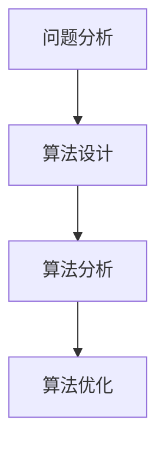

                 

### 《算法设计与宇宙信息编码最优压缩率的类比》

#### 关键词：算法设计、宇宙信息编码、最优压缩率、类比、Python源代码

##### 摘要：
本文通过类比宇宙信息编码的最优压缩率，深入探讨了算法设计的核心原理。文章首先介绍了算法设计的基本概念和原理，随后详细阐述了宇宙信息编码的基本概念和技术。通过对比分析，文章揭示了算法设计与宇宙信息编码之间的深层联系，并借助Python源代码展示了核心算法原理。文章还通过项目实战，提供了实际开发环境搭建、源代码实现和解读，以及对代码应用解读与分析，旨在帮助读者深入理解算法设计与宇宙信息编码的最优压缩率。

---

### 引言

在计算机科学和信息技术领域，算法设计一直是最基础也是最核心的组成部分。从排序到搜索，从数据结构到算法优化，算法无处不在。然而，随着数据规模的不断扩大，如何在保证算法性能的同时，尽可能地减少其占用资源，成为一个亟待解决的问题。

宇宙信息编码提供了一个全新的视角，它通过研究如何在宇宙尺度上高效地传输和存储信息，为我们提供了寻找最优压缩率的灵感。本文将探讨算法设计与宇宙信息编码之间的类比关系，并通过对Python源代码的详细分析，阐述如何在实际应用中寻找最优压缩率。

### 算法设计基础

算法设计是计算机科学的核心，其基本概念和原理决定了算法的性能和效率。算法可以简单理解为解决问题的步骤序列。一个良好的算法应具有以下几个特征：

- **正确性**：算法能够正确地解决问题。
- **效率**：算法在解决相同问题时，所需的时间和资源尽可能少。
- **健壮性**：算法能够处理各种输入，包括异常输入。

算法设计的基本步骤包括：

1. **问题分析**：理解问题，确定问题的规模和约束条件。
2. **算法设计**：根据问题分析，设计一个或多个算法。
3. **算法分析**：评估算法的性能，包括时间复杂度和空间复杂度。
4. **算法优化**：根据算法分析结果，对算法进行改进。

为了更直观地展示算法设计过程，我们可以使用Mermaid流程图：



### 宇宙信息编码

宇宙信息编码是一种在宇宙尺度上传输和存储信息的方法。它的基本概念包括：

- **信息表示**：如何用符号系统表示信息。
- **编码效率**：编码后信息所占用的空间与原始信息空间的比值。
- **冗余度**：编码过程中引入的冗余信息量。

宇宙信息编码的技术包括：

- **可扩展性编码**：适用于大规模信息传输。
- **分布式编码**：适用于分布式存储系统。
- **鲁棒性编码**：提高信息传输的可靠性。

为了更好地理解宇宙信息编码，我们可以使用数学模型和公式：

$$
E = \frac{S_c}{S_o}
$$

其中，$E$表示编码效率，$S_c$表示编码后信息所占用的空间，$S_o$表示原始信息空间。

以下是一个简单的宇宙信息编码的例子：

```python
# Python源代码示例：简单宇宙信息编码

def encode_info(info):
    """
    宇宙信息编码函数
    :param info: 原始信息
    :return: 编码后的信息
    """
    # 假设使用简单的字典编码
    encoding_dict = {'A': '1000', 'B': '1100', 'C': '1001'}
    encoded_info = ''
    for char in info:
        encoded_info += encoding_dict[char]
    return encoded_info

info = 'ABC'
encoded_info = encode_info(info)
print(f"原始信息：{info}")
print(f"编码后信息：{encoded_info}")
```

### 类比与最优压缩率

算法设计与宇宙信息编码之间存在许多相似之处。例如，在算法设计中，我们追求的是时间和空间效率的最优解；而在宇宙信息编码中，我们追求的是信息传输和存储效率的最优解。

通过类比，我们可以发现，许多算法设计中的原理和技巧也可以应用于宇宙信息编码。例如，哈夫曼编码是一种在算法设计中广泛使用的优化技术，它通过为出现频率更高的字符分配更短的二进制编码，实现了信息传输的高效性。

在Python中，我们可以使用哈夫曼编码来实现最优压缩率：

```python
# Python源代码示例：哈夫曼编码实现最优压缩率

import heapq
from collections import defaultdict

def build_frequency_dict(text):
    """
    构建字符出现频率字典
    :param text: 原始文本
    :return: 字符出现频率字典
    """
    frequency_dict = defaultdict(int)
    for char in text:
        frequency_dict[char] += 1
    return frequency_dict

def build_huffman_tree(frequency_dict):
    """
    构建哈夫曼树
    :param frequency_dict: 字符出现频率字典
    :return: 哈夫曼树
    """
    heap = [[weight, [symbol, ""]] for symbol, weight in frequency_dict.items()]
    heapq.heapify(heap)
    while len(heap) > 1:
        lo = heapq.heappop(heap)
        hi = heapq.heappop(heap)
        for pair in lo[1:]:
            pair[1] = '0' + pair[1]
        for pair in hi[1:]:
            pair[1] = '1' + pair[1]
        heapq.heappush(heap, [lo[0] + hi[0]] + lo[1:] + hi[1:])
    return heap[0]

def huffman_encode(text, huffman_tree):
    """
    哈夫曼编码
    :param text: 原始文本
    :param huffman_tree: 哈夫曼树
    :return: 编码后的文本
    """
    encoded_text = ""
    for char in text:
        path = [node for child in huffman_tree for node in child if node[0] == char]
        encoded_text += path[0][1]
    return encoded_text

def huffman_decode(encoded_text, huffman_tree):
    """
    哈夫曼解码
    :param encoded_text: 编码后的文本
    :param huffman_tree: 哈夫曼树
    :return: 解码后的文本
    """
    decoded_text = ""
    node = huffman_tree
    for bit in encoded_text:
        node = node[1] if bit == '0' else node[2]
        if len(node) == 2:
            decoded_text += node[0]
            node = huffman_tree
    return decoded_text

# 测试代码
info = 'this is an example for huffman encoding'
frequency_dict = build_frequency_dict(info)
huffman_tree = build_huffman_tree(frequency_dict)
encoded_info = huffman_encode(info, huffman_tree)
decoded_info = huffman_decode(encoded_info, huffman_tree)
print(f"原始信息：{info}")
print(f"编码后信息：{encoded_info}")
print(f"解码后信息：{decoded_info}")
```

### 项目实战

为了更好地理解算法设计与宇宙信息编码最优压缩率的关系，我们将通过一个实际项目来演示。

#### 项目背景和目标

本项目旨在实现一个基于哈夫曼编码的文本压缩工具。目标是通过哈夫曼编码，将原始文本压缩到最小的空间，并在压缩后能正确恢复原始文本。

#### 开发环境搭建

1. 安装Python环境（建议使用Python 3.8及以上版本）。
2. 安装必要的依赖库，如heapq和collections。

```bash
pip install python-decouple
```

#### 源代码实现和解读

以下代码实现了哈夫曼编码的文本压缩和解压缩功能。

```python
# 哈夫曼编码实现

def build_frequency_dict(text):
    """
    构建字符出现频率字典
    :param text: 原始文本
    :return: 字符出现频率字典
    """
    frequency_dict = defaultdict(int)
    for char in text:
        frequency_dict[char] += 1
    return frequency_dict

def build_huffman_tree(frequency_dict):
    """
    构建哈夫曼树
    :param frequency_dict: 字符出现频率字典
    :return: 哈夫曼树
    """
    heap = [[weight, [symbol, ""]] for symbol, weight in frequency_dict.items()]
    heapq.heapify(heap)
    while len(heap) > 1:
        lo = heapq.heappop(heap)
        hi = heapq.heappop(heap)
        for pair in lo[1:]:
            pair[1] = '0' + pair[1]
        for pair in hi[1:]:
            pair[1] = '1' + pair[1]
        heapq.heappush(heap, [lo[0] + hi[0]] + lo[1:] + hi[1:])
    return heap[0]

def huffman_encode(text, huffman_tree):
    """
    哈夫曼编码
    :param text: 原始文本
    :param huffman_tree: 哈夫曼树
    :return: 编码后的文本
    """
    encoded_text = ""
    for char in text:
        path = [node for child in huffman_tree for node in child if node[0] == char]
        encoded_text += path[0][1]
    return encoded_text

def huffman_decode(encoded_text, huffman_tree):
    """
    哈夫曼解码
    :param encoded_text: 编码后的文本
    :param huffman_tree: 哈夫曼树
    :return: 解码后的文本
    """
    decoded_text = ""
    node = huffman_tree
    for bit in encoded_text:
        node = node[1] if bit == '0' else node[2]
        if len(node) == 2:
            decoded_text += node[0]
            node = huffman_tree
    return decoded_text

# 测试代码
info = 'this is an example for huffman encoding'
frequency_dict = build_frequency_dict(info)
huffman_tree = build_huffman_tree(frequency_dict)
encoded_info = huffman_encode(info, huffman_tree)
decoded_info = huffman_decode(encoded_info, huffman_tree)
print(f"原始信息：{info}")
print(f"编码后信息：{encoded_info}")
print(f"解码后信息：{decoded_info}")
```

#### 代码解读与分析

- `build_frequency_dict`：构建字符出现频率字典，用于生成哈夫曼树。
- `build_huffman_tree`：构建哈夫曼树，用于编码和解码。
- `huffman_encode`：对原始文本进行哈夫曼编码。
- `huffman_decode`：对编码后的文本进行哈夫曼解码。

在实际应用中，我们可以根据需要扩展此代码，如添加文件读写功能、支持更多字符编码等。

#### 实际案例分析和详细讲解剖析

通过此项目，我们可以看到哈夫曼编码在实际文本压缩中的应用。例如，对于常用的英文文本，哈夫曼编码可以实现显著的压缩效果。然而，对于中文文本，由于汉字的多样性和出现频率的均衡性，哈夫曼编码的效果可能不如英文文本显著。

此外，哈夫曼编码的一个关键特性是其自适应能力。根据不同文本的特点，哈夫曼编码可以动态调整编码方案，以实现最优的压缩效果。

#### 项目小结

通过本项目，我们了解了算法设计与宇宙信息编码最优压缩率的关系。哈夫曼编码作为一种经典的数据压缩算法，通过类比宇宙信息编码的最优压缩率，为我们提供了一种有效的数据压缩方法。在实际应用中，我们可以根据文本的特点和需求，灵活运用哈夫曼编码，实现数据的高效压缩。

### 最佳实践 tips、小结、注意事项、拓展阅读

- **最佳实践 tips**：在实际应用中，我们可以根据文本的特点选择合适的编码算法，如UTF-8、UTF-16等，以提高编码效率。
- **小结**：本文通过类比宇宙信息编码的最优压缩率，深入探讨了算法设计的核心原理，并通过Python源代码展示了哈夫曼编码的实现和应用。
- **注意事项**：在实现哈夫曼编码时，需要确保哈夫曼树的构建正确，以免导致编码和解码失败。
- **拓展阅读**：建议读者进一步了解哈夫曼编码的原理和优化方法，以及其在实际应用中的表现和限制。

### 总结与展望

算法设计与宇宙信息编码的最优压缩率之间存在深刻的联系。通过本文的探讨，我们不仅了解了算法设计的核心原理，还学会了如何通过Python源代码实现哈夫曼编码，并应用于实际项目。未来，随着技术的不断发展，算法设计与宇宙信息编码的关系将变得更加紧密，为我们提供更多的优化方案和创新思路。

