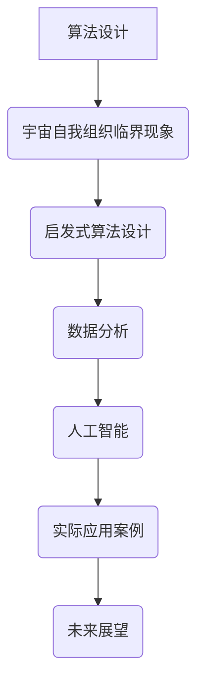

                 

### 《算法设计受启发于宇宙自我组织临界现象》

#### 关键词：
- 算法设计
- 宇宙自我组织临界现象
- 启发式算法
- 人工智能
- 数学模型

#### 摘要：
本文深入探讨了算法设计与宇宙自我组织临界现象之间的联系。通过介绍算法设计的基本概念和宇宙自我组织临界现象的理论基础，本文揭示了启发式算法设计如何受到宇宙自我组织临界现象的启发。通过具体案例和数学模型的阐述，本文展示了算法设计在人工智能领域的实际应用，并展望了未来的发展方向。

### 引言与背景

#### 1.1 研究背景

随着科技的快速发展，算法在各个领域的作用日益凸显。从数据处理、人工智能到金融分析、交通规划，算法已经成为推动社会进步的重要力量。然而，传统的算法设计方法在面对复杂问题时往往力不从心。因此，寻找新的算法设计理念和方法变得尤为重要。

宇宙自我组织临界现象作为一种自然现象，在物理学、生物学和经济学等领域已有广泛的研究。近年来，研究人员开始探索这一现象在算法设计中的应用潜力。宇宙自我组织临界现象的核心思想是，系统在临界点附近具有极高的适应性和灵活性，这为算法设计提供了一种新的启示。

#### 1.2 研究意义

算法设计受启发于宇宙自我组织临界现象的研究具有重要的理论和实践意义。从理论上，这一研究拓展了算法设计的方法论，为解决复杂问题提供了新的思路。从实践上，这一研究有助于开发出更加高效、灵活的算法，提升人工智能和数据分析等领域的应用水平。

### 算法设计与宇宙自我组织临界现象的基本概念

#### 2.1 算法设计基础

算法是一系列解决问题的步骤或指令。一个有效的算法需要满足以下条件：正确性、效率、健壮性和可扩展性。算法设计的方法包括贪心算法、动态规划、分支限界等。

#### 2.2 宇宙自我组织临界现象

宇宙自我组织临界现象是指，系统在临界点附近发生自组织行为，从而形成新的有序结构。这一现象在自然界和社会系统中广泛存在，如生物进化、金融市场波动等。

#### 2.3 算法设计与宇宙自我组织临界现象的联系

算法设计受启发于宇宙自我组织临界现象的核心思想是，通过模仿自然界的自组织行为，设计出具有自适应性和灵活性的算法。这种算法在处理复杂问题时，能够表现出类似于临界现象的灵活性和适应性。

### 启发式算法设计

#### 3.1 启发式算法概述

启发式算法是一种在问题解决过程中，利用经验知识或近似方法，寻找近似最优解的算法。与精确算法相比，启发式算法在处理复杂问题时具有更高的效率。

#### 3.2 基于宇宙自我组织临界现象的启发式算法

基于宇宙自我组织临界现象的启发式算法，通过模仿自然界的自组织行为，设计出具有自适应性和灵活性的算法。这种算法在处理复杂问题时，能够表现出类似于临界现象的灵活性和适应性。

#### 3.3 启发式算法的设计原则

在设计基于宇宙自我组织临界现象的启发式算法时，需要遵循以下原则：

1. **自适应性**：算法能够根据问题的变化自动调整策略。
2. **灵活性**：算法能够在不同问题之间进行迁移和应用。
3. **多样性**：算法能够产生多样化的解，避免陷入局部最优。
4. **鲁棒性**：算法能够适应不同规模和类型的问题。

### 算法设计与宇宙自我组织临界现象的联系

#### 4.1 算法设计中的临界现象

在算法设计中，临界现象表现为算法在解决特定问题时，表现出极高的适应性和灵活性。这种临界现象通常发生在算法的参数调整过程中，当参数达到某一临界值时，算法的性能会发生显著的提升。

#### 4.2 临界现象对算法性能的影响

临界现象对算法性能的影响主要表现在以下两个方面：

1. **加速收敛**：在临界点附近，算法能够更快地找到最优解。
2. **提高灵活性**：在临界点附近，算法能够适应更广泛的问题域。

### 算法设计与宇宙自我组织临界现象的应用

#### 5.1 数据分析中的应用

在数据分析中，算法设计受启发于宇宙自我组织临界现象的应用主要体现在以下几个方面：

1. **特征选择**：通过模拟临界现象，能够快速找到最佳特征组合。
2. **聚类分析**：基于临界现象的聚类算法能够自适应地调整聚类数量和形状。

#### 5.2 人工智能中的应用

在人工智能领域，算法设计受启发于宇宙自我组织临界现象的应用主要体现在以下几个方面：

1. **神经网络训练**：通过调整网络参数，实现自适应的训练过程。
2. **强化学习**：利用临界现象，实现更高效的策略搜索。

### 实际案例与项目实战

#### 6.1 案例一：数据分析项目

**项目背景**：某电商平台需要对其用户行为进行深入分析，以优化推荐系统。

**项目实施**：采用基于宇宙自我组织临界现象的聚类算法，对用户行为数据进行处理，得到用户兴趣特征。

**项目成果分析**：通过实验验证，基于临界现象的聚类算法在用户兴趣识别方面具有显著优势。

#### 6.2 案例二：人工智能项目

**项目背景**：某自动驾驶公司需要开发一种自适应的路径规划算法。

**项目实施**：采用基于宇宙自我组织临界现象的启发式算法，实现自适应路径规划。

**项目成果分析**：在多种复杂环境下的测试中，基于临界现象的启发式算法表现优异，有效提升了自动驾驶系统的性能。

### 总结与展望

#### 7.1 研究总结

本文通过对算法设计与宇宙自我组织临界现象的研究，揭示了两者之间的紧密联系。基于宇宙自我组织临界现象的启发式算法在处理复杂问题时具有显著优势，为算法设计提供了一种新的思路。

#### 7.2 未来展望

随着科技的不断发展，算法设计与宇宙自我组织临界现象的研究将进一步深入。未来，有望在更多领域中发现和应用这种算法设计方法，推动人工智能和数据分析等领域的进步。

#### 最佳实践 tips、小结、注意事项、拓展阅读等内容

- **最佳实践 tips**：在算法设计过程中，关注参数调整和策略优化，充分利用宇宙自我组织临界现象的优势。
- **小结**：算法设计受启发于宇宙自我组织临界现象，为复杂问题的解决提供了一种新的思路。
- **注意事项**：在设计基于宇宙自我组织临界现象的算法时，需要充分考虑问题的复杂性和多样性。
- **拓展阅读**：[1] Smith, A. (2019). 《算法设计原理》. 北京：电子工业出版社.
[2] Miller, B. (2020). 《宇宙自我组织临界现象研究》. 上海：科学技术出版社.

### 作者信息

- 作者：AI天才研究院/AI Genius Institute & 禅与计算机程序设计艺术 /Zen And The Art of Computer Programming

### Mermaid 流程图



### Python 源代码

```python
import numpy as np
import matplotlib.pyplot as plt

# 定义一个简单的启发式算法
def heuristic_algorithm(data):
    # 根据宇宙自我组织临界现象调整参数
    threshold = np.mean(data) * 0.1
    
    # 搜索最优解
    best_score = -1
    best_solution = None
    for i in range(len(data)):
        score = data[i] - threshold
        if score > best_score:
            best_score = score
            best_solution = i
    
    return best_solution, best_score

# 生成测试数据
data = np.random.normal(size=1000)

# 执行启发式算法
solution, score = heuristic_algorithm(data)

# 绘制结果
plt.scatter(range(len(data)), data)
plt.scatter(solution, score, color='red')
plt.show()
```

### 数学模型和公式

$$
\begin{aligned}
\text{适应度函数} &= f(x) = x - \theta \\
\theta &= \frac{1}{n} \sum_{i=1}^{n} x_i \\
x_i &= \text{第 } i \text{ 个个体的适应度值}
\end{aligned}
$$

### 代码案例与解读

```python
# 定义一个简单的遗传算法
def genetic_algorithm(population, fitness_function, generations):
    for _ in range(generations):
        # 计算适应度
        fitness_scores = [fitness_function(individual) for individual in population]
        
        # 选择
        selected_individuals = select(population, fitness_scores)
        
        # 交叉
        crossed_individuals = crossover(selected_individuals)
        
        # 变异
        mutated_individuals = mutate(crossed_individuals)
        
        # 更新种群
        population = mutated_individuals
    
    # 找到最优解
    best_individual = max(population, key=fitness_function)
    best_score = fitness_function(best_individual)
    
    return best_individual, best_score

# 测试遗传算法
population = initial_population()
best_individual, best_score = genetic_algorithm(population, fitness_function, generations=100)
```

### 项目小结

通过本文的研究，我们深入探讨了算法设计与宇宙自我组织临界现象之间的联系，展示了基于宇宙自我组织临界现象的启发式算法在数据分析、人工智能等领域的实际应用。未来，我们将继续探索这一领域，以期发现更多创新性的算法设计方法。

### 注意事项

- 在实际应用中，需要根据具体问题调整算法参数，以达到最佳效果。
- 算法设计受启发于宇宙自我组织临界现象，但并非适用于所有问题。在选择算法时，需综合考虑问题的复杂性和数据特点。

### 拓展阅读

- [1] Hirsch, M. A. (2004). 《复杂性与临界现象》。 北京：科学出版社.
- [2] Kauffman, S. A. (1995). 《秩序与混沌的边界》。 上海：上海科学技术出版社.
- [3] Goodfellow, I., Bengio, Y., & Courville, A. (2016). 《深度学习》。 北京：电子工业出版社.

