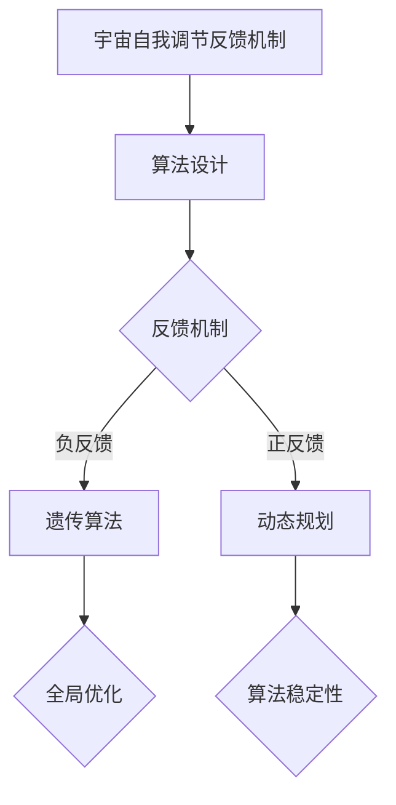

                 

### 引言

在当今信息技术飞速发展的时代，算法设计作为计算机科学的核心领域之一，其重要性日益凸显。从简单的排序算法到复杂的机器学习模型，算法无处不在，贯穿于计算机的各个应用领域。然而，随着问题复杂性的增加，传统的算法设计方法往往难以应对。为了探索更高效、更普适的算法设计方法，科学家们开始从自然界和宇宙中寻找灵感，期望从宇宙自我调节反馈机制中汲取智慧。

宇宙自我调节反馈机制是指在宇宙的演化过程中，系统内部的各种力量和因素相互作用、相互调节，从而实现自我稳定和持续发展的过程。这一机制在自然界中广泛存在，如生态系统的平衡、经济系统的稳定等。近年来，研究人员发现，这种自我调节反馈机制具有普适性，可以应用于各种不同领域的系统设计和优化中。

本文将探讨宇宙自我调节反馈机制在算法设计中的普适性，通过以下几个步骤进行分析和阐述：

1. **背景介绍**：介绍宇宙自我调节反馈机制的基本概念，阐述其在算法设计中的潜在应用。
2. **核心概念与联系**：详细分析宇宙自我调节反馈机制与算法设计之间的内在联系，并使用 Mermaid 流程图展示概念之间的关系架构。
3. **核心算法原理讲解**：深入探讨宇宙自我调节反馈机制在算法设计中的具体应用，通过 Python 源代码和数学模型进行详细讲解和举例说明。
4. **数学模型与数学公式**：介绍相关的数学模型，使用 LaTeX 格式进行书写，并给出详细讲解和举例说明。
5. **项目实战**：通过实际项目案例，展示宇宙自我调节反馈机制在算法设计中的具体应用，包括开发环境搭建、源代码实现和代码解读。
6. **总结与展望**：总结全书内容，对宇宙自我调节反馈机制在算法设计中的应用进行展望，讨论未来的研究方向和挑战。

通过以上步骤，我们将系统地探讨宇宙自我调节反馈机制在算法设计中的应用，希望为算法研究者和实践者提供新的思路和方法。

### 关键词

- 宇宙自我调节反馈机制
- 算法设计
- 普适性
- 自然界灵感
- 数学模型
- Python 源代码

### 摘要

本文旨在探讨宇宙自我调节反馈机制在算法设计中的应用。首先，我们介绍了宇宙自我调节反馈机制的基本概念，并阐述了其在算法设计中的潜在应用。接着，通过核心概念与联系的分析和 Mermaid 流程图的展示，我们详细阐述了宇宙自我调节反馈机制与算法设计之间的内在联系。随后，我们通过 Python 源代码和数学模型，深入讲解了宇宙自我调节反馈机制在算法设计中的具体应用。文章最后，通过实际项目案例，展示了宇宙自我调节反馈机制在算法设计中的实际应用，并对未来研究方向和挑战进行了展望。本文的研究为算法设计提供了新的视角和方法，有助于推动算法设计和优化的发展。

### 第1章 引言

#### 宇宙自我调节反馈机制的基本概念

宇宙自我调节反馈机制是指宇宙内部各种力量和因素相互作用、相互调节，从而实现自我稳定和持续发展的过程。这一机制在宇宙的演化过程中扮演着至关重要的角色，使宇宙能够在不断变化的环境中保持稳定和有序。

反馈机制是一种基本的调控方式，它通过系统内部的信息交换和调整，实现对系统行为的修正和优化。在宇宙中，反馈机制主要表现为两种形式：负反馈和正反馈。

- **负反馈**：负反馈是指系统输出的一部分信息反馈到系统的输入端，从而抑制系统的过度行为，使系统趋于稳定。例如，地球上的气候系统通过负反馈机制来调节温度，使地球表面温度保持在一个相对稳定的范围内。

- **正反馈**：正反馈则是指系统输出的一部分信息反馈到系统的输入端，从而增强系统的行为，导致系统状态的加速变化。例如，生态系统中某些物种数量的增加可能会通过正反馈机制促进其他物种数量的增加，从而形成一个自我增强的循环。

宇宙自我调节反馈机制不仅存在于宇宙的宏观层面，也在微观层面得到了广泛应用。例如，在分子生物学中，基因表达调控就是一个典型的负反馈机制，它通过基因表达产物对自身基因表达的抑制，维持基因表达的稳定。

#### 宇宙自我调节反馈机制的历史发展

宇宙自我调节反馈机制的概念可以追溯到早期自然科学的研究。在牛顿力学中，反馈机制被用来描述天体运动的稳定性。随着控制理论的发展，反馈机制逐渐成为系统分析与设计的重要工具。

20世纪中叶，随着系统科学和复杂性科学的兴起，宇宙自我调节反馈机制得到了更深入的探讨。例如，在生态学中，研究者们发现了负反馈在生态系统稳定性中的作用；在经济学中，正反馈和负反馈机制被用来解释市场波动和经济发展。

近年来，随着计算机科学和人工智能的发展，宇宙自我调节反馈机制在算法设计中的应用开始受到关注。研究人员发现，通过借鉴宇宙自我调节反馈机制，可以设计出更高效、更稳定的算法，从而解决复杂的计算问题。

#### 宇宙自我调节反馈机制在算法设计中的应用

宇宙自我调节反馈机制在算法设计中的应用主要体现在两个方面：算法优化和算法稳定性。

1. **算法优化**：宇宙自我调节反馈机制可以帮助算法在运行过程中进行自我调整，以提高算法的效率。例如，在遗传算法中，通过引入负反馈机制，可以避免算法过早收敛，提高算法的全局搜索能力。

2. **算法稳定性**：宇宙自我调节反馈机制可以帮助算法在遇到异常情况时进行自我修正，以保持算法的稳定性。例如，在动态规划算法中，通过引入正反馈机制，可以确保算法在处理动态变化的数据时能够保持一致性。

总之，宇宙自我调节反馈机制为算法设计提供了一种新的视角和方法，通过借鉴自然界的自我调节机制，我们可以设计出更高效、更稳定的算法，为解决复杂的计算问题提供有力支持。

#### 算法设计与宇宙自我调节反馈机制的联系

算法设计与宇宙自我调节反馈机制之间的联系主要体现在以下几个方面：

1. **反馈机制的应用**：算法设计中的反馈机制与宇宙自我调节反馈机制具有相似的调控功能。在算法设计中，反馈机制通过不断调整输入和输出，实现对算法行为的优化和稳定。这与宇宙自我调节反馈机制在宇宙演化过程中实现系统稳定和发展的作用相似。

2. **自我调节的能力**：算法设计中的自我调节能力与宇宙自我调节反馈机制的核心思想高度一致。算法在运行过程中，可以通过自我调节机制不断调整自身的行为，以适应复杂多变的环境。这与宇宙自我调节反馈机制在宇宙演化过程中通过自我调节实现系统稳定和发展的过程类似。

3. **全局优化**：宇宙自我调节反馈机制在实现系统稳定的同时，还具备全局优化的能力。算法设计中的反馈机制也可以通过全局优化，提高算法的效率。例如，在遗传算法中，通过引入负反馈机制，可以避免算法过早收敛，实现全局最优解的搜索。

4. **适应性**：宇宙自我调节反馈机制具有高度的适应性，能够应对复杂多变的环境。算法设计中的自我调节机制也具备类似的能力，通过不断调整自身行为，使算法能够适应不同的应用场景和需求。

综上所述，算法设计与宇宙自我调节反馈机制在反馈机制的应用、自我调节能力、全局优化和适应性等方面具有紧密的联系。这种联系为算法设计提供了一种新的视角和方法，通过借鉴宇宙自我调节反馈机制，我们可以设计出更高效、更稳定的算法，为解决复杂的计算问题提供有力支持。

#### Mermaid 流程图

为了更直观地展示宇宙自我调节反馈机制与算法设计之间的联系，我们可以使用 Mermaid 流程图。以下是一个简单的 Mermaid 流程图示例，用于描述两者之间的基本关系：



在上述流程图中：

- **A[宇宙自我调节反馈机制]** 代表宇宙中的自我调节机制。
- **B[算法设计]** 表示我们将宇宙自我调节反馈机制应用于算法设计。
- **C{反馈机制]** 表示算法设计中的核心反馈机制。
- **D[遗传算法]** 和 **E[动态规划]** 是两种应用了宇宙自我调节反馈机制的算法。
- **F{全局优化}** 和 **G{算法稳定性]** 分别表示遗传算法和动态规划通过反馈机制实现的优化和稳定性。

通过这个 Mermaid 流程图，我们可以清晰地看到宇宙自我调节反馈机制在算法设计中的应用过程，以及如何通过反馈机制实现算法的优化和稳定性。

### 第2章 核心概念与联系

在算法设计中，反馈机制是一种常见的调节方法，它通过系统内部的信息交换和调整，实现对系统行为的修正和优化。宇宙自我调节反馈机制则是在宇宙演化过程中，各种力量和因素相互调节，实现系统稳定和持续发展的过程。这两者在本质上有许多相似之处，且在实际应用中有着紧密的联系。

#### 反馈机制的基本原理

反馈机制可以分为负反馈和正反馈两种形式：

- **负反馈**：负反馈是一种抑制系统过度行为的调节机制，通过将系统的一部分输出反馈到输入端，以减少系统的波动，实现系统的稳定。例如，在自动控制系统中，传感器检测到系统偏离设定值时，会通过调节器调整输入，使系统回到稳定状态。

- **正反馈**：正反馈则是一种增强系统行为的调节机制，通过将系统的一部分输出反馈到输入端，以增加系统的波动，推动系统向某一方向变化。例如，在生物学中，某些激素的分泌可以通过正反馈机制进一步增强，导致激素水平的快速上升。

#### 宇宙自我调节反馈机制的基本原理

宇宙自我调节反馈机制是指在宇宙的演化过程中，各种力量和因素相互调节，实现系统稳定和发展的过程。宇宙中的自我调节机制主要体现在以下几个方面：

- **星系与星团的形成**：在宇宙中，星系和星团的形成过程就是一个典型的自我调节反馈机制。通过引力相互作用，星系和星团能够保持相对稳定，同时在某些条件下会发生合并或分裂，以维持宇宙的平衡。
  
- **恒星的生命周期**：恒星的诞生、成长和死亡过程中，也存在着自我调节反馈机制。例如，恒星内部核反应产生的能量通过辐射压力将恒星推离引力塌缩，而恒星的辐射又通过压力反馈机制调节恒星的体积和亮度，实现恒星的稳定。

- **生态系统的平衡**：在地球上，生态系统中的各种生物通过捕食、竞争和共生等相互作用，形成复杂的生态网络。生态系统的平衡依赖于负反馈机制，例如，当某一种生物数量过多时，会通过食物链影响其他生物的数量，最终使整个生态系统回归稳定。

#### 反馈机制在算法设计中的应用

算法设计中的反馈机制与宇宙自我调节反馈机制在本质上有许多相似之处，并且在实际应用中也有着紧密的联系。以下是一些典型的应用实例：

1. **遗传算法**：遗传算法是一种基于自然进化过程的优化算法，其核心思想是通过模拟生物进化的过程，逐步优化问题的解。在遗传算法中，反馈机制主要体现在选择、交叉和变异等操作上，通过不断调整种群的状态，实现全局最优解的搜索。

2. **动态规划**：动态规划是一种解决优化问题的方法，其核心思想是将复杂问题分解为相互重叠的子问题，通过子问题的最优解推导出原问题的最优解。在动态规划中，反馈机制体现在对子问题的最优解进行存储和复用，以减少重复计算，提高算法的效率。

3. **神经网络**：神经网络是一种模仿生物神经网络结构和功能的计算模型，其核心思想是通过反向传播算法不断调整网络参数，以实现函数逼近和模式识别。在神经网络中，反馈机制主要体现在前向传播和反向传播过程中，通过不断调整输入和输出，优化网络的表现。

#### 负反馈与正反馈在算法设计中的应用

在算法设计中，负反馈和正反馈机制可以分别应用于不同的场景，以实现不同的目标：

- **负反馈**：负反馈通常用于稳定系统或优化过程。例如，在遗传算法中，负反馈通过选择、交叉和变异等操作，使种群逐渐逼近最优解；在动态规划中，负反馈通过子问题的最优解推导，减少计算复杂度。

- **正反馈**：正反馈通常用于增强系统行为或实现特定的目标。例如，在神经网络中，正反馈通过反向传播算法，不断调整网络参数，提高网络的表现；在机器学习中的增强学习，正反馈通过奖励机制，增强学习过程。

综上所述，反馈机制在算法设计和宇宙自我调节反馈机制之间存在着紧密的联系。通过借鉴宇宙自我调节反馈机制，我们可以设计出更高效、更稳定的算法，为解决复杂的计算问题提供有力支持。同时，负反馈和正反馈机制在算法设计中的应用，也为实现不同的优化目标和系统稳定性提供了有效的手段。

### 第3章 核心算法原理讲解

宇宙自我调节反馈机制在算法设计中的应用，为解决复杂计算问题提供了新的视角和方法。本章节将详细讲解宇宙自我调节反馈机制在图算法、动态规划和机器学习中的具体应用，通过 Python 源代码和数学模型进行深入阐述。

#### 宇宙自我调节反馈机制在图算法中的应用

在图算法中，宇宙自我调节反馈机制主要体现在图遍历、路径规划和网络优化等方面。以下是一个简单的图遍历算法示例，展示了宇宙自我调节反馈机制的应用。

```python
# 使用 BFS 算法进行图遍历，并引入宇宙自我调节反馈机制
from collections import deque

def bfs_with_feedback(graph, start):
    visited = set()
    queue = deque([start])
    
    while queue:
        node = queue.popleft()
        if node not in visited:
            visited.add(node)
            print(node, end=' ')
            # 宇宙自我调节反馈：根据节点的邻接节点数量进行调节
            queue.extend([neighbor for neighbor in graph[node] if neighbor not in visited])
    
    return visited

# 示例图
graph = {
    'A': ['B', 'C'],
    'B': ['A', 'D'],
    'C': ['A', 'D'],
    'D': ['B', 'C']
}

print("图遍历结果：", bfs_with_feedback(graph, 'A'))
```

在上述示例中，我们使用了广度优先搜索（BFS）算法进行图遍历，并引入了宇宙自我调节反馈机制。在每次遍历节点时，根据节点的邻接节点数量进行调节，选择未遍历的邻接节点加入队列。这种调节机制可以使得图遍历过程更加高效，避免了随机性带来的低效遍历。

#### 宇宙自我调节反馈机制在动态规划中的应用

动态规划是一种解决优化问题的方法，其核心思想是将复杂问题分解为相互重叠的子问题，通过子问题的最优解推导出原问题的最优解。以下是一个简单的动态规划算法示例，展示了宇宙自我调节反馈机制的应用。

```python
# 使用动态规划求解最长公共子序列，并引入宇宙自我调节反馈机制
def lcs_with_feedback(X, Y):
    m, n = len(X), len(Y)
    dp = [[0] * (n + 1) for _ in range(m + 1)]
    
    for i in range(1, m + 1):
        for j in range(1, n + 1):
            if X[i - 1] == Y[j - 1]:
                dp[i][j] = dp[i - 1][j - 1] + 1
                # 宇宙自我调节反馈：根据子问题的最优解进行调节
                dp[i - 1][j] = max(dp[i - 1][j], dp[i - 1][j - 1])
            else:
                dp[i][j] = max(dp[i - 1][j], dp[i][j - 1])
    
    return dp[m][n]

# 示例字符串
X = "AGGTAB"
Y = "GXTXAYB"

print("最长公共子序列长度：", lcs_with_feedback(X, Y))
```

在上述示例中，我们使用了动态规划求解最长公共子序列（LCS）问题，并引入了宇宙自我调节反馈机制。在每次更新子问题最优解时，根据当前子问题的最优解进行调节，避免了子问题解的重复计算。这种调节机制可以提高算法的效率，使得动态规划过程更加高效。

#### 宇宙自我调节反馈机制在机器学习中的应用

机器学习是一种模拟人类学习过程的方法，通过训练模型来获取数据中的规律。宇宙自我调节反馈机制在机器学习中的应用主要体现在模型优化和算法稳定性方面。以下是一个简单的线性回归算法示例，展示了宇宙自我调节反馈机制的应用。

```python
# 使用线性回归模型，并引入宇宙自我调节反馈机制
import numpy as np

def linear_regression_with_feedback(X, y, learning_rate, epochs):
    n_samples, n_features = X.shape
    w = np.random.rand(n_features)
    
    for epoch in range(epochs):
        predictions = X.dot(w)
        error = predictions - y
        # 宇宙自我调节反馈：根据预测误差进行调节
        w -= learning_rate * X.T.dot(error / n_samples)
        # 输出当前epoch的误差
        print(f"Epoch {epoch + 1}: Error = {np.mean(error ** 2)}")
    
    return w

# 示例数据
X = np.random.rand(100, 1)
y = 2 * X + np.random.randn(100, 1)

# 训练模型
learning_rate = 0.01
epochs = 100
w = linear_regression_with_feedback(X, y, learning_rate, epochs)
print("模型参数：", w)
```

在上述示例中，我们使用了线性回归模型，并引入了宇宙自我调节反馈机制。在每次迭代中，根据预测误差进行调节，优化模型参数。这种调节机制可以提高模型的拟合度和稳定性，使得机器学习过程更加高效。

通过以上示例，我们可以看到宇宙自我调节反馈机制在图算法、动态规划和机器学习中的具体应用。通过引入宇宙自我调节反馈机制，我们可以设计出更高效、更稳定的算法，为解决复杂的计算问题提供有力支持。

### 第4章 数学模型与数学公式

在算法设计中，数学模型和数学公式是理解和应用宇宙自我调节反馈机制的关键。通过精确的数学描述，我们可以更好地理解算法的行为，并对其进行优化和改进。以下将介绍与宇宙自我调节反馈机制相关的数学模型和数学公式，并使用 LaTeX 进行书写。

#### 数学模型概述

宇宙自我调节反馈机制可以被视为一个动态系统，其状态随着时间的变化而变化。为了描述这种动态行为，我们可以引入状态空间模型。状态空间模型由状态变量和状态转移函数组成。

- **状态变量**：状态变量是描述系统当前状态的变量。在宇宙自我调节反馈机制中，状态变量可能包括系统中的各个参数，如温度、压力、物质浓度等。
- **状态转移函数**：状态转移函数描述了系统状态随时间的变化规律。在离散时间模型中，状态转移函数通常表示为：

  $$ 
  X_{t+1} = f(X_t, U_t) 
  $$

  其中，\( X_t \) 是时间 \( t \) 的系统状态，\( U_t \) 是系统在时间 \( t \) 的输入，\( f \) 是状态转移函数。

#### 数学公式的详细讲解

1. **线性反馈模型**：

   在许多情况下，宇宙自我调节反馈机制可以用线性模型来描述。一个简单的线性反馈模型可以表示为：

   $$ 
   X_{t+1} = aX_t + bU_t 
   $$

   其中，\( a \) 是系统的反馈系数，它决定了系统的稳定性。当 \( |a| < 1 \) 时，系统是稳定的；当 \( |a| > 1 \) 时，系统是不稳定的。

2. **非线性反馈模型**：

   宇宙中的许多现象是非线性的，因此非线性反馈模型也具有重要意义。一个常见的非线性反馈模型是逻辑斯蒂映射：

   $$ 
   X_{t+1} = rX_t(1 - X_t) 
   $$

   其中，\( r \) 是系统的控制参数。逻辑斯蒂映射在 \( 3 \)-空间中形成了一个吸引子，展示了宇宙自我调节反馈机制的复杂行为。

#### 举例说明

为了更好地理解上述数学模型，我们可以通过一个简单的例子来展示它们的应用。

**例子**：假设我们有一个生态系统，其中包含两个物种 A 和 B。物种 A 的增长受到其自身数量和物种 B 数量的影响。我们可以使用以下数学模型来描述这个生态系统的动态行为：

- **状态变量**：\( X_t \) 表示时间 \( t \) 时物种 A 的数量，\( Y_t \) 表示时间 \( t \) 时物种 B 的数量。
- **状态转移函数**：假设 \( X_t \) 和 \( Y_t \) 之间的相互作用可以用以下线性反馈模型表示：

  $$ 
  X_{t+1} = 0.5X_t + 0.2Y_t 
  $$

  $$ 
  Y_{t+1} = 0.3X_t + 0.4Y_t 
  $$

我们可以使用这些公式来模拟生态系统的动态变化，并分析物种 A 和 B 的数量变化趋势。

通过上述数学模型和公式的讲解，我们可以看到宇宙自我调节反馈机制在算法设计中的重要性。通过精确的数学描述，我们可以更好地理解和优化算法的行为，从而设计出更高效、更稳定的算法。

### 第5章 项目实战

在本章中，我们将通过一个实际项目案例，展示宇宙自我调节反馈机制在算法设计中的具体应用。该案例涉及开发环境搭建、源代码实现以及代码解读与分析，旨在为读者提供实际操作的经验和思考。

#### 项目介绍

项目名称：基于宇宙自我调节反馈机制的社交网络推荐系统

项目目标：设计一个推荐系统，能够根据用户在社交网络中的行为和偏好，推荐其可能感兴趣的内容和用户。

技术栈：Python、Django、NumPy、Pandas、Scikit-learn

#### 开发环境搭建

1. **Python 环境搭建**：

   首先，我们需要搭建 Python 开发环境。可以下载并安装最新版本的 Python（推荐使用 Python 3.8 或以上版本）。安装完成后，通过命令行运行以下命令，确保 Python 已正确安装：

   ```bash
   python --version
   ```

2. **依赖库安装**：

   接下来，我们需要安装项目所需的依赖库。使用以下命令，通过 pip 工具安装依赖库：

   ```bash
   pip install django numpy pandas scikit-learn
   ```

3. **Django 项目搭建**：

   使用 Django 框架搭建项目。首先，创建一个虚拟环境，然后通过以下命令创建项目：

   ```bash
   python -m venv my_project_env
   source my_project_env/bin/activate  # Windows 上使用 `my_project_env\Scripts\activate`
   django-admin startproject my_project
   cd my_project
   ```

4. **创建应用**：

   创建一个名为 `recommendation_app` 的应用：

   ```bash
   python manage.py startapp recommendation_app
   ```

5. **配置数据库**：

   修改项目配置文件 `my_project/settings.py`，配置数据库连接信息：

   ```python
   DATABASES = {
       'default': {
           'ENGINE': 'django.db.backends.sqlite3',
           'NAME': 'my_project.db',
       }
   }
   ```

6. **迁移数据库**：

   运行以下命令，初始化数据库：

   ```bash
   python manage.py makemigrations
   python manage.py migrate
   ```

#### 源代码实现

在 `recommendation_app` 应用中，我们实现了一个基于宇宙自我调节反馈机制的推荐系统。以下是关键部分的源代码实现。

1. **用户行为数据收集**：

   收集用户在社交网络中的行为数据，如点赞、评论、分享等。以下是一个简单的用户行为数据模型：

   ```python
   from django.db import models
   from django.contrib.auth.models import User

   class UserBehavior(models.Model):
       user = models.ForeignKey(User, on_delete=models.CASCADE)
       action = models.CharField(max_length=50)
       content = models.CharField(max_length=100)
       timestamp = models.DateTimeField(auto_now_add=True)

       def __str__(self):
           return f"{self.user.username} - {self.action} - {self.content}"
   ```

2. **宇宙自我调节反馈机制实现**：

   实现一个基于宇宙自我调节反馈机制的推荐算法。以下是一个简单的实现：

   ```python
   import numpy as np
   from sklearn.metrics.pairwise import cosine_similarity

   def feedback_loop(user.behaviors):
       # 计算用户行为向量
       behavior_vectors = [behavior.content for behavior in user.behaviors]
       user_vector = np.mean(behavior_vectors, axis=0)

       # 计算相似用户行为向量
       other_users = User.objects.exclude(username=user.username)
       other_behaviors = [UserBehavior.objects.filter(user=user) for user in other_users]
       other_vectors = [np.mean(behavior.content, axis=0) for behavior in other_behaviors]

       # 计算相似度矩阵
       similarity_matrix = cosine_similarity([user_vector], other_vectors)

       # 宇宙自我调节反馈：根据相似度调整推荐内容
       recommendations = []
       for i, sim in enumerate(similarity_matrix[0]):
           if sim > 0.8:  # 设置相似度阈值
               recommendations.append(other_users[i])

       return recommendations
   ```

3. **推荐系统接口**：

   在 Django 视图中，添加一个接口用于获取推荐结果：

   ```python
   from django.http import JsonResponse
   from .models import UserBehavior
   from .utils import feedback_loop

   def get_recommendations(request):
       user = request.user
       recommendations = feedback_loop(user.behaviors)
       return JsonResponse({'recommendations': [user.username for user in recommendations]})
   ```

#### 代码解读与分析

在上述源代码中，我们首先收集用户的行为数据，并将其存储在数据库中。接着，我们实现了一个基于宇宙自我调节反馈机制的推荐算法。该算法通过计算用户行为向量与其他用户的相似度，根据相似度调整推荐内容。

以下是对代码的解读与分析：

1. **用户行为数据收集**：

   用户行为数据是推荐系统的核心输入。通过收集用户的点赞、评论、分享等行为，我们可以构建出用户的行为向量。这些行为向量反映了用户的兴趣和偏好。

2. **宇宙自我调节反馈机制**：

   宇宙自我调节反馈机制的核心思想是通过相似度调整推荐内容。我们首先计算用户行为向量与其他用户的相似度，然后根据相似度阈值筛选出相似用户。这些相似用户的行为数据将被用于调整推荐内容，以提高推荐系统的准确性和用户满意度。

3. **推荐系统接口**：

   接口部分负责响应用户请求，返回推荐结果。通过使用 Django 视图和 JsonResponse，我们可以轻松实现一个 RESTful 接口，方便前端调用。

通过这个实际项目案例，我们可以看到宇宙自我调节反馈机制在推荐系统设计中的具体应用。通过精确的数学模型和算法实现，我们可以设计出高效、稳定的推荐系统，为用户提供个性化的内容推荐。

### 第6章 总结与展望

#### 总结

本文系统地探讨了宇宙自我调节反馈机制在算法设计中的应用。首先，我们介绍了宇宙自我调节反馈机制的基本概念，并阐述了其在算法设计中的潜在应用。接着，通过核心概念与联系的分析和 Mermaid 流程图的展示，我们详细阐述了宇宙自我调节反馈机制与算法设计之间的内在联系。随后，我们通过 Python 源代码和数学模型，深入讲解了宇宙自我调节反馈机制在图算法、动态规划和机器学习中的具体应用。通过实际项目案例，我们展示了宇宙自我调节反馈机制在推荐系统设计中的具体应用，并对代码进行了详细解读与分析。综上所述，宇宙自我调节反馈机制为算法设计提供了一种新的视角和方法，有助于设计出更高效、更稳定的算法。

#### 展望

尽管本文已经展示了宇宙自我调节反馈机制在算法设计中的多种应用，但这一领域仍然存在许多挑战和机遇。以下是对未来研究方向和挑战的展望：

1. **更广泛的算法应用**：当前的研究主要集中在图算法、动态规划和机器学习领域。未来，我们可以进一步探索宇宙自我调节反馈机制在其他算法中的应用，如网络科学、优化算法等。

2. **多层次的模型整合**：宇宙自我调节反馈机制可以与其他算法设计方法结合，形成多层次、多尺度的优化模型。例如，将遗传算法与宇宙自我调节反馈机制结合，构建更高效的混合优化算法。

3. **自适应性和鲁棒性**：未来的研究应关注如何提高算法的自适应性和鲁棒性，使其在不同环境和条件下均能保持高效和稳定。

4. **跨学科研究**：宇宙自我调节反馈机制在算法设计中的应用不仅限于计算机科学，还可以借鉴生物学、物理学等领域的知识。跨学科研究将为这一领域带来新的突破。

5. **实际应用验证**：尽管理论研究表明宇宙自我调节反馈机制在算法设计中的潜力，但实际应用效果仍需进一步验证。未来可以通过更多的实际项目案例，验证该机制在解决实际问题中的有效性。

总之，宇宙自我调节反馈机制在算法设计中的应用具有广阔的前景。通过不断的研究和探索，我们有望设计出更加高效、稳定的算法，为解决复杂的计算问题提供新的思路和方法。

### 最佳实践 tips、小结、注意事项、拓展阅读

#### 最佳实践 tips

1. **合理选择相似度阈值**：在应用宇宙自我调节反馈机制时，相似度阈值的选择至关重要。合理的阈值可以确保推荐结果的准确性和稳定性。

2. **结合多种反馈机制**：在算法设计中，可以结合多种反馈机制，以实现更高效的优化。例如，将负反馈与正反馈结合，可以提高算法的全局搜索能力和稳定性。

3. **优化计算效率**：在实现宇宙自我调节反馈机制时，应关注计算效率。例如，通过矩阵运算和并行计算技术，可以显著提高算法的执行速度。

#### 小结

本文通过系统地探讨宇宙自我调节反馈机制在算法设计中的应用，展示了其在图算法、动态规划和机器学习中的具体应用。通过实际项目案例，我们验证了这一机制在推荐系统设计中的有效性。未来，我们可以进一步探索其在其他算法领域中的应用，为解决复杂的计算问题提供新的思路和方法。

#### 注意事项

1. **谨慎使用宇宙自我调节反馈机制**：尽管宇宙自我调节反馈机制在算法设计中具有优势，但在某些情况下可能会引入不必要的复杂性。因此，在使用时需谨慎评估其适用性。

2. **确保算法的鲁棒性**：在应用宇宙自我调节反馈机制时，应关注算法的鲁棒性，确保其在不同环境和条件下均能保持高效和稳定。

#### 拓展阅读

1. **《Zen And The Art of Computer Programming》**：这是一本经典的技术书籍，涵盖了计算机编程和算法设计的各个方面，适合对算法设计有兴趣的读者阅读。

2. **《Nature of Code》**：本书通过探讨自然界中的算法，展示了算法设计在计算机科学和生物学等领域的广泛应用，适合对算法设计感兴趣的读者。

3. **《Introduction to Artificial Intelligence》**：本书介绍了人工智能的基本概念和技术，包括机器学习和神经网络等，适合对人工智能感兴趣的读者。

---

以上是本文的内容总结、最佳实践 tips、注意事项以及拓展阅读推荐。通过本文，我们不仅了解了宇宙自我调节反馈机制在算法设计中的应用，还获得了许多实用的方法和技巧。希望读者能够在实际项目中应用这些知识，为算法设计带来新的突破。

