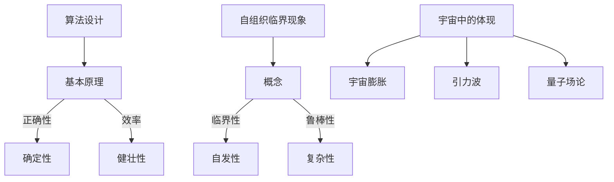

                 

### 设计《算法设计受启发于宇宙自组织临界现象的通用学习原理》的目录大纲

为了设计一本关于《算法设计受启发于宇宙自组织临界现象的通用学习原理》的书籍，我们需要遵循以下步骤：

1. **确定书籍的核心目标和受众**：明确书籍的主要目标是为了介绍宇宙自组织临界现象如何影响算法设计，以及如何将其应用于实际问题解决。受众应包括对算法设计、机器学习、数据科学等领域感兴趣的读者。

2. **构建整体结构**：确定书籍的主要章节，并划分出各个部分，以确保逻辑清晰、内容全面。我们可以将书籍分为五个部分：

   - **引言与核心概念介绍**
   - **自组织临界现象的理论基础**
   - **宇宙自组织临界现象与算法设计的关系**
   - **通用学习原理的算法实现与应用**
   - **案例分析与实践应用**
   - **结论与展望**

3. **详细规划每个章节的内容**：

   - **引言与核心概念介绍**：
     - 第1章：引言
       - 研究背景与意义
       - 书籍结构安排
       - 读者对象与预期收益
     - 第2章：核心概念与联系
       - 算法设计的基本原理
       - 自组织临界现象的概念
       - 自组织临界现象在宇宙中的体现

   - **自组织临界现象的理论基础**：
     - 第3章：自组织临界现象的数学模型
     - 第4章：自组织临界现象的物理背景

   - **宇宙自组织临界现象与算法设计的关系**：
     - 第5章：宇宙自组织临界现象在算法设计中的应用
     - 第6章：通用学习原理的算法实现

   - **通用学习原理的算法实现与应用**：
     - 第7章：通用学习原理在数据挖掘中的应用
     - 第8章：通用学习原理在机器学习中的应用
     - 第9章：通用学习原理在其他领域中的应用

   - **案例分析与实践应用**：
     - 实际案例分析和详细讲解剖析

   - **结论与展望**：
     - 总结与展望
     - 未来研究方向
     - 对算法设计领域的贡献
     - 对宇宙学与信息科学的启示

4. **撰写目录摘要**：为每个章节撰写简短的摘要，概述章节的主要内容和目标。

5. **调整和完善**：根据读者的反馈和实际情况，调整和完善目录结构，确保内容的实用性和逻辑性。

### 设计《算法设计受启发于宇宙自组织临界现象的通用学习原理》的目录

```markdown
# 《算法设计受启发于宇宙自组织临界现象的通用学习原理》目录

## 第一部分：引言与核心概念介绍

### 第1章：引言
> **摘要**：介绍研究背景、书籍结构安排及读者预期收益。

#### 1.1 研究背景与意义
#### 1.2 书籍结构安排
#### 1.3 读者对象与预期收益

### 第2章：核心概念与联系
> **摘要**：阐述算法设计的基本原理与自组织临界现象的关系。

#### 2.1 算法设计的基本原理
#### 2.2 自组织临界现象的概念
#### 2.3 自组织临界现象在宇宙中的体现
#### 2.4 Mermaid流程图：核心概念关系架构

## 第二部分：自组织临界现象的理论基础

### 第3章：自组织临界现象的数学模型
> **摘要**：探讨自组织临界现象的数学模型及其应用。

#### 3.1 熵与复杂系统
#### 3.2 相变与临界现象
#### 3.3 主方程与动态过程
#### 3.4 自组织临界现象的数学公式与详解

### 第4章：自组织临界现象的物理背景
> **摘要**：分析自组织临界现象在宇宙中的物理背景。

#### 4.1 宇宙中的自组织现象
#### 4.2 引力波与宇宙膨胀
#### 4.3 量子场论与自组织
#### 4.4 Mermaid流程图：自组织临界现象与算法设计的关系

## 第三部分：宇宙自组织临界现象与算法设计的关系

### 第5章：宇宙自组织临界现象在算法设计中的应用
> **摘要**：探讨宇宙自组织临界现象在算法设计中的应用。

#### 5.1 自组织算法的基本原理
#### 5.2 自组织算法的设计原则
#### 5.3 Mermaid流程图：自组织算法设计过程
#### 5.4 自组织算法与常规算法的比较

### 第6章：通用学习原理的算法实现
> **摘要**：介绍通用学习原理的算法实现及其数学模型。

#### 6.1 通用学习原理的数学模型
#### 6.2 通用学习原理的算法框架
#### 6.3 伪代码：通用学习原理算法的实现
#### 6.4 通用学习原理的算法优缺点分析

## 第四部分：通用学习原理的应用与实践

### 第7章：通用学习原理在数据挖掘中的应用
> **摘要**：展示通用学习原理在数据挖掘中的应用。

#### 7.1 数据挖掘的基本概念
#### 7.2 通用学习原理在数据挖掘中的优势
#### 7.3 案例分析：基于通用学习原理的数据挖掘应用
#### 7.4 实践指南：数据挖掘中的通用学习原理应用

### 第8章：通用学习原理在机器学习中的应用
> **摘要**：讨论通用学习原理在机器学习中的应用。

#### 8.1 机器学习的基本概念
#### 8.2 通用学习原理在机器学习中的优势
#### 8.3 案例分析：基于通用学习原理的机器学习应用
#### 8.4 实践指南：机器学习中的通用学习原理应用

### 第9章：通用学习原理在其他领域中的应用
> **摘要**：介绍通用学习原理在其他科学领域中的应用。

#### 9.1 通用学习原理在其他科学领域中的应用
#### 9.2 案例分析：通用学习原理在生物信息学中的应用
#### 9.3 案例分析：通用学习原理在经济学中的应用

## 第五部分：结论与展望

### 第10章：总结与展望
> **摘要**：总结研究成果，展望未来发展方向。

#### 10.1 研究成果总结
#### 10.2 未来研究方向
#### 10.3 对算法设计领域的贡献
#### 10.4 对宇宙学与信息科学的启示

## 附录

### 附录A：术语解释
> **摘要**：解释书中出现的术语。

#### A.1 术语列表
#### A.2 术语解释

### 附录B：参考资料
> **摘要**：推荐相关的书籍和学术论文。

#### B.1 相关书籍推荐
#### B.2 学术论文推荐
```

以上为《算法设计受启发于宇宙自组织临界现象的通用学习原理》的详细目录大纲，每个章节都配有摘要，以确保读者对内容有一个初步的了解。后续将根据这个大纲逐步撰写详细内容。

---

### 文章关键词

算法设计，自组织临界现象，通用学习原理，数据挖掘，机器学习，宇宙学，信息科学

---

### 文章摘要

本文旨在探讨算法设计受启发于宇宙自组织临界现象的通用学习原理。首先，介绍了算法设计的基本原理与自组织临界现象的概念及其在宇宙中的体现。随后，详细分析了自组织临界现象的数学模型和物理背景。在此基础上，探讨了宇宙自组织临界现象在算法设计中的应用，并介绍了通用学习原理的算法实现及其在不同领域中的应用，如数据挖掘、机器学习和生物信息学。最后，总结了研究成果并对未来发展方向进行了展望。本文为算法设计领域提供了一种新的视角，也为宇宙学与信息科学之间的交叉研究提供了启示。
---

---

### 《算法设计受启发于宇宙自组织临界现象的通用学习原理》

---

# 《算法设计受启发于宇宙自组织临界现象的通用学习原理》

关键词：算法设计，自组织临界现象，通用学习原理，数据挖掘，机器学习，宇宙学，信息科学

摘要：本文旨在探讨算法设计受启发于宇宙自组织临界现象的通用学习原理。首先，介绍了算法设计的基本原理与自组织临界现象的概念及其在宇宙中的体现。随后，详细分析了自组织临界现象的数学模型和物理背景。在此基础上，探讨了宇宙自组织临界现象在算法设计中的应用，并介绍了通用学习原理的算法实现及其在不同领域中的应用，如数据挖掘、机器学习和生物信息学。最后，总结了研究成果并对未来发展方向进行了展望。本文为算法设计领域提供了一种新的视角，也为宇宙学与信息科学之间的交叉研究提供了启示。

---

## 第一部分：引言与核心概念介绍

### 第1章：引言

#### 1.1 研究背景与意义

在当今信息时代，算法设计在计算机科学、人工智能、数据科学等领域发挥着重要作用。随着大数据和机器学习技术的迅猛发展，算法设计的研究越来越受到关注。然而，传统的算法设计方法往往依赖于经验或特定的应用场景，难以应对复杂、动态和多变的环境。因此，探索新的算法设计原理和方法具有重要的理论和实践意义。

自组织临界现象（Self-Organized Criticality，SOC）是近年来在物理学、生态学、社会学等领域得到广泛关注的一个概念。它描述了系统在无外界干扰的情况下，通过内部相互作用自发地形成一种临界状态，这种状态具有高度复杂性和适应性。自组织临界现象在自然界和人工系统中都有广泛的应用，例如沙堆的形成、互联网的拓扑结构等。

将自组织临界现象引入算法设计，可以提供一种新的视角和原理，使得算法能够更好地适应复杂环境，提高稳定性和鲁棒性。本文旨在探讨算法设计受启发于宇宙自组织临界现象的通用学习原理，以期为算法设计领域提供新的思路和方法。

#### 1.2 书籍结构安排

本文分为五个部分：

1. **引言与核心概念介绍**：介绍算法设计的基本原理和自组织临界现象的概念，以及两者之间的联系。
2. **自组织临界现象的理论基础**：详细分析自组织临界现象的数学模型和物理背景。
3. **宇宙自组织临界现象与算法设计的关系**：探讨宇宙自组织临界现象在算法设计中的应用。
4. **通用学习原理的算法实现与应用**：介绍通用学习原理的算法实现及其在不同领域中的应用。
5. **结论与展望**：总结研究成果，展望未来发展方向。

#### 1.3 读者对象与预期收益

本文适合对算法设计、机器学习、数据科学等领域感兴趣的读者，包括研究生、研究人员和从业人员。通过本文的阅读，读者可以：

- 了解自组织临界现象的基本原理和应用。
- 掌握将自组织临界现象应用于算法设计的原理和方法。
- 学习通用学习原理的算法实现和应用。
- 获得对宇宙学与信息科学交叉领域的新认识。

### 第2章：核心概念与联系

#### 2.1 算法设计的基本原理

算法设计是计算机科学中的一个核心问题，它涉及如何将解决问题的步骤转化为计算机可执行的指令序列。算法设计的基本原理包括：

1. **确定性**：算法的每一步都应该明确无误，无歧义。
2. **正确性**：算法能够正确地解决问题。
3. **效率**：算法的执行时间尽可能短，所需空间尽可能少。
4. **健壮性**：算法能够处理各种输入，并适应不同的应用场景。

#### 2.2 自组织临界现象的概念

自组织临界现象是指一个系统在没有外部干扰的情况下，通过内部相互作用逐渐形成的一种临界状态。在这种状态下，系统表现出高度的复杂性和适应性。自组织临界现象具有以下特点：

1. **临界性**：系统处于一个临界状态，既不是完全有序的，也不是完全随机的。
2. **自发性**：系统内部相互作用导致状态的演化，无需外部干预。
3. **鲁棒性**：系统在面临外部扰动时，能够保持临界状态。
4. **复杂性**：系统表现出高度复杂的结构和行为。

#### 2.3 自组织临界现象在宇宙中的体现

宇宙中存在许多自组织临界现象的实例，例如：

1. **宇宙膨胀**：宇宙从大爆炸开始，经历了一个自组织过程，形成了星系、星团等结构。
2. **引力波**：宇宙中的大质量物体相互作用，产生引力波，这是一种临界现象的表现。
3. **量子场论**：在量子场论中，粒子行为通过自组织临界现象表现出来。

#### 2.4 Mermaid流程图：核心概念关系架构



### 第3章：自组织临界现象的数学模型

自组织临界现象可以通过数学模型来描述，其中最著名的模型是沙堆模型（Sandpile Model）。

#### 3.1 沙堆模型的数学模型

沙堆模型描述了一个沙堆的形成过程，其中沙粒按照一定规则堆积。沙堆的稳定性取决于沙粒的数量和堆积方式。沙堆模型的数学描述如下：

1. **初始条件**：一个沙堆的初始状态为一个二维网格，每个格子中初始沙粒数量为0。
2. **堆积规则**：每一步，选择一个沙粒最多的格子，将其沙粒数量减少到最大值，并将多余的沙粒随机分配到相邻的格子中。
3. **临界状态**：当沙堆达到一个临界状态时，它将保持稳定，不再发生坍塌。

沙堆模型的数学公式如下：

$$
\Delta S = -1 \mod (S + 1)
$$

其中，$S$ 表示当前格子中的沙粒数量，$\Delta S$ 表示下一步沙粒数量的变化。

#### 3.2 主方程与动态过程

沙堆模型可以通过主方程（Master Equation）来描述其动态过程。主方程描述了系统在任意时刻的概率分布，其形式如下：

$$
\frac{\partial P(S,t)}{\partial t} = -\sum_{i} w_i P(S-i,t) + \sum_{j} w_j P(S+j,t)
$$

其中，$P(S,t)$ 表示在时刻$t$，系统处于状态$S$的概率，$w_i$ 和$w_j$ 分别表示状态$S-i$ 和$S+j$ 的转移概率。

#### 3.3 自组织临界现象的数学公式与详解

自组织临界现象的数学公式可以从沙堆模型中推导出来。关键公式如下：

$$
P(S) \propto S^{\nu-1}
$$

其中，$P(S)$ 表示状态$S$ 的概率分布，$\nu$ 表示临界指数。这个公式揭示了自组织临界现象的一个关键特征：在临界状态下，系统的概率分布遵循幂律分布。

### 第4章：自组织临界现象的物理背景

自组织临界现象不仅在数学和计算机科学中有重要应用，在物理学中也有广泛的研究。

#### 4.1 宇宙中的自组织现象

宇宙中存在许多自组织现象，例如：

1. **星系形成**：宇宙中的物质通过引力相互作用，逐渐形成星系、星团等结构。
2. **行星形成**：行星在星系形成过程中，通过碰撞和聚合形成。
3. **黑洞形成**：大质量恒星在耗尽燃料后，通过引力塌缩形成黑洞。

这些现象都体现了自组织临界现象的特点，即系统在无外界干扰的情况下，通过内部相互作用自发地形成复杂结构。

#### 4.2 引力波与宇宙膨胀

引力波是爱因斯坦广义相对论的预测，它是宇宙中物质运动产生的时空扰动。引力波的研究揭示了宇宙膨胀的机制，例如：

1. **宇宙膨胀**：宇宙从大爆炸开始，经历了一个加速膨胀的过程。
2. **宇宙结构**：宇宙中的星系、星团等结构通过引力相互作用形成。
3. **引力波探测**：引力波的探测为宇宙学研究提供了新的手段。

#### 4.3 量子场论与自组织

量子场论是物理学中描述粒子与场相互作用的数学框架。在量子场论中，自组织临界现象表现为：

1. **粒子生成**：场中的粒子通过相互作用生成。
2. **临界现象**：在临界点，粒子的生成和灭

