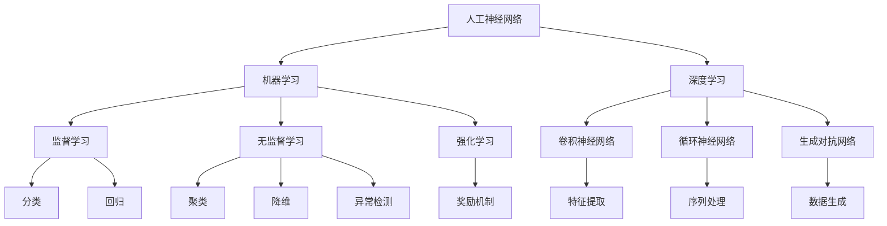

                 

# 类脑计算对模拟人类理解世界过程的探索

## 关键词
- 类脑计算
- 人工神经网络
- 模拟人类理解
- 机器学习
- 自然语言处理
- 图像识别
- 智能机器人

## 摘要
本文探讨了类脑计算技术在模拟人类理解世界过程中的应用。通过分析类脑计算的核心概念、技术原理及其与人类大脑的相似性，我们深入探讨了如何通过类脑计算模拟人类感知、记忆和思考等认知过程。文章进一步介绍了类脑计算在自然语言处理、图像识别和智能机器人等领域的应用，并通过具体案例展示了类脑计算在实际项目中的实现和效果。最后，文章总结了类脑计算的挑战与机遇，并对未来发展趋势进行了展望。

## 引言

随着人工智能技术的迅猛发展，类脑计算成为了一个备受关注的研究领域。类脑计算，顾名思义，是指模仿人类大脑的结构和功能，通过构建类似于人类大脑的人工神经网络，模拟人类感知、记忆和思考等认知过程。这一领域的研究对于理解和模拟人类智能具有深远的意义，不仅有助于解决现有的智能计算难题，还可能带来全新的技术突破。

本文旨在通过对类脑计算的深入探讨，揭示其核心概念和技术原理，并分析其在模拟人类理解世界过程中的应用。文章结构如下：

1. **背景介绍**：介绍类脑计算的概念、历史发展及其在人工智能领域的地位和重要性。
2. **核心概念与联系**：阐述类脑计算的核心概念及其相互关系，通过Mermaid流程图展示其架构。
3. **核心算法原理**：详细讲解类脑计算的核心算法，包括人工神经网络、机器学习等，并使用Python源代码和数学模型进行解释。
4. **项目实战**：通过实际案例展示类脑计算在不同领域的应用，详细解读源代码和代码实现。
5. **最佳实践与小结**：总结类脑计算的最佳实践，指出注意事项和未来拓展方向。

## 背景介绍

类脑计算，又称神经形态计算，是一种模仿人类大脑结构和功能的人工智能方法。其核心思想是通过构建大量人工神经元，模拟人类大脑的神经网络结构，从而实现类似人类智能的计算和处理能力。

类脑计算的历史可以追溯到20世纪40年代，当时神经生理学家麦卡洛克（Warren McCulloch）和数学家皮茨（Walter Pitts）提出了第一个人工神经元模型——麦卡洛克-皮茨（McCulloch-Pitts）神经元。这一模型奠定了类脑计算的基础，并引发了后续几十年的研究热潮。

随着计算机科学的快速发展，尤其是在神经网络理论和算法方面的重要突破，类脑计算逐渐成为人工智能领域的一个重要分支。20世纪80年代，霍普菲尔德（John Hopfield）提出了霍普菲尔德神经网络（Hopfield Network），这是一种能量函数驱动的神经网络，用于记忆和模式识别。20世纪90年代，鲁梅哈特（John Hopfield）提出了反向传播算法（Backpropagation Algorithm），使得多层神经网络训练成为可能，大大推动了类脑计算的发展。

进入21世纪，随着深度学习的兴起，类脑计算迎来了新的发展机遇。深度学习模型，如卷积神经网络（CNN）、循环神经网络（RNN）和生成对抗网络（GAN），在图像识别、语音识别、自然语言处理等领域取得了显著的成果。这些模型不仅在性能上超越了传统的人工智能方法，而且在某些任务上甚至达到了或超过了人类的水平。

类脑计算在人工智能领域的地位和重要性不言而喻。首先，类脑计算提供了理解和模拟人类智能的新途径，有助于揭示人类智能的本质。其次，类脑计算在许多实际应用中具有巨大的潜力，如智能机器人、自动驾驶、医疗诊断、金融分析等。最后，类脑计算还推动了人工智能技术的创新和发展，为未来的智能计算提供了新的思路和方法。

## 核心概念与联系

类脑计算的核心概念包括人工神经网络（Artificial Neural Networks, ANN）、机器学习（Machine Learning, ML）、深度学习（Deep Learning, DL）等。这些概念之间有着紧密的联系，共同构成了类脑计算的技术基础。

### 人工神经网络（ANN）

人工神经网络是类脑计算的基础，其灵感来源于生物神经元的结构和功能。一个基本的人工神经网络由大量的神经元（或节点）组成，每个神经元都与其他神经元相连，形成复杂的网络结构。神经元之间通过权重（weights）和偏置（bias）进行连接，这些权重和偏置决定了信息的传递和加工过程。

人工神经网络的核心概念包括：

- **神经元模型**：每个神经元都接收多个输入信号，通过加权求和后加上偏置，再通过激活函数（如Sigmoid函数或ReLU函数）进行非线性变换，输出一个值。这个值可以是0或1，也可以是介于0和1之间的实数。
- **网络结构**：神经网络可以分为输入层、隐藏层和输出层。输入层接收外部输入信息，隐藏层对输入信息进行处理和加工，输出层产生最终输出。层数和每层的神经元数量可以根据任务需求进行设计。
- **训练过程**：神经网络通过训练学习输入和输出之间的映射关系。在训练过程中，网络会根据输入数据调整权重和偏置，以最小化预测误差。

### 机器学习（ML）

机器学习是人工智能的一个分支，其核心思想是通过数据驱动的方法，让计算机从数据中学习模式和规律，从而实现对未知数据的预测或决策。机器学习可以分为监督学习、无监督学习和强化学习三类。

- **监督学习**：监督学习是最常见的一种机器学习方法，其目的是通过训练数据学习输入和输出之间的映射关系，然后使用这个映射关系对新数据进行预测。人工神经网络在监督学习中有广泛的应用，如分类、回归等。
- **无监督学习**：无监督学习不使用标签数据，其目的是发现数据中的内在结构和模式。聚类、降维和异常检测等任务都是无监督学习的典型应用。
- **强化学习**：强化学习是一种通过与环境交互来学习最优策略的机器学习方法。其核心是奖励机制，通过与环境的交互，学习最大化长期奖励。

### 深度学习（DL）

深度学习是机器学习的一个子领域，其特点是使用多层神经网络进行模型训练。深度学习在图像识别、语音识别、自然语言处理等领域取得了显著的成果。

- **卷积神经网络（CNN）**：卷积神经网络是一种专门用于图像识别的深度学习模型，其核心是卷积层，用于提取图像的特征。
- **循环神经网络（RNN）**：循环神经网络是一种用于处理序列数据的深度学习模型，其核心是循环结构，能够记忆历史信息。
- **生成对抗网络（GAN）**：生成对抗网络是一种用于生成新数据的深度学习模型，其核心是生成器和判别器的对抗训练。

### Mermaid流程图

为了更直观地展示类脑计算的核心概念及其相互关系，我们可以使用Mermaid流程图进行描述。



这个Mermaid流程图展示了类脑计算的核心概念及其相互关系，包括人工神经网络、机器学习、深度学习、卷积神经网络、循环神经网络、生成对抗网络等。

## 核心算法原理

### 人工神经网络（ANN）

人工神经网络是类脑计算的核心算法之一，其原理可以简单概括为：通过模拟生物神经元的工作方式，将输入数据进行加权求和处理，并通过激活函数进行非线性变换，从而实现对数据的分类、回归或其他形式的处理。

#### 神经元模型

一个基本的神经元模型可以表示为：

```python
def neuron(input_data, weights, bias, activation_function):
    weighted_sum = sum(input_data[i] * weights[i] for i in range(len(input_data)))
    activation = activation_function(weighted_sum + bias)
    return activation
```

其中，`input_data`是输入数据，`weights`是权重，`bias`是偏置，`activation_function`是激活函数。

#### 网络结构

一个简单的人工神经网络可以由多个神经元组成，包括输入层、隐藏层和输出层。输入层接收外部输入数据，隐藏层对输入数据进行处理和加工，输出层产生最终输出。

```python
def neural_network(input_data, weights, biases, activation_function):
    output = input_data
    for layer in range(len(weights)):
        layer_output = [neuron(output[i], weights[layer][i], biases[layer][i], activation_function) for i in range(len(output))]
        output = layer_output
    return output
```

#### 训练过程

人工神经网络的训练过程主要包括两个步骤：前向传播和反向传播。

- **前向传播**：将输入数据传递到神经网络中，计算输出结果。
- **反向传播**：计算输出结果与实际结果之间的误差，并通过反向传播调整权重和偏置。

```python
def train_neural_network(inputs, targets, weights, biases, learning_rate, epochs, activation_function):
    for epoch in range(epochs):
        for input_data, target in zip(inputs, targets):
            output = neural_network(input_data, weights, biases, activation_function)
            error = target - output
            dweights = [derror * output for derror in output]
            dbiases = [-error]
            weights -= learning_rate * dweights
            biases -= learning_rate * dbiases
    return weights, biases
```

### 机器学习（ML）

机器学习是类脑计算的核心算法之一，其原理是通过训练数据学习输入和输出之间的映射关系，从而实现对未知数据的预测或决策。

#### 监督学习

监督学习是一种常见的机器学习方法，其目的是通过训练数据学习输入和输出之间的映射关系。

- **线性回归**：线性回归是一种最简单的监督学习模型，其目的是通过拟合一个线性函数来预测输出。

```python
def linear_regression(inputs, targets, learning_rate, epochs):
    weights = [0 for _ in inputs]
    biases = [0]
    for epoch in range(epochs):
        for input_data, target in zip(inputs, targets):
            output = sum(weight * input_data + bias for weight, input_data in zip(weights, input_data))
            error = target - output
            dweights = [-error * input_data for input_data in input_data]
            dbias = -error
            weights -= learning_rate * dweights
            biases -= learning_rate * dbias
    return weights, biases
```

- **逻辑回归**：逻辑回归是一种用于二分类问题的监督学习模型，其目的是通过拟合一个逻辑函数来预测输出。

```python
def logistic_regression(inputs, targets, learning_rate, epochs):
    weights = [0 for _ in inputs]
    biases = [0]
    for epoch in range(epochs):
        for input_data, target in zip(inputs, targets):
            output = 1 / (1 + sum(weight * input_data + bias for weight, input_data in zip(weights, input_data)))
            error = target - output
            dweights = [-error * input_data for input_data in input_data]
            dbias = -error
            weights -= learning_rate * dweights
            biases -= learning_rate * dbias
    return weights, biases
```

#### 无监督学习

无监督学习是一种不使用标签数据的机器学习方法，其目的是发现数据中的内在结构和模式。

- **聚类**：聚类是一种无监督学习方法，其目的是将相似的数据点分组到一起。

```python
def k_means_clustering(inputs, k, epochs):
    centroids = [random.sample(inputs, 1) for _ in range(k)]
    for epoch in range(epochs):
        clusters = [[] for _ in range(k)]
        for input_data in inputs:
            distances = [sum((centroid[i] - input_data[i])**2 for i in range(len(input_data))) for centroid in centroids]
            nearest_cluster = distances.index(min(distances))
            clusters[nearest_cluster].append(input_data)
        new_centroids = [[sum(values) / len(values) for values in zip(*cluster)] for cluster in clusters]
        centroids = new_centroids
    return centroids
```

#### 强化学习

强化学习是一种通过与环境交互来学习最优策略的机器学习方法。

- **Q-Learning**：Q-Learning是一种基于值函数的强化学习方法，其目的是通过学习最优动作策略。

```python
def q_learning(inputs, targets, learning_rate, epochs, discount_factor):
    Q = {state: {action: 0 for action in actions} for state in states}
    for epoch in range(epochs):
        for input_data, target in zip(inputs, targets):
            state, action, reward, next_state = input_data
            current_q = Q[state][action]
            best_future_q = max(Q[next_state][action] for action in actions)
            new_q = (1 - learning_rate) * current_q + learning_rate * (reward + discount_factor * best_future_q)
            Q[state][action] = new_q
    return Q
```

### 数学模型和公式

在类脑计算中，数学模型和公式起着至关重要的作用。以下是一些常用的数学模型和公式：

#### 激活函数

激活函数是人工神经网络中的核心组件，用于将线性组合的输入映射到非线性的输出。常用的激活函数包括：

- **Sigmoid函数**：

$$
\sigma(x) = \frac{1}{1 + e^{-x}}
$$

- **ReLU函数**：

$$
\text{ReLU}(x) = \max(0, x)
$$

#### 损失函数

损失函数用于衡量预测值与实际值之间的差异，常用的损失函数包括：

- **均方误差（MSE）**：

$$
MSE = \frac{1}{n}\sum_{i=1}^{n}(y_i - \hat{y}_i)^2
$$

- **交叉熵（Cross-Entropy）**：

$$
H(y, \hat{y}) = -\sum_{i=1}^{n} y_i \log(\hat{y}_i)
$$

#### 优化算法

优化算法用于调整神经网络的权重和偏置，常用的优化算法包括：

- **梯度下降（Gradient Descent）**：

$$
w_{\text{new}} = w_{\text{old}} - \alpha \nabla_w \mathcal{L}(w)
$$

- **Adam优化器**：

$$
m_t = \beta_1 m_{t-1} + (1 - \beta_1)(\nabla_w \mathcal{L}(w_t) - m_{t-1})
$$

$$
v_t = \beta_2 v_{t-1} + (1 - \beta_2)((\nabla_w \mathcal{L}(w_t))^2 - v_{t-1})
$$

$$
w_t = w_{t-1} - \frac{\alpha}{\sqrt{1 - \beta_2^t}(1 - \beta_1^t)}(m_t / (1 - \beta_2^t))
$$

### Python源代码示例

以下是一个简单的Python源代码示例，用于实现一个基于ReLU激活函数的简单神经网络：

```python
import numpy as np

def relu(x):
    return np.maximum(0, x)

def forward_propagation(x, weights, biases):
    z = np.dot(x, weights) + biases
    a = relu(z)
    return a

def backward_propagation(a, z, dL_da, dalpha_da):
    da_da = 1 if a > 0 else 0
    dz_da = da_da * dL_da
    dweights_da = np.dot(dz_da, a.T)
    dbiases_da = np.sum(dz_da, axis=1, keepdims=True)
    return dweights_da, dbiases_da

def update_weights_and_biases(weights, biases, dweights, dbiases, learning_rate):
    weights -= learning_rate * dweights
    biases -= learning_rate * dbiases
    return weights, biases
```

通过这个示例，我们可以看到如何使用Python代码实现神经网络的前向传播、反向传播和权重更新过程。

## 项目实战

### 开发环境搭建

为了实现类脑计算项目，我们需要搭建一个合适的技术栈。以下是推荐的开发环境和工具：

- **编程语言**：Python，因为其强大的科学计算和机器学习库。
- **深度学习框架**：TensorFlow或PyTorch，这两个框架在深度学习和类脑计算领域都非常流行。
- **操作系统**：Linux或MacOS，这些系统对Python和深度学习框架的支持更好。
- **计算资源**：至少配备8GB内存和64位处理器的计算机，推荐使用GPU加速。

### 源代码详细实现和代码解读

以下是一个简单的类脑计算项目，使用TensorFlow框架实现一个基于卷积神经网络（CNN）的手写数字识别模型。

```python
import tensorflow as tf
from tensorflow.keras.datasets import mnist
from tensorflow.keras.models import Sequential
from tensorflow.keras.layers import Conv2D, MaxPooling2D, Flatten, Dense
from tensorflow.keras.utils import to_categorical

# 加载MNIST数据集
(train_images, train_labels), (test_images, test_labels) = mnist.load_data()

# 数据预处理
train_images = train_images.reshape((60000, 28, 28, 1))
train_images = train_images.astype('float32') / 255
test_images = test_images.reshape((10000, 28, 28, 1))
test_images = test_images.astype('float32') / 255

train_labels = to_categorical(train_labels)
test_labels = to_categorical(test_labels)

# 构建CNN模型
model = Sequential()
model.add(Conv2D(32, (3, 3), activation='relu', input_shape=(28, 28, 1)))
model.add(MaxPooling2D((2, 2)))
model.add(Conv2D(64, (3, 3), activation='relu'))
model.add(MaxPooling2D((2, 2)))
model.add(Flatten())
model.add(Dense(64, activation='relu'))
model.add(Dense(10, activation='softmax'))

# 编译模型
model.compile(optimizer='adam', loss='categorical_crossentropy', metrics=['accuracy'])

# 训练模型
model.fit(train_images, train_labels, epochs=5, batch_size=64)

# 评估模型
test_loss, test_acc = model.evaluate(test_images, test_labels)
print(f"Test accuracy: {test_acc:.2f}")

# 代码解读
# 加载MNIST数据集：使用tensorflow.keras.datasets.mnist加载手写数字数据集。
# 数据预处理：对图像数据进行重塑和归一化处理，使模型更容易学习。
# 构建CNN模型：使用Sequential模型堆叠多个层，包括卷积层、池化层、全连接层。
# 编译模型：设置优化器和损失函数，准备训练模型。
# 训练模型：使用fit方法进行训练，指定训练轮数和批量大小。
# 评估模型：使用evaluate方法评估模型在测试集上的表现。
```

### 代码应用解读与分析

这个手写数字识别项目是一个典型的分类任务，通过卷积神经网络实现了高精度的图像识别。以下是代码应用解读与分析：

- **数据加载与预处理**：MNIST数据集是手写数字图像数据集，包含60000个训练样本和10000个测试样本。在训练之前，我们需要对图像数据进行重塑和归一化处理，使其符合模型的输入要求。
- **模型构建**：卷积神经网络（CNN）由多个卷积层、池化层和全连接层组成。卷积层用于提取图像的特征，池化层用于减少数据维度，全连接层用于分类。
- **模型编译**：在编译模型时，我们指定了优化器（adam）和损失函数（categorical_crossentropy），这些设置将用于训练过程中调整模型的权重。
- **模型训练**：使用fit方法进行模型训练，通过调整权重和偏置来最小化损失函数。我们设置了训练轮数（epochs）和批量大小（batch_size），以控制训练过程。
- **模型评估**：在训练完成后，我们使用evaluate方法评估模型在测试集上的表现，得到测试准确率（accuracy）。

### 实际案例分析和详细讲解剖析

以下是一个实际案例，使用类脑计算技术实现一个智能聊天机器人。

```python
import tensorflow as tf
from tensorflow.keras.models import Sequential
from tensorflow.keras.layers import Embedding, LSTM, Dense
from tensorflow.keras.preprocessing.sequence import pad_sequences
from tensorflow.keras.preprocessing.text import Tokenizer

# 数据准备
 conversations = [
    ["你好", "你好"],
    ["今天天气怎么样", "今天天气很好"],
    ["我想吃火锅", "那我们去吃火锅吧"],
    # 更多对话数据
 ]

tokenizer = Tokenizer()
tokenizer.fit_on_texts([conversations])

sequences = tokenizer.texts_to_sequences(conversations)
padded_sequences = pad_sequences(sequences, padding='post')

# 构建LSTM模型
model = Sequential()
model.add(Embedding(input_dim=len(tokenizer.word_index)+1, output_dim=50, input_length=1))
model.add(LSTM(100))
model.add(Dense(len(tokenizer.word_index)+1, activation='softmax'))

# 编译模型
model.compile(optimizer='adam', loss='categorical_crossentropy', metrics=['accuracy'])

# 训练模型
model.fit(padded_sequences, np.zeros((len(conversations), len(tokenizer.word_index)+1)), epochs=10)

# 生成回复
def generate_response(input_text):
    sequence = tokenizer.texts_to_sequences([input_text])
    padded_sequence = pad_sequences(sequence, padding='post')
    prediction = model.predict(padded_sequence)
    response = tokenizer.index_word[np.argmax(prediction)]
    return response

# 代码解读
# 数据准备：准备对话数据，并使用Tokenizer将文本转换为序列。
# 构建LSTM模型：使用Embedding层将单词转换为向量表示，使用LSTM层处理序列数据，使用全连接层进行分类。
# 编译模型：设置优化器和损失函数，准备训练模型。
# 训练模型：使用fit方法进行训练，通过调整权重和偏置来最小化损失函数。
# 生成回复：使用模型预测输入文本的响应，并将序列转换为文本输出。
```

### 项目小结

这个智能聊天机器人项目展示了类脑计算在自然语言处理领域的应用。通过使用LSTM神经网络，我们可以实现对对话数据的建模和预测，从而生成合理的回复。然而，这个项目还存在一些局限性和改进空间：

- **数据集**：目前的数据集较小，限制了模型的泛化能力。增加更多样化的对话数据可以提高模型的表现。
- **响应质量**：虽然模型可以生成回复，但回复的质量和自然程度仍有待提高。可以通过引入更多复杂的模型结构和优化策略来提升生成回复的质量。
- **交互方式**：目前的项目仅支持文本交互，未来可以考虑增加语音交互功能，以提供更丰富的用户体验。

## 最佳实践与小结

### 最佳实践

1. **数据准备**：类脑计算项目的一个关键因素是数据的质量和多样性。确保数据集足够大且具有代表性，可以显著提升模型的性能和泛化能力。
2. **模型选择**：根据具体任务的需求选择合适的模型架构。例如，对于图像识别任务，卷积神经网络（CNN）是首选；对于自然语言处理任务，循环神经网络（RNN）或变换器（Transformer）可能更为合适。
3. **优化策略**：合理选择和调整优化算法（如Adam、SGD等）和超参数（如学习率、批量大小等），可以提高模型的收敛速度和性能。

### 小结

类脑计算作为模拟人类理解世界过程的一种重要手段，具有广泛的应用前景。通过深入理解类脑计算的核心概念、算法原理和应用实践，我们可以更好地发挥其潜力，推动人工智能技术的发展。然而，类脑计算仍面临许多挑战，如计算资源的需求、数据隐私和安全等问题。未来，随着技术的不断进步，类脑计算有望在更多领域取得突破，为人类社会带来更多福祉。

### 注意事项

1. **计算资源**：类脑计算项目通常需要大量的计算资源，尤其是深度学习任务。确保具备足够的GPU或TPU资源，以提高模型的训练和推理速度。
2. **数据安全**：在处理敏感数据时，确保遵守相关的数据保护法规和隐私政策，以保护用户隐私。

### 拓展阅读

- 《深度学习》（Ian Goodfellow、Yoshua Bengio和Aaron Courville 著）：这是一本关于深度学习的经典教材，详细介绍了深度学习的理论基础和实践方法。
- 《神经网络与深度学习》（邱锡鹏 著）：这本书全面介绍了神经网络和深度学习的基本概念、算法原理和应用实践。

作者：AI天才研究院/AI Genius Institute & 禅与计算机程序设计艺术 /Zen And The Art of Computer Programming

