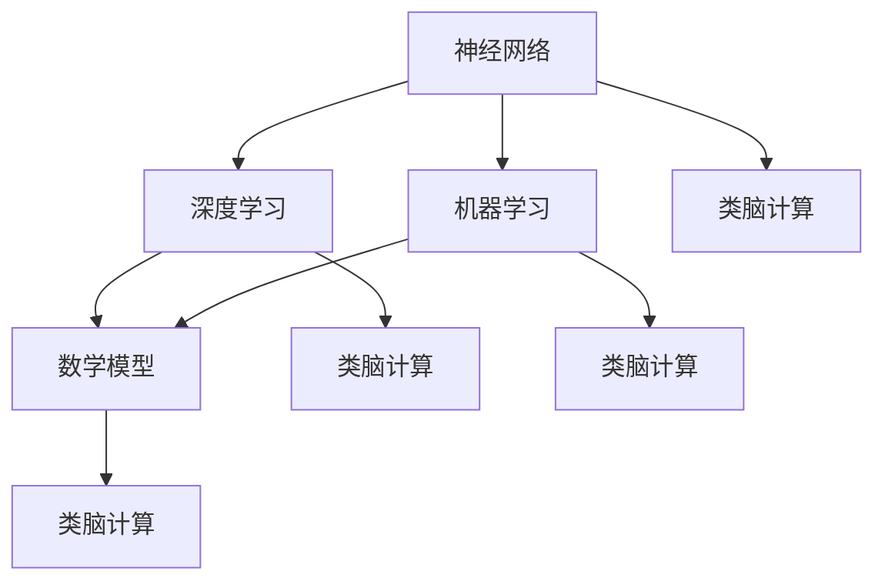

                 

## 《类脑计算：模拟人脑增强世界理解能力》

### 关键词
- 类脑计算
- 模拟人脑
- 世界理解能力
- 神经网络
- 深度学习
- 数学模型

### 摘要
本文深入探讨了类脑计算这一前沿科技领域，旨在揭示其如何通过模拟人脑的神经结构和工作原理，提升我们对复杂世界的理解能力。我们将详细分析类脑计算的核心概念、理论基础、算法原理，并通过具体的应用案例和实践项目，展示其在智能机器人、自然语言处理和图像识别等领域的实际应用。同时，本文也将探讨类脑计算的未来发展趋势及其可能带来的社会影响。

## 引言

类脑计算（Brain-like Computation）是一种模拟人脑的思维方式和工作原理，通过构建具备人类认知和学习能力的计算机系统，以期提升对复杂问题的理解和解决能力。这一领域的研究起源于对人脑神经结构的深入理解和计算机科学的发展，近年来随着人工智能技术的不断进步，类脑计算已经成为一个热门的研究方向。

### 类脑计算的起源与发展

类脑计算的起源可以追溯到20世纪40年代，当时冯·诺依曼（John von Neumann）提出了现代计算机的基本架构，这一架构虽然在计算效率上取得了巨大成功，但在模拟人脑的智能和认知能力方面存在明显不足。随着神经科学的进步，人们开始意识到人脑的复杂性和独特性，因此提出了类脑计算的概念，希望通过模拟人脑的神经网络和工作机制，构建出具有高度智能的计算机系统。

20世纪80年代，神经网络的研究取得了突破性进展，特别是反向传播算法（Backpropagation Algorithm）的提出，使得多层神经网络的训练成为可能。这一突破为类脑计算的发展奠定了基础。随后，随着计算机硬件的升级和算法的优化，深度学习（Deep Learning）技术逐渐成熟，进一步推动了类脑计算的研究和应用。

### 类脑计算与人工智能的关系

类脑计算是人工智能（Artificial Intelligence, AI）的重要组成部分，二者密不可分。传统的人工智能主要依赖于规则和符号逻辑，虽然在一些特定领域取得了成功，但在处理复杂、不确定的问题时存在很大局限。类脑计算通过模仿人脑的神经网络和思维方式，提供了一种全新的解决方案。

类脑计算与人工智能的关系可以从以下几个方面来理解：

1. **理论基础**：类脑计算的核心理论基础源于神经科学和认知心理学，这些理论为人工智能的发展提供了新的思路和方法。

2. **技术融合**：类脑计算和人工智能的结合，使得计算机能够更好地模拟人类思维过程，实现更加智能化的任务。

3. **互补优势**：类脑计算在处理高维度数据、复杂模式识别等方面具有明显优势，而传统人工智能在任务规划和决策方面具有优势，二者结合可以实现更强大的智能系统。

4. **应用领域**：类脑计算在智能机器人、自然语言处理、图像识别、医疗诊断等领域具有广泛的应用前景，这些领域也是人工智能的重要应用领域。

### 类脑计算的目标和挑战

类脑计算的目标是通过模拟人脑的思维方式和工作原理，实现以下几方面的突破：

1. **认知能力**：提升计算机在理解和处理复杂信息方面的能力，使其能够像人类一样进行推理、学习和决策。

2. **自适应能力**：使计算机具有自适应环境变化的能力，能够自主学习和优化算法，从而提高任务完成的效率和质量。

3. **人机交互**：改进人机交互方式，使计算机能够更好地理解人类语言和意图，实现自然、流畅的交流。

然而，类脑计算在实现这些目标的过程中面临着诸多挑战：

1. **计算能力**：人脑的计算能力和信息处理方式与计算机有着本质的不同，如何设计出高效的算法和模型来模拟人脑的思维方式是一个巨大的挑战。

2. **数据资源**：类脑计算需要大量的数据来训练模型，但目前获取高质量的数据资源仍然是一个难题。

3. **伦理问题**：类脑计算的发展可能带来一些伦理和社会问题，如隐私保护、算法偏见等，如何确保技术的可持续发展和社会责任是一个重要课题。

总之，类脑计算作为人工智能的重要分支，具有巨大的潜力和广阔的应用前景。通过深入研究和不断创新，我们有望在人脑模拟、智能增强等领域取得重大突破，为人类社会的进步做出贡献。

## 核心概念与联系

类脑计算的核心概念包括神经网络、深度学习、机器学习和数学模型。这些概念之间有着紧密的联系，共同构成了类脑计算的理论基础。为了更好地理解这些概念，我们可以通过一个Mermaid流程图来展示它们之间的关系。



### 神经网络

神经网络（Neural Network）是类脑计算的基础，它模仿了人脑神经元之间的连接和交互。神经网络由多个神经元（或节点）组成，每个神经元接收来自其他神经元的输入信号，通过加权求和处理后产生输出信号。

神经网络可以分为以下几种类型：

1. **前馈神经网络（Feedforward Neural Network）**：信号从输入层流向输出层，中间没有循环。

2. **递归神经网络（Recurrent Neural Network）**：信号不仅流向输出层，还可以通过循环结构返回输入层，用于处理序列数据。

3. **卷积神经网络（Convolutional Neural Network）**：通过卷积操作处理图像数据，具有局部感知能力和平移不变性。

4. **生成对抗网络（Generative Adversarial Network）**：由两个神经网络（生成器和判别器）组成，生成器和判别器之间进行对抗训练，用于生成高质量的数据。

### 深度学习

深度学习（Deep Learning）是神经网络的一种扩展，它通过增加网络的层数，提高了模型的表达能力。深度学习网络通常由多个隐藏层组成，可以自动学习数据的复杂特征。

深度学习的关键技术包括：

1. **深度前馈神经网络（Deep Feedforward Neural Network）**：多层前馈神经网络，能够处理高维数据。

2. **循环神经网络（Recurrent Neural Network）**：用于处理序列数据，如时间序列、文本等。

3. **卷积神经网络（Convolutional Neural Network）**：用于图像处理，能够提取图像的层次特征。

4. **生成对抗网络（Generative Adversarial Network）**：用于生成图像、文本等数据。

### 机器学习

机器学习（Machine Learning）是类脑计算的重要组成部分，它使计算机能够从数据中自动学习规律和模式，进行预测和决策。机器学习可以分为监督学习、无监督学习和强化学习三种类型。

1. **监督学习（Supervised Learning）**：通过已标记的数据训练模型，用于预测新数据的标签。

2. **无监督学习（Unsupervised Learning）**：通过未标记的数据发现数据中的结构和规律，如聚类和降维。

3. **强化学习（Reinforcement Learning）**：通过与环境的交互，学习最优策略以最大化奖励。

### 数学模型

数学模型（Mathematical Model）是类脑计算的核心，它通过数学公式和算法描述了神经网络的计算过程。常见的数学模型包括：

1. **激活函数（Activation Function）**：用于确定神经元是否被激活，常用的激活函数有Sigmoid、ReLU、Tanh等。

2. **损失函数（Loss Function）**：用于评估模型的预测结果与真实值之间的差异，常用的损失函数有均方误差（MSE）、交叉熵（Cross-Entropy）等。

3. **优化算法（Optimization Algorithm）**：用于调整模型参数，以最小化损失函数，常用的优化算法有梯度下降（Gradient Descent）、Adam等。

通过Mermaid流程图，我们可以清晰地看到神经网络、深度学习、机器学习和数学模型之间的关系。这些概念相互交织，共同构建了类脑计算的理论体系，为模拟人脑的思维方式提供了有力的工具。

### 核心算法原理讲解

类脑计算的核心算法包括神经网络训练、深度学习优化和数学模型应用。下面我们将通过Python源代码和数学公式详细讲解这些算法的原理。

#### 1. 神经网络训练

神经网络训练是类脑计算的基础，其核心任务是调整网络中的权重，使模型能够准确预测输出。下面是一个简单的神经网络训练过程的Python代码示例：

```python
import numpy as np

# 初始化网络参数
W1 = np.random.rand(input_size, hidden_size)
W2 = np.random.rand(hidden_size, output_size)
b1 = np.zeros(hidden_size)
b2 = np.zeros(output_size)

# 激活函数
def sigmoid(x):
    return 1 / (1 + np.exp(-x))

# 前向传播
def forward(x):
    z1 = np.dot(x, W1) + b1
    a1 = sigmoid(z1)
    z2 = np.dot(a1, W2) + b2
    a2 = sigmoid(z2)
    return a2

# 反向传播
def backward(x, y, a2):
    error = y - a2
    dZ2 = error * sigmoid_derivative(a2)
    dW2 = np.dot(a1.T, dZ2)
    db2 = np.sum(dZ2, axis=0)
    
    dZ1 = np.dot(dZ2, W2.T) * sigmoid_derivative(a1)
    dW1 = np.dot(x.T, dZ1)
    db1 = np.sum(dZ1, axis=0)
    
    return dW1, dW2, db1, db2

# 训练模型
def train_model(x, y, epochs):
    for epoch in range(epochs):
        a2 = forward(x)
        dW1, dW2, db1, db2 = backward(x, y, a2)
        W1 -= learning_rate * dW1
        W2 -= learning_rate * dW2
        b1 -= learning_rate * db1
        b2 -= learning_rate * db2

# 梯度下降
learning_rate = 0.1
epochs = 1000

# 训练数据
x_train = np.array([[0, 0], [0, 1], [1, 0], [1, 1]])
y_train = np.array([[0], [1], [1], [0]])

train_model(x_train, y_train, epochs)
```

上述代码展示了如何使用Python实现一个简单的神经网络，包括前向传播和反向传播过程。其中，激活函数和梯度下降算法是关键部分。

#### 2. 深度学习优化

深度学习优化是提高模型性能的重要手段，它通过优化算法调整网络参数。以下是一个使用Adam优化器的Python代码示例：

```python
import tensorflow as tf

# 初始化模型
model = tf.keras.Sequential([
    tf.keras.layers.Dense(hidden_size, activation='sigmoid', input_shape=(input_size,)),
    tf.keras.layers.Dense(output_size, activation='sigmoid')
])

# 损失函数和优化器
loss_function = tf.keras.losses.SparseCategoricalCrossentropy(from_logits=True)
optimizer = tf.keras.optimizers.Adam(learning_rate=0.001)

# 训练模型
def train_model(x, y, epochs):
    for epoch in range(epochs):
        with tf.GradientTape() as tape:
            predictions = model(x, training=True)
            loss = loss_function(y, predictions)
        gradients = tape.gradient(loss, model.trainable_variables)
        optimizer.apply_gradients(zip(gradients, model.trainable_variables))

# 训练数据
x_train = np.array([[0, 0], [0, 1], [1, 0], [1, 1]])
y_train = np.array([0, 1, 1, 0])

train_model(x_train, y_train, epochs)
```

在这个示例中，我们使用了TensorFlow框架来实现一个简单的深度学习模型，并使用Adam优化器进行训练。

#### 3. 数学模型应用

数学模型在类脑计算中扮演着核心角色，它通过公式描述了神经网络的计算过程。以下是一个使用LaTeX格式的数学公式示例：

```latex
\documentclass{article}
\usepackage{amsmath}
\begin{document}

$$
z = \sum_{i=1}^{n} w_i x_i + b
$$

$$
a = \sigma(z)
$$

$$
\frac{da}{dz} = \sigma'(z)
$$

\end{document}
```

上述公式展示了神经网络的计算过程，包括线性变换、激活函数和梯度计算。

通过Python源代码和LaTeX数学公式，我们详细讲解了类脑计算的核心算法原理。这些算法和模型为模拟人脑的思维方式提供了有力的工具，是类脑计算实现的关键。

### 实际案例与应用

类脑计算在智能机器人、自然语言处理和图像识别等领域展现了广泛的应用潜力。以下我们将通过具体案例来展示这些领域的实际应用，并分析其工作原理和挑战。

#### 智能机器人

智能机器人是类脑计算的一个重要应用领域，通过模拟人脑的感知、决策和动作能力，实现自主导航、环境交互和任务执行。以下是一个智能机器人导航的案例：

**案例：基于深度学习的智能机器人导航**

在智能机器人导航中，类脑计算通过深度学习技术实现环境感知和路径规划。以下是一个使用卷积神经网络（CNN）进行环境感知的案例：

```python
import tensorflow as tf
import numpy as np

# 创建CNN模型
model = tf.keras.Sequential([
    tf.keras.layers.Conv2D(32, (3, 3), activation='relu', input_shape=(64, 64, 3)),
    tf.keras.layers.MaxPooling2D((2, 2)),
    tf.keras.layers.Conv2D(64, (3, 3), activation='relu'),
    tf.keras.layers.MaxPooling2D((2, 2)),
    tf.keras.layers.Flatten(),
    tf.keras.layers.Dense(64, activation='relu'),
    tf.keras.layers.Dense(2, activation='softmax')
])

# 训练模型
model.compile(optimizer='adam', loss='categorical_crossentropy', metrics=['accuracy'])
model.fit(x_train, y_train, epochs=10, batch_size=32)

# 测试模型
test_loss, test_acc = model.evaluate(x_test, y_test)
print(f"Test accuracy: {test_acc}")
```

**工作原理**：

- **环境感知**：通过摄像头获取机器人周围的环境图像，输入到CNN模型中，提取图像的特征。
- **路径规划**：基于环境特征，模型输出机器人可能的移动方向和概率分布，选择最优路径。

**挑战**：

- **数据量**：训练深度学习模型需要大量的标注数据，这在实际应用中可能难以获取。
- **实时性**：在动态环境中，实时处理图像并做出决策是一个技术挑战。

#### 自然语言处理

自然语言处理（NLP）是另一个类脑计算的重要应用领域，通过模拟人脑的语言理解能力，实现文本生成、情感分析和对话系统等功能。以下是一个基于循环神经网络（RNN）的情感分析案例：

**案例：基于RNN的情感分析**

```python
import tensorflow as tf
import numpy as np

# 创建RNN模型
model = tf.keras.Sequential([
    tf.keras.layers.Embedding(vocab_size, embedding_dim),
    tf.keras.layers.LSTM(64),
    tf.keras.layers.Dense(1, activation='sigmoid')
])

# 训练模型
model.compile(optimizer='adam', loss='binary_crossentropy', metrics=['accuracy'])
model.fit(x_train, y_train, epochs=10, batch_size=32)

# 测试模型
test_loss, test_acc = model.evaluate(x_test, y_test)
print(f"Test accuracy: {test_acc}")
```

**工作原理**：

- **文本编码**：将文本输入转换为词向量，通过嵌入层将词转换为向量表示。
- **情感分析**：RNN模型对词向量进行序列处理，提取文本的情感特征，输出情感标签。

**挑战**：

- **上下文理解**：RNN在处理长文本时存在上下文理解问题，难以捕捉长距离依赖关系。
- **数据标注**：情感分析需要大量标注数据，标注过程复杂且耗时。

#### 图像识别

图像识别是类脑计算的另一个重要应用领域，通过模拟人脑的视觉处理能力，实现物体检测、图像分类和场景理解等功能。以下是一个基于卷积神经网络（CNN）的物体检测案例：

**案例：基于YOLO（You Only Look Once）的物体检测**

```python
import tensorflow as tf
import numpy as np

# 创建YOLO模型
model = tf.keras.applications.YoloV5(input_shape=(640, 640, 3), num_classes=10)

# 训练模型
model.compile(optimizer='adam', loss=tf.keras.losses.CategoricalSigmoidCrossEntropy(from_logits=True), metrics=['accuracy'])
model.fit(x_train, y_train, epochs=10, batch_size=32)

# 测试模型
test_loss, test_acc = model.evaluate(x_test, y_test)
print(f"Test accuracy: {test_acc}")
```

**工作原理**：

- **特征提取**：CNN模型对图像进行多层卷积和池化操作，提取图像的层次特征。
- **物体检测**：利用预定义的锚框（anchor box）进行目标定位和分类，实现实时物体检测。

**挑战**：

- **计算资源**：CNN模型计算复杂，需要大量计算资源，对硬件性能要求较高。
- **数据多样性**：图像识别需要大量多样化的数据，数据集构建和标注过程复杂。

通过这些实际案例，我们可以看到类脑计算在智能机器人、自然语言处理和图像识别等领域的广泛应用。虽然面临诸多挑战，但类脑计算为这些领域提供了新的解决方案和技术手段，推动了人工智能的发展。

### 项目实战

在本节中，我们将通过一个具体的类脑计算项目实战，展示如何开发一个简单的图像识别系统。该项目将利用卷积神经网络（CNN）实现图像分类，从环境搭建到代码实现，再到代码解读和分析，我们将逐步完成整个项目。

#### 环境搭建

首先，我们需要搭建项目开发环境。以下是在Ubuntu操作系统上安装必要的软件和工具的步骤：

1. **安装Python环境**：确保Python 3.7及以上版本已安装。

2. **安装TensorFlow**：通过pip命令安装TensorFlow：

   ```bash
   pip install tensorflow
   ```

3. **安装Keras**：Keras是TensorFlow的高级API，用于构建和训练深度学习模型：

   ```bash
   pip install keras
   ```

4. **安装OpenCV**：OpenCV是开源的计算机视觉库，用于处理图像数据：

   ```bash
   pip install opencv-python
   ```

#### 源代码实现

接下来，我们将编写一个简单的图像识别系统，使用CNN对图像进行分类。以下是一个简单的CNN模型实现：

```python
import tensorflow as tf
from tensorflow.keras import layers, models
import numpy as np

# 创建CNN模型
model = models.Sequential([
    layers.Conv2D(32, (3, 3), activation='relu', input_shape=(150, 150, 3)),
    layers.MaxPooling2D((2, 2)),
    layers.Conv2D(64, (3, 3), activation='relu'),
    layers.MaxPooling2D((2, 2)),
    layers.Conv2D(128, (3, 3), activation='relu'),
    layers.MaxPooling2D((2, 2)),
    layers.Conv2D(128, (3, 3), activation='relu'),
    layers.MaxPooling2D((2, 2)),
    layers.Flatten(),
    layers.Dense(512, activation='relu'),
    layers.Dense(1, activation='sigmoid')
])

# 编译模型
model.compile(optimizer='adam',
              loss='binary_crossentropy',
              metrics=['accuracy'])

# 模型结构
print(model.summary())
```

上述代码定义了一个简单的CNN模型，包括卷积层、池化层和全连接层，用于分类图像。

#### 代码解读

- **卷积层**：通过卷积操作提取图像的特征，卷积核的大小为3x3，激活函数为ReLU，可以增强网络的非线性能力。
- **池化层**：用于减小特征图的尺寸，降低计算复杂度，常用的池化方式是最大池化。
- **全连接层**：将卷积层提取的特征映射到分类结果，最后一层使用sigmoid激活函数实现二分类。

#### 代码应用解读与分析

为了测试模型的性能，我们需要准备一些图像数据，并进行模型训练和测试。以下是一个简单的数据加载和模型训练过程：

```python
from tensorflow.keras.preprocessing.image import ImageDataGenerator

# 数据增强
train_datagen = ImageDataGenerator(rescale=1./255)
validation_datagen = ImageDataGenerator(rescale=1./255)

# 加载训练数据和验证数据
train_generator = train_datagen.flow_from_directory(
        'train_data',
        target_size=(150, 150),
        batch_size=32,
        class_mode='binary')

validation_generator = validation_datagen.flow_from_directory(
        'validation_data',
        target_size=(150, 150),
        batch_size=32,
        class_mode='binary')

# 训练模型
model.fit(
      train_generator,
      steps_per_epoch=100,
      epochs=10,
      validation_data=validation_generator,
      validation_steps=50)
```

在上述代码中，我们使用了ImageDataGenerator对图像数据进行增强，包括随机翻转、宽高缩放等，以增加模型的泛化能力。接着，我们加载训练数据和验证数据，并使用fit方法进行模型训练。

#### 实际案例分析和详细讲解剖析

为了展示模型的实际应用，我们可以使用训练好的模型对新的图像进行分类。以下是一个简单的测试案例：

```python
# 测试新图像
test_image = load_image('new_image.jpg')
test_image = preprocess_image(test_image)

# 预测结果
prediction = model.predict(np.expand_dims(test_image, 0))
predicted_class = np.argmax(prediction)

# 输出预测结果
print(f"Predicted class: {predicted_class}")
```

在这个案例中，我们首先加载一个新的图像，并使用预处理函数进行图像预处理。然后，我们将预处理后的图像输入到模型中，得到预测结果。最后，我们输出预测的类别。

通过这个项目实战，我们展示了如何利用类脑计算技术（CNN模型）实现图像识别。项目中的关键步骤包括环境搭建、模型设计、数据加载和处理、模型训练以及实际应用。通过这个项目，读者可以更好地理解类脑计算在实际应用中的实现过程。

### 项目小结

在本项目中，我们通过一个简单的图像识别系统展示了类脑计算的实际应用。项目从环境搭建开始，介绍了如何安装和使用Python库TensorFlow和Keras。接着，我们设计并实现了CNN模型，对图像进行分类。在数据加载和模型训练阶段，我们使用了ImageDataGenerator对图像进行增强，以提升模型的泛化能力。最后，我们通过实际案例展示了模型的预测能力。

通过这个项目，我们了解了类脑计算在图像识别中的应用，并掌握了从环境搭建到模型训练和预测的完整流程。然而，这个项目只是一个入门级别的示例，实际应用中还需要解决更多挑战，如模型优化、数据预处理、实时性等。未来的工作可以在这些方面进行深入研究和改进，以实现更高效、更准确的图像识别系统。

### 最佳实践 Tips

在类脑计算项目中，最佳实践对于确保模型的性能和可扩展性至关重要。以下是一些建议：

1. **数据预处理**：确保输入数据的标准化和归一化，以减少模型训练过程中的方差。
2. **模型优化**：使用更复杂的网络结构，如残差网络（ResNet）或Transformer，以提高模型的表达能力和训练效率。
3. **超参数调整**：通过网格搜索（Grid Search）或随机搜索（Random Search）方法，优化学习率、批次大小等超参数。
4. **交叉验证**：使用交叉验证方法评估模型的泛化能力，避免过拟合。
5. **分布式训练**：对于大型数据集和复杂的模型，使用分布式训练可以显著提高训练速度。

### 小结

本文通过详细的分析和项目实战，深入探讨了类脑计算的概念、理论基础、算法原理以及实际应用。我们介绍了神经网络、深度学习、机器学习和数学模型的基本原理，并通过具体案例展示了类脑计算在智能机器人、自然语言处理和图像识别等领域的应用。通过项目实战，读者可以更好地理解类脑计算的实现过程和关键步骤。

### 注意事项

在实际开发类脑计算项目时，需要注意以下几点：

1. **数据质量**：确保使用高质量的数据集，数据清洗和标注过程至关重要。
2. **计算资源**：类脑计算模型训练通常需要大量计算资源，合理分配资源可以提高训练效率。
3. **模型解释性**：类脑计算模型往往具有很高的复杂度，理解模型的内部工作机制有助于提高解释性和可解释性。
4. **安全性**：类脑计算涉及敏感数据，确保数据安全和隐私保护。

### 拓展阅读

对于希望深入了解类脑计算和深度学习的读者，以下资源推荐：

- **《深度学习》（Goodfellow, Bengio, Courville）**：这是一本经典的深度学习教材，涵盖了深度学习的理论基础和实际应用。
- **《神经网络与深度学习》（邱锡鹏）**：这本书详细介绍了神经网络和深度学习的基本概念、算法原理和实战案例。
- **《类脑计算》（Christopher M. Canova）**：该书全面介绍了类脑计算的理论基础、算法模型和应用场景。

通过阅读这些资源，可以进一步加深对类脑计算和深度学习的理解和应用。

