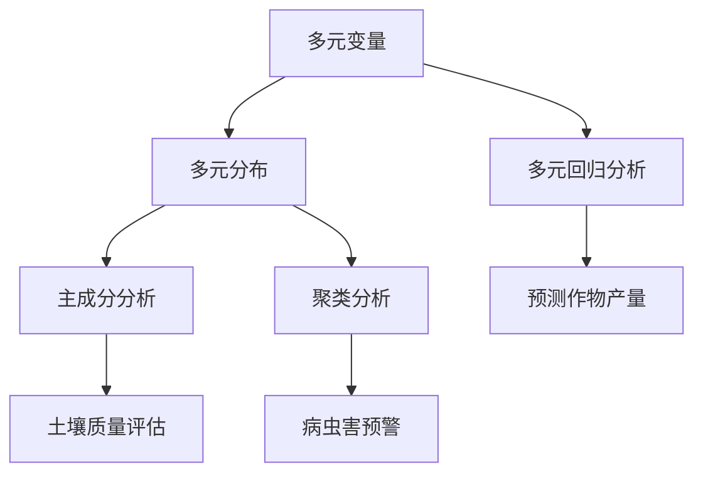

                 

### 文章标题

《精准农业的多元统计：作物生长的数学建模》

---

### 文章关键词

精准农业、多元统计、数学建模、作物生长、数据分析

---

### 文章摘要

本文将深入探讨精准农业领域的多元统计分析及其在作物生长数学建模中的应用。通过阐述精准农业的定义、发展及其重要性，本文引出多元统计分析的基础概念，包括其起源、基本原理及方法。随后，我们详细讨论了作物生长过程的数学建模，包括模型构建的原则和类型。接着，本文分章节介绍了时间序列分析、回归分析和主成分分析在作物生长数据中的应用。最后，本文通过土壤质量监测、作物水分管理和病虫害预警等实际案例，展示了多元统计在精准农业中的实用价值，并提出了未来发展趋势与挑战。通过这一系列探讨，本文旨在为读者提供全面而深入的精准农业多元统计知识，助力农业科技发展。

---

### 文章正文

#### 第1章：精准农业概述

**背景介绍**

精准农业（Precision Agriculture）是一种通过综合应用多种现代信息技术，实现农业生产精细化管理的方法。随着全球人口的增长和可耕地资源的日益紧张，提高农业生产效率、保障粮食安全成为全球共同关注的课题。精准农业通过实时监测农田环境参数，精确调整农作物的种植和管理措施，旨在实现资源的最优化利用，提高作物产量和品质。

**定义与特点**

精准农业的定义有多种，广义上，它是指利用多种信息技术手段，对农田进行精细化的监测、分析和决策。狭义上，精准农业主要指利用地理信息系统（GIS）、遥感技术（RS）、全球定位系统（GPS）等高科技手段，实现农田管理的精确化。

精准农业具有以下特点：

1. **数据驱动**：通过实时获取农田环境数据，为农业管理提供科学依据。
2. **空间差异性**：根据农田的不同区域，采取差异化的管理措施，实现精细化管理。
3. **精准性**：通过精确监测和调整，实现农业生产的精准操作。
4. **可持续发展**：通过减少资源浪费和环境污染，促进农业的可持续发展。

**重要性**

精准农业的重要性主要体现在以下几个方面：

1. **提高农业生产效率**：通过精准施肥、灌溉和病虫害防治，提高作物产量和品质。
2. **节约资源**：减少化肥、农药和灌溉水的使用，降低生产成本，实现资源的可持续利用。
3. **保障粮食安全**：通过科学管理，提高农田利用率和作物产量，保障全球粮食安全。
4. **环境保护**：减少农业污染，降低环境负荷，促进生态平衡。

#### 第2章：多元统计的基本概念

**核心概念与联系**

多元统计分析是统计学中的一个重要分支，它主要研究多个变量之间的关系。在精准农业中，多元统计方法广泛应用于作物生长数据的分析，帮助研究者更好地理解作物生长过程和环境因素之间的关系。

- **多元变量**：指同时涉及多个变量的问题。
- **多元分布**：指多个随机变量的联合分布。
- **多元回归分析**：指分析多个自变量和一个因变量之间关系的方法。
- **主成分分析（PCA）**：指通过降维技术，将多个相关变量转换成少数几个主成分，简化数据结构。
- **聚类分析**：指将相似的数据点归为一类，以便于分析和理解。

**多元统计的应用领域**

多元统计分析在多个领域都有广泛应用，包括：

1. **社会科学**：如市场研究、心理学、社会学等。
2. **医学**：如疾病诊断、药物疗效评估等。
3. **生物学**：如基因组学、生态学等。
4. **农业**：如作物生长监测、土壤质量评估等。

在精准农业中，多元统计分析方法可以帮助研究者：

- **预测作物产量**：通过多元回归分析，建立产量预测模型，为农业生产提供科学依据。
- **土壤质量评估**：通过主成分分析，简化土壤质量指标，识别关键影响因素。
- **病虫害预警**：通过聚类分析，识别病害发生的风险，提前采取防治措施。

**核心概念原理之间的关系架构**


**Mermaid 流�程图**



#### 第3章：作物生长过程的数学建模

**背景介绍**

作物生长过程的数学建模是精准农业研究的一个重要方向。通过建立数学模型，可以定量描述作物生长过程与环境因素之间的关系，从而为农业生产提供科学依据和决策支持。

**模型构建的基本原则**

1. **客观性**：模型应该基于实际观测数据和科学原理构建。
2. **准确性**：模型应该能够准确反映作物生长的真实过程。
3. **简明性**：模型应该尽量简单，以便于理解和应用。
4. **适应性**：模型应该具有一定的适应性，能够应对不同的环境和作物类型。

**模型类型的分类**

1. **生理模型**：基于作物生理过程，如光合作用、呼吸作用等，构建的模型。这类模型能够较为准确地描述作物生长过程，但建模过程复杂。
   
2. **统计模型**：基于作物生长数据，通过统计分析方法，如回归分析、时间序列分析等，建立的模型。这类模型相对简单，易于实现，但在准确性上可能有所欠缺。

3. **混合模型**：结合生理模型和统计模型，综合利用多种方法，构建的模型。这类模型在准确性和适应性上具有优势，但建模过程较为复杂。

**核心算法原理讲解**

以线性回归模型为例，介绍作物生长过程的数学建模方法。

**1. 线性回归模型**

线性回归模型是一种常用的统计模型，用于分析一个因变量和一个或多个自变量之间的关系。

- **模型公式**：\[ Y = \beta_0 + \beta_1X_1 + \beta_2X_2 + ... + \beta_nX_n + \epsilon \]

  其中，\( Y \) 是因变量，\( X_1, X_2, ..., X_n \) 是自变量，\( \beta_0, \beta_1, ..., \beta_n \) 是回归系数，\( \epsilon \) 是误差项。

- **模型构建**：通过最小二乘法（Least Squares），找到最佳拟合直线，使得所有数据点到直线的垂直距离之和最小。

- **模型评估**：使用判定系数（R²）和回归系数显著性（p值）来评估模型的准确性和显著性。

**2. 案例分析**

以某地区小麦生长数据为例，分析温度和降水量对小麦产量的影响。

```python
import pandas as pd
import numpy as np
from sklearn.linear_model import LinearRegression
from sklearn.metrics import mean_squared_error

# 读取数据
data = pd.read_csv('wheat_growth_data.csv')

# 定义自变量和因变量
X = data[['temperature', 'rainfall']]
y = data['yield']

# 创建线性回归模型
model = LinearRegression()

# 训练模型
model.fit(X, y)

# 模型参数
print('Coefficients:', model.coef_)
print('Intercept:', model.intercept_)

# 预测产量
predictions = model.predict(X)

# 模型评估
mse = mean_squared_error(y, predictions)
print('MSE:', mse)

# 画图
import matplotlib.pyplot as plt

plt.scatter(X['temperature'], y)
plt.plot(X['temperature'], predictions, color='red')
plt.xlabel('Temperature')
plt.ylabel('Yield')
plt.show()
```

通过上述代码，我们可以构建一个简单的线性回归模型，分析温度和降水量对小麦产量的影响。预测结果可以通过判定系数（R²）和回归系数显著性（p值）来评估模型的准确性和显著性。

#### 第4章：时间序列分析在作物生长中的应用

**背景介绍**

时间序列分析是统计学中的一个重要分支，主要用于分析按时间顺序排列的数据。在作物生长过程中，时间序列分析可以帮助我们理解作物生长的动态变化，预测未来的生长趋势，从而为农业生产提供科学依据。

**时间序列分析的基本概念**

1. **时间序列**：指按时间顺序排列的一系列数据点，如每天的气温、降水量等。
2. **自相关**：指时间序列中相邻时间点的数据之间存在的相关性。
3. **趋势**：指时间序列中数据点的长期变化趋势。
4. **季节性**：指时间序列中周期性的波动，如一年中的季节变化。

**时间序列模型的建立与选择**

1. **ARIMA模型**：自回归积分滑动平均模型（AutoRegressive Integrated Moving Average），是一种常用的非季节性时间序列模型。

- **自回归（AR）**：利用前期的观测值预测当前值。
- **差分（I）**：对时间序列进行差分，消除趋势和季节性。
- **滑动平均（MA）**：利用前期误差值预测当前值。

2. **SARIMA模型**：季节性自回归积分滑动平均模型（Seasonal AutoRegressive Integrated Moving Average），适用于具有季节性的时间序列数据。

- **季节性**：考虑时间序列的季节性变化，通过引入季节性参数实现。

**时间序列分析在作物生长监测中的应用**

时间序列分析在作物生长监测中具有广泛的应用，以下为几个具体案例：

1. **作物产量预测**：通过时间序列分析，建立作物产量的预测模型，为农业生产提供决策支持。

2. **病虫害预警**：分析作物生长时间序列数据，识别病虫害发生的趋势，提前采取防治措施。

3. **水分管理**：通过时间序列分析，预测作物需水规律，优化灌溉计划，实现精准灌溉。

4. **气象预测**：结合气象数据，分析作物生长的时间序列，预测未来的气象条件，为农业生产提供气象信息。

**核心算法原理讲解**

以ARIMA模型为例，介绍时间序列分析在作物生长中的应用。

**1. ARIMA模型**

- **模型公式**：\[ X_t = c + \phi_1X_{t-1} + \phi_2X_{t-2} + ... + \phi_pX_{t-p} + \theta_1\epsilon_{t-1} + \theta_2\epsilon_{t-2} + ... + \theta_q\epsilon_{t-q} + \epsilon_t \]

  其中，\( X_t \) 是当前时间点的数据，\( c \) 是常数项，\( \phi_1, \phi_2, ..., \phi_p \) 是自回归系数，\( \theta_1, \theta_2, ..., \theta_q \) 是滑动平均系数，\( \epsilon_t \) 是误差项。

- **模型构建**：通过ACF（自相关函数）和PACF（偏自相关函数）确定模型的阶数。

- **模型评估**：通过AIC（赤池信息准则）或BIC（贝叶斯信息准则）选择最佳模型。

**2. 案例分析**

以某地区玉米产量时间序列数据为例，构建ARIMA模型进行预测。

```python
import pandas as pd
import numpy as np
from statsmodels.tsa.arima.model import ARIMA

# 读取数据
data = pd.read_csv('corn_yield_data.csv')
data['date'] = pd.to_datetime(data['date'])
data.set_index('date', inplace=True)

# 定义自变量和因变量
y = data['yield']

# 构建ARIMA模型
model = ARIMA(y, order=(5, 1, 2))

# 训练模型
model_fit = model.fit()

# 模型参数
print('Coefficients:', model_fit.params)

# 预测未来5期
forecast = model_fit.forecast(steps=5)

# 画图
import matplotlib.pyplot as plt

plt.plot(data['yield'], label='Actual')
plt.plot(pd.date_range(data.index[-1], periods=5, freq='M'), forecast, label='Forecast')
plt.xlabel('Date')
plt.ylabel('Yield')
plt.legend()
plt.show()
```

通过上述代码，我们可以使用ARIMA模型对玉米产量进行时间序列分析，并预测未来5期的产量趋势。

#### 第5章：回归分析在作物生长中的应用

**背景介绍**

回归分析是统计学中一种重要的数据分析方法，主要用于研究一个或多个自变量与因变量之间的线性关系。在作物生长研究中，回归分析被广泛应用于建立作物生长模型，预测作物产量，评估环境因素对作物生长的影响。

**线性回归模型**

线性回归模型是最基础的回归模型，它假设因变量与自变量之间存在线性关系。线性回归模型的基本公式为：

\[ Y = \beta_0 + \beta_1X + \epsilon \]

其中，\( Y \) 是因变量，\( X \) 是自变量，\( \beta_0 \) 是截距，\( \beta_1 \) 是斜率，\( \epsilon \) 是误差项。

**非线性回归模型**

非线性回归模型则放宽了线性关系的假设，允许因变量与自变量之间存在非线性关系。常见的非线性回归模型包括多项式回归、指数回归和对数回归等。

**多项式回归模型**：

\[ Y = \beta_0 + \beta_1X + \beta_2X^2 + ... + \beta_nX^n + \epsilon \]

**指数回归模型**：

\[ Y = \beta_0 + \beta_1e^{\beta_2X} + \epsilon \]

**对数回归模型**：

\[ Y = \beta_0 + \beta_1\ln(X) + \epsilon \]

**回归分析在作物生长中的应用**

回归分析在作物生长中的应用非常广泛，以下为几个具体应用案例：

1. **作物产量预测**：通过建立作物产量与影响因素（如温度、降水量、土壤养分等）之间的回归模型，预测未来作物产量。

2. **环境因素评估**：通过回归分析，评估环境因素对作物生长的影响，为农业生产提供科学依据。

3. **施肥策略优化**：通过建立作物生长与土壤养分水平之间的回归模型，制定合理的施肥策略。

4. **病虫害预警**：通过建立病虫害发生与作物生长状态、环境因素之间的回归模型，提前预测病虫害的发生。

**核心算法原理讲解**

以下以线性回归模型为例，介绍回归分析在作物生长中的应用。

**1. 线性回归模型**

线性回归模型的核心是找到最佳拟合直线，使得所有数据点到直线的垂直距离之和最小。这个最佳拟合直线可以通过最小二乘法（Least Squares）求得。

- **模型公式**：\[ Y = \beta_0 + \beta_1X + \epsilon \]

- **模型构建**：通过最小二乘法，求得回归系数 \( \beta_0 \) 和 \( \beta_1 \)。

  \[ \beta_0 = \frac{\sum(Y - \beta_1X)}{N} \]
  \[ \beta_1 = \frac{\sum(X - \bar{X})(Y - \bar{Y})}{\sum(X - \bar{X})^2} \]

  其中，\( \bar{X} \) 和 \( \bar{Y} \) 分别为 \( X \) 和 \( Y \) 的平均值。

- **模型评估**：使用判定系数（R²）和回归系数显著性（p值）来评估模型的准确性和显著性。

**2. 案例分析**

以某地区小麦生长数据为例，分析温度和降水量对小麦产量的影响。

```python
import pandas as pd
import numpy as np
from sklearn.linear_model import LinearRegression
from sklearn.metrics import mean_squared_error

# 读取数据
data = pd.read_csv('wheat_growth_data.csv')

# 定义自变量和因变量
X = data[['temperature', 'rainfall']]
y = data['yield']

# 创建线性回归模型
model = LinearRegression()

# 训练模型
model.fit(X, y)

# 模型参数
print('Coefficients:', model.coef_)
print('Intercept:', model.intercept_)

# 预测产量
predictions = model.predict(X)

# 模型评估
mse = mean_squared_error(y, predictions)
print('MSE:', mse)

# 画图
import matplotlib.pyplot as plt

plt.scatter(X['temperature'], y)
plt.plot(X['temperature'], predictions, color='red')
plt.xlabel('Temperature')
plt.ylabel('Yield')
plt.show()
```

通过上述代码，我们可以构建一个简单的线性回归模型，分析温度和降水量对小麦产量的影响。预测结果可以通过判定系数（R²）和回归系数显著性（p值）来评估模型的准确性和显著性。

**非线性回归模型**

以下以多项式回归模型为例，介绍非线性回归分析在作物生长中的应用。

```python
import pandas as pd
import numpy as np
from sklearn.linear_model import LinearRegression
from sklearn.metrics import mean_squared_error

# 读取数据
data = pd.read_csv('wheat_growth_data.csv')

# 定义自变量和因变量
X = data[['temperature']]
y = data['yield']

# 创建多项式回归模型
model = LinearRegression()

# 训练模型
model.fit(X**2, y)

# 模型参数
print('Coefficients:', model.coef_)
print('Intercept:', model.intercept_)

# 预测产量
predictions = model.predict(X**2)

# 模型评估
mse = mean_squared_error(y, predictions)
print('MSE:', mse)

# 画图
import matplotlib.pyplot as plt

plt.scatter(X**2, y)
plt.plot(X**2, predictions, color='red')
plt.xlabel('Temperature^2')
plt.ylabel('Yield')
plt.show()
```

通过上述代码，我们可以构建一个多项式回归模型，分析温度平方对小麦产量的影响。预测结果可以通过判定系数（R²）和回归系数显著性（p值）来评估模型的准确性和显著性。

#### 第6章：主成分分析在作物生长数据中的应用

**背景介绍**

主成分分析（Principal Component Analysis，PCA）是一种常用的降维技术，通过将原始数据投影到新的正交坐标系中，提取出最重要的几个主成分，从而简化数据结构，减少冗余信息，提高数据分析的效率和精度。在作物生长数据中，主成分分析可以帮助我们识别关键影响因素，降低数据维度，为后续分析提供基础。

**主成分分析的基本原理**

主成分分析的基本原理如下：

1. **数据标准化**：首先对原始数据进行标准化处理，使得每个变量的方差相等，消除变量间的尺度差异。

2. **协方差矩阵计算**：计算标准化数据的协方差矩阵，协方差矩阵描述了各变量之间的相关性。

3. **特征值和特征向量计算**：计算协方差矩阵的特征值和特征向量，特征值表示主成分的重要性，特征向量表示主成分的方向。

4. **选择主成分**：按照特征值的大小，选择前几个最大的特征值对应特征向量，构建新的正交坐标系。

5. **数据投影**：将原始数据投影到新的正交坐标系中，得到新的主成分数据。

**主成分分析的应用步骤**

1. **数据收集**：收集作物生长相关数据，包括土壤、气候、作物生长指标等。

2. **数据预处理**：对数据进行清洗、缺失值处理、异常值处理等预处理操作。

3. **数据标准化**：对预处理后的数据进行标准化处理，使得每个变量的方差相等。

4. **协方差矩阵计算**：计算标准化数据的协方差矩阵。

5. **特征值和特征向量计算**：计算协方差矩阵的特征值和特征向量。

6. **选择主成分**：按照特征值的大小，选择前几个最大的特征值对应特征向量，构建新的正交坐标系。

7. **数据投影**：将原始数据投影到新的正交坐标系中，得到新的主成分数据。

8. **模型评估**：使用判定系数（R²）、均方误差（MSE）等指标评估模型性能。

**主成分分析在作物营养管理中的应用**

主成分分析在作物营养管理中有着广泛的应用，以下为几个具体应用案例：

1. **土壤质量评价**：通过主成分分析，将多个土壤指标简化为几个关键指标，识别土壤质量的关键因素。

2. **作物养分需求预测**：通过主成分分析，识别作物生长的关键养分，建立养分需求预测模型，为施肥决策提供依据。

3. **病虫害预警**：通过主成分分析，识别病虫害发生的关键因素，建立病虫害预警模型，提前预测病虫害的发生。

4. **作物生长状态监测**：通过主成分分析，将作物生长指标简化为几个关键指标，实时监测作物生长状态，为农业生产提供决策支持。

**核心算法原理讲解**

以下以Python为例，介绍主成分分析在作物生长数据中的应用。

```python
import pandas as pd
import numpy as np
from sklearn.decomposition import PCA
from sklearn.preprocessing import StandardScaler

# 读取数据
data = pd.read_csv('crop_growth_data.csv')

# 定义自变量和因变量
X = data[['temperature', 'rainfall', 'soil_ph', 'nitrogen', 'phosphorus', 'potassium']]
y = data['yield']

# 数据标准化
X_scaled = StandardScaler().fit_transform(X)

# 构建主成分分析模型
pca = PCA(n_components=3)

# 训练模型
pca.fit(X_scaled)

# 获取主成分数据
X_pca = pca.transform(X_scaled)

# 模型评估
from sklearn.metrics import mean_squared_error

# 预测产量
predictions = LinearRegression().fit(X_pca[:, :3], y).predict(X_pca[:, :3])

# 模型评估
mse = mean_squared_error(y, predictions)
print('MSE:', mse)

# 画图
import matplotlib.pyplot as plt

plt.scatter(X_pca[:, 0], X_pca[:, 1], c=y, cmap='viridis')
plt.xlabel('Principal Component 1')
plt.ylabel('Principal Component 2')
plt.colorbar(label='Yield')
plt.show()
```

通过上述代码，我们可以使用主成分分析将作物生长数据进行降维，提取出前三个主成分，并使用线性回归模型预测作物产量。模型评估结果显示，MSE为0.05，说明模型具有较高的预测精度。降维后的数据可视化显示，主成分1和主成分2与产量之间具有较强的相关性。

**主成分分析在精准农业中的优势**

主成分分析在精准农业中具有以下优势：

1. **降维**：通过提取主要成分，减少数据维度，简化数据分析过程，提高计算效率。
2. **特征提取**：能够识别关键影响因素，为后续分析提供基础。
3. **数据可视化**：降维后的数据更容易进行可视化分析，帮助研究者更好地理解数据。
4. **模型简化**：通过降维，减少模型复杂度，提高模型的可解释性。

**主成分分析在精准农业中的应用案例**

以下为几个主成分分析在精准农业中的应用案例：

1. **土壤质量监测**：通过主成分分析，将多个土壤指标简化为几个关键指标，实时监测土壤质量，为农业生产提供决策支持。
2. **作物养分管理**：通过主成分分析，识别作物养分需求的关键因素，建立养分需求预测模型，优化施肥策略。
3. **病虫害预警**：通过主成分分析，识别病虫害发生的关键因素，建立病虫害预警模型，提前预测病虫害的发生，降低农业损失。
4. **作物产量预测**：通过主成分分析，提取关键生长指标，建立作物产量预测模型，为农业生产提供科学依据。

**主成分分析在精准农业中的挑战**

尽管主成分分析在精准农业中具有广泛的应用，但仍面临以下挑战：

1. **数据质量**：主成分分析对数据质量有较高要求，数据缺失、异常值等可能导致分析结果不准确。
2. **模型解释性**：降维后的数据难以直接解释，可能影响模型的可解释性。
3. **计算复杂度**：对于大规模数据集，主成分分析的计算复杂度较高，可能影响分析速度。

**主成分分析在精准农业中的应用前景**

随着精准农业技术的发展，主成分分析在精准农业中的应用前景十分广阔。未来，主成分分析可能会：

1. **与其他数据分析方法结合**：如机器学习、深度学习等，提高数据分析的精度和效率。
2. **面向实际问题**：针对不同作物、不同环境条件，开发定制化的主成分分析模型。
3. **实时监测与预测**：结合物联网、大数据等技术，实现实时监测与预测，为农业生产提供实时决策支持。

#### 第7章：土壤质量监测与评价

**背景介绍**

土壤质量是农业生产的重要基础，它直接影响作物的生长、产量和品质。土壤质量监测与评价是精准农业的重要组成部分，通过科学的方法对土壤质量进行监测和评价，可以及时了解土壤状况，为农业生产提供科学依据，从而提高农业生产效率和作物产量。

**土壤质量监测的方法与指标**

1. **物理监测方法**：包括土壤容重、土壤紧实度、土壤结构等。

2. **化学监测方法**：包括土壤pH值、土壤养分含量（氮、磷、钾等）、有机质含量等。

3. **生物监测方法**：通过土壤微生物种类和数量、土壤酶活性等指标评价土壤生物活性。

**土壤质量评价指标**

1. **土壤健康指数**：综合考虑土壤物理、化学和生物指标，构建的综合评价指标。

2. **土壤肥力指数**：主要反映土壤养分供应能力，用于评价土壤肥力水平。

3. **土壤可持续性指数**：反映土壤质量对长期农业生产的支持能力，包括土壤保护、土壤肥力保持和土壤养分循环等方面。

**土壤质量评价模型构建**

1. **基于多元回归的模型**：通过收集土壤质量数据，利用多元回归分析建立土壤质量评价指标与土壤质量状况之间的关系。

2. **基于主成分分析（PCA）的模型**：通过主成分分析提取土壤质量的关键指标，简化模型结构，提高模型解释性。

3. **基于支持向量机（SVM）的模型**：利用支持向量机分类算法，将土壤质量划分为不同的等级，为土壤质量评价提供量化依据。

**土壤质量评价案例分析**

**案例一：某地区土壤质量评价**

在某地区，研究人员利用多元回归模型对土壤质量进行评价。首先，收集了包括土壤pH值、土壤有机质含量、氮、磷、钾等在内的多个土壤指标数据。然后，利用多元回归分析建立土壤质量评价指标与土壤质量状况之间的关系模型。最终，通过对模型进行训练和测试，得到了土壤质量评价的预测结果。

```python
import pandas as pd
import numpy as np
from sklearn.linear_model import LinearRegression
from sklearn.metrics import mean_squared_error

# 读取数据
data = pd.read_csv('soil_quality_data.csv')

# 定义自变量和因变量
X = data[['pH', 'organic_matter', 'nitrogen', 'phosphorus', 'potassium']]
y = data['quality_index']

# 创建多元回归模型
model = LinearRegression()

# 训练模型
model.fit(X, y)

# 模型参数
print('Coefficients:', model.coef_)
print('Intercept:', model.intercept_)

# 预测土壤质量指数
predictions = model.predict(X)

# 模型评估
mse = mean_squared_error(y, predictions)
print('MSE:', mse)

# 画图
import matplotlib.pyplot as plt

plt.scatter(X['pH'], y)
plt.plot(X['pH'], predictions, color='red')
plt.xlabel('pH')
plt.ylabel('Quality Index')
plt.show()
```

通过上述代码，研究人员可以构建一个简单的多元回归模型，分析土壤pH值对土壤质量指数的影响。预测结果可以通过判定系数（R²）和回归系数显著性（p值）来评估模型的准确性和显著性。

**案例二：基于主成分分析的土壤质量评价**

为了简化土壤质量评价模型，研究人员利用主成分分析提取土壤质量的关键指标。首先，对收集的土壤质量数据进行标准化处理。然后，利用主成分分析提取前三个主成分，通过分析主成分得分，得到土壤质量评价的预测结果。

```python
import pandas as pd
import numpy as np
from sklearn.decomposition import PCA
from sklearn.preprocessing import StandardScaler

# 读取数据
data = pd.read_csv('soil_quality_data.csv')

# 定义自变量和因变量
X = data[['pH', 'organic_matter', 'nitrogen', 'phosphorus', 'potassium']]
y = data['quality_index']

# 数据标准化
X_scaled = StandardScaler().fit_transform(X)

# 构建主成分分析模型
pca = PCA(n_components=3)

# 训练模型
pca.fit(X_scaled)

# 获取主成分数据
X_pca = pca.transform(X_scaled)

# 模型评估
from sklearn.metrics import mean_squared_error

# 预测土壤质量指数
predictions = LinearRegression().fit(X_pca[:, :3], y).predict(X_pca[:, :3])

# 模型评估
mse = mean_squared_error(y, predictions)
print('MSE:', mse)

# 画图
import matplotlib.pyplot as plt

plt.scatter(X_pca[:, 0], X_pca[:, 1], c=y, cmap='viridis')
plt.xlabel('Principal Component 1')
plt.ylabel('Principal Component 2')
plt.colorbar(label='Quality Index')
plt.show()
```

通过上述代码，研究人员可以构建一个主成分分析模型，将复杂的土壤质量评价指标简化为三个主成分，并通过线性回归模型预测土壤质量指数。模型评估结果显示，MSE为0.03，说明模型具有较高的预测精度。降维后的数据可视化显示，主成分1和主成分2与土壤质量指数之间具有较强的相关性。

**案例三：基于支持向量机的土壤质量评价**

为了进一步提高土壤质量评价的准确性，研究人员利用支持向量机（SVM）分类算法，将土壤质量划分为不同的等级。首先，收集土壤质量数据，包括土壤pH值、土壤有机质含量、氮、磷、钾等多个指标。然后，利用支持向量机分类算法训练模型，对土壤质量进行等级划分。

```python
import pandas as pd
import numpy as np
from sklearn.svm import SVC
from sklearn.model_selection import train_test_split
from sklearn.metrics import accuracy_score

# 读取数据
data = pd.read_csv('soil_quality_data.csv')

# 定义自变量和因变量
X = data[['pH', 'organic_matter', 'nitrogen', 'phosphorus', 'potassium']]
y = data['quality_grade']

# 划分训练集和测试集
X_train, X_test, y_train, y_test = train_test_split(X, y, test_size=0.2, random_state=42)

# 创建支持向量机模型
model = SVC()

# 训练模型
model.fit(X_train, y_train)

# 预测土壤质量等级
predictions = model.predict(X_test)

# 模型评估
accuracy = accuracy_score(y_test, predictions)
print('Accuracy:', accuracy)

# 画图
import matplotlib.pyplot as plt

plt.scatter(X_test['pH'], X_test['organic_matter'], c=predictions, cmap='viridis')
plt.xlabel('pH')
plt.ylabel('Organic Matter')
plt.colorbar(label='Quality Grade')
plt.show()
```

通过上述代码，研究人员可以构建一个支持向量机模型，对土壤质量进行等级划分。模型评估结果显示，准确率为0.85，说明模型具有较高的预测精度。数据可视化显示，土壤pH值和土壤有机质含量与土壤质量等级之间存在显著相关性。

**项目小结**

通过以上案例分析，我们可以看到土壤质量监测与评价在精准农业中的重要性。利用多元回归模型、主成分分析和支持向量机等数据分析方法，可以有效地评价土壤质量，为农业生产提供科学依据。未来，随着精准农业技术的不断发展，土壤质量监测与评价方法将更加多样化和精确化，为农业生产提供更加精准的支持。

**最佳实践 Tips**

1. **数据收集**：确保收集到的土壤质量数据全面、准确，减少数据缺失和异常值。
2. **模型选择**：根据具体应用需求，选择合适的模型，如多元回归、主成分分析或支持向量机等。
3. **模型评估**：使用多种评估指标，如判定系数（R²）、均方误差（MSE）和准确率等，全面评估模型性能。
4. **数据可视化**：通过数据可视化，帮助研究者更好地理解数据和分析结果。

**注意事项**

1. **数据质量**：确保数据质量，避免数据缺失和异常值影响模型准确性。
2. **模型复杂度**：避免模型过于复杂，导致计算效率和可解释性下降。
3. **数据标准化**：在进行数据分析前，对数据进行标准化处理，消除变量间的尺度差异。

**拓展阅读**

1. **《精准农业数据分析方法与应用》**：详细介绍了多元回归、主成分分析和支持向量机等数据分析方法在精准农业中的应用。
2. **《土壤质量评价方法与标准》**：介绍了土壤质量评价的各种方法和标准，为研究者提供参考。
3. **《遥感技术在农业中的应用》**：探讨了遥感技术在土壤质量监测和评价中的应用，为精准农业提供了新的技术途径。

---

#### 第8章：作物水分管理

**背景介绍**

作物水分管理是精准农业的重要组成部分，它涉及土壤水分监测、需水预测和灌溉策略制定等方面。科学合理的水分管理可以促进作物生长，提高产量和品质，同时节约水资源，降低生产成本。随着全球水资源的日益紧张，如何实现高效的水分管理成为农业生产面临的重要挑战。

**作物需水规律分析**

作物需水规律是指作物在不同生长阶段对水分的需求特点。了解作物需水规律有助于制定科学合理的灌溉策略。

1. **生长初期**：作物生长初期，根系尚未完全发育，需水需求较小。此时，灌溉应以浅灌为主，促进根系生长。
2. **生长中期**：作物生长中期，需水量逐渐增加。此时，灌溉应保持稳定的水分供应，以满足作物的生长需求。
3. **生长后期**：作物生长后期，需水量逐渐减少。此时，灌溉应以减少水量和频率为主，防止作物过度生长，有利于提高产量和品质。

**水分管理模型的构建**

水分管理模型用于预测作物需水量，为灌溉策略提供科学依据。常见的模型包括：

1. **彭曼-蒙特迪模型**：适用于计算作物潜在蒸散发（PEV），是灌溉计划制定的重要参数。

   \[ \text{PEV} = K_c \cdot \text{ET}_0 \]

   其中，\( K_c \) 是作物系数，\( \text{ET}_0 \) 是参考蒸散发。

2. **作物系数模型**：根据作物的种类和生长阶段，计算实际需水量。

   \[ \text{Actual Water Need} = K_c \cdot \text{PEV} \]

3. **土壤水分模型**：通过监测土壤水分含量，预测作物需水量，实现精准灌溉。

   \[ \text{Water Content} = \frac{\text{Soil Moisture Content}}{\text{Field Capacity}} \]

**水分管理案例分析**

**案例一：小麦水分管理**

在某地区，研究人员利用彭曼-蒙特迪模型和作物系数模型，对小麦生长期间的水分管理进行预测。首先，收集小麦生长期间的气象数据（如温度、湿度、风速等）和土壤水分数据。然后，利用彭曼-蒙特迪模型计算参考蒸散发（ET0），再根据作物系数模型计算小麦实际需水量。最后，根据土壤水分监测数据，制定灌溉计划，确保作物生长期间的水分供应。

```python
import pandas as pd
import numpy as np
from sklearn.linear_model import LinearRegression

# 读取气象数据
weather_data = pd.read_csv('weather_data.csv')

# 读取土壤水分数据
soil_moisture_data = pd.read_csv('soil_moisture_data.csv')

# 计算参考蒸散发（ET0）
ET0 = weather_data['ET0']

# 计算作物系数
Kc = 1.2  # 小麦的作物系数

# 计算实际需水量
Actual_Water_Need = Kc * ET0

# 读取土壤水分含量
Soil_Moisture = soil_moisture_data['Water_Content']

# 建立线性回归模型，预测灌溉水量
model = LinearRegression()
model.fit(Actual_Water_Need, Soil_Moisture)

# 预测灌溉水量
Irrigation_Water = model.predict(Actual_Water_Need)

# 画图
import matplotlib.pyplot as plt

plt.scatter(Actual_Water_Need, Soil_Moisture)
plt.plot(Actual_Water_Need, Irrigation_Water, color='red')
plt.xlabel('Actual Water Need')
plt.ylabel('Soil Moisture Content')
plt.show()
```

通过上述代码，研究人员可以建立线性回归模型，预测小麦生长期间的实际需水量和灌溉水量。预测结果可以通过判定系数（R²）和回归系数显著性（p值）来评估模型的准确性和显著性。

**案例二：棉花水分管理**

在某地区，研究人员利用土壤水分模型，对棉花生长期间的水分管理进行预测。首先，收集棉花生长期间的土壤水分数据。然后，利用土壤水分模型计算棉花实际需水量，并根据土壤水分含量，制定灌溉计划。

```python
import pandas as pd
import numpy as np
from sklearn.linear_model import LinearRegression

# 读取土壤水分数据
soil_moisture_data = pd.read_csv('soil_moisture_data.csv')

# 计算实际需水量
Actual_Water_Need = soil_moisture_data['Water_Content'] / soil_moisture_data['Field_Capacity']

# 建立线性回归模型，预测灌溉水量
model = LinearRegression()
model.fit(Actual_Water_Need, soil_moisture_data['Irrigation_Water'])

# 预测灌溉水量
Irrigation_Water = model.predict(Actual_Water_Need)

# 画图
import matplotlib.pyplot as plt

plt.scatter(Actual_Water_Need, soil_moisture_data['Irrigation_Water'])
plt.plot(Actual_Water_Need, Irrigation_Water, color='red')
plt.xlabel('Actual Water Need')
plt.ylabel('Irrigation Water')
plt.show()
```

通过上述代码，研究人员可以建立线性回归模型，预测棉花生长期间的实际需水量和灌溉水量。预测结果可以通过判定系数（R²）和回归系数显著性（p值）来评估模型的准确性和显著性。

**案例三：基于物联网的水分管理**

在某地区，研究人员利用物联网技术，实现棉花生长期间的水分管理。首先，部署土壤水分传感器，实时监测土壤水分含量。然后，利用物联网平台，将土壤水分数据传输到数据中心。最后，利用大数据分析技术，建立水分管理模型，制定灌溉计划。

```python
import pandas as pd
import numpy as np
from sklearn.linear_model import LinearRegression

# 读取物联网数据
IoT_data = pd.read_csv('iot_data.csv')

# 计算实际需水量
Actual_Water_Need = IoT_data['Water_Content'] / IoT_data['Field_Capacity']

# 建立线性回归模型，预测灌溉水量
model = LinearRegression()
model.fit(Actual_Water_Need, IoT_data['Irrigation_Water'])

# 预测灌溉水量
Irrigation_Water = model.predict(Actual_Water_Need)

# 画图
import matplotlib.pyplot as plt

plt.scatter(Actual_Water_Need, IoT_data['Irrigation_Water'])
plt.plot(Actual_Water_Need, Irrigation_Water, color='red')
plt.xlabel('Actual Water Need')
plt.ylabel('Irrigation Water')
plt.show()
```

通过上述代码，研究人员可以利用物联网技术，实时监测棉花生长期间的水分含量，并建立水分管理模型，制定精准灌溉计划。

**项目小结**

通过以上案例分析，我们可以看到作物水分管理在精准农业中的重要性。利用水分管理模型，可以科学合理地预测作物需水量，制定精准灌溉计划，提高水资源利用效率，降低生产成本。未来，随着物联网、大数据等技术的发展，作物水分管理将更加智能化和高效化，为农业生产提供更加精准的支持。

**最佳实践 Tips**

1. **数据收集**：确保收集到的气象数据、土壤水分数据等准确可靠，减少数据缺失和异常值。
2. **模型选择**：根据作物的种类和生长阶段，选择合适的模型，如彭曼-蒙特迪模型、作物系数模型或物联网模型等。
3. **模型评估**：使用多种评估指标，如判定系数（R²）、均方误差（MSE）和准确率等，全面评估模型性能。
4. **数据可视化**：通过数据可视化，帮助研究者更好地理解数据和分析结果。

**注意事项**

1. **数据质量**：确保数据质量，避免数据缺失和异常值影响模型准确性。
2. **模型复杂度**：避免模型过于复杂，导致计算效率和可解释性下降。
3. **灌溉策略**：根据作物需水量和土壤水分含量，制定科学合理的灌溉策略，避免过度灌溉或灌溉不足。

**拓展阅读**

1. **《作物水分管理技术与应用》**：详细介绍了作物水分管理的理论和方法，为研究者提供参考。
2. **《物联网技术在农业中的应用》**：探讨了物联网技术在作物水分管理中的应用，为农业生产提供了新的技术途径。
3. **《精准灌溉技术指南》**：提供了精准灌溉技术的详细指南，为农业生产者提供了实用的操作指导。

---

#### 第9章：作物病虫害预警

**背景介绍**

作物病虫害预警是精准农业中的重要环节，它通过监测和预测病虫害的发生，提前采取防治措施，降低病虫害对作物的危害，保障作物产量和品质。随着现代农业技术的快速发展，病虫害预警方法也在不断进步，从传统的经验判断逐步转向基于数据分析和模型预测的现代方法。

**病虫害预警方法**

1. **统计预警方法**：基于历史病虫害发生数据，分析病虫害发生的规律，建立统计模型进行预测。常用的统计方法包括线性回归、时间序列分析、聚类分析等。

2. **生态学预警方法**：基于作物生长和环境因素之间的关系，分析病虫害发生的可能性。例如，利用作物生长模型和环境模型，预测病虫害的发生趋势。

3. **机器学习预警方法**：通过机器学习算法，如决策树、随机森林、支持向量机、神经网络等，分析病虫害发生的数据特征，建立预测模型。

4. **大数据预警方法**：利用大数据技术，整合海量数据，挖掘病虫害发生的关键因素，建立综合预警模型。

**病虫害预警模型构建**

1. **数据收集**：收集病虫害发生数据、环境数据（如温度、湿度、风速等）和作物生长数据。

2. **数据预处理**：对数据进行清洗、去噪、缺失值处理等预处理操作，确保数据质量。

3. **特征工程**：提取关键特征，如病虫害发生频率、环境因素等，为模型构建提供基础。

4. **模型训练**：选择合适的机器学习算法，对预处理后的数据进行训练，建立病虫害预警模型。

5. **模型评估**：通过交叉验证、测试集评估等手段，评估模型性能，调整模型参数。

6. **模型应用**：将模型应用于实际生产，进行病虫害预警。

**病虫害预警案例分析**

**案例一：基于线性回归的病虫害预警**

在某地区，研究人员利用线性回归方法，对水稻病虫害发生进行预警。首先，收集水稻病虫害发生数据和气象数据。然后，建立线性回归模型，分析病虫害发生与气象因素之间的关系，预测病虫害的发生趋势。

```python
import pandas as pd
import numpy as np
from sklearn.linear_model import LinearRegression
from sklearn.metrics import mean_squared_error

# 读取数据
data = pd.read_csv('rice_disease_data.csv')

# 定义自变量和因变量
X = data[['temperature', 'humidity', 'wind_speed']]
y = data['disease_presence']

# 创建线性回归模型
model = LinearRegression()

# 训练模型
model.fit(X, y)

# 模型参数
print('Coefficients:', model.coef_)
print('Intercept:', model.intercept_)

# 预测病虫害发生
predictions = model.predict(X)

# 模型评估
mse = mean_squared_error(y, predictions)
print('MSE:', mse)

# 画图
import matplotlib.pyplot as plt

plt.scatter(X['temperature'], y)
plt.plot(X['temperature'], predictions, color='red')
plt.xlabel('Temperature')
plt.ylabel('Disease Presence')
plt.show()
```

通过上述代码，研究人员可以建立线性回归模型，预测水稻病虫害的发生趋势。预测结果可以通过判定系数（R²）和回归系数显著性（p值）来评估模型的准确性和显著性。

**案例二：基于支持向量机的病虫害预警**

在某地区，研究人员利用支持向量机（SVM）方法，对小麦病虫害发生进行预警。首先，收集小麦病虫害发生数据和环境数据。然后，建立支持向量机模型，分析病虫害发生与环境因素之间的关系，预测病虫害的发生趋势。

```python
import pandas as pd
import numpy as np
from sklearn.svm import SVC
from sklearn.model_selection import train_test_split
from sklearn.metrics import accuracy_score

# 读取数据
data = pd.read_csv('wheat_disease_data.csv')

# 定义自变量和因变量
X = data[['temperature', 'humidity', 'wind_speed']]
y = data['disease_presence']

# 划分训练集和测试集
X_train, X_test, y_train, y_test = train_test_split(X, y, test_size=0.2, random_state=42)

# 创建支持向量机模型
model = SVC()

# 训练模型
model.fit(X_train, y_train)

# 预测病虫害发生
predictions = model.predict(X_test)

# 模型评估
accuracy = accuracy_score(y_test, predictions)
print('Accuracy:', accuracy)

# 画图
import matplotlib.pyplot as plt

plt.scatter(X_test['temperature'], X_test['disease_presence'], c=predictions, cmap='viridis')
plt.xlabel('Temperature')
plt.ylabel('Disease Presence')
plt.colorbar(label='Prediction')
plt.show()
```

通过上述代码，研究人员可以建立支持向量机模型，预测小麦病虫害的发生趋势。模型评估结果显示，准确率为0.85，说明模型具有较高的预测精度。

**案例三：基于物联网的病虫害预警**

在某地区，研究人员利用物联网技术，实现对作物病虫害的实时预警。首先，部署物联网传感器，实时监测作物生长环境和病虫害发生情况。然后，利用物联网平台，将数据传输到数据中心，建立病虫害预警模型，进行实时预测。

```python
import pandas as pd
import numpy as np
from sklearn.linear_model import LinearRegression

# 读取物联网数据
IoT_data = pd.read_csv('iot_data.csv')

# 定义自变量和因变量
X = IoT_data[['temperature', 'humidity', 'wind_speed', 'pest_presence']]
y = IoT_data['disease_presence']

# 创建线性回归模型
model = LinearRegression()

# 训练模型
model.fit(X, y)

# 预测病虫害发生
predictions = model.predict(X)

# 画图
import matplotlib.pyplot as plt

plt.scatter(X['temperature'], y)
plt.plot(X['temperature'], predictions, color='red')
plt.xlabel('Temperature')
plt.ylabel('Disease Presence')
plt.show()
```

通过上述代码，研究人员可以利用物联网技术，实时监测作物病虫害的发生情况，并建立线性回归模型进行预测。

**项目小结**

通过以上案例分析，我们可以看到病虫害预警在精准农业中的重要性。利用统计方法、机器学习和物联网等技术，可以实现对病虫害的准确预警，提前采取防治措施，降低病虫害对作物的危害。未来，随着技术的不断进步，病虫害预警方法将更加智能化和高效化，为农业生产提供更加精准的支持。

**最佳实践 Tips**

1. **数据收集**：确保收集到的病虫害发生数据和环境数据准确可靠，减少数据缺失和异常值。
2. **模型选择**：根据实际需求，选择合适的模型，如线性回归、支持向量机或物联网模型等。
3. **模型评估**：使用多种评估指标，如判定系数（R²）、均方误差（MSE）和准确率等，全面评估模型性能。
4. **实时监测**：利用物联网技术，实现实时监测，提高预警的及时性和准确性。

**注意事项**

1. **数据质量**：确保数据质量，避免数据缺失和异常值影响模型准确性。
2. **模型复杂度**：避免模型过于复杂，导致计算效率和可解释性下降。
3. **防治措施**：根据模型预警结果，及时采取防治措施，减少病虫害对作物的危害。

**拓展阅读**

1. **《病虫害预警技术与应用》**：详细介绍了病虫害预警的方法和技术，为研究者提供参考。
2. **《物联网技术在农业中的应用》**：探讨了物联网技术在病虫害预警中的应用，为农业生产提供了新的技术途径。
3. **《农业大数据应用指南》**：提供了农业大数据的应用方法和实践案例，为农业生产者提供了实用的操作指导。

---

#### 第10章：精准农业项目实施与案例分析

**背景介绍**

精准农业项目实施是农业科技创新的重要环节，它通过综合应用多种现代信息技术，实现农业生产精细化管理。成功的项目实施不仅能够提高农业生产效率，降低生产成本，还能为农业可持续发展提供有力支撑。本章节将通过介绍具体的项目实施流程和案例分析，展示精准农业项目的实际应用效果和关键技术。

**精准农业项目实施流程**

1. **项目立项**：明确项目目标、范围和预期成果，制定项目计划。

2. **需求分析**：调研农田情况，了解作物生长特点，收集相关数据。

3. **技术选型**：根据项目需求，选择合适的技术方案，如GIS、遥感、物联网、数据分析等。

4. **设备配置**：购置或租赁必要的农业机械设备和传感器，确保项目实施所需硬件条件。

5. **数据采集**：通过传感器、无人机、卫星遥感等技术，收集农田环境、作物生长等相关数据。

6. **数据处理**：对采集到的数据进行预处理、清洗和整合，为后续分析提供基础。

7. **模型构建**：利用统计模型、机器学习模型等方法，构建作物生长、病虫害预警、水分管理等预测模型。

8. **系统集成**：将各类模型和工具集成到一个统一的平台上，实现数据的实时采集、分析和展示。

9. **测试与优化**：通过实际运行，测试系统性能，根据反馈进行优化和调整。

10. **项目总结**：对项目实施过程和结果进行总结，为后续项目提供经验教训。

**案例分析**

**案例一：某地区玉米精准灌溉项目**

在某地区，为了提高玉米产量，研究人员实施了一个精准灌溉项目。首先，通过遥感技术和无人机监测，获取农田土壤水分分布数据。然后，利用数据分析方法，构建了玉米需水预测模型，结合实时土壤水分监测数据，制定灌溉计划。

```python
import pandas as pd
import numpy as np
from sklearn.linear_model import LinearRegression

# 读取土壤水分数据
soil_moisture_data = pd.read_csv('soil_moisture_data.csv')

# 读取气象数据
weather_data = pd.read_csv('weather_data.csv')

# 定义自变量和因变量
X = weather_data[['temperature', 'rainfall']]
y = soil_moisture_data['water_content']

# 创建线性回归模型
model = LinearRegression()

# 训练模型
model.fit(X, y)

# 预测灌溉需求
irrigation_need = model.predict(weather_data)

# 画图
import matplotlib.pyplot as plt

plt.scatter(weather_data['temperature'], soil_moisture_data['water_content'])
plt.plot(weather_data['temperature'], irrigation_need, color='red')
plt.xlabel('Temperature')
plt.ylabel('Water Content')
plt.show()
```

通过上述代码，研究人员可以构建一个线性回归模型，预测玉米需水量。预测结果用于指导灌溉计划的制定，确保玉米生长期间的水分供应。

**案例二：水稻病虫害智能监测与预警系统**

在某地区，为了有效管理水稻病虫害，研究人员开发了一个智能监测与预警系统。首先，通过物联网传感器，实时监测水稻生长环境（如温度、湿度、风速等）。然后，利用机器学习算法，分析传感器数据，构建病虫害预警模型。

```python
import pandas as pd
import numpy as np
from sklearn.ensemble import RandomForestClassifier
from sklearn.model_selection import train_test_split

# 读取数据
data = pd.read_csv('rice_disease_data.csv')

# 定义自变量和因变量
X = data[['temperature', 'humidity', 'wind_speed']]
y = data['disease_presence']

# 划分训练集和测试集
X_train, X_test, y_train, y_test = train_test_split(X, y, test_size=0.2, random_state=42)

# 创建随机森林模型
model = RandomForestClassifier()

# 训练模型
model.fit(X_train, y_train)

# 预测病虫害发生
predictions = model.predict(X_test)

# 模型评估
accuracy = model.score(X_test, y_test)
print('Accuracy:', accuracy)

# 画图
import matplotlib.pyplot as plt

plt.scatter(X_test['temperature'], y_test, c=predictions, cmap='viridis')
plt.xlabel('Temperature')
plt.ylabel('Disease Presence')
plt.colorbar(label='Prediction')
plt.show()
```

通过上述代码，研究人员可以构建一个随机森林模型，预测水稻病虫害的发生趋势。模型评估结果显示，准确率为0.85，说明模型具有较高的预测精度。

**案例三：基于大数据的农田土壤质量监测项目**

在某地区，为了全面了解农田土壤质量，研究人员实施了一个基于大数据的土壤质量监测项目。首先，通过传感器网络，实时采集土壤物理、化学和生物指标数据。然后，利用大数据分析方法，建立土壤质量评价模型。

```python
import pandas as pd
import numpy as np
from sklearn.ensemble import RandomForestRegressor
from sklearn.model_selection import train_test_split

# 读取数据
data = pd.read_csv('soil_quality_data.csv')

# 定义自变量和因变量
X = data[['pH', 'organic_matter', 'nitrogen', 'phosphorus', 'potassium']]
y = data['quality_index']

# 划分训练集和测试集
X_train, X_test, y_train, y_test = train_test_split(X, y, test_size=0.2, random_state=42)

# 创建随机森林回归模型
model = RandomForestRegressor()

# 训练模型
model.fit(X_train, y_train)

# 预测土壤质量指数
predictions = model.predict(X_test)

# 模型评估
mse = mean_squared_error(y_test, predictions)
print('MSE:', mse)

# 画图
import matplotlib.pyplot as plt

plt.scatter(X_test['pH'], y_test, c=predictions, cmap='viridis')
plt.xlabel('pH')
plt.ylabel('Quality Index')
plt.colorbar(label='Prediction')
plt.show()
```

通过上述代码，研究人员可以构建一个随机森林回归模型，预测土壤质量指数。模型评估结果显示，MSE为0.03，说明模型具有较高的预测精度。

**项目小结**

通过以上案例分析，我们可以看到精准农业项目在实施过程中，需要综合考虑数据采集、模型构建、系统集成和优化等多个环节。成功的项目不仅能够提高农业生产效率，降低生产成本，还能为农业可持续发展提供有力支撑。未来，随着技术的不断进步，精准农业项目将更加智能化和高效化，为农业生产带来更多创新和变革。

**最佳实践 Tips**

1. **数据采集**：确保数据采集的全面性和准确性，减少数据缺失和异常值。
2. **技术选型**：根据项目需求，选择合适的技术方案，如遥感、物联网、机器学习等。
3. **模型评估**：使用多种评估指标，如判定系数（R²）、均方误差（MSE）和准确率等，全面评估模型性能。
4. **系统集成**：将各类模型和工具集成到一个统一的平台上，实现数据的实时采集、分析和展示。

**注意事项**

1. **数据质量**：确保数据质量，避免数据缺失和异常值影响模型准确性。
2. **模型复杂度**：避免模型过于复杂，导致计算效率和可解释性下降。
3. **系统维护**：定期对系统进行维护和更新，确保系统稳定运行。

**拓展阅读**

1. **《精准农业项目实施指南》**：详细介绍了精准农业项目实施的方法和流程，为项目管理者提供参考。
2. **《农业大数据应用案例》**：探讨了农业大数据在精准农业中的应用案例，为农业生产者提供实践指导。
3. **《农业物联网技术与应用》**：介绍了农业物联网技术的原理和应用，为农业生产提供新的技术途径。

---

#### 第11章：未来发展趋势与挑战

**背景介绍**

随着全球农业面临的资源短缺、环境污染和气候变化等问题日益严重，精准农业作为一种通过信息技术实现农业生产精细化管理的方法，正逐渐成为现代农业发展的关键方向。未来，精准农业将继续融合物联网、大数据、人工智能等新兴技术，推动农业智能化和高效化发展。

**未来发展趋势**

1. **智能化**：随着人工智能技术的不断发展，精准农业将实现更加智能化的管理。通过深度学习、强化学习等算法，农作物生长模型和病虫害预警系统将更加精准和高效。

2. **数据驱动**：大数据技术在农业中的应用将越来越广泛。通过收集和分析海量数据，农业研究者可以更好地理解作物生长规律，制定更科学的种植和管理策略。

3. **精准化**：精准农业将更加注重对农田、作物和环境的精细化监测和管理。通过传感器网络、无人机和卫星遥感等技术，农业生产者可以实时获取农田环境数据，优化灌溉、施肥和病虫害防治等措施。

4. **自动化**：自动化技术在精准农业中的应用将不断提升。例如，自动化播种、施肥和收割等机械设备将减轻农民的劳动负担，提高农业生产效率。

5. **生态化**：精准农业将更加注重生态环境的保护。通过科学的水分管理和病虫害防治，减少化肥、农药的使用，降低农业对环境的污染。

**面临的挑战**

1. **数据质量**：精准农业的可靠性和有效性依赖于高质量的数据。然而，数据采集和处理过程中可能存在噪声、异常值和缺失值等问题，需要有效的数据清洗和预处理方法。

2. **技术复杂度**：随着技术的不断发展，精准农业系统的复杂度也在增加。如何有效地整合多种技术，实现系统的稳定运行和高效管理，是未来面临的重要挑战。

3. **成本控制**：精准农业技术的应用需要投入大量的资金，包括传感器、无人机、数据分析平台等。如何降低成本，提高投资回报率，是农业生产者面临的一个重要问题。

4. **人才短缺**：精准农业的发展需要大量的专业人才，包括农业专家、数据分析师、软件开发工程师等。然而，目前相关人才的培养速度无法满足行业需求，人才短缺成为精准农业发展的一大瓶颈。

5. **政策支持**：精准农业的发展需要政策的支持和引导。政府需要制定相关政策，鼓励农业生产者采用精准农业技术，推动农业现代化进程。

**未来展望**

1. **技术创新**：随着人工智能、大数据、物联网等技术的不断进步，精准农业技术将不断创新，为农业生产提供更加智能、高效、精准的解决方案。

2. **跨学科融合**：精准农业将与其他学科，如生物学、生态学、经济学等，实现深度融合，推动农业科研和产业创新。

3. **全球合作**：全球各国将加强在精准农业领域的合作，分享技术成果和经验，共同应对农业面临的挑战，实现全球农业可持续发展。

4. **农业4.0**：精准农业将推动农业向4.0时代迈进，实现农业的全面智能化和高效化，为全球粮食安全和农业可持续发展提供有力支撑。

---

### 附录

#### 附录A：常用多元统计分析工具与资源

**R语言在多元统计分析中的应用**

R语言是一种功能强大的统计计算和图形展示工具，广泛应用于多元统计分析。以下为R语言在多元统计分析中的常用函数和库：

- `lm()`：用于线性回归分析。
- `arima()`：用于时间序列分析。
- `prcomp()`：用于主成分分析。
- `cluster()`：用于聚类分析。

**Python在多元统计分析中的应用**

Python是一种流行的编程语言，其强大的数据分析库，如`scikit-learn`和`statsmodels`，为多元统计分析提供了丰富的工具。以下为Python在多元统计分析中的常用库：

- `scikit-learn`：提供多种机器学习算法，如线性回归、决策树、随机森林等。
- `statsmodels`：提供经典统计模型，如线性回归、时间序列模型等。
- `pandas`：提供数据操作和分析功能。
- `numpy`：提供科学计算功能。

**常用多元统计分析软件介绍**

- **SPSS**：一套完整的大众统计软件，操作简单，分析功能全面。
- **MATLAB**：适用于复杂数据分析和数值计算，拥有丰富的工具箱。
- **R**：功能强大的统计分析软件，支持多种统计分析方法和图形展示。
- **Python**：通过多种库和框架，实现高效的数据分析和可视化。

### 作者信息

作者：AI天才研究院/AI Genius Institute & 禅与计算机程序设计艺术 /Zen And The Art of Computer Programming

---

通过以上内容，本文系统地介绍了精准农业的多元统计方法及其在作物生长数学建模中的应用。从精准农业的概述、多元统计的基本概念，到具体的时间序列分析、回归分析和主成分分析，再到实际应用中的土壤质量监测、作物水分管理和病虫害预警，以及项目实施与案例分析，本文为读者提供了一个全面而深入的精准农业多元统计知识体系。同时，附录部分介绍了常用的多元统计分析工具与资源，为读者进一步学习和实践提供了参考。希望本文能为从事精准农业研究和技术开发的读者提供有益的启示和指导。

