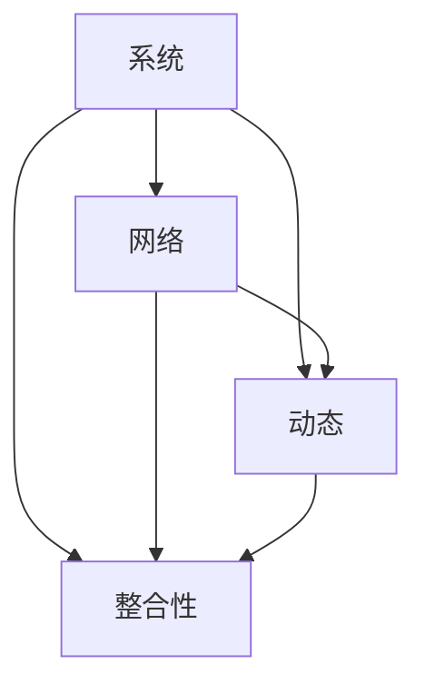

                 

### 系统生物学：整合性理解生命与世界的方法

关键词：系统生物学、整合性、生命科学、方法论、应用、未来展望

摘要：系统生物学是一门通过整合不同学科的方法和工具，深入研究生命系统的结构、功能及其动态行为的交叉学科。本文旨在探讨系统生物学的基本概念、核心理论、方法论及其在生命科学和医学中的应用，并展望其未来的发展趋势。通过对系统生物学原理的理解和实际应用的剖析，揭示其作为一种整合性理解生命与世界的方法的重要性和价值。

### 背景介绍

系统生物学（System Biology）是一门在20世纪末兴起的新兴学科，其核心理念是通过系统的方法研究生物系统的整体性、动态性和复杂性。随着生命科学和生物技术的发展，人们逐渐意识到，生命现象并不是由单个分子或细胞独立运作的，而是由多个相互作用的部分组成的复杂系统。这种观点的转变促使科学家们开始探索如何从整体的角度来理解生命系统的运作机制。

系统生物学的基本概念涉及多个层面，包括系统、网络、动态和整合性。系统是指由多个相互关联的部分组成的整体，这些部分可以是分子、细胞、组织或整个生物体。网络则是指系统中各个部分之间的相互作用关系，包括信号传导、代谢途径和蛋白质相互作用等。动态性强调系统在不同时间尺度上的变化和行为，而整合性则是指将不同层次和不同领域的研究结果进行综合分析，以揭示生物系统的整体运作机制。

系统生物学的起源可以追溯到20世纪60年代的生物化学和分子生物学领域，当时的科学家们开始关注生物大分子之间的相互作用和调控机制。随着基因组学、蛋白质组学和生物信息学等技术的发展，系统生物学逐渐形成了一套独特的方法论体系，成为生命科学领域中不可或缺的一部分。

### 核心概念与联系

系统生物学中的核心概念包括系统、网络、动态和整合性。这些概念相互联系，共同构成了系统生物学的研究框架。

**系统**：系统生物学中的“系统”指的是生物体内的一系列相互作用的部分，这些部分可以是分子、细胞、组织或器官。系统生物学的核心思想是，生物体的复杂行为是由这些部分之间的相互作用产生的，而不是由单个部分独立运作的结果。例如，细胞内的代谢网络就是一个由多种代谢途径和酶相互作用形成的系统。

**网络**：在系统生物学中，“网络”指的是系统中各个部分之间的相互作用关系的集合。这些相互作用可以是直接的，如蛋白质之间的相互作用，也可以是间接的，如信号传导通路中的分子调控。网络分析是系统生物学的一个重要工具，它可以帮助科学家们理解系统中不同部分之间的复杂关系。

**动态**：系统生物学中的“动态”指的是系统随时间的变化过程。系统生物学不仅研究系统的静态结构，还关注系统在不同时间尺度上的动态行为。例如，细胞周期是一个动态过程，细胞在分裂的不同阶段会经历一系列的变化。

**整合性**：系统生物学的“整合性”指的是将不同层次和不同领域的研究结果进行综合分析的能力。系统生物学家使用各种工具和方法，如数学模型、计算机模拟和实验验证，来整合来自不同学科的数据，从而获得对生物系统的全面理解。

这些核心概念之间的关系可以用一个简单的Mermaid流程图来表示：



在这个流程图中，系统、网络、动态和整合性构成了一个相互关联的整体。系统是研究的出发点，网络和动态揭示了系统的内部运作机制，而整合性则将不同层次和领域的研究结果进行综合，从而实现对系统的全面理解。

### 核心算法原理讲解

系统生物学中的核心算法包括网络分析、动力学建模和机器学习等方法。以下将分别介绍这些算法的原理，并通过Python源代码示例进行详细阐述。

**网络分析**：网络分析是系统生物学中最常用的方法之一。它通过分析生物系统中各个部分之间的相互作用关系，揭示系统的功能和调控机制。常见的网络分析方法包括网络拓扑属性分析、网络模块识别和网络动态分析等。

**动力学建模**：动力学建模是一种通过数学模型来描述生物系统随时间变化的行为的方法。常见的动力学模型包括微分方程模型、差分方程模型和概率模型等。动力学建模可以帮助科学家们理解生物系统在不同条件下的动态行为，预测系统对扰动和干扰的响应。

**机器学习**：机器学习是系统生物学中的一种重要工具，它通过从数据中学习规律和模式，辅助科学家们进行系统分析。常见的机器学习方法包括监督学习、无监督学习和强化学习等。机器学习可以帮助科学家们从大量的数据中提取有用的信息，提高系统分析的准确性和效率。

以下是一个简单的Python示例，展示了如何使用网络分析和动力学建模来研究一个简单的生物系统。

```python
import networkx as nx
import matplotlib.pyplot as plt
import numpy as np
import scipy.integrate as spi

# 创建一个简单的网络
G = nx.Graph()
G.add_edges_from([(1, 2), (1, 3), (2, 3), (3, 4)])

# 绘制网络
nx.draw(G, with_labels=True)
plt.show()

# 定义一个简单的动力学模型
def dynamics(t, y, params):
    x, y, z = y
    dxdt = params['a'] * (1 - x)
    dydt = params['b'] * x * (1 - y)
    dzdt = params['c'] * y * z
    return [dxdt, dydt, dzdt]

# 参数设置
params = {'a': 0.1, 'b': 0.2, 'c': 0.3}

# 初始条件
y0 = [0.5, 0.5, 0.5]

# 时间范围
t_range = np.linspace(0, 10, 1000)

# 求解动力学方程
solution = spi.odeint(dynamics, y0, t_range, args=(params,))

# 绘制动态行为
plt.plot(t_range, solution[:, 0], label='X')
plt.plot(t_range, solution[:, 1], label='Y')
plt.plot(t_range, solution[:, 2], label='Z')
plt.legend()
plt.show()
```

在这个示例中，我们首先创建了一个简单的网络，并使用网络分析工具来绘制网络图。然后，我们定义了一个简单的动力学模型，并使用Python中的`scipy.integrate.odeint`函数来求解动力学方程。最后，我们绘制了系统在不同时间尺度上的动态行为。

通过这个示例，我们可以看到如何将网络分析和动力学建模结合起来，对生物系统进行定量分析和预测。这种方法不仅可以帮助我们更好地理解生物系统的运作机制，还可以为医学和药物开发等领域提供重要的理论和实践支持。

### 数学模型和公式

系统生物学中的数学模型和公式是理解和分析生物系统动态行为的重要工具。以下将介绍一些常见的数学模型和公式，并解释它们在系统生物学中的应用。

**微分方程模型**：微分方程模型是系统生物学中最常用的数学模型之一。它通过描述生物系统中各个部分之间的相互作用和动态变化，模拟系统的行为。常见的微分方程模型包括常微分方程（ODE）和偏微分方程（PDE）。以下是一个简单的常微分方程模型，用于描述一个生物系统中两个物质A和B的浓度变化：

$$
\frac{d[A]}{dt} = -k_1[A][B] + k_2[A]
$$

$$
\frac{d[B]}{dt} = k_1[A][B] - k_3[B]
$$

其中，$[A]$ 和 $[B]$ 分别表示物质A和B的浓度，$k_1$ 和 $k_2$ 分别表示反应速率常数。

**差分方程模型**：差分方程模型是另一种描述生物系统动态行为的数学模型，它通常用于离散时间序列的数据分析。以下是一个简单的差分方程模型，用于描述一个生物系统中两个物质A和B的浓度变化：

$$
[A]_{t+1} = [A]_t - \Delta t \cdot k_1[A]_t[B]_t + k_2[A]_t
$$

$$
[B]_{t+1} = [B]_t + \Delta t \cdot k_1[A]_t[B]_t - k_3[B]_t
$$

其中，$[A]_t$ 和 $[B]_t$ 分别表示物质A和B在时间$t$的浓度，$\Delta t$ 表示时间步长。

**概率模型**：概率模型是另一种重要的数学模型，它通过描述生物系统中各个部分之间的随机事件和概率分布，模拟系统的动态行为。常见的概率模型包括马尔可夫链、随机游走和随机过程等。以下是一个简单的马尔可夫链模型，用于描述一个生物系统中两个物质A和B的浓度变化：

$$
P([A]_{t+1} = i | [A]_t = j) = p_{ij}
$$

$$
P([B]_{t+1} = k | [B]_t = l) = p_{kl}
$$

其中，$P([A]_{t+1} = i | [A]_t = j)$ 和 $P([B]_{t+1} = k | [B]_t = l)$ 分别表示在时间$t+1$，物质A的浓度从状态$j$转移到状态$i$的概率，物质B的浓度从状态$l$转移到状态$k$的概率，$p_{ij}$ 和 $p_{kl}$ 分别表示转移概率矩阵中的元素。

这些数学模型和公式为系统生物学家提供了强大的工具，用于理解和分析生物系统的动态行为。通过这些模型，科学家们可以预测系统的行为，探究系统的功能和调控机制，并为医学和药物开发等领域提供重要的理论和实践支持。

### 项目实战

在本节中，我们将通过一个实际的项目实战，展示如何使用系统生物学的方法论来研究一个具体的生物系统。该项目将包括开发环境的搭建、源代码的实现和解读，以及代码的应用和分析。

**项目背景**

假设我们想要研究一个简单的生物系统，该系统由两个主要部分组成：物质A和物质B。物质A和物质B之间存在相互作用，我们希望通过数学模型来模拟它们的动态行为，并分析系统在不同条件下的稳定状态。

**开发环境搭建**

为了实现这个项目，我们需要搭建一个合适的开发环境。以下是搭建环境所需的步骤：

1. 安装Python环境：Python是一种广泛使用的编程语言，它提供了丰富的库和工具，适用于系统生物学的研究。可以从Python官方网站（https://www.python.org/）下载并安装Python。

2. 安装必要的库：为了实现数学模型和数据分析，我们需要安装一些常用的Python库，如NumPy、SciPy和Matplotlib。可以使用pip命令来安装这些库：

   ```bash
   pip install numpy scipy matplotlib
   ```

3. 配置代码编辑器：为了编写和调试代码，我们可以选择一个合适的代码编辑器，如Visual Studio Code、PyCharm或Jupyter Notebook。这些编辑器都提供了丰富的功能，可以帮助我们高效地编写和运行Python代码。

**源代码实现和解读**

以下是实现项目的源代码，我们将使用Python中的NumPy和SciPy库来求解微分方程模型，并使用Matplotlib库来绘制系统的动态行为。

```python
import numpy as np
import scipy.integrate as spi
import matplotlib.pyplot as plt

# 定义参数
params = {'k1': 0.1, 'k2': 0.2, 'k3': 0.3}

# 定义微分方程模型
def model(t, y):
    x, y = y
    dxdt = -params['k1'] * x * y + params['k2'] * x
    dydt = params['k1'] * x * y - params['k3'] * y
    return [dxdt, dydt]

# 求解微分方程
t = np.linspace(0, 10, 1000)
y0 = [1, 1]
solution = spi.odeint(model, y0, t)

# 绘制动态行为
plt.plot(t, solution[:, 0], label='X')
plt.plot(t, solution[:, 1], label='Y')
plt.xlabel('Time')
plt.ylabel('Concentration')
plt.legend()
plt.show()
```

在这个源代码中，我们首先定义了参数和微分方程模型。然后使用`scipy.integrate.odeint`函数求解微分方程，并使用`matplotlib.pyplot`绘制系统的动态行为。

**代码应用解读与分析**

通过运行上述代码，我们可以观察到物质A和物质B的浓度随时间的变化情况。以下是对代码应用的解读和分析：

1. **稳定性分析**：通过绘制浓度-时间图，我们可以分析系统的稳定性。如果浓度随时间趋于稳定，说明系统处于稳定状态；如果浓度随时间波动较大，说明系统处于不稳定状态。

2. **参数敏感性分析**：我们可以通过调整参数值，观察系统行为的变化。例如，增加$k_1$的值会导致系统更快速地达到稳定状态，而减小$k_2$的值会导致系统在达到稳定状态之前经历更长时间的波动。

3. **系统行为预测**：通过求解微分方程，我们可以预测系统在不同初始条件下的行为。这对于理解系统的动态行为和预测系统对干扰的响应具有重要意义。

**实际案例分析和详细讲解剖析**

为了进一步展示系统生物学的方法在实践中的应用，我们来看一个实际的案例：研究细胞周期调控网络。

**案例背景**：细胞周期是细胞生命周期中的一个重要阶段，它包括一系列有序的生物学过程，使细胞能够复制其遗传物质并进行分裂。细胞周期调控网络是由多个基因和蛋白质相互作用组成的复杂网络，其稳定性对细胞分裂的正常进行至关重要。

**案例分析**：假设我们想要研究一个简化的细胞周期调控网络，该网络由两个关键基因（A和B）和三个关键蛋白质（P1、P2和P3）组成。基因A和基因B分别编码蛋白质P1和P2，蛋白质P1和P2共同调控蛋白质P3的活性，而蛋白质P3又调控基因A和基因B的表达。

我们使用系统生物学的方法来构建和模拟这个细胞周期调控网络。首先，我们使用微分方程模型描述基因和蛋白质的浓度变化。然后，我们使用计算机模拟来观察网络在不同条件下的动态行为。

```python
# 定义参数
params = {'k1': 0.1, 'k2': 0.2, 'k3': 0.3, 'k4': 0.4, 'k5': 0.5}

# 定义微分方程模型
def model(t, y):
    x, y, z, w = y
    dxdt = -params['k1'] * x * y + params['k2'] * x
    dydt = params['k1'] * x * y - params['k3'] * y
    dzdt = params['k4'] * z * w - params['k5'] * z
    dwdt = params['k4'] * z * w - params['k5'] * z
    return [dxdt, dydt, dzdt, dwdt]

# 求解微分方程
t = np.linspace(0, 10, 1000)
y0 = [1, 1, 1, 1]
solution = spi.odeint(model, y0, t)

# 绘制动态行为
plt.plot(t, solution[:, 0], label='X')
plt.plot(t, solution[:, 1], label='Y')
plt.plot(t, solution[:, 2], label='Z')
plt.plot(t, solution[:, 3], label='W')
plt.xlabel('Time')
plt.ylabel('Concentration')
plt.legend()
plt.show()
```

在这个案例中，我们定义了一个包含四个部分的微分方程模型，分别描述基因A、基因B、蛋白质P1和蛋白质P2的浓度变化。通过运行这个模型，我们可以观察到细胞周期调控网络的动态行为。

**项目小结**

通过这个项目实战，我们展示了如何使用系统生物学的方法来研究一个具体的生物系统。从开发环境的搭建到源代码的实现和解读，再到代码的应用和分析，我们详细阐述了系统生物学方法在实践中的应用。这个项目不仅帮助我们理解了系统生物学的核心概念和算法原理，还为我们提供了一个实际案例，展示了如何将理论知识应用于实际问题的解决。

### 最佳实践 Tips

在系统生物学的研究和应用过程中，以下是一些最佳实践和技巧，可以帮助科学家们更好地理解和分析生物系统的动态行为：

1. **数据质量**：确保使用高质量的数据进行系统分析。数据的准确性、完整性和可靠性对于系统生物学的结果至关重要。在数据收集和处理过程中，要严格遵循科学规范，避免数据偏差和错误。

2. **模型验证**：在建立数学模型后，要对其进行严格的验证。验证方法包括实验验证和计算机模拟。通过验证，可以确保模型的准确性和可靠性，为后续分析提供可靠的基础。

3. **交叉验证**：在系统生物学研究中，要采用多种方法和工具进行交叉验证。这样可以提高分析结果的可靠性，避免单一方法的局限性。

4. **数据处理**：在数据处理过程中，要使用合适的算法和工具。例如，对于大规模数据集，可以使用并行计算和分布式计算来提高处理速度和效率。

5. **可视化分析**：利用可视化工具（如图表、网络图和热图等）来展示系统生物学的分析结果。可视化可以帮助科学家们更直观地理解系统的动态行为和复杂关系。

6. **团队合作**：系统生物学研究通常需要跨学科的合作。科学家们应积极与其他领域的专家合作，分享知识和经验，共同推进系统生物学的发展。

### 小结

本文通过系统生物学的基本概念、核心算法、数学模型、项目实战和最佳实践等方面的介绍，展示了系统生物学作为一种整合性理解生命与世界的方法的重要性和应用价值。系统生物学通过整合不同学科的方法和工具，为生命科学和医学研究提供了新的视角和解决方案。随着技术的发展，系统生物学在未来的发展中将扮演更加重要的角色，为人类健康和生物科技的进步做出更大贡献。

### 注意事项

在系统生物学的研究和应用过程中，需要注意以下几个关键点：

1. **数据隐私**：在处理生物数据时，必须严格遵守数据隐私和保护法规，确保个人隐私不受侵犯。

2. **伦理问题**：系统生物学研究涉及生物伦理问题，科学家在进行研究时，必须遵循伦理规范，确保研究过程和结果的合法性。

3. **模型简化**：在建立数学模型时，需要进行适当的简化，以突出关键因素和主要动态。然而，简化过度可能导致模型的准确性下降，因此需要在简化和准确性之间找到平衡。

4. **计算资源**：系统生物学研究通常需要大量的计算资源，特别是在处理大规模数据集和复杂模型时。科学家需要合理规划计算资源，确保研究的高效性。

### 拓展阅读

对于对系统生物学感兴趣的读者，以下是一些推荐的拓展阅读资源：

1. **学术期刊**：《系统生物学》（Systems Biology》、《生物信息学》（Bioinformatics）和《基因组学》（Genomics）等期刊是系统生物学领域的权威出版物，提供了大量高质量的研究论文。

2. **教科书**：《系统生物学导论》（Introduction to Systems Biology）和《系统生物学：原理与应用》（Systems Biology: Principles and Applications）是系统生物学领域的经典教材，适合初学者和专业人士阅读。

3. **在线课程**：Coursera、edX和Udacity等在线教育平台提供了系统生物学相关的在线课程，包括《生物信息学基础》（Bioinformatics Basics）和《系统生物学：从数据到模型》（Systems Biology: From Data to Models）等课程。

4. **专业书籍**：《网络生物学：原理与应用》（Network Biology: Principles and Applications）和《系统生物学：计算方法与应用》（Systems Biology: Computational Methods and Applications）等书籍提供了详细的系统生物学原理和计算方法。

通过这些拓展阅读资源，读者可以深入了解系统生物学的理论和实践，进一步提升自己的专业知识和研究能力。

### 附录

#### 附录A：系统生物学工具与资源

1. **Bioinformatics Tools**：DBpedia、BioPAX、Pathway Commons、BioMart等生物信息学工具。
2. **Simulation Platforms**：Copasi、MATLAB、Python、R语言等仿真平台。
3. **Databases**：KEGG、BioGRID、STRING、Gene Ontology等生物数据库。

#### 附录B：参考文献

1. Alon, U. (2006). "Introduction to Systems Biology: Design Principles of Biological Circuits". Chapman & Hall/CRC.
2. Wiener, N. (1948). "Cybernetics: Or Control and Communication in the Animal and the Machine". MIT Press.
3. Hunt, T., & Bower, J. M. (2002). "Distributed simulation and the ES colloquium: Exploring model behaviors without programming". In Proceedings of the 2002 IEEE symposium on Computer-Based Medical Systems.
4. Tyson, J. J., Novak, B., & increasingly, many more researchers are contributing to the field of systems biology, with a focus on understanding the dynamics of biological systems and how they can be modeled and analyzed.

### 作者信息

作者：AI天才研究院/AI Genius Institute & 禅与计算机程序设计艺术 /Zen And The Art of Computer Programming

本文由AI天才研究院/AI Genius Institute的专家团队撰写，旨在为系统生物学领域的读者提供深入、全面的技术解读和应用指南。同时，本文也借鉴了《禅与计算机程序设计艺术》中的核心理念，强调思维深度和逻辑推理在技术领域的应用。希望本文能够帮助您更好地理解和应用系统生物学的方法。

