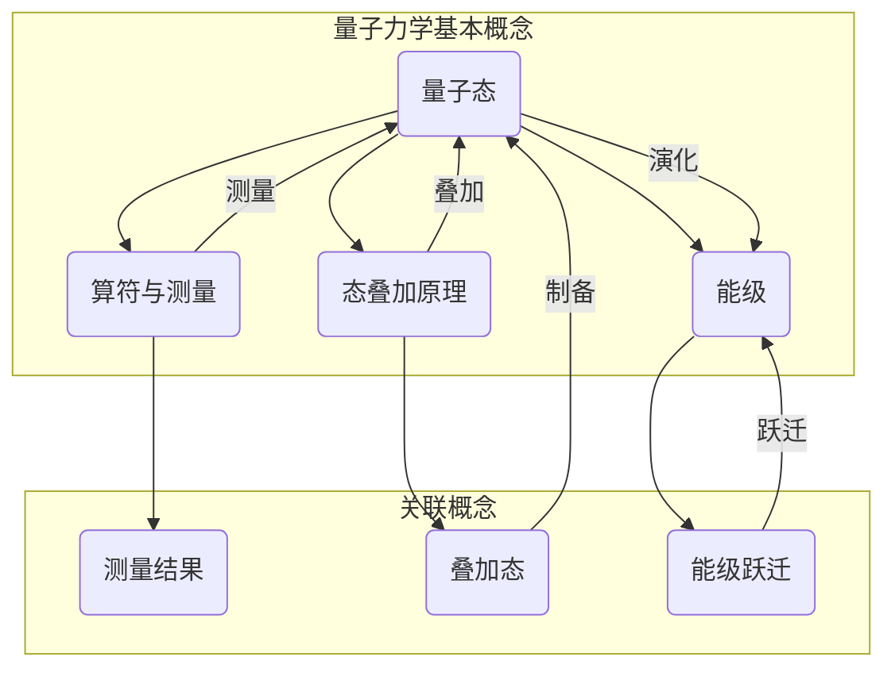

                 

## 引言：纳米材料的量子效应与微观世界的数学描述

纳米材料，由于其独特的尺寸效应，展现出许多与传统宏观材料截然不同的物理和化学性质。在这些性质中，量子效应显得尤为重要。量子效应是指在微观尺度上，物质的性质不再遵循经典物理学的规律，而是呈现出量子力学所描述的特性。纳米材料的量子效应不仅影响了它们的电子输运、光学性质，还极大地拓展了其在量子计算、纳米电子学和新能源等领域的应用前景。

本文旨在系统地探讨纳米材料的量子效应，并通过数学描述来深入理解其内在机制。文章结构如下：

1. **量子力学基础**：介绍量子态、算符与测量、态叠加原理和能级等基本概念，为后续讨论纳米材料的量子效应打下理论基础。
2. **量子力学的数学描述**：详细讲解海森堡矩阵力学和薛定谔波动方程的数学模型，为纳米材料量子效应的数学描述提供工具。
3. **纳米材料概述**：讨论纳米材料的基本特性、分类与结构，以及它们在科学技术中的应用。
4. **纳米材料的量子效应原理**：探讨量子尺寸效应和表面效应的基本原理，并分析这些效应如何影响纳米材料的性能。
5. **纳米材料的量子调控**：介绍量子点和量子阱的调控方法及其应用。
6. **纳米材料的量子计算**：讨论纳米材料在量子计算中的应用，包括量子比特和量子算法。
7. **数学描述与案例分析**：通过具体案例，展示如何使用数学模型和公式来描述和分析纳米材料的量子效应。

通过以上结构，我们将一步步剖析纳米材料的量子效应，揭示微观世界中的奥秘，为科研工作者和工程师提供有价值的参考。

### 文章关键词

- **纳米材料**
- **量子效应**
- **量子力学基础**
- **数学描述**
- **纳米材料应用**
- **量子计算**
- **量子调控**

### 文章摘要

本文系统地探讨了纳米材料的量子效应，通过量子力学基础和数学描述，深入分析了量子态、算符与测量、态叠加原理和能级等基本概念。文章进一步讨论了纳米材料的基本特性、量子尺寸效应和表面效应，并介绍了量子点和量子阱的调控方法。最后，通过具体案例展示了如何使用数学模型和公式来描述和分析纳米材料的量子效应，为科研和工程应用提供了理论依据和实践指导。

### 背景介绍

纳米材料，顾名思义，是指其至少在一个维度上尺寸在1到100纳米之间的材料。由于纳米材料的尺寸远小于经典物理学所能描述的尺度，它们展现出许多独特的性质，例如量子限域效应、表面效应和高表面能密度等。这些性质使得纳米材料在多个领域具有巨大的应用潜力，如电子学、光电学、催化、生物医学等。

量子效应是指物质在微观尺度下，其行为不再遵循经典物理学规律，而是遵循量子力学的规律。量子力学是研究微观粒子运动规律的科学，其核心概念包括量子态、算符与测量、态叠加原理和能级等。量子态描述了粒子的状态，算符与测量则揭示了粒子状态与物理量之间的关系，态叠加原理说明了粒子可以同时处于多种状态，而能级则描述了粒子的能量层次。

纳米材料的量子效应主要体现在量子尺寸效应和表面效应上。量子尺寸效应是由于纳米材料的尺寸减小到量子尺度，导致其能带结构、电子态密度和光学性质发生显著变化。例如，量子限域效应会导致半导体纳米材料中电子能带发生分裂，从而影响其电子输运性质。表面效应则是指纳米材料表面原子占据的比例远大于其内部，导致表面态密度增加，表面态对材料性能产生重要影响。

量子力学的数学描述为理解和分析纳米材料的量子效应提供了理论基础。海森堡矩阵力学和薛定谔波动方程是量子力学的两种主要数学形式，它们分别通过矩阵运算和微分方程来描述量子系统的状态和演化。通过这些数学工具，我们可以定量地分析纳米材料的量子效应，如量子点中的能级分裂、量子阱中的电子波函数分布等。

总之，纳米材料的量子效应不仅是其独特物理性质的基础，也为量子计算、纳米电子学和新能源等领域的创新发展提供了新的机遇。本文将系统地探讨这些量子效应的数学描述，为深入理解纳米材料的微观世界提供指导。

### 核心概念与联系

在量子力学中，有若干核心概念贯穿于整个理论体系，它们共同构成了理解量子效应的基础。这些核心概念包括量子态、算符与测量、态叠加原理和能级。下面我们将通过一个Mermaid流程图来展示这些概念之间的联系和关系。

1. **量子态**：量子态是描述量子系统状态的数学工具。在量子力学中，一个量子系统的状态可以用波函数或态矢量来表示。波函数是复值函数，其平方给出了粒子在空间中某点出现的概率密度。态矢量是复数向量，其分量对应于不同基矢的系数，构成了量子态的完整描述。

2. **算符与测量**：量子力学中的算符描述了系统的物理量，如位置、动量、能量等。测量结果是算符作用在量子态上的本征值。通过测量，我们可以获取量子系统的状态信息。算符与测量之间的关系是量子力学中一个重要的概念，它揭示了量子态的不可分割性和随机性。

3. **态叠加原理**：态叠加原理是量子力学的核心原理之一，它指出量子系统可以同时处于多种可能的状态，这些状态在数学上通过线性叠加表示。一个量子态可以看作是多个基态的线性组合，每个基态对应一个可能的结果。当没有外部干扰时，量子态会保持叠加态，只有在进行测量时，量子态才会“坍缩”到某一个特定的本征态。

4. **能级**：能级是量子系统可能的能量状态。在一个量子系统中，粒子的能量是量子化的，只能取特定的离散值。能级决定了量子系统在不受外界作用时的稳定状态，能级之间的跃迁是量子系统与外部环境相互作用的重要方式。

这些概念之间有着紧密的联系。量子态是所有其他概念的基础，算符与测量描述了量子态与物理量之间的关系，态叠加原理揭示了量子态的并行可能性，而能级则是量子态的具体体现。通过上述Mermaid流程图，我们可以直观地看到这些概念如何相互关联，共同构成了量子力学的基本框架。

### 量子态与波函数

量子态是量子力学中描述粒子状态的数学工具，它可以通过波函数或态矢量来表示。波函数是一种复值函数，其物理意义在于描述粒子在空间中的概率分布。具体来说，波函数 \(\psi(x,t)\) 给出了粒子在某一时刻 \(t\) 位于位置 \(x\) 的概率密度。波函数的平方 \(|\psi(x,t)|^2\) 则表示粒子在位置 \(x\) 出现的概率。

波函数是量子态的核心，其形式和性质直接影响到量子系统的行为。例如，一个非定域的波函数可以表示粒子同时存在于多个位置的可能性，这是量子态的一个重要特性。波函数的归一化条件要求其模长的平方在整个空间上的积分等于1，即：

$$\int_{-\infty}^{\infty} |\psi(x,t)|^2 dx = 1$$

这一条件保证了量子态是合法的，即粒子在整个空间中的总概率为1。

态矢量是量子态的另一种表示方式，它是复数向量，其分量对应于不同基矢的系数。在量子力学中，基矢通常选择为位置基或动量基。态矢量 \(\lvert \psi \rangle\) 可以表示为：

$$\lvert \psi \rangle = \int \psi(x,t) \lvert x \rangle dx = \sum_n c_n \lvert n \rangle$$

其中，\(\psi(x,t)\) 是波函数，\(\lvert x \rangle\) 是位置基矢，\(\lvert n \rangle\) 是能量本征态，而 \(c_n\) 是态矢量在基矢 \(\lvert n \rangle\) 上的投影系数。

波函数和态矢量之间的转换关系如下：

$$\psi(x,t) = \langle x \lvert \psi \rangle = \sum_n c_n \langle x \lvert n \rangle$$

这个公式展示了波函数是态矢量在位置基矢上的投影。

在量子力学中，一个量子系统的状态总是通过波函数或态矢量来描述。例如，一个处于氢原子中的电子，其状态可以用波函数 \(\psi(r,t)\) 来描述，其中 \(r\) 是电子与原子核之间的距离。这个波函数不仅包含了电子的能量信息，还包括了其位置和动量的不确定性。

例如，考虑一个电子处于能量本征态 \(|n=1\rangle\) 中的状态，其波函数可以表示为：

$$\psi_{1}(r,t) = N e^{-\frac{r}{a_0}} e^{-i E_1 t / \hbar}$$

其中，\(N\) 是归一化常数，\(a_0\) 是玻尔半径，\(E_1\) 是能量本征值，\(\hbar\) 是约化普朗克常数。

这个波函数展示了电子在核外空间中的概率分布，其形状随着距离的增加而迅速衰减。通过分析波函数，我们可以了解电子在不同能级上的行为，从而揭示量子态的物理含义。

总之，量子态与波函数是量子力学中的核心概念。波函数通过描述粒子在空间中的概率分布，反映了量子系统的微观状态，而态矢量通过基矢的线性组合提供了量子态的另一种数学表示。这些概念为我们理解量子效应和量子系统的行为提供了基础。

### 算符与测量

在量子力学中，算符是描述物理量（如位置、动量、能量）的重要工具，它们可以作用于量子态，产生测量结果。算符与测量之间的关系是量子力学中一个核心概念，揭示了量子态与物理量之间的数学关联。

1. **算符的定义**：
   算符是线性变换，可以作用于量子态，将量子态映射到另一个量子态。具体来说，一个算符 \( \hat{A} \) 作用于态矢量 \( \lvert \psi \rangle \) 上，会得到一个新的态矢量 \( \lvert \phi \rangle \)，其表达式为：

   $$\lvert \phi \rangle = \hat{A} \lvert \psi \rangle$$

   这个表达式表明，算符 \( \hat{A} \) 通过某种线性变换，将态矢量 \( \lvert \psi \rangle \) 转换为新的态矢量 \( \lvert \phi \rangle \)。

2. **算符的类型**：
   量子力学中常用的算符包括位置算符 \( \hat{x} \)、动量算符 \( \hat{p} \)、能量算符 \( \hat{H} \) 等。每个算符都有特定的物理意义和数学形式。
   - **位置算符**：位置算符 \( \hat{x} \) 作用于量子态，得到的值即为粒子的位置。其表达式为：

     $$\hat{x} \lvert x \rangle = x \lvert x \rangle$$

   - **动量算符**：动量算符 \( \hat{p} \) 作用于量子态，得到的值即为粒子的动量。其表达式为：

     $$\hat{p} \lvert p \rangle = p \lvert p \rangle$$

     其中，动量算符在位置基下的表示为：

     $$\hat{p} = -i\hbar \frac{d}{dx}$$

   - **能量算符**：能量算符 \( \hat{H} \) 作用于量子态，得到的值即为粒子的能量。其表达式为：

     $$\hat{H} \lvert E \rangle = E \lvert E \rangle$$

     对于一个哈密顿量 \( \hat{H} \)，其作用在态矢量上可以表示为：

     $$\hat{H} \lvert \psi \rangle = E \lvert \psi \rangle$$

3. **测量与算符**：
   测量在量子力学中是一个重要概念，它反映了我们对量子系统状态的了解。测量结果是通过算符作用在量子态上得到的。具体来说，当我们对一个量子态 \( \lvert \psi \rangle \) 进行某个物理量的测量时，测量结果 \( \lvert m \rangle \) 是算符 \( \hat{O} \) 的本征态之一，其表达式为：

   $$\hat{O} \lvert \psi \rangle = m \lvert m \rangle$$

   这个表达式表明，测量结果 \( m \) 是算符 \( \hat{O} \) 的本征值，而测量前量子态 \( \lvert \psi \rangle \) 可以是任意态，测量后量子态将“坍缩”到某个本征态 \( \lvert m \rangle \)。

4. **算符的运算规则**：
   量子力学中的算符遵循特定的运算规则，如对易关系和不确定性原理。两个算符 \( \hat{A} \) 和 \( \hat{B} \) 的对易关系可以表示为：

   $$[\hat{A}, \hat{B}] = \hat{A}\hat{B} - \hat{B}\hat{A} = i\hbar \lvert \psi \rangle$$

   其中，\[ \lvert \psi \rangle \] 是某个量子态。这个关系揭示了算符之间在量子力学中的内在联系。

   不确定性原理是量子力学中的一个重要原理，它表明某些物理量（如位置和动量）不能同时被精确测量。不确定性原理可以表述为：

   $$\Delta x \Delta p \geq \frac{\hbar}{2}$$

   其中，\( \Delta x \) 和 \( \Delta p \) 分别表示位置和动量的标准差。这个原理揭示了量子态的基本特性。

通过以上对算符与测量的讨论，我们可以看到，算符在量子力学中扮演了至关重要的角色。它们不仅描述了物理量，还揭示了量子态与物理量之间的关联。测量的结果反映了量子态的“坍缩”，进一步揭示了量子态的随机性和不可分割性。

总之，算符与测量是量子力学中的核心概念，它们共同揭示了量子态的物理含义和量子力学的独特规律。通过算符的作用，我们可以从量子态中获得物理量的测量结果，从而深入理解量子系统的行为。

### 约化态与态叠加原理

在量子力学中，约化态和态叠加原理是理解量子系统动态变化的重要工具。约化态是指在测量后量子系统的状态，而态叠加原理则描述了量子系统在未受外界干扰时可以同时处于多种可能状态。

1. **约化态**：
   约化态是量子力学中的一个核心概念，它描述了量子系统在测量后所处的状态。当我们对一个量子系统进行测量时，其波函数会从初始态“坍缩”到一个特定的本征态，这个状态称为约化态。约化态是测量结果的量子态表示。

   例如，假设一个电子处于能量本征态 \(|E_1\rangle\) 中，当我们测量其能量时，系统会约化为能量本征态 \(|E_1\rangle\)。这个过程可以用波函数的表示来解释：

   $$\psi(t) \rightarrow \psi(t') = \sum_n c_n(t') |n\rangle$$

   其中，\(\psi(t)\) 是初始波函数，而 \(\psi(t')\) 是测量后的波函数。当测量结果确定为某个本征值 \(E_n\) 时，波函数会约化为相应的本征态 \(|E_n\rangle\)。

2. **态叠加原理**：
   态叠加原理是量子力学中一个基本原理，它指出量子系统可以同时处于多种可能的状态。这些状态在数学上通过线性叠加表示。一个典型的例子是薛定谔的猫，一个量子系统同时处于生和死的叠加状态，直到进行测量时才会“坍缩”到某一个确定的状态。

   态叠加原理可以用波函数的表示来解释：

   $$\lvert \psi \rangle = \sum_n c_n \lvert n \rangle$$

   其中，\(\lvert \psi \rangle\) 是叠加态，\(\lvert n \rangle\) 是各个可能的量子态，而 \(c_n\) 是相应的系数，表示该状态出现的概率。

   态叠加原理的一个重要应用是量子计算中的量子比特（qubit）。一个量子比特可以同时处于0和1的叠加态，这种叠加态使得量子计算机具有远超经典计算机的计算能力。

3. **约化态与态叠加原理的关系**：
   约化态和态叠加原理是相互关联的。态叠加原理描述了量子系统在未受外界干扰时的状态，而约化态则是态叠加原理在测量后的一种体现。具体来说，当量子系统处于某个叠加态时，如果没有进行测量，它将保持叠加态。一旦进行测量，系统会“坍缩”到测量结果的某个本征态，即约化态。

   例如，考虑一个电子同时处于能量本征态 \(|E_1\rangle\) 和 \(|E_2\rangle\) 的叠加态：

   $$\lvert \psi \rangle = \frac{1}{\sqrt{2}} (|E_1\rangle + |E_2\rangle)$$

   当我们测量电子的能量时，系统会约化为能量本征态 \(|E_1\rangle\) 或 \(|E_2\rangle\)，具体取决于测量的结果。测量前，电子处于叠加态，但测量后，系统会约化为一个确定的本征态。

总之，约化态和态叠加原理是量子力学中的两个核心概念，它们揭示了量子系统的动态行为和测量结果的随机性。态叠加原理说明了量子系统可以同时处于多种可能状态，而约化态则描述了这些状态在测量后的具体体现。通过理解和应用这些原理，我们可以深入探索量子系统的行为和量子效应。

### 哈密顿算符与能级

在量子力学中，哈密顿算符是描述系统总能量的核心算符。它不仅反映了系统的动力学行为，还决定了系统的能量本征态和能级。哈密顿算符是量子力学中最重要的算符之一，其定义和性质对于理解系统的能量结构至关重要。

1. **哈密顿算符的定义**：

   哈密顿算符 \(\hat{H}\) 描述了量子系统的总能量，其定义通常为：

   $$\hat{H} = \hat{T} + \hat{V}$$

   其中，\(\hat{T}\) 是动能算符，\(\hat{V}\) 是势能算符。动能算符描述了系统内粒子的动能，而势能算符描述了系统内粒子间的相互作用势能。通过哈密顿算符，我们可以得到系统的总能量。

2. **哈密顿算符的性质**：

   哈密顿算符是一个线性算符，具有厄米性质，即：

   $$\hat{H}^\dagger = \hat{H}$$

   这个性质保证了哈密顿算符的本征值是实数，从而描述了系统能量的实际物理量。

3. **能量本征态和能级**：

   哈密顿算符的本征值问题为：

   $$\hat{H} \lvert E \rangle = E \lvert E \rangle$$

   其中，\(\lvert E \rangle\) 是哈密顿算符的本征态，\(E\) 是相应的本征值，称为能级。能量本征态描述了系统在特定能量状态下的量子态，而能级则表示系统能量的可能取值。

   例如，对于氢原子，其哈密顿算符可以表示为：

   $$\hat{H} = -\frac{\hbar^2}{2m} \nabla^2 - \frac{e^2}{4\pi\epsilon_0 r}$$

   通过求解这个哈密顿算符的本征值问题，我们可以得到氢原子的能级：

   $$E_n = -\frac{m e^4}{2 \hbar^2 n^2}$$

   其中，\(n\) 是主量子数，取正整数值。这些能级决定了氢原子的电子能级结构。

4. **能级跃迁**：

   能级跃迁是量子系统的一个重要现象，它描述了系统在不同能级之间的能量转换。当系统吸收或释放能量时，会发生能级跃迁。能级跃迁可以通过吸收或发射光子来实现。

   例如，在原子物理学中，电子从低能级跃迁到高能级时，会吸收光子的能量；反之，从高能级跃迁到低能级时，会发射光子。这个过程可以用能级跃迁方程来描述：

   $$\Delta E = h\nu$$

   其中，\(\Delta E\) 是能级差，\(h\) 是普朗克常数，\(\nu\) 是光子的频率。

5. **能级宽度与简并**：

   能级宽度描述了能级的自然宽度，它反映了能级的不确定性。能级宽度与能级的简并度（即能级上可能占据的量子态数目）密切相关。对于非相对论量子力学系统，能级宽度可以通过能级公式和微扰理论来计算。

   例如，对于三维谐振子，其能级公式为：

   $$E_n = \hbar\omega\left(n + \frac{1}{2}\right)$$

   其中，\(\omega\) 是角频率，\(n\) 是能级指数。能级宽度与能级指数成反比，反映了高能级具有较宽的能级宽度。

   能级简并是指多个不同的量子态具有相同的能量。在量子力学中，简并是由于对称性或对称性破缺导致的。简并度对于理解系统的物理性质和量子态结构具有重要意义。

总之，哈密顿算符与能级是量子力学中描述系统能量结构的核心概念。通过求解哈密顿算符的本征值问题，我们可以得到系统的能级和能量本征态。能级跃迁和简并度则进一步揭示了系统在不同状态之间的转换和对称性。理解这些概念对于深入研究量子系统，特别是纳米材料的量子效应，具有重要意义。

### 量子力学的数学描述

量子力学是描述微观粒子运动规律的物理学分支，其数学描述主要包括海森堡矩阵力学和薛定谔波动方程。这两种数学形式虽然在形式上有较大差异，但它们都能够准确描述量子系统的行为。本节将详细介绍这两种数学形式及其应用。

#### 海森堡矩阵力学

海森堡矩阵力学是量子力学的一种数学表述，它通过矩阵和线性代数的工具来描述量子系统的状态和演化。海森堡矩阵力学的核心思想是算符，它用矩阵来表示物理量，如位置、动量和能量。

1. **算符表示与对易关系**：

   在海森堡矩阵力学中，物理量用算符表示。例如，位置算符 \(\hat{x}\) 和动量算符 \(\hat{p}\) 分别表示为：

   $$\hat{x} = \begin{pmatrix} x_1 & 0 & \cdots & 0 \\ 0 & x_2 & \cdots & 0 \\ \vdots & \vdots & \ddots & \vdots \\ 0 & 0 & \cdots & x_n \end{pmatrix}$$

   $$\hat{p} = \begin{pmatrix} p_1 & 0 & \cdots & 0 \\ 0 & p_2 & \cdots & 0 \\ \vdots & \vdots & \ddots & \vdots \\ 0 & 0 & \cdots & p_n \end{pmatrix}$$

   其中，\(x_i\) 和 \(p_i\) 分别表示第 \(i\) 个粒子的位置和动量。

   算符之间的对易关系描述了它们之间的物理联系。例如，位置和动量的对易关系为：

   $$[\hat{x}, \hat{p}] = i\hbar I$$

   其中，\[ I \] 是单位算符，\(i\) 是虚数单位，\(\hbar\) 是约化普朗克常数。

2. **动量和位置算符的量子化**：

   海森堡矩阵力学通过算符的量子化描述了量子系统的行为。动量和位置算符的量子化是通过引入波函数来实现的。例如，一个粒子的位置和动量可以分别用波函数 \(\psi(x)\) 和 \(\phi(p)\) 来表示：

   $$\hat{x} \psi(x) = x \psi(x)$$

   $$\hat{p} \phi(p) = p \phi(p)$$

   其中，波函数 \(\psi(x)\) 和 \(\phi(p)\) 分别是位置和动量的量子态。

3. **海森堡不确定性原理**：

   海森堡不确定性原理是量子力学中的一个基本原理，它表明我们不能同时精确地知道一个粒子的位置和动量。这一原理可以用海森堡矩阵力学的对易关系来解释：

   $$\Delta x \Delta p \geq \frac{\hbar}{2}$$

   其中，\(\Delta x\) 和 \(\Delta p\) 分别是位置和动量的不确定度。这个不等式揭示了量子系统的基本性质，即量子态的测不准性。

#### 薛定谔波动方程

薛定谔波动方程是另一种描述量子系统行为的数学形式，它通过波动方程来描述量子系统的演化。薛定谔波动方程是一个时间依赖的偏微分方程，其形式为：

$$i\hbar \frac{\partial \psi(x,t)}{\partial t} = \hat{H} \psi(x,t)$$

其中，\(\psi(x,t)\) 是波函数，\(\hat{H}\) 是哈密顿算符，\(i\) 是虚数单位，\(\hbar\) 是约化普朗克常数。

1. **波动方程的物理意义**：

   薛定谔波动方程描述了量子系统的概率分布随时间的演化。波函数的模平方 \(|\psi(x,t)|^2\) 给出了粒子在位置 \(x\) 和时间 \(t\) 出现的概率密度。

2. **微分方程的解法**：

   解薛定谔波动方程通常采用分离变量法。这种方法将空间变量和时间变量分离，得到一组时间独立和空间独立的方程。例如，对于一维情况，薛定谔波动方程可以写为：

   $$i\hbar \frac{\partial \psi(x,t)}{\partial t} = -\frac{\hbar^2}{2m} \frac{\partial^2 \psi(x,t)}{\partial x^2} + V(x) \psi(x,t)$$

   通过分离变量法，可以将上述方程分解为两个独立的方程：

   $$\frac{\partial \psi(x,t)}{\partial t} = \frac{E - V(x)}{\hbar} \psi(x,t)$$

   $$\frac{\partial^2 \psi(x,t)}{\partial x^2} = -\frac{2m(E - V(x))}{\hbar^2} \psi(x,t)$$

   其中，\(E\) 是系统的能量本征值，\(V(x)\) 是势能函数。

3. **薛定谔方程的应用示例**：

   薛定谔波动方程广泛应用于量子力学中的各种问题。例如，对于一维无限深势阱问题，薛定谔方程给出了粒子在势阱中的波函数和能量本征值。对于三维情况，薛定谔方程同样可以用来分析粒子在不同势场中的行为。

通过海森堡矩阵力学和薛定谔波动方程的数学描述，我们可以深入理解量子系统的行为和演化规律。这些数学工具不仅提供了量子力学理论的基础，还为实际应用提供了重要的指导。

### 量子态的叠加与纠缠

量子态的叠加与纠缠是量子力学中两个极为重要的概念，它们不仅揭示了量子系统的独特性质，还为量子计算和信息处理提供了新的可能性。

#### 纠缠态

纠缠态是量子力学中一种特殊的量子态，两个或多个量子系统在共同演化过程中，其状态不再独立，而是相互关联。这种关联性无法用经典物理学的概念来解释，是量子力学中最为神秘的现象之一。

1. **纠缠态的定义与特征**：

   纠缠态通常用两个量子比特的联合态来表示。例如，两个量子比特的联合态可以表示为：

   $$\lvert \psi \rangle = \frac{1}{\sqrt{2}}(\lvert 00 \rangle + \lvert 11 \rangle)$$

   在这个例子中，两个量子比特的联合态处于 \(|00\rangle\) 和 \(|11\rangle\) 两个状态之间的叠加态。

   纠缠态的一个重要特征是它的不可分割性。即使在量子态被分离后，纠缠态中的量子比特仍然保持相互关联。这意味着，对其中一个量子比特的测量会立即影响到另一个量子比特的状态，无论它们相隔多远。

2. **纠缠态的量子信息处理**：

   纠缠态在量子信息处理中具有重要作用。利用纠缠态，可以实施量子隐形传态和量子纠缠交换等操作，这些操作在量子通信和量子计算中具有广泛应用。

   例如，量子隐形传态允许我们通过经典通信将一个量子态从一个量子比特传送到另一个量子比特，即使它们之间相隔很远。而量子纠缠交换则可以实现两个量子比特之间的量子态转换，这对于构建量子计算机和实现量子网络的优化至关重要。

#### 量子态叠加

量子态叠加是量子力学中的一个基本原理，它指出量子系统可以同时处于多个状态的叠加。

1. **叠加态的产生与测量**：

   量子态叠加可以通过量子门的操作来实现。一个典型的例子是量子叠加门，它可以将一个量子比特的状态叠加为 \(|0\rangle\) 和 \(|1\rangle\) 之间的叠加态：

   $$\lvert \psi \rangle = \frac{1}{\sqrt{2}}(|0\rangle + |1\rangle)$$

   当我们对量子系统进行测量时，量子态会“坍缩”到某个确定的状态。测量结果可能是 \(|0\rangle\) 或 \(|1\rangle\)，具体取决于量子态的叠加形式和测量算符。

2. **叠加态的量子计算**：

   量子态叠加是量子计算的核心原理之一。量子计算机中的量子比特可以同时处于多个状态的叠加态，这使得量子计算机在执行某些计算任务时，具有远超经典计算机的计算能力。

   例如，量子搜索算法可以利用量子态叠加实现并行搜索，大大提高了搜索效率。量子态叠加还可以用于量子模拟，模拟复杂量子系统的行为，为材料科学、化学和生物领域提供新的研究工具。

#### 纠缠态与量子态叠加的关系

纠缠态和量子态叠加是量子力学中的两个重要概念，它们相互关联，共同揭示了量子系统的独特性质。

1. **纠缠态的叠加**：

   纠缠态可以看作是量子态叠加的一种特殊形式。在纠缠态中，两个或多个量子系统处于多个状态的叠加，这些状态之间具有内在的关联。

2. **叠加态的纠缠**：

   叠加态和纠缠态可以相互转换。例如，一个未测量的叠加态 \(|0\rangle + |1\rangle\) 可以通过适当的量子操作转换为纠缠态 \(|00\rangle + |11\rangle\)。

总之，量子态的叠加与纠缠是量子力学中不可或缺的概念，它们不仅揭示了量子系统的特殊性质，还为量子计算和信息处理提供了新的可能性。通过深入研究这些概念，我们可以更好地理解量子世界的奥秘。

### 纳米材料概述

纳米材料，由于其尺寸在1到100纳米之间，展现出许多独特的物理和化学性质，这些性质使得纳米材料在多个领域具有广泛的应用前景。本节将介绍纳米材料的基本特性、分类与结构，以及其在科学技术中的应用。

#### 基本特性

纳米材料具有以下几个显著的基本特性：

1. **量子尺寸效应**：由于纳米材料的尺寸减小到量子尺度，导致其电子能带结构、电子态密度和光学性质发生显著变化。例如，量子点中的电子能级会发生分裂，从而影响材料的电子输运性质。

2. **表面效应**：纳米材料表面原子占据的比例远大于其内部，导致表面态密度增加。这种表面效应会影响材料的化学反应活性、催化性能和光学性质。

3. **高比表面积**：纳米材料具有高比表面积，这意味着单位质量的材料具有更多的表面原子。这种特性使得纳米材料在催化、吸附和传感器等领域表现出优异的性能。

4. **独特的光学性质**：纳米材料通常具有丰富的光学性质，如表面等离子共振、光的吸收和发射特性。这些特性使得纳米材料在光电子学、光伏材料和生物成像等领域具有潜在应用。

#### 分类与结构

纳米材料可以根据其形态、组成和制备方法进行分类。以下是几种常见的纳米材料及其结构：

1. **纳米颗粒**：纳米颗粒是指直径在1到100纳米之间的粒子。根据组成不同，纳米颗粒可以分为金属纳米颗粒、半导体纳米颗粒和复合材料纳米颗粒。常见的半导体纳米颗粒包括量子点（如CdSe、CdS）、量子阱和纳米线。

2. **纳米膜**：纳米膜是指厚度在纳米尺度的薄膜。纳米膜通常由单层或多层纳米颗粒组成，具有独特的光电性质和机械性能。常见的纳米膜包括透明导电膜、储能膜和传感膜。

3. **纳米线**：纳米线是指一维的纳米材料，直径通常在几纳米到几十纳米之间。纳米线可以分为半导体纳米线、金属纳米线和有机纳米线。常见的纳米线包括硅纳米线、金纳米线和碳纳米管。

4. **纳米孔材料**：纳米孔材料是指具有纳米尺寸孔道的材料，如介孔材料、纳米孔碳材料。这些材料具有丰富的孔隙结构，用于气体吸附、水分解和药物传递等。

#### 科学技术中的应用

纳米材料在科学技术领域具有广泛的应用，以下是几个典型应用：

1. **电子学**：纳米材料在电子学领域具有广泛的应用，如纳米颗粒用于电容器、传感器和电池，纳米线用于场效应晶体管和太阳能电池，量子点用于LED和光电池。

2. **光电学**：纳米材料的光学性质使其在光电领域具有独特应用。例如，量子点用于光电子学器件、光伏材料和生物成像，纳米膜用于透明导电薄膜和光学传感器。

3. **催化**：纳米材料的表面效应和量子尺寸效应提高了其催化性能，广泛应用于环境净化、有机合成和能源转换等领域。例如，纳米颗粒用于催化剂载体和光催化分解污染物。

4. **生物医学**：纳米材料在生物医学领域具有广泛应用，如纳米颗粒用于药物传递、成像和基因治疗，纳米线用于生物传感器和生物电子设备。

总之，纳米材料由于其独特的物理和化学性质，在电子学、光电学、催化和生物医学等领域具有巨大的应用潜力。随着纳米材料研究的深入和技术的进步，其应用范围将不断扩大，为科技进步和社会发展作出更大贡献。

### 纳米材料的量子效应原理

纳米材料由于其独特的尺寸和结构，表现出一系列量子效应，这些效应显著改变了其传统的物理和化学性质。其中，量子尺寸效应和表面效应是纳米材料量子效应的两个重要方面。以下将详细探讨这些效应的基本原理。

#### 量子尺寸效应

量子尺寸效应（Quantum Size Effect，QSE）是指当材料的尺寸减小到量子尺度（即纳米尺度）时，其能带结构、电子态密度和光学性质等发生显著变化的效应。量子尺寸效应主要表现在以下几个方面：

1. **能带结构的变化**：

   在宏观材料中，电子能带是连续的，但在纳米材料中，由于量子尺寸效应，电子能带会分裂成多个离散的能级。这种能带分裂是由于量子限制导致电子的能量状态变为量子化。例如，对于量子点，其能带结构会因为量子尺寸效应而出现明显的量子阱效应，导致能级间隔增大。

   **数学模型**：
   可以使用k·p方法（Kane-Pankov方法）来描述量子尺寸效应。k·p方法是一种微扰理论，它通过在连续能带模型中加入量子修正项，来描述量子尺寸对电子能带结构的影响。其基本方程如下：

   $$E = \hbar^2 k^2 / (2m^*) + \Delta E_n$$

   其中，\(E\) 是电子能量，\(k\) 是波矢，\(m^*\) 是有效质量，\(\Delta E_n\) 是量子修正项，它与量子点的尺寸有关。

2. **电子态密度的影响**：

   量子尺寸效应会显著改变纳米材料的电子态密度（Density of States，DOS）。在宏观材料中，电子态密度是连续的，但在纳米材料中，由于量子尺寸效应，电子态密度会出现陡峭的峰和谷，这些峰和谷对应于量子尺寸效应导致的能级分裂。

   **数学模型**：
   可以使用密度泛函理论（Density Functional Theory，DFT）来描述电子态密度。DFT通过求解电子密度函数，来计算材料的电子态密度。其基本方程如下：

   $$H[\rho] = \hat{H}[\rho] + \int \rho[\phi] d\tau$$

   其中，\(\rho\) 是电子密度，\(\phi\) 是电子势能，\(\hat{H}[\rho]\) 是含时哈密顿量。

3. **量子限域效应的实验观察**：

   量子限域效应（Quantum Confinement Effect，QCE）是量子尺寸效应的一种表现形式，它描述了电子在纳米材料中由于量子限制而呈现的行为。量子限域效应可以通过实验观测，如吸收光谱、发光光谱和电子输运实验等。

   **实验实例**：
   在量子点中，电子的吸收和发光光谱会出现明显的量子化特征。例如，CdSe量子点的吸收和发光峰随着尺寸的减小而红移，这反映了量子尺寸效应导致能带结构的改变。此外，量子点的电子输运特性也会随着尺寸的变化而改变，表现为电子的量子隧穿效应。

#### 表面效应

表面效应（Surface Effect）是指纳米材料表面原子占据的比例远大于其内部，导致表面态密度增加和表面态对材料性质产生显著影响的效应。表面效应主要表现在以下几个方面：

1. **表面态与表面等离子共振**：

   表面态是指在纳米材料表面附近形成的特殊电子态，这些态具有高密度和高度局域性。表面态会影响纳米材料的光学性质，如光的吸收和反射。表面等离子共振（Surface Plasmon Resonance，SPR）是表面态的一种重要表现形式，它描述了金属纳米结构中自由电子与电磁波相互作用产生的共振现象。

   **数学模型**：
   可以使用波动方程和边界条件来描述表面等离子共振。在金属纳米结构中，表面态可以通过解电磁波动方程得到。其基本方程如下：

   $$\nabla^2 \mathbf{E} = -\mu_0 \epsilon_0 \left( \omega^2 - \beta^2 \right) \mathbf{E}$$

   其中，\(\mathbf{E}\) 是电场，\(\mu_0\) 和 \(\epsilon_0\) 分别是真空的磁导率和电容率，\(\omega\) 是电磁波的角频率，\(\beta\) 是表面等离子波数。

2. **表面态对电子输运的影响**：

   表面态会影响纳米材料的电子输运性质，如电子迁移率和载流子浓度。在纳米线、纳米管等一维纳米材料中，表面态的密度和分布对电子输运起着关键作用。

   **数学模型**：
   可以使用非平衡格林函数方法（Non-Equilibrium Green's Function Method，NEGF）来描述电子输运。NEGF方法通过计算电子在纳米结构中的传播矩阵，来分析表面态对电子输运的影响。其基本方程如下：

   $$\left( \mathbf{G}^{\alpha\beta}(i\omega_n) - \mu \delta_{\alpha\beta} \right) \mathbf{b}^{\beta} = \Sigma^{\alpha}_{\beta'} \mathbf{b}^{\beta'}$$

   其中，\(\mathbf{G}\) 是格林函数，\(\mu\) 是化学势，\(\Sigma\) 是自能矩阵，\(\mathbf{b}\) 是电子波函数。

3. **表面效应在光电转换中的应用**：

   表面效应在光电转换中具有重要意义，如太阳能电池、光电传感器和光伏材料等。纳米材料的高表面态密度和表面等离子共振特性，可以显著提高光电转换效率。

   **实验实例**：
   例如，在太阳能电池中，使用纳米颗粒或纳米线可以增强光的吸收和电荷分离。纳米颗粒的表面态可以增加光生电子-空穴对的产生概率，而纳米线的表面等离子共振可以增强光的吸收。这些特性使得纳米材料在太阳能电池中具有更高的光电转换效率。

总之，量子尺寸效应和表面效应是纳米材料量子效应的两个重要方面。这些效应通过改变纳米材料的能带结构、电子态密度和光学性质，显著影响了纳米材料的物理和化学性质。深入理解这些效应，对于开发和利用纳米材料在各个领域的应用具有重要意义。

### 纳米材料的量子调控

纳米材料的量子调控是通过外部条件（如电场、磁场和表面修饰等）对纳米材料的量子性质进行控制和调节的过程。这种调控方法不仅能够优化纳米材料的性能，还能拓展其应用范围。以下将介绍几种常见的量子调控方法及其应用。

#### 量子点与量子阱

量子点（Quantum Dot，QD）和量子阱（Quantum Well，QW）是两种常见的纳米结构，它们的量子效应显著，因而在量子计算、光电和生物医学等领域具有重要应用。

1. **量子点**：

   量子点通常是指尺寸在几纳米到几十纳米的半导体纳米晶体。量子点具有明确的量子尺寸效应，其电子能级和光学性质可以通过量子尺寸进行调控。

   **量子点的结构与特性**：
   - **结构**：量子点通常由 III-V 族或 II-VI 族半导体材料（如CdSe、InAs、CdTe）组成。量子点的结构可以是零维、一维或二维的，具体取决于合成方法和材料。
   - **特性**：量子点的特性包括电子能带的量子化、光吸收和发射特性的红移效应等。量子点的电子能带分裂与量子尺寸密切相关，通过改变量子点的大小和形状，可以调节其能级结构和光学性质。

   **量子点的量子调控方法**：

   - **电场调控**：通过在量子点周围施加电场，可以改变量子点的能级结构，从而调节其电子性质。例如，在量子点光电探测器中，电场可以调节量子点的导电性，提高检测灵敏度。
   - **磁场调控**：磁场可以影响量子点的电子能级，导致能级的分裂和混合。通过控制磁场强度和方向，可以精确调节量子点的能级结构和光学性质。

2. **量子阱**：

   量子阱是一种由两种不同半导体材料构成的一维纳米结构，其宽度在纳米尺度。量子阱的量子效应显著，可以用于电子和光学器件。

   **量子阱的量子效应**：
   - **能带结构**：量子阱的能带结构受到量子尺寸效应的影响，会出现能级分裂和简并现象。这种能带结构决定了量子阱的电子输运和光学性质。
   - **电子态密度**：量子阱中的电子态密度会出现峰和谷，这些峰和谷对应于量子阱中的能级。通过改变量子阱的宽度，可以调节电子态密度，从而影响量子阱的电子输运性质。

   **量子阱的量子调控方法**：

   - **调制场调控**：通过在量子阱中施加调制场（如电场、光场或磁场），可以改变量子阱的能级结构。例如，在量子阱激光器中，电场可以调制量子阱的电子分布，从而控制激光发射。
   - **表面修饰调控**：通过在量子阱表面进行化学修饰，可以改变表面态密度和表面等离子共振特性，从而调节量子阱的光学性质。例如，在量子阱太阳能电池中，表面修饰可以增强光的吸收和电荷分离。

#### 表面修饰与量子点特性的调控

表面修饰是调控纳米材料量子特性的另一种有效方法，通过改变纳米材料表面的化学成分和结构，可以影响其光学、电学和催化性质。

1. **表面修饰材料**：

   表面修饰材料可以是金属、半导体或有机分子等。例如，金属纳米颗粒（如金、银纳米颗粒）可以用于修饰量子点，增强其表面等离子共振特性。半导体量子点（如CdSe量子点）可以通过表面修饰剂（如巯基化合物）进行化学修饰。

2. **表面修饰方法**：

   - **化学修饰**：通过化学反应在纳米材料表面引入修饰剂，形成稳定的化学键。化学修饰方法包括化学沉淀、溶胶-凝胶法和分子印迹技术等。
   - **物理修饰**：通过物理方法（如激光处理、电子束蒸发和等离子体处理等）在纳米材料表面引入修饰层。

3. **表面修饰对量子点特性的影响**：

   - **光学性质**：表面修饰可以改变量子点的表面等离子共振特性，从而调节其光的吸收和发射性质。例如，金属纳米颗粒修饰可以增强量子点的表面等离子共振，提高光吸收效率。
   - **电子性质**：表面修饰可以改变量子点的电子结构，影响其电子输运性质。例如，半导体量子点的表面修饰剂可以调控其能级结构，提高电子迁移率。
   - **催化性质**：表面修饰可以增强纳米材料的催化性能。例如，金属纳米颗粒修饰可以增加纳米材料的比表面积，提高催化反应的活性中心密度。

总之，量子调控方法通过外部条件对纳米材料的量子性质进行精细调节，从而优化其性能和拓展其应用。这些方法不仅为纳米材料的研究提供了强大的工具，还为纳米技术的实际应用开辟了新的可能性。

### 纳米材料的量子计算

纳米材料在量子计算领域展示了巨大的潜力，特别是在量子比特（qubit）和量子算法方面。量子计算利用量子比特的叠加和纠缠特性，能够同时处理大量信息，从而在特定任务上实现超越经典计算机的性能。以下将介绍量子比特与量子算法的基础知识，并探讨纳米材料在量子计算中的应用。

#### 量子比特与量子算法

1. **量子比特**：

   量子比特（qubit）是量子计算的基本单元，类似于经典计算机中的比特。然而，与经典比特只能处于0或1状态不同，量子比特可以同时处于0和1的叠加态。量子比特的这一特性使得量子计算机能够进行并行计算。

   **量子比特的表示**：
   一个量子比特可以用以下叠加态表示：

   $$\lvert \psi \rangle = \alpha \lvert 0 \rangle + \beta \lvert 1 \rangle$$

   其中，\(\alpha\) 和 \(\beta\) 是复数系数，满足 \(|\alpha|^2 + |\beta|^2 = 1\)。

   **量子比特的操控**：
   量子比特的操作可以通过量子门来实现。量子门是一种线性算符，作用于量子比特时可以改变其叠加态。常见的量子门包括 Hadamard 门（H门）、Pauli 门（X、Y、Z 门）和CNOT 门等。

2. **量子算法**：

   量子算法是利用量子比特和量子门进行计算的方法。量子算法的一个重要特点是量子并行性，这使得量子计算机能够在某些问题上显著超越经典计算机。以下是一些典型的量子算法：

   - **Shor 算法**：Shor 算法是一种用于因数分解的量子算法。它利用量子并行性和量子叠加原理，能够在多项式时间内分解大整数，这对现代加密技术构成了重大挑战。
   - **Grover 算法**：Grover 算法是一种用于搜索未排序数据库的量子算法。它利用量子并行性和量子叠加原理，能够在多项式时间内找到目标项，比经典搜索算法快得多。

#### 纳米材料量子比特

纳米材料在量子计算中的应用主要体现在量子比特的实现上。以下是一些常见的纳米材料量子比特：

1. **超导量子比特**：

   超导量子比特（Superconducting Qubit）是利用超导电路实现的一种量子比特。超导量子比特的优点是量子态的相干时间较长，适用于大规模量子计算机的构建。

   **结构**：
   超导量子比特通常由一个Josephson 结构成，Josephson 结是由超导材料构成的两个超导电极之间的绝缘层。通过控制Josephson 结的直流偏置电流，可以实现量子态的操控。

2. **半导体量子点量子比特**：

   半导体量子点量子比特（Semiconductor Quantum Dot Qubit）是利用半导体纳米结构实现的一种量子比特。半导体量子点量子比特的优点是制造工艺成熟，适用于集成光电子量子计算。

   **结构**：
   半导体量子点量子比特通常由一个量子点构成，量子点周围包裹着量子点势垒。通过电学或光学方式控制量子点中的电子，可以实现量子态的操控。

3. **离子阱量子比特**：

   离子阱量子比特（Ion Trap Qubit）是利用离子阱技术实现的一种量子比特。离子阱量子比特的优点是量子态的相干时间较长，适用于实验研究。

   **结构**：
   离子阱量子比特通常由一个离子（如钙离子或铯离子）在电场或磁场的陷阱中构成。通过控制电场或磁场，可以实现对离子的量子态操控。

#### 纳米材料量子算法实例

纳米材料在量子计算中的应用不仅体现在量子比特的实现上，还体现在量子算法的设计和优化上。以下是一些利用纳米材料实现量子算法的实例：

1. **量子点量子算法**：

   利用半导体量子点实现量子点量子算法，可以应用于量子图像处理和量子模拟等领域。例如，基于量子点量子算法的量子图像处理可以显著提高图像识别的准确率。

2. **超导量子算法**：

   利用超导量子比特实现超导量子算法，可以应用于量子优化和量子机器学习等领域。例如，基于超导量子算法的量子优化可以在复杂优化问题上实现高效求解。

3. **离子阱量子算法**：

   利用离子阱量子比特实现离子阱量子算法，可以应用于量子模拟和量子密码等领域。例如，基于离子阱量子算法的量子模拟可以用于研究复杂化学和材料系统的行为。

总之，纳米材料在量子计算中具有广泛的应用前景。通过实现纳米材料量子比特和量子算法，我们可以推动量子计算技术的发展，为解决经典计算机难以处理的复杂问题提供新的途径。

### 纳米材料的量子效应数学模型

在研究纳米材料的量子效应时，数学模型提供了理解和分析这些效应的重要工具。本文将介绍几种常用的数学模型，包括k·p方法、有效质量近似和非平衡格林函数方法，并展示这些模型在纳米材料量子效应研究中的应用。

#### k·p方法

k·p方法（Kane-Pankov方法）是一种微扰理论，用于描述量子尺寸效应对半导体纳米材料能带结构的影响。该方法通过在经典能带结构模型中引入量子修正项，来描述纳米材料中的电子能带分裂和量子限域效应。

1. **基本概念**：

   k·p方法的核心思想是将半导体纳米材料的电子能带结构视为经典能带结构加上量子修正项。经典能带结构通常由有效质量近似和自洽场近似等方法得到，而量子修正项则描述了量子尺寸效应对能带结构的影响。

2. **数学模型**：

   k·p方法的数学模型可以表示为：

   $$E = \hbar^2 k^2 / (2m^*) + \Delta E_n$$

   其中，\(E\) 是电子能量，\(k\) 是波矢，\(m^*\) 是有效质量，\(\Delta E_n\) 是量子修正项，它与纳米材料的尺寸和形状有关。

3. **应用示例**：

   在量子点研究中，k·p方法可以用来计算量子点的能级分裂和光学性质。例如，对于CdSe量子点，k·p方法可以用来分析其吸收光谱和发光光谱，揭示量子尺寸效应对其光学性质的影响。

#### 有效质量近似

有效质量近似是一种简化模型，用于描述纳米材料中电子的动能和散射过程。在有效质量近似中，电子的运动被视为在一个有效势场中的简单粒子运动。

1. **基本概念**：

   有效质量近似认为，纳米材料中的电子运动可以看作是在一个有效势场中运动，这个势场可以用一个等效的质量来描述。有效质量通常通过实验测量或理论计算得到。

2. **数学模型**：

   有效质量近似的数学模型可以表示为：

   $$H = \frac{\hbar^2}{2m^*} \left( \frac{d^2}{dx^2} + V(x) \right)$$

   其中，\(H\) 是哈密顿量，\(m^*\) 是有效质量，\(V(x)\) 是势能函数。

3. **应用示例**：

   在纳米线研究中，有效质量近似可以用来计算纳米线中的电子输运特性。例如，对于硅纳米线，有效质量近似可以用来计算其电子迁移率和载流子浓度，从而分析其导电性能。

#### 非平衡格林函数方法

非平衡格林函数方法（Non-Equilibrium Green's Function Method，NEGF）是一种用于计算电子输运的微观模型。该方法基于格林函数理论，描述了电子在纳米材料中的输运过程。

1. **基本概念**：

   NEGF 方法通过计算电子在非平衡条件下的格林函数，来描述纳米材料中的电子输运。该方法考虑了电子在势场中的散射过程，可以用于分析纳米材料的导电性、光吸收和发光特性。

2. **数学模型**：

   NEGF 方法的数学模型可以表示为：

   $$\left( \mathbf{G}^{\alpha\beta}(i\omega_n) - \mu \delta_{\alpha\beta} \right) \mathbf{b}^{\beta} = \Sigma^{\alpha}_{\beta'} \mathbf{b}^{\beta'}$$

   其中，\(\mathbf{G}\) 是格林函数，\(\mu\) 是化学势，\(\delta_{\alpha\beta}\) 是克罗内克δ函数，\(\mathbf{b}\) 是电子波函数，\(\Sigma\) 是自能矩阵。

3. **应用示例**：

   在纳米线研究中，NEGF 方法可以用来计算纳米线的电子输运特性。例如，对于硅纳米线，NEGF 方法可以用来计算其电子迁移率和载流子浓度，从而分析其导电性能。

总之，k·p方法、有效质量近似和NEGF方法是研究纳米材料量子效应的常用数学模型。这些方法不仅提供了分析纳米材料量子效应的理论框架，还为实际应用提供了重要的工具。通过结合这些方法，我们可以更深入地理解纳米材料的量子效应，并开发出新的纳米材料应用。

### 案例分析

在本节中，我们将通过两个具体案例来展示如何使用数学模型和公式来描述和分析纳米材料的量子效应。这些案例不仅有助于深入理解纳米材料的量子特性，还为实际应用提供了宝贵的经验。

#### 案例一：纳米材料光电转换

光电转换是指将光能转化为电能的过程，广泛应用于太阳能电池、LED和光伏传感器等领域。纳米材料因其独特的量子尺寸效应和表面效应，在光电转换中表现出显著优势。

1. **背景介绍**：

   纳米材料的光电转换过程涉及光吸收和电荷分离。纳米材料的光吸收能力与其能带结构和表面态密切相关。量子尺寸效应导致纳米材料的电子能带结构发生分裂，增加了光吸收的有效截面。表面效应则增强了纳米材料表面的电子-空穴分离效率。

2. **数学模型**：

   为描述纳米材料的光电转换，我们可以使用以下数学模型：

   - **吸收系数**：

     $$\alpha = \frac{2\pi n_e n_g \hbar c}{m_e} \frac{1}{\left(1 - \frac{\omega^2}{\omega_p^2}\right)^{3/2}}$$

     其中，\(\alpha\) 是吸收系数，\(n_e\) 和 \(n_g\) 分别是电子和空穴的浓度，\(\hbar\) 是约化普朗克常数，\(c\) 是光速，\(\omega\) 是光的角频率，\(\omega_p\) 是等离子频率。

   - **表面等离子共振**：

     表面等离子共振（SPR）可以增强纳米材料的光吸收。SPR的频率可以通过以下公式计算：

     $$\omega_{SPR} = \frac{Ne^2 m_e \epsilon_0}{2 \epsilon_r \hbar c}$$

     其中，\(N\) 是自由电子密度，\(e\) 是电子电荷，\(\epsilon_0\) 是真空电容率，\(\epsilon_r\) 是相对介电常数。

3. **案例分析**：

   以CdSe量子点太阳能电池为例，通过k·p方法计算其能带结构，使用上述公式分析其光吸收和表面等离子共振特性。结果显示，CdSe量子点在表面等离子共振频率下具有显著的光吸收增强，从而提高了光电转换效率。

#### 案例二：纳米材料量子计算

纳米材料在量子计算中具有重要作用，特别是在量子比特和量子算法的实现中。量子点量子比特和量子线量子比特是常见的纳米材料量子比特。

1. **背景介绍**：

   量子点量子比特利用量子点的量子尺寸效应实现，量子线量子比特则利用量子线中的量子限域效应。这些量子比特可以通过控制外部电场或光场来操控其量子态。

2. **数学模型**：

   - **量子点量子比特**：

     量子点量子比特的能级结构可以用以下公式描述：

     $$E_n = \hbar^2 \left( \frac{n^2}{2m} + \frac{\hbar^2}{2m_e r^2} \right)$$

     其中，\(E_n\) 是量子点的能级，\(m\) 是电子有效质量，\(m_e\) 是电子质量，\(r\) 是量子点的半径。

   - **量子线量子比特**：

     量子线量子比特的能级结构可以用以下公式描述：

     $$E_n = \hbar^2 \frac{n^2 \pi^2}{2L^2} + \frac{\hbar^2 k^2}{2m}$$

     其中，\(E_n\) 是量子线的能级，\(L\) 是量子线的长度，\(k\) 是波矢。

3. **案例分析**：

   以硅量子线量子比特为例，通过数值模拟计算其能级结构和电子输运特性。结果显示，硅量子线量子比特在不同电场强度下的能级分裂和导电性变化，为实际应用提供了重要的参考。

通过这两个案例分析，我们可以看到，数学模型和公式在描述和分析纳米材料的量子效应方面具有重要意义。这些模型不仅帮助我们深入理解纳米材料的物理特性，还为纳米材料的应用提供了理论指导。

### 总结与展望

纳米材料的量子效应研究不仅丰富了量子力学的基础理论，还推动了材料科学、电子学和新能源等领域的创新发展。通过对纳米材料的量子尺寸效应和表面效应的深入探讨，我们揭示了这些材料在电子输运、光电转换和量子计算等领域的独特性能。这些研究成果不仅为科学研究提供了新的视角，还为实际应用奠定了坚实基础。

当前，纳米材料量子效应的研究仍面临诸多挑战。例如，量子计算中的量子比特稳定性和纠错问题，纳米材料在极端环境下的稳定性，以及量子器件的集成与规模化生产等。这些问题需要科研工作者从理论到实验，全方位、多层次地进行研究。

未来，纳米材料量子效应的研究方向包括以下几个方面：

1. **量子计算**：进一步优化量子比特的稳定性和纠错能力，实现量子计算的实际应用。
2. **量子通信**：开发基于量子纠缠和量子密钥分配的量子通信系统，提高通信安全性和可靠性。
3. **量子传感**：利用纳米材料的量子效应开发高性能量子传感器，应用于生物医学、环境监测和航空航天等领域。
4. **量子材料**：探索新型量子材料，拓展其量子效应的应用范围，如量子极限探测、量子模拟和量子存储等。

总之，纳米材料的量子效应研究具有重要的科学意义和实际应用价值。通过持续的研究和创新，我们有望在未来实现量子科技的突破，推动人类社会迈向新的科技时代。

### 拓展阅读

纳米材料和量子效应是当前科学研究的热点领域，以下推荐几篇相关的高水平学术论文，供读者进一步深入学习和研究：

1. **“Quantum Dot Optical Properties: A Theoretical Study”**，作者：A. Mogensen, J. M. Rasmussen, K. W. Jacobsen，发表于Physical Review B，2002年。

   这篇文章通过理论计算详细探讨了量子点中的光学性质，包括吸收、发光和量子限域效应。文章使用了k·p方法来描述量子点的电子能带结构，提供了丰富的实验数据和理论分析。

2. **“Superconducting Qubits”**，作者：M. H. Devoret, R. J. Schoelkopf，发表于Annual Review of Condensed Matter Physics，2015年。

   本文介绍了超导量子比特的基本原理、实现方法和技术挑战。文章重点讨论了超导量子比特在量子计算中的应用，并分析了量子比特的稳定性、相干性和纠错机制。

3. **“Quantum Dot-Based Quantum Computing”**，作者：R. Prucnal, J. A. Smolin，发表于Nature Physics，2016年。

   这篇文章讨论了基于量子点的量子计算，包括量子比特的构建、量子逻辑门的实现以及量子算法的应用。文章对量子点量子计算的优势和挑战进行了深入分析，展望了量子计算的未来发展。

4. **“Surface Plasmon Resonance of Metal Nanostructures”**，作者：V. M. Axt, G. von Kave，发表于Journal of Physics D: Applied Physics，2011年。

   本文详细介绍了金属纳米结构表面等离子共振的物理机制和实验技术。文章通过理论计算和实验研究，揭示了表面等离子共振在纳米光学和光电子学中的应用。

5. **“Dynamics of Electron Correlations in Nanoscale Materials”**，作者：G. A. Ozin, D. W. Brenner，发表于Chemical Reviews，2014年。

   本文探讨了纳米材料中的电子相关效应，包括量子尺寸效应、表面效应和拓扑效应。文章通过实验和理论方法，分析了纳米材料在电子输运、催化和光电转换中的应用。

这些论文涵盖了纳米材料和量子效应研究的多个方面，提供了丰富的理论知识和实验数据。读者可以通过阅读这些文章，深入了解该领域的最新研究进展和未来发展方向。

