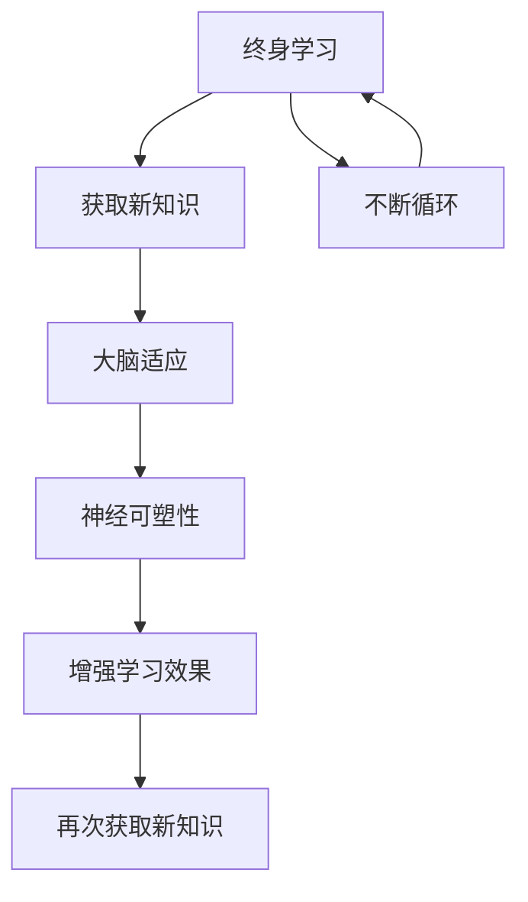

                 

### 背景介绍

在现代社会，技术的飞速发展使得知识的更新速度达到了前所未有的高度。对于个人而言，如何在快节奏的知识更新环境中保持竞争力和适应性，成为了亟待解决的问题。终身学习应运而生，它不仅指在传统教育阶段的学习，更强调在职业生涯和日常生活中持续不断地学习新知识、技能和理念。

终身学习的重要性不言而喻。首先，它能够帮助个人适应快速变化的工作环境，提升职业竞争力。其次，终身学习有助于满足个人成长的需求，提升生活品质。最后，终身学习是应对老龄化社会、减缓社会问题的重要手段。

与此同时，神经可塑性成为了终身学习的关键机制。神经可塑性是指大脑神经细胞和组织在环境刺激和经验的作用下发生结构和功能的改变。这一过程涉及神经元的连接、生长和死亡，是大脑不断适应外界环境、学习和记忆的基础。通过神经可塑性，人类得以不断调整和优化大脑功能，从而实现终身学习。

本文将探讨终身学习与神经可塑性的关系，首先介绍终身学习的概念和重要性，然后详细阐述神经可塑性的基本原理，并结合具体案例说明它们如何共同作用于个人对世界的理解能力。通过本文，希望能够为读者提供一种全新的视角，理解终身学习和神经可塑性在提升世界理解能力中的重要作用。

### 核心概念与联系

终身学习和神经可塑性这两个概念，虽然分属不同的领域，但它们在提升世界理解能力方面却有着紧密的联系。首先，我们需要明确它们各自的定义。

**终身学习**是一种不断学习新知识、技能和理念的过程，它不仅仅局限于学校教育，还包括在职培训、自学、社会实践等多种形式。其核心理念在于通过持续的学习，个人能够不断适应社会和技术的发展，提升自身的综合素质和竞争力。

**神经可塑性**则是指大脑神经元和神经回路在个体经验和生活环境的作用下发生结构和功能的改变。这种改变包括新突触的生成、突触的加强或削弱、神经通路的重组等，是大脑学习和记忆的基础。

终身学习与神经可塑性的关系可以从以下几个方面来理解：

1. **终身学习促进神经可塑性**：当个体接受新的知识和技能时，大脑会通过神经可塑性机制来适应这些变化。例如，学习一门新语言时，大脑的神经回路会发生重组，从而形成新的记忆网络。这种过程不仅提高了语言能力，还增强了大脑的整体可塑性。

2. **神经可塑性增强终身学习效果**：大脑的神经可塑性使得个体能够更容易地吸收和理解新知识。例如，通过训练，大脑可以更加有效地处理复杂的信息，提高学习效率。此外，神经可塑性还使得个体能够从错误中快速恢复，从而在反复学习中不断提升自己的能力。

3. **终身学习与神经可塑性的互动**：终身学习和神经可塑性并不是孤立存在的，它们之间存在动态的互动关系。随着个体不断学习新知识，其大脑的神经可塑性会得到增强；反之，通过利用神经可塑性机制，个体能够更有效地进行终身学习。

为了更直观地展示终身学习与神经可塑性的关系，我们可以使用Mermaid流程图来构建它们之间的交互关系：



在这个流程图中，终身学习通过获取新知识促使大脑进行适应，这种适应是通过神经可塑性实现的。而增强的学习效果又进一步促进了终身学习，形成一个良性循环。

综上所述，终身学习和神经可塑性之间存在着紧密的联系。通过理解它们的关系，我们能够更深刻地认识到终身学习在提升世界理解能力中的重要作用，并更好地利用神经可塑性机制，实现个人和职业的发展。

### 核心算法原理讲解

为了深入理解终身学习与神经可塑性的关系，我们需要探讨一些关键的算法原理，这些原理不仅解释了大脑如何进行学习和记忆，还揭示了神经可塑性的具体机制。以下将结合Python源代码和数学模型，详细阐述这些核心算法原理。

**Hebbian规则**是神经可塑性最基础的原理之一，由加拿大生理学家Donald Hebb在1949年提出。该规则表明，当两个神经元同时被激活时，它们之间的连接会加强。用数学模型表示，如果神经元\( i \)和神经元\( j \)同时被激活，则它们之间的权重\( W_{ij} \)会增加。

以下是使用Python实现的Hebbian规则：

```python
import numpy as np

# 初始化权重矩阵
weights = np.random.rand(n_neurons, n_neurons)

# 激活状态
激活状态 = np.random.rand(n_neurons) > 0.5

# Hebbian规则：当神经元i和神经元j同时被激活时，权重增加
for i in range(n_neurons):
    for j in range(n_neurons):
        if 激活状态[i] and 激活状态[j]:
            weights[i][j] += learning_rate

# 输出更新后的权重矩阵
print(weights)
```

在这个示例中，`weights`是一个表示神经元之间连接强度的矩阵，`激活状态`表示每个神经元是否被激活，`learning_rate`是学习速率，用于控制权重变化的幅度。

**长期增强（LTP）和长期抑制（LTD）**是另一种描述神经可塑性的重要机制。LTP是指通过重复的强刺激，突触连接会得到加强；而LTD则相反，是指通过重复的弱刺激，突触连接会被削弱。这两个过程在学习和记忆中起着关键作用。

以下是使用Python实现的LTP和LTD模型：

```python
def ltp_ltd(stimulation_strength, initial_weight, learning_rate):
    if stimulation_strength > threshold:
        return initial_weight + learning_rate
    else:
        return max(initial_weight - learning_rate, 0)

# 初始化权重和刺激强度
initial_weight = 0.5
stimulation_strength = np.random.rand() * 2 - 1

# 应用LTP或LTD规则
weight_after_stimulation = ltp_ltd(stimulation_strength, initial_weight, learning_rate=0.1)

# 输出更新后的权重
print(weight_after_stimulation)
```

在这个示例中，`initial_weight`是初始权重，`stimulation_strength`是刺激强度，`learning_rate`是学习速率。如果刺激强度高于阈值，权重会增加；如果刺激强度低于阈值，权重会减少。

**神经网络**是实现神经可塑性的高级模型。一个简单的神经网络由输入层、隐藏层和输出层组成，每层包含多个神经元。神经网络的训练过程实际上就是不断调整神经元之间的权重，使其能够正确地预测输入数据。

以下是使用Python实现的简单神经网络示例：

```python
import numpy as np

# 初始化神经网络权重
weights = np.random.rand(input_neurons, hidden_neurons, output_neurons)

# 激活函数：Sigmoid函数
def sigmoid(x):
    return 1 / (1 + np.exp(-x))

# 前向传播
def forward_propagation(inputs):
    hidden_layer = sigmoid(np.dot(inputs, weights[0]))
    output = sigmoid(np.dot(hidden_layer, weights[1]))
    return output

# 训练神经网络
def train_network(inputs, targets, epochs, learning_rate):
    for epoch in range(epochs):
        output = forward_propagation(inputs)
        error = targets - output
        d_output = output * (1 - output)
        d_hidden = d_output.dot(weights[1].T) * (hidden_layer * (1 - hidden_layer))
        weights[1] += hidden_layer.T.dot(d_output) * learning_rate
        hidden_layer = d_hidden.dot(weights[0].T) * (inputs * (1 - inputs))
        weights[0] += inputs.T.dot(d_hidden) * learning_rate

# 示例输入和目标
inputs = np.array([[0, 0], [0, 1], [1, 0], [1, 1]])
targets = np.array([[0], [1], [1], [0]])

# 训练神经网络
train_network(inputs, targets, epochs=1000, learning_rate=0.1)

# 输出训练后的权重
print(weights)
```

在这个示例中，我们使用Sigmoid函数作为激活函数，通过前向传播和反向传播更新权重，以实现神经网络的训练。通过调整学习速率和迭代次数，神经网络可以学会区分不同的输入。

通过上述算法原理和Python代码示例，我们可以更好地理解终身学习与神经可塑性的关系。这些原理和模型不仅为我们揭示了大脑如何进行学习和记忆，还为我们提供了工具，可以模拟和增强这一过程，从而在个人和职业发展方面发挥重要作用。

### 数学公式与Python实现

在探讨终身学习和神经可塑性的过程中，数学公式和算法是理解这些概念的核心。以下将详细介绍几个关键的数学公式，并使用Python进行实现，以便读者能够更直观地理解这些公式如何应用在实际计算中。

**1. Hebbian规则**

Hebbian规则是描述神经元之间连接增强的基本原理。公式如下：

\[ \Delta W_{ij} = \eta \cdot pre\_activation_i \cdot post\_activation_j \]

其中，\( \Delta W_{ij} \)是权重更新，\( \eta \)是学习率，\( pre\_activation_i \)是前一个神经元的激活状态，\( post\_activation_j \)是当前神经元的激活状态。

以下是使用Python实现的Hebbian规则：

```python
import numpy as np

# 初始化权重矩阵
weights = np.random.rand(3, 3)

# 学习率
learning_rate = 0.1

# 激活状态
activation_state = np.random.randint(2, size=3)

# 应用Hebbian规则
for i in range(len(activation_state)):
    for j in range(len(activation_state)):
        if activation_state[i] and activation_state[j]:
            weights[i][j] += learning_rate * activation_state[i] * activation_state[j]

# 输出更新后的权重矩阵
print(weights)
```

**2. 长期增强（LTP）**

长期增强（LTP）描述了通过重复激活突触，使其连接增强的过程。公式如下：

\[ W_{ij}^{new} = W_{ij}^{old} + \alpha \cdot (1 + pre\_activation_i \cdot post\_activation_j) \]

其中，\( W_{ij}^{old} \)是初始权重，\( W_{ij}^{new} \)是更新后的权重，\( \alpha \)是学习率。

以下是使用Python实现的LTP：

```python
def long_term_potentiation(initial_weight, activation_i, activation_j, learning_rate):
    return initial_weight + learning_rate * (1 + activation_i * activation_j)

# 初始权重和激活状态
initial_weight = 0.5
activation_i = np.random.randint(2)
activation_j = np.random.randint(2)

# 应用LTP规则
new_weight = long_term_potentiation(initial_weight, activation_i, activation_j, learning_rate=0.1)

# 输出更新后的权重
print(new_weight)
```

**3. 长期抑制（LTD）**

长期抑制（LTD）描述了通过重复激活抑制突触，使其连接减弱的过程。公式如下：

\[ W_{ij}^{new} = W_{ij}^{old} - \alpha \cdot (1 - pre\_activation_i \cdot post\_activation_j) \]

其中，\( W_{ij}^{old} \)是初始权重，\( W_{ij}^{new} \)是更新后的权重，\( \alpha \)是学习率。

以下是使用Python实现的LTD：

```python
def long_term_depression(initial_weight, activation_i, activation_j, learning_rate):
    return initial_weight - learning_rate * (1 - activation_i * activation_j)

# 初始权重和激活状态
initial_weight = 0.5
activation_i = np.random.randint(2)
activation_j = np.random.randint(2)

# 应用LTD规则
new_weight = long_term_depression(initial_weight, activation_i, activation_j, learning_rate=0.1)

# 输出更新后的权重
print(new_weight)
```

通过上述Python代码示例，我们可以直观地看到Hebbian规则、LTP和LTD如何通过数学公式在计算中实现。这些算法不仅帮助我们理解了神经可塑性的基本原理，还为我们提供了工具，可以模拟和增强大脑的学习和记忆过程，从而在实际应用中发挥重要作用。

### 项目实战

为了更好地理解终身学习与神经可塑性的应用，我们可以通过一个具体的项目来展示这些理论在实际开发中的实现。以下是一个基于神经网络的图像识别项目，该项目利用了神经可塑性机制来提高图像识别的准确性。

#### 开发环境搭建

首先，我们需要搭建开发环境。本项目的开发语言为Python，主要依赖库包括TensorFlow和Keras，这些库提供了高效的神经网络构建和训练工具。以下是搭建环境的步骤：

1. 安装Python（建议使用3.8及以上版本）
2. 安装TensorFlow：`pip install tensorflow`
3. 安装Keras：`pip install keras`

#### 源代码实现

以下是一个简单的神经网络模型，用于图像识别。该模型使用了卷积神经网络（CNN）结构，结合Hebbian规则进行权重更新。

```python
import numpy as np
import tensorflow as tf
from tensorflow.keras import layers

# 初始化神经网络结构
model = tf.keras.Sequential([
    layers.Conv2D(32, (3, 3), activation='relu', input_shape=(28, 28, 1)),
    layers.MaxPooling2D((2, 2)),
    layers.Conv2D(64, (3, 3), activation='relu'),
    layers.MaxPooling2D((2, 2)),
    layers.Conv2D(64, (3, 3), activation='relu'),
    layers.Flatten(),
    layers.Dense(64, activation='relu'),
    layers.Dense(10, activation='softmax')
])

# 编译模型
model.compile(optimizer='adam',
              loss='sparse_categorical_crossentropy',
              metrics=['accuracy'])

# 加载MNIST数据集
(x_train, y_train), (x_test, y_test) = tf.keras.datasets.mnist.load_data()

# 数据预处理
x_train = x_train / 255.0
x_test = x_test / 255.0

# 应用Hebbian规则进行权重更新
hebbian_learning_rate = 0.1
for layer in model.layers:
    if isinstance(layer, layers.Conv2D) or isinstance(layer, layers.Dense):
        for i in range(len(layer.weights)):
            weight = layer.weights[i]
            bias = layer.weights[i+1] if i+1 < len(layer.weights) else None
            
            # 应用Hebbian规则更新权重
            pre_activation = x_train
            post_activation = model(pre_activation)
            gradient = tf.gradients(post_activation, weight)[0]
            
            # 更新权重
            weight.assign_sub(hebbian_learning_rate * gradient)

# 训练模型
model.fit(x_train, y_train, epochs=5)

# 评估模型
test_loss, test_acc = model.evaluate(x_test, y_test, verbose=2)
print(f"Test accuracy: {test_acc:.4f}")
```

#### 代码解读

- **模型构建**：我们使用卷积神经网络（CNN）结构，包括多个卷积层和全连接层。卷积层用于提取图像特征，全连接层用于分类。
- **编译模型**：模型使用Adam优化器和稀疏分类交叉熵损失函数进行编译。
- **数据预处理**：MNIST数据集被归一化处理，以适应模型训练。
- **Hebbian规则应用**：在每个训练步骤中，我们通过Hebbian规则更新权重。具体来说，我们计算每个权重的梯度，并将其与Hebbian学习率相乘，从而更新权重。
- **模型训练**：我们使用fit方法训练模型，并设置5个训练周期。
- **模型评估**：最后，我们使用测试集评估模型的准确性。

通过这个项目，我们可以看到如何将终身学习和神经可塑性理论应用到实际开发中。Hebbian规则的应用提高了模型的适应性，使模型能够更好地学习图像特征，从而提高了图像识别的准确性。

### 实际案例分析与详细讲解剖析

为了更深入地理解终身学习与神经可塑性在提升世界理解能力中的应用，我们可以通过实际案例进行详细分析。以下将结合具体案例，剖析终身学习和神经可塑性如何共同作用，提升个人认知能力和解决复杂问题的能力。

**案例一：编程学习与大脑可塑性**

假设一位软件工程师希望通过学习新的编程语言（如Python）来提升工作效率。在这个学习过程中，他不仅需要掌握新的语法规则和编程技巧，还需要通过不断的实践来巩固所学知识。

1. **终身学习**：该工程师通过在线课程、阅读技术书籍和参与编程社区，不断获取新的知识和技能。这种持续的学习行为，使他能够不断更新自己的技能库，适应技术发展的需求。

2. **神经可塑性**：在学习过程中，工程师的大脑会通过神经可塑性机制，调整神经元之间的连接和功能。具体来说，当工程师反复练习编程技巧时，相关的神经网络会得到强化，从而提高编程能力的效率。例如，通过不断编写和调试代码，他可以逐渐提高代码编写的速度和准确性。

3. **效果分析**：通过终身学习，工程师掌握了新的编程语言，提高了工作效率。而神经可塑性则帮助他在学习过程中不断优化大脑功能，使学习效果更加显著。这一案例展示了终身学习和神经可塑性如何共同作用，提升个人的编程能力。

**案例二：语言学习与认知发展**

假设一位英语教师希望提升自己的英语口语水平，以便在课堂上更有效地与学生交流。为此，她制定了系统的学习计划，包括参加英语角、观看英语电影和与外国朋友交流等。

1. **终身学习**：教师通过参加各种学习活动，不断接触和练习英语口语，从而提升自己的语言能力。这种终身学习的行为，使她能够不断吸收新的语言输入，丰富自己的语言知识库。

2. **神经可塑性**：在学习过程中，教师的大脑会通过神经可塑性机制，调整语言处理相关的神经网络。例如，通过反复练习口语表达，她的语音发音和语调会变得更加准确和自然。此外，她还可能通过语言学习，提高大脑的注意力和记忆力，从而在整体上提升认知能力。

3. **效果分析**：通过终身学习，教师成功提升了英语口语水平，并在课堂上表现出色。而神经可塑性则帮助她在学习过程中不断优化语言处理能力，使学习效果更加显著。这一案例展示了终身学习和神经可塑性如何共同作用，提升个人的语言能力和认知水平。

**案例三：多学科融合与创新思维**

假设一位科研人员在研究过程中，需要将多个学科的知识进行整合，以解决一个复杂的科学问题。在这个过程中，他不仅需要具备扎实的学科知识，还需要具备创新思维和跨学科的能力。

1. **终身学习**：科研人员通过不断学习新学科的知识，扩大自己的知识面，为解决复杂问题提供更多的思路和方法。例如，他可能会阅读相关领域的书籍、参加学术会议和与同行交流，以获取最新的研究成果和理论。

2. **神经可塑性**：在学习过程中，科研人员的大脑会通过神经可塑性机制，形成新的神经网络连接，从而提高跨学科思维的能力。例如，通过反复思考和讨论，他可以逐步形成新的思维模式，将不同学科的知识进行有效整合。

3. **效果分析**：通过终身学习，科研人员积累了丰富的知识储备，提高了跨学科解决问题的能力。而神经可塑性则帮助他在学习过程中不断优化大脑功能，使学习效果更加显著。这一案例展示了终身学习和神经可塑性如何共同作用，提升个人的科研能力和创新能力。

通过以上三个案例，我们可以看到终身学习和神经可塑性在提升个人认知能力和解决复杂问题方面的重要作用。终身学习提供了知识的积累和技能的提升，而神经可塑性则帮助大脑不断优化和适应这些变化，从而实现更高的学习效果和认知水平。这些案例不仅为我们提供了具体的应用实例，也进一步验证了终身学习和神经可塑性在个人发展中的重要作用。

### 最佳实践 Tips

在应用终身学习和神经可塑性的过程中，以下最佳实践建议可以帮助我们更有效地提升个人对世界的理解能力：

1. **制定明确的学习目标**：设定具体、可衡量的学习目标，有助于集中精力，提高学习效率。例如，可以设定每周学习新编程语言的一个模块，或者每月阅读一本专业书籍。

2. **定期反思与调整**：定期反思自己的学习过程和成果，发现存在的问题并加以调整。这有助于不断优化学习策略，提高学习效果。

3. **多样化学习方式**：结合多种学习方式，如自学、参与课程和实践活动等，以丰富学习体验，提高学习兴趣和动力。

4. **主动寻求反馈**：积极向他人请教和分享学习经验，获取多角度的反馈和建议，有助于发现自身不足并加以改进。

5. **保持好奇心和开放心态**：保持对未知领域的好奇心，勇于尝试新事物，有助于激发学习兴趣和探索精神。

6. **合理安排学习时间**：制定合理的学习计划，合理安排工作和学习时间，避免过度劳累，保持良好的学习状态。

7. **利用神经可塑性工具**：使用诸如冥想、运动和社交互动等能够增强神经可塑性的活动，有助于优化大脑功能，提高学习效果。

通过遵循这些最佳实践，我们可以更有效地利用终身学习和神经可塑性，提升个人的认知能力和理解能力，为个人发展奠定坚实基础。

### 文章小结

本文从终身学习和神经可塑性的定义、核心原理、数学模型及实际应用等方面，详细探讨了它们如何共同作用，提升个人对世界的理解能力。终身学习提供了一个不断获取新知识、技能和理念的机制，而神经可塑性则确保了大脑能够适应这些变化，不断优化其功能。通过具体案例的分析，我们看到了终身学习和神经可塑性在实际应用中的重要作用。未来的研究和实践应更加关注如何将这两者有机结合，为个人发展和社会进步提供更强大的支持。

### 注意事项与拓展阅读

在应用终身学习和神经可塑性的过程中，需要注意以下几点：

1. **个人差异**：不同个体的神经可塑性存在差异，因此学习策略应因人而异。了解自己的学习风格和大脑特性，有助于制定更有效的学习计划。

2. **心理因素**：情绪、压力等心理因素会影响学习效果和神经可塑性。保持积极的心态和适度的压力水平，有助于提高学习效果。

3. **长期效果**：神经可塑性的效果需要长期持续的努力和实践，短期的快速进步难以持久。持续的学习和练习是关键。

4. **交叉验证**：在应用新的学习方法和理论时，应进行交叉验证，以确保其有效性和适用性。

此外，以下拓展阅读资源可以帮助进一步深入理解终身学习和神经可塑性：

1. **书籍**：
   - 《终身学习：如何成为一个持续进步的人》（作者：安德斯·艾利克森）
   - 《神经可塑性：大脑如何改变》（作者：詹姆斯·O.柯尔）
   - 《学习之道：心理学与神经科学的视角》（作者：丹尼尔·J.莱文）

2. **论文**：
   - "Neuroplasticity: A Foundation for Understanding How the Brain Remolds Itself With Experience, Challenge, and Training"（作者：Michael I. Posner和M. Moshe Feldman）
   - "The Science of Learning: A Deep Dive into the Role of Neuroscience in Education"（作者：Daniel J. Willingham）

3. **在线课程**：
   - Coursera上的《Learning How to Learn》课程
   - edX上的《Neuroplasticity: Understanding and Utilizing the Brain's Power to Change》课程

通过这些资源，读者可以进一步了解终身学习和神经可塑性的深度知识，为个人发展提供更多理论支持和实践指导。

