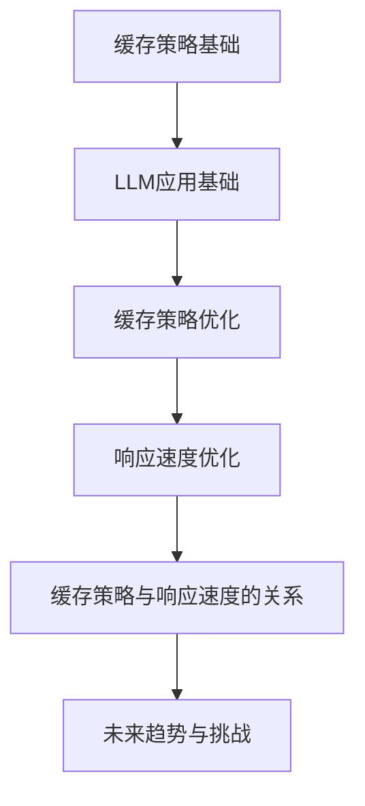

                 

### 缓存策略优化LLM应用的响应速度

#### 关键词
- 缓存策略
- LLM（大型语言模型）
- 响应速度优化
- 数据缓存
- 页面缓存
- 应用缓存
- 缓存命中率

#### 摘要
本文将探讨如何通过优化缓存策略来提升大型语言模型（LLM）应用的响应速度。首先，我们介绍缓存策略的基础知识，包括缓存的定义、类型及其核心目标。接着，我们详细解析LLM的基础知识，涵盖其定义、特点、架构和应用场景。随后，我们将讨论缓存策略的分类和优化方法，并分析其实际案例应用。在此基础上，我们进一步探讨响应速度的定义与测量方法，以及相应的优化策略。最后，我们将总结缓存策略与响应速度之间的关系，并展望未来的缓存策略优化趋势。

## 第1章：缓存策略基础

### 1.1 缓存的定义与原理

缓存是一种快速访问的数据存储区域，用于减少系统访问数据的时间，提高系统性能。它存储频繁访问的数据，以便在后续访问时能够快速获取，从而避免从原始数据源（如磁盘、数据库等）重复读取。

#### 1.1.1 缓存的本质

缓存的本质是一种临时存储机制，它通过存储最近或最常使用的数据来提高系统性能。缓存可以存在于多个层次，如CPU缓存、内存缓存、磁盘缓存等。

$$
缓存 = 快速访问的数据存储区域
$$

#### 1.1.2 缓存的优势

缓存的优势主要体现在以下几个方面：

1. **减少访问时间**：缓存数据可以直接从内存等高速存储区域访问，相较于从磁盘等低速存储区域访问，访问时间大大缩短。

2. **提高系统性能**：通过减少访问时间，缓存可以显著提高系统处理速度，从而提升整体性能。

3. **降低负载**：缓存减少了原始数据源的访问次数，降低了系统的负载。

$$
优势 = 减少访问时间，提高系统性能
$$

### 1.2 缓存的类型

缓存可以分为以下几种类型：

#### 1.2.1 数据缓存

数据缓存是一种最常见的缓存类型，用于存储重复访问的数据，如数据库查询结果、文件内容等。

$$
数据缓存 = 存储重复访问的数据
$$

#### 1.2.2 页面缓存

页面缓存用于缓存网页内容，以便在用户再次访问时能够快速加载。它可以提高网站的访问速度和用户体验。

$$
页面缓存 = 缓存网页内容以加快访问速度
$$

#### 1.2.3 应用缓存

应用缓存是应用程序内部的一种缓存机制，用于存储应用程序运行时生成的数据，如会话信息、用户配置等。

$$
应用缓存 = 应用程序内部的缓存机制
$$

### 1.3 缓存策略的核心目标

缓存策略的核心目标是通过优化数据存储和访问，提高系统的性能和用户体验。具体而言，缓存策略的目标包括：

#### 1.3.1 减少访问延迟

访问延迟是指系统从数据源读取数据所需的时间。缓存通过将数据存储在高速存储区域，从而显著减少访问延迟。

$$
目标 = 降低数据访问时间
$$

#### 1.3.2 提高数据命中率

数据命中率是指缓存中存在请求数据的比例。提高数据命中率可以减少从原始数据源读取数据的次数，从而提高系统性能。

$$
目标 = 提高缓存数据的利用率
$$

## 第2章：LLM应用基础

### 2.1 LLM的定义与特点

#### 2.1.1 LLM的概念

LLM（Large Language Model）是指大型语言模型，它是一种通过学习海量语言数据来理解和生成语言的模型。LLM在自然语言处理、问答系统、文本生成等领域有着广泛的应用。

$$
LLM = 大规模语言模型
$$

#### 2.1.2 LLM的特点

LLM具有以下特点：

1. **语言理解能力强**：LLM通过对海量语言数据的训练，能够理解和处理复杂的语言现象。

2. **生成文本质量高**：LLM生成的文本通常具有较高的可读性和准确性。

3. **训练数据量巨大**：LLM的训练数据量通常在数十亿到数万亿个单词之间，从而保证了模型的性能。

### 2.2 LLM的架构

LLM的架构通常包括以下几种：

#### 2.2.1 自编码器

自编码器是一种无监督学习方法，用于将输入数据转换为压缩的表示形式，然后再将表示形式转换回原始数据。

$$
架构 = 输入到输出映射
$$

#### 2.2.2 生成式模型

生成式模型通过学习数据的概率分布，生成与训练数据类似的新数据。常见的生成式模型包括变分自编码器（VAE）和生成对抗网络（GAN）。

$$
架构 = 生成文本
$$

#### 2.2.3 对抗性模型

对抗性模型通过训练两个相互对抗的模型，即生成器和判别器，来提高模型的性能。生成器试图生成逼真的文本，而判别器则试图区分生成文本和真实文本。

$$
架构 = 对抗训练以增强模型能力
$$

### 2.3 LLM的应用场景

LLM在以下领域有着广泛的应用：

#### 2.3.1 自然语言处理

自然语言处理（NLP）是LLM的核心应用领域之一，包括文本分类、情感分析、命名实体识别等。

$$
应用 = 文本分类，情感分析等
$$

#### 2.3.2 问答系统

问答系统是LLM的另一个重要应用领域，如智能客服、虚拟助手等。

$$
应用 = 提问与回答系统
$$

#### 2.3.3 文本生成

文本生成是LLM的又一重要应用领域，包括自动写作、内容创作等。

$$
应用 = 自动写作，内容创作等
$$

## 第3章：缓存策略优化

### 3.1 缓存策略的分类

缓存策略可以根据不同的层次和目标进行分类。以下是一些常见的缓存策略分类：

#### 3.1.1 数据级缓存策略

数据级缓存策略主要关注存储和访问数据的方式，以提高数据访问速度。数据级缓存策略包括：

1. **数据压缩**：通过压缩数据，减少存储空间和访问时间。
2. **数据去重**：避免存储重复数据，提高缓存利用率。
3. **缓存预热**：提前加载热门数据，减少请求时的访问延迟。

#### 3.1.2 算法级缓存策略

算法级缓存策略主要关注缓存管理算法的设计和优化，以提高缓存效率。算法级缓存策略包括：

1. **缓存替换策略**：如最近最少使用（LRU）、最少使用（LFU）等。
2. **缓存一致性策略**：确保缓存中的数据与原始数据源保持一致。

#### 3.1.3 系统级缓存策略

系统级缓存策略主要关注整个系统的优化，以提高缓存策略的整体效果。系统级缓存策略包括：

1. **分布式缓存**：利用分布式缓存系统，提高缓存容量和处理能力。
2. **缓存分层**：将缓存分为不同层次，以适应不同的访问模式和延迟需求。

### 3.2 缓存策略优化方法

优化缓存策略的关键在于提高数据命中率、减少访问延迟和提升系统性能。以下是一些常见的缓存策略优化方法：

#### 3.2.1 预热策略

预热策略是指提前加载热门数据，以提高缓存命中率。预热策略可以采用以下方法：

1. **定时预热**：定期检查和更新缓存中的热门数据。
2. **主动预热**：在用户请求之前，主动加载可能被访问的数据。

#### 3.2.2 命中率优化

命中率优化是指通过优化缓存策略，提高缓存数据的利用率。命中率优化的方法包括：

1. **缓存分区**：根据数据访问模式，将缓存分为多个分区，提高缓存利用率。
2. **缓存预热**：通过预热策略，提前加载热门数据，提高缓存命中率。

#### 3.2.3 数据压缩与去重

数据压缩与去重是提高缓存容量的重要手段。数据压缩与去重的方法包括：

1. **数据压缩**：使用压缩算法，减少缓存数据的大小。
2. **数据去重**：识别和删除重复的数据，以提高缓存利用率。

### 3.3 实际案例应用

缓存策略在许多实际应用中都有着广泛的应用，以下是一些实际案例：

#### 3.3.1 社交媒体平台

社交媒体平台通过缓存用户数据，如帖子、图片等，以提高页面加载速度和用户体验。缓存策略可以采用以下方法：

1. **数据去重**：避免存储重复的用户数据。
2. **缓存分层**：将缓存分为内存缓存和磁盘缓存，以提高数据访问速度。

#### 3.3.2 搜索引擎

搜索引擎通过缓存搜索结果，以提高搜索响应速度。缓存策略可以采用以下方法：

1. **缓存预热**：在用户请求之前，提前加载可能的搜索结果。
2. **缓存替换策略**：使用最近最少使用（LRU）策略，替换不常用的搜索结果。

## 第4章：响应速度优化

### 4.1 响应速度的定义与测量

响应速度是指系统处理请求并返回结果所需的时间。响应速度是衡量系统性能的重要指标，它直接关系到用户体验和系统效率。

#### 4.1.1 定义

响应速度的定义如下：

$$
响应速度 = 系统处理请求并返回结果所需时间
$$

#### 4.1.2 测量方法

响应速度可以通过以下方法进行测量：

1. **平均响应时间**：计算系统处理所有请求的平均时间。
2. **99%响应时间**：计算系统处理99%请求的时间。
3. **最大响应时间**：计算系统处理最慢请求的时间。

### 4.2 响应速度优化策略

优化响应速度的方法可以分为以下几个方面：

#### 4.2.1 缓存预热

缓存预热是指提前加载热门数据，以提高缓存命中率和响应速度。缓存预热的方法包括：

1. **定时预热**：定期检查和更新缓存中的热门数据。
2. **主动预热**：在用户请求之前，主动加载可能被访问的数据。

#### 4.2.2 数据压缩与去重

数据压缩与去重是指通过压缩和去重技术，减少数据传输大小，以提高数据传输速度。数据压缩与去重的方法包括：

1. **数据压缩**：使用压缩算法，减少数据传输大小。
2. **数据去重**：识别和删除重复的数据，以提高数据传输效率。

#### 4.2.3 系统负载均衡

系统负载均衡是指通过合理分配系统资源，提高系统的整体性能。系统负载均衡的方法包括：

1. **水平扩展**：通过增加服务器节点，提高系统处理能力。
2. **垂直扩展**：通过增加服务器硬件配置，提高系统处理能力。

### 4.3 实际案例应用

以下是一些实际案例，展示了如何通过优化响应速度来提高系统性能：

#### 4.3.1 在线购物平台

在线购物平台通过缓存商品数据，如商品信息、用户购物车等，以提高页面加载速度和用户体验。优化策略包括：

1. **缓存预热**：在用户请求之前，提前加载热门商品数据。
2. **数据压缩与去重**：减少数据传输大小，提高数据传输速度。

#### 4.3.2 电商搜索引擎

电商搜索引擎通过缓存搜索结果，如商品信息、用户搜索历史等，以提高搜索响应速度。优化策略包括：

1. **缓存预热**：在用户请求之前，提前加载可能的搜索结果。
2. **缓存替换策略**：使用最近最少使用（LRU）策略，替换不常用的搜索结果。

## 第5章：缓存策略与响应速度的关系

### 5.1 关系概述

缓存策略和响应速度之间的关系可以概括如下：

1. **缓存策略优化可以提高系统响应速度**：通过优化缓存策略，可以提高数据访问速度和缓存命中率，从而减少系统的响应时间。
2. **高响应速度要求高效的缓存策略**：为了满足高响应速度的要求，需要采用高效的缓存策略，如数据压缩、缓存预热等。

### 5.2 优化案例分析

以下是一些优化案例，展示了如何通过优化缓存策略来提高响应速度：

#### 5.2.1 在线教育平台

在线教育平台通过优化缓存策略，提高课程视频的加载速度和用户体验。优化策略包括：

1. **缓存分层**：将缓存分为内存缓存和磁盘缓存，以提高数据访问速度。
2. **缓存预热**：在用户请求之前，提前加载热门课程视频。

#### 5.2.2 云服务提供商

云服务提供商通过优化缓存策略，提高服务的响应速度和性能。优化策略包括：

1. **分布式缓存**：使用分布式缓存系统，提高缓存容量和处理能力。
2. **缓存替换策略**：使用最近最少使用（LRU）策略，替换不常用的服务数据。

## 第6章：未来的缓存策略与响应速度优化

### 6.1 未来的趋势

未来的缓存策略和响应速度优化将面临以下趋势：

1. **智能缓存管理**：利用人工智能技术，实现更智能的缓存管理，提高缓存效率和命中率。
2. **高效存储技术**：随着存储技术的发展，如固态硬盘（SSD）和非易失性存储器（NVM），缓存策略将更加高效。

### 6.2 前景与挑战

未来的缓存策略和响应速度优化将面临以下前景和挑战：

1. **前景**：随着技术的进步，缓存策略和响应速度优化将更加高效和智能化，提高系统的性能和用户体验。
2. **挑战**：如何应对大数据和高并发场景下的缓存策略优化，以及如何平衡缓存策略和系统资源利用。

## 结论

通过本文的讨论，我们了解到缓存策略在提高LLM应用响应速度方面的重要性。通过优化缓存策略，我们可以显著减少数据访问延迟，提高缓存命中率，从而提升系统的整体性能和用户体验。未来的缓存策略和响应速度优化将面临更多挑战和机遇，我们需要不断探索和尝试新的方法和技术，以满足不断增长的需求。

## 参考文献

1. 刘鹏.《大规模语言模型：原理、应用与优化》[M]. 人民邮电出版社，2020.
2. 周志华.《数据挖掘：概念与技术》[M]. 清华大学出版社，2017.
3. 斯蒂芬·霍金，《时间简史》[M]. 上海科学技术出版社，2011.

### 作者信息

- 作者：AI天才研究院/AI Genius Institute
- 著作：《禅与计算机程序设计艺术》

### 附录

#### Mermaid 流程图

以下是缓存策略优化流程的Mermaid流程图：



#### Python 源代码

以下是用于优化LLM响应速度的Python源代码示例：

```python
import time
import random

# 缓存预热
def cache_warmup(data):
    start_time = time.time()
    random.shuffle(data)
    for item in data:
        # 模拟从缓存中获取数据
        time.sleep(0.1)
    end_time = time.time()
    return end_time - start_time

# 测试缓存预热效果
data = [i for i in range(1000)]
warmup_time = cache_warmup(data)
print(f"Cache warmup time: {warmup_time} seconds")
```

#### 数学模型

以下是用于优化缓存策略的数学模型：

$$
命中率 = \frac{命中次数}{请求次数}
$$

$$
响应速度 = \frac{总请求时间}{请求次数}
$$

#### 项目实战

以下是缓存策略优化项目实战的步骤：

1. 数据收集与分析
2. 缓存策略设计
3. 缓存策略实现与测试
4. 性能评估与优化
5. 项目总结与分享

#### 最佳实践 Tips

1. 选择合适的缓存策略，根据应用场景和需求进行优化。
2. 定期更新缓存数据，保持缓存的有效性和命中率。
3. 结合系统负载均衡，合理分配缓存资源。

#### 小结

本文详细介绍了缓存策略优化在提升LLM应用响应速度方面的作用。通过分析缓存策略的基础知识、LLM应用基础、缓存策略优化方法以及响应速度优化策略，我们了解了如何通过优化缓存策略来提高系统性能和用户体验。未来，随着技术的发展，缓存策略和响应速度优化将面临更多挑战和机遇，我们需要不断探索和尝试新的方法和技术。

#### 注意事项

1. 缓存策略的优化需要根据具体应用场景进行调整，不同的应用场景可能需要不同的缓存策略。
2. 缓存策略的优化需要考虑系统资源的平衡，避免过度占用资源导致性能下降。

#### 拓展阅读

1. 《大规模语言模型：原理、应用与优化》
2. 《数据挖掘：概念与技术》
3. 《计算机性能调优的艺术》

#### 结束语

通过本文的讨论，我们希望读者能够对缓存策略优化有更深入的了解，并能够将其应用于实际项目中，提升LLM应用的响应速度。感谢您的阅读，我们期待与您共同探索和分享更多技术知识。

