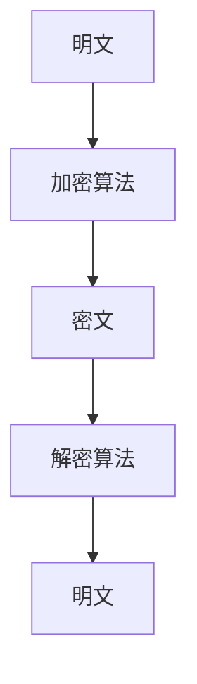
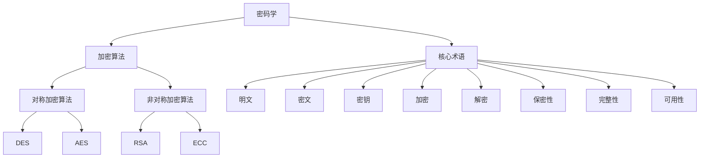
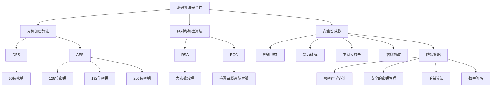
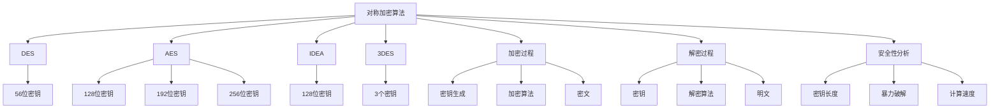
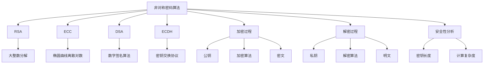
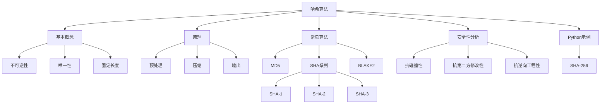
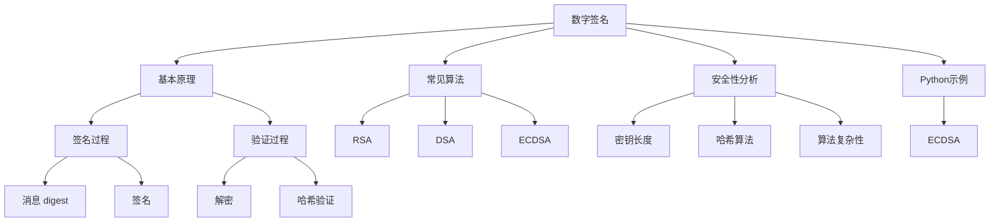
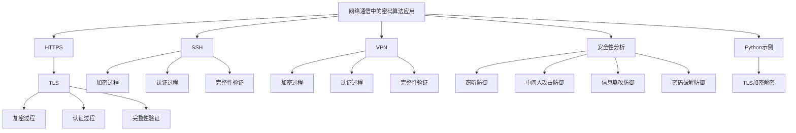
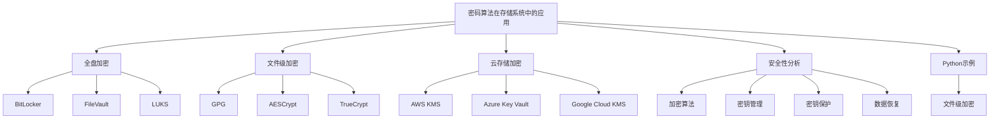
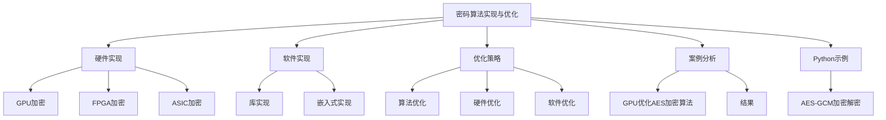

                 

### 密码学基础

#### 1.1.1 密码学的定义与目标

密码学（Cryptography），是一门研究如何安全地传输信息的科学。其核心目标是通过加密技术，将信息（明文）转换为只有授权方才能解读的密文，从而防止未授权方获取和篡改信息。

- **加密算法**：一种将明文转换为密文的算法，通常由密钥（Key）控制。
- **解密算法**：一种将密文转换为明文的算法，也需要密钥的支持。

在加密和解密过程中，密钥起到了至关重要的作用。密钥的选择和保密直接决定了密码系统的安全性。

加密算法的数学模型通常可以表示为：

$$
C = E_K(P)
$$

其中，\(C\) 是密文，\(P\) 是明文，\(K\) 是密钥，\(E_K\) 是加密算法。

解密算法的数学模型为：

$$
P = D_K(C)
$$

其中，\(D_K\) 是解密算法。

#### 1.1.2 密码学的基本术语

在密码学中，以下是一些常见的基本术语：

- **明文（Plaintext）**：未加密的信息。
- **密文（Ciphertext）**：加密后的信息。
- **密钥（Key）**：控制加密和解密过程的参数。
- **加密（Encryption）**：将明文转换为密文的过程。
- **解密（Decryption）**：将密文转换为明文的过程。

密钥是密码学中的核心元素。不同的加密算法需要不同类型的密钥，有的算法使用对称密钥（Symmetric Key），而有的则使用非对称密钥（Asymmetric Key）。

- **对称密钥**：加密和解密使用相同的密钥。这意味着密钥在通信的双方都必须保密。
- **非对称密钥**：加密和解密使用不同的密钥，一个公钥（Public Key）和一个私钥（Private Key）。公钥可以公开，但私钥必须保密。

#### 1.1.3 密码学的分类

密码学根据加密和解密过程中密钥的使用方式，可以分为对称密码学和非对称密码学。

##### 1.2.1 对称密码学

对称密码学使用相同的密钥进行加密和解密，特点是算法简单、计算速度快，但密钥的分发和存储是一个难题。常见的对称加密算法有DES、AES等。

##### 1.2.2 非对称密码学

非对称密码学使用不同的密钥进行加密和解密，具有较好的密钥管理性和更高的安全性，但计算复杂度相对较高。常见的非对称加密算法有RSA、ECC等。

#### 1.3 密码算法的安全性

密码算法的安全性是评估其对抗攻击能力的重要标准。通常，密码算法的安全性可以从以下几个方面来衡量：

- **保密性（Confidentiality）**：确保信息不被未授权方访问。
- **完整性（Integrity）**：确保信息在传输过程中未被篡改。
- **可用性（Availability）**：确保信息可被授权方访问。

密码算法的安全性威胁主要包括：

- **密钥泄露（Key Exposure）**：攻击者获取加密密钥。
- **窃听（Eavesdropping）**：攻击者拦截通信信息。
- **攻击者获得控制权（Attacker Control）**：攻击者篡改或伪造信息。
- **信息篡改（Message Forgery）**：攻击者伪造合法信息。

为了增强密码算法的安全性，研究人员不断提出新的算法和优化策略，以应对日益复杂的网络安全挑战。

#### 1.3.1 安全性度量

- **保密性**：通过加密算法，使得未授权方无法解读密文。
- **完整性**：通过加密算法和完整性校验（如哈希算法），确保信息未被篡改。
- **可用性**：通过安全的密钥管理和加密通信，确保信息能够被授权方访问。

#### 1.3.2 安全性威胁

- **密钥泄露**：攻击者通过各种手段获取加密密钥，从而破解密文。
- **窃听**：攻击者拦截通信信息，可能导致信息的泄露。
- **攻击者获得控制权**：攻击者通过伪造合法身份或篡改通信内容，可能控制通信流程。
- **信息篡改**：攻击者篡改信息内容，可能导致信息的不真实或不可信。

### Mermaid 流程图

以下是一个简单的Mermaid流程图，展示加密和解密的基本流程：



在这个流程图中，明文通过加密算法转换为密文，然后密文通过解密算法恢复为明文。密钥在加密和解密过程中起到了关键作用。

### 核心算法原理讲解

对称加密算法和非对称加密算法是密码学中的两大类算法，各有其独特的原理和特点。以下是对这两类算法的详细讲解。

#### 对称加密算法

对称加密算法使用相同的密钥进行加密和解密。这类算法的特点是计算速度快，但密钥的管理和分发是一个难题。以下是一些常见的对称加密算法：

##### 1. DES（数据加密标准）

DES是一种经典的对称加密算法，由美国国家标准局（NBS）在1977年推出。它使用56位的密钥，并将64位的明文分组加密为64位的密文。

- **加密过程**：

$$
C = DES_K(P)
$$

其中，\(C\) 是密文，\(P\) 是明文，\(K\) 是密钥。

- **解密过程**：

$$
P = DES_K^{-1}(C)
$$

其中，\(DES_K^{-1}\) 是DES的逆加密算法。

##### 2. AES（高级加密标准）

AES是一种更加安全的对称加密算法，由美国国家标准与技术研究所（NIST）在2001年推出。它支持128、192和256位的密钥长度，并采用块大小为128位的分组加密。

- **加密过程**：

$$
C = AES_K(P)
$$

其中，\(C\) 是密文，\(P\) 是明文，\(K\) 是密钥。

- **解密过程**：

$$
P = AES_K^{-1}(C)
$$

其中，\(AES_K^{-1}\) 是AES的逆加密算法。

#### 非对称加密算法

非对称加密算法使用不同的密钥进行加密和解密，一个公钥（Public Key）和一个私钥（Private Key）。这类算法具有较好的密钥管理性和更高的安全性，但计算复杂度相对较高。以下是一些常见的非对称加密算法：

##### 1. RSA

RSA是一种经典的非对称加密算法，由罗纳德·里维尔、阿迪·沙米尔和伦纳德·艾德曼在1977年提出。它基于大整数分解的难题，具有很好的安全性和实用性。

- **加密过程**：

$$
C = RSA_{K_U}(P)
$$

其中，\(C\) 是密文，\(P\) 是明文，\(K_U\) 是公钥。

- **解密过程**：

$$
P = RSA_{K_V}(C)
$$

其中，\(K_V\) 是私钥。

##### 2. ECC（椭圆曲线加密）

ECC是一种基于椭圆曲线离散对数问题的非对称加密算法，具有更高的安全性，同时计算复杂度较低。

- **加密过程**：

$$
C = ECC_{K_U}(P)
$$

其中，\(C\) 是密文，\(P\) 是明文，\(K_U\) 是公钥。

- **解密过程**：

$$
P = ECC_{K_V}(C)
$$

其中，\(K_V\) 是私钥。

### Python 源代码示例

以下是一个简单的Python示例，展示了AES加密和解密的实现：

```python
from Crypto.Cipher import AES
from Crypto.Util.Padding import pad, unpad
from Crypto.Random import get_random_bytes

# 密钥长度为16字节，即128位
key = get_random_bytes(16)

# 明文
plaintext = b"Hello, World!"

# 将明文填充为16的倍数
padded_plaintext = pad(plaintext, AES.block_size)

# 创建AES加密对象
cipher = AES.new(key, AES.MODE_CBC)
ciphertext = cipher.encrypt(padded_plaintext)

# 创建AES解密对象
decipher = AES.new(key, AES.MODE_CBC, cipher.iv)
decrypted_padded_plaintext = decipher.decrypt(ciphertext)

# 移除填充
plaintext = unpad(decrypted_padded_plaintext, AES.block_size)

print("明文:", plaintext)
```

在这个示例中，我们使用了PyCryptoDome库来实现AES加密和解密。首先，我们生成一个16字节的随机密钥，然后创建一个明文并将其填充为16的倍数。接下来，我们使用AES加密算法将填充后的明文加密为密文。解密过程则使用相同的密钥和初始向量（IV）进行。

通过这个示例，我们可以看到加密和解密的基本流程以及密钥在其中的重要性。正确使用和管理密钥是确保信息安全的基石。

### 小结

在本章中，我们介绍了密码学的基本概念、术语和分类。通过详细讲解对称加密算法和非对称加密算法的原理，我们了解了不同类型的加密算法以及它们的应用场景。最后，我们通过一个简单的Python示例展示了加密和解密的基本实现过程。

在下一章中，我们将进一步探讨密码算法的安全性分析以及常见的加密攻击手段。希望读者能够通过本章的学习，对密码算法有一个全面而深入的理解。

### Mermaid 流程图

以下是本章内容的核心概念架构Mermaid流程图：



在这个流程图中，从A节点开始，涵盖了密码学的所有核心概念，包括加密算法、对称加密算法、非对称加密算法以及核心术语。通过这个图，读者可以清晰地看到各种算法和术语之间的关联，有助于深入理解密码学的基本原理。

### 密码算法的安全性

密码算法的安全性是衡量其有效性的关键指标。在日益复杂的网络环境中，密码算法不仅需要抵抗传统的攻击，还必须能够应对新的威胁。以下是对对称密码算法和非对称密码算法安全性的分析。

#### 对称密码算法的安全性

对称密码算法的安全性主要取决于密钥的长度和强度。以下是对几种常见对称加密算法安全性的分析：

##### 1. DES（数据加密标准）

DES算法使用56位的密钥，虽然曾经被认为是安全的，但随着计算能力的提高，现在的加密攻击已经可以破解DES加密的数据。因此，DES已经不再推荐使用，取而代之的是AES算法。

- **安全性**：56位的密钥长度相对较短，容易受到暴力破解攻击。如果密钥管理得当，仍具有一定的安全性。

##### 2. AES（高级加密标准）

AES算法支持128、192和256位的密钥长度，是目前最广泛使用的对称加密算法。AES的密钥长度越长，安全性越高。

- **安全性**：随着密钥长度的增加，加密的复杂性大幅提升，使得暴力破解攻击几乎不可能在合理的时间内完成。AES算法被认为是非常安全的。

#### 非对称密码算法的安全性

非对称密码算法的安全性不仅依赖于密钥的长度，还涉及到算法本身的复杂性。以下是对几种常见非对称加密算法安全性的分析：

##### 1. RSA

RSA算法是最早的非对称加密算法之一，基于大整数分解问题。RSA算法的强度通常由密钥的长度决定，目前推荐使用至少1024位的密钥长度，但更安全的选择是2048位或更高。

- **安全性**：随着密钥长度的增加，RSA算法的安全性也随之提高。然而，RSA算法的加密和解密过程相对复杂，计算速度较慢。
- **攻击防范**：虽然RSA算法目前仍然被认为是安全的，但研究人员正在开发更高效的算法以替代RSA，以应对未来的威胁。

##### 2. ECC（椭圆曲线加密）

ECC算法是一种基于椭圆曲线离散对数问题的非对称加密算法。相比于RSA，ECC在提供相同安全性的情况下，需要的密钥长度更短。

- **安全性**：ECC算法在相同密钥长度下提供了更高的安全性，同时也更加高效。这使得ECC成为未来非对称加密算法的一个重要选择。
- **攻击防范**：ECC算法也具有较好的抗量子计算攻击的能力，是目前研究的热点之一。

#### 安全性威胁与防御

尽管密码算法在保护信息传输方面发挥了重要作用，但它们仍然面临各种安全威胁。以下是一些常见的威胁及其防御策略：

- **密钥泄露**：攻击者通过非法手段获取加密密钥。防御策略包括使用强密码学协议和安全的密钥管理方法。
- **暴力破解**：攻击者通过尝试所有可能的密钥来破解加密数据。防御策略包括使用足够长的密钥和增加加密复杂性。
- **中间人攻击**：攻击者拦截并篡改通信数据。防御策略包括使用安全的通信协议，如TLS，和验证通信双方的证书。
- **信息篡改**：攻击者篡改信息内容，导致信息失真。防御策略包括使用哈希算法验证信息的完整性，以及使用数字签名确保信息的真实性。

#### 数学模型与公式

在分析密码算法的安全性时，数学模型和公式起着关键作用。以下是一些常用的数学模型和公式：

- **加密过程**：

$$
C = E_K(P)
$$

- **解密过程**：

$$
P = D_K(C)
$$

- **大整数分解**：

$$
N = pq \\
\text{其中} p \text{和} q \text{为大素数，} N \text{为合数}
$$

- **椭圆曲线离散对数**：

$$
x = a^{-1} \mod p \\
y = b \cdot x \mod p
$$

通过这些模型和公式，我们可以更好地理解密码算法的工作原理和安全特性。

### Python 源代码示例

以下是一个简单的Python示例，展示了RSA加密和解密的实现：

```python
from Crypto.PublicKey import RSA
from Crypto.Cipher import PKCS1_OAEP

# 生成RSA密钥
key = RSA.generate(2048)
private_key = key.export_key()
public_key = key.publickey().export_key()

# 明文
plaintext = b"Hello, World!"

# RSA加密
cipher_rsa = PKCS1_OAEP.new(RSA.import_key(public_key))
ciphertext = cipher_rsa.encrypt(plaintext)

# RSA解密
cipher_rsa = PKCS1_OAEP.new(RSA.import_key(private_key))
decrypted_plaintext = cipher_rsa.decrypt(ciphertext)

print("明文:", decrypted_plaintext)
```

在这个示例中，我们使用了PyCryptoDome库来实现RSA加密和解密。首先，我们生成一对RSA密钥，然后创建一个明文。接下来，我们使用公钥加密明文，并使用私钥解密密文。

通过这个示例，我们可以看到RSA加密和解密的基本流程以及密钥在其中的重要性。正确使用和管理密钥是确保信息安全的基石。

### 小结

在本章中，我们详细分析了对称密码算法和非对称密码算法的安全性。通过对DES、AES、RSA和ECC等算法的安全性分析，我们了解了不同算法的安全特性以及它们在抵抗各种攻击时的优势。同时，我们也讨论了常见的安全威胁及其防御策略。

在下一章中，我们将进一步探讨哈希算法和数字签名算法，了解它们在网络安全中的应用和重要性。希望读者能够通过本章的学习，对密码算法的安全性有一个全面而深入的理解。

### Mermaid 流程图

以下是本章内容的核心概念架构Mermaid流程图：



在这个流程图中，从A节点开始，涵盖了密码算法的安全性、对称加密算法、非对称加密算法以及安全性威胁和防御策略。通过这个图，读者可以清晰地看到各种算法和策略之间的关联，有助于深入理解密码算法的安全性。

### 对称密码算法的原理

对称密码算法（Symmetric Cryptography）是一种加密和解密使用相同密钥的密码系统。这类算法的特点是计算速度快，但密钥管理是一个挑战。本节将详细探讨对称加密算法的工作原理、常见算法及其安全性分析。

#### 工作原理

对称加密算法的基本工作流程如下：

1. **密钥生成**：首先，生成一对加密密钥和解密密钥，这两者必须相同，以确保加密和解密的一致性。
2. **加密过程**：使用加密密钥和加密算法将明文转换为密文。常见的加密算法有DES、AES等。
3. **解密过程**：使用解密密钥和相同的加密算法将密文转换为明文。

数学模型可以表示为：

- **加密过程**：

$$
C = E_K(P)
$$

其中，\(C\) 是密文，\(P\) 是明文，\(K\) 是密钥，\(E_K\) 是加密算法。

- **解密过程**：

$$
P = D_K(C)
$$

其中，\(D_K\) 是解密算法。

#### 常见对称加密算法

以下是一些常见的对称加密算法及其特点：

##### 1. DES（数据加密标准）

DES是一种经典的对称加密算法，由美国国家标准局（NBS）在1977年推出。它使用56位的密钥，将64位的明文分组加密为64位的密文。

- **加密过程**：

$$
C = DES_K(P)
$$

- **解密过程**：

$$
P = DES_K^{-1}(C)
$$

DES因其密钥长度较短，安全性已经受到质疑，但在某些场合仍然被使用。

##### 2. AES（高级加密标准）

AES是NIST在2001年推出的一种更为安全的对称加密算法，支持128、192和256位的密钥长度。AES采用更复杂的加密算法，比DES更难以破解。

- **加密过程**：

$$
C = AES_K(P)
$$

- **解密过程**：

$$
P = AES_K^{-1}(C)
$$

AES是目前广泛使用的对称加密算法，被认为是安全的。

##### 3. IDEA（国际数据加密算法）

IDEA是由Xuejia Lai和James Massey于1991年设计的对称加密算法，使用128位的密钥，对64位的明文进行分组加密。

- **加密过程**：

$$
C = IDEA_K(P)
$$

- **解密过程**：

$$
P = IDEA_K^{-1}(C)
$$

IDEA因其安全性高且计算速度快，被广泛应用于安全要求较高的场合。

##### 4. 3DES（三重DES）

3DES是对DES的一种扩展，使用三个密钥对数据进行加密，提供了比DES更高的安全性。

- **加密过程**：

$$
C = 3DES_K_1(K_2(K_3(P)))
$$

- **解密过程**：

$$
P = 3DES_K_3^{-1}(K_2^{-1}(K_1^{-1}(C)))
$$

3DES虽然提供了更高的安全性，但由于其复杂性，计算速度相对较慢。

#### 安全性分析

对称加密算法的安全性主要取决于密钥的长度和强度。以下是对几种常见对称加密算法安全性的分析：

- **DES**：由于56位的密钥长度相对较短，DES已不再被认为是安全的。攻击者可以通过暴力破解在合理的时间内破解DES加密的数据。
- **AES**：AES支持128、192和256位的密钥长度，随着密钥长度的增加，加密的复杂性大幅提升，使得暴力破解攻击几乎不可能在合理的时间内完成。AES被认为是目前最安全的对称加密算法。
- **IDEA**：IDEA使用128位的密钥，具有很高的安全性，但相比于AES，其计算速度稍慢。
- **3DES**：3DES提供了比DES更高的安全性，但由于其复杂的加密过程，计算速度较慢。

总的来说，对称加密算法在计算速度和安全性之间做出权衡。对于需要高效加密的场合，AES是一个较好的选择，而对于安全性要求极高但计算资源有限的环境，IDEA和3DES可能是更好的选择。

### Python 源代码示例

以下是一个简单的Python示例，展示了AES加密和解密的实现：

```python
from Crypto.Cipher import AES
from Crypto.Util.Padding import pad, unpad
from Crypto.Random import get_random_bytes

# 密钥长度为16字节，即128位
key = get_random_bytes(16)

# 明文
plaintext = b"Hello, World!"

# 将明文填充为16的倍数
padded_plaintext = pad(plaintext, AES.block_size)

# 创建AES加密对象
cipher = AES.new(key, AES.MODE_CBC)
ciphertext = cipher.encrypt(padded_plaintext)

# 创建AES解密对象
decipher = AES.new(key, AES.MODE_CBC, cipher.iv)
decrypted_padded_plaintext = decipher.decrypt(ciphertext)

# 移除填充
plaintext = unpad(decrypted_padded_plaintext, AES.block_size)

print("明文:", plaintext)
```

在这个示例中，我们使用了PyCryptoDome库来实现AES加密和解密。首先，我们生成一个16字节的随机密钥，然后创建一个明文并将其填充为16的倍数。接下来，我们使用AES加密算法将填充后的明文加密为密文。解密过程则使用相同的密钥和初始向量（IV）进行。

通过这个示例，我们可以看到对称加密算法的基本实现流程以及密钥在其中的重要性。正确使用和管理密钥是确保信息安全的基石。

### 小结

在本节中，我们详细介绍了对称加密算法的工作原理、常见算法及其安全性分析。通过对DES、AES、IDEA和3DES等算法的讲解，我们了解了这些算法的基本原理和特点。同时，我们还探讨了这些算法在安全性方面的优势与劣势。

在下一节中，我们将进一步探讨非对称加密算法的原理、常见算法及其安全性。希望读者能够通过本节的学习，对对称加密算法有一个全面而深入的理解。

### Mermaid 流程图

以下是本章内容的核心概念架构Mermaid流程图：



在这个流程图中，从A节点开始，涵盖了对称加密算法的所有核心概念，包括常见算法、加密和解密过程以及安全性分析。通过这个图，读者可以清晰地看到各种算法和概念之间的关联，有助于深入理解对称加密算法的基本原理。

### 非对称密码算法的原理

非对称密码算法（Asymmetric Cryptography）是一种使用两个不同密钥进行加密和解密的密码系统，其中一个为公钥（Public Key），另一个为私钥（Private Key）。公钥可以公开，而私钥必须保密。非对称密码算法在安全性和密钥管理方面具有显著优势，但计算复杂度较高。本节将详细探讨非对称加密算法的工作原理、常见算法及其安全性分析。

#### 工作原理

非对称加密算法的基本工作流程如下：

1. **密钥生成**：首先，系统生成一对公钥和私钥，这两者必须数学相关，但计算上无法从其中一个推导出另一个。
2. **加密过程**：使用公钥和加密算法将明文加密为密文。
3. **解密过程**：使用私钥和相同的加密算法将密文解密为明文。

数学模型可以表示为：

- **加密过程**：

$$
C = E_{K_U}(P)
$$

其中，\(C\) 是密文，\(P\) 是明文，\(K_U\) 是公钥，\(E_{K_U}\) 是加密算法。

- **解密过程**：

$$
P = D_{K_V}(C)
$$

其中，\(D_{K_V}\) 是解密算法，\(K_V\) 是私钥。

#### 常见非对称加密算法

以下是一些常见的非对称加密算法及其特点：

##### 1. RSA

RSA是由Ron Rivest、Adi Shamir和Leonard Adleman在1977年提出的经典非对称加密算法，基于大整数分解问题。

- **加密过程**：

$$
C = RSA_{K_U}(P)
$$

- **解密过程**：

$$
P = RSA_{K_V}(C)
$$

- **安全性**：RSA的安全性取决于大整数分解的难度。目前推荐使用至少1024位的密钥长度，但更安全的选择是2048位或更高。

##### 2. ECC（椭圆曲线加密）

ECC是基于椭圆曲线离散对数问题的非对称加密算法，具有更高的安全性和效率。

- **加密过程**：

$$
C = ECC_{K_U}(P)
$$

- **解密过程**：

$$
P = ECC_{K_V}(C)
$$

- **安全性**：ECC在提供相同安全性的情况下，需要的密钥长度更短。例如，256位的ECC密钥与3072位的RSA密钥具有相同的安全性。

##### 3. DSA（数字签名算法）

DSA是由美国国家标准与技术研究所（NIST）提出的一种数字签名算法，用于保证信息的完整性和真实性。

- **签名过程**：

$$
s = DSA_{K_V}(P, K_U)
$$

- **验证过程**：

$$
v = DSA_{K_U}(s, P)
$$

- **安全性**：DSA基于椭圆曲线离散对数问题，具有较高的安全性。

##### 4. ECDH（椭圆曲线Diffie-Hellman）

ECDH是基于ECC的Diffie-Hellman密钥交换协议，用于在不安全的通信通道上安全地交换密钥。

- **密钥交换过程**：

$$
K = ECDH_{K_U}(K_V)
$$

- **安全性**：ECDH利用ECC的高效率和高安全性，在密钥交换过程中提供强安全性。

#### 安全性分析

非对称加密算法的安全性主要取决于密钥的长度和算法的复杂性。以下是对几种常见非对称加密算法安全性的分析：

- **RSA**：RSA的安全性取决于大整数分解的难度。随着计算能力的提高，较小的密钥长度（如1024位）已经不再安全。目前推荐使用至少2048位的密钥长度。

- **ECC**：ECC具有更高的安全性和效率。在相同安全级别下，ECC需要的密钥长度远小于RSA。例如，256位的ECC密钥与3072位的RSA密钥具有相同的安全性。

- **DSA**：DSA具有较高的安全性，但效率相对较低。DSA通常用于数字签名，其安全性依赖于椭圆曲线离散对数问题。

- **ECDH**：ECDH是Diffie-Hellman密钥交换协议的一种实现，利用ECC的高效率提供安全的密钥交换。

总的来说，非对称加密算法在安全性方面具有显著优势，但计算复杂度较高，适用于需要高安全性和可靠密钥交换的场合。

### Python 源代码示例

以下是一个简单的Python示例，展示了RSA加密和解密的实现：

```python
from Crypto.PublicKey import RSA
from Crypto.Cipher import PKCS1_OAEP

# 生成RSA密钥
key = RSA.generate(2048)
private_key = key.export_key()
public_key = key.publickey().export_key()

# 明文
plaintext = b"Hello, World!"

# RSA加密
cipher_rsa = PKCS1_OAEP.new(RSA.import_key(public_key))
ciphertext = cipher_rsa.encrypt(plaintext)

# RSA解密
cipher_rsa = PKCS1_OAEP.new(RSA.import_key(private_key))
decrypted_plaintext = cipher_rsa.decrypt(ciphertext)

print("明文:", decrypted_plaintext)
```

在这个示例中，我们使用了PyCryptoDome库来实现RSA加密和解密。首先，我们生成一对RSA密钥，然后创建一个明文。接下来，我们使用公钥加密明文，并使用私钥解密密文。

通过这个示例，我们可以看到非对称加密算法的基本实现流程以及密钥在其中的重要性。正确使用和管理密钥是确保信息安全的基石。

### 小结

在本节中，我们详细介绍了非对称加密算法的工作原理、常见算法及其安全性分析。通过对RSA、ECC、DSA和ECDH等算法的讲解，我们了解了这些算法的基本原理和特点。同时，我们还探讨了这些算法在安全性方面的优势与劣势。

在下一节中，我们将探讨哈希算法的原理、常见算法及其在网络安全中的应用。希望读者能够通过本节的学习，对非对称加密算法有一个全面而深入的理解。

### Mermaid 流程图

以下是本章内容的核心概念架构Mermaid流程图：



在这个流程图中，从A节点开始，涵盖了非对称密码算法的所有核心概念，包括常见算法、加密和解密过程以及安全性分析。通过这个图，读者可以清晰地看到各种算法和概念之间的关联，有助于深入理解非对称加密算法的基本原理。

### 哈希算法

哈希算法（Hash Function）是密码学中一种重要的算法，主要用于将任意长度的输入（数据）映射为固定长度的输出（哈希值）。哈希算法在网络安全中扮演着至关重要的角色，被广泛应用于数据完整性验证、数字签名和加密通信等领域。本节将详细探讨哈希算法的基本概念、原理、常见算法及其安全性。

#### 基本概念

哈希算法的核心功能是将输入的数据映射为固定长度的哈希值。这个哈希值通常是一个数字或者字符串，具有以下特点：

- **不可逆性**：给定哈希值，无法推导出原始数据。
- **唯一性**：对于不同的输入数据，生成的哈希值应该是唯一的，但实际中存在碰撞现象，即不同的输入数据生成相同的哈希值。
- **固定长度**：哈希值长度固定，不会随着输入数据长度的变化而变化。

#### 原理

哈希算法的工作原理是将输入的数据通过一系列的数学变换，最终生成一个固定长度的哈希值。这个过程通常包括以下几个步骤：

1. **预处理**：将输入的数据（例如，文件、文本或二进制数据）进行初始化处理，如填充、分割等。
2. **压缩**：通过一系列的压缩操作，将输入数据逐步压缩为固定长度的哈希值。
3. **输出**：生成最终的哈希值，并将其转换为特定的格式（如数字或字符串）。

哈希算法的数学模型可以表示为：

$$
H = Hash(K)
$$

其中，\(H\) 是哈希值，\(K\) 是输入数据，\(Hash\) 是哈希算法。

#### 常见哈希算法

以下是一些常见的哈希算法及其特点：

##### 1. MD5

MD5是一种广泛使用的哈希算法，由Ron Rivest在1991年提出。它将任意长度的输入数据映射为128位的哈希值。

- **优点**：计算速度快，易于实现。
- **缺点**：存在碰撞现象，安全性较低，不推荐用于安全性要求较高的场合。

##### 2. SHA系列

SHA系列算法是由美国国家标准与技术研究所（NIST）提出的一系列哈希算法，包括SHA-0、SHA-1、SHA-2和SHA-3等。

- **SHA-1**：将输入数据映射为160位的哈希值。虽然曾经广泛使用，但由于存在碰撞问题，已经不再推荐使用。
- **SHA-2**：包括SHA-224、SHA-256、SHA-384和SHA-512等算法，具有更高的安全性和更长的哈希值。
- **SHA-3**：是NIST在2015年推出的一种新的哈希算法，旨在提供更高级别的安全性和更强的抗碰撞能力。

##### 3. BLAKE2

BLAKE2是一种高效且安全的哈希算法，由Joseph biggs、Daniel J. Bernstein、Christian Frey和Tanja Lange于2015年提出。它具有多种变体，包括BLAKE2s、BLAKE2b和BLAKE2s。

- **优点**：计算速度快，安全性高，支持多种哈希长度。
- **缺点**：相对较新，使用范围不如SHA系列广泛。

#### 安全性分析

哈希算法的安全性主要体现在以下几个方面：

- **抗碰撞性**：给定一个哈希函数，找到两个不同的输入数据，使得它们的哈希值相同是非常困难的。
- **抗第二方修改性**：对输入数据的任何修改都会导致哈希值发生显著变化。
- **抗逆向工程性**：无法从哈希值推导出原始输入数据。

以下是对几种常见哈希算法安全性的分析：

- **MD5**：由于存在碰撞问题，MD5的安全性较低，已被NIST宣布不再安全，不推荐使用。
- **SHA-1**：虽然SHA-1仍然广泛使用，但由于存在碰撞风险，其安全性也已受到质疑，不再推荐用于安全性要求较高的场合。
- **SHA-2**：SHA-2系列算法提供了更高的安全性和更长的哈希值，是目前推荐使用的哈希算法。
- **SHA-3**：SHA-3算法提供了更高的安全性和更强的抗碰撞能力，是未来哈希算法的重要选择。
- **BLAKE2**：BLAKE2算法在提供高安全性的同时，具有高效的计算速度，是当前较新的哈希算法之一。

### Python 源代码示例

以下是一个简单的Python示例，展示了SHA-256哈希算法的实现：

```python
import hashlib

# 输入数据
plaintext = "Hello, World!"

# 计算SHA-256哈希值
hash_object = hashlib.sha256(plaintext.encode())
hex_dig = hash_object.hexdigest()

print("SHA-256哈希值:", hex_dig)
```

在这个示例中，我们使用了Python的hashlib库来实现SHA-256哈希算法。首先，我们将输入的明文编码为字节序列，然后使用SHA-256算法计算其哈希值。最后，我们将哈希值以16进制的形式输出。

通过这个示例，我们可以看到哈希算法的基本实现流程以及其在验证数据完整性和真实性方面的应用。

### 小结

在本节中，我们详细介绍了哈希算法的基本概念、原理、常见算法及其安全性分析。通过对MD5、SHA系列和BLAKE2等算法的讲解，我们了解了这些算法的基本原理和特点。同时，我们还探讨了这些算法在安全性方面的优势与劣势。

在下一节中，我们将探讨数字签名算法的原理、常见算法及其在网络安全中的应用。希望读者能够通过本节的学习，对哈希算法有一个全面而深入的理解。

### Mermaid 流程图

以下是本章内容的核心概念架构Mermaid流程图：



在这个流程图中，从A节点开始，涵盖了哈希算法的所有核心概念，包括基本概念、原理、常见算法、安全性分析以及Python示例。通过这个图，读者可以清晰地看到各种算法和概念之间的关联，有助于深入理解哈希算法的基本原理。

### 数字签名

数字签名（Digital Signature）是一种用于验证信息完整性和真实性的密码学技术。它利用公钥密码学确保信息的不可否认性，即使信息在传输过程中被篡改，接收方也能通过数字签名验证信息的来源和完整性。本节将详细探讨数字签名的基本原理、常见算法及其在网络安全中的应用。

#### 基本原理

数字签名的基本原理基于非对称密码算法，包括签名和验证两个过程：

1. **签名过程**：发送方使用私钥对信息进行签名，生成一个数字签名。签名过程通常包括以下步骤：
   - **消息 digest**：使用哈希算法对消息（信息）进行摘要处理，生成一个固定长度的哈希值。
   - **签名**：发送方使用私钥对哈希值进行加密，生成数字签名。

   数学模型可以表示为：

   $$
   S = D_{K_V}(H(M))
   $$

   其中，\(S\) 是数字签名，\(H(M)\) 是消息的哈希值，\(D_{K_V}\) 是私钥加密算法，\(K_V\) 是私钥。

2. **验证过程**：接收方使用公钥对数字签名进行验证，以确认消息的完整性和真实性。验证过程通常包括以下步骤：
   - **解密**：接收方使用公钥对数字签名进行解密，得到哈希值。
   - **哈希验证**：接收方对收到的消息使用相同的哈希算法生成哈希值，并与解密得到的哈希值进行对比。

   数学模型可以表示为：

   $$
   V = E_{K_U}(S) \\
   H'(M) = Hash(M) \\
   V = H'(M)
   $$

   其中，\(V\) 是验证结果，\(E_{K_U}\) 是公钥加密算法，\(K_U\) 是公钥，\(H'(M)\) 是接收方计算得到的哈希值。

#### 常见数字签名算法

以下是一些常见的数字签名算法及其特点：

##### 1. RSA

RSA是最早且最广泛使用的数字签名算法之一，基于大整数分解问题。RSA数字签名算法使用私钥对消息的哈希值进行签名，使用公钥对签名进行验证。

- **签名过程**：

  $$
  S = RSA_{K_V}(H(M))
  $$

- **验证过程**：

  $$
  V = RSA_{K_U}(S) \\
  H'(M) = Hash(M) \\
  V = H'(M)
  $$

- **安全性**：RSA数字签名算法的安全性与密钥长度有关，目前推荐使用至少2048位的密钥。

##### 2. DSA（数字签名算法）

DSA是由美国国家标准与技术研究所（NIST）提出的一种数字签名算法，基于椭圆曲线离散对数问题。DSA数字签名算法使用私钥对消息的哈希值进行签名，使用公钥对签名进行验证。

- **签名过程**：

  $$
  S = DSA_{K_V}(H(M), K_U)
  $$

- **验证过程**：

  $$
  V = DSA_{K_U}(S, H(M))
  $$

- **安全性**：DSA具有较高的安全性，但效率相对较低。

##### 3. ECDSA（椭圆曲线数字签名算法）

ECDSA是基于椭圆曲线密码学的一种数字签名算法，具有较高的安全性和效率。ECDSA数字签名算法使用私钥对消息的哈希值进行签名，使用公钥对签名进行验证。

- **签名过程**：

  $$
  S = ECDSA_{K_V}(H(M), K_U)
  $$

- **验证过程**：

  $$
  V = ECDSA_{K_U}(S, H(M))
  $$

- **安全性**：ECDSA在提供相同安全性的情况下，需要的密钥长度更短，具有更高的效率。

#### 安全性分析

数字签名算法的安全性主要依赖于以下几个因素：

- **密钥长度**：密钥长度越长，算法的安全性越高。
- **哈希算法**：选择的哈希算法必须具有强抗碰撞性，以确保签名不可伪造。
- **算法复杂性**：算法的复杂性越高，攻击者破解签名所需的计算资源越多。

以下是对几种常见数字签名算法安全性的分析：

- **RSA**：RSA数字签名算法具有较好的安全性，但计算复杂度较高，适用于需要高安全性的场合。
- **DSA**：DSA数字签名算法安全性较高，但效率相对较低。
- **ECDSA**：ECDSA数字签名算法在提供相同安全性的情况下，具有更高的效率和更短的密钥长度，是目前广泛使用的签名算法之一。

### Python 源代码示例

以下是一个简单的Python示例，展示了ECDSA数字签名算法的实现：

```python
from Crypto.PublicKey import EC
from Crypto.Signature import DSS
from Crypto.Hash import SHA256

# 生成ECDSA密钥
key = EC.generate(curve=EC.NIST256p())
private_key = key.export_key()
public_key = key.publickey().export_key()

# 明文
plaintext = b"Hello, World!"

# 计算SHA-256哈希值
hasher = SHA256.new(plaintext)

# ECDSA签名
signature = DSS.new(key, 'fips-186-3').sign(hasher)

# ECDSA验证
verifier = DSS.new(EC.import_key(public_key), 'fips-186-3')
verifier.verify(hasher, signature)

print("签名验证成功")
```

在这个示例中，我们使用了PyCryptoDome库来实现ECDSA数字签名算法。首先，我们生成一个ECDSA密钥，然后创建一个明文并计算其SHA-256哈希值。接下来，我们使用私钥对哈希值进行签名，并使用公钥对签名进行验证。

通过这个示例，我们可以看到数字签名算法的基本实现流程以及密钥在其中的重要性。正确使用和管理密钥是确保信息安全的基石。

### 小结

在本节中，我们详细介绍了数字签名的基本原理、常见算法及其安全性分析。通过对RSA、DSA和ECDSA等算法的讲解，我们了解了这些算法的基本原理和特点。同时，我们还探讨了这些算法在安全性方面的优势与劣势。

在下一节中，我们将探讨网络通信中的密码算法应用，了解密码算法在保障网络通信安全方面的作用。希望读者能够通过本节的学习，对数字签名有一个全面而深入的理解。

### Mermaid 流程图

以下是本章内容的核心概念架构Mermaid流程图：



在这个流程图中，从A节点开始，涵盖了数字签名的所有核心概念，包括基本原理、常见算法、安全性分析以及Python示例。通过这个图，读者可以清晰地看到各种算法和概念之间的关联，有助于深入理解数字签名的基本原理。

### 网络通信中的密码算法应用

密码算法在网络通信中扮演着至关重要的角色，确保了数据在传输过程中的保密性、完整性和真实性。本节将探讨密码算法在网络通信中的应用，介绍常见的网络通信协议及其安全性分析。

#### HTTPS

HTTPS（Hyper Text Transfer Protocol Secure）是一种安全的网络通信协议，基于HTTP协议，但通过TLS（传输层安全协议）提供加密服务，确保数据在传输过程中的安全。HTTPS广泛应用于互联网中的各种服务，如网页浏览、电子邮件和在线交易等。

- **加密过程**：HTTPS使用TLS或SSL（安全套接字层）协议，对数据进行加密。在客户端和服务器之间建立TLS连接时，首先交换证书以验证服务器身份，然后使用公钥加密算法（如RSA）和对称加密算法（如AES）对数据进行加密。
- **完整性**：TLS使用哈希算法（如SHA-256）确保数据的完整性，任何在传输过程中对数据的篡改都会被检测到。
- **安全性**：HTTPS通过TLS确保数据的保密性和完整性，防止窃听和篡改。

#### TLS

TLS（传输层安全协议）是一种安全协议，用于在客户端和服务器之间建立加密连接。TLS基于SSL（安全套接字层）协议，但相比SSL，TLS提供了更强的安全性和更好的兼容性。

- **加密过程**：TLS使用混合加密模式，即对称加密算法（如AES）和非对称加密算法（如RSA）相结合。首先，客户端和服务器通过非对称加密算法交换公钥和证书，然后使用对称加密算法加密数据。
- **认证**：TLS使用数字证书来验证服务器身份，客户端可以验证服务器的公钥和证书链，确保通信的安全性。
- **完整性**：TLS使用哈希算法（如SHA-256）确保数据的完整性，任何在传输过程中对数据的篡改都会被检测到。

#### SSH

SSH（安全外壳协议）是一种安全的远程连接协议，用于在计算机之间安全地传输数据。SSH广泛应用于远程登录、文件传输和安全通信等领域。

- **加密过程**：SSH使用对称加密算法（如AES）和非对称加密算法（如RSA）对数据进行加密。客户端和服务器之间首先通过非对称加密算法交换密钥，然后使用对称加密算法加密数据。
- **认证**：SSH使用证书或用户名/密码进行认证，确保只有授权的用户可以访问系统。
- **完整性**：SSH使用哈希算法（如SHA-256）确保数据的完整性，任何在传输过程中对数据的篡改都会被检测到。

#### VPN

VPN（虚拟私人网络）是一种通过公共网络建立安全通信通道的技术，用于保护数据在互联网上的传输安全。VPN广泛应用于企业网络连接、远程办公和个人隐私保护等领域。

- **加密过程**：VPN使用对称加密算法（如AES）和非对称加密算法（如RSA）对数据进行加密。客户端和服务器之间首先通过非对称加密算法交换密钥，然后使用对称加密算法加密数据。
- **认证**：VPN使用证书或用户名/密码进行认证，确保只有授权的用户可以访问VPN服务。
- **完整性**：VPN使用哈希算法（如SHA-256）确保数据的完整性，任何在传输过程中对数据的篡改都会被检测到。

#### 安全性分析

密码算法在网络通信中的应用确保了数据的安全传输，但同时也面临各种安全威胁。以下是一些常见的安全威胁及其防御策略：

- **窃听**：攻击者通过非法手段拦截通信数据。防御策略包括使用加密算法和TLS等安全协议。
- **中间人攻击**：攻击者拦截并篡改通信数据。防御策略包括使用安全的通信协议，如TLS，和验证通信双方的证书。
- **信息篡改**：攻击者篡改信息内容，可能导致信息的不真实或不可信。防御策略包括使用哈希算法验证信息的完整性。
- **密码破解**：攻击者通过暴力破解等手段获取加密密钥。防御策略包括使用足够长的密钥和增加加密复杂性。

总的来说，密码算法在网络通信中的应用为数据提供了强大的保护，但同时也需要不断更新和优化，以应对新的安全威胁。

### Python 源代码示例

以下是一个简单的Python示例，展示了使用PyCryptoDome库实现TLS加密和解密的基本过程：

```python
from Crypto.Cipher import AES
from Crypto.PublicKey import RSA
from Crypto.Signature import PKCS1_v1_5
from Crypto.Hash import SHA256
from Crypto.Random import get_random_bytes

# 生成RSA密钥
key = RSA.generate(2048)
private_key = key.export_key()
public_key = key.publickey().export_key()

# 明文
plaintext = b"Hello, World!"

# 计算SHA-256哈希值
hasher = SHA256.new(plaintext)

# RSA签名
signature = PKCS1_v1_5.new(key).sign(hasher)

# RSA验证
verifier = PKCS1_v1_5.new(RSA.import_key(public_key))
is_valid = verifier.verify(hasher, signature)

print("签名验证结果:", is_valid)

# 创建AES加密对象
cipher_aes = AES.new(key, AES.MODE_EAX)
ciphertext, tag = cipher_aes.encrypt_and_digest(plaintext)

# 创建AES解密对象
decipher_aes = AES.new(key, AES.MODE_EAX, nonce=cipher_aes.nonce)
decrypted_plaintext, _ = decipher_aes.decrypt_and_verify(ciphertext, tag)

print("明文:", decrypted_plaintext)
```

在这个示例中，我们首先生成RSA密钥，然后创建一个明文。接下来，我们计算明文的SHA-256哈希值，并使用RSA算法进行签名和验证。随后，我们使用AES加密算法进行数据加密和解密，并验证解密后的数据是否完整。

通过这个示例，我们可以看到密码算法在网络通信中的基本应用，以及如何使用Python实现加密和解密的过程。正确使用和管理密钥是确保通信安全的关键。

### 小结

在本节中，我们详细介绍了密码算法在网络通信中的应用，包括HTTPS、TLS、SSH、VPN等常见协议及其安全性分析。通过Python示例，我们了解了如何使用密码算法实现数据加密和解密的过程。

在下一节中，我们将探讨密码算法在存储系统中的应用，了解如何在数据存储过程中确保数据的安全。希望读者能够通过本节的学习，对密码算法在网络通信中的应用有一个全面而深入的理解。

### Mermaid 流程图

以下是本章内容的核心概念架构Mermaid流程图：



在这个流程图中，从A节点开始，涵盖了网络通信中的密码算法应用的所有核心概念，包括常见协议、加密过程、认证过程、完整性验证、安全性分析以及Python示例。通过这个图，读者可以清晰地看到各种协议和概念之间的关联，有助于深入理解密码算法在网络通信中的应用。

### 密码算法在存储系统中的应用

密码算法在数据存储系统中扮演着至关重要的角色，用于保护存储在磁盘、云存储和其他介质上的敏感信息。本节将探讨密码算法在存储系统中的应用，包括常见的存储系统加密方案及其安全性分析。

#### 加密方案概述

存储系统加密方案主要分为两类：全盘加密和文件级加密。

- **全盘加密**：对整个磁盘或存储设备进行加密，确保数据在未授权情况下无法访问。全盘加密具有以下优点：

  - **安全性高**：对整个存储设备进行加密，确保所有数据都受到保护。
  - **方便性**：无需对每个文件单独加密，简化了管理过程。

  但全盘加密也存在一些缺点：

  - **性能影响**：加密和解密过程需要额外的计算资源，可能会降低系统性能。
  - **恢复困难**：如果加密密钥丢失或损坏，可能导致数据无法恢复。

- **文件级加密**：对存储系统中的每个文件或目录进行加密，允许对部分数据进行保护。文件级加密具有以下优点：

  - **灵活性高**：可以根据需要选择加密的文件或目录，灵活性较高。
  - **性能较好**：只对部分文件进行加密，对系统性能的影响较小。

  但文件级加密也存在一些缺点：

  - **管理复杂**：需要对每个文件或目录进行单独加密和管理，增加了管理复杂度。
  - **安全风险**：如果管理不当，可能会存在未加密的敏感数据。

#### 常见存储系统加密方案

以下是一些常见的存储系统加密方案及其特点：

##### 1. 磁盘加密

磁盘加密是对整个磁盘进行加密的一种方案，常用的磁盘加密工具包括BitLocker、FileVault和LUKS等。

- **BitLocker**：BitLocker是Windows操作系统内置的磁盘加密工具，支持对系统盘和数据盘进行加密。
- **FileVault**：FileVault是macOS操作系统内置的磁盘加密工具，用于对Mac系统的启动盘进行加密。
- **LUKS（Linux统一密钥设置）**：LUKS是Linux操作系统的一种磁盘加密方案，使用AES加密算法，支持对整个磁盘或分区进行加密。

##### 2. 文件级加密

文件级加密是对存储系统中的文件或目录进行加密的一种方案，常用的文件级加密工具包括GPG、AESCrypt和TrueCrypt等。

- **GPG（GNU Privacy Guard）**：GPG是一种广泛使用的加密工具，支持对文件、邮件等进行加密和解密。
- **AESCrypt**：AESCrypt是一种简单的文件加密工具，使用AES加密算法对文件进行加密。
- **TrueCrypt**：TrueCrypt是一种开源的文件加密工具，支持对磁盘、分区和文件进行加密。

##### 3. 云存储加密

云存储加密是对云存储服务中的数据进行加密的一种方案，常用的云存储加密工具包括AWS KMS、Azure Key Vault和Google Cloud KMS等。

- **AWS KMS**：AWS KMS是Amazon Web Services提供的一种密钥管理服务，用于加密和解密存储在AWS中的数据。
- **Azure Key Vault**：Azure Key Vault是Microsoft Azure提供的一种密钥管理服务，支持对存储在Azure中的数据进行加密。
- **Google Cloud KMS**：Google Cloud KMS是Google Cloud Platform提供的一种密钥管理服务，用于加密和解密存储在Google Cloud中的数据。

#### 安全性分析

存储系统加密方案的安全性主要取决于以下几个方面：

- **加密算法**：选择的加密算法必须具有足够的强度，以抵抗各种攻击。AES是一种广泛使用的强加密算法，被认为是安全的。
- **密钥管理**：密钥是加密系统的核心，必须进行严格管理。密钥的分发、存储和备份都是安全性的关键环节。
- **密钥保护**：加密密钥必须进行保护，防止未授权访问。常用的保护措施包括硬件安全模块（HSM）和云服务提供商提供的密钥管理服务。
- **数据恢复**：如果加密密钥丢失或损坏，数据恢复措施必须有效。备份和恢复策略是确保数据安全性的重要环节。

以下是对几种常见存储系统加密方案的安全性的分析：

- **磁盘加密**：磁盘加密方案具有较高的安全性，对整个磁盘或分区的数据进行加密，确保数据在未授权情况下无法访问。但密钥管理是一个挑战，需要确保密钥的安全存储和备份。
- **文件级加密**：文件级加密方案具有较好的灵活性，可以针对特定的文件或目录进行加密。但管理复杂度较高，需要确保加密和解密过程的正确实施。
- **云存储加密**：云存储加密方案利用云服务提供商的密钥管理服务，确保密钥的安全存储和保护。但依赖第三方服务，可能存在一定的安全风险。

总的来说，存储系统加密方案在保护数据安全方面发挥了重要作用，但同时也需要不断优化和改进，以应对新的安全威胁。

### Python 源代码示例

以下是一个简单的Python示例，展示了使用PyCryptoDome库实现文件级加密和解密的基本过程：

```python
from Crypto.Cipher import AES
from Crypto.Util.Padding import pad, unpad
from Crypto.Random import get_random_bytes

# 生成AES密钥和初始向量
key = get_random_bytes(16)
iv = get_random_bytes(AES.block_size)

# 明文
plaintext = b"Hello, World!"

# 将明文填充为16的倍数
padded_plaintext = pad(plaintext, AES.block_size)

# 创建AES加密对象
cipher_aes = AES.new(key, AES.MODE_CBC, iv)
ciphertext = cipher_aes.encrypt(padded_plaintext)

# 创建AES解密对象
decipher_aes = AES.new(key, AES.MODE_CBC, iv)
decrypted_padded_plaintext = decipher_aes.decrypt(ciphertext)

# 移除填充
plaintext = unpad(decrypted_padded_plaintext, AES.block_size)

print("明文:", plaintext)
```

在这个示例中，我们首先生成AES密钥和初始向量，然后创建一个明文。接下来，我们使用AES加密算法对明文进行加密，并使用相同的密钥和初始向量进行解密。通过这个示例，我们可以看到文件级加密的基本实现流程以及密钥和初始向量在其中的重要性。

### 小结

在本节中，我们详细介绍了密码算法在存储系统中的应用，包括常见的存储系统加密方案及其安全性分析。通过对磁盘加密、文件级加密和云存储加密的讲解，我们了解了这些方案的优点和缺点。

在下一节中，我们将探讨密码算法实现与优化的策略，了解如何提高密码算法的效率和安全性。希望读者能够通过本节的学习，对密码算法在存储系统中的应用有一个全面而深入的理解。

### Mermaid 流程图

以下是本章内容的核心概念架构Mermaid流程图：



在这个流程图中，从A节点开始，涵盖了密码算法在存储系统中的应用的所有核心概念，包括常见加密方案、安全性分析以及Python示例。通过这个图，读者可以清晰地看到各种方案和概念之间的关联，有助于深入理解密码算法在存储系统中的应用。

### 密码算法实现与优化

密码算法的实现与优化是确保其在实际应用中高效和安全的关键。本节将探讨密码算法的硬件实现、软件实现以及优化策略，并通过具体案例分析密码算法优化的重要性。

#### 硬件实现

硬件实现密码算法具有计算速度快、功耗低等优点，适用于需要高性能加密处理的场景。以下是一些常见的硬件实现方案：

1. **GPU加密**：图形处理单元（GPU）具有较高的并行计算能力，适用于加密算法的高效实现。例如，AES-NI（AES New Instructions）是Intel处理器中专门为AES加密算法优化的指令集，大大提高了AES加密和解密的速度。

2. **FPGA加密**：现场可编程门阵列（FPGA）是一种可重配置的逻辑电路，可以根据需求进行编程，实现特定的加密算法。FPGA加密具有较高的灵活性和高效性，适用于高性能和定制化的加密需求。

3. **ASIC加密**：专用集成电路（ASIC）是专门为某种算法或应用而设计的集成电路。ASIC加密具有固定的硬件结构，可以在保证安全性的同时提高性能。

#### 软件实现

软件实现密码算法适用于资源受限的设备，如嵌入式系统和移动设备。以下是一些常见的软件实现方案：

1. **库实现**：开源密码学库，如PyCryptoDome、Crypto++和OpenSSL，提供了丰富的密码算法实现。这些库通常具有跨平台兼容性，便于集成到各种应用程序中。

2. **嵌入式实现**：嵌入式系统中的密码算法实现需要考虑资源限制，如内存、存储和计算能力。轻量级的密码学库，如Libsodium，专为嵌入式系统设计，提供了高性能和安全性。

#### 优化策略

密码算法的优化策略主要包括算法优化、硬件优化和软件优化。以下是一些常见的优化策略：

1. **算法优化**：通过改进密码算法的设计和实现，提高算法的效率和安全性。例如，采用更高效的加密算法，如AES-GCM，可以提供更高的加密速度和更好的完整性保护。

2. **硬件优化**：利用特定硬件的特性，如GPU、FPGA和ASIC，优化密码算法的实现。例如，利用GPU的并行计算能力，可以实现AES加密的并行处理，大幅提高加密速度。

3. **软件优化**：优化密码算法的软件实现，减少计算和存储的开销。例如，使用数据局部性和缓存友好的代码结构，可以提高密码算法的执行效率。

#### 案例分析

以下是一个具体的案例分析，展示了密码算法优化的重要性：

- **案例**：使用GPU优化AES加密算法
- **背景**：某电子商务平台需要处理海量的用户订单数据，对订单数据进行加密存储是保护用户隐私的关键。使用传统的CPU加密算法，加密速度较慢，无法满足平台的需求。
- **优化措施**：采用GPU优化AES加密算法。通过将加密任务分配给GPU，利用GPU的并行计算能力，实现了加密速度的大幅提升。
- **结果**：优化后的AES加密算法在GPU上的加密速度是CPU的数十倍，大大提高了订单数据的加密效率，满足了平台的需求。

#### Python 源代码示例

以下是一个简单的Python示例，展示了使用PyCryptoDome库实现AES-GCM加密和解密的实现：

```python
from Crypto.Cipher import AES
from Crypto.Util.Padding import pad
from Crypto.Random import get_random_bytes

# 生成AES密钥和初始向量
key = get_random_bytes(16)
iv = get_random_bytes(16)

# 明文
plaintext = b"Hello, World!"

# 将明文填充为16的倍数
padded_plaintext = pad(plaintext, AES.block_size)

# 创建AES-GCM加密对象
cipher_aes = AES.new(key, AES.MODE_GCM, iv)
ciphertext = cipher_aes.encrypt(padded_plaintext)

# 创建AES-GCM解密对象
decipher_aes = AES.new(key, AES.MODE_GCM, iv)
decrypted_padded_plaintext, tag = decipher_aes.decrypt_and_verify(ciphertext)

# 移除填充
plaintext = unpad(decrypted_padded_plaintext, AES.block_size)

print("明文:", plaintext)
```

在这个示例中，我们首先生成AES密钥和初始向量，然后创建一个明文。接下来，我们使用AES-GCM加密算法对明文进行加密，并使用相同的密钥和初始向量进行解密。通过这个示例，我们可以看到密码算法优化后的高效实现。

### 小结

在本节中，我们详细探讨了密码算法的实现与优化，包括硬件实现、软件实现以及优化策略。通过具体案例分析，我们展示了密码算法优化的重要性。在下一节中，我们将总结文章内容，提供最佳实践和注意事项，帮助读者更好地理解和应用密码算法。希望读者能够通过本节的学习，对密码算法的实现与优化有一个全面而深入的理解。

### Mermaid 流程图

以下是本章内容的核心概念架构Mermaid流程图：



在这个流程图中，从A节点开始，涵盖了密码算法实现与优化的所有核心概念，包括硬件实现、软件实现、优化策略、案例分析以及Python示例。通过这个图，读者可以清晰地看到各种实现和优化策略之间的关联，有助于深入理解密码算法的实现与优化。

### 最佳实践与注意事项

在设计和使用密码算法时，遵循最佳实践和注意事项是确保系统安全性的关键。以下是一些关键点，帮助读者更好地理解和应用密码算法：

#### 最佳实践

1. **选择合适的加密算法**：根据应用场景和安全性要求，选择合适的加密算法。例如，AES适合高性能应用，RSA适用于需要高安全性的场景。
2. **密钥管理**：确保密钥的安全存储和分发。使用硬件安全模块（HSM）或专业的密钥管理服务，防止密钥泄露。
3. **定期更新密钥**：定期更换密钥，以降低因密钥泄露而导致的安全风险。
4. **使用强哈希算法**：选择具有强抗碰撞性的哈希算法，如SHA-256或SHA-3，确保数据的完整性和真实性。
5. **实现代码安全**：在实现密码算法时，避免常见的编程错误，如缓冲区溢出和侧信道攻击。
6. **采用安全协议**：使用TLS、SSL等安全协议，确保网络通信的安全。

#### 注意事项

1. **避免使用过时的算法**：如DES、MD5等已不再安全的加密算法，选择最新的、经过验证的加密算法。
2. **注意密码算法的实现细节**：不同的实现可能有不同的漏洞和性能差异，选择可靠的密码学库或自行实现。
3. **防止侧信道攻击**：在设计密码系统时，考虑侧信道攻击的可能性，如时间攻击和功耗攻击，并采取相应的防护措施。
4. **防止密码重用**：确保每次加密使用不同的密钥或随机数，防止密码重用攻击。
5. **定期审计和测试**：定期对密码系统进行审计和测试，确保其安全性。

通过遵循这些最佳实践和注意事项，我们可以更好地设计和使用密码算法，确保系统的安全性和可靠性。

### 拓展阅读

对于希望进一步深入了解密码算法的读者，以下是一些推荐的学习资源：

1. **书籍**：
   - 《密码学真象：计算机的安全之匙》
   - 《信息安全基础：密码学原理与应用》
   - 《密码学：理论与实践》

2. **在线课程**：
   - Coursera上的《密码学基础》
   - edX上的《网络安全与密码学》
   - Udacity上的《密码学实践》

3. **开源库和工具**：
   - PyCryptoDome：Python密码学库
   - OpenSSL：广泛使用的密码学库
   - Libsodium：专为嵌入式系统设计的轻量级密码学库

4. **社区和论坛**：
   - Stack Overflow：密码学相关问题讨论
   - Cryptography Stack Exchange：专业的密码学问答社区

通过这些资源，读者可以深入学习和实践密码算法，不断提升自己的技能和知识水平。

### 总结

本文深入探讨了密码算法在网络通信、存储系统以及实现与优化中的应用。我们详细介绍了密码算法的基本概念、分类、工作原理和安全特性，并分析了常见加密算法和签名算法的优缺点。同时，我们还讨论了密码算法在网络安全中的重要性以及如何在实践中确保其安全。

密码算法是实现信息安全的关键技术，掌握其基本原理和应用方法对于网络安全专业人士和开发者至关重要。通过本文的学习，希望读者能够对密码算法有一个全面而深入的理解，并在实际工作中更好地应用这些技术，保障系统的安全性。

作者：AI天才研究院/AI Genius Institute & 禅与计算机程序设计艺术 /Zen And The Art of Computer Programming。感谢您的阅读，希望本文能为您的网络安全之路提供一些有益的启示。如果您有任何疑问或建议，欢迎在评论区留言交流。

