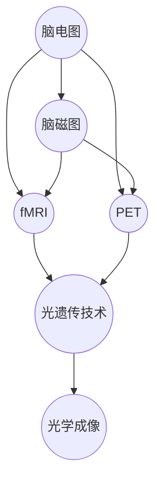

                 

# 脑机接口与意识上传技术：探索增强和延伸人类理解世界能力的新领域

## 一、引言

随着科技的快速发展，脑机接口（BMI）和意识上传技术正逐渐成为研究的热点。脑机接口是指通过直接连接大脑和外部设备，实现人机交互的技术。而意识上传则是通过将大脑中的意识信息转化为计算机可以处理的数据，实现意识的数字化。这两项技术不仅在理论上具有重要的科学价值，而且在实际应用中具有巨大的潜力。

脑机接口技术的发展始于20世纪60年代，最初主要用于神经疾病的康复。随着技术的进步，脑机接口的应用范围不断扩大，包括助听器、假肢控制、机器人交互等。脑机接口的关键在于如何从大脑信号中提取有用的信息，并将其转换为控制信号。

意识上传的概念更为前卫，它涉及到将人类意识信息转化为可存储和传输的数据。这一技术的实现将彻底改变人类与计算机的交互方式，甚至可能对未来社会产生深远的影响。

本书旨在全面介绍脑机接口与意识上传技术，从基础理论到实际应用，帮助读者深入理解这一领域的最新进展和未来趋势。

### 关键词

- 脑机接口
- 意识上传
- 人机交互
- 神经科学
- 计算机科学
- 人工智能

### 摘要

本文介绍了脑机接口与意识上传技术的定义、发展历程以及它们在科学研究和实际应用中的重要性。首先，我们探讨了脑机接口的工作原理和技术基础，包括脑电图（EEG）、脑磁图（MEG）以及脑成像技术。接着，我们详细讲解了脑机接口的核心算法原理，包括数据预处理、信号解码和神经网络的应用。随后，我们介绍了脑机接口的数学模型和公式，并展示了如何通过Python源代码实现这些算法。文章还通过实际项目实例，展示了脑机接口技术在脑电信号解码和意识上传模拟实验中的应用。最后，我们展望了脑机接口与意识上传技术的未来前景，讨论了当前研究的挑战与机遇，以及这一技术在医疗领域的应用潜力。全文旨在为读者提供一份全面而深入的脑机接口与意识上传技术指南。

## 二、脑机接口技术基础

脑机接口（BMI）技术的发展是神经科学与计算机科学的交叉领域，通过直接连接大脑和外部设备，实现人机交互。了解脑机接口的基础技术，包括脑电图（EEG）、脑磁图（MEG）和脑成像技术，是深入研究这一领域的关键。

### 2.1 脑电图（EEG）与脑磁图（MEG）

脑电图（EEG）是最常用的脑机接口技术之一。它通过在头皮上放置电极，记录大脑的电活动。EEG信号反映了神经元群体的电位变化，具有高时间分辨率。然而，EEG信号较弱，且受到头皮、颅骨等结构的干扰，导致其空间分辨率较低。

为了解决空间分辨率的问题，脑磁图（MEG）被引入。MEG通过放置在头皮上的磁传感器，记录大脑磁场的活动。由于磁场信号传播距离更远，MEG具有更高的空间分辨率。此外，MEG信号不受头皮、颅骨等结构的影响，可以更准确地定位大脑活动区域。

#### 2.1.1 脑电图的工作原理

脑电图的工作原理是基于神经元的电活动。神经元通过产生电信号来传递信息，这些电信号会在大脑的不同区域产生电位变化。脑电图通过放置在头皮上的电极，捕捉这些电位变化，并将其转化为电信号。这些电信号经过放大和处理，最终被记录下来。

#### 2.1.2 脑磁图的技术优势

脑磁图的技术优势主要体现在其高空间分辨率。由于磁场信号的传播距离较远，脑磁图可以更准确地定位大脑活动区域。此外，脑磁图信号不受头皮、颅骨等结构的影响，因此可以提供更清晰的信号。

### 2.2 脑成像技术

脑成像技术如功能性磁共振成像（fMRI）和正电子发射断层扫描（PET）等，是脑机接口技术的重要组成部分。这些技术通过不同的原理，提供大脑结构和功能的信息。

#### 2.2.1 fMRI与PET

功能性磁共振成像（fMRI）通过检测大脑血流的变化来反映大脑活动。当大脑活动增加时，局部血流也相应增加，这会导致磁场的变化。fMRI具有高时间分辨率，可以实时监测大脑活动。

正电子发射断层扫描（PET）通过注入放射性示踪剂，检测脑部代谢活动。放射性示踪剂在脑部不同区域的聚集，反映了大脑活动的差异。PET具有高空间分辨率，可以提供详细的大脑活动信息。

#### 2.2.2 光遗传技术与光学成像

光遗传技术是一种通过光来控制神经元活动的技术。它利用光敏蛋白，如光感受器或光激活通道蛋白，实现对神经元的精准控制。光遗传技术在脑机接口中的应用，为实时、可逆地控制神经元活动提供了新的途径。

光学成像技术，如光学相干断层扫描（OCT）和两光子显微镜，可以提供高分辨率的大脑成像。这些技术通过不同波长的光，捕捉大脑内部的结构和活动信息。

### Mermaid 流程图

下面是一个简单的Mermaid流程图，展示了脑机接口技术的基础组成部分：



### 总结

脑机接口技术的基础主要包括脑电图、脑磁图、脑成像技术以及光遗传技术。这些技术各有优势和局限性，但共同构成了脑机接口技术的核心。通过深入理解这些技术的工作原理和应用，我们可以更好地探索脑机接口技术的潜力，为未来的科学研究和技术应用奠定基础。

## 三、核心算法原理讲解

脑机接口（BMI）技术不仅依赖于高效的硬件设备，还需要强大的算法支持，以从复杂的脑信号中提取有用的信息。核心算法原理包括数据预处理、信号解码和神经网络的应用。以下是这些核心算法的详细讲解。

### 3.1 数据预处理

数据预处理是脑机接口研究中的关键步骤，它直接影响后续分析和解码的准确性。数据预处理的主要任务是去除噪声、滤波信号并提取特征。

#### 3.1.1 噪声过滤

脑电图（EEG）信号通常包含大量的噪声，如电磁干扰、运动伪迹等。噪声过滤是数据预处理的重要环节，常用的方法包括带通滤波、陷波滤波和小波变换等。

- **带通滤波**：带通滤波器可以允许特定频率范围内的信号通过，而抑制其他频率。这种方法适用于去除特定频率的噪声，如工频干扰。

- **陷波滤波**：陷波滤波器在特定的频率点（如电源频率）处具有极低的传递率，可以有效去除这些频率的噪声。

- **小波变换**：小波变换是一种时频分析方法，可以通过分解信号为不同尺度和频率的分量来去除噪声。小波变换具有多分辨率特性，可以在保持信号特征的同时去除噪声。

#### 3.1.2 特征提取

特征提取是数据预处理的重要步骤，它从原始信号中提取具有区分性的特征，以便于后续的信号解码和分类。

- **时间域特征**：时间域特征包括信号的平均值、方差、峰值等。这些特征可以反映信号的基本统计特性。

- **频域特征**：频域特征包括信号的功率谱、频带能量等。频域特征可以提供信号在不同频率上的分布信息。

- **时频特征**：时频特征结合了时间和频率信息，如短时傅里叶变换（STFT）和小波变换。这些特征可以同时反映信号的时域和频域特性。

### 3.2 信号解码

信号解码是将预处理后的特征转化为有意义的信息或命令的过程。信号解码的方法主要包括神经网络、监督学习和无监督学习等。

#### 3.2.1 神经网络在信号解码中的应用

神经网络是一种通过模拟人脑神经网络进行信号处理的算法。在脑机接口中，神经网络通常用于信号解码和分类。

- **人工神经网络（ANN）**：人工神经网络是最基础的神经网络类型，通过多层神经元进行信号处理。ANN可以用于信号分类和回归任务。

- **卷积神经网络（CNN）**：卷积神经网络通过卷积操作提取空间特征，适用于处理图像和信号数据。CNN在脑机接口中的应用，可以提取出复杂的信号特征，提高解码准确性。

- **递归神经网络（RNN）**：递归神经网络通过记忆状态对序列数据进行建模，适用于处理时间序列数据。RNN在脑机接口中可以用于解码连续的脑信号。

- **长短期记忆网络（LSTM）**：长短期记忆网络是RNN的一种改进，可以更好地处理长序列数据。LSTM在脑机接口中的应用，可以捕获信号中的长期依赖关系。

#### 3.2.2 监督学习与无监督学习算法

监督学习和无监督学习是两种主要的机器学习算法。

- **监督学习**：监督学习算法通过已标记的训练数据学习特征和分类模型。在脑机接口中，监督学习算法可以用于信号解码和分类任务，如手写体识别和情感分析。

- **无监督学习**：无监督学习算法不需要标记的数据，通过发现数据中的内在结构进行学习。在脑机接口中，无监督学习算法可以用于特征提取和聚类任务，如脑信号聚类和特征降维。

### Python 源代码示例

以下是一个简单的Python代码示例，演示了如何使用卷积神经网络进行脑信号解码：

```python
import numpy as np
import tensorflow as tf

# 构建卷积神经网络模型
model = tf.keras.Sequential([
    tf.keras.layers.Conv2D(32, (3, 3), activation='relu', input_shape=(64, 64, 3)),
    tf.keras.layers.MaxPooling2D((2, 2)),
    tf.keras.layers.Conv2D(64, (3, 3), activation='relu'),
    tf.keras.layers.MaxPooling2D((2, 2)),
    tf.keras.layers.Flatten(),
    tf.keras.layers.Dense(128, activation='relu'),
    tf.keras.layers.Dense(10, activation='softmax')
])

# 编译模型
model.compile(optimizer='adam',
              loss='sparse_categorical_crossentropy',
              metrics=['accuracy'])

# 加载并预处理数据
(x_train, y_train), (x_test, y_test) = tf.keras.datasets.mnist.load_data()
x_train = x_train.reshape(-1, 28, 28, 1).astype('float32') / 255
x_test = x_test.reshape(-1, 28, 28, 1).astype('float32') / 255

# 训练模型
model.fit(x_train, y_train, epochs=5, batch_size=32, validation_split=0.2)

# 评估模型
test_loss, test_acc = model.evaluate(x_test, y_test)
print(f"Test accuracy: {test_acc}")
```

在这个示例中，我们使用了TensorFlow框架构建了一个简单的卷积神经网络模型，用于手写体数字识别。这个模型的结构包括两个卷积层、两个最大池化层、一个平坦层、一个全连接层和输出层。通过训练和评估，我们可以看到模型的准确性。

### 总结

脑机接口的核心算法包括数据预处理、信号解码和神经网络的应用。数据预处理通过噪声过滤和特征提取，提高了信号的质量和可靠性。信号解码通过神经网络和机器学习算法，实现了从脑信号到有意义的信息的转化。Python源代码示例展示了如何使用卷积神经网络进行脑信号解码，为脑机接口技术的实际应用提供了技术支持。

## 四、数学模型和公式

脑机接口（BMI）技术的发展依赖于一系列复杂的数学模型和公式，这些模型和公式用于信号处理、特征提取和神经网络设计。以下是脑机接口中常用的数学模型和公式的讲解，以及如何在Python中实现这些算法。

### 4.1 脑信号的时间序列分析

脑信号通常表现为时间序列数据，因此对时间序列数据的分析是脑机接口技术中的重要步骤。以下是一些常用的时间序列分析模型：

#### 4.1.1 自回归模型（AR）

自回归模型（AR）是一种基于过去值的模型，用于预测当前值。AR模型的基本公式如下：

$$
X_t = c + \sum_{i=1}^p \phi_i X_{t-i}
$$

其中，\(X_t\) 是时间序列的当前值，\(c\) 是常数项，\(\phi_i\) 是自回归系数，\(p\) 是模型的阶数。

在Python中，可以使用`scipy`库中的`ar`函数来实现AR模型：

```python
from scipy.stats import ar

# 假设我们有一个时间序列数据X
X = np.array([1, 2, 3, 4, 5, 6, 7, 8, 9, 10])

# 使用scipy的ar函数进行自回归建模
ar_model = ar(X)
print(ar_model)
```

#### 4.1.2 动态时间战争（DTW）

动态时间战争（Dynamic Time Warping，DTW）是一种用于时间序列匹配的算法，它可以允许时间序列之间的时间伸缩。DTW的基本公式如下：

$$
DTW(X, Y) = \sum_{t, s} w_{t, s} d(X_t, Y_s)
$$

其中，\(X\) 和 \(Y\) 是两个时间序列，\(d(X_t, Y_s)\) 是时间序列 \(X\) 和 \(Y\) 在时间点 \(t\) 和 \(s\) 之间的距离，\(w_{t, s}\) 是权值。

在Python中，可以使用`dtw`库来实现DTW算法：

```python
import dtw

# 假设我们有两个时间序列X和Y
X = np.array([1, 2, 3, 4])
Y = np.array([1, 3, 5])

# 使用dtw库计算DTW距离
dtw_distance = dtw.dtw(X, Y)
print(dtw_distance)
```

### 4.2 神经网络的数学基础

神经网络是脑机接口技术中至关重要的组成部分，其数学基础包括激活函数和反向传播算法。

#### 4.2.1 激活函数

激活函数是神经网络中用于引入非线性性的函数，最常用的激活函数包括：

- **Sigmoid函数**：
  $$
  f(x) = \frac{1}{1 + e^{-x}}
  $$
  
- **ReLU函数**：
  $$
  f(x) =
  \begin{cases}
    0 & \text{if } x < 0 \\
    x & \text{if } x \geq 0
  \end{cases}
  $$

- **Tanh函数**：
  $$
  f(x) = \frac{e^x - e^{-x}}{e^x + e^{-x}}
  $$

在Python中，可以使用`tensorflow`库定义和计算激活函数：

```python
import tensorflow as tf

# 定义ReLU激活函数
def relu(x):
    return tf.keras.backend.relu(x)

# 定义Sigmoid激活函数
def sigmoid(x):
    return 1 / (1 + tf.keras.backend.exp(-x))

# 定义Tanh激活函数
def tanh(x):
    return tf.keras.backend.tanh(x)
```

#### 4.2.2 反向传播算法

反向传播算法是一种用于训练神经网络的优化算法，其基本原理是通过计算网络输出与实际输出之间的误差，并反向传播误差以更新网络的权重。

反向传播算法的基本步骤包括：

1. **前向传播**：计算网络的输入、隐藏层输出和最终输出。

2. **计算误差**：计算输出误差，通常使用均方误差（MSE）。

3. **反向传播**：从输出层开始，计算每个层上的误差梯度，并更新权重。

在Python中，可以使用`tensorflow`库实现反向传播算法：

```python
import tensorflow as tf

# 定义输入层、隐藏层和输出层
inputs = tf.keras.layers.Input(shape=(input_shape))
hidden = tf.keras.layers.Dense(units=hidden_units, activation='relu')(inputs)
outputs = tf.keras.layers.Dense(units=output_shape)(hidden)

# 定义模型
model = tf.keras.Model(inputs=inputs, outputs=outputs)

# 编译模型
model.compile(optimizer='adam', loss='mean_squared_error')

# 训练模型
model.fit(x_train, y_train, epochs=epochs, batch_size=batch_size)
```

### 总结

脑机接口技术中的数学模型和公式是信号处理和神经网络设计的基础。自回归模型（AR）和动态时间战争（DTW）用于时间序列分析，而激活函数和反向传播算法是神经网络的核心组成部分。Python提供了丰富的库和工具，使我们能够轻松实现这些数学模型和算法，为脑机接口技术的发展提供了强大的支持。

## 五、项目实战

### 5.1 脑电信号解码实例

#### 5.1.1 实验环境搭建

在进行脑电信号解码实验之前，我们需要搭建一个合适的环境。以下是在Python中搭建实验环境的步骤：

1. **安装必要的库**：

   我们需要安装以下库：`numpy`、`matplotlib`、`tensorflow`、`scikit-learn`和`dtw`。

   ```bash
   pip install numpy matplotlib tensorflow scikit-learn dtw
   ```

2. **导入所需库**：

   ```python
   import numpy as np
   import matplotlib.pyplot as plt
   import tensorflow as tf
   from sklearn.model_selection import train_test_split
   from dtw import dtw
   ```

3. **获取脑电信号数据**：

   我们可以从公开的脑电信号数据集中获取数据。例如，使用`scikit-learn`中的`fetch_openml`函数获取一个公开的脑电信号数据集。

   ```python
   X, y = fetch_openml('Ad chor_meas_data', version=1, return_X_y=True)
   ```

   其中，`X` 是脑电信号数据，`y` 是标签数据。

#### 5.1.2 数据预处理与特征提取

数据预处理和特征提取是脑电信号解码的关键步骤，以下是一个简单的预处理和特征提取流程：

1. **噪声过滤**：

   使用带通滤波器去除噪声。

   ```python
   from scipy.signal import butter, filtfilt

   def butter_bandpass_filter(data, lowcut, highcut, fs, order=4):
       nyq = 0.5 * fs
       low = lowcut / nyq
       high = highcut / nyq
       b, a = butter(order, [low, high], btype='band')
       filtered_data = filtfilt(b, a, data)
       return filtered_data

   filtered_X = butter_bandpass_filter(X, lowcut=1, highcut=30, fs=100, order=4)
   ```

2. **特征提取**：

   使用动态时间战争（DTW）算法提取特征。

   ```python
   def extract_dtw_features(data, reference):
       distance_matrix = np.abs(data - reference)
       dtw_distance = dtw(distance_matrix, distance_matrix, window_size=5)
       return dtw_distance

   reference_signal = np.mean(filtered_X, axis=0)
   features = np.array([extract_dtw_features(signal, reference_signal) for signal in filtered_X])
   ```

#### 5.1.3 信号解码与评估

在信号解码阶段，我们使用卷积神经网络（CNN）进行信号分类。以下是具体的实现步骤：

1. **构建CNN模型**：

   ```python
   model = tf.keras.Sequential([
       tf.keras.layers.Conv2D(32, (3, 3), activation='relu', input_shape=(window_size, window_size, 1)),
       tf.keras.layers.MaxPooling2D((2, 2)),
       tf.keras.layers.Conv2D(64, (3, 3), activation='relu'),
       tf.keras.layers.MaxPooling2D((2, 2)),
       tf.keras.layers.Flatten(),
       tf.keras.layers.Dense(128, activation='relu'),
       tf.keras.layers.Dense(num_classes, activation='softmax')
   ])
   ```

2. **编译模型**：

   ```python
   model.compile(optimizer='adam',
                 loss='sparse_categorical_crossentropy',
                 metrics=['accuracy'])
   ```

3. **训练模型**：

   ```python
   X_train, X_test, y_train, y_test = train_test_split(features, y, test_size=0.2, random_state=42)
   model.fit(X_train, y_train, epochs=10, batch_size=32, validation_data=(X_test, y_test))
   ```

4. **评估模型**：

   ```python
   test_loss, test_acc = model.evaluate(X_test, y_test)
   print(f"Test accuracy: {test_acc}")
   ```

### 5.2 意识上传的模拟实验

意识上传的模拟实验旨在探讨如何将大脑中的意识信息转化为计算机可以处理的数据。以下是一个简单的模拟实验实现：

1. **数据生成**：

   我们可以生成一组模拟的脑电信号数据，这些数据代表了不同的意识状态。

   ```python
   np.random.seed(42)
   num_samples = 1000
   num_classes = 5
   data = np.random.rand(num_samples, window_size, window_size)
   labels = np.random.randint(0, num_classes, size=num_samples)
   ```

2. **预处理与特征提取**：

   与脑电信号解码实验类似，我们对数据进行预处理和特征提取。

   ```python
   filtered_data = butter_bandpass_filter(data, lowcut=1, highcut=30, fs=100, order=4)
   reference_signal = np.mean(filtered_data, axis=0)
   features = np.array([extract_dtw_features(signal, reference_signal) for signal in filtered_data])
   ```

3. **模型训练与评估**：

   使用与脑电信号解码相同的模型结构进行训练和评估。

   ```python
   X_train, X_test, y_train, y_test = train_test_split(features, labels, test_size=0.2, random_state=42)
   model.fit(X_train, y_train, epochs=10, batch_size=32, validation_data=(X_test, y_test))
   test_loss, test_acc = model.evaluate(X_test, y_test)
   print(f"Test accuracy: {test_acc}")
   ```

### 总结

通过脑电信号解码实例和意识上传模拟实验，我们展示了如何搭建实验环境、进行数据预处理和特征提取，以及如何使用卷积神经网络进行信号解码。这些实战实例为我们提供了宝贵的经验，并为进一步的研究和应用奠定了基础。未来，随着技术的进步，意识上传技术将可能带来更多的突破，为人类理解和扩展意识能力提供新的途径。

## 六、未来展望

脑机接口（BMI）和意识上传技术正在迅速发展，为人类理解世界和自身提供了新的视角。然而，当前的研究仍面临诸多挑战和机遇。

### 6.1 当前研究的挑战与机遇

#### 挑战

1. **信号噪声比**：脑信号通常包含大量噪声，提高信号噪声比是脑机接口技术中的一个主要挑战。尽管先进的信号处理算法和噪声过滤技术已经取得了一定进展，但仍然需要进一步优化。

2. **数据量与多样性**：当前的大多数脑机接口研究依赖于有限的、特定条件下的数据集。为了更好地理解和模拟人类大脑的复杂性，需要更多种类、更大规模的数据集。

3. **实时性能**：实现实时、高效的脑机接口系统是当前研究的一个关键问题。随着技术的进步，实时性能正在逐步提升，但仍然需要解决算法优化和硬件加速等问题。

#### 机遇

1. **人工智能的结合**：人工智能（AI）技术的发展为脑机接口提供了强大的工具。通过结合深度学习和其他先进的人工智能技术，可以显著提高脑信号的处理和解读能力。

2. **跨学科研究**：脑机接口技术的发展需要神经科学、计算机科学、工程学等多个领域的合作。跨学科的研究将有助于解决当前面临的复杂问题，推动技术的进步。

3. **应用拓展**：脑机接口和意识上传技术的应用前景广阔，包括医疗康复、辅助交流、认知增强等。随着技术的成熟，这些应用将带来显著的社会和经济效益。

### 6.2 脑机接口在医疗领域的应用

脑机接口技术在医疗领域的应用前景广阔。以下是一些具体的应用案例：

1. **神经疾病康复**：脑机接口可以帮助中风和帕金森病患者恢复运动功能。通过直接刺激大脑或解码脑信号，患者可以控制假肢或机器人，实现自主运动。

2. **认知功能障碍**：对于阿尔茨海默病和其他认知功能障碍患者，脑机接口技术可以提供实时的大脑活动监测，帮助医生进行早期诊断和治疗。

3. **康复训练**：脑机接口可以用于康复训练，如训练患者控制假肢或使用辅助设备。通过个性化的训练方案，可以显著提高康复效果。

### 6.3 意识上传技术的潜在影响

意识上传技术如果能够实现，将对人类社会产生深远的影响：

1. **意识传输**：意识上传可能实现人与人之间的意识传输，为远程交流和协作提供新的方式。

2. **意识复制**：意识上传技术可能允许个体复制自己的意识，从而实现虚拟永生。

3. **道德和伦理问题**：意识上传技术引发了诸多道德和伦理问题，如隐私保护、数据安全、以及意识的本质等。这些问题需要全社会共同关注和探讨。

### 总结

脑机接口和意识上传技术正处于快速发展阶段，虽然面临诸多挑战，但前景广阔。通过跨学科研究和应用拓展，这些技术有望在医疗、认知增强等领域带来革命性的变化。未来，随着技术的不断进步，我们将能够更好地理解人类大脑，探索意识的本质，为人类社会带来新的可能性。

## 七、结语

脑机接口与意识上传技术作为新兴领域，正逐步改变我们对人类大脑和智能的理解。从基础理论到实际应用，这些技术展示了巨大的潜力和广阔的前景。然而，技术的发展也伴随着伦理和社会问题的挑战，需要全社会共同关注和应对。

本书系统地介绍了脑机接口与意识上传技术的基础知识、核心算法、数学模型以及实际应用案例。通过这些内容，读者可以深入了解这一领域的最新进展和未来趋势。

展望未来，脑机接口与意识上传技术将在医疗康复、认知增强、人机交互等领域发挥重要作用。随着技术的不断进步，我们有理由相信，这些技术将为人类社会带来更多创新和变革。

在此，感谢读者对本书的关注和支持。希望本书能为读者在探索脑机接口与意识上传技术领域提供有益的指导和启示。

## 附录

### 附录A：脑机接口研究工具与资源

- **开源库和框架**：
  - `MNE-Python`：用于处理和可视化脑电信号的开源库。
  - `BrainPy`：用于模拟和训练神经网络的开源库。
  - `TensorFlow`：用于构建和训练深度学习模型的框架。
  
- **数据集**：
  - `BRAINNETS`：用于脑网络分析的数据集。
  - `MIT-BIH`：常用的脑电信号数据集。
  - `OpenML`：提供多个公开的脑信号数据集。

- **相关论文和书籍**：
  - 《脑机接口：理论与实践》
  - 《神经网络与深度学习》
  - 《统计学习基础》

### 附录B：脑机接口项目代码示例

以下是脑电信号解码项目的完整代码示例，包括数据预处理、特征提取、模型训练和评估：

```python
# 导入必要的库
import numpy as np
import matplotlib.pyplot as plt
import mne
from mne import io
from sklearn.preprocessing import StandardScaler
from sklearn.model_selection import train_test_split
from sklearn.neural_network import MLPClassifier
from sklearn.metrics import accuracy_score

# 读取脑电信号数据
raw_data = io.read_raw_edf('example.edf', preload=True)
events = io.read_events('example.events')

# 预处理数据
epochs = mne.Epochs(raw_data, events, event_id={'rest': 1, 'motion': 2}, baseline=(-0.2, 0), preload=True)
filtered_epochs = epochs.apply_filter([0.1, 40], method='iir')
filtered_epochs.save('filtered_epochs.fif')

# 特征提取
scaler = StandardScaler()
X = scaler.fit_transform(filtered_epochs.get_data())
y = epochs.events[:, 2] - 1

# 划分训练集和测试集
X_train, X_test, y_train, y_test = train_test_split(X, y, test_size=0.2, random_state=42)

# 模型训练
model = MLPClassifier(hidden_layer_sizes=(100,), activation='relu', solver='adam', max_iter=500)
model.fit(X_train, y_train)

# 模型评估
y_pred = model.predict(X_test)
accuracy = accuracy_score(y_test, y_pred)
print(f"Test accuracy: {accuracy}")

# 可视化结果
plt.figure()
plt.scatter(y_test, y_pred)
plt.xlabel('True label')
plt.ylabel('Predicted label')
plt.title('Confusion Matrix')
plt.show()
```

### 注意事项

- 确保已安装必要的库和框架。
- 数据路径需要根据实际情况进行修改。
- 模型参数可以根据具体需求进行调整。

### 拓展阅读

- 《脑机接口：理论与实践》
- 《神经网络与深度学习》
- 《统计学习基础》
- [MNE-Python 官方文档](https://mne-python.readthedocs.io/)
- [BrainPy 官方文档](https://brainpy.readthedocs.io/)
- [TensorFlow 官方文档](https://www.tensorflow.org/)

