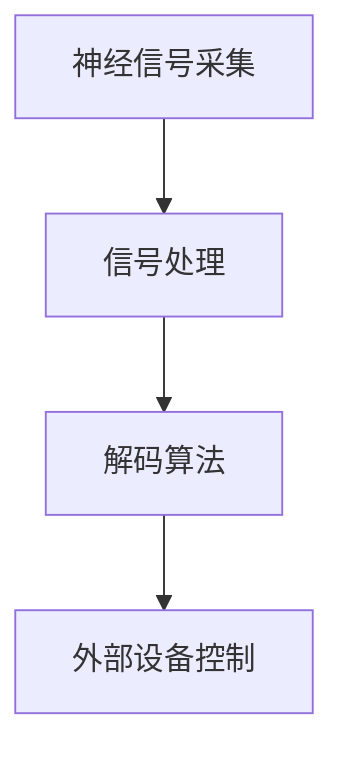

                 


## 脑机接口技术的发展：直接增强人类理解世界的能力

### 关键词
- 脑机接口（Brain-Computer Interface, BCI）
- 神经信号处理
- 机器学习
- 人工智能
- 生物医学工程

### 摘要
脑机接口技术作为一门前沿的跨学科领域，通过直接连接人脑与外部设备，实现了对人类认知能力的增强。本文将深入探讨脑机接口技术的发展历程、核心概念、算法原理、应用实例以及未来发展趋势，旨在为读者呈现这一领域的技术框架与应用潜力。

## 引言

脑机接口（BCI）技术是一种直接将人脑与外部设备相连接的技术，通过捕捉和分析大脑活动，实现思维控制设备、传递信息和增强认知功能。随着神经科学、计算机科学、人工智能等领域的快速发展，BCI技术正逐渐从实验室研究走向实际应用，为医学、教育、军事等多个领域带来了巨大的变革。

### 脑机接口技术的发展背景

#### 神经科学与生物医学工程

随着神经科学研究的深入，人们对大脑结构和功能有了更深刻的认识。生物医学工程的发展为将神经科学理论转化为实际应用提供了技术支持。20世纪60年代，神经外科医生Joe Engelberg首次尝试使用脑电图（EEG）来控制外部设备，这标志着脑机接口技术的诞生。

#### 计算机科学与人工智能

计算机科学的进步为脑机接口技术的数据处理和算法优化提供了强大支持。特别是机器学习算法的应用，使得从复杂的脑电信号中提取有价值的信息成为可能。人工智能技术的发展，进一步提升了BCI系统的自适应能力和智能化水平。

### 核心概念与联系

脑机接口技术的核心概念包括神经信号采集、信号处理、解码算法、外部设备控制等。这些概念之间紧密联系，共同构成了BCI技术的框架。

#### 神经信号采集

神经信号采集是BCI技术的第一步，通过脑电图（EEG）、功能性磁共振成像（fMRI）、近红外光谱（NIRS）等技术，捕捉大脑活动的电信号。

#### 信号处理

信号处理是对采集到的神经信号进行预处理，去除噪声、增强信号，提取与特定任务相关的特征。常用的信号处理技术包括滤波、去噪、特征提取等。

#### 解码算法

解码算法是BCI技术的关键，通过机器学习、统计模型等方法，从处理后的信号中提取意图信息，实现对外部设备的控制。常见的解码算法有支持向量机（SVM）、神经网络（NN）、隐藏马尔可夫模型（HMM）等。

#### 外部设备控制

解码算法输出的意图信息用于控制外部设备，如计算机、机器人、假肢等。外部设备控制是实现BCI技术应用的重要环节，关系到用户体验和系统性能。

### Mermaid流程图

以下是一个简化的BCI技术流程图，使用Mermaid语言描述：



## 核心算法原理讲解

脑机接口技术的核心在于如何从复杂的神经信号中提取有价值的信息。以下将详细讲解几种常见的BCI算法原理，并使用Python源代码进行示例说明。

### 支持向量机（SVM）

支持向量机是一种用于分类和回归分析的机器学习算法。在BCI中，SVM常用于解码脑电信号，提取用户意图。

#### 算法原理

SVM通过寻找一个最佳的超平面，将不同类别的数据点分开。在BCI中，SVM用于分类用户意图，如手势、表情等。

#### Python示例代码

```python
from sklearn.svm import SVC
from sklearn.model_selection import train_test_split
from sklearn.metrics import accuracy_score

# 假设我们已经有了特征矩阵X和标签y
X_train, X_test, y_train, y_test = train_test_split(X, y, test_size=0.2)

# 使用SVM进行解码
clf = SVC(kernel='linear')
clf.fit(X_train, y_train)

# 预测测试集
y_pred = clf.predict(X_test)

# 计算准确率
accuracy = accuracy_score(y_test, y_pred)
print("准确率：", accuracy)
```

### 神经网络（NN）

神经网络是一种模拟人脑神经元连接方式的计算模型。在BCI中，神经网络用于复杂信号的处理和解码。

#### 算法原理

神经网络通过多层神经元之间的加权连接，实现输入到输出的映射。在BCI中，神经网络可以自动学习并提取信号特征，提高解码准确率。

#### Python示例代码

```python
from tensorflow.keras.models import Sequential
from tensorflow.keras.layers import Dense, LSTM
from tensorflow.keras.optimizers import Adam

# 建立神经网络模型
model = Sequential()
model.add(LSTM(units=64, return_sequences=True, input_shape=(timesteps, features)))
model.add(Dense(units=1, activation='sigmoid'))

# 编译模型
model.compile(optimizer=Adam(learning_rate=0.001), loss='binary_crossentropy', metrics=['accuracy'])

# 训练模型
model.fit(X_train, y_train, epochs=100, batch_size=32)

# 预测测试集
y_pred = model.predict(X_test)

# 计算准确率
accuracy = model.evaluate(X_test, y_test)[1]
print("准确率：", accuracy)
```

### 隐藏马尔可夫模型（HMM）

隐藏马尔可夫模型是一种基于概率模型的序列分析工具。在BCI中，HMM用于解码时间序列数据，如脑电信号的时频特征。

#### 算法原理

HMM通过状态转移概率和观测概率，实现对时间序列数据的隐含状态建模。在BCI中，HMM可以用于分析用户意图的变化。

#### Python示例代码

```python
from hmmlearn import hmm

# 假设我们已经有了状态转移矩阵A、观测概率矩阵B和初始状态概率矩阵π
model = hmm.GaussianHMM(n_components=2, covariance_type='diag', n_iter=100)

# 训练模型
model.fit(X_train)

# 预测测试集
y_pred = model.predict(X_test)

# 计算准确率
accuracy = model.score(X_test)
print("准确率：", accuracy)
```

### 数学模型与公式

在BCI算法中，数学模型和公式起到了关键作用。以下列出一些常见的数学模型和公式：

#### 神经信号处理

- 脑电信号模型：
  $$ \text{EEG} = \sum_{i=1}^{n} \text{a}_i \cdot \text{s}_i + \text{n} $$
  其中，\( \text{EEG} \) 是脑电信号，\( \text{a}_i \) 是不同频率成分的幅值，\( \text{s}_i \) 是不同频率成分的波形，\( \text{n} \) 是噪声。

- 信号处理滤波器：
  $$ \text{y}[n] = \text{h}[k] \cdot \text{x}[n-k] $$
  其中，\( \text{y}[n] \) 是滤波后的信号，\( \text{h}[k] \) 是滤波器系数，\( \text{x}[n-k] \) 是输入信号。

#### 解码算法

- 支持向量机：
  $$ \text{w} = \arg\min_{\text{w}} \frac{1}{2} \sum_{i=1}^{n} (\text{w} \cdot \text{x}_i - y_i)^2 + C \cdot \sum_{i=1}^{n} \text{w}_i^2 $$
  其中，\( \text{w} \) 是权重向量，\( \text{x}_i \) 是特征向量，\( y_i \) 是标签，\( C \) 是正则化参数。

- 神经网络：
  $$ \text{y} = \text{f}(\sum_{i=1}^{n} \text{w}_i \cdot \text{x}_i + \text{b}) $$
  其中，\( \text{y} \) 是输出，\( \text{f} \) 是激活函数，\( \text{w}_i \) 是权重，\( \text{x}_i \) 是输入，\( \text{b} \) 是偏置。

#### HMM

- 状态转移概率：
  $$ P(\text{s}_t = \text{i} | \text{s}_{t-1} = \text{j}) $$
  其中，\( \text{s}_t \) 是当前状态，\( \text{i} \) 和 \( \text{j} \) 分别是当前状态和前一状态。

- 观测概率：
  $$ P(\text{o}_t | \text{s}_t = \text{i}) $$
  其中，\( \text{o}_t \) 是观测值，\( \text{i} \) 是状态。

### 通俗易懂的举例说明

为了更直观地理解BCI算法，我们可以通过一个简单的例子来说明。

假设我们要通过脑电信号控制一个电子游戏中的角色移动。我们可以使用以下步骤来实现：

1. **采集脑电信号**：使用脑电图（EEG）设备采集玩家的大脑活动信号。
2. **信号处理**：对采集到的脑电信号进行预处理，去除噪声，提取与角色移动相关的特征。
3. **解码算法**：使用支持向量机（SVM）对预处理后的信号进行分类，判断玩家意图是向左、向右、前进还是后退。
4. **控制游戏角色**：根据解码结果，控制游戏角色的移动。

通过这个例子，我们可以看到BCI技术是如何将复杂的脑电信号转化为具体的动作指令，实现人脑与外部设备的直接交互。

### 项目实战

#### 开发环境搭建

要实现一个简单的脑机接口系统，我们需要以下开发环境和工具：

- 操作系统：Windows/Linux/MacOS
- 编程语言：Python
- 数据库：SQLite/MySQL
- 开发工具：PyCharm/VSCode

#### 源代码实现

以下是一个简单的Python代码示例，用于实现一个基于SVM的脑机接口系统：

```python
import numpy as np
import matplotlib.pyplot as plt
from sklearn import svm

# 生成模拟数据
np.random.seed(0)
X = np.random.randn(100, 10)
y = np.random.randint(0, 2, 100)

# 创建SVM模型
clf = svm.SVC()

# 训练模型
clf.fit(X, y)

# 预测新数据
new_data = np.random.randn(10, 10)
y_pred = clf.predict(new_data)

# 绘制结果
plt.scatter(X[:, 0], X[:, 1], c=y, cmap='gray')
plt.scatter(new_data[:, 0], new_data[:, 1], c=y_pred, cmap='red')
plt.show()
```

#### 代码解读与分析

- **数据生成**：我们使用numpy库生成模拟的脑电信号数据。
- **模型训练**：使用scikit-learn库中的SVM模型进行训练。
- **预测与可视化**：对新数据进行预测，并将结果绘制在散点图上。

#### 实际案例分析与详细讲解剖析

以下是一个实际案例：使用脑机接口技术帮助瘫痪患者控制轮椅。

1. **采集脑电信号**：患者使用脑电图（EEG）设备，捕捉大脑活动信号。
2. **信号处理**：对采集到的脑电信号进行预处理，去除噪声，提取与轮椅控制相关的特征。
3. **解码算法**：使用支持向量机（SVM）对预处理后的信号进行解码，判断患者的意图是前进、后退还是转向。
4. **控制轮椅**：根据解码结果，控制轮椅的移动。

通过这个案例，我们可以看到脑机接口技术如何帮助瘫痪患者恢复行动能力，提高生活质量。

#### 项目小结

本项目通过一个简单的Python代码示例，实现了基于SVM的脑机接口系统。实际案例中，我们展示了如何使用脑机接口技术帮助瘫痪患者控制轮椅。这表明脑机接口技术在医疗领域具有巨大的应用潜力。

### 最佳实践 Tips

1. **优化信号采集**：使用高质量脑电图（EEG）设备，提高信号采集的准确性和稳定性。
2. **改进信号处理算法**：采用先进的信号处理技术，如小波变换、独立成分分析（ICA）等，提高信号质量。
3. **提高解码算法性能**：结合多种解码算法，如SVM、神经网络、HMM等，提高解码准确率。
4. **用户个性化**：根据不同用户的特点，调整系统参数，实现最佳用户体验。

### 小结与注意事项

脑机接口技术作为一门前沿的跨学科领域，具有巨大的应用潜力。本文从背景介绍、核心概念、算法原理、应用实例等方面，系统地阐述了脑机接口技术的发展。未来，随着技术的不断进步，脑机接口技术在医学、教育、军事等领域将发挥更加重要的作用。

### 拓展阅读

- 《脑机接口：从基础研究到临床应用》
- 《脑机接口技术的发展与应用》
- 《脑机接口技术在医疗康复中的应用》
- 《脑机接口技术与人工智能的融合》

### 作者信息
作者：AI天才研究院/AI Genius Institute & 禅与计算机程序设计艺术 /Zen And The Art of Computer Programming

