                 

### 第一部分：脑科学与心理学基础

#### 1. 脑科学与心理学概述

##### 1.1 脑科学的核心概念

脑科学作为一门跨学科的研究领域，致力于探索大脑的结构、功能和运作机制。其核心概念包括大脑的结构与功能、神经网络以及功能性连接等。

**大脑的结构与功能**：大脑是人体最复杂的器官之一，由数十亿个神经元组成。大脑可以大致分为几个主要区域，包括：

- **前额叶皮质**：负责高级认知功能，如决策、规划、社会行为和记忆。
- **顶叶皮质**：涉及空间定位、触觉处理和感知。
- **颞叶皮质**：处理听觉和记忆，尤其是与语言相关的记忆。
- **枕叶皮质**：与视觉处理相关。

每个区域都有其特定的功能，并且这些区域之间通过神经网络相互连接，协同工作以实现复杂的认知功能。

**神经网络**：神经网络是大脑信息处理的基本单位。神经元通过突触连接在一起，形成复杂的网络结构。信息通过电信号在神经元之间传递，从而实现信息的加工和处理。

**功能性连接**：功能性连接是指不同大脑区域之间在执行特定任务时的协同活动。这些连接可以通过脑成像技术，如功能性磁共振成像（fMRI）来探测。

##### 1.1.1 神经科学与认知科学的关系

神经科学与认知科学是密切相关的两门学科。神经科学致力于研究大脑的神经元和神经网络，而认知科学则专注于人类心智的工作原理，包括感知、记忆、语言、思考和解题等认知过程。

**神经科学的基本原理**：神经科学涉及神经元的结构、信号传递机制、神经网络的复杂性和大脑的整体功能。它关注的是大脑如何接收、处理和响应外部刺激。

**认知科学的研究内容**：认知科学则关注人类心智的内部过程，研究人们如何理解世界、做出决策、解决问题和学习。它涉及到多个学科领域，包括心理学、哲学、语言学和计算机科学。

**两者之间的交互作用**：神经科学与认知科学之间的交互作用在于，它们共同探索大脑如何实现认知功能。神经科学提供了对大脑结构和功能的基础理解，而认知科学则利用这些知识来建立关于心智工作原理的理论。

**核心概念与联系架构 Mermaid 流程图**：
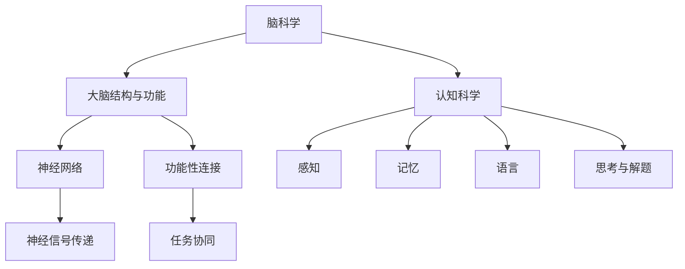
这一流程图展示了脑科学与认知科学的核心概念及其相互联系，强调了神经科学与认知科学在理解人类心智中的互补性。

##### 1.2 心理学的核心概念

心理学是一门研究人类行为和心理过程的科学，其核心概念涵盖了研究方法、研究对象以及多个分支领域。

**心理学的研究对象与方法**：心理学研究人类行为和心理过程，使用多种研究方法，包括：

- **行为主义方法**：关注可观察的行为，强调环境和刺激对行为的影响。
- **认知心理学方法**：研究心智过程，如记忆、注意力和决策。
- **发展心理学方法**：探讨人类行为和心理过程的发育和变化。

**心理学的分支领域**：心理学包括多个分支领域，每个领域都专注于不同的研究主题，包括：

- **临床心理学**：专注于心理障碍的诊断和治疗。
- **社会心理学**：研究个体在社会环境中的行为和思维。
- **教育心理学**：研究学习过程、教育方法和教学设计。

**核心概念与联系架构 Mermaid 流程图**：
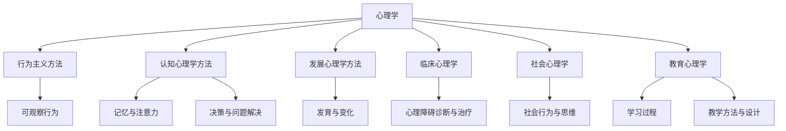
这一流程图展示了心理学的主要研究方法、分支领域以及它们的核心概念，强调了心理学在理解人类行为和心理过程中的重要性。

通过上述对脑科学与心理学核心概念和相互关系的详细介绍，我们为后续深入探讨脑科学与心理学整合奠定了基础。在接下来的章节中，我们将进一步探讨脑科学与心理学在具体领域中的交叉和整合，以及它们如何共同推动人类心智的理解。

##### 2. 脑科学与心理学的关系

脑科学与心理学作为两门看似不同但实则紧密相连的学科，它们之间的交叉点构成了现代科学研究的重要前沿。这种整合不仅丰富了各自的理论体系，也为解决复杂的认知问题提供了新的视角和方法。

###### 2.1 脑科学与心理学之间的交叉点

**认知神经科学的兴起**：认知神经科学是脑科学与心理学交叉融合的产物，它致力于研究大脑如何实现各种认知功能。认知神经科学的兴起标志着两大领域之间的紧密合作，其核心在于：

- **脑成像技术的应用**：认知神经科学借助脑成像技术，如功能性磁共振成像（fMRI）、正电子发射断层扫描（PET）和脑电图（EEG），可以直接观察大脑在执行认知任务时的活动。这些技术不仅揭示了大脑的结构，还展示了大脑在不同认知过程中的动态变化。

- **案例研究**：通过具体案例研究，认知神经科学家能够分析特定认知功能的脑机制。例如，研究者通过fMRI技术发现了与语言处理相关的特定脑区，从而深化了对语言功能的理解。

**心理学中的脑成像技术**：脑成像技术不仅是认知神经科学的重要工具，也在心理学研究中得到了广泛应用。这些技术帮助心理学家：

- **探测心理过程**：通过观察大脑活动，心理学家可以更直接地了解心理过程的脑机制。例如，fMRI技术可以帮助研究者探测记忆、注意力、情感等心理过程的脑网络。
  
- **验证理论模型**：脑成像技术为心理学家提供了验证其理论模型的实证依据。通过对比实验组和控制组的脑活动差异，心理学家可以评估不同心理理论的有效性。

###### 2.1.1 认知神经科学的兴起

认知神经科学的兴起可以追溯到20世纪80年代，随着脑成像技术的发展，研究者们开始能够在大尺度上观察大脑的活动。这一时期，几个关键事件推动了认知神经科学的发展：

- **功能性磁共振成像（fMRI）的发明**：fMRI技术的出现使研究者能够在不损害大脑结构的情况下，实时观察大脑的血流变化，进而推断大脑活动。这一技术大大提升了脑成像的分辨率，为认知神经科学研究提供了强有力的工具。
  
- **脑区定位研究**：早期的研究者通过脑损伤病例和脑电图技术，初步确定了大脑不同区域的功能。随着fMRI技术的发展，研究者能够更精确地定位与特定认知功能相关的脑区，这一发现为认知神经科学奠定了基础。

- **多学科合作**：认知神经科学的发展离不开神经科学、心理学、计算机科学等多个学科的交叉合作。跨学科的研究团队通过整合不同领域的方法和技术，推动了认知神经科学的研究进展。

**核心概念与联系架构 Mermaid 流程图**：
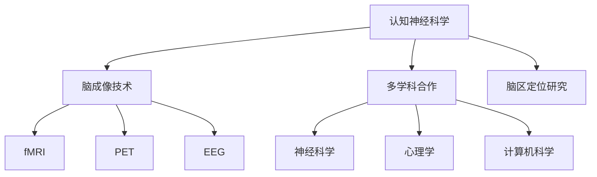
这一流程图展示了认知神经科学的核心理念，包括脑成像技术、多学科合作和脑区定位研究，强调了这些概念之间的紧密联系。

###### 2.1.2 心理学中的脑成像技术

脑成像技术已经成为心理学研究的重要工具，尤其在理解复杂心理过程方面发挥着关键作用。以下是一些常用的脑成像技术及其应用：

- **功能性磁共振成像（fMRI）**：fMRI通过测量大脑血流变化来推断大脑活动。它广泛应用于研究记忆、注意力、情感和决策等心理过程。fMRI的优势在于其高空间分辨率和相对无创性，使研究者能够在不受物理干扰的情况下，详细观察大脑活动。

- **正电子发射断层扫描（PET）**：PET通过检测放射性同位素的分布来反映大脑的代谢活动。PET在研究脑部疾病，如阿尔茨海默病和抑郁症等方面具有重要意义。尽管PET的空间分辨率较低，但其能够提供大脑代谢信息的深度分析。

- **脑电图（EEG）**：EEG通过记录大脑的电活动来研究心理过程。它特别适用于研究快速的时间动态过程，如反应时间、意识状态和情绪变化。EEG的优势在于其高时间分辨率，能够实时监测大脑活动。

**核心概念与联系架构 Mermaid 流程图**：
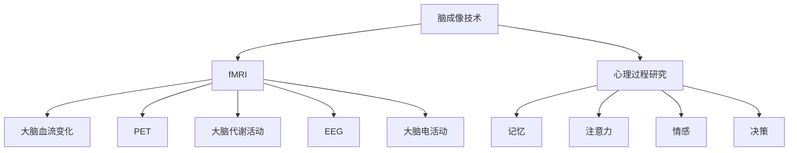
这一流程图展示了心理学中常用的脑成像技术及其应用，强调了这些技术在研究心理过程方面的核心作用。

脑科学与心理学的整合不仅推动了各自领域的发展，也为解决复杂的认知问题提供了新的视角和方法。在接下来的章节中，我们将进一步探讨脑科学与心理学在情感、认知过程和人类行为等领域的具体整合和应用。

##### 2.2 脑科学与心理学的研究方法整合

脑科学与心理学的整合不仅带来了新的理论视角，也推动了研究方法的创新。为了更全面地理解大脑与心智的关系，研究者们将脑科学与心理学的多种研究方法进行了整合，形成了一套综合性的研究策略。

###### 2.2.1 实验设计与统计分析

**实验设计**：实验设计是心理学和脑科学研究中不可或缺的一部分。脑科学与心理学在实验设计上的整合，主要体现在以下几个方面：

- **双盲实验**：双盲实验是一种经典的实验设计，其中实验者和参与者都不知道参与者所属的实验组。这种设计可以有效减少实验偏差，提高实验结果的可靠性。脑成像技术如fMRI和PET经常采用双盲设计，以确保研究结果不受主观因素的影响。

- **多变量设计**：在脑科学与心理学的整合研究中，常常需要同时考察多个变量。多变量设计允许研究者分析不同变量之间的关系，从而更全面地理解大脑与心理过程的关系。例如，研究者可以同时考察认知任务、情绪状态和大脑活动之间的相互作用。

**统计分析**：统计分析在整合研究中扮演着关键角色。以下是一些常用的统计分析方法：

- **回归分析**：回归分析是一种常用的统计方法，用于分析自变量和因变量之间的关系。在脑科学与心理学的整合研究中，回归分析可以用于分析大脑活动与心理过程之间的相关性。
  
- **多元统计分析**：多元统计分析包括因子分析、聚类分析和主成分分析等，这些方法可以帮助研究者识别和解释复杂的数据模式。例如，通过因子分析，研究者可以识别大脑活动中共同出现的模式，从而揭示潜在的神经机制。

**核心概念与联系架构 Mermaid 流程图**：
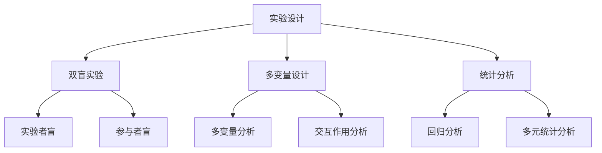
这一流程图展示了实验设计和统计分析在脑科学与心理学整合研究中的应用，强调了这些方法如何共同推动研究进展。

###### 2.2.2 计算模型与脑功能模拟

**计算模型**：计算模型是脑科学与心理学研究中重要的工具，用于模拟和预测大脑的运作机制。以下是一些关键的计算模型：

- **神经网络模型**：神经网络模型是模拟大脑信息处理过程的常见工具。这些模型通过模拟神经元和突触的连接方式，来模拟大脑的学习、记忆和感知等过程。

- **计算认知模型**：计算认知模型结合了神经网络模型和心理学理论，用于模拟复杂的认知过程。这些模型可以预测个体的行为和决策，为研究认知功能提供了强有力的工具。

**脑功能模拟**：脑功能模拟是计算模型在脑科学与心理学整合研究中的重要应用。以下是一些脑功能模拟的关键方面：

- **功能连接模拟**：功能连接模拟通过计算模型分析大脑不同区域之间的信息传递，以揭示大脑网络的运作机制。例如，研究者可以使用功能连接模拟来分析不同认知任务时大脑区域的协同活动。

- **神经可塑性模拟**：神经可塑性是大脑适应环境变化的能力，计算模型可以模拟这种能力。例如，研究者可以使用神经可塑性模拟来研究学习过程中的神经元连接变化。

**核心概念与联系架构 Mermaid 流程图**：
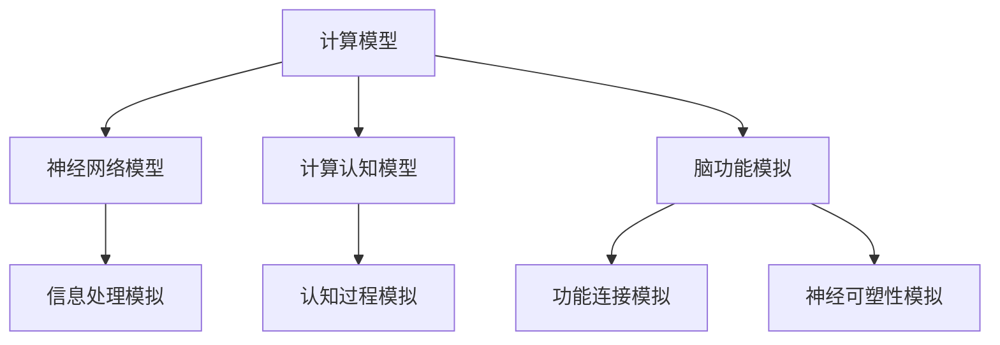
这一流程图展示了计算模型和脑功能模拟在脑科学与心理学整合研究中的应用，强调了这些模型如何帮助研究者理解大脑的运作机制。

脑科学与心理学的整合研究不仅依赖于传统的实验设计和统计分析方法，还依赖于计算模型和脑功能模拟等先进工具。这些研究方法共同推动了我们对大脑与心智关系的深入理解，为解决复杂的认知问题提供了新的途径。在接下来的章节中，我们将进一步探讨脑科学与心理学在情感、认知过程和人类行为等领域的具体应用和成果。

##### 3. 情感与情绪

情感和情绪是心理学和脑科学研究的核心主题之一，它们不仅影响个体的心理健康，还在社会互动和认知过程中扮演关键角色。从脑科学的视角来看，情感和情绪的体验和调节与大脑特定区域的神经活动密切相关。

###### 3.1 情感的脑机制

**情感的定义与分类**：情感是心理状态的一种形式，通常与特定的刺激和情境相关联。情感可以分为基本情感（如快乐、愤怒、恐惧、悲伤）和复合情感（如爱、厌恶、羞耻）。基本情感被认为是普遍存在于人类和其他高等动物中的原始情绪。

**情感的脑网络**：情感的脑机制涉及多个大脑区域，包括前额叶皮质、边缘系统和脑干等。以下是几个关键的情感脑网络：

- **前额叶皮质**：前额叶皮质，特别是前额叶皮层，与情感体验的生成和调节密切相关。这个区域参与了情绪的评估、决策和社交行为。
  
- **边缘系统**：边缘系统，包括杏仁核、海马体和下丘脑，与情感的反应和调节有关。杏仁核特别与基本情感的体验有关，如恐惧和愤怒。
  
- **脑干**：脑干中的神经核团，如中缝核和蓝斑核，参与了情绪的调节和传递，特别是情绪反应的快速激活。

**核心概念与联系架构 Mermaid 流程图**：
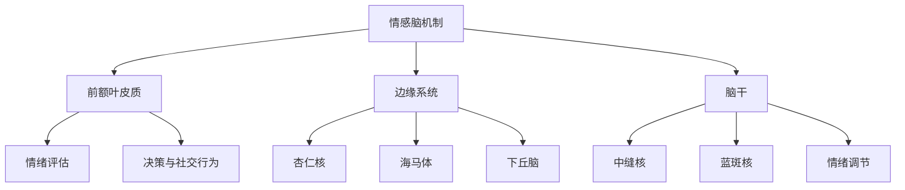
这一流程图展示了情感的脑机制，包括前额叶皮质、边缘系统和脑干的互动关系，强调了这些区域在情感体验和调节中的关键作用。

###### 3.2 情绪调节与心理疾病

**情绪调节的策略**：情绪调节是指个体管理和调节自身情绪的过程。有效的情绪调节策略包括：

- **认知重构**：通过改变对情境的认知评价，从而调节情绪。例如，将消极情境重新解释为挑战而非威胁，有助于减少焦虑和压力。

- **情绪表达**：适当地表达情绪，特别是通过健康的沟通方式，可以缓解情绪压力。

- **放松技巧**：如深呼吸、冥想和瑜伽等放松技巧，有助于减少紧张和焦虑，提升情绪稳定性。

**常见心理疾病的神经基础**：心理疾病，如抑郁症、焦虑症和双相情感障碍，都与情绪调节的障碍有关。以下是一些常见的心理疾病的神经基础：

- **抑郁症**：抑郁症与大脑中的特定区域，如前额叶皮质和杏仁核，的活动异常有关。这些区域的异常活动可能导致情绪调节障碍，使个体难以应对日常压力。

- **焦虑症**：焦虑症与大脑边缘系统的过度活跃有关，特别是杏仁核。过度活跃的杏仁核可能导致个体对威胁的反应过度，从而引起持续的焦虑。

- **双相情感障碍**：双相情感障碍涉及情绪调节的极端波动，包括躁狂和抑郁两个极端状态。大脑中多条神经回路的活动异常与这种疾病的发作有关。

**核心概念与联系架构 Mermaid 流程图**：
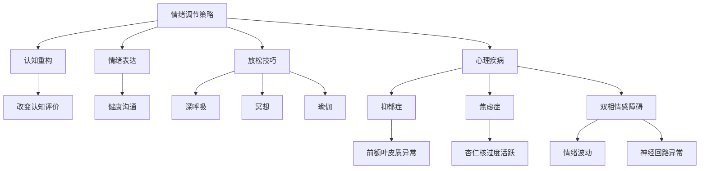
这一流程图展示了情绪调节的策略及其与常见心理疾病的神经基础之间的联系，强调了情绪调节在维护心理健康中的重要性。

通过上述分析，我们可以看到情感与情绪的脑机制以及情绪调节与心理疾病之间的关系。理解这些机制不仅有助于我们更好地理解个体的心理健康，也为开发有效的情绪调节和心理干预策略提供了科学依据。在接下来的章节中，我们将继续探讨脑科学和心理学在认知过程和人类行为领域的整合应用。

##### 4. 认知过程

认知过程是大脑处理信息和实现各种认知功能的过程，包括感知、注意力、记忆、决策和思维等。从脑科学的视角来看，认知过程涉及到大脑不同区域和神经网络的协同工作，通过神经信号传递和神经元之间的交互来实现。

###### 4.1 认知过程的脑机制

**注意力与记忆的脑基础**：

- **注意力**：注意力是认知过程中至关重要的一环，它决定了个体对信息的选择和加工。注意力与大脑前额叶皮层和顶叶皮层的活动密切相关。前额叶皮层负责注意力分配和目标选择，而顶叶皮层则参与注意力维持和任务执行。

  **脑成像技术**：功能性磁共振成像（fMRI）显示，当个体进行注意力任务时，前额叶皮层和顶叶皮层活动显著增强。特别是，前额叶皮层的背外侧前额叶皮层（DLPFC）和顶叶皮层的顶叶内侧表面（MST）在注意力的维持和任务执行中发挥关键作用。

- **记忆**：记忆是认知过程的核心组成部分，涉及信息的编码、存储和提取。记忆可以分为短期记忆和长期记忆，分别与大脑不同区域的活动相关。

  **脑成像技术**：fMRI研究表明，短期记忆与大脑海马体和前额叶皮层的活动密切相关。海马体是记忆编码和存储的关键区域，而前额叶皮层则参与记忆的维持和提取。

**决策与思维的脑机制**：

- **决策**：决策是认知过程中的一种高级功能，涉及对多个选项的分析和选择。决策过程中，大脑需要处理各种信息，并在不同选项之间进行权衡。

  **脑成像技术**：fMRI研究表明，决策过程中前额叶皮层、前扣带回和前岛叶等区域活动增强。这些区域参与了决策的评估、执行和情绪调节。

- **思维**：思维是认知过程中的一种复杂过程，包括推理、问题解决和创造性思维等。思维活动与大脑多个区域的活动有关，特别是前额叶皮层和顶叶皮层。

  **脑成像技术**：fMRI研究表明，当个体进行思维任务时，前额叶皮层和顶叶皮层的活动显著增强。特别是，前额叶皮层的背外侧前额叶皮层（DLPFC）和顶叶皮层的顶叶内侧表面（MST）在思维的推理和问题解决中发挥关键作用。

**核心概念与联系架构 Mermaid 流程图**：
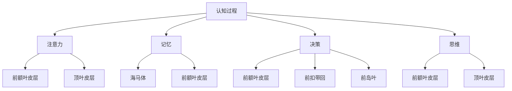
这一流程图展示了认知过程的脑机制，包括注意力、记忆、决策和思维的脑基础，强调了不同大脑区域在认知过程中的关键作用。

###### 4.2 认知功能的神经可塑性

**神经可塑性的概念与类型**：

- **神经可塑性**：神经可塑性是指大脑结构和功能在经验和学习过程中的适应性变化。它包括结构可塑性、连接可塑性和突触可塑性等类型。

  - **结构可塑性**：指大脑神经元结构的改变，包括新神经元的生成和神经通路的重构。
  
  - **连接可塑性**：指神经元之间的连接强度和模式的改变，包括突触的增强和消除。
  
  - **突触可塑性**：指突触结构的改变，包括突触前和突触后的适应性变化。

**神经可塑性对认知功能的影响**：

- **学习与记忆**：神经可塑性是学习与记忆的基础。通过神经可塑性，大脑可以调整其结构，以适应新的信息和经验。突触可塑性在这个过程中特别重要，它通过增强或减弱突触连接来支持记忆的编码和存储。

- **适应性功能**：神经可塑性使大脑能够适应环境变化。例如，当个体学会一项新技能或面对新的挑战时，大脑通过结构可塑性和连接可塑性来适应新的需求。

- **康复与治疗**：神经可塑性在康复和治疗中具有潜在的应用价值。例如，中风或脑损伤后，大脑可以通过神经可塑性重构受损的神经网络，从而恢复部分功能。

**核心概念与联系架构 Mermaid 流程图**：
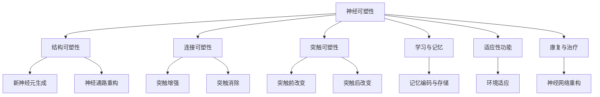
这一流程图展示了神经可塑性的概念及其对认知功能的影响，强调了神经可塑性在不同情境中的应用价值。

通过上述分析，我们可以看到认知过程的脑机制和神经可塑性的重要性。理解这些机制不仅有助于我们更全面地理解大脑的运作，也为认知功能的优化和康复提供了科学依据。在接下来的章节中，我们将继续探讨脑科学和心理学在人类行为和社会心理领域的整合应用。

##### 5. 人类行为与社会心理

人类行为与社会心理是心理学研究的核心领域之一，探讨了个体在社会环境中的行为和心理过程。从脑科学的视角来看，人类行为与社会心理不仅受到大脑结构的制约，还受到神经活动调节的影响。这一部分将分析行为和社会心理的脑机制，以及它们如何共同作用影响人类行为。

###### 5.1 行为的脑机制

**行为的神经基础**：人类行为由大脑不同区域的神经活动共同调控。以下是一些关键区域及其功能：

- **前额叶皮层**：前额叶皮层是行为调控的关键区域，负责决策、规划和社会行为。这一区域的神经活动与行为的复杂性和适应性密切相关。研究表明，前额叶皮层的损伤可能导致个体在行为上的混乱和失控。

- **纹状体**：纹状体是大脑中与运动控制和行为动机相关的重要结构。纹状体中的多巴胺神经元与奖赏和动机有关，其活动水平的变化与行为选择和决策直接相关。

- **杏仁核**：杏仁核是情绪处理的核心区域，特别与恐惧和厌恶情绪有关。杏仁核的过度活动可能导致个体在行为上的过度反应和情绪失调。

**行为调节的神经机制**：行为调节涉及到多个大脑区域之间的复杂交互作用。以下是一些关键机制：

- **多巴胺系统**：多巴胺系统在行为调节中扮演重要角色，特别是在动机和奖赏过程中。多巴胺水平的增加与积极的行为反应有关，而多巴胺水平的减少则与消极行为和抑郁状态相关。

- **前额叶-基底神经节环路**：前额叶皮层与基底神经节之间的交互作用是行为调节的重要机制。这一环路通过调节运动控制和情绪反应，帮助个体在不同的情境中做出适应性的行为选择。

**核心概念与联系架构 Mermaid 流程图**：
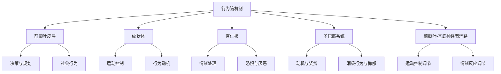
这一流程图展示了行为的脑机制，包括关键大脑区域和神经调节机制，强调了这些区域在行为调节中的相互作用。

###### 5.2 社会心理的脑科学视角

**社会认知与社交情绪**：社会认知是理解社会情境和他人行为的过程，而社交情绪则是个体在社会互动中体验的情感。以下是一些社会认知和社交情绪的关键脑机制：

- **前额叶皮层**：前额叶皮层在社会认知中发挥关键作用，特别是与社交情境的评估和决策相关。研究表明，前额叶皮层活动水平的变化与个体对社会情境的反应和情绪体验有关。

- **杏仁核**：杏仁核在社会情绪中特别重要，它是情绪反应的快速处理中心，与社交情境中的情绪体验密切相关。

- **腹侧纹状体**：腹侧纹状体与社交奖励和动机有关，其活动水平的变化与个体的社交行为和社会认知有关。

**社会规范的神经基础**：社会规范是指导个体行为的准则，其神经基础涉及多个大脑区域：

- **前额叶皮层**：前额叶皮层参与社会规范的认知和执行。这一区域的活动与个体对社交规范的理解和遵守密切相关。

- **前扣带回**：前扣带回在社会规范的学习和记忆中发挥作用，其活动水平的变化与个体对社交规范的适应和改变有关。

- **脑岛**：脑岛与个体的情绪体验和社交行为相关，其活动水平的变化可能影响个体对社交规范的反应。

**核心概念与联系架构 Mermaid 流程图**：
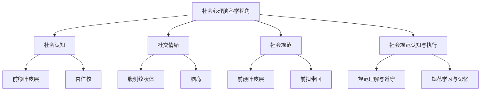
这一流程图展示了社会心理的脑科学视角，包括社会认知、社交情绪和社会规范的神经基础，强调了这些区域在人类行为和社会互动中的关键作用。

通过上述分析，我们可以看到人类行为与社会心理的脑机制，以及这些机制如何共同作用影响个体的行为和社交互动。理解这些机制对于优化人类行为和社会心理健康具有重要意义。在接下来的章节中，我们将进一步探讨心理学视角下的脑科学问题，以及如何通过心理干预和脑科学方法来改善心理健康。

##### 6. 大脑功能与心理健康

心理健康是大脑功能的重要组成部分，而大脑功能又直接影响到个体的心理健康状态。从心理学的角度来看，大脑功能的正常运作对于情绪调节、认知功能和社会行为具有深远的影响。理解大脑与心理健康之间的关系，有助于我们开发有效的心理干预策略，提高整体心理健康水平。

###### 6.1 心理因素对大脑功能的影响

**压力与大脑功能**：压力是影响大脑功能的一个重要心理因素。长期暴露于压力环境下，大脑的结构和功能可能会发生显著变化，导致心理健康问题。

- **前额叶皮质**：长期压力可能导致前额叶皮质体积减少，影响决策、规划和社交行为能力。研究表明，前额叶皮质的萎缩与抑郁症、焦虑症等心理障碍密切相关。

- **海马体**：海马体是大脑中与记忆和学习相关的关键区域，长期压力可能导致海马体体积减少，影响记忆和认知功能。海马体的损伤还可能导致抑郁症等心理障碍。

- **杏仁核**：杏仁核是情绪调节中心，长期压力可能导致杏仁核过度活跃，引起情绪波动和焦虑症状。杏仁核的异常活动与应激相关障碍如创伤后应激障碍（PTSD）有关。

**乐观与悲观对大脑的影响**：乐观和悲观的态度对大脑功能具有不同的影响。

- **乐观**：乐观态度与更好的大脑功能相关。乐观者往往拥有更健康的海马体结构和更好的认知功能。研究表明，乐观态度有助于减少认知衰退的风险，提高生活质量。

- **悲观**：悲观态度可能导致大脑功能下降。长期悲观可能导致前额叶皮质和海马体的结构损伤，影响情绪调节和认知功能。悲观者更容易出现抑郁症和其他心理健康问题。

**核心概念与联系架构 Mermaid 流程图**：
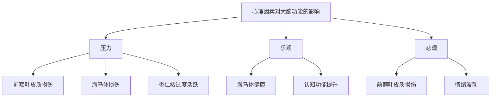
这一流程图展示了心理因素对大脑功能的影响，包括压力、乐观和悲观对大脑不同区域的影响，强调了心理因素在维护和改善大脑功能中的重要性。

###### 6.2 心理干预与脑功能的调节

**心理干预**：心理干预是改善心理健康、调节大脑功能的重要手段。以下是一些常见心理干预方法及其对大脑功能的影响：

- **认知行为疗法（CBT）**：认知行为疗法是一种广泛使用的心理干预方法，通过改变消极思维模式和行为模式，帮助个体改善情绪和心理状态。研究表明，CBT可以促进大脑神经可塑性，改善情绪调节和认知功能。

- **正念冥想**：正念冥想是一种以注意力训练为核心的冥想形式，通过专注于当前体验，帮助个体减少压力和焦虑。研究表明，正念冥想可以增强前额叶皮质的灰质密度，改善情绪调节和认知功能。

- **心理教育**：心理教育是一种通过提供心理健康知识和技能，帮助个体更好地理解和应对心理问题的方法。心理教育有助于个体提升自我认知和情绪管理能力，从而改善大脑功能。

**核心概念与联系架构 Mermaid 流程图**：
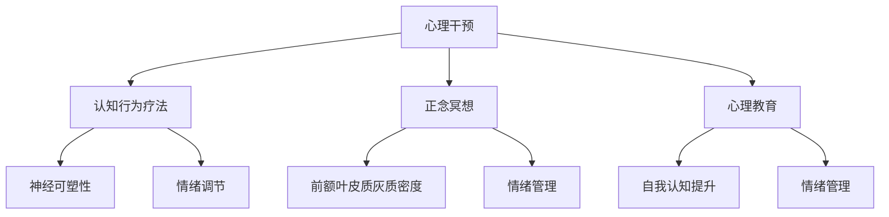
这一流程图展示了心理干预方法及其对大脑功能的影响，强调了心理干预在改善情绪调节和认知功能中的关键作用。

通过上述分析，我们可以看到心理因素对大脑功能的重要影响，以及心理干预在调节大脑功能和改善心理健康中的重要作用。理解这些机制有助于我们制定更有效的心理干预策略，提高个体的心理健康水平。在接下来的章节中，我们将进一步探讨脑科学与心理学在教育中的应用。

##### 7. 脑科学与心理学在教育中的应用

脑科学与心理学的整合在教育领域具有广阔的应用前景，能够为个性化教学、学习障碍干预和教学方法的改进提供科学依据。通过理解大脑在学习过程中的活动和心理机制，教育工作者可以设计更有效的方法来促进学生的学习和心理健康。

###### 7.1 教育心理学中的脑科学应用

**教学方法与大脑功能**：

- **认知负荷理论**：认知负荷理论指出，学习过程中认知资源的分配对于学习效果至关重要。有效的教学方法应该尽量减少不必要的认知负荷，将资源集中在关键的学习任务上。例如，通过减少课堂中的多任务处理，可以更好地利用大脑的认知资源，提高学习效果。

- **认知风格**：认知风格是个体在学习过程中表现出的偏好和习惯，包括视觉型、听觉型和动觉型等。了解学生的认知风格，可以帮助教育工作者设计个性化的教学策略，以适应不同类型的学习需求。例如，对于视觉型学生，使用图表和图像等视觉辅助工具可能更有效。

**学习策略与脑可塑性**：

- **反复练习**：研究表明，反复练习是促进大脑神经可塑性的重要途径。通过反复练习，大脑可以形成新的神经网络，提高学习效率。例如，在学习新技能时，通过重复练习，大脑可以更好地记忆和掌握这些技能。

- **间隔练习**：间隔练习是一种有效的学习策略，通过在不同的时间段进行练习，可以增强大脑的记忆和认知功能。研究表明，间隔练习可以促进大脑中神经元的同步活动，提高学习效果。

**核心概念与联系架构 Mermaid 流程图**：
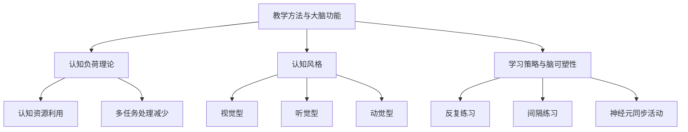
这一流程图展示了教育心理学中脑科学应用的核心概念，包括教学方法与大脑功能的关系以及学习策略与脑可塑性之间的关系，强调了个性化教学和学习策略在促进学习效果中的重要性。

###### 7.2 脑科学与心理学在特殊教育中的应用

**学习障碍的脑科学解释**：

- **注意力缺陷多动障碍（ADHD）**：ADHD是一种常见的神经发育障碍，与大脑前额叶皮质的异常活动有关。研究表明，ADHD患者的脑部区域，如前额叶皮质和纹状体，在执行功能任务时表现出不同的神经活动模式。

- **阅读障碍**：阅读障碍是一种学习障碍，与大脑中处理语言信息的区域异常有关。研究表明，阅读障碍患者的语言区域，如布罗卡区和颞叶，在语言处理过程中存在功能障碍。

**针对学习障碍的干预策略**：

- **认知行为干预**：认知行为干预是一种常用的干预方法，通过训练个体的注意力和执行功能，帮助患者改善认知能力。例如，通过注意力训练和策略学习，可以增强ADHD患者的注意力和行为控制。

- **教育辅导**：针对阅读障碍的教育辅导，通过个性化的教学方法，帮助患者掌握阅读技能。例如，通过视觉辅助和语言疗法，可以提升阅读障碍患者的语言处理能力。

- **神经反馈训练**：神经反馈训练是一种新兴的干预方法，通过实时监测大脑活动，帮助个体调节神经系统的功能。研究表明，神经反馈训练可以改善ADHD患者的注意力问题和阅读障碍患者的阅读能力。

**核心概念与联系架构 Mermaid 流.Flow图**：
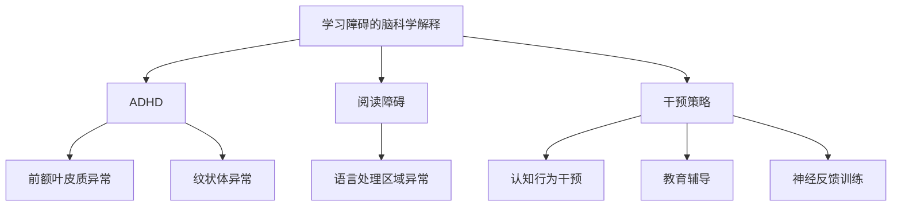
这一流程图展示了学习障碍的脑科学解释以及针对学习障碍的干预策略，强调了个性化干预方法在促进特殊教育中的重要性。

通过上述分析，我们可以看到脑科学与心理学在教育中的应用，包括教学方法与大脑功能的关系、学习策略与脑可塑性，以及特殊教育中的干预策略。这些应用不仅提高了教育效果，也为个体化教学和心理健康提供了科学依据。在未来的教育实践中，结合脑科学与心理学的理论和方法，将有助于更好地促进学生的学习和全面发展。

##### 8. 脑科学与心理学的未来发展趋势

随着技术的不断进步和跨学科研究的深入，脑科学与心理学在未来的发展中将迎来一系列新机遇和挑战。这一部分将探讨脑科学与心理学融合的前景、前沿领域以及跨学科整合的策略与实践。

###### 8.1 脑科学与心理学的融合前景

**跨学科研究的机遇**：脑科学与心理学的融合为跨学科研究提供了丰富的机遇，主要体现在以下几个方面：

- **数据整合**：脑成像技术、基因测序和神经电生理技术等现代技术的发展，为获取大量高质量神经数据提供了可能。这些数据可以通过跨学科整合，为理解大脑与心智的关系提供更加全面的视角。

- **模型构建**：跨学科研究可以结合脑科学和心理学的方法，构建更加精确和复杂的认知模型和神经网络模型。这些模型可以帮助我们更深入地理解大脑的工作机制和心理过程。

- **技术创新**：脑科学与心理学的融合推动了神经技术创新，例如脑机接口、虚拟现实和增强现实等技术的发展。这些技术不仅可以为临床和心理治疗提供新的工具，还可以为认知增强和心理健康管理提供新的手段。

**跨学科研究的挑战**：尽管跨学科研究带来了许多机遇，但也面临着一些挑战：

- **数据整合的复杂性**：不同学科的数据类型和度量标准不同，如何有效地整合和解释这些数据是一个挑战。

- **跨学科合作**：不同学科的研究方法和文化差异可能导致跨学科合作的困难。建立有效的跨学科研究团队和沟通机制是一个重要挑战。

- **方法论的一致性**：脑科学与心理学在方法论上存在差异，如何确保跨学科研究的方法论一致性，以确保研究结果的可靠性和有效性，是一个重要的课题。

**核心概念与联系架构 Mermaid 流程图**：
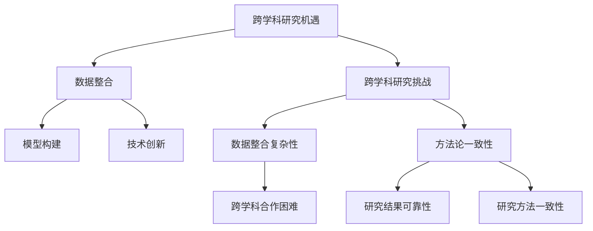
这一流程图展示了脑科学与心理学融合的前景和挑战，强调了跨学科研究在数据整合、模型构建和技术创新方面的机遇，同时也指出了跨学科合作和方法论一致性方面的挑战。

###### 8.2 跨学科整合的策略与实践

**跨学科研究团队的建设**：建立跨学科研究团队是实现脑科学与心理学融合的关键。以下是一些关键策略：

- **多学科背景的团队成员**：研究团队应包括来自不同学科的专业人员，如神经科学家、心理学家、计算机科学家和工程师等。多样化的背景可以促进不同学科的交叉和融合。

- **明确的合作目标**：研究团队应明确共同的研究目标和研究问题，以确保团队成员在研究过程中保持一致。

- **有效的沟通机制**：建立有效的沟通机制，如定期的团队会议和研讨会，可以促进团队成员之间的交流与合作。

- **资源共享**：跨学科研究团队应共享研究资源和工具，如实验设备、数据分析软件和实验室空间，以提高研究效率和成果。

**跨学科研究的方法与工具**：跨学科研究需要结合多种方法和工具，以下是一些常用的方法和工具：

- **脑成像技术**：脑成像技术，如fMRI、PET和EEG，可以提供关于大脑结构和功能的详细信息。这些技术可以与行为实验和神经电生理技术相结合，为研究提供多方面的数据。

- **计算模型**：计算模型，如神经网络模型和认知模型，可以模拟和预测大脑和心智的运作机制。这些模型可以与脑成像数据相结合，为研究提供理论支持。

- **大数据分析**：大数据分析技术，如机器学习和人工智能算法，可以处理和分析大量复杂的数据，揭示潜在的神经和心理机制。

**核心概念与联系架构 Mermaid 流程图**：
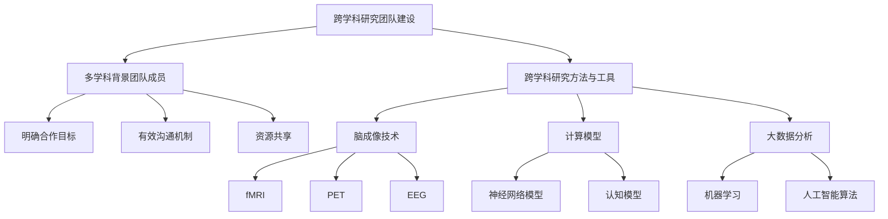
这一流程图展示了跨学科研究团队建设的方法与工具，强调了多学科合作、资源共享以及脑成像技术、计算模型和大数据分析在跨学科研究中的应用。

通过上述分析，我们可以看到脑科学与心理学在未来发展中面临的前景和挑战，以及实现跨学科整合的策略与实践。脑科学与心理学的融合将为理解人类心智和大脑功能提供新的视角和方法，推动心理学和脑科学的发展，并为现实世界中的心理健康和社会问题提供解决方案。在未来的研究中，跨学科整合将继续发挥关键作用，促进脑科学与心理学的共同进步。

##### 9. 结论

脑科学与心理学的整合研究为理解人类心智和大脑功能提供了新的视角和方法，具有重要的科学和现实意义。以下是对整合研究意义的总结以及未来展望：

###### 9.1 脑科学与心理学的整合意义

**提升对人类心智的理解**：脑科学与心理学的整合研究有助于揭示大脑如何实现复杂的认知功能，如注意力、记忆、决策和情绪处理。通过结合脑成像技术、计算模型和大数据分析，研究者能够更深入地了解大脑的工作机制，从而提升对人类心智的整体理解。

**促进跨学科研究的进展**：脑科学与心理学的整合不仅推动了各自领域的发展，也为其他跨学科研究提供了新的方法和工具。这种跨学科合作促进了科学知识的融合，为解决复杂的认知问题和心理健康问题提供了新的思路。

**增强心理健康干预的有效性**：通过理解大脑与心智的关系，整合研究为心理健康干预提供了科学的依据。例如，认知行为疗法、正念冥想和神经反馈训练等干预方法，在结合脑科学和心理学的理论基础上，显示出更好的治疗效果。

**推动技术创新**：脑科学与心理学的整合促进了神经技术创新，如脑机接口、虚拟现实和增强现实等技术的发展。这些技术不仅为临床和心理治疗提供了新的工具，也为认知增强和心理健康管理提供了新的手段。

###### 9.2 脑科学与心理学的整合展望

**未来方向**：未来的整合研究将在以下几个方向取得突破：

- **大脑功能的精细化研究**：随着脑成像技术和数据分析方法的进步，研究者将能够更加精细地描述大脑的功能区域和神经网络，揭示大脑与心智之间的复杂关系。

- **跨学科模型的构建**：通过整合不同学科的理论和方法，研究者将构建更加精确和复杂的认知模型，以模拟和预测大脑和心智的运作机制。

- **大数据与人工智能的应用**：大数据和人工智能技术在脑科学与心理学研究中的应用将不断扩展，为处理和分析复杂的神经数据提供新的工具和方法。

- **个性化医疗与教育**：基于脑科学与心理学的整合研究，个性化医疗和教育将得到进一步发展。例如，通过脑成像和大数据分析，可以开发出针对个体的个性化治疗方案和学习计划。

**现实世界中的应用**：整合研究将在现实世界中产生广泛的应用，包括：

- **心理健康干预**：通过理解大脑与心智的关系，开发更有效的心理健康干预方法，帮助个体应对心理问题和压力。

- **教育创新**：结合脑科学与教育心理学的理论，设计个性化教学方法和学习策略，提高教育效果和学习效率。

- **认知增强**：利用脑科学与心理学的方法，开发认知增强技术，帮助个体提升认知能力和工作效率。

- **社会行为分析**：通过理解社会心理的脑机制，开发社会行为分析和预测模型，为政策制定和社会管理提供科学依据。

通过上述分析，我们可以看到脑科学与心理学的整合研究在提升对人类心智理解、促进跨学科研究进展、增强心理健康干预有效性和推动技术创新等方面的重要意义。在未来，随着跨学科整合的不断深入，脑科学与心理学将继续在科学研究和现实世界中发挥重要作用，推动人类心智和大脑科学的进步。

### 作者信息

作者：AI天才研究院/AI Genius Institute & 禅与计算机程序设计艺术 /Zen And The Art of Computer Programming

---

本文详细探讨了脑科学与心理学整合的研究，从基础概念到应用领域，系统地展示了这一领域的最新进展和未来方向。通过结合脑成像技术、计算模型和跨学科方法，我们不仅深化了对人类心智的理解，也为心理健康干预、教育创新和认知增强提供了科学依据。希望本文能够为读者提供有价值的见解，激发对脑科学与心理学整合研究的兴趣和思考。作者AI天才研究院致力于推动人工智能和计算机科学的创新，同时，《禅与计算机程序设计艺术》也为计算机编程提供了深刻的文化哲学思考。希望未来能够与更多读者共同探索这一领域的无限可能。

