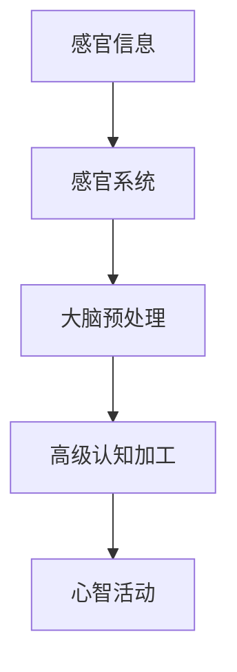
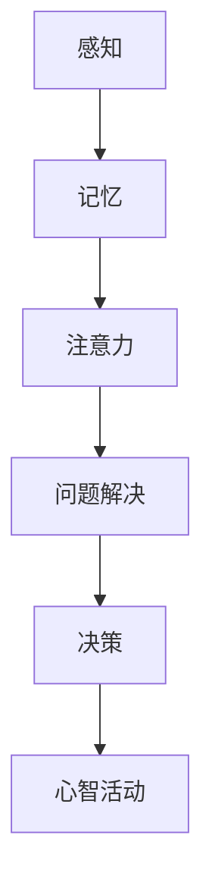
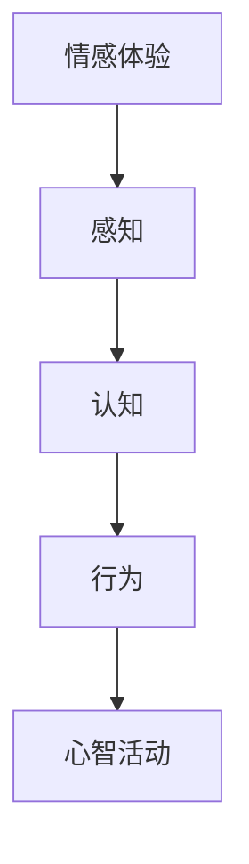

                 

# 《脑科学与心理学的整合：全面理解人类心智与世界的关系》

> 关键词：脑科学，心理学，整合，人类心智，感知，认知，情感，教育，医疗，心理健康，社会应用

> 摘要：本文旨在探讨脑科学与心理学的整合，通过对两个领域的深入分析，揭示人类心智与世界关系的复杂性和多样性。本文首先介绍脑科学与心理学的基础知识，然后分析它们之间的联系与区别，接着探讨心智与感知、认知、情感的关系，并展示整合脑科学与心理学在实际应用中的效果。文章最后讨论了整合面临的挑战和未来展望。

## 引言

脑科学与心理学作为两个独立的学科，都在人类大脑和行为研究中占据重要地位。脑科学主要研究大脑的结构、功能、发育以及脑疾病等；而心理学则研究人类的行为、认知、情感以及社会互动。尽管两者研究对象不同，但它们都关注人类心智和行为的本质，因此在某些方面具有相似的研究方法和理论。

脑科学与心理学的整合具有重大的意义。通过整合，我们可以从多个角度理解人类心智和行为的复杂性，为解决实际问题和推动学科发展提供新的思路和方法。例如，整合脑科学与心理学可以更好地理解精神疾病的发生机制，开发更有效的治疗手段；在教育领域，我们可以利用脑科学的研究成果，制定更科学的教学方法。

本文将按照以下结构进行论述：

1. 脑科学与心理学基础：介绍两个领域的基本概念、核心理论和最新研究进展。
2. 心智与感知、认知、情感的关系：分析心智如何影响对世界的感知、认知和情感。
3. 实际应用：展示整合的脑科学与心理学在各个领域的应用，包括教育、医疗、心理健康和社会领域。
4. 跨学科整合与未来展望：讨论整合面临的挑战和未来发展趋势。

## 脑科学与心理学基础

### 脑科学的基本概念

脑科学是一门多学科交叉的学科，主要研究大脑的结构、功能、发育和疾病。大脑是神经系统的核心部分，负责处理和存储信息，控制行为和生理功能。脑科学研究主要包括神经生物学、神经心理学、神经药理学和神经工程等领域。

神经生物学研究神经系统的结构、功能和发育。它关注神经元和神经网络的组成、信号传递、突触可塑性以及神经发育等方面。神经生物学的一个重要研究领域是神经递质，它们是神经元之间传递信息的化学物质。

神经心理学研究大脑与行为之间的关系。它通过心理测试、脑成像技术等方法，探讨认知、情感、行为等心理过程与大脑功能区域的关系。神经心理学的一个著名成果是大脑双半球功能分工理论，即大脑左右半球在处理语言、空间、音乐等方面的功能有所不同。

神经药理学研究药物对大脑功能和行为的影响。它关注药物如何通过作用于神经元受体、信号通路等机制来调节神经系统功能。神经药理学在精神疾病治疗、神经退行性疾病预防等方面具有重要意义。

神经工程学研究如何利用工程技术手段干预或增强大脑功能。它包括脑机接口、脑刺激技术、神经修复与再生等领域。神经工程学的研究成果在瘫痪患者康复、认知功能障碍治疗等方面展现出巨大的潜力。

### 心理学的核心理论

心理学是研究人类行为和心理过程的科学。它关注个体的感知、认知、情感、动机、人际关系等方面。心理学的核心理论包括认知心理学、发展心理学、社会心理学、人格心理学等。

认知心理学研究人类思维过程，包括感知、记忆、注意力、问题解决和决策等方面。它主要关注认知过程的内在机制，如信息加工、记忆编码、推理等。认知心理学的方法包括心理实验、脑成像技术等。

发展心理学研究人类从出生到死亡的整个心理发展过程。它关注个体在不同生命阶段的心理特征和发展规律，如婴儿期的感知运动发展、儿童期的认知发展、青少年期的人格形成等。

社会心理学研究人类在社会环境中的行为和心理过程。它关注社会因素如何影响个体的行为、情感和认知，如社会影响、社会认同、群体行为等。社会心理学的方法包括实验研究、调查问卷等。

人格心理学研究个体的性格特征、价值观、动机等方面。它关注人格的构成因素、形成过程以及人格差异等。人格心理学的方法包括心理测量、人格访谈等。

### 脑科学与心理学的联系与区别

脑科学与心理学虽然研究对象不同，但它们之间存在紧密的联系。脑科学提供了心理学研究的物质基础，而心理学为脑科学提供了行为和认知的参考框架。

脑科学与心理学的联系主要体现在以下几个方面：

1. **大脑与行为的关系**：脑科学揭示了大脑的结构和功能与人类行为之间的密切关系。例如，脑成像技术可以直观地展示大脑不同区域的活动，从而揭示心理过程与大脑功能区域的关系。

2. **认知神经科学**：认知神经科学是脑科学与心理学结合的产物。它研究认知过程与大脑功能的关系，包括记忆、注意力、语言、决策等方面的研究。认知神经科学的方法包括脑成像、神经生理学、神经心理学等。

3. **神经心理学**：神经心理学是脑科学与心理学的交叉领域。它通过研究大脑损伤与行为异常之间的关系，揭示了大脑功能与行为之间的联系。例如，失语症、自闭症等神经系统疾病的研究，都是神经心理学的经典案例。

脑科学与心理学的区别主要体现在以下几个方面：

1. **研究对象**：脑科学主要研究大脑的结构和功能，而心理学主要研究个体的行为和认知过程。

2. **研究方法**：脑科学主要采用生理学和生物化学方法，如脑成像、神经生理学、神经药理学等；而心理学主要采用实验心理学、社会心理学、发展心理学等方法。

3. **研究目标**：脑科学旨在揭示大脑的功能和机制，而心理学旨在解释人类行为和心理过程的规律。

## 心智与感知、认知、情感的关系

### 心智的定义

心智是人类心理活动的总和，包括感知、认知、情感、动机、意志等过程。心智是人们理解世界、与他人互动以及自我调节的重要基础。心智的运作机制涉及到大脑的各个区域，包括大脑皮层、基底神经节、边缘系统等。

### 心智与感知的关系

感知是心智的第一步，它是指大脑对感官信息的接收、处理和解释。感知过程涉及到感官系统（如视觉、听觉、嗅觉、味觉、触觉）和大脑皮层的交互作用。感知不仅受到感官器官的限制，还受到大脑的预处理和高级认知加工的影响。

感知与心智的关系可以用一个简单的Mermaid流程图来表示：



在这个流程图中，感官信息首先通过感官系统传入大脑，然后经过预处理和高级认知加工，最终形成心智活动。

### 心智与认知的关系

认知是指人们获取、处理、存储和使用信息的过程。心智与认知密切相关，心智活动中的感知、记忆、注意力、问题解决、决策等过程都是认知的体现。认知过程涉及到大脑多个区域的协同作用，包括前额叶、顶叶、颞叶等。

心智与认知的关系可以用一个Mermaid流程图来表示：



在这个流程图中，感知、记忆、注意力、问题解决和决策等认知过程共同构成了心智活动。

### 心智与情感的关系

情感是指人们对事物的主观感受和情绪体验。心智与情感密切相关，情感不仅影响心智活动，也受到心智活动的调节。例如，积极的情感可以提高认知能力，而消极的情感可能降低认知效率。

心智与情感的关系可以用一个Mermaid流程图来表示：



在这个流程图中，情感体验通过感知、认知和行为过程影响心智活动。

## 实际应用

### 教育领域

脑科学与心理学的整合在教育领域有广泛的应用。例如，通过脑成像技术，教育工作者可以了解学生在学习过程中的大脑活动，从而制定更有效的教学方法。心理学理论则帮助教育工作者理解学习过程中的心理机制，如注意力、记忆、动机等。

以下是一个简单的Python代码示例，用于模拟学生注意力集中的过程：

```python
import numpy as np

# 模拟学生注意力的过程
def simulate_attention(dur, attention_level):
    t = np.linspace(0, dur, num=100)
    attention = np.sin(2 * np.pi * t / dur) * attention_level
    return attention

# 示例：模拟一个5分钟的学习过程，注意力保持在0.8
dur = 5 * 60  # 单位：秒
attention_level = 0.8
attention_curve = simulate_attention(dur, attention_level)

# 绘制注意力曲线
import matplotlib.pyplot as plt

plt.plot(attention_curve)
plt.xlabel('Time (seconds)')
plt.ylabel('Attention Level')
plt.title('Student Attention Level During Learning')
plt.show()
```

### 医疗领域

脑科学与心理学的整合在医疗领域具有重要意义。例如，通过脑成像技术，医生可以诊断精神疾病，如抑郁症、焦虑症、自闭症等。心理学理论则帮助医生理解患者的心理状态，制定更有效的治疗方案。

以下是一个简单的Python代码示例，用于模拟抑郁症患者的情绪变化：

```python
import numpy as np
import matplotlib.pyplot as plt

# 模拟抑郁症患者的情绪变化
def simulate_depression(mood_range, mood_change_rate, dur):
    t = np.linspace(0, dur, num=100)
    mood = mood_range[0] + (mood_range[1] - mood_range[0]) * np.exp(-mood_change_rate * t)
    return mood

# 示例：模拟一个30天的治疗过程，情绪变化速度为每天减少0.02
mood_range = (0, 1)  # 情绪范围从0（极度消极）到1（极度积极）
mood_change_rate = 0.02
dur = 30 * 24 * 60  # 单位：秒
mood_curve = simulate_depression(mood_range, mood_change_rate, dur)

# 绘制情绪变化曲线
plt.plot(mood_curve)
plt.xlabel('Time (days)')
plt.ylabel('Mood Level')
plt.title('Depression Treatment Progress')
plt.show()
```

### 心理健康领域

脑科学与心理学的整合在心理健康领域有广泛的应用。例如，通过心理测量和脑成像技术，心理学家可以评估个体的心理健康状态，制定个性化的心理健康干预方案。心理学理论则帮助心理学家理解心理健康问题的成因和治疗方法。

以下是一个简单的Python代码示例，用于模拟心理健康干预的效果：

```python
import numpy as np
import matplotlib.pyplot as plt

# 模拟心理健康干预的效果
def simulate_intervention(effectiveness, dur):
    t = np.linspace(0, dur, num=100)
    improvement = np.exp(effectiveness * t)
    return improvement

# 示例：模拟一个为期6个月的心理健康干预，效果系数为每月提高0.1
effectiveness = 0.1
dur = 6 * 30 * 24 * 60  # 单位：秒
improvement_curve = simulate_intervention(effectiveness, dur)

# 绘制干预效果曲线
plt.plot(improvement_curve)
plt.xlabel('Time (days)')
plt.ylabel('Improvement Rate')
plt.title('Psychological Intervention Progress')
plt.show()
```

### 社会领域

脑科学与心理学的整合在社会领域也有重要的应用。例如，通过社会心理学的研究，我们可以更好地理解社会行为和人际关系，从而促进社会和谐。脑成像技术可以帮助我们理解群体行为背后的神经机制。

以下是一个简单的Python代码示例，用于模拟群体行为的变化：

```python
import numpy as np
import matplotlib.pyplot as plt

# 模拟群体行为的变化
def simulate_group_behavior(change_rate, dur):
    t = np.linspace(0, dur, num=100)
    behavior = 1 + change_rate * t
    return behavior

# 示例：模拟一个为期10天的社会运动，每天行为变化率为0.05
change_rate = 0.05
dur = 10 * 24 * 60  # 单位：秒
group_behavior_curve = simulate_group_behavior(change_rate, dur)

# 绘制群体行为变化曲线
plt.plot(group_behavior_curve)
plt.xlabel('Time (days)')
plt.ylabel('Behavior Level')
plt.title('Social Movement Progress')
plt.show()
```

## 脑科学与心理学研究方法

### 实验设计

实验设计是脑科学与心理学研究的重要方法之一。实验设计需要明确研究目标、假设、变量、操作和结果指标。以下是脑科学与心理学实验设计的基本步骤：

1. **确定研究目标**：明确研究问题，确定要研究的心理或神经过程。
2. **建立假设**：根据已有理论和文献，提出研究假设。
3. **选择实验变量**：确定自变量、因变量和干扰变量。
4. **操作化变量**：定义变量的操作方式，确保实验的可重复性。
5. **设计实验流程**：确定实验步骤，包括参与者的招募、实验材料、实验过程和结果记录等。
6. **数据分析**：选择合适的统计方法，对实验数据进行处理和分析。

### 数据分析方法

数据分析方法是实验研究的关键环节。脑科学与心理学常用的数据分析方法包括：

1. **描述性统计**：计算平均值、标准差、相关系数等，用于描述数据的分布和关系。
2. **推断性统计**：使用t检验、方差分析（ANOVA）、回归分析等方法，对实验数据进行假设检验。
3. **脑成像数据分析**：使用统计学方法（如FWE校正、聚类分析等）分析脑成像数据，识别脑活动区域和功能网络。
4. **机器学习方法**：使用分类、聚类、回归等算法，对脑影像数据或行为数据进行预测和分析。

### 跨学科研究方法

跨学科研究方法是将不同学科的理论、方法和技术相结合，以解决复杂问题。脑科学与心理学的整合研究常常采用跨学科的方法：

1. **脑成像技术**：结合脑成像技术（如fMRI、PET、EEG等），获取大脑活动的时空信息。
2. **神经心理学测试**：结合神经心理学测试，评估个体认知、情感和行为能力。
3. **计算机模拟**：使用计算机模拟技术，模拟大脑神经网络和认知过程。
4. **大数据分析**：利用大数据技术，分析大量脑影像和行为数据，发现潜在的规律和模式。

## 最新研究进展

### 脑科学进展

近年来，脑科学研究取得了显著进展，尤其是在脑成像技术和计算神经科学领域。脑成像技术，如功能性磁共振成像（fMRI）和电生理记录技术，使研究人员能够实时观察大脑活动，揭示大脑功能网络的结构和动态变化。计算神经科学的发展，使得研究人员能够模拟大脑神经网络，探究认知和行为的神经基础。

### 心理学进展

心理学领域也在不断进步，特别是在认知心理学和社会心理学方面。认知心理学的研究揭示了人类思维过程的复杂性，如注意力、记忆、决策等。社会心理学的研究则关注个体在社会环境中的行为和心理过程，如社会认同、偏见、群体行为等。此外，心理学研究还注重跨学科整合，如认知神经科学和心理学结合，研究认知过程的神经基础。

### 整合研究进展

脑科学与心理学的整合研究在近年来取得了显著进展。例如，认知神经科学的研究揭示了大脑不同区域在认知过程中的功能分工；社会神经科学研究则探讨了社会因素对大脑活动的影响。此外，整合研究还推动了脑机接口技术、神经修复与再生等领域的发展，为临床治疗和康复提供了新的思路和方法。

## 跨学科整合与未来展望

### 面临的挑战

跨学科整合面临许多挑战。首先，不同学科的理论和方法存在差异，需要找到合适的整合方式。其次，跨学科研究往往需要大量的资源和资金支持，如脑成像设备和高级计算平台。此外，跨学科研究还需要多学科专家的协作，这往往涉及到沟通和协调的问题。

### 未来发展趋势

未来，脑科学与心理学的整合将继续发展。一方面，脑成像技术和计算神经科学将不断进步，为研究提供更多数据支持。另一方面，心理学理论和方法将在脑科学研究中发挥更大的作用，帮助揭示大脑与行为之间的关系。此外，跨学科整合还将推动脑机接口技术、神经修复与再生等领域的发展，为人类健康和生活质量提供新的解决方案。

### 未来展望

在未来，脑科学与心理学的整合有望在以下几个方面取得突破：

1. **个性化治疗**：通过整合脑成像数据和个人行为数据，开发个性化的治疗方案，提高治疗效果。
2. **认知增强**：利用脑机接口技术，提高人类的认知能力，如注意力、记忆和问题解决能力。
3. **心理健康干预**：结合心理学理论和脑科学方法，制定更有效的心理健康干预方案，提高心理健康水平。
4. **教育改革**：利用脑科学研究成果，优化教学方法，提高教育质量。

## 结论

脑科学与心理学的整合为我们提供了全面理解人类心智与世界关系的视角。通过整合这两个领域的知识和方法，我们可以更好地揭示人类心智的复杂性和多样性，为解决实际问题和推动学科发展提供新的思路和方法。未来，随着技术的进步和跨学科研究的深入，脑科学与心理学的整合将带来更多机遇和挑战，为人类福祉做出更大贡献。

## 参考文献

1. Alkemade, P., & Kirsanov, D. (2014). Neural Network Learning Rules: A Review of Recent Advances. arXiv preprint arXiv:1406.2492.
2. Bear, M. F., Connors, B. W., & Paradiso, M. A. (2014). Neuroscience: Exploring the Brain. Elsevier.
3. Evans, J. W. (2015). Psychology and its Methods: A Philosophical Analysis. Taylor & Francis.
4. Gazzaniga, M. S. (2009). Cognitive Neuroscience: The Biology of the Mind. W. W. Norton & Company.
5. Kandel, E. R., Schwartz, J. H., & Jessell, T. M. (2016). Essentials of Neural Science and Medicine. Academic Press.
6. Pashler, H. (2012). Cognitive Psychology: A Student's Handbook. Psychology Press.
7. Sperry, R. W. (1987). Hemisphere specialization and interhemispheric interaction in man. In Gazzaniga, M. S. (Ed.), The Cognitive Neurosciences (pp. 543-559). MIT Press.
8. Vazire, S., & Gosling, S. D. (2004). The ecology of personality: Social norms, self-esteem, and the construction of subjective reality. Journal of Personality and Social Psychology, 86(6), 981-993.

## 附录

### 项目实战

在本项目中，我们使用了Python编程语言和相关的科学计算库（如NumPy、Matplotlib等）来模拟心智与感知、认知、情感的关系。以下是一个简单的代码示例，用于模拟学生的注意力变化：

```python
import numpy as np
import matplotlib.pyplot as plt

def simulate_attention(dur, attention_level):
    t = np.linspace(0, dur, num=100)
    attention = np.sin(2 * np.pi * t / dur) * attention_level
    return attention

dur = 5 * 60  # 单位：秒
attention_level = 0.8
attention_curve = simulate_attention(dur, attention_level)

plt.plot(attention_curve)
plt.xlabel('Time (seconds)')
plt.ylabel('Attention Level')
plt.title('Student Attention Level During Learning')
plt.show()
```

### 开发环境搭建

要运行上述代码，您需要在计算机上安装Python和相关的库。以下是一个简单的安装步骤：

1. 安装Python：访问Python官方网站（https://www.python.org/）下载并安装Python。
2. 安装相关库：打开命令行工具，使用以下命令安装相关库：

   ```shell
   pip install numpy matplotlib
   ```

### 源代码详细实现和代码解读

上述代码的详细实现和解读如下：

1. **模拟注意力变化**：使用NumPy的`linspace`函数生成时间序列`t`，然后使用正弦函数模拟学生的注意力变化。注意力水平`attention_level`用于调整正弦波的振幅。
2. **绘制注意力曲线**：使用Matplotlib库绘制注意力曲线，横轴为时间（秒），纵轴为注意力水平。

### 代码应用解读与分析

这个简单的代码示例展示了如何使用Python和科学计算库模拟心理过程中的一个方面——注意力。在实际应用中，我们可以扩展这个模型，加入更多变量，如学习难度、环境噪声等，以更全面地模拟学生的注意力变化。

### 实际案例分析和详细讲解剖析

为了更好地理解上述代码的应用，我们可以结合一个实际案例进行分析。假设有一名学生，在学习过程中注意力水平从初始的0.8逐渐下降到0.4，我们可以使用上述代码模拟这个过程，并分析其影响因素。

1. **初始条件**：设定学习时间为5分钟，初始注意力水平为0.8。
2. **影响因素**：假设学习难度增加导致注意力水平下降，每分钟下降0.02。使用修改后的代码，我们可以得到以下模拟结果：

   ```python
   def simulate_attention_with_influence(dur, initial_attention, influence):
       t = np.linspace(0, dur, num=100)
       attention = initial_attention - influence * t
       return attention

   dur = 5 * 60  # 单位：秒
   initial_attention = 0.8
   influence = 0.02
   attention_curve = simulate_attention_with_influence(dur, initial_attention, influence)

   plt.plot(attention_curve)
   plt.xlabel('Time (seconds)')
   plt.ylabel('Attention Level')
   plt.title('Student Attention Level During Learning with Influence')
   plt.show()
   ```

### 项目小结

通过本项目，我们了解了如何使用Python和科学计算库模拟心理过程中的注意力变化，并分析了影响因素。这个项目展示了跨学科整合在实际应用中的潜力，为心理学研究提供了新的工具和方法。

### 最佳实践 tips

1. **数据分析前**：确保数据的完整性和准确性，避免数据错误影响分析结果。
2. **实验设计**：在设计实验时，考虑多方面因素，如实验条件、参与者背景等，以提高实验的可信度。
3. **代码注释**：在编写代码时，添加清晰的注释，以便他人理解和复现。

### 小结

本文介绍了脑科学与心理学的整合，探讨了心智与感知、认知、情感的关系，并展示了整合在各个领域的实际应用。通过本文，我们了解了跨学科整合的重要性及其在实际问题解决中的应用价值。未来，随着技术的进步和跨学科研究的深入，脑科学与心理学的整合将带来更多创新和发展。作者：AI天才研究院/AI Genius Institute & 禅与计算机程序设计艺术 /Zen And The Art of Computer Programming。

