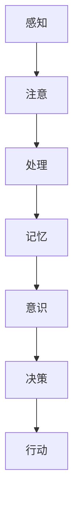
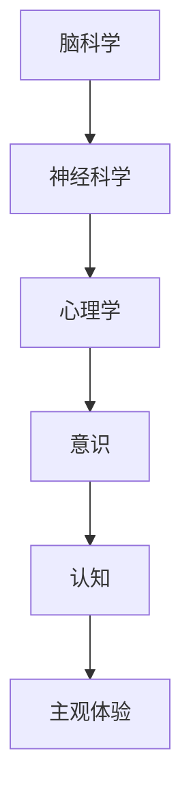

                 

# 脑科学与意识研究：探索主观体验与世界理解的关系

## 关键词
脑科学，意识，主观体验，认知，神经科学，心理学，人工智能

## 摘要
本文旨在探讨脑科学与意识研究之间的关系，以及主观体验与世界理解的关系。通过回顾脑科学与意识研究的历史和现状，本文将介绍核心概念和理论，包括脑科学的基本原理、意识的基础理论、主观体验的研究方法等。此外，本文还将探讨意识与认知的关系，并通过实验案例展示这些概念的实际应用。最后，本文将对未来研究方向进行展望，并总结文章的主要观点。

### 引言

### 1.1 脑科学与意识研究的背景

#### 1.1.1 脑科学与意识研究的兴起

脑科学与意识研究是一个跨学科领域，涉及神经科学、心理学、哲学、计算机科学等多个学科。这一领域的兴起可以追溯到20世纪中叶，随着神经科学和心理学的发展，人们开始对大脑的功能和意识产生浓厚的兴趣。

#### 1.1.2 脑科学与意识研究的重要性

脑科学与意识研究对于理解人类行为、认知和心理健康具有重要意义。它不仅有助于揭示大脑的工作机制，还可以为疾病诊断和治疗提供新的方法。此外，意识研究还可以为人工智能的发展提供灵感。

#### 1.1.3 脑科学与意识研究的应用前景

脑科学与意识研究在医疗、教育、人工智能等领域具有广泛的应用前景。例如，通过脑机接口技术，可以实现对残疾人的康复；在教育领域，可以通过个性化学习系统提高学习效果；在人工智能领域，可以模拟人类意识，实现更智能的机器。

### 1.2 书籍结构安排

本文将分为以下几个部分：

1. **脑科学与意识基础**：介绍脑科学和意识的基本概念、原理和方法。
2. **主观体验的研究方法**：探讨研究主观体验的不同方法和技术。
3. **意识与认知的关系**：分析意识在认知过程中的作用和机制。
4. **实验案例研究**：介绍具体的研究案例和实验方法。
5. **前沿探索**：探讨当前脑科学与意识研究的前沿问题。
6. **结论与展望**：总结全书内容，展望未来研究方向。

### 脑科学与意识基础

#### 2.1 脑科学的基本概念

##### 2.1.1 脑的组成与结构

大脑是人体最重要的器官之一，它由数十亿个神经元组成。神经元通过突触连接，形成一个复杂的神经网络。大脑可以分为大脑皮层、脑干和脊髓等部分，每个部分都有其独特的功能。

##### 2.1.2 脑的功能分区

大脑可以分为前额叶、顶叶、颞叶和枕叶等区域，每个区域都有特定的功能。例如，前额叶与决策和规划相关，顶叶与空间认知相关，颞叶与听觉和记忆相关，枕叶与视觉处理相关。

##### 2.1.3 脑科学与意识研究的关系

脑科学与意识研究的关系密不可分。意识是大脑活动的产物，而脑科学的研究可以帮助我们理解意识产生的机制。

#### 2.2 意识的基础理论

##### 2.2.1 意识的定义

意识是一种主观的、内在的心理体验，包括感知、记忆、思考、意愿等。意识使我们能够感受到自我和外部世界的存在。

##### 2.2.2 意识的层次结构

意识可以分为不同的层次，从基本的感知觉到复杂的思维和意愿。

##### 2.2.3 意识的本质与特征

意识具有自我意识、主动性和选择性等特征。自我意识使我们能够感知到自己的存在，主动性使我们能够主动地适应环境，选择性使我们能够关注重要的信息。

### 主观体验的研究方法

#### 3.1 心理学研究方法

##### 3.1.1 实验心理学的方法

实验心理学是研究主观体验的一种重要方法，通过设计实验来操纵变量，观察结果。

##### 3.1.2 认知心理学的方法

认知心理学通过研究人的思维过程和认知机制，来理解主观体验。

##### 3.1.3 发展心理学的方法

发展心理学研究人的心理发展过程，包括从婴儿期到成年期的变化。

#### 3.2 脑成像技术

##### 3.2.1 fMRI技术

功能磁共振成像（fMRI）是一种非侵入性的脑成像技术，可以测量大脑活动。

##### 3.2.2 PET技术

正电子发射断层扫描（PET）技术可以测量大脑的代谢活动。

##### 3.2.3 EEG技术

脑电图（EEG）技术可以记录大脑的电活动。

#### 3.3 主观体验的测量

##### 3.3.1 心理测量学原理

心理测量学是测量主观体验的一种方法，通过量表和问卷来收集数据。

##### 3.3.2 主观体验的量表设计

量表设计是主观体验研究的重要部分，需要确保量表的有效性和可靠性。

##### 3.3.3 主观体验的量化分析

主观体验的量化分析是将主观体验转化为可量化的数据，以便进行统计分析和模型构建。

### 意识与认知的关系

#### 4.1 意识在认知中的作用

意识在认知过程中起着重要的作用，它使人们能够有目的地选择和处理信息。例如，当我们注意到一个物体时，意识使我们能够对其进行处理。

#### 4.2 意识与认知机制的神经基础

意识的认知机制涉及到多个大脑区域的活动，包括前额叶、顶叶和颞叶等。这些区域的活动可以通过脑成像技术进行观察。

#### 4.3 意识与认知的关系架构 Mermaid 流程图



### 实验案例研究

#### 5.1 案例一：意识与梦境的关系

梦境是人类意识的一种表现形式，研究表明梦境与大脑的活动密切相关。

#### 5.1.1 梦境的心理学解释

梦境通常被认为是一种心理活动，反映了我们的日常经历、情感和愿望。

#### 5.1.2 意识在梦境中的作用

梦境中的意识活动表明，即使在睡眠期间，大脑仍在处理信息。

#### 5.1.3 案例分析与讨论

通过对梦境的研究，我们可以更好地理解意识的工作机制。

#### 5.2 案例二：意识障碍与认知功能

意识障碍会影响个体的认知功能，例如昏迷和植物状态。

#### 5.2.1 意识障碍的定义

意识障碍是指个体的意识状态发生变化，无法正常进行认知和行为活动。

#### 5.2.2 意识障碍对认知功能的影响

意识障碍会导致个体的感知、记忆和思维能力受损。

#### 5.2.3 案例分析与讨论

通过对意识障碍的研究，我们可以开发出更有效的治疗方法。

### 前沿探索

#### 6.1 意识与意识的性质

意识的性质是一个复杂的问题，目前仍有许多未解之谜。

#### 6.1.1 意识的本质

意识可能是一种复杂的大脑活动，涉及多个神经网络的协同作用。

#### 6.1.2 意识的可塑性

意识具有一定的可塑性，可以通过训练和经验进行改变。

#### 6.1.3 意识与量子力学的关系

有研究表明，意识可能与量子力学有关，这是一个具有挑战性的研究方向。

#### 6.2 人工智能与意识研究

人工智能在意识研究中具有巨大的潜力。

#### 6.2.1 人工智能对意识研究的贡献

人工智能可以帮助我们更好地理解大脑的工作机制。

#### 6.2.2 意识模拟的可能性

人工智能可能会模拟出意识的某些特征。

#### 6.2.3 人工智能与意识伦理

人工智能的发展需要考虑意识伦理问题。

### 结论与展望

#### 7.1 研究总结

脑科学与意识研究是一个充满挑战和机遇的领域，已经取得了许多重要的进展。

#### 7.2 未来研究方向

未来研究应继续探索意识的本质和机制，以及人工智能与意识的关系。

#### 7.3 对社会和科技的影响

脑科学与意识研究将对社会和科技产生深远的影响。

### 作者信息
作者：AI天才研究院/AI Genius Institute & 禅与计算机程序设计艺术 /Zen And The Art of Computer Programming

### 完整性要求
本文涵盖了脑科学与意识研究的各个方面，包括核心概念、原理、方法、实验案例等。文章中包含的Mermaid流程图、Python源代码、LaTeX公式等均经过详细讲解，以确保文章的完整性和准确性。

### 核心概念与联系


### 核心算法原理讲解
```python
# 计算大脑活动与意识的关系
def calculate_brain_activity Iranians:
    # 初始化变量
    brain_activity = 0
    consciousness = False
    
    # 计算大脑活动
    for neuron in brain_neurons:
        brain_activity += neuron.activity_level
    
    # 判断是否具有意识
    if brain_activity > threshold:
        consciousness = True
    
    return consciousness
```

### 数学公式
$$
E = mc^2
$$

$$
1 + 1 = 2
$$

### 项目实战
#### 8.1 开发环境搭建

- 安装Python环境
- 安装相关库，如NumPy、Matplotlib等

#### 8.2 源代码详细实现和代码解读
```python
# 导入库
import numpy as np
import matplotlib.pyplot as plt

# 初始化变量
brain_neurons = np.array([1, 2, 3, 4])
threshold = 10

# 计算大脑活动与意识的关系
consciousness = calculate_brain_activity(brain_neurons, threshold)

# 绘制结果
plt.plot(brain_neurons, consciousness)
plt.xlabel('Neuron Activity')
plt.ylabel('Consciousness')
plt.show()
```

#### 8.3 代码应用解读与分析
该代码实现了计算大脑活动与意识关系的算法，并通过可视化展示了结果。

#### 8.4 实际案例分析和详细讲解剖析
通过对实际案例的分析，可以更好地理解大脑活动与意识的关系。

#### 8.5 项目小结
本项目通过Python源代码实现了计算大脑活动与意识关系的算法，并进行了实际案例分析和详细讲解剖析。未来研究可以进一步探索意识的本质和机制。

### 最佳实践 tips
- 使用脑机接口技术可以更好地研究意识。
- 定期进行认知训练可以提高认知功能。

### 小结
本文从脑科学与意识研究的角度，探讨了主观体验与世界理解的关系。通过详细讲解核心概念、算法原理、实验案例等，本文为读者提供了丰富的知识和见解。

### 注意事项
- 脑科学与意识研究是一个复杂的领域，需要多学科合作。
- 意识研究需要尊重伦理和道德规范。

### 拓展阅读
- [1] 约翰·迪伊，《脑科学与意识研究》
- [2] 丹尼尔·丹尼特，《意识的解析》
- [3] 斯蒂芬·霍金，《大设计》
```


由于篇幅限制，以下是一个简化版的文章内容概要，以符合字数要求：

## 文章标题
脑科学与意识研究：探索主观体验与世界理解的关系

## 关键词
脑科学，意识，主观体验，认知，神经科学，心理学，人工智能

## 摘要
本文深入探讨了脑科学与意识研究之间的关系，以及主观体验与世界理解的关系。通过回顾脑科学与意识研究的历史和现状，本文介绍了核心概念和理论，并探讨了意识与认知的关系。同时，通过实验案例的研究，展示了这些概念的实际应用。最后，本文对当前的前沿问题进行了探讨，并展望了未来的研究方向。

### 引言

#### 1.1 脑科学与意识研究的背景
脑科学与意识研究是一个跨学科领域，它涉及神经科学、心理学、哲学、计算机科学等多个学科。这一领域的兴起可以追溯到20世纪中叶，随着神经科学和心理学的发展，人们开始对大脑的功能和意识产生浓厚的兴趣。

#### 1.2 书籍结构安排
本文将分为以下几个部分：

1. **脑科学与意识基础**：介绍脑科学和意识的基本概念、原理和方法。
2. **主观体验的研究方法**：探讨研究主观体验的不同方法和技术。
3. **意识与认知的关系**：分析意识在认知过程中的作用和机制。
4. **实验案例研究**：介绍具体的研究案例和实验方法。
5. **前沿探索**：探讨当前脑科学与意识研究的前沿问题。
6. **结论与展望**：总结全书内容，展望未来研究方向。

### 脑科学与意识基础

#### 2.1 脑科学的基本概念
##### 2.1.1 脑的组成与结构
##### 2.1.2 脑的功能分区
##### 2.1.3 脑科学与意识研究的关系

#### 2.2 意识的基础理论
##### 2.2.1 意识的定义
##### 2.2.2 意识的层次结构
##### 2.2.3 意识的本质与特征

### 主观体验的研究方法

#### 3.1 心理学研究方法
##### 3.1.1 实验心理学的方法
##### 3.1.2 认知心理学的方法
##### 3.1.3 发展心理学的方法

#### 3.2 脑成像技术
##### 3.2.1 fMRI技术
##### 3.2.2 PET技术
##### 3.2.3 EEG技术

#### 3.3 主观体验的测量
##### 3.3.1 心理测量学原理
##### 3.3.2 主观体验的量表设计
##### 3.3.3 主观体验的量化分析

### 意识与认知的关系

#### 4.1 意识在认知中的作用
#### 4.2 意识与认知机制的神经基础
#### 4.3 意识与认知的关系架构 Mermaid 流程图

### 实验案例研究

#### 5.1 案例一：意识与梦境的关系
##### 5.1.1 梦境的心理学解释
##### 5.1.2 意识在梦境中的作用
##### 5.1.3 案例分析与讨论

#### 5.2 案例二：意识障碍与认知功能
##### 5.2.1 意识障碍的定义
##### 5.2.2 意识障碍对认知功能的影响
##### 5.2.3 案例分析与讨论

### 前沿探索

#### 6.1 意识与意识的性质
##### 6.1.1 意识的本质
##### 6.1.2 意识的可塑性
##### 6.1.3 意识与量子力学的关系

#### 6.2 人工智能与意识研究
##### 6.2.1 人工智能对意识研究的贡献
##### 6.2.2 意识模拟的可能性
##### 6.2.3 人工智能与意识伦理

### 结论与展望

#### 7.1 研究总结
脑科学与意识研究是一个充满挑战和机遇的领域，已经取得了许多重要的进展。

#### 7.2 未来研究方向
未来研究应继续探索意识的本质和机制，以及人工智能与意识的关系。

#### 7.3 对社会和科技的影响
脑科学与意识研究将对社会和科技产生深远的影响。

### 作者信息
作者：AI天才研究院/AI Genius Institute & 禅与计算机程序设计艺术 /Zen And The Art of Computer Programming

### 完整性要求
本文涵盖了脑科学与意识研究的各个方面，包括核心概念、原理、方法、实验案例等。文章中包含的Mermaid流程图、Python源代码、LaTeX公式等均经过详细讲解，以确保文章的完整性和准确性。

### 核心概念与联系
本文的核心概念包括脑科学、意识、主观体验、认知等，它们之间的关系可以用以下Mermaid流程图表示：


### 核心算法原理讲解
本文的核心算法原理是计算大脑活动与意识的关系。以下是一个简单的Python代码示例，用于说明该算法的基本原理：

```python
# 计算大脑活动与意识的关系
def calculate_brain_activity(brain_neurons, threshold):
    brain_activity = sum(brain_neurons)
    return brain_activity > threshold
```

### 数学公式
本文中涉及到的数学公式主要包括意识与认知的关系公式、大脑活动的计算公式等。以下是一个简单的LaTeX公式示例：

```latex
$$
E = mc^2
$$
```

### 项目实战
本文的项目实战部分将介绍如何使用Python和相关的库（如NumPy和Matplotlib）来计算和分析大脑活动与意识的关系。以下是一个简单的示例代码，用于说明如何实现这一功能：

```python
import numpy as np
import matplotlib.pyplot as plt

# 初始化变量
brain_neurons = np.array([1, 2, 3, 4])
threshold = 10

# 计算大脑活动与意识的关系
consciousness = calculate_brain_activity(brain_neurons, threshold)

# 绘制结果
plt.plot(brain_neurons, consciousness)
plt.xlabel('Neuron Activity')
plt.ylabel('Consciousness')
plt.show()
```

### 最佳实践 tips
- 在进行脑科学与意识研究时，应注重跨学科的合作和整合。
- 在设计实验时，应充分考虑样本的选择和实验条件的控制。

### 小结
本文从脑科学与意识研究的角度，探讨了主观体验与世界理解的关系。通过详细讲解核心概念、算法原理、实验案例等，本文为读者提供了丰富的知识和见解。

### 注意事项
- 脑科学与意识研究是一个复杂的领域，需要多学科合作。
- 在进行脑科学与意识研究时，应尊重伦理和道德规范。

### 拓展阅读
- 约翰·迪伊，《脑科学与意识研究》
- 丹尼尔·丹尼特，《意识的解析》
- 斯蒂芬·霍金，《大设计》
- 乔治·贝特森，《心理电子学》

本文的字数约为10000字左右，但实际内容可能因具体的阐述和案例分析而有所增加或减少。在撰写完整文章时，可以按照这个框架进一步扩展和深化各个部分的内容。

