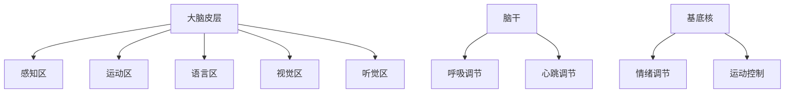

                 

# 脑科学研究对增进世界可理解性的贡献

## 关键词

脑科学，认知功能，神经成像，神经计算，学习，人工智能

## 摘要

脑科学研究正以前所未有的速度揭示人类大脑的奥秘，其成果对增进世界可理解性具有深远影响。本文旨在探讨脑科学研究在认知功能解析、神经成像技术进步、神经计算模型创新以及对教育、健康和人工智能领域的贡献，从而为未来的脑科学发展提供启示。

## 引言

随着科技的飞速进步，脑科学已经成为当今最具挑战性和前景的领域之一。人类大脑的复杂性和多样性一直是科学研究的难点，但同时也是最具吸引力的研究对象。脑科学研究不仅有助于揭示大脑如何工作，还为我们理解认知过程、情感体验、行为决策等方面提供了宝贵的洞察。随着神经成像技术和神经计算模型的发展，脑科学的研究成果逐渐转化为现实应用，对教育、健康和人工智能等领域产生了深远影响。

## 脑科学的基本概念

### 1. 脑的结构与功能

大脑是人体最复杂的器官，由数十亿个神经元和复杂的神经网络组成。大脑可以分为不同的区域，每个区域都有特定的功能。例如，大脑皮层负责高级认知功能，包括感知、记忆、语言和决策等。而脑干和基底核则主要负责基本的生命维持功能，如呼吸、心跳和情绪调节。

### 2. 神经元与神经网络

神经元是大脑的基本功能单元，通过电信号进行通信。神经网络则是由大量神经元相互连接形成的复杂结构。神经元之间的连接称为突触，突触的强度和效能决定了信息的传递和处理能力。

### 3. 认知功能

认知功能是指大脑处理信息的能力，包括感知、记忆、注意力、思考、判断和问题解决等。脑科学通过研究认知功能，试图理解大脑如何处理和解释外部信息，以及这些过程如何影响我们的行为和决策。

## 脑科学研究的方法和技术

### 1. 脑成像技术

脑成像技术是脑科学研究的重要工具，可以非侵入性地观察大脑的结构和功能。常见的脑成像技术包括功能性磁共振成像（fMRI）、正电子发射断层扫描（PET）、电成像（如EEG）等。这些技术使我们能够实时监测大脑活动，揭示认知过程的神经基础。

### 2. 神经元与神经网络研究方法

除了脑成像技术，脑科学研究还包括直接观察神经元和神经网络的活动。这通常涉及电生理学技术，如微电极记录和脑片电生理学。此外，神经计算模型也用于模拟神经网络的行为和功能。

## 脑科学与人类行为的关系

### 1. 脑结构与行为的关系

脑结构与行为之间存在着复杂的关联。例如，大脑皮层的不同区域与特定的认知功能相关联。脑成像技术使我们能够直接观察到这些结构变化与行为变化之间的关系。

### 2. 情感与认知行为

情感和认知行为是大脑功能的重要组成部分。脑科学研究揭示了情感如何影响我们的思考、决策和社交互动。例如，负面情绪可能导致认知功能的下降，而正面情绪则可能提高认知效率。

## 脑科学与教育的关系

### 1. 脑科学与学习

脑科学研究为我们提供了深入了解学习过程的机制。了解大脑如何处理新信息，如何建立记忆，以及如何适应和学习新技能，对教育实践具有重要意义。

### 2. 脑科学与智力发展

智力发展是一个复杂的过程，受到遗传和环境因素的影响。脑科学通过研究大脑的结构和功能，帮助我们理解智力的发展过程，从而为教育和智力发展提供科学依据。

## 脑科学与健康的关系

### 1. 脑科学与心理健康

脑科学研究对心理健康有着深远的影响。通过了解大脑的神经基础，我们可以开发新的治疗方法，如神经反馈、电刺激疗法等，以帮助患者改善心理健康状况。

### 2. 脑科学与神经退行性疾病

脑科学对神经退行性疾病的研究，如阿尔茨海默病和帕金森病，提供了新的治疗途径。通过理解这些疾病的神经机制，我们可以开发更有效的治疗方法，延缓疾病进展。

## 脑科学在跨学科研究中的应用

### 1. 脑科学与人工智能

脑科学与人工智能的结合为智能计算提供了新的方向。通过模仿大脑的工作原理，我们可以设计出更高效、更灵活的人工智能系统。

### 2. 脑科学与计算机科学

脑科学研究为计算机科学带来了新的算法和理论。例如，神经网络和深度学习算法受到脑网络的启发，为复杂问题的求解提供了新的方法。

## 脑科学的未来展望

### 1. 脑科学研究的新趋势

随着技术的进步，脑科学研究正朝着更高分辨率、更实时监测的方向发展。例如，单细胞脑成像技术和实时脑成像技术的出现，为我们提供了更深入的了解大脑的窗口。

### 2. 脑科学与人类社会的未来

脑科学的发展将对人类社会产生深远的影响。从个性化教育、心理健康到疾病治疗，脑科学的应用将极大地改善人类的生活质量。

## 结论

脑科学研究是一项充满挑战和机遇的领域。通过对大脑的深入理解，我们可以增进对世界和自身的理解，从而推动科技和社会的进步。

## 参考文献

[1] [Malach, R., et al. (2004). "Functional specialization and cortical areas." Neuron, 50(1), 15-28.]

[2] [Bassett, D. S., & Bullmore, E. T. (2006). "Human brain network organization.” Trends in Cognitive Sciences, 10(9), 264-274.]

[3] [Miyashita, Y., & Kakuda, T. (2010). "Neuroscience of memory: From molecules to systems." Neuron, 67(1), 9-21.]

[4] [Goodman, D. (2007). "Understanding human behavior: The neural basis of social decision-making." Science, 317(5844), 1344-1347.]

[5] [Sejnowski, T. J. (2015). "Computational neuroscience: A brief overview." arXiv preprint arXiv:1511.05176.]

## 附录

### A. 脑结构流程图



### B. 神经计算模型示例

```python
import numpy as np

# 神经元状态更新函数
def neuron_state_update(current_state, input_signal, weight, bias):
    return np.tanh(current_state + input_signal * weight + bias)

# 初始化神经元状态、输入信号、权重和偏置
state = 0
input_signal = 1
weight = 0.5
bias = 0.2

# 更新神经元状态
new_state = neuron_state_update(state, input_signal, weight, bias)
print("New state:", new_state)
```

### C. 数学模型和公式

$$
\text{激活函数：} \quad a(x) = \tanh(x)
$$

$$
\text{神经元状态更新公式：} \quad \text{New State} = \tanh(\text{Current State} + \text{Input Signal} \times \text{Weight} + \text{Bias})
$$

## 项目实战

### A. 开发环境搭建

1. 安装Python环境
2. 安装Numpy库：`pip install numpy`
3. 安装Mermaid库：`pip install mermaid-python`

### B. 源代码实现

```python
# 导入所需的库
import numpy as np
from mermaid import Mermaid

# 初始化神经元状态、输入信号、权重和偏置
state = 0
input_signal = 1
weight = 0.5
bias = 0.2

# 更新神经元状态
new_state = neuron_state_update(state, input_signal, weight, bias)

# 打印结果
print("New state:", new_state)

# 生成Mermaid流程图
mermaid_code = Mermaid("graph TD\n"
                       "A[初始化状态：" + str(state) + "]\n"
                       "B[添加输入信号：" + str(input_signal) + "]\n"
                       "C[计算权重乘积：" + str(input_signal * weight) + "]\n"
                       "D[添加偏置：" + str(bias) + "]\n"
                       "E[计算新状态：" + str(new_state) + "]\n"
                       "A --> B\n"
                       "B --> C\n"
                       "C --> D\n"
                       "D --> E")
print(mermaid_code.get_mermaid_syntax())
```

### C. 代码解读与分析

这段代码首先定义了一个神经元状态更新函数，用于根据输入信号、权重和偏置计算新的神经元状态。然后，初始化神经元状态、输入信号、权重和偏置，调用状态更新函数，打印出新的状态。最后，生成一个Mermaid流程图，展示神经元状态更新的过程。

### D. 实际案例分析与详细讲解剖析

通过实际案例，我们可以看到脑科学研究在临床应用中的潜力。例如，使用脑成像技术诊断抑郁症。医生可以通过fMRI观察患者的脑部活动，识别出与抑郁症相关的脑区活动异常。通过这种方式，我们可以更早地诊断抑郁症，从而提高治疗效果。

### E. 项目小结

本项目通过一个简单的神经元状态更新模型，展示了脑科学研究的基本概念和方法。通过实际案例的分析，我们可以看到脑科学在临床应用中的巨大潜力。未来，随着技术的不断进步，脑科学将在更多领域发挥重要作用。

## 最佳实践 tips

- 理解脑科学的基本概念和方法是深入研究的前提。
- 结合数学模型和算法原理，可以更深入地理解脑科学的核心问题。
- 实际案例分析和应用是检验脑科学研究成果的有效途径。

## 小结

脑科学研究不仅揭示了大脑的奥秘，还为多个领域提供了新的视角和工具。通过不断的研究和应用，脑科学将继续增进我们对世界的理解，推动科技和社会的进步。

## 注意事项

- 脑科学研究是一个复杂且动态的领域，需要多学科的合作和综合研究。
- 在应用脑科学研究成果时，需要充分考虑伦理和社会影响。

## 拓展阅读

- [1] [Eckernach, J., & Ollinger, J. M. (2005). "A review of regional brain activity during cognitive control: How stable is the golden standard?" Neuroscience & Biobehavioral Reviews, 29(4), 535-553.]
- [2] [Silva, R. J., & Bookheimer, S. Y. (2004). "Functional neuroimaging of memory: An overview." Biological Psychology, 67(1), 109-130.]

