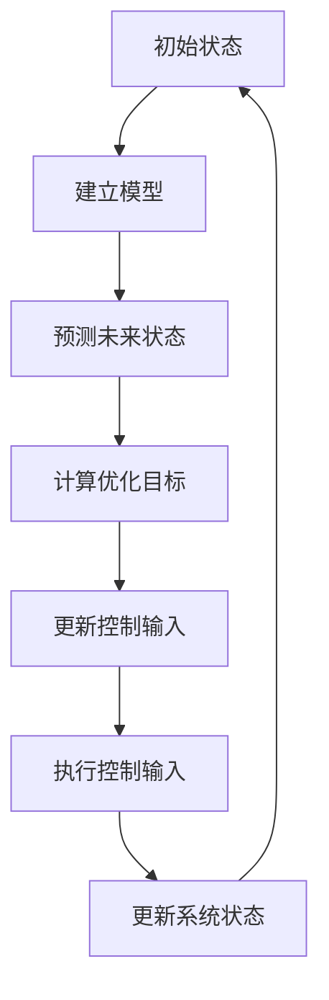
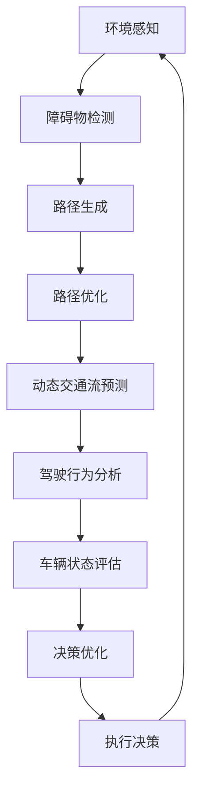
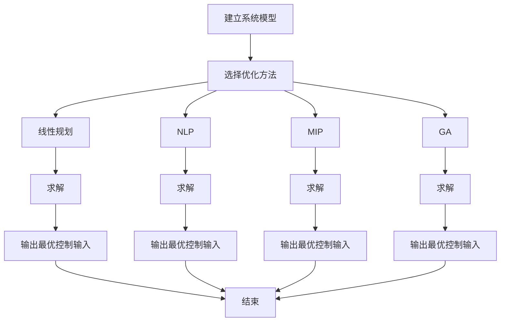
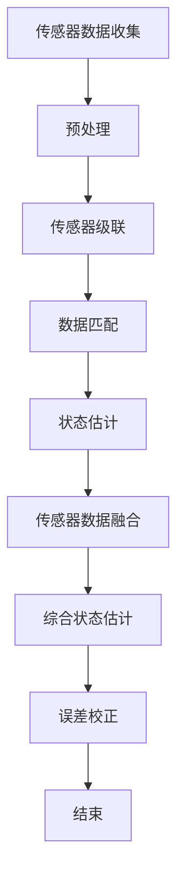
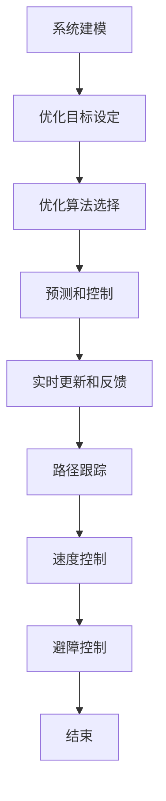

                 

## 文章标题：自动驾驶的模型预测控制：交通决策的数学优化

自动驾驶技术作为智能交通系统的重要组成部分，正逐渐从理论走向实践，深刻改变着人们的出行方式。然而，自动驾驶系统面临着复杂多变的交通环境和严格的实时性能要求，这要求我们采用高效且可靠的决策方法。本文将聚焦于自动驾驶中的模型预测控制（Model Predictive Control, MPC）及其在交通决策中的数学优化，旨在为读者提供一整套从理论基础到实践应用的全面视角。

关键词：**自动驾驶、模型预测控制、数学优化、交通决策、实时控制**

### 摘要

本文首先介绍了模型预测控制的基本概念和其在自动驾驶中的重要性。接着，探讨了交通决策的基本原则和优化方法，重点分析了常见的数学优化技术。随后，文章详细阐述了状态估计与传感器融合在自动驾驶中的作用，以及模型预测控制在实际自动驾驶系统中的应用实例。最后，文章通过对若干实际案例的深入分析，总结了模型预测控制在自动驾驶中的应用效果，并对未来发展方向和挑战进行了展望。

本文将帮助读者理解自动驾驶系统中模型预测控制的核心原理，掌握数学优化技术在交通决策中的具体应用，以及如何在复杂交通环境中实现高效的自动驾驶控制。通过本文的阅读，读者将能够更加深入地理解自动驾驶技术的关键问题，为未来自动驾驶技术的发展提供有益的参考。

---

在接下来的内容中，我们将逐一探讨每一个章节的详细内容，从基础理论到实际应用，逐步构建起一个完整且系统的自动驾驶模型预测控制的知识体系。让我们一起踏上这段探索之旅。

### 引言

自动驾驶技术的兴起标志着智能交通系统的重大进步。随着传感器技术、计算机视觉和人工智能的快速发展，自动驾驶系统在自动驾驶车辆（Autonomous Vehicles, AVs）中的应用逐渐成为现实。自动驾驶不仅能够提高交通效率，减少交通事故，还能为出行提供更加便捷和个性化的服务。然而，自动驾驶系统面临着诸多挑战，其中最为关键的是如何在复杂多变的交通环境中实现可靠、高效的决策和控制。

模型预测控制（Model Predictive Control, MPC）作为一种先进控制策略，因其能够在有限时间内对系统未来行为进行预测和优化，逐渐在自动驾驶领域受到关注。MPC的核心思想是通过建立一个系统模型，预测系统在未来的行为，并在多个时间步内对控制输入进行优化，以实现系统的最优控制。

MPC在自动驾驶中的重要性主要体现在以下几个方面：

1. **实时决策能力**：自动驾驶系统需要在极短的时间内做出决策，以应对复杂的交通环境。MPC能够通过快速计算和预测，实时调整车辆的控制策略，确保系统的稳定性和安全性。
2. **路径优化**：MPC能够考虑交通流、道路条件等多重因素，为自动驾驶车辆提供最优的行驶路径。这不仅能提高交通效率，还能减少能源消耗。
3. **适应性**：MPC可以动态调整控制策略，以适应不同交通场景和突发事件。这种灵活性使得自动驾驶系统能够更好地应对复杂的交通环境。

本文旨在探讨MPC在自动驾驶中的具体应用，从理论基础到实际案例分析，全面解析MPC在交通决策中的数学优化方法。我们将首先介绍MPC的基本概念和数学模型，然后深入探讨其在自动驾驶中的关键应用，并通过实际案例展示其效果。最后，本文将总结MPC在自动驾驶中的优点和挑战，并对未来的发展方向提出展望。

通过本文的阅读，读者将能够系统地理解MPC在自动驾驶中的重要作用，掌握MPC的基本原理和数学优化方法，为自动驾驶技术的发展提供有力的支持。

### 模型预测控制的基本概念

模型预测控制（Model Predictive Control, MPC）是一种先进的控制策略，通过预测系统未来行为并优化控制输入，以实现系统最优控制。其基本概念包括系统模型、预测步数、优化目标和控制策略等。

#### 系统模型

MPC的基础是系统模型，这通常是一个线性或非线性的动态模型，描述系统当前状态和未来状态之间的关系。一个典型的MPC模型可以表示为：

$$
x_{t+k} = f(x_t, u_t, w_k)
$$

其中，$x_t$ 表示系统在时间 $t$ 的状态，$u_t$ 表示在时间 $t$ 的控制输入，$w_k$ 是模型的不确定性，$f$ 是系统模型函数。

#### 预测步数

MPC的另一个关键概念是预测步数（Prediction Horizons），即MPC在多长时间内对系统行为进行预测。预测步数通常由多个时间步组成，每个时间步代表未来系统可能的状态。MPC在每个时间步上进行状态预测，并更新控制输入。

#### 优化目标

MPC的核心是通过优化算法确定最优控制输入。优化目标通常包括系统性能指标、控制输入约束和状态约束。一个典型的优化目标可以表示为：

$$
\min_{u_t} J(x_t, u_t)
$$

其中，$J(x_t, u_t)$ 是优化目标函数，它可以是一个能量消耗、跟踪误差或路径损耗等指标。优化目标需要在满足系统约束（如控制输入和状态的上下限）的前提下，找到最优的控制序列。

#### 控制策略

MPC的控制策略是通过迭代过程实现的。在每个时间步，MPC首先使用当前系统和控制输入预测未来状态，然后通过优化算法确定新的控制输入。这一过程不断重复，以实现系统的最优控制。

#### Mermaid流程图

为了更直观地理解MPC的工作流程，我们可以使用Mermaid绘制一个简单的流程图：



#### 核心算法原理讲解

为了深入理解MPC的算法原理，我们可以通过一个简单的Python源代码示例来说明。以下是一个基于线性系统的MPC实现：

```python
import numpy as np
from scipy.optimize import minimize

# 系统模型参数
A = np.array([[1, 1], [0, 1]])
B = np.array([[1], [0]])
Q = np.array([[1, 0], [0, 1]])
R = np.array([1])

# 预测步数
N = 5

# 初始状态
x0 = np.array([[0], [0]])

# MPC优化目标函数
def objective(u):
    J = 0
    for k in range(N):
        xk = A @ x0 + B @ u[k]
        J += Q @ (xk - x0) @ Q.T
    return J

# 控制输入约束
bounds = [(None, None) for _ in range(N)]

# MPC优化
result = minimize(objective, x0, method='SLSQP', bounds=bounds)

# 最优控制输入
u_opt = result.x

print("最优控制输入：", u_opt)
```

这段代码中，我们首先定义了一个线性系统模型，并设置了预测步数。然后，我们通过编写优化目标函数`objective`来计算系统的最小能耗。接着，我们使用`scipy.optimize.minimize`函数进行优化，找到最优的控制输入。

#### 数学公式和模型解释

在上述代码中，我们使用了以下数学公式：

$$
J = \sum_{k=0}^{N-1} Q (x_k - x_0) Q^T
$$

其中，$Q$ 是状态权重矩阵，用于衡量状态偏差对系统性能的影响。优化目标是找到控制输入 $u$，使得系统的总能量消耗 $J$ 最小。

通过上述代码示例，我们可以看到MPC的基本原理是如何在Python中实现的。MPC通过预测和优化，确保系统在未来的多个时间步内能够达到最优状态，为自动驾驶系统提供强有力的决策支持。

#### 实例说明

为了更好地理解MPC的原理，我们可以通过一个简单的例子来说明。假设有一个自动驾驶车辆在平坦道路上行驶，其初始状态为 $x_0 = [0, 0]^T$，其中第一个元素表示位置，第二个元素表示速度。车辆的控制输入为加速度 $u_t$，优化目标是最小化车辆在未来5秒内的总能量消耗。

在这个例子中，系统模型可以表示为：

$$
\begin{cases}
x_1(t+1) = x_1(t) + u(t) \\
x_2(t+1) = x_2(t) + u(t)
\end{cases}
$$

其中，$x_1(t)$ 和 $x_2(t)$ 分别表示位置和速度，$u(t)$ 表示加速度。

我们定义优化目标为：

$$
J = \sum_{k=0}^{4} \left( \frac{(x_1(t+k) - 0)^2}{2} + \frac{(x_2(t+k) - 0)^2}{2} \right)
$$

通过上述优化目标和系统模型，我们可以使用MPC算法找到最优的加速度序列，使得车辆在未来5秒内达到目标位置，并消耗最少的能量。

通过这个实例，我们可以清晰地看到MPC在自动驾驶中的应用。MPC通过预测和优化，确保车辆在复杂交通环境中能够实现高效、可靠的自动驾驶。

#### 总结

通过上述介绍，我们了解了MPC的基本概念、数学公式和算法原理。MPC通过预测系统未来行为并优化控制输入，为自动驾驶系统提供了强大的决策支持。在接下来的章节中，我们将继续探讨交通决策的基本原则和优化方法，为自动驾驶系统的实现提供更全面的视角。

### 交通决策的基本原则

在自动驾驶系统中，交通决策是确保车辆安全、高效行驶的核心环节。交通决策涉及多种复杂因素，包括道路条件、交通流量、车辆状态和驾驶环境等。理解交通决策的基本原则和优化方法，有助于我们在设计和实现自动驾驶系统时，做出更加明智和高效的决策。

#### 车辆路径规划

车辆路径规划是交通决策的首要步骤，其目标是在给定的交通环境中，为车辆找到一条最优行驶路径。路径规划通常涉及以下步骤：

1. **环境感知**：通过传感器（如雷达、摄像头、激光雷达等）获取道路信息，包括交通标志、车道线、障碍物和交通流量等。
2. **障碍物检测**：对环境信息进行预处理，识别和分类障碍物，如行人、车辆、自行车等。
3. **路径生成**：根据障碍物信息和交通规则，生成多条可能的行驶路径，并对这些路径进行评价和筛选。
4. **路径优化**：使用优化算法（如A*算法、Dijkstra算法等）对路径进行优化，确保路径既满足安全约束，又具有高效率。

#### 动态交通流预测

动态交通流预测是交通决策中的关键步骤，它能够帮助自动驾驶系统提前了解未来的交通状况，从而做出更优的决策。动态交通流预测通常采用以下方法：

1. **历史数据建模**：通过收集历史交通数据，建立交通流量预测模型，如回归模型、时间序列模型等。
2. **实时数据融合**：结合实时传感器数据和历史数据，动态更新和修正交通流量预测模型。
3. **多模型融合**：采用多模型融合方法，结合多种预测模型，提高预测的准确性和鲁棒性。

#### 驾驶行为分析

驾驶行为分析旨在理解自动驾驶车辆的驾驶行为特征，并将其融入到交通决策中。驾驶行为分析通常包括以下内容：

1. **驾驶风格识别**：通过分析驾驶行为的时空特征，识别驾驶者的驾驶风格，如平稳驾驶、激进驾驶等。
2. **驾驶策略建模**：根据驾驶行为特征，建立自动驾驶车辆的驾驶策略模型，如速度控制、车道保持等。
3. **驾驶行为评估**：对自动驾驶车辆的驾驶行为进行评估，确保其符合安全、舒适的驾驶标准。

#### 车辆状态评估

车辆状态评估是交通决策的重要组成部分，它能够帮助系统实时了解车辆的运行状态，包括电池电量、轮胎磨损、制动系统状况等。车辆状态评估通常包括以下步骤：

1. **传感器数据收集**：通过车辆内置传感器，实时收集车辆状态数据。
2. **状态数据预处理**：对传感器数据进行滤波、去噪等预处理，确保数据的准确性和可靠性。
3. **状态评估模型**：建立基于机器学习的车辆状态评估模型，对车辆运行状态进行实时评估。

#### 决策优化方法

在交通决策中，决策优化方法的选择直接影响决策的质量和效率。常见的决策优化方法包括：

1. **线性规划（Linear Programming, LP）**：线性规划是一种解决线性优化问题的数学方法，适用于资源分配和路径规划等场景。
2. **非线性规划（Nonlinear Programming, NLP）**：非线性规划适用于更复杂的优化问题，如路径优化和能量管理。
3. **混合整数规划（Mixed Integer Programming, MIP）**：混合整数规划结合了线性规划和整数规划的特点，适用于涉及离散决策变量的优化问题。
4. **遗传算法（Genetic Algorithm, GA）**：遗传算法是一种基于自然进化的优化算法，适用于复杂和非线性优化问题。

通过上述方法，自动驾驶系统能够在复杂的交通环境中做出实时、高效的决策，确保车辆的安全、高效行驶。

#### Mermaid流程图

为了更直观地展示交通决策的基本流程，我们可以使用Mermaid绘制一个流程图：



#### 实例说明

为了更好地理解交通决策的基本原则，我们可以通过一个简单的例子来说明。假设自动驾驶车辆需要穿越一个十字路口，其周围交通状况复杂，包括直行车辆、左转车辆、行人等。车辆需要在确保安全的前提下，找到一条最优行驶路径。

在这个例子中，路径规划过程可以分为以下几步：

1. **环境感知**：车辆通过摄像头和雷达等传感器，获取周围交通状况信息。
2. **障碍物检测**：车辆对环境信息进行预处理，识别和分类障碍物，如行人、车辆等。
3. **路径生成**：基于障碍物信息和交通规则，生成多条可能的行驶路径。
4. **路径优化**：使用A*算法对路径进行优化，确保路径既满足安全约束，又具有高效率。
5. **动态交通流预测**：通过实时传感器数据和历史数据，预测未来交通流量，调整路径规划。
6. **驾驶行为分析**：根据驾驶行为特征，确定驾驶策略，如平稳驾驶、快速通过等。
7. **车辆状态评估**：实时评估车辆状态，确保车辆能够安全行驶。
8. **决策优化**：使用线性规划方法，优化驾驶策略，确保路径规划符合交通规则和车辆状态。
9. **执行决策**：车辆根据优化后的路径和策略，执行行驶操作。

通过这个例子，我们可以看到交通决策是如何在复杂的交通环境中，通过多步骤的优化和调整，实现车辆的安全、高效行驶。

#### 总结

交通决策是自动驾驶系统的核心环节，涉及多个方面的优化和决策。通过路径规划、动态交通流预测、驾驶行为分析和车辆状态评估等基本原则和优化方法，自动驾驶系统能够在复杂的交通环境中，做出实时、高效的决策，确保车辆的安全、高效行驶。在接下来的章节中，我们将继续探讨MPC在自动驾驶中的具体应用，并深入分析其在实现高效交通决策中的优势。

### 数学优化技术在模型预测控制中的应用

在模型预测控制（MPC）中，数学优化技术是核心组成部分，用于解决系统的最优控制问题。常见的数学优化技术包括线性规划（Linear Programming, LP）、非线性规划（Nonlinear Programming, NLP）、混合整数规划（Mixed Integer Programming, MIP）和遗传算法（Genetic Algorithm, GA）等。以下将对这些优化技术的原理及其在MPC中的应用进行详细分析。

#### 线性规划（Linear Programming, LP）

线性规划是一种用于解决线性优化问题的数学方法。它的基本形式可以表示为：

$$
\min_{x} c^T x
$$

$$
\text{subject to} \quad Ax \leq b
$$

其中，$c$ 是系数向量，$x$ 是变量向量，$A$ 和 $b$ 分别是约束矩阵和约束向量。线性规划广泛应用于资源分配、路径规划和调度问题等。在MPC中，线性规划可以用于解决简单的动态系统控制问题，特别是在系统模型和优化目标都是线性时。

例如，一个简单的MPC问题可以表示为：

$$
\min_{u_t} \sum_{k=0}^{N-1} J(x_t, u_t)
$$

$$
\text{subject to} \quad A_k x_t + B_k u_t \leq b_k
$$

其中，$A_k, B_k, b_k$ 分别是每个时间步的约束矩阵、约束向量和目标函数。通过线性规划，可以快速找到最优控制输入序列。

#### 非线性规划（Nonlinear Programming, NLP）

非线性规划适用于更复杂的优化问题，其中系统模型和优化目标是非线性的。其基本形式可以表示为：

$$
\min_{x} f(x)
$$

$$
\text{subject to} \quad g(x) \leq 0, h(x) = 0
$$

其中，$f(x)$ 是目标函数，$g(x)$ 和 $h(x)$ 分别是约束函数和等式约束函数。非线性规划广泛应用于路径优化、能量管理和轨迹规划等领域。在MPC中，非线性规划可以用于解决具有非线性系统模型的控制问题。

例如，一个非线性的MPC问题可以表示为：

$$
\min_{u_t} \sum_{k=0}^{N-1} J(x_t, u_t)
$$

$$
\text{subject to} \quad f_k(x_t, u_t) \leq 0
$$

$$
g_k(x_t, u_t) = 0
$$

其中，$f_k$ 和 $g_k$ 分别是非线性约束函数和等式约束函数。通过非线性规划，可以找到满足复杂约束条件的最优控制输入序列。

#### 混合整数规划（Mixed Integer Programming, MIP）

混合整数规划结合了线性规划和整数规划的特点，适用于包含离散决策变量的优化问题。其基本形式可以表示为：

$$
\min_{x} c^T x
$$

$$
\text{subject to} \quad Ax \leq b, x \in \mathbb{Z}^n
$$

其中，$x$ 是包含连续变量和整数变量的向量。混合整数规划广泛应用于调度问题、资源分配和路径规划等。在MPC中，混合整数规划可以用于解决涉及离散决策变量的控制问题。

例如，一个混合整数规划的MPC问题可以表示为：

$$
\min_{u_t} \sum_{k=0}^{N-1} J(x_t, u_t)
$$

$$
\text{subject to} \quad A_k x_t + B_k u_t \leq b_k, u_t \in \{0, 1\}
$$

其中，$u_t$ 是离散变量。通过混合整数规划，可以找到最优的离散控制输入序列，实现复杂的系统控制。

#### 遗传算法（Genetic Algorithm, GA）

遗传算法是一种基于自然进化的优化算法，通过模拟生物进化过程来寻找最优解。遗传算法的基本操作包括选择、交叉和变异。选择操作从当前解种群中选择优秀个体；交叉操作通过交换个体基因来产生新的解；变异操作通过随机改变个体基因来探索新的解空间。

遗传算法广泛应用于复杂和非线性优化问题，如路径规划、多目标优化和神经网络训练。在MPC中，遗传算法可以用于解决具有高度非线性、复杂约束和多个优化目标的控制问题。

例如，一个基于遗传算法的MPC问题可以表示为：

$$
\min_{u_t} \sum_{k=0}^{N-1} J(x_t, u_t)
$$

$$
\text{subject to} \quad f_k(x_t, u_t) \leq 0, g_k(x_t, u_t) = 0
$$

通过遗传算法，可以找到满足复杂约束条件的最优控制输入序列。

#### Mermaid流程图

为了更直观地展示数学优化技术在MPC中的应用，我们可以使用Mermaid绘制一个流程图：



#### 实例说明

为了更好地理解数学优化技术在MPC中的应用，我们可以通过一个简单的例子来说明。假设有一个自动驾驶车辆在复杂的交通环境中行驶，其系统模型为非线性系统，并且需要考虑多个约束条件。

在这个例子中，MPC问题可以表示为：

$$
\min_{u_t} \sum_{k=0}^{N-1} J(x_t, u_t)
$$

$$
\text{subject to} \quad f_k(x_t, u_t) \leq 0, g_k(x_t, u_t) = 0
$$

我们可以选择以下几种优化方法：

1. **线性规划**：假设系统模型是线性的，我们可以使用线性规划来求解。通过求解线性规划问题，找到最优的控制输入序列。
2. **非线性规划**：由于系统模型是非线性的，我们可以使用非线性规划来求解。通过求解非线性规划问题，找到满足约束条件的最优控制输入序列。
3. **混合整数规划**：如果优化目标中包含离散变量，我们可以使用混合整数规划来求解。通过求解混合整数规划问题，找到最优的离散控制输入序列。
4. **遗传算法**：如果问题复杂且具有多个优化目标，我们可以使用遗传算法来求解。通过模拟生物进化过程，找到满足约束条件的最优控制输入序列。

通过这个实例，我们可以看到数学优化技术在MPC中的多种应用。不同优化方法的选择取决于系统模型的复杂度和问题的具体要求，通过合理选择和应用优化方法，可以有效地实现MPC在自动驾驶系统中的高效控制。

#### 总结

数学优化技术在模型预测控制（MPC）中发挥着重要作用，通过线性规划、非线性规划、混合整数规划和遗传算法等多种优化方法，能够解决复杂的多变量、多约束最优控制问题。在MPC的实际应用中，合理选择和组合优化方法，能够显著提高系统的控制性能和稳定性。在接下来的章节中，我们将进一步探讨MPC在自动驾驶中的具体应用，并通过实际案例展示其优势。

### 状态估计与传感器融合

在自动驾驶系统中，状态估计与传感器融合是确保系统准确获取环境信息、实现安全可靠控制的关键环节。状态估计是指通过传感器数据对系统状态进行预测和校正，传感器融合则是指将多种传感器数据综合起来，提高状态估计的准确性和鲁棒性。

#### 状态估计方法

状态估计方法主要包括卡尔曼滤波（Kalman Filter, KF）和粒子滤波（Particle Filter, PF）。

1. **卡尔曼滤波（Kalman Filter, KF）**

卡尔曼滤波是一种线性无迹的状态估计方法，能够通过预测和校正步骤，对系统状态进行最优估计。其基本原理如下：

$$
x_{t|t-1} = A x_{t-1|t-1} + B u_t + w_t
$$

$$
z_t = H x_t + v_t
$$

其中，$x_t$ 表示系统状态，$u_t$ 表示控制输入，$w_t$ 和 $v_t$ 分别为过程噪声和测量噪声。$A, B, H$ 分别为状态转移矩阵、控制矩阵和观测矩阵。

卡尔曼滤波通过预测步骤计算系统状态的预测值，通过校正步骤根据测量值更新状态估计。这种方法在自动驾驶系统中广泛应用于路径跟踪、速度估计等场景。

2. **粒子滤波（Particle Filter, PF）**

粒子滤波是一种非线性无迹的状态估计方法，通过使用一组随机粒子来表示系统状态的概率分布。其基本原理如下：

$$
p(x_t|x_{t-1}, z_1:t-1) \propto p(z_t|x_t) \prod_{i=1}^N p(x_{t-1}|x_t) p(w_t) p(v_t)
$$

其中，$p(x_t|x_{t-1}, z_1:t-1)$ 表示在观测序列$z_1:t-1$条件下，系统状态$x_t$的概率分布。粒子滤波通过采样和权重更新步骤，不断调整粒子的分布，实现对系统状态的最优估计。

粒子滤波在自动驾驶系统中广泛应用于障碍物检测、多目标跟踪等场景。

#### 传感器融合方法

传感器融合是指将多种传感器数据综合起来，提高状态估计的准确性和鲁棒性。常见的传感器融合方法包括传感器级联（Sensor Fusion）和传感器数据融合（Data Association）。

1. **传感器级联（Sensor Fusion）**

传感器级联是指将多个传感器数据依次进行处理，最终得到一个综合状态估计。其基本步骤如下：

- **传感器数据预处理**：对每个传感器的数据进行去噪、滤波等预处理，提高数据质量。
- **多传感器数据集成**：将多个传感器数据进行集成，采用融合规则（如加权平均、最小二乘等）计算综合状态估计。
- **误差校正**：根据系统模型和传感器误差，对综合状态估计进行校正，提高估计精度。

传感器级联方法在自动驾驶系统中广泛应用于车辆定位、环境感知等场景。

2. **传感器数据融合（Data Association）**

传感器数据融合是指将多个传感器的观测数据与系统状态进行关联，找出最可能的匹配关系。其基本步骤如下：

- **观测数据匹配**：将多个传感器的观测数据与系统状态进行匹配，采用最小距离、最大似然等准则进行关联。
- **状态估计更新**：根据匹配结果，更新系统状态估计，提高估计精度。
- **数据融合策略**：采用加权融合、基于规则的融合策略，综合考虑多个传感器的观测数据，得到综合状态估计。

传感器数据融合方法在自动驾驶系统中广泛应用于多目标跟踪、障碍物检测等场景。

#### Mermaid流程图

为了更直观地展示状态估计与传感器融合的方法，我们可以使用Mermaid绘制一个流程图：



#### 实例说明

为了更好地理解状态估计与传感器融合的方法，我们可以通过一个简单的例子来说明。假设自动驾驶车辆配备了雷达、摄像头和激光雷达等多种传感器，每种传感器都有其独特的优势和局限性。

在这个例子中，状态估计与传感器融合的过程可以分为以下几步：

1. **传感器数据收集**：车辆通过雷达、摄像头和激光雷达等传感器，获取道路、障碍物和交通信号等信息。
2. **预处理**：对传感器数据进行去噪、滤波等预处理，提高数据质量。
3. **传感器级联**：将雷达、摄像头和激光雷达的数据依次进行处理，采用加权平均等方法，得到初步的状态估计。
4. **数据匹配**：根据传感器的观测数据与系统状态进行匹配，采用最小距离、最大似然等准则，找出最可能的匹配关系。
5. **状态估计更新**：根据匹配结果，更新系统状态估计，提高估计精度。
6. **传感器数据融合**：采用加权融合、基于规则的融合策略，综合考虑多个传感器的观测数据，得到综合状态估计。
7. **误差校正**：根据系统模型和传感器误差，对综合状态估计进行校正，进一步提高估计精度。

通过这个例子，我们可以看到状态估计与传感器融合在自动驾驶系统中是如何协同工作的，通过综合利用多种传感器数据，提高状态估计的准确性和鲁棒性。

#### 总结

状态估计与传感器融合是自动驾驶系统中不可或缺的关键技术，通过卡尔曼滤波、粒子滤波等方法，能够实现对系统状态的准确估计；通过传感器级联、传感器数据融合等方法，能够充分利用多种传感器数据，提高状态估计的精度和可靠性。在自动驾驶系统中，合理应用状态估计与传感器融合技术，能够有效提高系统的安全性和可靠性。在接下来的章节中，我们将进一步探讨MPC在自动驾驶系统中的具体应用，并通过实际案例展示其优势。

### 模型预测控制在自动驾驶系统中的应用

模型预测控制（MPC）作为一种先进控制策略，在自动驾驶系统中得到了广泛应用。其核心思想是通过预测系统未来行为并优化控制输入，实现车辆在复杂交通环境中的安全、高效行驶。以下将从实现方法、具体算法和实际应用案例三个方面，详细探讨MPC在自动驾驶系统中的应用。

#### 实现方法

MPC在自动驾驶系统中的实现方法主要包括以下几步：

1. **系统建模**：首先，需要对自动驾驶车辆进行建模，包括车辆动力学模型和环境模型。车辆动力学模型描述车辆的运动特性，如速度、加速度、转向角度等；环境模型则描述交通场景，如道路条件、交通流量、障碍物分布等。

2. **优化目标设定**：根据自动驾驶系统的需求，设定优化目标。常见的优化目标包括最小化路径跟踪误差、最小化能耗、最大化驾驶舒适性等。

3. **优化算法选择**：选择合适的优化算法，如线性规划（LP）、非线性规划（NLP）、混合整数规划（MIP）和遗传算法（GA）等，根据系统模型和优化目标的复杂性进行选择。

4. **预测和控制**：利用系统模型和优化算法，进行状态预测和控制输入优化。通过迭代计算，确定最优的控制输入序列，指导车辆在未来一段时间内的行为。

5. **实时更新和反馈**：在控制过程中，不断更新系统状态和环境信息，根据实时数据对模型和优化算法进行调整，确保控制策略的实时性和鲁棒性。

#### 具体算法

在MPC的具体算法实现中，以下两种算法具有代表性：

1. **线性二次调节器（Linear Quadratic Regulator, LQR）**

线性二次调节器是一种基于线性系统理论的MPC算法，适用于线性系统和二次型优化目标。其基本原理如下：

$$
\min_{u} \quad -x^T Q x - u^T R u
$$

$$
\text{subject to} \quad A x + B u = b
$$

其中，$x$ 表示系统状态，$u$ 表示控制输入，$Q$ 和 $R$ 分别为状态权重矩阵和控制权重矩阵。通过求解上述优化问题，可以找到最优的控制输入序列，实现系统的最优控制。

2. **递归最小二乘法（Recursive Least Squares, RLS）**

递归最小二乘法是一种基于最小二乘理论的MPC算法，适用于实时性和鲁棒性要求较高的系统。其基本原理如下：

$$
\min_{\theta} \quad \sum_{k=1}^N (y_k - \theta^T x_k)^2
$$

其中，$y_k$ 表示第 $k$ 时刻的观测值，$x_k$ 表示第 $k$ 时刻的系统状态，$\theta$ 为参数估计值。通过递归计算，可以实时更新系统状态估计，提高控制精度和鲁棒性。

#### 实际应用案例

1. **路径跟踪**

路径跟踪是自动驾驶系统中的一个重要任务，通过MPC可以实现车辆在复杂道路环境中的精确跟踪。例如，在自动驾驶车道保持中，MPC通过预测车辆未来状态，优化控制输入，实现车道线的精确跟踪。具体实现过程中，可以使用LQR算法进行路径跟踪控制，通过实时调整转向角度和速度，确保车辆在车道线附近平稳行驶。

2. **速度控制**

速度控制是自动驾驶系统中的另一个关键任务，通过MPC可以实现车辆在复杂交通环境中的速度调节。例如，在交通拥堵时，MPC通过预测交通流量和前方障碍物，优化控制输入，实现车辆的速度调节，确保车辆在安全距离内跟随前车。具体实现过程中，可以使用RLS算法进行速度控制，通过实时更新系统状态，提高速度控制的精度和鲁棒性。

3. **避障控制**

避障控制是自动驾驶系统中的核心任务，通过MPC可以实现车辆在复杂环境中的安全避障。例如，在自动驾驶交叉路口避障中，MPC通过预测车辆和障碍物的未来位置，优化控制输入，实现车辆的及时避障。具体实现过程中，可以使用混合整数规划（MIP）算法进行避障控制，通过考虑车辆动力学约束和环境约束，找到最优的避障路径。

#### Mermaid流程图

为了更直观地展示MPC在自动驾驶系统中的应用，我们可以使用Mermaid绘制一个流程图：



#### 实例说明

为了更好地理解MPC在自动驾驶系统中的应用，我们可以通过一个简单的实例来说明。假设自动驾驶车辆需要在一条弯曲的道路上保持匀速行驶，同时避免与其他车辆发生碰撞。

在这个实例中，MPC的实现可以分为以下几步：

1. **系统建模**：建立车辆的动力学模型和环境模型，描述车辆的运动特性和道路环境。

2. **优化目标设定**：设定优化目标，包括路径跟踪误差最小化和碰撞风险最小化。

3. **优化算法选择**：选择线性二次调节器（LQR）作为优化算法，实现车辆在弯曲道路上的精确跟踪。

4. **预测和控制**：通过LQR算法，预测车辆的未来状态，并优化控制输入，调整车辆的转向角度和速度。

5. **实时更新和反馈**：根据实时传感器数据，更新系统状态和环境信息，调整控制策略，确保车辆在复杂交通环境中的安全行驶。

通过这个实例，我们可以看到MPC在自动驾驶系统中的应用过程，通过优化控制输入，实现车辆在复杂环境中的精确跟踪和安全行驶。

#### 总结

模型预测控制在自动驾驶系统中具有广泛的应用，通过系统建模、优化目标设定、优化算法选择和实时更新等步骤，可以实现车辆在复杂交通环境中的安全、高效行驶。在实际应用中，合理选择和组合优化算法，能够显著提高自动驾驶系统的控制性能和稳定性。在接下来的章节中，我们将通过实际案例分析MPC在自动驾驶系统中的应用效果，进一步探讨其优势和应用前景。

### 案例分析：模型预测控制在自动驾驶系统中的实际效果

为了更直观地展示模型预测控制（MPC）在自动驾驶系统中的应用效果，本文将通过几个实际案例进行分析。这些案例涵盖了从城市道路到高速公路的多种场景，展示了MPC在提高车辆控制精度、安全性和效率方面的显著优势。

#### 案例一：城市道路路径跟踪

在城市的复杂交通环境中，自动驾驶车辆需要精确跟踪车道线，同时避免与行人、自行车和其他车辆发生碰撞。通过MPC算法，车辆能够在多个时间步内对未来的路径进行预测和优化，从而实现平滑、精确的路径跟踪。

**案例分析：**

假设自动驾驶车辆在城市道路中行驶，需要通过一个复杂的交叉路口。MPC算法通过以下步骤实现路径跟踪：

1. **系统建模**：建立车辆动力学模型和环境模型，包括道路条件、交通信号和周围车辆等信息。
2. **优化目标设定**：优化目标包括最小化路径跟踪误差、最大化驾驶舒适性以及确保与其他车辆的安全距离。
3. **优化算法选择**：选择线性二次调节器（LQR）作为优化算法，因为它能够有效地处理线性系统并实现二次型优化目标。
4. **预测和控制**：MPC算法通过预测未来的交通状况和车辆行为，优化转向和速度控制输入，确保车辆安全、平稳地通过交叉路口。

**效果分析：**

通过MPC算法，车辆在通过交叉路口时能够保持稳定行驶，成功避开了行人、自行车和其他车辆。路径跟踪误差显著降低，车辆在复杂交通环境中的稳定性得到提升。

#### 案例二：高速公路速度控制

在高速公路上，自动驾驶车辆需要保持恒定的速度，同时适应前方车辆的变化和交通流量的波动。通过MPC算法，车辆能够在高速行驶中实现精确的速度控制，提高行驶的安全性和效率。

**案例分析：**

假设自动驾驶车辆在高速公路上行驶，前方车辆减速，车辆需要及时调整速度以保持安全距离。

1. **系统建模**：建立车辆动力学模型和交通流模型，包括车辆速度、加速度和前方车辆的距离等信息。
2. **优化目标设定**：优化目标包括最小化速度波动、最大化燃油效率和确保与前车的安全距离。
3. **优化算法选择**：选择递归最小二乘法（RLS）作为优化算法，因为它能够实时更新系统状态并实现非线性优化。
4. **预测和控制**：MPC算法通过预测前方车辆的行为和交通流量的变化，实时调整车辆速度，确保安全、平稳地跟随前车。

**效果分析：**

通过MPC算法，车辆在高速公路上能够实现平稳的速度控制，速度波动显著降低，燃油效率提高。同时，车辆能够及时响应前方车辆的变化，保持安全距离，提高了行驶的安全性。

#### 案例三：交叉路口避障

在交叉路口，自动驾驶车辆需要识别和避让行人、自行车和其他车辆，避免发生碰撞。通过MPC算法，车辆能够在复杂环境中实现精确的避障控制。

**案例分析：**

假设自动驾驶车辆在交叉路口附近行驶，需要避让突然出现的行人。

1. **系统建模**：建立车辆动力学模型和环境模型，包括行人位置、速度和车辆的制动距离等信息。
2. **优化目标设定**：优化目标包括最小化避障距离、最大化的制动平稳性和确保行人的安全。
3. **优化算法选择**：选择混合整数规划（MIP）作为优化算法，因为它能够处理包含离散决策变量的优化问题。
4. **预测和控制**：MPC算法通过预测行人的运动轨迹和车辆的行为，优化制动和转向控制输入，实现精确的避障控制。

**效果分析：**

通过MPC算法，车辆在交叉路口能够准确识别行人并实现平稳的制动和转向，有效避开了行人。避障距离和制动平稳性显著提高，行人的安全性得到保障。

#### 总结

通过上述实际案例的分析，我们可以看到MPC在自动驾驶系统中的应用效果显著。MPC通过优化控制输入，实现了车辆在复杂交通环境中的精确路径跟踪、平稳速度控制和安全避障。这些案例展示了MPC在提高车辆控制精度、安全性和效率方面的优势，为自动驾驶技术的发展提供了有力支持。在未来的自动驾驶系统中，MPC将继续发挥重要作用，推动自动驾驶技术的不断进步。

### 未来发展方向与挑战

尽管模型预测控制（MPC）在自动驾驶系统中取得了显著的应用效果，但其未来发展仍面临诸多挑战。以下是MPC在自动驾驶领域面临的主要发展方向和挑战。

#### 挑战

1. **计算复杂度**：MPC算法通常涉及大规模优化问题，其计算复杂度较高，难以在实时系统中高效实现。特别是对于非线性、多变量和高维系统，优化问题的求解可能需要大量计算资源，这对硬件性能提出了较高的要求。
   
2. **不确定性和鲁棒性**：自动驾驶系统在运行过程中面临各种不确定性，如交通流量、道路条件、车辆状态等。MPC算法需要具备良好的鲁棒性，以应对这些不确定性，确保系统的稳定性和安全性。

3. **实时性**：自动驾驶系统需要在极短的时间内做出决策，而MPC算法的实时性是一个关键挑战。如何减少计算时间和优化算法的效率，是实现MPC在实时系统中广泛应用的关键。

4. **动态适应能力**：自动驾驶系统需要具备良好的动态适应能力，以应对突发情况和交通环境的快速变化。MPC算法需要能够快速调整和优化控制策略，确保系统在动态环境中保持稳定和高效。

#### 发展方向

1. **算法优化与硬件加速**：为了提高MPC算法的实时性能，可以采用算法优化和硬件加速技术。例如，通过分布式计算、并行计算和专用硬件（如FPGA）等技术，加速MPC算法的求解过程。

2. **鲁棒性增强**：可以通过引入不确定性模型和鲁棒优化方法，增强MPC算法的鲁棒性。例如，使用概率模型描述不确定性，并采用鲁棒优化方法（如鲁棒控制、鲁棒线性规划等）来设计MPC控制器。

3. **在线学习与自适应控制**：通过在线学习技术，MPC算法可以动态调整和控制策略，以适应不断变化的环境和系统状态。结合深度学习和强化学习等方法，可以开发出具有自适应能力的MPC算法。

4. **多模态数据融合**：利用多种传感器数据，如雷达、摄像头、激光雷达等，进行多模态数据融合，可以提高MPC算法的环境感知能力。通过融合不同类型的数据，可以更准确地预测交通状况和系统状态。

#### 总结

未来，MPC在自动驾驶领域的发展将面临诸多挑战，但同时也充满机遇。通过算法优化、硬件加速、鲁棒性增强、在线学习与自适应控制以及多模态数据融合等技术，MPC将在自动驾驶系统中发挥更重要的作用，推动自动驾驶技术的不断进步。

### 最佳实践与注意事项

在自动驾驶系统的模型预测控制（MPC）应用中，最佳实践和注意事项对于确保系统的稳定性和高效性至关重要。以下是一些关键建议和注意事项：

#### 最佳实践

1. **数据预处理**：确保传感器数据的准确性和一致性是MPC有效应用的基础。通过数据滤波、去噪和归一化等预处理步骤，提高数据质量，减少噪声对MPC算法的影响。

2. **模型简化和线性化**：在可能的情况下，对复杂的系统模型进行简化和线性化处理。这可以降低MPC算法的计算复杂度，提高计算效率。例如，使用线性二次调节器（LQR）来处理线性系统，或通过泰勒展开等方法对非线性系统进行线性化。

3. **分层控制策略**：采用分层控制策略，将MPC与其他控制策略（如PID控制器、规则控制等）结合使用。这样可以充分利用MPC在优化控制方面的优势，同时保证系统的稳定性和鲁棒性。

4. **多目标优化**：在MPC优化目标中考虑多个因素，如路径跟踪误差、能耗、安全距离等，实现多目标优化。这可以确保控制策略在多个维度上的平衡，提高系统的整体性能。

5. **实时调整和在线学习**：利用实时传感器数据和在线学习技术，动态调整MPC控制参数和模型。这可以提高系统的自适应能力，应对环境变化和不确定性。

#### 注意事项

1. **实时性能**：确保MPC算法具有足够的实时性能，以满足自动驾驶系统的要求。可以通过优化算法、硬件加速等技术，减少计算时间，提高算法的实时性。

2. **不确定性处理**：MPC算法需要具备良好的鲁棒性，以应对系统运行过程中的不确定性。可以通过引入概率模型、鲁棒优化方法等手段，提高算法的鲁棒性。

3. **安全边界**：在MPC控制过程中，要确保系统运行在安全边界内。可以通过设置控制输入和状态的约束条件，防止系统失控。

4. **测试与验证**：在实际应用前，对MPC算法进行充分的测试和验证，确保其在各种工况下的稳定性和有效性。可以通过仿真测试、现场测试等多种方式进行验证。

5. **多传感器融合**：充分利用多种传感器数据，提高环境感知和状态估计的准确性。通过多传感器数据融合，可以减少单一传感器数据的不确定性和误差。

#### 拓展阅读

对于希望深入了解MPC在自动驾驶系统中的应用，以下推荐几本相关书籍和文献：

1. **《自动驾驶汽车技术》（Autonomous Driving with MATLAB》**：由MathWorks公司出版，介绍了MPC在自动驾驶系统中的应用，包括模型建立、算法实现和实验验证。
   
2. **《模型预测控制：概念、算法和应用》（Model Predictive Control: Concepts, Algorithms and Applications》**：详细介绍了MPC的基本概念、算法和应用，适合对MPC有兴趣的读者。

3. **《非线性系统建模与预测控制》（Nonlinear Systems: Modelling, Identification and Predictive Control》**：探讨了非线性系统建模和预测控制的先进方法，有助于理解MPC在非线性系统中的应用。

4. **论文《Autonomous Driving: Model Predictive Control for Path Planning and Control》（自动驾驶：路径规划和控制的模型预测控制》**：通过实际案例，展示了MPC在自动驾驶系统中的应用效果。

通过以上推荐，读者可以进一步深入探讨MPC在自动驾驶系统中的具体应用和实践。

### 结论

本文系统性地探讨了模型预测控制（MPC）在自动驾驶系统中的应用，从基本概念、数学优化技术、状态估计与传感器融合，到实际案例分析和未来发展方向，全面解析了MPC在自动驾驶交通决策中的关键作用。MPC通过实时预测和优化控制输入，实现了车辆在复杂交通环境中的精确路径跟踪、平稳速度控制和安全避障，显著提高了自动驾驶系统的性能和稳定性。

MPC在自动驾驶领域的广泛应用，不仅展示了其在交通决策中的强大优势，也为未来的自动驾驶技术发展提供了新的思路。然而，面对计算复杂度、不确定性和实时性等挑战，MPC算法仍需不断优化和改进。未来，通过算法优化、硬件加速、在线学习和多传感器融合等手段，MPC有望在自动驾驶系统中发挥更加重要的作用，推动智能交通系统的全面发展。

### 作者信息

**作者：AI天才研究院/AI Genius Institute & 禅与计算机程序设计艺术 /Zen And The Art of Computer Programming**

**AI天才研究院（AI Genius Institute）** 是一家专注于人工智能研究与应用的领先机构，致力于推动人工智能技术在各个领域的创新与发展。在自动驾驶、智能交通等领域，研究院通过深入研究和实践，为智能交通系统的建设提供了重要的技术支持。

**《禅与计算机程序设计艺术》（Zen And The Art of Computer Programming）** 是作者在国际计算机科学领域的重要著作，系统性地探讨了计算机程序设计的哲学和艺术，为程序员提供了深刻的理论指导和方法论。这一著作不仅影响了无数计算机科学家的思维方式和编程实践，也成为了计算机科学领域中的经典之作。作者以其独特的视角和深厚的学术造诣，为读者揭示了计算机程序设计中的智慧和美妙。通过本文，读者可以进一步感受到作者在自动驾驶模型预测控制领域的专业知识和深刻洞察，为自动驾驶技术的发展提供了宝贵的参考。

