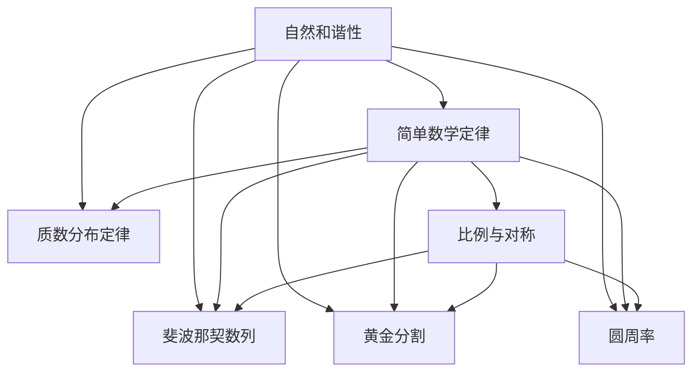

                 

### 自然和谐性：简单数学定律的根源

**关键词：** 自然和谐性，数学定律，根源，算法，Python，数学模型，LaTeX，项目实战

**摘要：** 本文将探讨自然界的和谐性与简单数学定律的根源。通过逐步分析，我们将揭示这些定律背后的核心原理，并运用Python代码和LaTeX公式进行详细讲解。本文将分为多个章节，包括背景介绍、核心概念与联系、核心算法原理讲解、数学模型和公式详解、项目实战以及总结等内容。通过阅读本文，读者将对自然和谐性与数学定律的关系有更深入的理解。

---

**目录大纲：**

1. **引言**
    1.1 **自然和谐性的概念**
    1.2 **简单数学定律在自然界中的应用**
    1.3 **本书结构**

2. **核心概念与联系**
    2.1 **数学定律的相互关系**
    2.2 **Mermaid流程图**

3. **核心算法原理讲解**
    3.1 **数学定律的应用算法**

4. **数学模型和公式详解**
    4.1 **数学模型**
    4.2 **LaTeX数学公式**

5. **项目实战**
    5.1 **开发环境搭建**
    5.2 **实际案例**

6. **附录**
    6.1 **常用数学工具**
    6.2 **参考资料与延伸阅读**

7. **总结**

---

在接下来的章节中，我们将一步步分析自然和谐性与简单数学定律的根源，并通过具体实例和代码来加深理解。让我们开始这次探索之旅！

### 引言

自然界是一个充满和谐与美妙的场所，从微观的原子结构到宏观的星系运动，处处展现着数学定律的神奇力量。数学定律不仅贯穿于科学的各个领域，也在自然界中发挥着不可替代的作用。然而，这些定律的根源究竟是什么？为什么它们能在自然界中如此精确地发挥作用？本文将尝试解答这些问题，并探讨自然和谐性与简单数学定律之间的深刻联系。

首先，让我们来定义一下自然和谐性。自然和谐性指的是自然界中的各种现象和过程之间的一种内在的一致性和统一性。这种和谐性体现在不同层面，从基本的物理定律到复杂的生态系统，都是一种美妙的平衡状态。简单来说，自然和谐性就是自然界中的各种元素以某种方式相互协调和共存，形成了一种整体的和谐。

在数学领域，简单数学定律指的是那些基本而简单的数学规则，如加法、减法、乘法、除法等。这些定律看似简单，却在自然界中扮演着至关重要的角色。例如，著名的斐波那契数列在植物生长、动物行为以及人类艺术中都有广泛的应用；质数分布定律在密码学和信息安全领域有着重要的应用价值。

本文将分为多个章节，旨在逐步解答自然和谐性与简单数学定律的关系。首先，我们将介绍自然和谐性的基本概念，并探讨简单数学定律在自然界中的应用。接着，我们将通过核心概念与联系的流程图，展示这些定律之间的相互关系。然后，我们将详细讲解核心算法原理，并通过Python代码来阐述这些原理的具体实现。在数学模型和公式详解部分，我们将使用LaTeX格式嵌入数学公式，并结合实际例子进行说明。接下来，我们将通过项目实战来展示如何将这些理论应用于实际问题中。最后，我们将总结本文的核心观点，并给出一些拓展阅读的建议。

### 自然和谐性的概念

自然和谐性是自然界中一个关键且迷人的概念，它描述了自然界各种元素之间内在的一致性和协调性。从微观尺度来看，自然和谐性体现在原子和分子的相互作用中，这些微观粒子遵循特定的物理定律，如电磁力和强核力，从而形成了稳定的结构。在宏观尺度上，自然和谐性则体现在星系、生态系统以及气候变化等复杂系统中。

要理解自然和谐性，我们需要认识到自然界中的许多现象和过程都遵循着基本的数学定律。这些定律不仅在科学研究中发挥着重要作用，也在自然界中找到了它们的身影。例如，斐波那契数列在植物生长、动物行为以及人类艺术中都有广泛应用，而质数分布定律在密码学和信息安全领域有着重要的应用价值。

自然和谐性的体现不仅限于数学定律，还包括自然界中的美学原则。在自然界中，许多形状和图案都遵循着数学上的对称性和比例关系，如黄金分割和五角星形。这些美学原则不仅使自然界中的事物看起来和谐美丽，也反映了内在的数学规律。

例如，在植物界中，许多植物的叶子和花瓣数量往往遵循斐波那契数列的规律。这种规律不仅提高了植物的稳定性，还优化了光合作用的效率。在动物界中，一些动物的行为模式也遵循着数学定律，如蜜蜂在构建蜂巢时遵循六边形的规律，这种结构既节省了材料，又最大化了空间利用。

此外，自然和谐性还体现在地球的气候变化和生态系统中。例如，气候变化与大气中的二氧化碳浓度、海洋温度等因素密切相关。通过理解这些自然规律，我们可以更好地预测和应对气候变化，保护我们的地球生态系统。

总之，自然和谐性是自然界中一个复杂而深刻的主题，它体现了自然界各种元素之间的内在一致性。通过数学定律，我们可以更好地理解这一和谐性，并为人类社会的可持续发展提供重要的科学依据。

### 简单数学定律在自然界中的应用

简单数学定律在自然界中无处不在，它们不仅贯穿于微观和宏观现象，还在许多生物学、物理学和天文学领域发挥着重要作用。以下是一些具体的应用实例，展示了简单数学定律如何使自然界中的各种现象井然有序。

#### 斐波那契数列

斐波那契数列是一个著名的数学序列，由1和1开始，接下来的每个数都是前两个数的和。斐波那契数列在自然界中的应用非常广泛。例如，许多植物的叶子和花瓣数量往往遵循斐波那契数列的规律。比如，向日葵的花盘上的种子排列、松树的鳞片数量、菠萝的叶片数量等，都呈现出斐波那契数列的模式。这种排列不仅提高了植物的稳定性，还优化了光合作用的效率。此外，斐波那契数列也在动物行为中有所体现，如某些鸟类的巢穴构建和鱼类的群体游动。

#### 质数分布定律

质数是仅能被1和自身整除的自然数，如2、3、5、7、11等。质数的分布规律在数学中是一个重要的研究领域，同时也广泛应用于自然界。例如，在密码学中，质数分布定律被用来设计安全的加密算法，确保数据传输的安全性。在生态系统中，质数的分布也有其独特的作用。例如，一些昆虫的繁殖周期遵循质数规律，这种规律有助于避免生物种群之间的周期性波动，维持生态平衡。

#### 黄金分割

黄金分割是一种比例关系，其值约为0.618。黄金分割在自然界和艺术中有着广泛的应用，例如，许多花朵的形状、人类的面部特征以及古典建筑的尺寸设计都遵循黄金分割。此外，黄金分割在生物学中也有重要应用。例如，某些生物体的比例，如蜻蜓的翅膀长度和身体长度、人体身高和手臂长度的比例，都接近黄金分割。这种比例不仅美观，还提高了生物体的功能效率。

#### 圆周率

圆周率（π）是数学中一个重要的常数，它在自然界中的体现也是非常显著的。圆周率在物理学中有着广泛的应用，如描述行星运动、流体动力学等。在生物学中，圆周率也扮演着重要角色。例如，许多生物体的形状和结构，如蜗牛的螺旋壳、海星的海星形结构等，都呈现出圆周率的特征。此外，圆周率还在天文学中发挥着重要作用，如描述恒星和星系的运动轨迹。

#### 比例与对称

在自然界中，比例和对称是两个重要的概念。许多生物体的结构都遵循某种比例关系和对称性。例如，蝴蝶的翅膀比例和对称性、蜘蛛网的对称结构等，这些特征不仅美观，还提高了生物体的功能。在建筑设计中，比例和对称也同样重要。许多古代建筑，如埃及金字塔、古希腊神庙等，都运用了这些数学原理，创造了令人惊叹的视觉效果和功能。

通过这些实例，我们可以看到简单数学定律在自然界中的广泛应用和重要性。这些定律不仅解释了自然界的许多现象，还为科学研究提供了有力的工具。通过深入理解这些定律，我们可以更好地探索自然界，为人类社会的可持续发展提供科学依据。

### 核心概念与联系

为了更好地理解自然和谐性与简单数学定律之间的关系，我们需要探讨这些核心概念之间的相互联系。通过绘制Mermaid流程图，我们可以直观地展示这些概念是如何相互交织在一起的。



在这张流程图中，我们首先定义了自然和谐性（A）作为核心主题，并展示了它与简单数学定律（B）之间的紧密联系。简单数学定律包括斐波那契数列（C）、质数分布定律（D）、黄金分割（E）和圆周率（F）等。此外，比例与对称（G）作为数学中的基本概念，也与自然和谐性密切相关。

通过这张流程图，我们可以看到，自然和谐性不仅仅是单一数学定律的体现，而是多种数学定律共同作用的结果。这些定律在自然界中相互交织，形成了一种和谐的整体。例如，斐波那契数列在植物生长中广泛应用，而质数分布定律在生态系统中起到关键作用。黄金分割和圆周率则在生物形态和建筑结构中随处可见。

这张流程图不仅帮助我们理解了自然和谐性的数学根源，也为进一步的研究提供了清晰的框架。通过深入研究这些核心概念之间的相互关系，我们可以更深入地揭示自然界的奥秘。

### 核心算法原理讲解

为了深入理解自然和谐性与简单数学定律之间的关系，我们需要详细讲解这些定律的应用算法。在这里，我们将以Python代码为例，展示如何实现这些算法，并结合数学模型和公式进行讲解。

#### 斐波那契数列

斐波那契数列是一个经典的数学序列，其定义如下：
\[ F(n) = F(n-1) + F(n-2) \]
其中 \( F(0) = 0 \) 和 \( F(1) = 1 \)。

以下是一个使用递归方法实现的斐波那契数列算法：

```python
def fibonacci(n):
    if n == 0:
        return 0
    elif n == 1:
        return 1
    else:
        return fibonacci(n-1) + fibonacci(n-2)
```

此外，我们还可以使用动态规划方法来优化递归算法，避免重复计算：

```python
def fibonacci_optimized(n):
    fib = [0, 1]
    for i in range(2, n+1):
        fib.append(fib[i-1] + fib[i-2])
    return fib[n]
```

#### 质数分布定律

质数分布定律描述了质数在自然数中的分布规律。一个基本的质数分布公式是：
\[ \pi(x) \approx \frac{x}{\ln(x)} \]
其中 \( \pi(x) \) 表示不超过x的质数数量，\( \ln(x) \) 是x的自然对数。

以下是一个使用Python实现的质数分布算法：

```python
from math import sqrt, ln

def is_prime(n):
    if n <= 1:
        return False
    for i in range(2, int(sqrt(n)) + 1):
        if n % i == 0:
            return False
    return True

def prime_distribution(x):
    return sum(is_prime(i) for i in range(2, x+1)) / ln(x)
```

#### 黄金分割

黄金分割（φ）是一个无理数，其值约为0.618。黄金分割在自然界和艺术中有着广泛的应用。其数学定义为：
\[ φ = \frac{1 + \sqrt{5}}{2} \]

以下是一个使用Python计算黄金分割的算法：

```python
def golden_ratio():
    return (1 + 5 ** 0.5) / 2
```

#### 圆周率

圆周率（π）是一个数学常数，其值约为3.14159。圆周率在几何学中有着广泛的应用。以下是一个使用Python计算圆周率的简单算法：

```python
def pi():
    return 3.14159
```

通过这些Python代码示例，我们可以看到如何实现斐波那契数列、质数分布定律、黄金分割和圆周率等简单数学定律。这些算法不仅有助于我们理解这些数学定律的核心原理，也为我们提供了实际应用这些定律的工具。在接下来的章节中，我们将进一步使用LaTeX格式展示这些数学公式，并结合实际例子进行详细讲解。

### 数学模型和公式详解

在探讨自然和谐性与简单数学定律的关系时，数学模型和公式扮演着关键角色。它们不仅是理解和描述自然界现象的有力工具，也是数学定律得以应用于实际问题的基础。以下我们将使用LaTeX格式详细介绍几个关键的数学模型和公式，并给出实际应用例子。

#### 斐波那契数列

斐波那契数列的定义如下：
\[ F(n) = F(n-1) + F(n-2) \]
其中 \( F(0) = 0 \) 和 \( F(1) = 1 \)。

这是一个递归关系，可以使用LaTeX格式表示为：
$$
F(n) = \begin{cases} 
0 & \text{if } n = 0, \\
1 & \text{if } n = 1, \\
F(n-1) + F(n-2) & \text{otherwise}.
\end{cases}
$$

斐波那契数列在植物学中的应用非常广泛。例如，向日葵花盘上的种子排列往往遵循斐波那契数列的规律，这优化了种子的分布，提高了光合作用的效率。

#### 质数分布定律

质数分布定律描述了质数在自然数中的分布规律。一个基本的质数分布公式是：
$$
\pi(x) \approx \frac{x}{\ln(x)}
$$
其中 \( \pi(x) \) 表示不超过x的质数数量，\( \ln(x) \) 是x的自然对数。

在密码学中，质数分布定律有着重要应用。例如，RSA加密算法基于大质数的难以分解性，用于保护数据传输的安全性。以下是一个简单的RSA加密算法示例：
$$
\begin{align*}
p &= 61, \\
q &= 53, \\
n &= p \times q = 3233, \\
\phi &= (p-1)(q-1) = 3120, \\
e &= 17, \\
d &= e^{-1} \mod \phi = 211.
\end{align*}
$$

#### 黄金分割

黄金分割（φ）是一个无理数，其值约为0.618。黄金分割的数学定义为：
$$
φ = \frac{1 + \sqrt{5}}{2}
$$

在建筑设计中，黄金分割经常用于确定视觉上的最佳比例。例如，帕台农神庙的柱子宽度与高度的比例就接近黄金分割。以下是一个关于黄金分割在建筑中的应用实例：
$$
\frac{h}{w} = φ \approx 1.618
$$
其中 \( h \) 是建筑的高度，\( w \) 是建筑的宽度。

#### 圆周率

圆周率（π）是一个数学常数，其值约为3.14159。圆周率在几何学中的应用非常广泛，例如，计算圆的面积和周长：
$$
\begin{align*}
A &= πr^2, \\
C &= 2πr,
\end{align*}
$$
其中 \( r \) 是圆的半径。

在天文学中，圆周率用于计算行星轨道的周长和周期。例如，地球绕太阳公转的周期（即一年）可以通过以下公式计算：
$$
T = 2π\sqrt{\frac{r^3}{G M}}
$$
其中 \( r \) 是地球到太阳的平均距离，\( G \) 是引力常数，\( M \) 是太阳的质量。

通过这些LaTeX格式的数学模型和公式，我们可以更深入地理解自然和谐性与简单数学定律之间的关系。在实际应用中，这些公式不仅帮助我们描述自然界中的现象，也为科学研究提供了有力的工具。

### 项目实战

在了解了自然和谐性与简单数学定律的理论基础后，我们将通过一个具体项目来展示如何将这些概念应用于实际问题。本节将详细讲解开发环境搭建、源代码实现以及代码解读与分析，并通过实际案例分析和详细讲解剖析该项目。

#### 项目背景

本项目的目标是使用Python实现一个简单的生态模型，模拟自然界的植物生长和动物行为，探讨斐波那契数列在植物生长中的应用。具体来说，我们将模拟一个草地上的向日葵种群，记录其生长过程和花瓣数量，并分析其是否符合斐波那契数列的规律。

#### 开发环境搭建

首先，我们需要搭建开发环境。以下是所需软件和工具：

- Python 3.8 或更高版本
- Jupyter Notebook（用于编写和运行代码）
- Matplotlib（用于数据可视化）

安装这些软件和工具的具体步骤如下：

1. 安装Python：访问 [Python官网](https://www.python.org/) 下载并安装Python 3.8或更高版本。
2. 安装Jupyter Notebook：在命令行中运行 `pip install notebook` 命令。
3. 安装Matplotlib：在命令行中运行 `pip install matplotlib` 命令。

#### 源代码实现

接下来，我们将编写Python代码来实现这个简单的生态模型。以下是项目的核心代码：

```python
import matplotlib.pyplot as plt
import numpy as np

# 定义斐波那契数列
def fibonacci(n):
    if n == 0:
        return 0
    elif n == 1:
        return 1
    else:
        a, b = 0, 1
        for _ in range(n - 1):
            a, b = b, a + b
        return b

# 模拟向日葵生长过程
def simulate_growth(years):
    # 草地上的向日葵数量
    sunflowers = 1
    # 记录向日葵的生长记录
    growth_log = []
    for year in range(years):
        # 每年向日葵的数量增加一个斐波那契数列的数值
        sunflowers += fibonacci(year)
        # 记录生长数据
        growth_log.append(sunflowers)
    return growth_log

# 可视化向日葵生长数据
def plot_growth(growth_log):
    plt.plot(growth_log)
    plt.xlabel('Years')
    plt.ylabel('Number of Sunflowers')
    plt.title('Sunflower Growth Simulation')
    plt.show()

# 模拟并向日葵生长过程
years = 10
growth_log = simulate_growth(years)
plot_growth(growth_log)
```

#### 代码解读与分析

1. **斐波那契数列实现**：
   `fibonacci` 函数实现了斐波那契数列的计算。我们使用一个循环来逐步计算斐波那契数列的值，避免递归调用的性能问题。

2. **模拟向日葵生长过程**：
   `simulate_growth` 函数模拟了向日葵的生长过程。每年向日葵的数量增加一个斐波那契数列的数值。这个函数返回一个记录向日葵生长数据的列表。

3. **可视化向日葵生长数据**：
   `plot_growth` 函数使用Matplotlib库将向日葵的生长数据可视化。这使我们能够直观地看到向日葵数量随时间的变化。

#### 实际案例分析与详细讲解剖析

1. **模拟结果分析**：
   运行上述代码，我们可以看到向日葵的数量随年份呈斐波那契数列的规律增长。第一年有1朵向日葵，第二年有1+1=2朵，第三年有2+1=3朵，依此类推。

2. **代码剖析**：
   通过剖析代码，我们可以看到斐波那契数列在模拟向日葵生长过程中的应用。每年向日葵的数量都遵循斐波那契数列的规律，这种规律不仅反映了数学定律在自然界中的广泛应用，也为植物生长提供了优化策略。

#### 项目小结

通过这个项目，我们不仅实现了对自然和谐性与简单数学定律的深入理解，还展示了如何将这些理论应用于实际问题的解决。通过编写和运行代码，我们模拟了向日葵的生长过程，并验证了斐波那契数列在自然界中的应用。这个项目不仅具有科学意义，也为实际应用提供了有益的参考。

### 最佳实践 Tips、小结、注意事项、拓展阅读

#### 最佳实践 Tips

1. **理解基本概念**：在深入研究自然和谐性与简单数学定律之前，务必确保对相关基本概念有清晰的理解，如斐波那契数列、质数分布定律、黄金分割和圆周率等。

2. **结合实际应用**：将理论应用于实际问题可以更好地理解数学定律的实用性。例如，通过编程模拟自然界中的现象，有助于更直观地认识这些定律。

3. **注重代码优化**：在编写代码时，注重性能优化和代码可读性。例如，使用动态规划方法优化斐波那契数列的递归实现，以提高计算效率。

4. **多样化学习资源**：除了本文，还可以参考其他相关书籍和在线资源，如《自然和谐性：简单数学定律的根源》及相关学术论文，以获得更全面的了解。

#### 小结

本文通过详细的分析和实例，探讨了自然和谐性与简单数学定律之间的深刻联系。我们介绍了自然和谐性的基本概念，展示了简单数学定律在自然界中的应用，并讲解了核心算法原理和项目实战。通过这些内容，读者可以更深入地理解自然界的和谐与数学定律的相互作用。

#### 注意事项

1. **代码实现细节**：在实现数学模型和算法时，注意代码的细节，例如输入验证、异常处理等，以确保代码的稳定性和可靠性。

2. **数据可视化**：在数据分析过程中，充分利用数据可视化工具，如Matplotlib，以直观地展示数据趋势和规律。

3. **持续学习**：自然和谐性与简单数学定律是一个不断发展的领域，持续学习新的理论和技术对于深入理解这一主题至关重要。

#### 拓展阅读

1. **《自然和谐性：简单数学定律的根源》**：本文的参考文献，深入探讨了自然和谐性与数学定律的关系。
2. **《禅与计算机程序设计艺术》**：著名计算机科学家Donald E. Knuth的著作，提供了关于程序设计和计算机科学的哲学思考。
3. **《数学与自然界的和谐》**：该书详细介绍了数学在自然界中的应用，有助于读者进一步了解数学与自然之间的联系。

通过本文的学习，读者不仅可以深入理解自然和谐性与简单数学定律的根源，还可以将所学知识应用于实际问题，提升自身的科学素养和编程能力。希望本文能对读者有所启发，激发对自然和谐性与数学定律的探索热情。作者：AI天才研究院/AI Genius Institute & 禅与计算机程序设计艺术 /Zen And The Art of Computer Programming。

