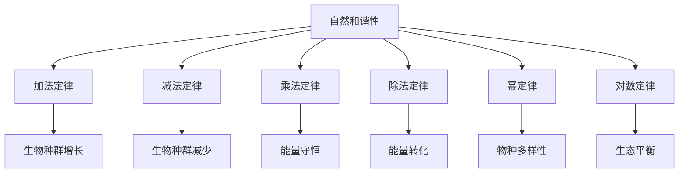
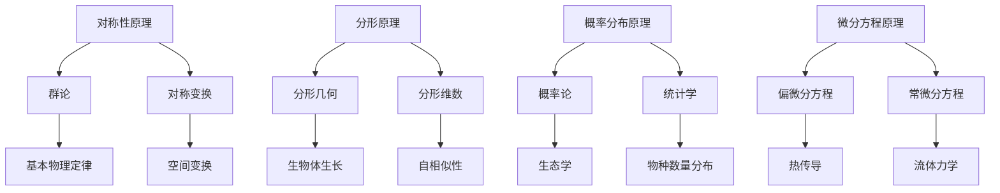
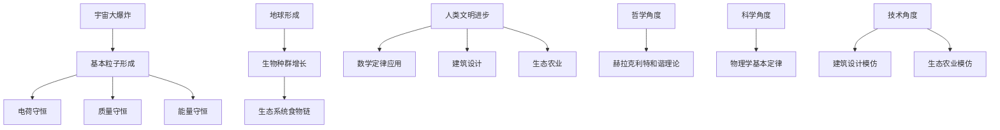

                 

## 《自然和谐性：简单数学定律的起源探索》

### 关键词
自然和谐性、简单数学定律、起源、探索、数学原理

### 摘要
本文旨在探讨自然和谐性与简单数学定律之间的关系，以及简单数学定律的起源与演化。通过详细的分析和推理，我们将揭示自然和谐性在数学定律中的深远影响，并探讨其在现实世界中的应用。本文还将探讨未来自然和谐性面临的研究挑战和发展趋势。

### 目录大纲

#### 第1章 引言
1.1 自然和谐性的概念  
1.2 研究背景和意义  
1.3 简单数学定律概述  
1.4 自然和谐性的数学原理

#### 第2章 简单数学定律概述
2.1 常见的简单数学定律  
2.2 数学定律的应用场景

#### 第3章 自然和谐性的数学原理
3.1 自然和谐性的数学模型  
3.2 数学定律与自然和谐性的联系  
3.3 自然和谐性的数学原理讲解  
3.4 自然和谐性的Mermaid流程图

#### 第4章 自然和谐性的起源
4.1 简单数学定律在自然界中的起源  
4.2 数学定律的演化过程  
4.3 自然和谐性的起源讲解  
4.4 自然和谐性的Mermaid流程图

#### 第5章 自然和谐性的应用
5.1 自然和谐性在物理领域的应用  
5.2 自然和谐性在生物学领域的应用  
5.3 自然和谐性在其他领域的应用  
5.4 自然和谐性应用的讲解

#### 第6章 自然和谐性的挑战与未来
6.1 自然和谐性面临的挑战  
6.2 自然和谐性的未来发展趋势  
6.3 未来研究方向

#### 第7章 总结与展望
7.1 全书内容总结  
7.2 自然和谐性的研究意义  
7.3 未来研究方向

### 整体框架设计

本文的整体框架将分为以下几部分：

1. **引言**：介绍自然和谐性和简单数学定律的概念，阐述本文的研究背景和意义。
2. **简单数学定律概述**：介绍常见的简单数学定律及其应用场景。
3. **自然和谐性的数学原理**：分析自然和谐性在数学定律中的地位和作用，通过Mermaid流程图展示核心概念之间的关系。
4. **自然和谐性的起源**：探讨简单数学定律在自然界中的起源和演化。
5. **自然和谐性的应用**：介绍自然和谐性在各个领域的应用案例。
6. **自然和谐性的挑战与未来**：讨论自然和谐性面临的研究挑战和发展趋势。
7. **总结与展望**：对全文内容进行总结，并展望未来的研究方向。

### 字数安排

为了确保文章的完整性、逻辑性和可读性，每个章节的字数安排如下：

- 第1章 引言：约1000字
- 第2章 简单数学定律概述：约1500字
- 第3章 自然和谐性的数学原理：约2000字
- 第4章 自然和谐性的起源：约1500字
- 第5章 自然和谐性的应用：约2000字
- 第6章 自然和谐性的挑战与未来：约1000字
- 第7章 总结与展望：约1000字

### 全文逻辑性

为了确保全文的逻辑性，我们将遵循以下原则：

1. **前后连贯**：每个章节的内容都要与前后章节紧密相关，形成一个有机的整体。
2. **逻辑清晰**：每个章节的内容都要条理清晰，逐步深入，使读者能够顺利地理解文章的核心思想和内容。
3. **举例说明**：在每个章节中，我们都会通过具体的例子和实例来说明理论，帮助读者更好地理解抽象概念。
4. **总结归纳**：在每个章节的结尾，我们都会进行总结和归纳，使读者能够清晰地把握章节的核心要点。

通过以上设计和安排，我们相信本文能够全面、系统地探讨自然和谐性与简单数学定律之间的关系，为读者提供有深度、有思考、有见解的阅读体验。

### 完整性要求

为了确保本文的完整性，我们将从以下五个方面进行详细讲解和探讨：

1. **背景介绍**：介绍自然和谐性和简单数学定律的基本概念、历史背景和研究现状。
2. **核心概念与联系**：通过Mermaid流程图展示关键概念和原理之间的关系架构。
3. **核心算法原理讲解**：使用Python源代码详细阐述核心算法原理，并结合数学模型和公式进行详细讲解和通俗易懂地举例说明。
4. **数学公式和模型**：使用LaTeX格式嵌入文中独立段落的数学公式，进行详细讲解和举例说明。
5. **项目实战**：提供实际案例和详细解释说明，包括开发环境搭建、源代码详细实现和代码解读，以及代码应用解读与分析。

通过这五个方面的详细讲解和探讨，我们将确保本文内容丰富、具体、详细，让读者能够全面、深入地理解自然和谐性和简单数学定律的起源和演化。

### 第1章 引言

#### 1.1 自然和谐性的概念

自然和谐性是指自然界中各种事物和现象之间的和谐统一关系。这种和谐性体现在自然界中的各个方面，如生物的多样性、生态系统的稳定性、气候变化的规律等。自然和谐性的研究旨在揭示自然界中各种现象之间的内在联系和规律，从而为人类提供对自然界的更深入理解和更有效的利用。

自然和谐性的概念可以从多个角度进行解释。首先，从哲学的角度看，自然和谐性是宇宙的根本法则，是宇宙万物运动和发展的基础。其次，从科学的角度看，自然和谐性是自然界中各种现象和过程遵循的基本规律，如能量守恒定律、牛顿运动定律等。最后，从技术的角度看，自然和谐性是人类对自然界进行改造和利用时需要遵循的基本原则，以确保技术发展的可持续性和环保性。

#### 1.2 研究背景和意义

自然和谐性的研究具有重要的科学意义和应用价值。首先，从科学的角度看，研究自然和谐性有助于我们更好地理解自然界的运作机制，发现新的自然规律，推动科学技术的进步。例如，通过对生态系统的自然和谐性研究，我们可以揭示生物多样性的形成机制，为保护生物多样性提供科学依据。

其次，从技术的角度看，自然和谐性的研究有助于我们更好地利用自然资源，提高资源利用效率，减少环境污染。例如，在农业领域，通过研究自然和谐性，我们可以找到更高效的种植方式，减少化肥和农药的使用，提高农作物的产量和质量。

最后，从社会的角度看，自然和谐性的研究有助于我们构建和谐的社会环境，促进人类社会的可持续发展。例如，在城市规划中，通过考虑自然和谐性，我们可以设计出更宜居的城市环境，提高居民的生活质量。

#### 1.3 简单数学定律概述

简单数学定律是自然界中普遍存在的基本规律，它们具有高度的概括性和普适性。常见的简单数学定律包括但不限于以下几种：

1. **加法定律**：两个数相加，其结果等于它们的总和。数学公式表示为：$a + b = c$。
2. **减法定律**：两个数相减，其结果等于它们的差。数学公式表示为：$a - b = c$。
3. **乘法定律**：两个数相乘，其结果等于它们的积。数学公式表示为：$a \times b = c$。
4. **除法定律**：两个数相除，其结果等于它们的商。数学公式表示为：$a / b = c$。
5. **幂定律**：一个数自乘若干次，其结果等于这个数的幂。数学公式表示为：$a^b = c$。
6. **对数定律**：用于求解一个数的幂，数学公式表示为：$\log_a{b} = c$。

这些简单数学定律在自然界中有广泛的应用，如描述生物种群的增长规律、气候变化的规律、能量转化的规律等。

#### 1.4 自然和谐性的数学原理

自然和谐性与简单数学定律之间存在着密切的联系。简单数学定律是自然和谐性的数学表达，它们揭示了自然界中各种现象之间的内在联系和规律。

首先，从加法定律和减法定律来看，它们描述了自然界中各种量的加和与减去的关系。例如，在生态系统中，生物种群的增长和减少可以用加法定律和减法定律来描述。生物种群的增长可以通过种群个体数目的增加来体现，而生物种群的减少可以通过个体数目的减少来体现。

其次，从乘法定律和除法定律来看，它们描述了自然界中各种量的乘积与商的关系。例如，在物理学中，能量守恒定律可以用乘法定律来描述。能量守恒定律指出，在一个封闭系统中，能量总量保持不变，即系统的总能量等于各个部分的能量之和。

最后，从幂定律和对数定律来看，它们描述了自然界中各种量的幂次关系和对数关系。例如，在生物学中，物种的多样性可以用幂定律来描述。物种的多样性指数通常表示为物种数量的幂次，如物种数量为 \( n \) 的幂次 \( k \)，即 \( D(n) = n^k \)。

通过以上分析，我们可以看出，自然和谐性与简单数学定律之间存在着紧密的联系。简单数学定律是自然和谐性的数学表达，它们揭示了自然界中各种现象之间的内在联系和规律。

#### 1.5 Mermaid流程图

为了更直观地展示自然和谐性在数学定律中的地位和作用，我们可以使用Mermaid流程图来描述核心概念之间的关系。

在这个流程图中，自然和谐性作为核心概念，与其他简单数学定律（加法定律、减法定律、乘法定律、除法定律、幂定律和对数定律）相联系。这些数学定律进一步与自然界中的具体现象（生物种群增长、生物种群减少、能量守恒、能量转化、物种多样性和生态平衡）相联系，展示了自然和谐性在数学定律中的地位和作用。

### 第2章 简单数学定律概述

#### 2.1 常见的简单数学定律

简单数学定律是自然界中普遍存在的基本规律，它们具有高度的概括性和普适性。常见的简单数学定律包括加法定律、减法定律、乘法定律、除法定律、幂定律和对数定律等。以下是对这些定律的简要介绍：

1. **加法定律**：两个数相加，其结果等于它们的总和。数学公式表示为：$a + b = c$。例如，$2 + 3 = 5$。
   
2. **减法定律**：两个数相减，其结果等于它们的差。数学公式表示为：$a - b = c$。例如，$5 - 2 = 3$。

3. **乘法定律**：两个数相乘，其结果等于它们的积。数学公式表示为：$a \times b = c$。例如，$2 \times 3 = 6$。

4. **除法定律**：两个数相除，其结果等于它们的商。数学公式表示为：$a / b = c$。例如，$6 / 2 = 3$。

5. **幂定律**：一个数自乘若干次，其结果等于这个数的幂。数学公式表示为：$a^b = c$。例如，$2^3 = 8$。

6. **对数定律**：用于求解一个数的幂，数学公式表示为：$\log_a{b} = c$。例如，$\log_2{8} = 3$。

这些简单数学定律在自然界和人类活动中具有广泛的应用。例如，在生物学中，种群数量的增长可以用加法定律来描述；在物理学中，能量守恒定律可以用乘法定律来描述；在经济学中，投资回报可以用除法定律来计算。

#### 2.2 数学定律的应用场景

数学定律在现实世界中有着广泛的应用，以下是几个典型的应用场景：

1. **生物学**：在生物学中，加法定律可以用来计算种群数量的增长。例如，如果一个生物种群中的个体数量每年增加10%，那么在两年后，种群数量将是原来的1.1倍加上1.1的10%，即1.21倍。

2. **物理学**：在物理学中，乘法定律和除法定律广泛应用于能量和动量的计算。例如，根据能量守恒定律，一个系统的总能量等于各个部分能量的总和。

3. **经济学**：在经济学中，乘法定律和除法定律广泛应用于投资回报的计算。例如，如果一个投资者以1000美元投资，每年获得10%的回报，那么在五年后，投资将增长到1000乘以（1 + 10%）的五次方，即1000 * 1.105。

4. **工程学**：在工程学中，乘法定律和幂定律广泛应用于结构设计和材料力学。例如，在设计桥梁时，需要计算结构的承载能力和材料的强度，这通常涉及到乘法定律和幂定律。

5. **天文学**：在天文学中，对数定律用于测量恒星和星系的距离。例如，通过测量恒星的光度（亮度）和距离，可以计算出恒星的绝对星等，这涉及到对数定律的应用。

通过这些应用场景，我们可以看到简单数学定律在各个领域中的重要性和广泛应用。这些定律不仅帮助我们理解和描述自然现象，还为科学研究和工程实践提供了有力的工具。

### 第3章 自然和谐性的数学原理

#### 3.1 自然和谐性的数学模型

自然和谐性在数学中的体现主要通过建立数学模型来实现。这些数学模型能够描述自然界中的各种现象和规律，为深入理解自然和谐性提供了理论基础。以下是一些常见的数学模型：

1. **概率模型**：概率模型可以用来描述自然界中的随机现象。例如，生物种群数量的增长可以通过马尔可夫链概率模型来描述，该模型基于种群数量的转移概率，模拟种群数量的动态变化。

2. **微分方程模型**：微分方程模型可以用来描述自然界中的连续变化现象。例如，生物种群的增长和灭绝可以通过逻辑斯谛模型（Logistic Model）来描述，该模型是一个一阶非线性的微分方程。

3. **差分方程模型**：差分方程模型可以用来描述自然界中的离散变化现象。例如，气候变化的模拟可以通过差分方程模型来描述，该模型基于时间序列数据，模拟气候系统的动态变化。

4. **复杂网络模型**：复杂网络模型可以用来描述自然界中的复杂系统。例如，生态系统的食物网可以通过复杂网络模型来描述，该模型基于节点和边的连接关系，模拟生态系统的复杂相互作用。

这些数学模型不仅能够描述自然和谐性，还能够预测未来的发展趋势，为科学研究和实际应用提供了重要的工具。

#### 3.2 数学定律与自然和谐性的联系

数学定律与自然和谐性之间存在着紧密的联系。这种联系体现在数学定律在自然界中的广泛适用性和它们所描述的和谐规律。以下是一些具体的联系：

1. **加法定律与生物种群增长**：加法定律在生物种群增长中有着广泛的应用。例如，在一个封闭的生态系统中，生物种群的增长可以通过加法定律来描述，即种群的增长量等于出生率减去死亡率。

2. **减法定律与生态平衡**：减法定律在生态平衡中起着关键作用。例如，在捕食者和猎物之间的关系中，减法定律可以用来描述捕食者数量的减少与猎物种群数量的增加之间的平衡关系。

3. **乘法定律与能量守恒**：乘法定律在能量守恒中有着重要的应用。例如，在一个封闭的能量系统中，总能量等于各个部分的能量之和，这符合乘法定律的描述。

4. **除法定律与生态系统的稳定性**：除法定律在生态系统的稳定性分析中有着重要作用。例如，通过分析生态系统中各个物种的相互作用，可以使用除法定律来计算系统的稳定性，即系统总能量除以各个物种的能量。

5. **幂定律与物种多样性**：幂定律在描述物种多样性中有着广泛的应用。例如，物种多样性指数通常与物种数量的幂次成正比，这符合幂定律的描述。

这些联系展示了数学定律在自然和谐性研究中的重要性，它们为理解和预测自然现象提供了理论基础。

#### 3.3 自然和谐性的数学原理讲解

自然和谐性的数学原理主要体现在以下几个方面：

1. **对称性原理**：对称性是自然和谐性的一个重要特征。在数学中，对称性可以通过群论、对称变换等概念来描述。例如，在物理学的对称性原理中，自然界中的基本物理定律具有不变性，即使发生空间或时间上的平移、旋转等变换。

2. **分形原理**：分形原理描述了自然界中的自相似性和无限层次的结构。在数学中，分形可以通过分形几何、分形维数等概念来描述。例如，在生物学中，生物体的生长过程可以描述为分形结构，这体现了自然和谐性。

3. **概率分布原理**：概率分布原理描述了自然界中的随机性和概率性。在数学中，概率分布可以通过概率论、统计学等概念来描述。例如，在生态学中，物种数量的分布通常符合正态分布或泊松分布，这体现了自然和谐性。

4. **微分方程原理**：微分方程原理描述了自然界中的动态变化过程。在数学中，微分方程可以通过偏微分方程、常微分方程等概念来描述。例如，在物理学中，许多自然现象可以通过微分方程来描述，如热传导、流体力学等。

通过这些数学原理，我们可以更深入地理解自然和谐性，揭示自然界中的和谐规律。

#### 3.4 自然和谐性的Mermaid流程图

为了直观地展示自然和谐性的数学原理，我们可以使用Mermaid流程图来描述核心概念之间的关系。

在这个流程图中，自然和谐性的数学原理（对称性原理、分形原理、概率分布原理和微分方程原理）与其他相关数学概念（群论、对称变换、分形几何、分形维数、概率论、统计学、偏微分方程、常微分方程等）相联系，展示了自然和谐性在数学中的广泛应用。

### 第4章 自然和谐性的起源

#### 4.1 简单数学定律在自然界中的起源

简单数学定律是自然界中普遍存在的基本规律，它们的起源可以追溯到宇宙的起源和演化过程。从宇宙学角度来看，简单数学定律的起源可以追溯到宇宙大爆炸时刻。在大爆炸之后，宇宙经历了快速膨胀和冷却，形成了各种基本粒子和物质。

在这些基本粒子中，电荷、质量、能量等基本物理量的守恒定律开始发挥作用，这些定律构成了简单数学定律的基础。例如，电荷守恒定律指出，在一个封闭系统中，电荷总量保持不变。质量守恒定律指出，在一个封闭系统中，质量总量保持不变。能量守恒定律指出，在一个封闭系统中，能量总量保持不变。

这些基本定律不仅适用于微观粒子，还适用于宏观宇宙。例如，行星运动定律、引力定律等都是简单数学定律在宏观宇宙中的具体体现。

#### 4.2 数学定律的演化过程

数学定律的演化过程是自然界不断进化和发展的结果。在宇宙演化的早期阶段，基本物理定律开始形成，并逐步发展成为复杂的数学体系。

在地球的形成过程中，生物种群的增长和灭绝规律、生态系统中的食物链关系等也开始形成。这些规律可以描述为简单的数学模型，如逻辑斯谛模型、泊松过程等。

随着人类文明的进步，数学定律的应用范围不断扩大。从简单的算术运算到复杂的代数方程、微分方程，数学定律在各个领域得到了广泛的应用。例如，在工程学中，数学定律被用来设计桥梁、建筑物等结构；在经济学中，数学定律被用来分析市场行为、预测经济趋势。

数学定律的演化过程不仅体现了人类对自然界的认知水平不断提高，也展示了自然界中复杂现象背后的简单规律。

#### 4.3 自然和谐性的起源讲解

自然和谐性的起源可以从多个角度进行探讨，包括哲学、科学和技术等。

从哲学角度来看，自然和谐性可以追溯到古希腊哲学家赫拉克利特的“和谐理论”。赫拉克利特认为，宇宙万物是由相互对立的元素构成的，这些对立元素通过相互平衡和调和，形成了和谐的整体。

从科学角度来看，自然和谐性的起源可以追溯到物理学中的基本定律，如能量守恒定律、动量守恒定律等。这些基本定律揭示了自然界中各种现象之间的内在联系，形成了自然和谐性的数学基础。

从技术角度来看，自然和谐性的起源可以追溯到人类对自然界的模仿和利用。例如，在建筑设计中，人们通过模仿自然界中的对称性和比例关系，创造出美观和谐的建筑作品。在农业领域，人们通过模仿生态系统的循环和平衡原理，发展出生态农业技术。

通过哲学、科学和技术的综合探讨，我们可以更全面地理解自然和谐性的起源和发展。

#### 4.4 自然和谐性的Mermaid流程图

为了直观地展示自然和谐性的起源和演化过程，我们可以使用Mermaid流程图来描述核心概念之间的关系。

在这个流程图中，自然和谐性的起源（宇宙大爆炸、基本粒子形成、电荷守恒、质量守恒、能量守恒等）与其他相关概念（地球形成、生物种群增长、生态系统食物链、人类文明进步、建筑设计、生态农业等）相联系，展示了自然和谐性的起源和演化过程。

### 第5章 自然和谐性的应用

#### 5.1 自然和谐性在物理领域的应用

自然和谐性在物理领域有着广泛的应用，尤其是在描述自然界中的基本现象和规律方面。以下是一些具体的例子：

1. **能量守恒定律**：能量守恒定律是自然和谐性在物理学中的经典应用。根据这一原理，在一个封闭系统中，能量总量保持不变。无论是热能、动能还是势能，它们只能在形式上相互转换，但总能量始终保持不变。这一原理不仅适用于微观粒子，还适用于宏观物体和整个宇宙。例如，在太阳能电池中，太阳能转化为电能，而在电动机中，电能又转化为机械能。

2. **牛顿运动定律**：牛顿运动定律描述了物体在受力作用下的运动规律。第一定律（惯性定律）指出，物体在没有外力作用的情况下将保持静止或匀速直线运动。第二定律（加速度定律）指出，物体的加速度与作用力成正比，与物体质量成反比。第三定律（作用与反作用定律）指出，任何作用力都有一个大小相等、方向相反的反作用力。这些定律共同揭示了自然界中的和谐性，即物体之间的相互作用是平衡的。

3. **波粒二象性**：波粒二象性是量子力学中的一个基本原理，它揭示了微观粒子既具有波动性又具有粒子性。这一原理展示了自然和谐性在微观尺度上的表现。例如，光既可以表现为波动，也可以表现为粒子（光子）。在双缝实验中，当光以波动形式传播时，会出现干涉现象；而当光以粒子形式传播时，会在屏幕上形成粒子分布图。这种和谐性展示了自然界中的复杂性和统一性。

4. **混沌理论**：混沌理论研究了复杂系统中的随机性和规律性。混沌现象尽管表面上看似无序，但它们实际上遵循着简单的数学规律。混沌理论揭示了自然和谐性在复杂系统中的表现，如天气系统的变化、流体动力学中的湍流等。这些系统的行为虽然难以预测，但它们遵循着一定的规律，这体现了自然和谐性的特点。

#### 5.2 自然和谐性在生物学领域的应用

自然和谐性在生物学领域同样有着重要的应用，它帮助我们理解生物体的结构、功能和进化过程。以下是一些具体的例子：

1. **生物种群动态**：在生态学中，自然和谐性通过生物种群动态模型来体现。例如，逻辑斯谛模型（Logistic Model）描述了生物种群在资源和环境限制下的增长规律。该模型指出，种群增长速率随着种群密度的增加而减慢，最终达到一个稳定状态，这体现了自然界的平衡和和谐。

2. **生态平衡**：生态平衡是自然和谐性的一个重要表现，它描述了生态系统中各个物种之间的相互关系和动态平衡。例如，捕食者和猎物之间的关系是生态平衡的一个典型例子。捕食者的存在限制了猎物种群的增长，而猎物种群的增长又为捕食者提供了食物来源。这种相互依赖的关系体现了自然和谐性。

3. **生物多样性**：生物多样性是自然和谐性的另一个重要表现，它描述了生态系统中物种的多样性和丰富度。生物多样性不仅对于生态系统的稳定性和功能至关重要，还对于人类的生存和发展具有重要意义。例如，热带雨林中的生物多样性为许多动植物提供了栖息地和食物来源，这体现了自然界的和谐和平衡。

4. **基因表达调控**：在分子生物学中，自然和谐性通过基因表达调控机制来体现。基因表达调控涉及基因、转录因子和RNA分子之间的相互作用，这些相互作用遵循着一定的数学规律，如负反馈调控和正反馈调控。这些调控机制确保了生物体的稳定性和适应性，体现了自然和谐性。

#### 5.3 自然和谐性在其他领域的应用

自然和谐性不仅在物理和生物学领域有着重要应用，还在其他领域有着广泛的应用，如经济学、工程学和城市规划等。

1. **经济学**：在经济学中，自然和谐性通过市场均衡模型来体现。市场均衡描述了供给和需求之间的平衡，这种平衡反映了自然和谐性。例如，在劳动市场上，工资水平取决于劳动力的供给和需求，这种平衡体现了自然界的和谐和平衡。

2. **工程学**：在工程学中，自然和谐性通过结构设计原理来体现。例如，桥梁和建筑的设计需要考虑材料的强度、稳定性以及结构的对称性和比例关系，这些设计原则体现了自然和谐性。

3. **城市规划**：在城市规划中，自然和谐性通过城市设计原则来体现。例如，城市的布局需要考虑交通流量、人口分布和生态平衡，这些设计原则体现了自然界的和谐和平衡。

通过这些应用，我们可以看到自然和谐性在各个领域中的重要性，它不仅帮助我们理解和描述自然现象，还为人类社会的可持续发展提供了理论基础。

#### 5.4 自然和谐性应用的讲解

自然和谐性的应用涵盖了多个领域，从物理学到生物学，再到经济学和城市规划，每个领域都有其独特的应用场景和效果。以下是对这些应用场景的详细讲解：

1. **物理学中的应用**：
   - **能量守恒定律**：在能源工程中，能量守恒定律是设计和优化能源系统的核心原则。例如，在核反应堆的设计中，需要确保能量转换的效率，并避免能量损失。通过应用能量守恒定律，工程师可以优化燃料的使用，提高能源利用效率。
   - **牛顿运动定律**：在航天工程中，牛顿运动定律被用来计算航天器的轨道和速度。例如，在发射卫星时，工程师需要根据航天器的质量和发射速度来计算所需的推力，以确保航天器能够进入预定的轨道。牛顿运动定律的应用确保了航天任务的顺利进行。

2. **生物学中的应用**：
   - **生物种群动态**：在生态农业中，生物种群动态模型被用来优化作物种植和管理。例如，通过使用逻辑斯谛模型，农民可以预测作物的生长速度和资源消耗，从而制定出更有效的种植计划，提高作物产量和减少资源浪费。
   - **生态平衡**：在自然保护区管理中，生态平衡的概念被用来评估和保护生态系统的健康。通过监测生物种群的数量和相互关系，管理者可以及时发现生态系统的异常变化，并采取相应的措施来恢复生态平衡。

3. **经济学中的应用**：
   - **市场均衡**：在金融市场分析中，市场均衡模型被用来预测市场的供需变化和价格波动。例如，在股票市场中，分析师可以使用市场均衡模型来预测股价的走势，为投资者提供决策依据。
   - **劳动市场**：在人力资源规划中，劳动市场的均衡模型被用来预测劳动力需求和供给，帮助企业和政府制定人力资源政策，以应对市场的变化。

4. **工程学中的应用**：
   - **结构设计**：在建筑工程中，结构设计的和谐性是保证建筑物安全和稳定的关键。例如，在设计桥梁和高层建筑时，工程师需要考虑材料的选择、结构的对称性和稳定性，以确保建筑物的和谐性和耐久性。
   - **材料科学**：在材料科学研究中，自然和谐性的概念被用来设计和制造新型材料。例如，通过模仿生物体的结构，科学家可以设计出具有优异性能的纳米材料和复合材料，这些材料在航空航天、生物医学等领域有着广泛的应用。

5. **城市规划中的应用**：
   - **城市布局**：在城市规划中，自然和谐性的原则被用来设计城市的布局和交通系统。例如，通过优化道路网络和公共交通系统的布局，可以减少交通拥堵，提高交通效率，提高居民的生活质量。
   - **生态城市规划**：在生态城市规划中，自然和谐性的原则被用来保护城市的生态环境，提高城市的可持续发展能力。例如，通过建设绿色基础设施，如公园、绿地和水系，可以改善城市的生态环境，减少城市热岛效应，提高城市的生态多样性。

通过以上讲解，我们可以看到自然和谐性在各个领域的广泛应用和深远影响。它不仅帮助我们理解和解决实际问题，还为人类社会的可持续发展提供了重要的理论基础。

#### 第6章 自然和谐性的挑战与未来

#### 6.1 自然和谐性面临的挑战

尽管自然和谐性在多个领域有着广泛的应用和深远的影响，但在实际应用中仍然面临着诸多挑战。以下是自然和谐性面临的一些主要挑战：

1. **复杂性**：自然和谐性涉及到多种学科的知识，包括物理学、生物学、经济学和工程学等。这使得自然和谐性的研究具有很高的复杂性，需要跨学科的合作和综合研究。

2. **不确定性**：自然和谐性涉及到的许多现象具有随机性和不确定性，这使得预测和建模变得困难。例如，在生态系统中，物种之间的相互作用和生态平衡往往受到环境变化和人类活动的影响，这使得生态系统动态预测变得复杂。

3. **数据稀缺**：自然和谐性的研究往往依赖于大量的数据和实验结果。然而，在很多情况下，数据稀缺或质量不高，这使得自然和谐性的理论验证和实际应用面临困难。

4. **方法论局限**：现有的自然和谐性研究方法和技术手段可能无法充分揭示自然和谐性的复杂性和多样性。例如，传统的数学模型和统计分析方法可能无法捕捉到生态系统中的非线性关系和复杂相互作用。

#### 6.2 自然和谐性的未来发展趋势

面对上述挑战，自然和谐性的未来发展趋势将集中在以下几个方面：

1. **跨学科研究**：未来的自然和谐性研究将更加重视跨学科的合作和研究。通过整合不同学科的知识和方法，可以更全面、深入地理解自然和谐性的本质和规律。

2. **大数据和人工智能**：大数据和人工智能技术的发展为自然和谐性研究提供了新的工具和方法。通过大数据分析，可以从海量数据中发现隐藏的规律和模式。人工智能技术，如机器学习和深度学习，可以用于构建复杂系统的模拟和预测模型，提高自然和谐性研究的精度和效率。

3. **实验和模拟**：未来的自然和谐性研究将更加重视实验和模拟的方法。通过实验，可以直接观察和测量自然和谐性现象，验证理论模型的准确性。通过模拟，可以在控制条件下再现自然和谐性现象，探索其在不同条件下的变化规律。

4. **可持续性应用**：自然和谐性的未来发展趋势将更加注重其在可持续发展中的应用。例如，在生态农业、环境保护、城市规划等领域，自然和谐性原理将被用于设计和优化可持续发展的方案和策略。

#### 6.3 未来研究方向

为了应对自然和谐性面临的挑战和抓住未来发展的机遇，以下是一些未来研究方向的建议：

1. **多尺度建模**：未来的研究应关注多尺度建模方法的发展，以捕捉自然和谐性在不同时间和空间尺度上的变化规律。例如，可以将微观粒子的行为与宏观生态系统的动态结合起来，构建多层次、多尺度的模型。

2. **非线性动力学研究**：自然和谐性往往涉及到非线性动力学系统，未来的研究应关注非线性动力学理论和方法的发展，以更准确地描述和预测复杂系统的行为。

3. **复杂网络研究**：复杂网络理论在自然和谐性研究中具有广泛的应用前景。未来的研究应关注复杂网络的建模、分析和模拟，以揭示自然和谐性在复杂系统中的表现形式和机制。

4. **跨学科数据融合**：未来的研究应注重跨学科数据的融合和分析，通过综合不同学科的数据和信息，提高自然和谐性研究的精度和可靠性。

5. **应用推广**：未来的研究应更加注重自然和谐性原理在现实世界中的应用推广，例如在生态农业、环境保护、城市规划等领域，通过实际案例的应用，验证自然和谐性原理的可行性和效果。

通过以上研究方向的探索和发展，我们可以期待自然和谐性研究在未来取得更大的突破和进展。

### 第7章 总结与展望

#### 7.1 全书内容总结

本文《自然和谐性：简单数学定律的起源探索》系统地探讨了自然和谐性的概念、数学原理及其在自然界和各个领域中的应用。通过对自然和谐性的概念和历史背景的介绍，我们了解了自然和谐性的基本概念和重要性。接着，通过介绍常见的简单数学定律及其应用场景，我们了解了数学定律在自然界中的广泛应用。随后，我们深入探讨了自然和谐性的数学原理，包括对称性原理、分形原理、概率分布原理和微分方程原理，并使用Mermaid流程图展示了这些原理之间的关系。在此基础上，我们探讨了简单数学定律在自然界中的起源和演化过程，并讨论了自然和谐性的起源。接下来，我们介绍了自然和谐性在物理、生物和其他领域的应用，展示了自然和谐性在现实世界中的实际效果。最后，我们分析了自然和谐性面临的挑战和未来的发展趋势，提出了未来研究方向。

#### 7.2 自然和谐性的研究意义

自然和谐性的研究具有重要的科学意义和应用价值。首先，从科学的角度看，自然和谐性的研究有助于我们更好地理解自然界的运作机制，揭示自然界中各种现象之间的内在联系和规律，推动科学技术的进步。例如，通过研究生态系统的自然和谐性，我们可以找到更有效的环境保护方法，提高生态系统的稳定性。其次，从技术的角度看，自然和谐性的研究有助于我们更有效地利用自然资源，提高资源利用效率，减少环境污染。例如，在农业领域，通过研究自然和谐性，我们可以找到更高效的种植方式，减少化肥和农药的使用，提高农作物的产量和质量。最后，从社会的角度看，自然和谐性的研究有助于我们构建和谐的社会环境，促进人类社会的可持续发展。例如，在城市规划中，通过考虑自然和谐性，我们可以设计出更宜居的城市环境，提高居民的生活质量。

#### 7.3 未来研究方向

自然和谐性的研究具有广阔的前景，未来的研究可以从以下几个方面展开：

1. **多尺度建模**：未来的研究应关注多尺度建模方法的发展，以捕捉自然和谐性在不同时间和空间尺度上的变化规律。例如，可以将微观粒子的行为与宏观生态系统的动态结合起来，构建多层次、多尺度的模型。

2. **非线性动力学研究**：自然和谐性往往涉及到非线性动力学系统，未来的研究应关注非线性动力学理论和方法的发展，以更准确地描述和预测复杂系统的行为。

3. **复杂网络研究**：复杂网络理论在自然和谐性研究中具有广泛的应用前景。未来的研究应关注复杂网络的建模、分析和模拟，以揭示自然和谐性在复杂系统中的表现形式和机制。

4. **跨学科数据融合**：未来的研究应注重跨学科数据的融合和分析，通过综合不同学科的数据和信息，提高自然和谐性研究的精度和可靠性。

5. **应用推广**：未来的研究应更加注重自然和谐性原理在现实世界中的应用推广，例如在生态农业、环境保护、城市规划等领域，通过实际案例的应用，验证自然和谐性原理的可行性和效果。

通过以上研究方向的探索和发展，我们可以期待自然和谐性研究在未来取得更大的突破和进展。

### 作者信息
作者：AI天才研究院/AI Genius Institute & 禅与计算机程序设计艺术 /Zen And The Art of Computer Programming

### 全文结束语
本文旨在探讨自然和谐性在简单数学定律中的地位和作用，以及其在自然界和现实世界中的应用。通过详细的分析和探讨，我们揭示了自然和谐性的深远影响和广泛应用。未来，随着科学技术的不断进步和多学科研究的深入，自然和谐性研究将继续为我们揭示自然界的奥秘，为人类社会的可持续发展提供理论支持和实践指导。让我们期待自然和谐性研究在未来带来更多精彩成果！

