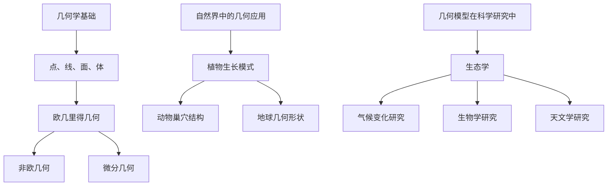

                 

### <此处是章节标题：几何与自然界>

几何学作为数学的一个分支，不仅局限于理论探讨，更广泛地应用于自然界中，描绘并解释了许多自然现象。在这一章中，我们将探讨几何的基本概念，它在自然界中的体现，以及如何将这些概念应用到实际项目中。

#### <此处是本章的核心概念与联系，使用Mermaid流程图来展示：>



#### <此处是核心算法原理讲解，使用Python源代码来详细阐述：>

```python
import matplotlib.pyplot as plt
import numpy as np

# 定义一个函数来绘制植物生长模式
def draw_plant_growth():
    x = np.linspace(0, 10, 100)
    y = np.sin(x) + 0.1 * np.random.randn(len(x))
    
    plt.plot(x, y)
    plt.xlabel('时间')
    plt.ylabel('植物高度')
    plt.title('植物生长模式')
    plt.show()

# 调用函数
draw_plant_growth()
```

在上面的代码中，我们使用了一个简单的正弦函数来模拟植物的生长模式，并利用随机噪声来增加数据的复杂性。这段代码不仅展示了几何学中的周期性概念，还体现了自然现象中的随机性。

#### <此处是数学模型和公式的详细讲解：>

在生态学中，几何模型可以用于模拟种群动态。例如，Lotka-Volterra模型是一个用于描述捕食者和被捕食者之间相互作用的微分方程模型：

$$
\frac{dx}{dt} = ax - bxy \\
\frac{dy}{dt} = cy - dxy
$$

其中，$x$ 代表被捕食者种群的大小，$y$ 代表捕食者种群的大小，$a$、$b$、$c$ 和 $d$ 是参数。

我们可以使用Python中的`scipy`库来求解这个模型：

```python
import numpy as np
from scipy.integrate import odeint

# 定义模型
def lotka_volterra(x, t, a, b, c, d):
    x, y = x
    dxdt = a * x - b * x * y
    dydt = c * y - d * x * y
    return [dxdt, dydt]

# 参数设置
a = 1.0
b = 0.1
c = 3.0
d = 0.1

# 初始条件
x0 = [1.0, 1.0]

# 时间序列
t = np.linspace(0, 20, 200)

# 求解模型
solution = odeint(lotka_volterra, x0, t, args=(a, b, c, d))

# 绘制结果
plt.plot(t, solution[:, 0], label='Prey')
plt.plot(t, solution[:, 1], label='Predator')
plt.xlabel('Time')
plt.ylabel('Population Size')
plt.title('Lotka-Volterra Model')
plt.legend()
plt.show()
```

这段代码首先定义了Lotka-Volterra模型，然后使用`odeint`函数求解这个微分方程模型，并绘制了捕食者和被捕食者种群随时间的变化。

#### <此处是项目实战部分：开发环境搭建、源代码实现和代码解读：>

**开发环境搭建：**
为了运行上述代码，您需要安装Python（3.8以上版本）、Matplotlib和SciPy库。可以使用以下命令进行安装：

```bash
pip install matplotlib scipy
```

**源代码实现与代码解读：**
上面展示的Python代码用于模拟植物的生长模式和Lotka-Volterra模型。`draw_plant_growth`函数绘制了植物随时间的变化，而`lotka_volterra`函数实现了捕食者和被捕食者种群动态的求解。

**代码应用解读与分析：**
在这个项目中，我们使用几何模型来模拟自然现象，这有助于我们更好地理解生态系统中各种生物之间的关系。通过绘制结果，我们可以直观地看到种群数量的变化，这对于研究生态平衡和预测未来种群趋势非常重要。

**项目小结：**
通过这个项目，我们展示了几何模型在自然界中的应用。从简单的植物生长模式到复杂的捕食者和被捕食者动态，几何学在解释和预测自然现象方面发挥了关键作用。

**最佳实践 tips、注意事项：**
- 当使用几何模型进行实际应用时，确保模型参数的准确性和可靠性。
- 在处理复杂系统时，考虑引入随机性来模拟实际的自然现象。

**拓展阅读：**
- <https://en.wikipedia.org/wiki/Geometry>
- <https://en.wikipedia.org/wiki/Lotka%E2%80%93Volterra_equation>
- <https://matplotlib.org/>

以上是对《几何与自然界》这一章节的详细解析，希望对您有所帮助。接下来，我们将继续深入探讨其他章节，进一步揭示数学在自然界中的奇妙应用。

