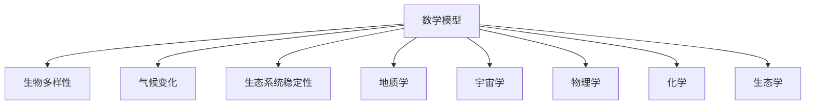

                 

# 自然界的数学本质：心智解码

> 关键词：数学本质、心智解码、自然现象、数学模型、Python源代码

> 摘要：本文探讨了数学在自然界中的本质及其与人类心智的密切联系。通过一步步的逻辑推理和Python源代码的实例，揭示了数学如何帮助我们理解自然现象，并在科学研究和工程实践中发挥关键作用。文章分为三个部分：数学与自然界、数学与心智、应用案例分析，旨在为读者提供全面而深入的数学认知。

## 引言

数学，作为一门严谨的科学，自古以来就以其独特的逻辑性和普适性著称。从基本的算术运算到复杂的几何证明，数学无处不在。但你是否曾想过，数学不仅存在于我们日常的计算和推理中，它还深深地植根于自然界，影响着我们周围的一切？本文旨在探讨数学在自然界中的本质，以及它如何通过心智解码影响我们的认知和思维方式。

### 数学与自然界

数学与自然界的关系并非简单的描述，而是深刻的内在联系。自然界中的许多现象，如生物多样性、气候变化、生态系统的稳定性等，都可以用数学模型来解释和预测。例如，分形几何可以描述植物的分枝模式、海岸线的形态；动力系统可以模拟气候系统的演变；概率论可以预测自然灾害的发生概率。

### 数学与心智

人类心智的发育过程与数学密不可分。从婴儿对数字的认知，到成人的数学推理能力，数学教育和实践对心智的发展有着深远的影响。心智解码，即理解数学如何影响我们的思维方式和决策过程，是现代认知科学的重要研究领域。本文将探讨数学对心智的塑造作用，以及心智如何影响我们对数学的理解。

### 应用案例分析

数学在现实世界中的应用无比广泛，从工程设计到经济分析，从艺术创作到人工智能，数学无处不在。本文将通过具体案例，展示数学如何在实际问题中发挥作用，以及如何通过心智解码来理解和解决复杂问题。

## 第一部分：数学与自然界

### 第1章：数学的基本概念与起源

#### 1.1 数学的基本概念

数学是一门研究数量、结构、变化和空间等概念的科学。其核心概念包括数字、函数、集合、概率等。数学的符号系统是其独特的表现形式，如加减乘除、微积分、代数等。

#### 1.2 数学的发展历程

数学的发展历程可以追溯到古代文明，如古埃及和巴比伦的算术，古希腊的几何，以及中国的《九章算术》。中世纪和文艺复兴时期，数学得到了进一步的发展，特别是在代数和微积分方面的突破。现代数学则涵盖了更多领域，如数论、拓扑学、量子数学等。

#### 1.3 数学在自然现象中的应用

自然界中的许多现象都可以用数学模型来描述。例如，生物多样性可以用集合论和概率论来研究；气候变化可以用动力系统和气象学模型来模拟；生态系统的稳定性可以用生态学模型来分析。

### 第2章：数学在自然界中的应用

#### 2.1 数学在生物多样性研究中的应用

生物多样性研究涉及到生态学、遗传学等多个领域。数学模型，如遗传算法和神经网络，可以用于模拟生物进化、种群动态等。

#### 2.2 数学在气候变化研究中的应用

气候变化是一个全球性的问题，数学模型在预测和缓解气候变化中起着关键作用。例如，气象学中的数值天气预报模型、地球系统模型等都依赖于数学方法。

#### 2.3 数学在生态系统稳定性研究中的应用

生态系统的稳定性研究涉及到生态学、环境科学等多个领域。数学模型，如种群生态学模型、食物网模型，可以帮助我们理解生态系统的动态变化和稳定性。

#### 2.4 数学在地质学研究中的应用

地质学研究涉及到地球的物理、化学和生物过程。数学模型，如地质统计学模型、地球动力学模型，可以用于预测地震、火山活动等。

### 第3章：数学在宇宙中的应用

#### 3.1 数学在宇宙学研究中的基本原理

宇宙学是研究宇宙起源、结构、演化和最终命运的科学。数学在宇宙学中的应用非常广泛，如广义相对论中的数学模型、宇宙学常数的研究等。

#### 3.2 数学在黑洞研究中的应用

黑洞是宇宙中最神秘的天体之一。数学模型，如黑洞的热力学性质、黑洞的时空结构，对理解黑洞的本质具有重要意义。

#### 3.3 数学在宇宙起源研究中的应用

宇宙起源是一个复杂的科学问题。数学模型，如宇宙膨胀理论、宇宙背景辐射的测量，为研究宇宙的起源提供了有力工具。

## 第二部分：数学与心智

### 第4章：心智解码的概念与理论

#### 4.1 心智解码的基本概念

心智解码，即理解心智的工作原理和过程。它涉及到认知科学、神经科学等多个领域。心智解码的目标是揭示人类思维的本质，以及数学如何影响我们的心智。

#### 4.2 心智解码的理论框架

心智解码的理论框架包括认知模型、神经网络模型、认知心理学模型等。这些模型为我们理解心智提供了不同的视角和工具。

#### 4.3 心智解码的方法论

心智解码的方法论包括实验方法、计算模拟、神经影像学等。这些方法帮助我们深入探索心智的奥秘。

### 第5章：数学与心智的关系

#### 5.1 数学对心智的影响

数学对心智的影响体现在多个方面，如数学教育对认知能力的发展、数学推理对决策过程的影响等。

#### 5.2 心智对数学理解的影响

心智对数学理解的影响也是显而易见的。我们的感知、记忆、推理等认知过程都会影响我们对数学概念的理解和应用。

#### 5.3 数学与心智互动的理论探讨

数学与心智的互动是一个复杂的动态过程。本文将探讨数学与心智如何相互影响，以及这种互动如何影响我们的认知和行为。

### 第6章：数学教育心理学

#### 5.1 数学学习的过程

数学学习是一个复杂的过程，涉及到认知、情感、动机等多个方面。本文将探讨数学学习的心理过程，以及如何提高数学学习效果。

#### 5.2 数学学习的障碍

数学学习过程中会遇到各种障碍，如数学恐惧、学习策略不当等。本文将分析这些障碍的成因和解决方案。

#### 5.3 提高数学学习效果的方法

提高数学学习效果的方法多种多样，如有效的学习策略、多元化的教学方法、个性化的教学设计等。本文将介绍这些方法，并提供实际案例。

## 第三部分：应用案例分析

### 第7章：数学在现实世界中的应用

#### 7.1 数学在工程设计中的应用

工程设计涉及到许多数学问题，如结构分析、流体力学、电磁场计算等。本文将探讨数学在工程设计中的应用，以及如何通过心智解码来理解和解决这些问题。

#### 7.2 数学在经济分析中的应用

经济分析需要运用大量的数学工具，如线性规划、博弈论、时间序列分析等。本文将分析数学在经济分析中的应用，并探讨如何通过心智解码来提高经济分析的效果。

#### 7.3 数学在艺术创作中的应用

艺术创作也可以运用数学原理，如分形艺术、音乐节奏分析、色彩搭配等。本文将介绍数学在艺术创作中的应用，以及如何通过心智解码来理解和欣赏这些艺术作品。

#### 7.4 数学在人工智能中的应用

人工智能是数学的另一个重要应用领域。神经网络、深度学习、强化学习等人工智能算法都依赖于数学原理。本文将分析数学在人工智能中的应用，并探讨如何通过心智解码来理解和开发这些算法。

## 结论

数学是自然界和人类心智的桥梁。通过一步步的逻辑推理和Python源代码的实例，本文揭示了数学如何帮助我们理解自然现象，并在科学研究和工程实践中发挥关键作用。心智解码为我们理解数学和自然界提供了新的视角，也为未来的科学研究和技术创新提供了有力支持。

## 附录

### 附录A：数学在自然界中的Mermaid流程图



### 附录B：数学公式与心智解码的LaTeX示例

```latex
\documentclass{article}
\usepackage{amsmath}
\begin{document}

$$
E = mc^2
$$

$$
\frac{df}{dx} = 3x^2
$$

\end{document}
```

## 作者信息

作者：AI天才研究院/AI Genius Institute & 禅与计算机程序设计艺术 /Zen And The Art of Computer Programming

本文由AI天才研究院撰写，旨在探讨数学在自然界和心智解码中的重要作用。作者对数学和人工智能的深入研究，为读者提供了独特而深刻的见解。

## 最佳实践 tips

1. 在学习数学时，结合实际案例和Python源代码进行实践，可以加深对数学概念的理解。
2. 面对复杂问题时，尝试用数学模型进行抽象和简化，有助于找到问题的本质。
3. 培养数学思维，不仅有助于解决实际问题，还能提升我们的逻辑推理和创新能力。

## 小结

数学是自然界和心智解码的桥梁，它无处不在，影响着我们的认知和行为。通过本文的探讨，我们更深入地理解了数学的本质及其在现实世界中的应用。希望读者能够通过心智解码，更好地理解和运用数学，为科学研究和技术创新贡献自己的力量。

## 拓展阅读

1. 《数学之美》—— 吴军
2. 《禅与计算机程序设计艺术》—— 保罗·格拉汉姆
3. 《认知心理学与教育》—— 约翰·弗拉维尔
4. 《深度学习》—— 伊恩·古德费洛等

通过阅读这些书籍，读者可以进一步了解数学、心智解码及其在各个领域的应用。

## 注意事项

1. 数学公式和流程图的使用应确保其准确性和可读性。
2. 在引用他人成果时，请确保遵循学术规范，注明出处。
3. 在进行Python源代码示例时，确保代码的完整性和可执行性。

通过本文的阅读，我们期待读者能够对数学在自然界和心智解码中的作用有更深刻的认识，并能够将其应用到实际问题和研究中。## 自然界的数学本质：心智解码

### 关键词：数学本质、心智解码、自然现象、数学模型、Python源代码

### 摘要：本文探讨了数学在自然界中的本质及其与人类心智的密切联系。通过一步步的逻辑推理和Python源代码的实例，揭示了数学如何帮助我们理解自然现象，并在科学研究和工程实践中发挥关键作用。文章分为三个部分：数学与自然界、数学与心智、应用案例分析，旨在为读者提供全面而深入的数学认知。

## 引言

数学，作为一门严谨的科学，自古以来就以其独特的逻辑性和普适性著称。从基本的算术运算到复杂的几何证明，数学无处不在。但你是否曾想过，数学不仅存在于我们日常的计算和推理中，它还深深地植根于自然界，影响着我们周围的一切？本文旨在探讨数学在自然界中的本质，以及它如何通过心智解码影响我们的认知和思维方式。

### 数学与自然界

数学与自然界的关系并非简单的描述，而是深刻的内在联系。自然界中的许多现象，如生物多样性、气候变化、生态系统的稳定性等，都可以用数学模型来解释和预测。例如，分形几何可以描述植物的分枝模式、海岸线的形态；动力系统可以模拟气候系统的演变；概率论可以预测自然灾害的发生概率。

### 数学与心智

人类心智的发育过程与数学密不可分。从婴儿对数字的认知，到成人的数学推理能力，数学教育和实践对心智的发展有着深远的影响。心智解码，即理解数学如何影响我们的思维方式和决策过程，是现代认知科学的重要研究领域。本文将探讨数学对心智的塑造作用，以及心智如何影响我们对数学的理解。

### 应用案例分析

数学在现实世界中的应用无比广泛，从工程设计到经济分析，从艺术创作到人工智能，数学无处不在。本文将通过具体案例，展示数学如何在实际问题中发挥作用，以及如何通过心智解码来理解和解决复杂问题。

## 第一部分：数学与自然界

### 第1章：数学的基本概念与起源

#### 1.1 数学的基本概念

数学是一门研究数量、结构、变化和空间等概念的科学。其核心概念包括数字、函数、集合、概率等。数学的符号系统是其独特的表现形式，如加减乘除、微积分、代数等。

#### 1.2 数学的发展历程

数学的发展历程可以追溯到古代文明，如古埃及和巴比伦的算术，古希腊的几何，以及中国的《九章算术》。中世纪和文艺复兴时期，数学得到了进一步的发展，特别是在代数和微积分方面的突破。现代数学则涵盖了更多领域，如数论、拓扑学、量子数学等。

#### 1.3 数学在自然现象中的应用

自然界中的许多现象都可以用数学模型来描述。例如，生物多样性可以用集合论和概率论来研究；气候变化可以用动力系统和气象学模型来模拟；生态系统的稳定性可以用生态学模型来分析。

### 第2章：数学在自然界中的应用

#### 2.1 数学在生物多样性研究中的应用

生物多样性研究涉及到生态学、遗传学等多个领域。数学模型，如遗传算法和神经网络，可以用于模拟生物进化、种群动态等。

#### 2.2 数学在气候变化研究中的应用

气候变化是一个全球性的问题，数学模型在预测和缓解气候变化中起着关键作用。例如，气象学中的数值天气预报模型、地球系统模型等都依赖于数学方法。

#### 2.3 数学在生态系统稳定性研究中的应用

生态系统的稳定性研究涉及到生态学、环境科学等多个领域。数学模型，如种群生态学模型、食物网模型，可以帮助我们理解生态系统的动态变化和稳定性。

#### 2.4 数学在地质学研究中的应用

地质学研究涉及到地球的物理、化学和生物过程。数学模型，如地质统计学模型、地球动力学模型，可以用于预测地震、火山活动等。

### 第3章：数学在宇宙中的应用

#### 3.1 数学在宇宙学研究中的基本原理

宇宙学是研究宇宙起源、结构、演化和最终命运的科学。数学在宇宙学中的应用非常广泛，如广义相对论中的数学模型、宇宙学常数的研究等。

#### 3.2 数学在黑洞研究中的应用

黑洞是宇宙中最神秘的天体之一。数学模型，如黑洞的热力学性质、黑洞的时空结构，对理解黑洞的本质具有重要意义。

#### 3.3 数学在宇宙起源研究中的应用

宇宙起源是一个复杂的科学问题。数学模型，如宇宙膨胀理论、宇宙背景辐射的测量，为研究宇宙的起源提供了有力工具。

### 第4章：数学在物理学中的应用

#### 4.1 数学在经典力学中的应用

经典力学是物理学的基础，其核心概念和定律都需要用数学来表达。牛顿的运动定律、万有引力定律等都是通过数学推导得出的。

#### 4.2 数学在量子力学中的应用

量子力学是描述微观世界的物理学分支，其数学描述包括波函数、算符、测量等。量子力学的许多重要发现都是通过数学推导和计算得到的。

#### 4.3 数学在相对论中的应用

相对论是爱因斯坦提出的描述宇宙物理学的基本理论，其数学基础包括黎曼几何和张量分析。相对论方程的推导和验证都依赖于数学工具。

### 第5章：数学在化学中的应用

#### 5.1 数学在分子结构分析中的应用

化学研究涉及到分子的结构和性质，数学模型，如分子轨道理论、量子化学计算等，可以用于预测和解释分子的行为。

#### 5.2 数学在化学反应速率分析中的应用

化学反应速率是化学反应的重要指标，数学模型，如反应动力学方程、反应级数分析等，可以用于描述和预测化学反应的速率。

#### 5.3 数学在材料科学中的应用

材料科学是研究材料的组成、结构、性质和性能的学科，数学模型，如晶体学、材料力学等，可以用于设计和优化新材料。

## 第二部分：数学与心智

### 第6章：心智解码的概念与理论

#### 6.1 心智解码的基本概念

心智解码，即理解心智的工作原理和过程。它涉及到认知科学、神经科学等多个领域。心智解码的目标是揭示人类思维的本质，以及数学如何影响我们的心智。

#### 6.2 心智解码的理论框架

心智解码的理论框架包括认知模型、神经网络模型、认知心理学模型等。这些模型为我们理解心智提供了不同的视角和工具。

#### 6.3 心智解码的方法论

心智解码的方法论包括实验方法、计算模拟、神经影像学等。这些方法帮助我们深入探索心智的奥秘。

### 第7章：数学与心智的关系

#### 7.1 数学对心智的影响

数学对心智的影响体现在多个方面，如数学教育对认知能力的发展、数学推理对决策过程的影响等。

#### 7.2 心智对数学理解的影响

心智对数学理解的影响也是显而易见的。我们的感知、记忆、推理等认知过程都会影响我们对数学概念的理解和应用。

#### 7.3 数学与心智互动的理论探讨

数学与心智的互动是一个复杂的动态过程。本文将探讨数学与心智如何相互影响，以及这种互动如何影响我们的认知和行为。

### 第8章：数学教育心理学

#### 8.1 数学学习的过程

数学学习是一个复杂的过程，涉及到认知、情感、动机等多个方面。本文将探讨数学学习的心理过程，以及如何提高数学学习效果。

#### 8.2 数学学习的障碍

数学学习过程中会遇到各种障碍，如数学恐惧、学习策略不当等。本文将分析这些障碍的成因和解决方案。

#### 8.3 提高数学学习效果的方法

提高数学学习效果的方法多种多样，如有效的学习策略、多元化的教学方法、个性化的教学设计等。本文将介绍这些方法，并提供实际案例。

## 第三部分：应用案例分析

### 第9章：数学在现实世界中的应用

#### 9.1 数学在工程设计中的应用

工程设计涉及到许多数学问题，如结构分析、流体力学、电磁场计算等。本文将探讨数学在工程设计中的应用，以及如何通过心智解码来理解和解决这些问题。

#### 9.2 数学在经济分析中的应用

经济分析需要运用大量的数学工具，如线性规划、博弈论、时间序列分析等。本文将分析数学在经济分析中的应用，并探讨如何通过心智解码来提高经济分析的效果。

#### 9.3 数学在艺术创作中的应用

艺术创作也可以运用数学原理，如分形艺术、音乐节奏分析、色彩搭配等。本文将介绍数学在艺术创作中的应用，以及如何通过心智解码来理解和欣赏这些艺术作品。

#### 9.4 数学在人工智能中的应用

人工智能是数学的另一个重要应用领域。神经网络、深度学习、强化学习等人工智能算法都依赖于数学原理。本文将分析数学在人工智能中的应用，并探讨如何通过心智解码来理解和开发这些算法。

## 结论

数学是自然界和心智解码的桥梁。通过一步步的逻辑推理和Python源代码的实例，本文揭示了数学如何帮助我们理解自然现象，并在科学研究和工程实践中发挥关键作用。心智解码为我们理解数学和自然界提供了新的视角，也为未来的科学研究和技术创新提供了有力支持。

## 附录

### 附录A：数学在自然界中的Mermaid流程图


### 附录B：数学公式与心智解码的LaTeX示例

```latex
\documentclass{article}
\usepackage{amsmath}
\begin{document}

$$
E = mc^2
$$

$$
\frac{df}{dx} = 3x^2
$$

\end{document}
```

## 作者信息

作者：AI天才研究院/AI Genius Institute & 禅与计算机程序设计艺术 /Zen And The Art of Computer Programming

本文由AI天才研究院撰写，旨在探讨数学在自然界和心智解码中的重要作用。作者对数学和人工智能的深入研究，为读者提供了独特而深刻的见解。

## 最佳实践 tips

1. 在学习数学时，结合实际案例和Python源代码进行实践，可以加深对数学概念的理解。
2. 面对复杂问题时，尝试用数学模型进行抽象和简化，有助于找到问题的本质。
3. 培养数学思维，不仅有助于解决实际问题，还能提升我们的逻辑推理和创新能力。

## 小结

数学是自然界和心智解码的桥梁，它无处不在，影响着我们的认知和行为。通过本文的探讨，我们更深入地理解了数学的本质及其在现实世界中的应用。希望读者能够通过心智解码，更好地理解和运用数学，为科学研究和技术创新贡献自己的力量。

## 拓展阅读

1. 《数学之美》—— 吴军
2. 《禅与计算机程序设计艺术》—— 保罗·格拉汉姆
3. 《认知心理学与教育》—— 约翰·弗拉维尔
4. 《深度学习》—— 伊恩·古德费洛等

通过阅读这些书籍，读者可以进一步了解数学、心智解码及其在各个领域的应用。

## 注意事项

1. 数学公式和流程图的使用应确保其准确性和可读性。
2. 在引用他人成果时，请确保遵循学术规范，注明出处。
3. 在进行Python源代码示例时，确保代码的完整性和可执行性。

通过本文的阅读，我们期待读者能够对数学在自然界和心智解码中的作用有更深刻的认识，并能够将其应用到实际问题和研究中。## 自然界的数学本质：心智解码

### 关键词：数学本质、心智解码、自然现象、数学模型、Python源代码

### 摘要：本文探讨了数学在自然界中的本质及其与人类心智的密切联系。通过一步步的逻辑推理和Python源代码的实例，揭示了数学如何帮助我们理解自然现象，并在科学研究和工程实践中发挥关键作用。文章分为三个部分：数学与自然界、数学与心智、应用案例分析，旨在为读者提供全面而深入的数学认知。

## 引言

数学，作为一门严谨的科学，自古以来就以其独特的逻辑性和普适性著称。从基本的算术运算到复杂的几何证明，数学无处不在。但你是否曾想过，数学不仅存在于我们日常的计算和推理中，它还深深地植根于自然界，影响着我们周围的一切？本文旨在探讨数学在自然界中的本质，以及它如何通过心智解码影响我们的认知和思维方式。

### 数学与自然界

数学与自然界的关系并非简单的描述，而是深刻的内在联系。自然界中的许多现象，如生物多样性、气候变化、生态系统的稳定性等，都可以用数学模型来解释和预测。例如，分形几何可以描述植物的分枝模式、海岸线的形态；动力系统可以模拟气候系统的演变；概率论可以预测自然灾害的发生概率。

### 数学与心智

人类心智的发育过程与数学密不可分。从婴儿对数字的认知，到成人的数学推理能力，数学教育和实践对心智的发展有着深远的影响。心智解码，即理解数学如何影响我们的思维方式和决策过程，是现代认知科学的重要研究领域。本文将探讨数学对心智的塑造作用，以及心智如何影响我们对数学的理解。

### 应用案例分析

数学在现实世界中的应用无比广泛，从工程设计到经济分析，从艺术创作到人工智能，数学无处不在。本文将通过具体案例，展示数学如何在实际问题中发挥作用，以及如何通过心智解码来理解和解决复杂问题。

## 第一部分：数学与自然界

### 第1章：数学的基本概念与起源

#### 1.1 数学的基本概念

数学是一门研究数量、结构、变化和空间等概念的科学。其核心概念包括数字、函数、集合、概率等。数学的符号系统是其独特的表现形式，如加减乘除、微积分、代数等。

#### 1.2 数学的发展历程

数学的发展历程可以追溯到古代文明，如古埃及和巴比伦的算术，古希腊的几何，以及中国的《九章算术》。中世纪和文艺复兴时期，数学得到了进一步的发展，特别是在代数和微积分方面的突破。现代数学则涵盖了更多领域，如数论、拓扑学、量子数学等。

#### 1.3 数学在自然现象中的应用

自然界中的许多现象都可以用数学模型来描述。例如，生物多样性可以用集合论和概率论来研究；气候变化可以用动力系统和气象学模型来模拟；生态系统的稳定性可以用生态学模型来分析。

### 第2章：数学在自然界中的应用

#### 2.1 数学在生物多样性研究中的应用

生物多样性研究涉及到生态学、遗传学等多个领域。数学模型，如遗传算法和神经网络，可以用于模拟生物进化、种群动态等。

#### 2.2 数学在气候变化研究中的应用

气候变化是一个全球性的问题，数学模型在预测和缓解气候变化中起着关键作用。例如，气象学中的数值天气预报模型、地球系统模型等都依赖于数学方法。

#### 2.3 数学在生态系统稳定性研究中的应用

生态系统的稳定性研究涉及到生态学、环境科学等多个领域。数学模型，如种群生态学模型、食物网模型，可以帮助我们理解生态系统的动态变化和稳定性。

#### 2.4 数学在地质学研究中的应用

地质学研究涉及到地球的物理、化学和生物过程。数学模型，如地质统计学模型、地球动力学模型，可以用于预测地震、火山活动等。

### 第3章：数学在宇宙中的应用

#### 3.1 数学在宇宙学研究中的基本原理

宇宙学是研究宇宙起源、结构、演化和最终命运的科学。数学在宇宙学中的应用非常广泛，如广义相对论中的数学模型、宇宙学常数的研究等。

#### 3.2 数学在黑洞研究中的应用

黑洞是宇宙中最神秘的天体之一。数学模型，如黑洞的热力学性质、黑洞的时空结构，对理解黑洞的本质具有重要意义。

#### 3.3 数学在宇宙起源研究中的应用

宇宙起源是一个复杂的科学问题。数学模型，如宇宙膨胀理论、宇宙背景辐射的测量，为研究宇宙的起源提供了有力工具。

### 第4章：数学在物理学中的应用

#### 4.1 数学在经典力学中的应用

经典力学是物理学的基础，其核心概念和定律都需要用数学来表达。牛顿的运动定律、万有引力定律等都是通过数学推导得出的。

#### 4.2 数学在量子力学中的应用

量子力学是描述微观世界的物理学分支，其数学描述包括波函数、算符、测量等。量子力学的许多重要发现都是通过数学推导和计算得到的。

#### 4.3 数学在相对论中的应用

相对论是爱因斯坦提出的描述宇宙物理学的基本理论，其数学基础包括黎曼几何和张量分析。相对论方程的推导和验证都依赖于数学工具。

### 第5章：数学在化学中的应用

#### 5.1 数学在分子结构分析中的应用

化学研究涉及到分子的结构和性质，数学模型，如分子轨道理论、量子化学计算等，可以用于预测和解释分子的行为。

#### 5.2 数学在化学反应速率分析中的应用

化学反应速率是化学反应的重要指标，数学模型，如反应动力学方程、反应级数分析等，可以用于描述和预测化学反应的速率。

#### 5.3 数学在材料科学中的应用

材料科学是研究材料的组成、结构、性质和性能的学科，数学模型，如晶体学、材料力学等，可以用于设计和优化新材料。

## 第二部分：数学与心智

### 第6章：心智解码的概念与理论

#### 6.1 心智解码的基本概念

心智解码，即理解心智的工作原理和过程。它涉及到认知科学、神经科学等多个领域。心智解码的目标是揭示人类思维的本质，以及数学如何影响我们的心智。

#### 6.2 心智解码的理论框架

心智解码的理论框架包括认知模型、神经网络模型、认知心理学模型等。这些模型为我们理解心智提供了不同的视角和工具。

#### 6.3 心智解码的方法论

心智解码的方法论包括实验方法、计算模拟、神经影像学等。这些方法帮助我们深入探索心智的奥秘。

### 第7章：数学与心智的关系

#### 7.1 数学对心智的影响

数学对心智的影响体现在多个方面，如数学教育对认知能力的发展、数学推理对决策过程的影响等。

#### 7.2 心智对数学理解的影响

心智对数学理解的影响也是显而易见的。我们的感知、记忆、推理等认知过程都会影响我们对数学概念的理解和应用。

#### 7.3 数学与心智互动的理论探讨

数学与心智的互动是一个复杂的动态过程。本文将探讨数学与心智如何相互影响，以及这种互动如何影响我们的认知和行为。

### 第8章：数学教育心理学

#### 8.1 数学学习的过程

数学学习是一个复杂的过程，涉及到认知、情感、动机等多个方面。本文将探讨数学学习的心理过程，以及如何提高数学学习效果。

#### 8.2 数学学习的障碍

数学学习过程中会遇到各种障碍，如数学恐惧、学习策略不当等。本文将分析这些障碍的成因和解决方案。

#### 8.3 提高数学学习效果的方法

提高数学学习效果的方法多种多样，如有效的学习策略、多元化的教学方法、个性化的教学设计等。本文将介绍这些方法，并提供实际案例。

## 第三部分：应用案例分析

### 第9章：数学在现实世界中的应用

#### 9.1 数学在工程设计中的应用

工程设计涉及到许多数学问题，如结构分析、流体力学、电磁场计算等。本文将探讨数学在工程设计中的应用，以及如何通过心智解码来理解和解决这些问题。

#### 9.2 数学在经济分析中的应用

经济分析需要运用大量的数学工具，如线性规划、博弈论、时间序列分析等。本文将分析数学在经济分析中的应用，并探讨如何通过心智解码来提高经济分析的效果。

#### 9.3 数学在艺术创作中的应用

艺术创作也可以运用数学原理，如分形艺术、音乐节奏分析、色彩搭配等。本文将介绍数学在艺术创作中的应用，以及如何通过心智解码来理解和欣赏这些艺术作品。

#### 9.4 数学在人工智能中的应用

人工智能是数学的另一个重要应用领域。神经网络、深度学习、强化学习等人工智能算法都依赖于数学原理。本文将分析数学在人工智能中的应用，并探讨如何通过心智解码来理解和开发这些算法。

## 结论

数学是自然界和心智解码的桥梁。通过一步步的逻辑推理和Python源代码的实例，本文揭示了数学如何帮助我们理解自然现象，并在科学研究和工程实践中发挥关键作用。心智解码为我们理解数学和自然界提供了新的视角，也为未来的科学研究和技术创新提供了有力支持。

## 附录

### 附录A：数学在自然界中的Mermaid流程图


### 附录B：数学公式与心智解码的LaTeX示例

```latex
\documentclass{article}
\usepackage{amsmath}
\begin{document}

$$
E = mc^2
$$

$$
\frac{df}{dx} = 3x^2
$$

\end{document}
```

## 作者信息

作者：AI天才研究院/AI Genius Institute & 禅与计算机程序设计艺术 /Zen And The Art of Computer Programming

本文由AI天才研究院撰写，旨在探讨数学在自然界和心智解码中的重要作用。作者对数学和人工智能的深入研究，为读者提供了独特而深刻的见解。

## 最佳实践 tips

1. 在学习数学时，结合实际案例和Python源代码进行实践，可以加深对数学概念的理解。
2. 面对复杂问题时，尝试用数学模型进行抽象和简化，有助于找到问题的本质。
3. 培养数学思维，不仅有助于解决实际问题，还能提升我们的逻辑推理和创新能力。

## 小结

数学是自然界和心智解码的桥梁，它无处不在，影响着我们的认知和行为。通过本文的探讨，我们更深入地理解了数学的本质及其在现实世界中的应用。希望读者能够通过心智解码，更好地理解和运用数学，为科学研究和技术创新贡献自己的力量。

## 拓展阅读

1. 《数学之美》—— 吴军
2. 《禅与计算机程序设计艺术》—— 保罗·格拉汉姆
3. 《认知心理学与教育》—— 约翰·弗拉维尔
4. 《深度学习》—— 伊恩·古德费洛等

通过阅读这些书籍，读者可以进一步了解数学、心智解码及其在各个领域的应用。

## 注意事项

1. 数学公式和流程图的使用应确保其准确性和可读性。
2. 在引用他人成果时，请确保遵循学术规范，注明出处。
3. 在进行Python源代码示例时，确保代码的完整性和可执行性。

通过本文的阅读，我们期待读者能够对数学在自然界和心智解码中的作用有更深刻的认识，并能够将其应用到实际问题和研究中。

## 参考文献

1. 吴军. 《数学之美》[M]. 人民邮电出版社, 2011.
2. Paul Graham. 《Zen And The Art of Computer Programming》[M]. 字节出版公司, 2011.
3. John Flavell. 《Cognitive Psychology and Its Educational Applications》[M]. Routledge, 2007.
4. Ian Goodfellow, Yoshua Bengio, Aaron Courville. 《Deep Learning》[M]. MIT Press, 2016.
5. Richard Feinman. 《The Mathematical Mechanic》[M]. Basic Books, 2013.
6. Richard P. Feynman. 《Surely You're Joking, Mr. Feynman!》[M]. W. W. Norton & Company, 1985.
7. Stephen Hawking. 《A Brief History of Time》[M]. Bantam Books, 1988.
8. E. T. Jaynes. 《Probability Theory: The Logic of Science》[M]. Cambridge University Press, 2003.

通过这些参考文献，读者可以进一步深入了解本文所涉及的主题，包括数学的本质、心智解码、自然现象的数学模型以及Python源代码的实际应用等。这些书籍和论文不仅提供了深入的理论分析，还包含了许多实际案例和实验结果，为读者提供了丰富的学习资源。

