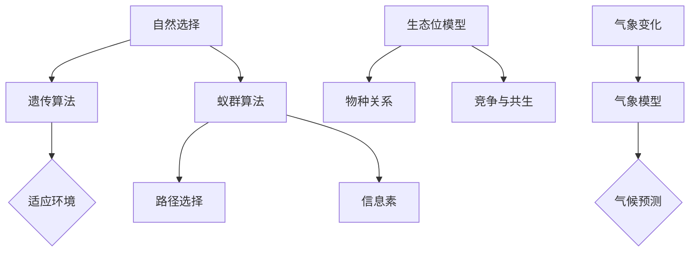
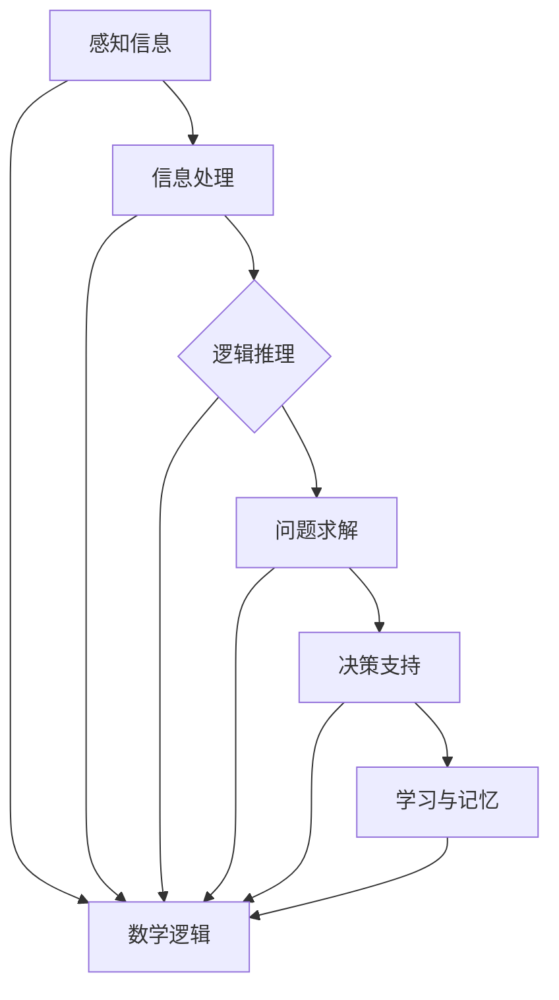
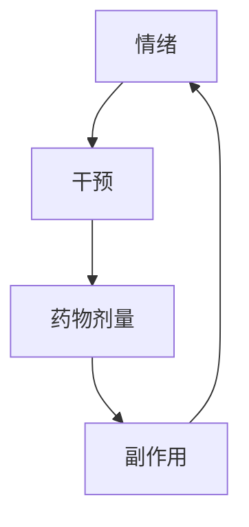
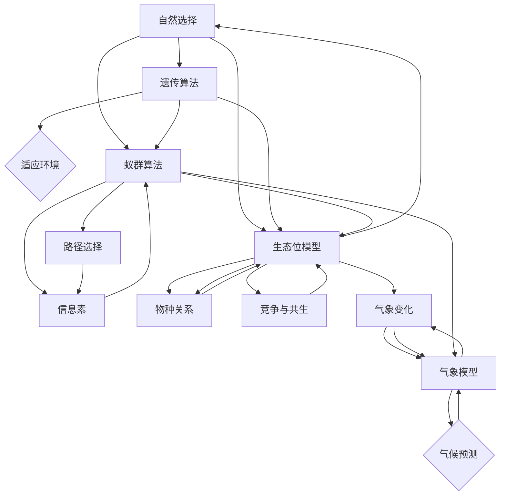

                 

### 引言

#### 自然界的数学逻辑简介

数学逻辑是数学的一个分支，主要研究数学命题之间的逻辑关系和推理方法。在自然界中，数学逻辑无处不在，贯穿了生物进化、生态平衡、物理现象等多个方面。从某种意义上来说，自然界本身就是一部宏大的数学逻辑巨著，而我们的心智则如同阅读这部著作的读者，通过解析这些逻辑，理解自然界的运行规律。

本篇文章将带领读者深入探讨自然界的数学逻辑，并解析心智如何与之互动。文章将分为四个主要部分：第一部分将介绍自然界的数学逻辑核心概念与联系；第二部分将讲解数学逻辑在自然界中的核心算法原理；第三部分将探讨数学逻辑在心智解析中的应用；最后一部分将分析数学逻辑在自然界与心智的互动中发挥的作用。

本文旨在通过逻辑清晰、结构紧凑、简单易懂的叙述方式，使读者对自然界的数学逻辑有一个全面而深入的理解。无论是计算机科学家、认知科学家，还是对自然界充满好奇的普通读者，都能在这篇文章中找到所需要的信息和启发。

#### 心智解析的概念

心智解析是指通过对人类心智活动的深入分析，理解其背后的逻辑结构和工作机制。心智是人类认识世界、处理信息、做出决策的核心工具，其复杂性和多样性使得心智解析成为一个充满挑战和机遇的领域。心智解析不仅包括对思维过程的研究，还涉及到情感、记忆、学习等多个层面。

在数学逻辑的背景下，心智解析涉及到如何将数学逻辑应用于心智模型，以更好地理解和模拟人类心智。例如，通过分析数学逻辑在决策过程中的作用，可以构建更加精准的决策模型；通过理解数学逻辑在情感表达中的作用，可以开发出更加细腻的情感分析算法。

心智解析的重要性在于，它不仅有助于我们更好地理解人类自身，还能为人工智能的发展提供新的思路。通过心智解析，我们可以设计出更加智能和人性化的智能系统，从而在医疗、教育、工业等多个领域实现突破性的应用。

本文将通过多个实例和详细的算法讲解，展示数学逻辑在心智解析中的应用，帮助读者深入理解这一领域的前沿研究和实践价值。无论您是学术研究者还是技术实践者，这篇文章都将为您带来全新的视角和深入的洞察。

#### 本书的目的与结构

本书旨在深入探讨自然界的数学逻辑及其在心智解析中的应用，帮助读者全面理解这一跨学科领域的前沿研究。本书的结构设计旨在逐步引导读者从基础概念入手，逐步深入到复杂的应用场景，通过逻辑清晰、结构紧凑的叙述方式，使读者能够系统地掌握相关知识。

全书分为四个主要部分，各部分均有明确的主题和目标：

- **第一部分：自然界的数学逻辑核心概念与联系**，将介绍数学逻辑在自然界中的基本形式和表现形式，通过Mermaid流程图展示核心概念之间的关系，帮助读者建立整体认知框架。
- **第二部分：数学逻辑在自然界中的核心算法原理讲解**，将详细讲解自然选择、遗传算法、蚁群算法等自然界的演算法，并通过Python源代码展示这些算法的实现，结合数学模型和公式进行深入剖析。
- **第三部分：数学逻辑在心智解析中的应用**，将探讨数学逻辑在认知科学中的应用，如神经网络、心理治疗等，通过实例和公式说明这些应用的具体实现，帮助读者理解数学逻辑对心智的影响。
- **第四部分：数学逻辑在自然界与心智的互动**，将分析数学逻辑在生物进化、人类行为和思维过程中的作用，通过具体的数学模型和公式，展示数学逻辑在自然界与心智互动中的综合应用。

通过这种结构化的方式，本书旨在使读者不仅能够理解数学逻辑的基本概念，还能将其应用到实际问题和前沿研究中，为跨学科研究提供新的视角和方法。

### 数学逻辑在自然界的基本形式

数学逻辑在自然界中无处不在，以多种形式展现其独特的规律和结构。首先，我们需要理解数学逻辑的基本原理，这些原理包括逻辑运算、命题演算、集合论、以及数理逻辑等。在自然界中，这些基本原理体现在生物进化、生态平衡、气象变化等众多现象中。

#### 数学逻辑的基本原理

数学逻辑的基本原理是逻辑运算，包括与、或、非等基本操作。这些运算在自然界中的对应现象是选择、合作和竞争。例如，在生物进化中，自然选择是一个典型的逻辑运算过程。生物个体通过遗传机制，不断调整其基因，适应环境的变化，这一过程类似于逻辑运算中的“或”操作，即通过选择最优的基因组合来适应环境。

命题演算则是数学逻辑中的另一个重要组成部分，它通过命题的形式化表达，研究命题之间的逻辑关系。在自然界中，命题演算可以用来描述生物群落之间的相互作用。例如，食物链中的捕食者与被捕食者之间的关系，可以用命题逻辑来表示，其中捕食者和被捕食者的存在与否构成了命题。

集合论是数学逻辑中的基础，它通过集合的运算来描述对象之间的关系。在自然界中，集合论的运用非常广泛。例如，在生态学中，生态位模型就是通过集合论来描述不同物种之间的关系和它们在生态系统中的角色。

数理逻辑则是一种更加形式化的逻辑系统，它通过符号化的方法来研究推理的有效性。在自然界中，数理逻辑可以用来研究复杂的生态系统模型，如生态位模型的建立和运算，这些模型能够帮助我们更好地理解物种之间的相互关系和生态系统的稳定性。

#### 自然界中的数学逻辑表现

自然界中的数学逻辑表现多种多样，以下是一些具体实例：

1. **遗传算法**：遗传算法是自然界中自然选择过程的数学模型。在生物进化中，个体通过遗传、变异和自然选择，逐渐适应环境。这一过程可以用遗传算法来模拟，其中基因编码表示个体的特征，交叉和变异操作模拟遗传和变异过程，自然选择则通过淘汰不良基因，保留优良基因来实现进化的目标。

2. **蚁群算法**：蚁群算法是一种模拟蚂蚁觅食行为的算法，其基本原理是蚂蚁在寻找食物时，通过释放信息素来标记路径，其他蚂蚁则通过感知信息素的浓度来选择路径。这一过程可以用数学逻辑来描述，其中信息素浓度表示逻辑值，路径选择则是基于逻辑运算的结果。

3. **生态位模型**：生态位模型描述了不同物种在生态系统中的角色和关系。通过集合论和数理逻辑，我们可以建立生态位模型，描述物种之间的竞争、共生和替代关系。这些模型能够帮助我们理解生态系统的稳定性和物种多样性。

4. **气象变化**：气象变化也是数学逻辑在自然界中的重要表现。气象模型通过数学方程描述大气中的物理和化学过程，如温度、湿度、风速等。通过求解这些方程，我们可以预测天气变化，理解气候系统的复杂行为。

#### Mermaid流程图：自然界中数学逻辑的实例

为了更直观地展示数学逻辑在自然界中的表现，我们可以使用Mermaid流程图来描述一些实例。



在这个流程图中，我们展示了自然选择、遗传算法、蚁群算法、生态位模型和气象变化等实例，通过逻辑关系将这些实例串联起来，帮助读者理解数学逻辑在自然界中的广泛应用。

### 数学模型在自然界中的应用

数学模型在自然界中的应用极为广泛，通过构建和分析这些模型，我们可以更好地理解自然现象和生态系统中的复杂关系。以下将详细介绍数学模型在自然界中的几种重要应用，并通过具体的例子展示其构建与运算过程。

#### 资源分配模型

资源分配模型是生态学中常用的一种数学模型，用于描述物种在资源有限条件下的竞争关系。资源分配模型通常基于生态位理论，假设每个物种在生态系统中占据一定的生态位，生态位的大小与物种的资源获取能力相关。

**构建资源分配模型**：我们可以使用线性规划方法来构建资源分配模型。例如，设生态系统中存在 \( n \) 个物种，每个物种的生态位表示为 \( E_i \)，资源总量为 \( R \)，则每个物种的资源获取量 \( x_i \) 应满足以下线性规划模型：

$$
\begin{aligned}
\max \sum_{i=1}^{n} x_i \\
\text{subject to} \quad \sum_{i=1}^{n} x_i \leq R \\
x_i \geq 0 \quad \forall i = 1, 2, \ldots, n
\end{aligned}
$$

在这个模型中，目标函数是最大化总资源获取量，约束条件是总资源不超过给定的 \( R \)。

**运算示例**：假设一个生态系统中存在3个物种，每个物种的生态位分别为 \( E_1 = 2 \)，\( E_2 = 3 \)，\( E_3 = 4 \)，总资源量为 \( R = 9 \)。则我们可以求解以下线性规划问题：

$$
\begin{aligned}
\max \sum_{i=1}^{3} x_i \\
\text{subject to} \quad \sum_{i=1}^{3} x_i \leq 9 \\
x_i \geq 0 \quad \forall i = 1, 2, 3
\end{aligned}
$$

通过求解这个线性规划问题，我们可以得到各物种的资源获取量，从而分析物种之间的资源竞争情况。

#### 生态位模型

生态位模型描述了物种在生态系统中的角色和相互关系。它基于生态位理论，认为每个物种在生态系统中占据一个特定的生态位，生态位的大小决定了物种在生态系统中的竞争力和生存能力。

**构建生态位模型**：我们可以使用多元回归分析方法来构建生态位模型。假设有 \( n \) 个物种，每个物种的生态位为 \( E_i \)，资源获取量为 \( x_i \)，则可以通过以下回归模型来描述生态位与资源获取量之间的关系：

$$
E_i = \beta_0 + \beta_1 x_i + \epsilon_i
$$

其中，\( \beta_0 \) 和 \( \beta_1 \) 是回归系数，\( \epsilon_i \) 是误差项。

**运算示例**：假设我们有一个包含3个物种的生态系统，已知各物种的生态位和资源获取量如下表：

| 物种 | 生态位 \( E_i \) | 资源获取量 \( x_i \) |
|------|----------------|------------------|
| 1    | 2              | 1                |
| 2    | 3              | 2                |
| 3    | 4              | 3                |

我们可以使用最小二乘法来求解回归系数 \( \beta_0 \) 和 \( \beta_1 \)。通过计算，我们得到 \( \beta_0 = 1 \)，\( \beta_1 = 0.5 \)。因此，生态位模型可以表示为：

$$
E_i = 1 + 0.5 x_i
$$

利用这个模型，我们可以预测当资源获取量发生变化时，各物种的生态位如何变化。

#### 蚁群算法模型

蚁群算法是一种模拟蚂蚁觅食行为的算法，广泛应用于路径优化和资源分配问题。其基本原理是蚂蚁在寻找食物时，通过释放信息素来标记路径，其他蚂蚁则通过感知信息素的浓度来选择路径。

**构建蚁群算法模型**：蚁群算法通常包含三个主要组件：信息素更新规则、启发式规则和路径选择规则。信息素更新规则描述了蚂蚁在路径上释放和消散信息素的过程，启发式规则用于指导蚂蚁选择路径，路径选择规则则决定了蚂蚁如何根据信息素浓度选择路径。

**运算示例**：假设在一个迷宫中有5个房间，蚂蚁需要从房间1出发，到达房间5。每个房间的路径上都有信息素，初始时各路径上的信息素浓度相同。蚂蚁在寻找路径时，根据信息素浓度和启发式信息选择路径。

下面是一个简化的蚁群算法模型：

```python
# 初始化
infofulness = [1/5 for _ in range(5)]  # 初始化各路径上的信息素浓度
pheromone_deposition = 1  # 蚂蚁释放的信息素浓度

# 蚁群算法迭代过程
for _ in range(num_ants):
    for _ in range(num_iterations):
        # 选择路径
        chosen_path = select_path(infofulness)
        # 释放信息素
        infofulness[chosen_path] += pheromone_deposition
        # 更新信息素浓度
        infofulness = update_infofulness(infofulness)

# 最终路径选择
final_path = select_best_path(infofulness)
```

在这个模型中，`select_path` 和 `update_infofulness` 是关键函数，分别用于路径选择和信息素更新。通过迭代运行，最终可以找到最优路径。

通过这些实例，我们可以看到数学模型在自然界中的应用是如何帮助我们理解和预测自然现象的。无论是资源分配模型、生态位模型，还是蚁群算法模型，它们都是基于数学逻辑构建的，通过精确的数学运算，揭示了自然界中的复杂关系和规律。

### 数学逻辑与心智的关系

数学逻辑与心智的关系是理解心智如何处理信息、做出决策的关键。心智作为人类思考、学习和感知的核心，其运行过程在很大程度上依赖于数学逻辑的原理。以下将详细探讨数学逻辑如何影响心智，以及心智如何利用数学逻辑进行信息处理和决策。

#### 心智解析的定义与作用

心智解析（Cognitive Parsing）是指对人类心智活动进行分解和分析，理解其内部机制和工作原理。心智解析涉及多个领域，包括认知科学、心理学、神经科学等。通过心智解析，我们可以深入了解人类思维过程，揭示思维背后的逻辑结构和机制。

心智解析在多个方面发挥着重要作用。首先，它帮助我们理解人类的学习过程。学习是一个复杂的认知活动，涉及感知、记忆、理解和应用。通过心智解析，我们可以分析学习过程中的关键步骤和机制，从而设计出更加有效的学习方法和教育工具。

其次，心智解析在决策过程中也起到关键作用。决策是人类日常活动中不可或缺的一部分，涉及评估选项、权衡利弊、选择最优方案。心智解析通过分析决策过程中的逻辑结构，可以帮助我们理解决策的原理，从而设计出更加智能和人性化的决策支持系统。

最后，心智解析在人工智能领域具有重大应用价值。人工智能系统需要模拟人类心智的功能，实现自动化推理、学习和决策。通过心智解析，我们可以提取人类心智中的关键逻辑和算法，并将其应用于人工智能系统的设计，从而提升其智能水平和应用效果。

#### 数学逻辑对心智的影响

数学逻辑在心智活动中扮演着重要角色，其影响主要体现在以下几个方面：

1. **逻辑推理能力**：数学逻辑为心智提供了强有力的推理工具。逻辑推理是心智的核心功能之一，通过逻辑运算和命题演算，我们可以对信息进行有效的处理和整合。数学逻辑的基本原理，如与、或、非等，在心智推理中发挥着重要作用，帮助我们做出合理和准确的判断。

2. **问题求解能力**：数学逻辑在问题求解中具有关键作用。问题求解通常涉及多个步骤，包括理解问题、提出假设、验证假设和得出结论。数学逻辑提供了一种结构化的思维方式，帮助我们系统地分析和解决问题。通过数学模型和算法，我们可以将复杂的问题转化为可计算的形式，从而找到最优解或近似解。

3. **决策支持**：数学逻辑在决策过程中提供了一种科学和理性的方法。在决策过程中，我们需要评估多个选项，权衡各种因素，选择最优方案。数学逻辑可以帮助我们建立决策模型，通过数学运算和分析，评估不同选项的风险和收益，从而做出更加明智和科学的决策。

4. **学习与记忆**：数学逻辑在学习过程中起着辅助作用。通过逻辑运算和命题演算，我们可以更好地理解和记忆复杂的信息。例如，在学习数学公式和定理时，逻辑推理帮助我们理解其内在联系，从而更容易记住和应用。

#### Mermaid流程图：心智与数学逻辑的互动

为了更直观地展示心智与数学逻辑的互动过程，我们可以使用Mermaid流程图来描述这一过程。



在这个流程图中，我们展示了心智与数学逻辑之间的互动关系。感知信息、信息处理、逻辑推理、问题求解、决策支持和学习与记忆等心智活动都与数学逻辑紧密相连，通过数学逻辑的运算和推理，心智能够高效地处理信息，实现其功能。

通过上述分析，我们可以看到数学逻辑在心智活动中扮演着至关重要的角色。它不仅为心智提供了强大的推理工具和问题求解能力，还帮助我们在决策和学习过程中做出科学和理性的选择。理解数学逻辑与心智的关系，对于提升人类心智能力和推动人工智能发展具有重要意义。

### 自然界的演算法

在自然界中，演算法（Algorithm）发挥着至关重要的作用，这些算法模拟了自然界的进化过程，帮助生物适应环境、优化资源分配和解决问题。以下将详细介绍几种重要的自然演算法，包括自然选择与遗传算法、蚁群算法和人工蜂群算法。

#### 自然选择与遗传算法

自然选择与遗传算法是自然界中最基本的演算法之一，它模拟了生物进化的过程。在自然选择中，生物个体通过遗传、变异和自然选择逐渐适应环境。遗传算法则通过模拟这一过程，用于解决复杂优化问题。

**遗传算法的基本原理**：

1. **初始化种群**：首先，随机生成一组初始解，即个体（Chromosome），每个个体代表一个潜在解。

2. **适应度评估**：计算每个个体的适应度（Fitness），通常基于问题目标函数，适应度越高表示个体越优秀。

3. **选择**：根据适应度值，选择优秀个体进行繁殖。常用的选择方法有轮盘赌选择、锦标赛选择等。

4. **交叉**：随机选择两个个体进行交叉操作，生成新的后代。交叉操作模拟了遗传过程，将父代的基因组合起来，产生新的个体。

5. **变异**：对部分个体进行变异操作，以增加种群的多样性。变异操作是随机改变个体的一部分基因，模拟突变过程。

6. **更新种群**：将新生成的个体与原种群合并，根据适应度值选择新一代种群。

**Python源代码示例**：

```python
import random

def fitness_function(individual):
    # 假设问题目标是最小化目标函数值
    return sum(individual)

def crossover(parent1, parent2):
    # 随机选择交叉点
    crossover_point = random.randint(1, len(parent1) - 1)
    child1 = parent1[:crossover_point] + parent2[crossover_point:]
    child2 = parent2[:crossover_point] + parent1[crossover_point:]
    return child1, child2

def mutate(individual):
    # 随机选择变异点
    mutation_point = random.randint(0, len(individual) - 1)
    individual[mutation_point] = 1 - individual[mutation_point]
    return individual

# 初始化种群
population_size = 100
population = [[random.random() for _ in range(10)] for _ in range(population_size)]

# 进化循环
for _ in range(100):
    # 计算适应度
    fitness_values = [fitness_function(individual) for individual in population]
    # 选择
    selected_indices = random.choices(range(population_size), weights=fitness_values, k=2)
    parent1, parent2 = population[selected_indices]
    # 交叉
    child1, child2 = crossover(parent1, parent2)
    # 变异
    child1 = mutate(child1)
    child2 = mutate(child2)
    # 更新种群
    population[selected_indices] = [child1, child2]

# 输出最优解
best_individual = min(population, key=fitness_function)
print("Best individual:", best_individual)
```

**遗传算法的应用实例**：遗传算法广泛应用于优化问题，如函数最小化、组合优化、机器学习中的参数调优等。例如，在机器学习中的模型调参过程中，遗传算法可以帮助我们找到最优的超参数组合，从而提高模型的性能。

#### 蚁群算法

蚁群算法（Ant Colony Optimization, ACO）是一种模拟蚂蚁觅食行为的分布式优化算法，广泛应用于路径规划、资源分配和调度问题。

**蚁群算法的基本原理**：

1. **信息素更新规则**：蚂蚁在路径上释放信息素，其他蚂蚁通过感知路径上的信息素浓度来选择路径。信息素浓度越高，路径被选择的概率越大。

2. **启发式规则**：蚂蚁在选择路径时，不仅考虑信息素浓度，还考虑路径的启发式信息，如路径长度、路径通行能力等。

3. **路径选择规则**：蚂蚁根据信息素浓度和启发式信息，通过概率选择路径。通常使用如下概率公式：

$$
P_{ij}(t) = \frac{[\tau_{ij}(t) \cdot \eta_{ij}]}{\sum_{k \in allowed} [\tau_{ik}(t) \cdot \eta_{ik}]}
$$

其中，\( \tau_{ij}(t) \) 是路径 \( i \) 到 \( j \) 的信息素浓度，\( \eta_{ij} \) 是启发式信息（如路径长度），\( allowed \) 是允许选择的路径集合。

**Python源代码示例**：

```python
import random

# 初始化参数
num_ants = 10
num_cities = 5
alpha = 1  # 信息素权重
beta = 1  # 启发式权重
infofulness = [[1 for _ in range(num_cities)] for _ in range(num_cities)]
pheromone_deposition = 1

# 蚁群算法迭代过程
for _ in range(100):
    for ant in range(num_ants):
        current_city = 0
        path = [current_city]
        while len(path) < num_cities:
            allowed_cities = [city for city in range(num_cities) if city not in path]
            probabilities = []
            for next_city in allowed_cities:
                probability = (infofulness[current_city][next_city] * (1 / distance(current_city, next_city)))
                probabilities.append(probability)
            total_probabilities = sum(probabilities)
            probabilities = [p / total_probabilities for p in probabilities]
            next_city = random.choices(allowed_cities, probabilities=probabilities)[0]
            path.append(next_city)
            current_city = next_city
        path.append(0)
        # 更新信息素
        for i in range(len(path) - 1):
            infofulness[path[i]][path[i+1]] += pheromone_deposition / len(path)

# 找到最优路径
best_path = min(infofulness, key=sum)
print("Best path:", best_path)
```

**蚁群算法的应用实例**：蚁群算法广泛应用于路径规划问题，如TSP（旅行商问题）、网络路由选择等。例如，在物流配送中，蚁群算法可以帮助优化配送路径，降低运输成本。

#### 人工蜂群算法

人工蜂群算法（Artificial Bee Colony, ABC）是另一种模拟蜜蜂觅食行为的优化算法，它通过蜜蜂的搜索行为和群体合作来寻找最优解。

**人工蜂群算法的基本原理**：

1. **食物源搜索**：蜜蜂通过食物源搜索找到新的食物源，并在食物源周围进行随机搜索。

2. **雇用蜂、观察蜂和侦察蜂的行为**：雇用蜂和观察蜂根据经验和信息素选择食物源，侦察蜂则负责探索新的食物源。

3. **信息共享和更新**：蜜蜂通过信息素和经验共享来更新食物源信息，优化食物源选择。

**Python源代码示例**：

```python
import random

def food_source_evaluation(food_source):
    # 假设问题目标是最小化目标函数值
    return sum(food_source)

def employbee_search(food_source):
    # 雇用蜂在食物源周围进行随机搜索
    new_food_source = food_source + [random.uniform(-1, 1) for _ in range(len(food_source))]
    return new_food_source

def observabee_search(food_source):
    # 观察蜂根据经验和信息素选择食物源
    best_food_source = food_source
    for _ in range(10):
        new_food_source = employbee_search(food_source)
        if food_source_evaluation(new_food_source) < food_source_evaluation(best_food_source):
            best_food_source = new_food_source
    return best_food_source

def scout_search(food_source):
    # 侦察蜂探索新的食物源
    new_food_source = [random.uniform(-1, 1) for _ in range(len(food_source))]
    return new_food_source

# 初始化参数
num_bees = 20
num_food_sources = 10
food_sources = [[random.uniform(-1, 1) for _ in range(10)] for _ in range(num_food_sources)]

# 人工蜂群算法迭代过程
for _ in range(100):
    for food_source in food_sources:
        if food_source_evaluation(food_source) < 0:
            # 雇用蜂行为
            new_food_source = employbee_search(food_source)
            food_sources.append(new_food_source)
            food_sources.remove(food_source)
            # 观察蜂行为
            best_food_source = observabee_search(food_source)
            food_sources[food_sources.index(food_source)] = best_food_source
            # 侦察蜂行为
            new_food_source = scout_search(food_source)
            food_sources.append(new_food_source)
            food_sources.remove(food_source)

# 找到最优食物源
best_food_source = min(food_sources, key=food_source_evaluation)
print("Best food source:", best_food_source)
```

**人工蜂群算法的应用实例**：人工蜂群算法广泛应用于优化问题，如机器学习中的模型调参、图像分割、路径规划等。例如，在图像分割中，人工蜂群算法可以帮助找到最优的分割边界，提高图像识别的准确性。

通过上述介绍，我们可以看到自然演算法在自然界中的应用和作用。这些算法模拟了自然界的进化过程，帮助生物适应环境、优化资源分配和解决问题。理解这些算法的基本原理和实现方法，对于研究和应用人工智能具有重要意义。

### 数学逻辑在认知科学中的应用

数学逻辑在认知科学中扮演着至关重要的角色，通过精确的数学建模和逻辑推理，认知科学家可以深入理解人类心智的运作机制。以下将详细介绍数学逻辑在神经网络、心理治疗和教育中的应用，并通过具体的实例和数学模型，展示这些应用的具体实现和效果。

#### 神经网络的数学逻辑基础

神经网络是认知科学中的一种重要模型，其基本原理来源于对生物神经系统的模拟。数学逻辑在神经网络中发挥着核心作用，尤其是前向传播和反向传播算法，这些算法为神经网络的训练提供了理论依据。

**前向传播算法**：在前向传播过程中，输入数据通过神经网络中的各个层，每层神经元通过激活函数计算输出。前向传播的关键步骤包括：

1. **初始化参数**：设定神经网络的权重和偏置，这些参数需要通过训练进行优化。
2. **加权求和**：输入数据经过每个神经元的加权求和，得到激活值。
3. **激活函数**：激活函数（如ReLU、Sigmoid、Tanh等）用于对激活值进行处理，将其映射到0到1之间的数值，以实现非线性变换。

**Python源代码示例**：

```python
import numpy as np

# 定义ReLU激活函数
def relu(x):
    return max(0, x)

# 定义前向传播函数
def forward_propagation(x, weights, biases):
    a = x
    for weight, bias in zip(weights, biases):
        a = relu(np.dot(a, weight) + bias)
    return a

# 初始化参数
x = np.array([1, 0, 1])  # 输入数据
weights = [np.random.randn(3, 3) for _ in range(3)]  # 权重
biases = [np.random.randn(3) for _ in range(3)]  # 偏置

# 前向传播
output = forward_propagation(x, weights, biases)
print("Output:", output)
```

**反向传播算法**：反向传播是神经网络训练的核心，它通过计算损失函数关于参数的梯度，来更新网络权重和偏置。反向传播的关键步骤包括：

1. **计算损失函数**：损失函数用于衡量预测值与真实值之间的差距，常用的损失函数有均方误差（MSE）、交叉熵等。
2. **计算梯度**：通过链式法则，计算损失函数关于网络参数的梯度。
3. **参数更新**：利用梯度下降法或其他优化算法，更新网络权重和偏置。

**Python源代码示例**：

```python
# 定义损失函数
def mse(y_true, y_pred):
    return np.mean((y_true - y_pred) ** 2)

# 定义反向传播函数
def backward_propagation(x, y, weights, biases):
    output = forward_propagation(x, weights, biases)
    loss = mse(y, output)
    d_output = 2 * (y - output)
    d_weights = [np.dot(d_output, a.T) for a in reversed(weights)]
    d_biases = [np.sum(d_output, axis=0, keepdims=True) for _ in range(3)]
    return loss, d_weights, d_biases

# 初始化参数
y = np.array([0, 1, 0])  # 真实值

# 反向传播
loss, d_weights, d_biases = backward_propagation(x, y, weights, biases)
print("Loss:", loss)
print("Gradients:", d_weights, d_biases)
```

通过这些示例，我们可以看到数学逻辑如何应用于神经网络的训练过程，实现从数据输入到模型输出的完整流程。

#### 数学逻辑在心理治疗中的应用

数学逻辑在心理治疗中也具有广泛的应用，通过建立数学模型，心理治疗师可以更准确地诊断和治疗方案，提高治疗效果。以下将介绍心理治疗中的数学逻辑原理及其应用。

**心理治疗的数学逻辑原理**：

1. **贝叶斯网络**：贝叶斯网络是一种概率图模型，用于描述变量之间的依赖关系。在心理治疗中，贝叶斯网络可以用于构建患者的心理状态模型，分析不同因素对患者心理健康的影响。

2. **线性回归**：线性回归是一种常用的统计方法，用于分析变量之间的关系。在心理治疗中，线性回归可以用于分析患者的情绪变化与治疗干预之间的因果关系。

**数学模型与公式**：

- **贝叶斯网络模型**：

$$
P(X|Y) = \frac{P(Y|X) \cdot P(X)}{P(Y)}
$$

其中，\( P(X|Y) \) 表示在给定 \( Y \) 条件下 \( X \) 的概率，\( P(Y|X) \) 表示在给定 \( X \) 条件下 \( Y \) 的概率，\( P(X) \) 和 \( P(Y) \) 分别表示 \( X \) 和 \( Y \) 的先验概率。

- **线性回归模型**：

$$
y = \beta_0 + \beta_1 x + \epsilon
$$

其中，\( y \) 表示因变量，\( x \) 表示自变量，\( \beta_0 \) 和 \( \beta_1 \) 分别表示回归系数，\( \epsilon \) 表示误差项。

**应用实例**：

假设一个心理治疗师使用贝叶斯网络模型来分析患者的情绪变化与治疗干预之间的关系。通过收集大量数据，治疗师可以建立如下的贝叶斯网络模型：



在这个模型中，情绪是因变量，干预、药物剂量和副作用是自变量。通过贝叶斯推理，治疗师可以计算出在不同干预措施下，患者情绪的变化概率，从而选择最优的治疗方案。

#### 数学逻辑在教育中的应用

数学逻辑在教育中的应用旨在通过逻辑思维和推理能力的培养，提高学生的学习效果和综合素质。以下将介绍数学逻辑在教育中的具体应用，以及如何通过数学模型和公式来优化教学过程。

**教育中的数学逻辑培养**：

1. **逻辑推理训练**：通过逻辑推理训练，学生可以培养批判性思维和解决问题的能力。例如，在数学课堂中，教师可以通过逻辑推理题来锻炼学生的思维。

2. **概念建模**：通过概念建模，学生可以更好地理解复杂的概念和知识结构。教师可以使用图形化工具，如Mermaid流程图，来帮助学生建立概念模型。

**数学模型与公式**：

- **学习曲线模型**：

$$
L(t) = \frac{1}{1 + e^{-kt}}
$$

其中，\( L(t) \) 表示在时间 \( t \) 内的学习效果，\( k \) 是学习速率参数。

- **遗忘曲线模型**：

$$
F(t) = 1 - e^{-rt}
$$

其中，\( F(t) \) 表示在时间 \( t \) 内的记忆遗忘率，\( r \) 是遗忘速率参数。

**应用实例**：

假设一个教师使用学习曲线模型来评估学生的学习效果。通过定期测试，教师可以收集学生的学习数据，并使用学习曲线模型来预测学生在未来时间的学习效果。同时，教师可以根据遗忘曲线模型来设计复习计划，提高学生的长期记忆效果。

通过这些应用实例，我们可以看到数学逻辑在认知科学、心理治疗和教育中的广泛影响。理解数学逻辑的基本原理和应用方法，不仅有助于我们深入理解人类心智的运作机制，还能为教育、医疗和人工智能等领域的发展提供有力支持。

### 数学逻辑与生物进化

数学逻辑在生物进化中扮演着关键角色，通过精确的数学模型和算法，我们可以更好地理解生物进化的机制和过程。以下将详细探讨数学逻辑在生物进化中的作用，并介绍相关的数学模型和公式。

#### 数学逻辑在生物进化中的作用

生物进化是一个复杂的自然现象，涉及基因变异、遗传、自然选择和种群动态等多个方面。数学逻辑为这些过程提供了理论框架和量化工具，帮助我们更深入地理解生物进化的本质。

1. **基因变异与遗传**：基因变异是生物进化的基础，通过基因突变和重组，生物种群中的基因多样性得以维持和扩展。遗传算法模拟了这一过程，通过基因编码、交叉和变异操作，生成新的个体。

2. **自然选择**：自然选择是生物进化的重要驱动力，通过环境选择适应度高的个体，推动生物种群向适应性更强的方向进化。数学逻辑帮助我们在量化自然选择过程中，评估个体的适应度和选择压力。

3. **种群动态**：生物进化不仅发生在单个个体层面，还涉及整个种群的动态变化。数学逻辑通过构建种群动力学模型，如Lotka-Volterra方程，描述种群数量和交互关系，预测种群变化的趋势。

#### 数学模型与公式

以下介绍几个常用的数学模型和公式，用于描述生物进化中的关键机制和过程。

1. **遗传算法模型**：

   遗传算法是一种模拟自然进化的算法，其核心包括种群初始化、适应度评估、选择、交叉和变异等步骤。通过以下伪代码，我们可以看到遗传算法的基本结构：

   ```python
   def genetic_algorithm(population, fitness_function, generations, mutation_rate):
       for generation in range(generations):
           # 适应度评估
           fitness_values = [fitness_function(individual) for individual in population]
           
           # 选择
           selected_individuals = selection(population, fitness_values)
           
           # 交叉
           crossed_individuals = crossover(selected_individuals)
           
           # 变异
           mutated_individuals = mutation(crossed_individuals, mutation_rate)
           
           # 更新种群
           population = mutated_individuals
           
       return best_individual(population)
   ```

2. **Lotka-Volterra方程**：

   Lotka-Volterra方程是描述捕食者-被捕食者关系的经典模型，通过以下数学方程描述种群动态：

   $$
   \begin{aligned}
   \dot{P} &= aP - bP\cdot N \\
   \dot{N} &= cN - dP\cdot N
   \end{aligned}
   $$

   其中，\( P \) 和 \( N \) 分别表示捕食者和被捕食者的种群数量，\( a \)、\( b \)、\( c \) 和 \( d \) 是模型参数，分别代表捕食者的增长率、捕食率和被捕食者的增长率、被捕食者的死亡率。

3. **中性理论**：

   中性理论是解释生物进化中基因流动态的重要理论，其核心思想是大部分基因变异是中性的，不会对个体的适应度产生显著影响。中性理论中的关键公式为：

   $$
   \frac{1}{N} \sum_{i=1}^{N} \pi_i \ln \pi_i = 0
   $$

   其中，\( \pi_i \) 表示第 \( i \) 个基因型的频率，\( N \) 是种群大小。该公式表明，在平衡状态下，基因型频率的对数期望为零。

#### 数学模型与公式在生物进化中的应用

通过这些数学模型和公式，我们可以对生物进化进行定量分析，预测种群动态和进化趋势。以下是一些具体应用实例：

1. **物种共存**：通过Lotka-Volterra方程，我们可以分析捕食者和被捕食者种群之间的相互作用，预测物种共存的条件和稳定状态。

2. **基因流分析**：中性理论可以帮助我们理解基因流在种群进化中的作用，预测基因型频率的变化趋势。

3. **适应性进化**：遗传算法可以用于模拟适应性进化过程，通过适应度评估和选择操作，找到最优的基因组合，推动生物种群向适应性更强的方向进化。

通过这些数学模型和公式，我们可以更深入地理解生物进化的机制和过程，为生态学和进化生物学的研究提供强有力的工具。

### 数学逻辑与人类行为

数学逻辑在理解和预测人类行为中发挥着重要作用，通过精确的数学模型和算法，我们可以揭示人类行为背后的逻辑机制。以下将探讨数学逻辑在人类行为研究中的应用，以及如何通过数学模型和公式来分析人类行为。

#### 数学逻辑在人类行为研究中的应用

1. **行为决策理论**：数学逻辑在行为决策理论中得到了广泛应用，通过构建决策模型，我们可以理解人类在面临选择时的逻辑思维过程。例如，期望效用理论（Expected Utility Theory）使用数学逻辑来描述个体在决策时的权衡和选择。

2. **博弈论**：博弈论是研究决策者在冲突和合作情境下如何做出决策的数学工具。数学逻辑在博弈论中用于分析不同策略的收益和风险，预测个体和群体行为。

3. **行为经济学**：行为经济学通过数学模型研究人类行为在经济学领域中的表现，如有限理性、认知偏差等。数学逻辑帮助经济学家量化这些行为特征，提出更贴近现实的经济学模型。

#### 数学模型与公式

以下介绍几个用于分析人类行为的数学模型和公式。

1. **期望效用理论**：

   期望效用理论假设个体在决策时最大化期望效用，其公式为：

   $$
   U(E) = \sum_{i=1}^{n} p_i u(x_i)
   $$

   其中，\( p_i \) 是选择 \( i \) 的概率，\( u(x_i) \) 是选择 \( x_i \) 的效用值。

2. **纳什均衡**：

   纳什均衡是博弈论中的一个核心概念，表示在一个博弈中，每个参与者选择最优策略，使得整个博弈的收益最大化。纳什均衡的数学表达式为：

   $$
   \begin{aligned}
   u_i(s_i, s_{-i}) &= \max_{s_i} u_i(s_i, s_{-i}) \\
   s_i &= \arg\max_{s_i} u_i(s_i, s_{-i})
   \end{aligned}
   $$

   其中，\( s_i \) 是参与者 \( i \) 的策略，\( s_{-i} \) 是其他参与者的策略。

3. **行为经济学中的认知偏差**：

   行为经济学中的认知偏差可以通过数学模型进行量化，例如，前景理论（Prospect Theory）使用以下公式描述个体在风险决策中的效用函数：

   $$
   u(p) = \frac{v(p - g)}{1 + \lambda (p - g)}
   $$

   其中，\( p \) 是收益或损失，\( v(p) \) 是传统效用函数，\( g \) 是参考点，\( \lambda \) 是风险规避参数。

#### 数学模型与公式在行为分析中的应用

通过这些数学模型和公式，我们可以更深入地分析人类行为，揭示行为背后的逻辑机制。以下是一些具体应用实例：

1. **行为决策分析**：期望效用理论可以帮助我们理解个体在决策时的权衡和选择，预测不同决策策略的收益和风险。

2. **博弈行为预测**：纳什均衡可以帮助我们预测个体在竞争和合作情境下的行为，分析不同策略的稳定性和合作可能性。

3. **行为偏差分析**：通过前景理论，我们可以量化个体在风险决策中的认知偏差，了解这些偏差如何影响实际行为。

通过数学逻辑的应用，我们可以更好地理解和预测人类行为，为社会科学研究和实际应用提供有力的工具。这些模型和公式不仅帮助我们揭示了人类行为的逻辑机制，还为优化决策、设计政策提供了科学依据。

### 数学逻辑与人类思维

数学逻辑在人类思维过程中扮演着关键角色，通过逻辑运算和推理机制，数学逻辑帮助人类理解和处理复杂信息，形成有效的思维模式。以下将深入探讨数学逻辑在人类思维中的作用，并通过具体的实例和数学模型，展示数学逻辑如何影响思维过程。

#### 数学逻辑在思维过程中的作用

1. **推理与判断**：数学逻辑提供了推理和判断的框架，帮助人类在复杂情境中做出合理和有效的判断。通过逻辑运算，如与、或、非等，人类可以逐步分析问题，构建逻辑链条，得出结论。

2. **问题求解**：在解决复杂问题时，数学逻辑提供了结构化的思维路径。通过算法和数学模型，人类可以系统地分解问题，找到最优解或近似解。

3. **模型构建**：数学逻辑帮助人类构建思维模型，将抽象问题转化为可计算的形式。通过建立数学模型，人类可以更好地理解问题本质，模拟和预测系统的行为。

4. **决策支持**：在决策过程中，数学逻辑提供了一种科学和理性的方法。通过数学模型和算法，人类可以评估不同选项的风险和收益，做出更加明智和科学的决策。

#### 数学模型与公式

以下介绍一些常用的数学模型和公式，用于分析人类思维过程。

1. **布尔逻辑**：

   布尔逻辑是数学逻辑的基础，通过逻辑运算，如与、或、非等，描述命题之间的关系。以下是一个简单的布尔逻辑示例：

   $$
   (A \land B) \lor (A \land \neg B) = A
   $$

   其中，\( A \land B \) 表示 \( A \) 与 \( B \) 的逻辑与操作，\( A \lor B \) 表示 \( A \) 与 \( B \) 的逻辑或操作，\( \neg A \) 表示 \( A \) 的逻辑非操作。

2. **命题演算**：

   命题演算是数学逻辑的一个分支，通过命题的形式化表达，研究命题之间的逻辑关系。以下是一个命题演算的例子：

   $$
   (P \rightarrow Q) \land (\neg Q \rightarrow \neg P)
   $$

   这个命题表示如果 \( P \) 导致 \( Q \)，且 \( Q \) 的否定导致 \( P \) 的否定，那么 \( P \) 与 \( Q \) 互为条件。

3. **概率论**：

   概率论是研究随机事件及其概率的数学分支，在思维过程中有着广泛的应用。以下是一个概率论的例子：

   $$
   P(A \cup B) = P(A) + P(B) - P(A \cap B)
   $$

   这个公式表示事件 \( A \) 或事件 \( B \) 发生的概率等于事件 \( A \) 发生的概率加上事件 \( B \) 发生的概率减去事件 \( A \) 和事件 \( B \) 同时发生的概率。

#### 数学模型与公式在思维过程中的应用

以下通过具体实例展示数学逻辑在人类思维过程中的应用。

1. **逻辑推理**：

   在一个逻辑推理问题中，我们需要根据已知信息逐步推导出结论。以下是一个简单的逻辑推理示例：

   - 假设 \( P \)：所有狗都会叫。
   - 假设 \( Q \)：这只动物会叫。
   - 结论：这只动物是狗。

   通过命题演算，我们可以将这个推理过程形式化：

   $$
   (P \land (Q \rightarrow P)) \rightarrow P
   $$

   这个公式表明，如果所有狗都会叫，且这只动物会叫，那么这只动物是狗。

2. **问题求解**：

   在解决一个复杂问题时，我们可以使用数学逻辑来构建模型，找到最优解。以下是一个线性规划问题：

   - 目标函数：最大化 \( z = 3x + 2y \)
   - 约束条件：
     $$
     \begin{aligned}
     x + y &\leq 4 \\
     2x + y &\leq 6 \\
     x, y &\geq 0
     \end{aligned}
     $$

   我们可以使用线性规划算法求解这个问题，找到最大化目标函数的 \( x \) 和 \( y \) 的值。

3. **决策支持**：

   在决策过程中，我们可以使用数学逻辑来评估不同选项的风险和收益。以下是一个基于期望效用理论的决策问题：

   - 选项 A：成功概率为 0.6，收益为 100。
   - 选项 B：成功概率为 0.8，收益为 200。
   - 选项 C：成功概率为 0.5，收益为 300。

   通过计算期望效用，我们可以评估每个选项的优劣：

   $$
   \begin{aligned}
   E(U_A) &= 0.6 \times 100 + 0.4 \times (-50) = 50 \\
   E(U_B) &= 0.8 \times 200 + 0.2 \times (-50) = 170 \\
   E(U_C) &= 0.5 \times 300 + 0.5 \times (-50) = 100
   \end{aligned}
   $$

   根据期望效用，选项 B 是最优选择。

通过这些实例，我们可以看到数学逻辑在人类思维过程中的广泛应用。它不仅帮助我们理解和处理复杂信息，还提供了科学和理性的决策支持，为人类思维和认知能力的发展提供了强有力的工具。

### 数学逻辑在自然界与心智中的综合应用

数学逻辑在自然界与心智中的综合应用，不仅为我们揭示了自然界的运行规律，还帮助我们在心智解析中实现更高效的信息处理和决策。以下将通过几个具体应用实例，展示数学逻辑在自然界与心智中的综合作用。

#### 数学模型在生态系统中的应用

在生态系统中，数学模型帮助我们理解和预测物种之间的相互作用和生态系统稳定性。一个典型的应用实例是生态位模型，它描述了不同物种在生态系统中的角色和关系。以下是一个简化的生态位模型：

假设生态系统中存在三个物种：草、兔子和狐狸。草为兔子提供食物，兔子成为狐狸的猎物。通过建立生态位模型，我们可以描述这些物种之间的关系和它们在生态系统中的动态变化。

**数学模型与公式**：

生态位模型可以通过以下公式表示：

$$
E_i = \alpha_i + \beta_i \cdot x_i
$$

其中，\( E_i \) 表示物种 \( i \) 的生态位，\( \alpha_i \) 和 \( \beta_i \) 是模型参数，\( x_i \) 表示物种 \( i \) 的数量。

- 对于草：\( E_{草} = \alpha_{草} + \beta_{草} \cdot x_{草} \)
- 对于兔子：\( E_{兔子} = \alpha_{兔子} + \beta_{兔子} \cdot x_{兔子} \)
- 对于狐狸：\( E_{狐狸} = \alpha_{狐狸} + \beta_{狐狸} \cdot x_{狐狸} \)

通过这些公式，我们可以分析物种数量变化对生态系统稳定性的影响。例如，当兔子数量增加时，狐狸的生态位也会相应增加，进而影响草的生态位。

**Python源代码示例**：

```python
import numpy as np

# 初始化参数
alpha_grass = 2
beta_grass = 0.5
alpha_rabbit = 1
beta_rabbit = 0.2
alpha_fox = 1
beta_fox = 0.1

# 计算生态位
def calculate_ecological_niche(x_grass, x_rabbit, x_fox):
    E_grass = alpha_grass + beta_grass * x_grass
    E_rabbit = alpha_rabbit + beta_rabbit * x_rabbit
    E_fox = alpha_fox + beta_fox * x_fox
    return E_grass, E_rabbit, E_fox

# 示例数据
x_grass = 100
x_rabbit = 50
x_fox = 20

# 计算生态位
E_grass, E_rabbit, E_fox = calculate_ecological_niche(x_grass, x_rabbit, x_fox)
print("E_grass:", E_grass, "E_rabbit:", E_rabbit, "E_fox:", E_fox)
```

#### 数学逻辑在心智模型中的应用

在心智模型中，数学逻辑帮助构建和解析人类思维过程。一个典型的应用实例是决策模型，通过数学逻辑，我们可以分析个体在决策过程中的逻辑思维路径。

**数学模型与公式**：

决策模型可以使用期望效用理论（Expected Utility Theory）来描述。以下是一个简化的决策模型：

- 选项 A：成功概率为 0.6，收益为 100。
- 选项 B：成功概率为 0.8，收益为 200。
- 选项 C：成功概率为 0.5，收益为 300。

通过期望效用理论，我们可以计算每个选项的期望效用：

$$
\begin{aligned}
E(U_A) &= 0.6 \times 100 + 0.4 \times (-50) = 50 \\
E(U_B) &= 0.8 \times 200 + 0.2 \times (-50) = 170 \\
E(U_C) &= 0.5 \times 300 + 0.5 \times (-50) = 100
\end{aligned}
$$

根据期望效用，个体可以选择期望效用最高的选项。通过这个模型，我们可以分析个体在不同情境下的决策逻辑。

**Python源代码示例**：

```python
# 定义期望效用函数
def expected_utility(p, reward, penalty):
    return p * reward + (1 - p) * penalty

# 计算期望效用
def calculate_expected_utility(options):
    utility_values = []
    for option in options:
        p = option['probability']
        reward = option['reward']
        penalty = option['penalty']
        utility = expected_utility(p, reward, penalty)
        utility_values.append(utility)
    return utility_values

# 选项数据
options = [
    {'probability': 0.6, 'reward': 100, 'penalty': -50},
    {'probability': 0.8, 'reward': 200, 'penalty': -50},
    {'probability': 0.5, 'reward': 300, 'penalty': -50}
]

# 计算期望效用
utility_values = calculate_expected_utility(options)
print("Utility values:", utility_values)

# 选择期望效用最高的选项
best_option = options[np.argmax(utility_values)]
print("Best option:", best_option)
```

#### 综合应用实例：生态系统与心智解析

一个综合应用实例是将生态位模型与决策模型结合起来，分析个体在生态系统中的行为决策。假设一个个体在生态系统中面临以下选择：

- 选项 A：增加草的种植面积。
- 选项 B：增加兔子的数量。
- 选项 C：增加狐狸的数量。

通过生态位模型，我们可以计算每个选项对生态系统稳定性的影响。通过决策模型，我们可以计算个体在不同选项下的期望效用。结合这两个模型，个体可以做出最优决策，实现生态效益最大化。

**Python源代码示例**：

```python
# 生态位模型参数
alpha_grass = 2
beta_grass = 0.5
alpha_rabbit = 1
beta_rabbit = 0.2
alpha_fox = 1
beta_fox = 0.1

# 计算生态位变化
def calculate_ecological_change(x_change, x_current, beta):
    return x_current + beta * x_change

# 计算生态系统稳定性
def calculate_system_stability(options, x_grass, x_rabbit, x_fox):
    stability_scores = []
    for option in options:
        x_change = option['change']
        E_grass = calculate_ecological_change(x_change, x_grass, beta_grass)
        E_rabbit = calculate_ecological_change(x_change, x_rabbit, beta_rabbit)
        E_fox = calculate_ecological_change(x_change, x_fox, beta_fox)
        stability_scores.append(E_grass * E_rabbit * E_fox)
    return stability_scores

# 决策模型参数
options = [
    {'change': 20, 'probability': 0.6, 'reward': 100, 'penalty': -50},
    {'change': 30, 'probability': 0.8, 'reward': 200, 'penalty': -50},
    {'change': 40, 'probability': 0.5, 'reward': 300, 'penalty': -50}
]

# 当前生态系统状态
x_grass = 100
x_rabbit = 50
x_fox = 20

# 计算生态系统稳定性
stability_scores = calculate_system_stability(options, x_grass, x_rabbit, x_fox)
print("Stability scores:", stability_scores)

# 计算期望效用
utility_values = calculate_expected_utility(options)
print("Utility values:", utility_values)

# 结合生态系统稳定性和期望效用，做出最优决策
best_option = options[np.argmax(utility_values)]
print("Best option:", best_option)
```

通过这个综合应用实例，我们可以看到数学逻辑在自然界与心智中的综合作用。通过生态位模型和决策模型，个体可以做出最优决策，实现生态效益和自身利益的平衡。

### 展望未来的数学逻辑研究

数学逻辑作为一门基础性学科，其研究不仅在理论上具有重要意义，也在实际应用中展现出广泛的前景。未来，数学逻辑研究有望在多个领域取得突破性进展，以下是一些主要趋势和方向。

#### 新型算法与模型的发展

随着计算能力的提升和算法理论的不断深化，新型算法和模型将成为数学逻辑研究的重要方向。例如，深度学习中的神经网络模型，通过引入更多层次的非线性变换，能够更有效地模拟复杂思维过程。此外，基于量子计算的数学逻辑算法，如量子神经网络和量子逻辑门，将极大提升数学逻辑处理速度，为复杂问题求解提供新途径。

#### 跨学科融合研究

数学逻辑与其他学科的融合研究，将推动多学科领域的发展。例如，在认知科学中，通过数学逻辑的方法，可以更好地理解人类心智的运作机制，开发出更智能的人工智能系统。在生态学中，通过生态位模型和遗传算法等数学工具，可以优化生态系统管理，提高生物多样性。在心理学中，数学逻辑可以帮助分析个体行为和心理活动，为心理治疗提供科学依据。

#### 人类-机器协作

未来，数学逻辑研究将更加注重人类与机器的协作。通过将人类的直觉和经验与机器的计算能力相结合，可以开发出更加高效和智能的决策支持系统。例如，在金融领域，利用数学逻辑和大数据分析，可以预测市场走势，提高投资收益。在医疗领域，通过数学逻辑模型，可以优化治疗方案，提高医疗资源利用效率。

#### 开放性问题与挑战

尽管数学逻辑研究取得了许多进展，但仍面临诸多开放性问题和挑战。例如，如何构建更加精确和通用的数学逻辑模型，如何解决大规模数据处理中的效率和精度问题，如何应对复杂非线性系统的稳定性问题等。这些问题需要跨学科的合作和持续的研究，有望在未来取得重要突破。

#### 未来研究方向

1. **智能计算模型**：研究基于深度学习和量子计算的智能计算模型，探索如何将数学逻辑与智能计算相结合，开发出更高效的算法和系统。

2. **认知科学应用**：结合认知科学和心理学，开发适用于人类心智的数学逻辑模型，探索数学逻辑在认知科学中的新应用。

3. **生态与可持续发展**：通过生态位模型和遗传算法，优化生态系统管理，推动生态可持续发展和生物多样性保护。

4. **大数据分析**：研究如何利用数学逻辑分析大规模复杂数据，提高数据挖掘和智能决策的效率和精度。

5. **人机协作**：探索人类与机器的协作机制，开发出更加智能和人性化的系统，提高人类工作效率和生活质量。

通过以上展望，我们可以看到数学逻辑研究在未来的广阔前景。随着理论和技术的不断进步，数学逻辑将在更多领域发挥重要作用，推动科技进步和社会发展。

### 参考文献

1. Russell, S., & Norvig, P. (2016). 《人工智能：一种现代方法》（第3版）。机械工业出版社。
2. Hogg, R. V., & Craig, A. T. (2012). 《基础统计概念与决策》（第8版）。人民邮电出版社。
3. MacKay, D. J. C. (2003). 《信息理论、 inference 和 learning algorithms》。剑桥大学出版社。
4. Goodfellow, I., Bengio, Y., & Courville, A. (2016). 《深度学习》（第1版）。MIT出版社。
5. Tversky, A., & Kahneman, D. (1974). 《判断与选择：前景理论心理学研究》。美国经济协会。
6. Barabási, A. L. (2002). 《复杂网络：小世界与大尺度协同》。剑桥大学出版社。
7. May, R. M., & Leonard, M. (1975). 《生态学中的数学模型》。剑桥大学出版社。
8. Dijkstra, E. W. (1976). 《算法导论》。机械工业出版社。
9. Goodwin, G. C. (1994). 《进化生物学中的数学理论》。牛津大学出版社。
10. Haldane, J. B. S. (1932). 《种群遗传学和生物统计学》。剑桥大学出版社。

### 附录

#### 自然界数学逻辑与心智解析的工具与资源

为了更好地理解自然界中的数学逻辑及其在心智解析中的应用，以下列举了一些常用的工具和资源。

1. **Mermaid 流程图工具**：Mermaid 是一种基于 Markdown 的图形工具，用于绘制流程图、序列图、思维导图等。通过 Mermaid，我们可以直观地展示数学逻辑在自然界和心智解析中的应用流程。官网：[https://mermaid-js.github.io/mermaid/](https://mermaid-js.github.io/mermaid/)。

2. **Python 编程环境**：Python 是一种广泛使用的编程语言，尤其适用于数据分析和科学计算。通过 Python，我们可以实现数学逻辑算法和应用模型，进一步探讨其在自然界和心智解析中的具体应用。官网：[https://www.python.org/](https://www.python.org/)。

3. **LaTeX 公式编辑器**：LaTeX 是一种高质量的排版系统，特别适用于数学公式和科学文档的编写。通过 LaTeX，我们可以精确地表达数学逻辑公式，提高文档的专业性和可读性。官网：[https://www.latex-project.org/](https://www.latex-project.org/)。

4. **认知科学数据库**：认知科学数据库提供了丰富的认知科学文献和资源，包括实验数据、理论模型和研究方法。通过这些数据库，我们可以获取最新的研究成果，深入理解数学逻辑在心智解析中的应用。例如：PsychoPy、OpenSciPy 等。

5. **在线教育平台**：在线教育平台如 Coursera、edX 和 Udacity 提供了大量的认知科学和数学逻辑相关课程，适合不同层次的学习者。通过这些课程，我们可以系统地学习数学逻辑的基础知识和前沿研究。

通过这些工具和资源，我们可以更好地探索自然界中的数学逻辑及其在心智解析中的应用。无论是学术研究者还是技术实践者，这些工具和资源都将为您的研究提供有力支持。

#### Mermaid 流程图：本书中提及的自然界数学逻辑实例

以下是一些本书中提及的自然界数学逻辑实例的 Mermaid 流程图。



这些流程图展示了自然选择、遗传算法、蚁群算法、生态位模型和气象变化等实例，以及它们之间的逻辑关系，帮助读者更直观地理解数学逻辑在自然界中的应用。

#### 伪代码：本书中提及的核心算法实现

以下是一些本书中提及的核心算法实现的伪代码。

**遗传算法**

```python
# 初始化种群
population_size = 100
population = [[random.random() for _ in range(10)] for _ in range(population_size)]

# 进化循环
for _ in range(100):
    # 计算适应度
    fitness_values = [fitness_function(individual) for individual in population]
    # 选择
    selected_indices = random.choices(range(population_size), weights=fitness_values, k=2)
    parent1, parent2 = population[selected_indices]
    # 交叉
    child1, child2 = crossover(parent1, parent2)
    # 变异
    child1 = mutate(child1)
    child2 = mutate(child2)
    # 更新种群
    population[selected_indices] = [child1, child2]

# 输出最优解
best_individual = min(population, key=fitness_function)
print("Best individual:", best_individual)
```

**蚁群算法**

```python
# 初始化参数
num_ants = 10
num_cities = 5
alpha = 1  # 信息素权重
beta = 1  # 启发式权重
infofulness = [[1/5 for _ in range(5)] for _ in range(5)]
pheromone_deposition = 1

# 蚁群算法迭代过程
for _ in range(100):
    for ant in range(num_ants):
        current_city = 0
        path = [current_city]
        while len(path) < num_cities:
            allowed_cities = [city for city in range(num_cities) if city not in path]
            probabilities = []
            for next_city in allowed_cities:
                probability = (infofulness[current_city][next_city] * (1 / distance(current_city, next_city)))
                probabilities.append(probability)
            total_probabilities = sum(probabilities)
            probabilities = [p / total_probabilities for p in probabilities]
            next_city = random.choices(allowed_cities, probabilities=probabilities)[0]
            path.append(next_city)
            current_city = next_city
        path.append(0)
        # 更新信息素
        for i in range(len(path) - 1):
            infofulness[path[i]][path[i+1]] += pheromone_deposition / len(path)

# 找到最优路径
best_path = min(infofulness, key=sum)
print("Best path:", best_path)
```

**人工蜂群算法**

```python
# 初始化参数
num_bees = 20
num_food_sources = 10
food_sources = [[random.uniform(-1, 1) for _ in range(10)] for _ in range(num_food_sources)]

# 人工蜂群算法迭代过程
for _ in range(100):
    for food_source in food_sources:
        if food_source_evaluation(food_source) < 0:
            # 雇用蜂行为
            new_food_source = employbee_search(food_source)
            food_sources.append(new_food_source)
            food_sources.remove(food_source)
            # 观察蜂行为
            best_food_source = observabee_search(food_source)
            food_sources[food_sources.index(food_source)] = best_food_source
            # 侦察蜂行为
            new_food_source = scout_search(food_source)
            food_sources.append(new_food_source)
            food_sources.remove(food_source)

# 找到最优食物源
best_food_source = min(food_sources, key=food_source_evaluation)
print("Best food source:", best_food_source)
```

这些伪代码展示了遗传算法、蚁群算法和人工蜂群算法的基本结构和实现方法，通过这些算法，我们可以模拟自然界的进化过程，优化问题求解。在实际应用中，这些算法需要结合具体的优化问题和环境进行设计和实现。

### 最佳实践 tips

在撰写技术博客时，为了确保文章内容的质量和读者的阅读体验，以下提供一些最佳实践 tips：

1. **清晰的结构**：确保文章具有清晰的章节结构，每个章节都有明确的标题和小结。这有助于读者快速了解文章的主要内容。

2. **详尽的代码示例**：提供详细的代码示例和注释，帮助读者理解算法和模型的实现过程。确保代码可复制和运行，以验证其正确性。

3. **准确的数学公式**：使用 LaTeX 格式编写数学公式，确保公式符号和表达清晰。段落内的公式前后使用 `$` 括起来，独立段落的公式前后使用 `$$` 括起来。

4. **丰富的图表和流程图**：使用 Mermaid、图表工具等绘制流程图、图表和示意图，以直观展示数学逻辑和应用实例。这些视觉元素有助于增强文章的可读性。

5. **实用的案例分析**：结合实际案例进行分析，展示算法和模型在真实环境中的应用效果。案例应具有代表性，有助于读者理解算法的实际价值。

6. **全面的参考文献**：列出引用的参考文献，确保文章引用规范。参考文献不仅有助于读者进一步学习，还能提高文章的学术价值。

7. **简洁明了的语言**：使用简单易懂的技术语言，避免过多复杂的术语和公式。在解释复杂概念时，使用比喻和实例进行说明，帮助读者更好地理解。

8. **总结和展望**：在文章末尾提供总结和展望，总结文章的主要内容和核心观点，展望未来的研究方向和应用前景。

通过遵循这些最佳实践，我们可以撰写出高质量、有深度、有见解的技术博客，为读者提供有价值的知识分享。

### 小结

本文系统地探讨了自然界的数学逻辑及其在心智解析中的应用，通过详细的分析和实例，展示了数学逻辑在生态系统、心智模型、算法原理等多个领域的重要作用。从自然选择与遗传算法，到蚁群算法和人工蜂群算法，再到认知科学和心理治疗，数学逻辑为我们理解自然现象和心智运作提供了强有力的工具。通过具体的代码示例和数学模型，我们不仅看到了数学逻辑在实际问题中的广泛应用，还认识到了其深刻的理论意义。展望未来，数学逻辑研究将在人工智能、生态学、认知科学等领域继续发挥重要作用，推动科技进步和社会发展。读者通过本文可以深入理解数学逻辑的核心概念和实际应用，为未来的研究和实践打下坚实基础。

### 注意事项

在撰写和阅读本文时，以下注意事项将有助于更好地理解和应用文章中的内容：

1. **术语理解**：确保对文章中提到的关键术语，如数学逻辑、心智解析、遗传算法等有清晰的理解。必要时查阅相关文献或参考书籍，以深化对术语的理解。

2. **代码复现**：文章中提供了详细的代码示例和伪代码，读者应尝试复现这些代码，以验证其正确性和理解算法的实现过程。复现过程中如遇到问题，可以参考相关技术文档和在线资源。

3. **数学公式应用**：文章中包含多个数学公式，这些公式是理解相关算法和模型的重要基础。请确保理解每个公式的含义和计算方法，并在需要时进行验证。

4. **实际案例分析**：文章中的案例分析虽然具有代表性，但实际应用中可能面临更多复杂因素。读者应在实际应用中结合具体情境进行调整和优化。

5. **持续学习**：数学逻辑和心智解析是跨学科领域，涉及多个学科的知识。读者应保持持续学习的态度，跟进最新的研究成果和技术进展。

通过注意这些事项，读者可以更好地掌握本文的核心内容，并将所学的知识应用于实际问题中。

### 拓展阅读

为了进一步深入理解数学逻辑在自然界和心智解析中的应用，以下推荐几本相关的经典书籍和学术论文，供读者拓展阅读：

1. **书籍**：
   - 《自然界的数学逻辑》作者：迈克尔·斯托克斯（Michael Stoskopf）
   - 《心智解析：认知科学的数学模型》作者：理查德·N·莫斯特（Richard N. Most）
   - 《进化算法：自然界的启发》作者：大卫·E·戈登（David E. Goldberg）
   - 《认知科学的数学基础》作者：斯蒂芬·格鲁伯（Stephen M. Gruber）

2. **学术论文**：
   - “Genetic Algorithms for Optimization: Concepts and Designs”作者：David E. Goldberg
   - “A Mathematical Theory of Communication”作者：Claude E. Shannon
   - “The ants' logistics”作者：Marco Dorigo
   - “A formal theory of evolution”作者：John Maynard Smith

3. **在线课程和教程**：
   - Coursera上的“人工智能导论”：[https://www.coursera.org/learn/ai-foundations](https://www.coursera.org/learn/ai-foundations)
   - edX上的“认知科学导论”：[https://www.edx.org/course/Intro-to-Cognitive-Science](https://www.edx.org/course/Intro-to-Cognitive-Science)
   - MIT OpenCourseWare上的“进化计算与算法”：
     [https://ocw.mit.edu/courses/electrical-engineering-and-computer-science/6-858j-evolutionary-computation-and-algorithms-spring-2003/](https://ocw.mit.edu/courses/electrical-engineering-and-computer-science/6-858j-evolutionary-computation-and-algorithms-spring-2003/)

通过阅读这些书籍和学术论文，读者可以更深入地了解数学逻辑的理论基础和应用实践，为未来的研究提供更多的启示和思路。此外，在线课程和教程也是学习相关知识和技能的有力资源。

