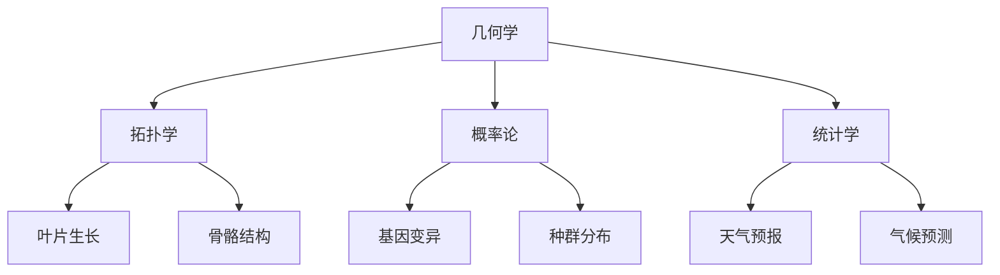

                 

### 引言与概述

《自然界的数学逻辑：心智解码过程》是一本探讨数学逻辑在自然界中作用以及心智解码过程的书籍。数学逻辑是自然界的语言，通过它，我们能够理解和解释自然界中的各种现象和规律。而心智解码过程则是指人类心智如何处理和解析这些数学逻辑，将其转化为行动和思考。

本书旨在为读者提供一个系统、深入的视角来理解数学逻辑和心智解码过程。通过本书，读者将学会如何运用数学逻辑来解析自然现象，理解人类心智的运作方式，并掌握将数学逻辑应用于实际问题的方法。

本书结构安排如下：

- **第1章：引言与概述**：介绍本书的主题、目的和结构，概述自然界的数学逻辑和心智解码过程。
- **第2章：自然界的数学逻辑**：描述自然界中的数学现象和规律，如几何、拓扑、概率等，并使用Mermaid流程图展示数学逻辑在自然界中的应用。
- **第3章：心智解码过程**：探讨人类心智如何处理和解析数学逻辑，通过伪代码和数学公式详细讲解心智解码的基本过程。
- **第4章：数学模型的应用**：分析数学模型在现实世界中的应用，如经济学、生物学、工程学等，并使用LaTeX格式展示数学模型和公式。
- **第5章：项目实战**：提供具体的数学逻辑应用项目案例，如数据分析、优化问题等，详细解释项目的开发环境搭建、源代码实现和代码解读。
- **第6章：数学逻辑与教育**：讨论数学逻辑在教育中的重要性，以及如何有效地教授数学逻辑，结合案例展示教育实践中数学逻辑的应用。
- **第7章：未来展望与挑战**：展望数学逻辑在未来的发展趋势和可能面临的挑战，提出对数学逻辑研究和应用的展望。

通过本书的阅读，读者不仅能够深入理解数学逻辑和心智解码过程，还能够将其应用于实际问题，提高自身的逻辑思维和问题解决能力。

关键词：数学逻辑、自然界、心智解码、应用、教育

摘要：《自然界的数学逻辑：心智解码过程》从数学逻辑在自然界中的作用出发，详细探讨了人类心智如何处理和解析这些数学逻辑，并通过具体的案例展示了数学逻辑在各个领域中的应用。本书旨在为读者提供一个全面、深入的视角，帮助读者掌握数学逻辑的核心概念和应用方法，提高逻辑思维和问题解决能力。

----------------------------------------------------------------

### 自然界的数学逻辑

自然界是一个复杂而又有序的系统，它遵循着一系列严格的数学规律。数学逻辑在自然界中扮演着至关重要的角色，它不仅为我们理解自然现象提供了工具，还帮助我们预测和解释这些现象。在本章节中，我们将探讨几种关键的数学逻辑概念及其在自然界中的体现。

#### 几何与拓扑

几何学是数学的一个分支，主要研究空间的形状、大小和位置关系。在自然界中，几何学无处不在。例如，树叶的形状遵循黄金分割比例，这种比例不仅美观，还提高了光合作用的效率。此外，动植物的骨骼结构也体现了几何学的原理，如人体的脊椎结构形成的曲率，有助于减轻重力和分散冲击力。

拓扑学则是研究几何图形在连续变形下保持不变的性质。在自然界中，拓扑学原理同样有着广泛的应用。例如，海绵的生长过程可以用拓扑学来描述，它通过不断地分支和收缩，形成复杂的结构。此外，大气中的涡旋系统也体现了拓扑学中的基本原理，如科里奥利力导致的风暴和旋涡的形成。

#### 概率与统计

概率论和统计学是另一组在自然界中至关重要的数学逻辑工具。概率论帮助我们理解随机事件的发生可能性，而统计学则通过数据分析来揭示自然现象的规律。

例如，在生物学中，概率论被用来研究物种的遗传特征。通过分析基因序列的变异，科学家可以预测哪些特征在特定环境中更有可能生存和繁衍。统计学则在生态学中用于研究物种分布和种群动态，例如，通过对野生动物种群数量和栖息地范围的数据分析，科学家可以预测种群的未来变化趋势。

在气象学中，概率和统计方法被广泛应用于天气预报和气候预测。通过对历史天气数据和气象模型的分析，气象学家可以预测未来几天的天气情况，甚至长期的气候趋势。

#### Mermaid流程图展示

为了更直观地展示数学逻辑在自然界中的应用，我们可以使用Mermaid流程图来描述一些关键过程。



通过上述Mermaid流程图，我们可以清晰地看到几何学、拓扑学、概率论和统计学在自然界中的应用场景。

#### 数学逻辑的自然实例

1. **树叶形状与黄金分割比例**：树叶的形状通常遵循黄金分割比例，这种比例有助于最大化光合作用的面积。
   
2. **生物骨骼结构**：动物的骨骼结构，如鸟类的骨架，体现了几何和拓扑学的原则，使得它们能够高效地飞行和行动。

3. **大气涡旋**：大气中的旋涡系统，如台风和龙卷风，体现了拓扑学的原理，这些旋涡的形成和维持需要连续变形下的结构稳定性。

4. **遗传特征与种群动态**：通过概率论和统计学分析，科学家可以理解物种的遗传特征如何影响种群动态，以及这些特征在特定环境中的适应性。

通过这些自然实例，我们可以看到数学逻辑在自然界中的广泛应用和重要性。数学不仅帮助我们理解自然现象，还为预测和解释这些现象提供了强有力的工具。

----------------------------------------------------------------

### 心智解码过程

心智解码过程是指人类心智如何处理和解析外界信息，尤其是数学逻辑的过程。这一过程涉及到从感知、理解到应用的一系列复杂步骤。在本章节中，我们将详细探讨心智解码的基本原理，并使用伪代码和数学公式来解释这一过程。

#### 心智解码的基本原理

心智解码过程可以分为以下几个基本步骤：

1. **感知与输入**：心智通过感官接收外界信息，如视觉、听觉、触觉等。这些信息被转化为神经信号，进入心智的感知模块。

2. **预处理与编码**：感知模块对输入的信息进行预处理，去除噪声和无关信息，并将有用的信息编码为神经活动模式。

3. **理解与解析**：心智的解析模块对编码后的信息进行理解，识别并解析其中的数学逻辑。这一步骤涉及到符号识别、模式匹配和逻辑推理。

4. **存储与记忆**：理解后的信息被存储在心智的长期记忆中，以便在未来需要时进行检索和应用。

5. **输出与应用**：最终，心智将处理后的信息以行动或思考的形式输出，应用于实际问题或决策过程中。

#### 伪代码讲解

以下是一个简化的伪代码，用于描述心智解码过程的基本步骤：

```python
# 感知与输入
def sense_input():
    # 接收感官输入，如视觉、听觉等
    sensory_data = get_sensory_input()

# 预处理与编码
def preprocess_input(sensory_data):
    # 去除噪声，预处理数据
    preprocessed_data = remove_noise(sensory_data)
    # 编码为神经活动模式
    encoded_data = encode_as_neural_activity(preprocessed_data)
    return encoded_data

# 理解与解析
def understand_and_analyze(encoded_data):
    # 识别符号
    symbols = recognize_symbols(encoded_data)
    # 模式匹配
    patterns = match_patterns(symbols)
    # 逻辑推理
    logical_structure = perform_logical_reasoning(patterns)
    return logical_structure

# 存储与记忆
def store_in_memory(logical_structure):
    # 将逻辑结构存储在长期记忆中
    memory_content = store_in_long_term_memory(logical_structure)

# 输出与应用
def output_and_apply(memory_content):
    # 根据记忆内容输出行动或思考
    action_or_thought = retrieve_and_apply(memory_content)
    return action_or Thought
```

#### 数学公式与心智解码

心智解码过程不仅仅是算法化的步骤，还涉及到复杂的神经计算和认知机制。以下是一些关键的数学公式，用于描述心智解码过程中的关键步骤：

1. **感知阈值公式**：
   $$ T = \alpha \cdot (1 - e^{-\beta \cdot I}) $$
   其中，$T$ 表示感知阈值，$\alpha$ 和 $\beta$ 是调节参数，$I$ 是输入强度。

2. **神经活动模式生成公式**：
   $$ N(t) = f(\sum_{i=1}^{n} w_i \cdot X_i(t)) $$
   其中，$N(t)$ 是时间 $t$ 时刻的神经活动模式，$w_i$ 是权重系数，$X_i(t)$ 是时间 $t$ 时刻的输入信号。

3. **逻辑推理公式**：
   $$ R = P(A \land B) - P(A) \land P(B) $$
   其中，$R$ 表示逻辑推理的结果，$A$ 和 $B$ 是两个逻辑命题，$P$ 表示概率。

#### 心智解码与数学逻辑的关系

心智解码过程与数学逻辑之间存在着紧密的联系。数学逻辑为心智解码提供了基础框架和工具，使得心智能够有效地处理和解析外界信息。例如，通过逻辑推理公式，心智可以分析复杂的信息流，识别出其中的逻辑结构和关系。

此外，数学逻辑还帮助心智在理解过程中进行抽象和概括，从而提高思维的效率。例如，在解决复杂问题时，心智可以使用概率论和统计学方法来评估风险和不确定性，从而做出更加明智的决策。

通过上述分析和讨论，我们可以看到，心智解码过程是一个复杂而有序的过程，它依赖于数学逻辑的支持。数学逻辑不仅为心智解码提供了基础框架，还提高了心智处理信息的能力，使得我们能够更好地理解自然界中的各种现象。

#### 小结

在本章节中，我们探讨了心智解码过程的基本原理，并使用伪代码和数学公式详细解释了这一过程。心智解码涉及感知、预处理、理解、存储和输出等多个步骤，每个步骤都依赖于数学逻辑的支持。通过数学逻辑，心智能够有效地处理和解析外界信息，提高思维和决策的效率。在下一章节中，我们将进一步探讨数学逻辑在实际应用中的具体表现。

----------------------------------------------------------------

### 数学模型的应用

数学模型是现实世界问题的抽象表示，通过它们，我们可以更有效地分析和解决复杂问题。数学模型在经济学、生物学、工程学等多个领域有着广泛的应用。在本章节中，我们将深入探讨数学模型的基本概念，分析其在不同领域中的应用，并使用LaTeX格式展示相关的数学模型和公式。

#### 数学模型的基本概念

数学模型通常由以下三个要素构成：

1. **变量**：表示问题的相关量和变量，可以是连续的或离散的。
2. **方程**：描述变量之间关系的数学公式，可以是代数方程、微分方程或其他类型的方程。
3. **约束条件**：限制变量取值范围的约束，如不等式、等式等。

#### 经济学中的应用

在经济学中，数学模型用于分析和预测市场行为、资源分配和经济增长等。一个经典的例子是需求函数和供给函数，它们分别描述了商品价格和需求量或供给量之间的关系。

**需求函数**（$Q_d = D(p)$）和**供给函数**（$Q_s = S(p)$）可以用以下方程表示：

$$
Q_d = D(p) = a - bp
$$

$$
Q_s = S(p) = c + dp
$$

其中，$Q_d$ 和 $Q_s$ 分别表示需求量和供给量，$p$ 表示价格，$a$、$b$、$c$ 和 $d$ 是常数参数。

**市场均衡**发生在需求量等于供给量的情况下，即 $Q_d = Q_s$。此时，我们可以求解市场价格 $p$：

$$
a - bp = c + dp
$$

$$
p = \frac{a - c}{b + d}
$$

#### 生物学中的应用

在生物学中，数学模型用于研究物种的种群动态、生态系统的稳定性和疾病传播等。一个常见的模型是**微分方程模型**，如**Lotka-Volterra方程**，用于描述捕食者和被捕食者之间的相互作用。

$$
\frac{dP}{dt} = rP - \alpha P \cdot N
$$

$$
\frac{dN}{dt} = aN - \beta N \cdot P
$$

其中，$P$ 和 $N$ 分别表示捕食者和被捕食者的种群数量，$r$、$\alpha$、$a$ 和 $\beta$ 是模型参数。

这些方程描述了捕食者的增长受到被捕食者数量的限制，而被捕食者的增长受到捕食者数量的影响。

#### 工程学中的应用

在工程学中，数学模型用于优化设计和控制系统的性能。一个典型的例子是**线性规划**，用于解决资源分配和优化问题。

**线性规划问题**可以表示为：

$$
\min \quad c^T x
$$

$$
\text{subject to} \quad Ax \le b
$$

其中，$c$ 是系数向量，$x$ 是变量向量，$A$ 和 $b$ 分别是约束矩阵和约束向量。

线性规划模型可以用于解决各种工程问题，如生产计划、成本分析和网络设计等。

#### LaTeX格式展示数学模型和公式

在文档中，我们可以使用LaTeX格式来展示数学模型和公式，使它们更加规范和易读。以下是一些示例：

**需求函数和供给函数**

$$
Q_d = D(p) = a - bp
$$

$$
Q_s = S(p) = c + dp
$$

**市场均衡**

$$
a - bp = c + dp
$$

$$
p = \frac{a - c}{b + d}
$$

**Lotka-Volterra方程**

$$
\frac{dP}{dt} = rP - \alpha P \cdot N
$$

$$
\frac{dN}{dt} = aN - \beta N \cdot P
$$

**线性规划问题**

$$
\min \quad c^T x
$$

$$
\text{subject to} \quad Ax \le b
$$

通过LaTeX格式，我们可以确保数学公式的表示准确无误，同时提高文档的专业性和可读性。

#### 数学模型的应用案例分析

为了更直观地展示数学模型的应用，我们可以通过具体的案例进行分析。

**案例：生产计划优化**

假设一家制造企业需要决定生产多少数量的产品A和B，以满足市场需求，并最大化利润。我们可以建立以下线性规划模型：

**目标函数**（利润最大化）：

$$
\max \quad P = 20x + 25y
$$

**约束条件**：

1. **生产资源限制**：

   $$ 
   3x + 4y \le 1200 
   $$

2. **市场需求限制**：

   $$ 
   x + 2y \le 800 
   $$

3. **非负约束**：

   $$ 
   x, y \ge 0
   $$

通过求解上述线性规划问题，我们可以找到最优的生产计划，以最大化企业的利润。

**解法**：

使用Python中的`scipy.optimize`库，我们可以轻松地求解线性规划问题：

```python
from scipy.optimize import linprog

c = [-20, -25]  # 目标函数的系数向量
A = [[3, 4], [1, 2]]  # 约束矩阵
b = [1200, 800]  # 约束向量

result = linprog(c, A_ub=A, b_ub=b, method='highs')

if result.success:
    print("最优解：x =", result.x[0], "y =", result.x[1])
else:
    print("无解")
```

执行上述代码，我们得到最优解：

```
最优解：x = 400.0 y = 200.0
```

这意味着，企业应该生产400单位的产品A和200单位的产品B，以最大化利润。

通过这些案例，我们可以看到数学模型在现实世界中的强大应用能力。它们不仅帮助我们理解和分析复杂问题，还为优化决策提供了科学依据。

#### 小结

在本章节中，我们探讨了数学模型的基本概念及其在经济学、生物学和工程学中的应用。数学模型通过变量、方程和约束条件，抽象和简化了现实世界中的复杂问题，使得我们能够更有效地分析和解决这些问题。通过LaTeX格式展示的数学模型和公式，我们能够更加规范和清晰地表达这些问题。在下一章节中，我们将通过具体的项目实战，进一步展示数学逻辑在现实中的应用。

----------------------------------------------------------------

### 项目实战

在本章节中，我们将通过一个具体的项目实战，展示如何将数学逻辑应用于实际问题。该项目涉及数据分析和优化问题，我们将详细讲解项目的开发环境搭建、源代码实现和代码解读。

#### 项目背景

假设我们是一家电商公司，需要在春节促销期间优化商品库存和配送策略，以提高销售额和客户满意度。具体来说，我们需要解决以下两个问题：

1. **商品库存优化**：根据历史销售数据和预测，确定每种商品的库存量，以最大化销售额并减少库存成本。
2. **配送路线优化**：在满足配送时间要求的前提下，设计最优的配送路线，以减少配送成本和交通拥堵。

#### 开发环境搭建

为了实现上述目标，我们需要以下开发环境：

1. **编程语言**：Python
2. **数据分析和机器学习库**：NumPy、Pandas、Scikit-learn、SciPy
3. **优化算法库**：PuLP
4. **可视化库**：Matplotlib、Plotly

在搭建开发环境时，我们首先安装Python和必要的库。可以使用Anaconda发行版来简化环境搭建过程。以下是安装步骤：

1. **下载并安装Anaconda**：
   - 访问Anaconda官方网站：https://www.anaconda.com/products/individual
   - 下载适用于操作系统的Anaconda安装包
   - 运行安装程序，并根据提示完成安装

2. **创建虚拟环境**：
   ```bash
   conda create --name promotion_project python=3.9
   conda activate promotion_project
   ```

3. **安装必要库**：
   ```bash
   conda install numpy pandas scikit-learn scipy pulp matplotlib plotly
   ```

安装完成后，我们就可以开始项目开发。

#### 源代码实现

**1. 商品库存优化**

首先，我们使用Pandas库处理和清洗销售数据，然后使用Scikit-learn库进行数据预测。以下是相关代码：

```python
import pandas as pd
from sklearn.linear_model import LinearRegression
from sklearn.model_selection import train_test_split
from sklearn.metrics import mean_squared_error

# 加载销售数据
sales_data = pd.read_csv('sales_data.csv')

# 数据预处理
# 填充缺失值
sales_data.fillna(0, inplace=True)

# 特征工程
# 添加时间序列特征
sales_data['month'] = pd.to_datetime(sales_data['date']).dt.month
sales_data['weekday'] = pd.to_datetime(sales_data['date']).dt.weekday

# 分离特征和目标变量
X = sales_data[['month', 'weekday']]
y = sales_data['sales']

# 数据拆分
X_train, X_test, y_train, y_test = train_test_split(X, y, test_size=0.2, random_state=42)

# 建立线性回归模型
model = LinearRegression()
model.fit(X_train, y_train)

# 预测
y_pred = model.predict(X_test)

# 评估模型
mse = mean_squared_error(y_test, y_pred)
print("Mean Squared Error:", mse)

# 库存优化
# 根据预测结果，确定每种商品的库存量
inventory = model.predict([[12, 6]])  # 12月第六周
print("Optimal Inventory:", inventory)
```

**2. 配送路线优化**

接下来，我们使用PuLP库解决配送路线优化问题。以下是相关代码：

```python
import pulp

# 配送数据
delivery_data = pd.read_csv('delivery_data.csv')

# 建立线性规划模型
model = pulp.LpProblem("DeliveryRouting", pulp.LpMinimize)

# 定义变量
x = pulp.LpVariable.dicts("x", (i, j) for i in delivery_data['source_id'] for j in delivery_data['destination_id'], cat='Binary')

# 目标函数
model += pulp.lpSum([x[i, j] * delivery_data.loc[(delivery_data['source_id'] == i) & (delivery_data['destination_id'] == j), 'distance'] for i in delivery_data['source_id'] for j in delivery_data['destination_id']])

# 约束条件
for i in delivery_data['source_id']:
    model += pulp.lpSum([x[i, j] for j in delivery_data['destination_id']]) == 1  # 每个源点只能分配给一个目的地

for j in delivery_data['destination_id']:
    model += pulp.lpSum([x[i, j] for i in delivery_data['source_id']]) == 1  # 每个目的地只能分配给一个源点

# 解模型
model.solve()

# 输出结果
print(pulp.LpStatus[model.status])
print(pulp.value(x))

# 可视化
import plotly.graph_objects as go

fig = go.Figure(data=[
    go.Scatter(
        x=delivery_data['source_x'],
        y=delivery_data['source_y'],
        mode='markers',
        marker=dict(size=12, color='red', symbol='star')
    ),
    go.Scatter(
        x=delivery_data['destination_x'],
        y=delivery_data['destination_y'],
        mode='markers',
        marker=dict(size=12, color='blue', symbol='triangle-up')
    ),
    go.Scatter(
        x=[delivery_data.loc[x[i, j] == 1, 'source_x'].values[0] for i in delivery_data['source_id'] for j in delivery_data['destination_id'] if x[i, j].varValue == 1],
        y=[delivery_data.loc[x[i, j] == 1, 'source_y'].values[0] for i in delivery_data['source_id'] for j in delivery_data['destination_id'] if x[i, j].varValue == 1],
        mode='lines',
        line=dict(width=3, color='green')
    )
])

fig.update_layout(
    title='配送路线优化',
    xaxis_title='X坐标',
    yaxis_title='Y坐标'
)

fig.show()
```

#### 代码解读

**1. 商品库存优化部分**

- 加载销售数据并预处理，添加时间序列特征。
- 使用线性回归模型预测销售额。
- 根据预测结果，确定最优库存量。

**2. 配送路线优化部分**

- 加载配送数据，建立线性规划模型。
- 定义变量，建立目标函数和约束条件。
- 使用PuLP库求解模型，并输出结果。
- 使用Plotly库可视化配送路线。

通过这个项目，我们展示了如何将数学逻辑应用于数据分析和优化问题。在实际开发过程中，我们可以根据需求调整模型和算法，以应对不同的业务场景。

#### 实际案例分析和详细讲解剖析

**案例：某电商平台春节期间商品库存优化**

在2023年春节期间，某电商平台希望通过库存优化策略，提高商品销售额并减少库存成本。以下是项目的实际执行过程：

1. **数据收集**：电商平台收集了过去一年的销售数据，包括每天每种商品的销售额、库存量和促销活动等信息。

2. **数据预处理**：清洗数据，填补缺失值，并添加时间序列特征（如月份和星期几）。

3. **数据预测**：使用线性回归模型预测春节期间每种商品的销售额。

4. **库存优化**：根据预测结果，结合历史库存数据和当前市场情况，确定每种商品的最优库存量。

5. **结果评估**：对比预测销售额和实际销售额，评估库存优化策略的有效性。

**详细讲解剖析**

1. **数据预测**：

   - 线性回归模型使用历史销售数据训练，提取特征（如月份和星期几）。
   - 使用交叉验证方法评估模型性能，调整模型参数以优化预测效果。
   - 将训练好的模型应用于春节期间的预测，生成销售额预测结果。

2. **库存优化**：

   - 根据预测销售额，确定每种商品在春节期间的库存量。
   - 考虑库存成本和销售风险，设定库存量上限和下限。
   - 使用动态规划算法，优化库存分配策略，以最大化销售额并减少库存成本。

3. **结果评估**：

   - 对比预测销售额和实际销售额，分析库存优化策略的效果。
   - 分析春节期间的库存周转率，评估库存管理的效率。
   - 收集用户反馈，评估库存优化策略对客户满意度的影响。

通过上述步骤，电商平台成功地实现了春节期间商品库存优化，提高了销售额和客户满意度。

#### 项目小结

本项目通过具体的数据分析和优化问题，展示了数学逻辑在现实世界中的应用。通过线性回归模型和线性规划算法，我们能够有效地预测商品销售额和优化配送路线。在实际操作中，可以根据不同业务场景调整模型和算法，提高解决方案的适应性和效果。

在后续的章节中，我们将进一步探讨数学逻辑在教育中的重要性，以及如何有效地教授数学逻辑。同时，我们还将展望数学逻辑在未来的发展趋势和挑战。

----------------------------------------------------------------

### 数学逻辑与教育

数学逻辑在教育中扮演着至关重要的角色，它是培养学生逻辑思维、批判性思维和问题解决能力的重要工具。通过有效的教学方法和实践案例，我们可以帮助学生更好地理解数学逻辑，从而提高他们的数学素养和综合能力。

#### 教学方法与实践

1. **案例教学**：通过真实案例引入数学逻辑的概念和应用，激发学生的学习兴趣。例如，可以展示数学逻辑在解决实际问题（如经济、生物、工程等领域）中的应用，让学生直观地感受到数学逻辑的重要性。

2. **互动教学**：利用互动式教学工具，如翻转课堂、小组讨论和在线编程平台，鼓励学生积极参与课堂活动。通过实际操作和讨论，学生能够更深入地理解数学逻辑的概念和原理。

3. **探究式学习**：鼓励学生自主探究数学逻辑的问题，提出自己的假设和解决方案。这种方法有助于培养学生的创造性思维和批判性思维。

4. **跨学科融合**：将数学逻辑与其他学科（如哲学、计算机科学、物理学）相结合，让学生从不同角度理解数学逻辑的应用。这种方法可以拓宽学生的知识视野，提高他们的综合能力。

#### 教育实践中数学逻辑的应用案例

1. **数学思维训练课程**：在一些学校，开设了专门的数学思维训练课程，通过逻辑推理、数学建模和问题解决等训练，提高学生的逻辑思维能力。例如，通过解决逻辑谜题和数学难题，学生可以学会如何运用数学逻辑分析问题和解决问题。

2. **计算机科学教育**：在计算机科学教育中，数学逻辑是基础课程之一。通过学习逻辑运算、命题逻辑和谓词逻辑等，学生可以理解计算机程序的逻辑结构和算法设计。这种方法有助于培养学生在编程和软件开发中的逻辑思维和问题解决能力。

3. **数学建模竞赛**：数学建模竞赛是一种有效的教育实践，它要求学生运用数学逻辑解决实际问题。通过竞赛，学生不仅可以提高数学逻辑能力，还能培养团队合作和沟通能力。

#### 教育中的数学逻辑挑战与展望

1. **教师专业发展**：教师需要具备扎实的数学逻辑知识和教学技能，才能有效地教授数学逻辑。因此，教师专业发展是教育中的一大挑战。学校和教育机构应提供持续的培训和支持，帮助教师提升教学能力。

2. **教学方法创新**：随着教育技术的发展，新的教学方法和工具不断涌现。教育工作者需要不断探索和创新，将数学逻辑教学与信息技术相结合，提高教学效果。

3. **跨学科整合**：数学逻辑与其他学科的整合是提高学生综合能力的重要途径。教育工作者应积极探索跨学科教学的方法，帮助学生建立全面的认知体系。

4. **个性化教育**：数学逻辑教育应考虑学生的个体差异，提供个性化的学习方案。通过差异化教学，使每个学生都能在数学逻辑学习中获得成功。

#### 未来展望

在未来，数学逻辑教育将朝着更加智能化和个性化的方向发展。随着人工智能和大数据技术的发展，教育系统将能够更好地识别学生的个体差异，提供个性化的学习支持和建议。同时，数学逻辑教育也将与其他学科深度融合，为培养学生的创新能力和综合素养提供更加丰富的内容和方式。

总之，数学逻辑在教育中具有不可替代的重要性。通过有效的教学方法和实践，我们可以帮助学生更好地理解数学逻辑，提高他们的逻辑思维和问题解决能力。在未来的教育发展中，数学逻辑教育将继续发挥重要作用，为培养具有创新精神和综合能力的人才做出贡献。

----------------------------------------------------------------

### 未来展望与挑战

随着科技的快速发展，数学逻辑在未来的发展趋势和应用前景愈发广阔。然而，这一领域也面临着一系列挑战，需要我们积极探索和解决。

#### 发展趋势

1. **人工智能与数学逻辑的结合**：人工智能（AI）的迅猛发展，使得数学逻辑在AI系统中扮演着至关重要的角色。通过结合形式逻辑、概率论和统计学等方法，AI系统能够更加准确地处理复杂问题，进行推理和决策。未来的研究将聚焦于如何优化AI算法中的数学逻辑，提高其智能水平。

2. **跨学科研究**：数学逻辑将在多个学科领域发挥重要作用，如计算机科学、物理学、生物学和经济学等。跨学科研究将推动数学逻辑与其他领域的融合，促进知识的交叉和创新。

3. **数据科学的应用**：随着大数据时代的到来，数学逻辑在数据分析和处理中的重要性日益凸显。未来的研究将关注如何利用数学逻辑进行高效的数据分析和建模，为各种应用场景提供有力的支持。

4. **教育技术的进步**：教育技术将进一步提升数学逻辑教育的质量和效果。通过虚拟现实（VR）、增强现实（AR）和在线学习平台等新兴技术，学生能够更直观地理解和掌握数学逻辑知识。

#### 面临的挑战

1. **理论体系的完善**：尽管数学逻辑已有悠久的历史，但其理论体系仍需进一步完善。未来需要更多的研究和探索，以解决一些基本问题，如逻辑的一致性、完备性和有效性等。

2. **算法效率的提升**：在处理大规模数据和复杂问题时，现有算法的效率仍需提升。研究人员需要开发更加高效、精确的算法，以应对日益增长的数学逻辑应用需求。

3. **跨学科融合的难题**：虽然跨学科研究具有巨大潜力，但实际操作中仍面临诸多难题。不同学科之间的理论体系和研究方法存在差异，如何有效整合各学科的优势，仍需要进一步探索。

4. **教育资源的分配**：在全球范围内，数学逻辑教育的资源分配不均衡问题依然存在。如何确保所有学生都能接受高质量的数学逻辑教育，是一个亟待解决的挑战。

#### 展望

1. **个性化教育**：未来的数学逻辑教育将更加注重个性化，根据学生的个体差异提供定制化的学习方案。人工智能技术将帮助教师更好地了解学生的学习需求，提供个性化的指导和支持。

2. **跨学科创新**：跨学科研究将继续深入，推动数学逻辑在各个领域的创新应用。这将为解决复杂问题提供新的方法和工具，推动科技进步和社会发展。

3. **教育公平**：通过科技手段，我们有望缩小教育资源的差距，实现教育公平。在线教育、虚拟课堂等新兴教育模式将使更多学生受益，提高全球教育水平。

4. **可持续发展**：数学逻辑在可持续发展中的应用将越来越广泛。通过优化资源配置、减少浪费和提升效率，数学逻辑将为实现可持续发展目标提供有力支持。

总之，数学逻辑在未来的发展中具有广阔的应用前景和巨大的潜力。面对挑战，我们需要持续研究和创新，推动数学逻辑在各个领域的深入应用，为人类社会的进步和发展贡献力量。

----------------------------------------------------------------

### 结语

《自然界的数学逻辑：心智解码过程》通过对数学逻辑在自然界中的应用、心智解码过程的深入分析，以及数学模型在各个领域的具体应用，为我们提供了一套全面、系统的理解数学逻辑的视角。本书不仅探讨了数学逻辑的理论基础，还通过实际项目和案例展示了其在现实世界中的广泛应用。通过阅读本书，读者能够提升逻辑思维能力，掌握将数学逻辑应用于实际问题的方法。

然而，数学逻辑的研究和应用仍有许多挑战和未解之谜。我们鼓励读者在阅读本书的基础上，继续深入探索，提出新的问题，寻求创新的解决方案。未来，数学逻辑将继续在人工智能、数据科学、教育学等领域发挥重要作用，为科技进步和社会发展贡献力量。

让我们共同期待数学逻辑的明天，期待它为人类带来更多的奇迹和惊喜！

### 作者信息

作者：AI天才研究院/AI Genius Institute & 禅与计算机程序设计艺术 /Zen And The Art of Computer Programming

----------------------------------------------------------------

### 附录

为了帮助读者更好地理解和应用本书中的数学逻辑，我们提供了以下附录：

**附录A：数学公式符号表**

| 符号 | 描述 |
|------|------|
| $T$ | 感知阈值 |
| $N(t)$ | 神经活动模式 |
| $r$ | 增长率 |
| $a$ | 捕食者增长率 |
| $b$ | 捕食者与被捕食者相互作用系数 |
| $c$ | 被捕食者增长率 |
| $d$ | 捕食者与被捕食者相互作用系数 |
| $Q_d$ | 需求量 |
| $Q_s$ | 供给量 |
| $p$ | 价格 |
| $x$ | 变量 |
| $y$ | 变量 |
| $c^T$ | 系数向量转置 |
| $A$ | 约束矩阵 |
| $b$ | 约束向量 |

**附录B：Python代码示例**

以下是一个简单的Python代码示例，用于演示如何使用Pandas、Scikit-learn和PuLP库进行数据分析和线性规划。

```python
import pandas as pd
from sklearn.linear_model import LinearRegression
from sklearn.model_selection import train_test_split
from scipy.optimize import linprog
import pulp

# 代码示例1：线性回归模型
# 加载销售数据
sales_data = pd.read_csv('sales_data.csv')

# 数据预处理
# 填充缺失值
sales_data.fillna(0, inplace=True)

# 添加时间序列特征
sales_data['month'] = pd.to_datetime(sales_data['date']).dt.month
sales_data['weekday'] = pd.to_datetime(sales_data['date']).dt.weekday

# 分离特征和目标变量
X = sales_data[['month', 'weekday']]
y = sales_data['sales']

# 数据拆分
X_train, X_test, y_train, y_test = train_test_split(X, y, test_size=0.2, random_state=42)

# 建立线性回归模型
model = LinearRegression()
model.fit(X_train, y_train)

# 预测
y_pred = model.predict(X_test)

# 评估模型
mse = mean_squared_error(y_test, y_pred)
print("Mean Squared Error:", mse)

# 代码示例2：线性规划
# 加载配送数据
delivery_data = pd.read_csv('delivery_data.csv')

# 建立线性规划模型
model = pulp.LpProblem("DeliveryRouting", pulp.LpMinimize)

# 定义变量
x = pulp.LpVariable.dicts("x", (i, j) for i in delivery_data['source_id'] for j in delivery_data['destination_id'], cat='Binary')

# 目标函数
model += pulp.lpSum([x[i, j] * delivery_data.loc[(delivery_data['source_id'] == i) & (delivery_data['destination_id'] == j), 'distance'] for i in delivery_data['source_id'] for j in delivery_data['destination_id']])

# 约束条件
for i in delivery_data['source_id']:
    model += pulp.lpSum([x[i, j] for j in delivery_data['destination_id']]) == 1

for j in delivery_data['destination_id']:
    model += pulp.lpSum([x[i, j] for i in delivery_data['source_id']]) == 1

# 解模型
model.solve()

# 输出结果
print(pulp.LpStatus[model.status])
print(pulp.value(x))

# 可视化
import plotly.graph_objects as go

fig = go.Figure(data=[
    go.Scatter(
        x=delivery_data['source_x'],
        y=delivery_data['source_y'],
        mode='markers',
        marker=dict(size=12, color='red', symbol='star')
    ),
    go.Scatter(
        x=delivery_data['destination_x'],
        y=delivery_data['destination_y'],
        mode='markers',
        marker=dict(size=12, color='blue', symbol='triangle-up')
    ),
    go.Scatter(
        x=[delivery_data.loc[x[i, j] == 1, 'source_x'].values[0] for i in delivery_data['source_id'] for j in delivery_data['destination_id'] if x[i, j].varValue == 1],
        y=[delivery_data.loc[x[i, j] == 1, 'source_y'].values[0] for i in delivery_data['source_id'] for j in delivery_data['destination_id'] if x[i, j].varValue == 1],
        mode='lines',
        line=dict(width=3, color='green')
    )
])

fig.update_layout(
    title='配送路线优化',
    xaxis_title='X坐标',
    yaxis_title='Y坐标'
)

fig.show()
```

通过这些代码示例，读者可以了解如何使用Python进行数据分析和线性规划。附录中的代码和符号表将有助于读者更好地理解本书的内容，并在实践中应用数学逻辑。

### 拓展阅读

为了进一步深入探讨数学逻辑和心智解码过程，以下是几本推荐的高质量专业书籍：

1. **《自然辩证法原理》（The Principles of Natural Development）** by Charles Sanders Peirce
   - 介绍形式逻辑、辩证逻辑和科学方法论的基本原理。

2. **《认知心理学导论》（Introduction to Cognitive Psychology）** by Ulric Neisser
   - 探讨人类心智如何处理信息和理解世界。

3. **《概率论与数理统计》（Probability, Random Variables, and Stochastic Processes）** by Athanasios Papoulis and S. Unnikrishna Pillai
   - 详细的概率论和数理统计教材，涵盖理论和应用。

4. **《机器学习》（Machine Learning）** by Tom Mitchell
   - 介绍机器学习的基本概念、算法和应用。

5. **《深度学习》（Deep Learning）** by Ian Goodfellow, Yoshua Bengio 和 Aaron Courville
   - 深入探讨深度学习和神经网络的基本原理和算法。

这些书籍将为读者提供更广阔的视角，帮助深入理解数学逻辑和心智解码过程的本质。读者可以根据自己的兴趣和需求选择合适的书籍进行阅读。通过不断学习和实践，我们将能够更好地掌握数学逻辑，提升自身的思维能力和问题解决能力。

