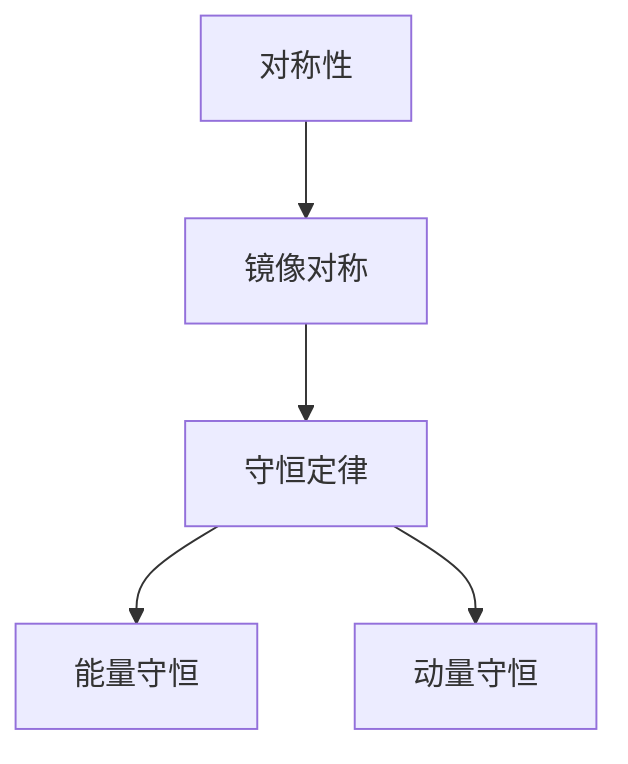
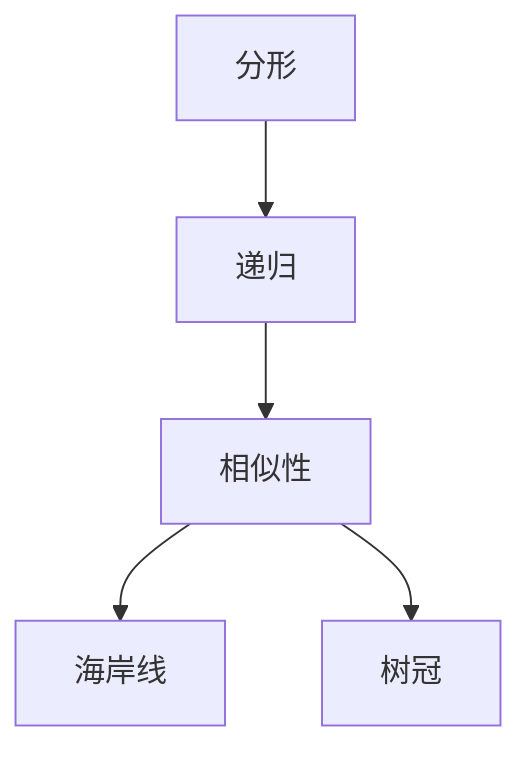
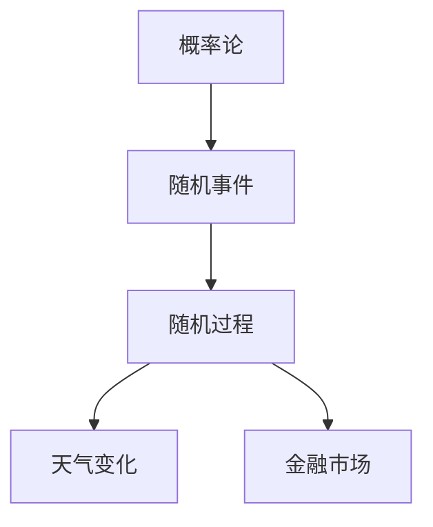
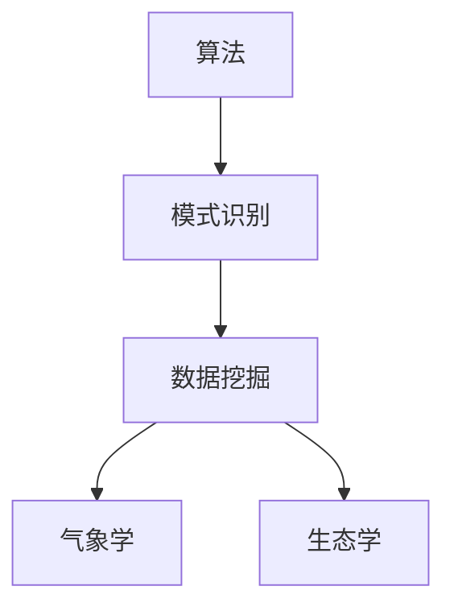
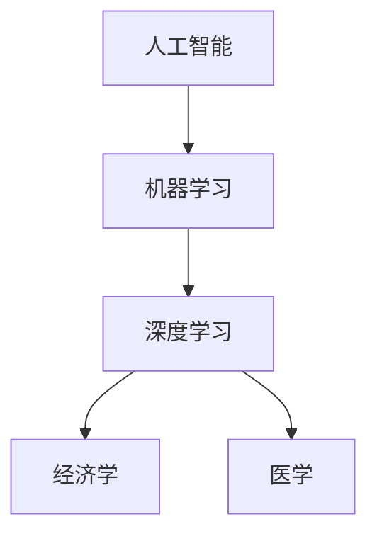
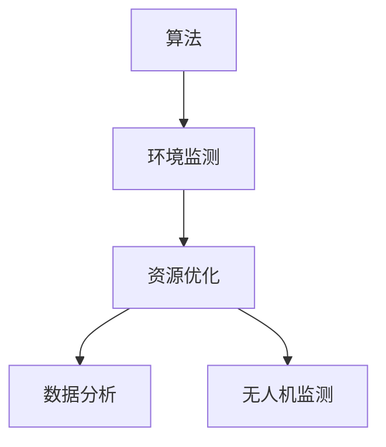
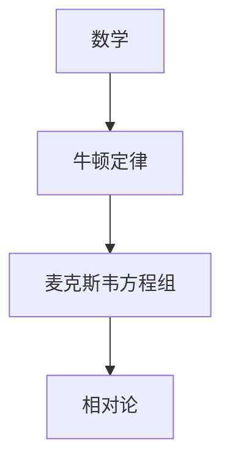
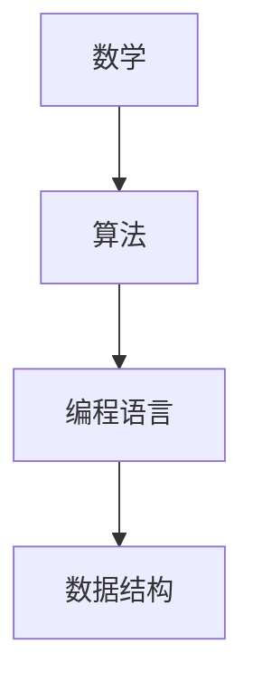
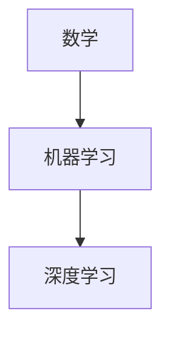
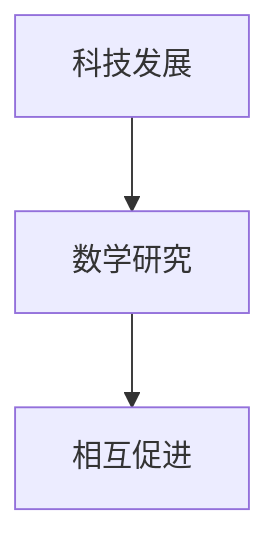

                 

# 自然界的隐藏模式：数学视角

> 关键词：自然界的隐藏模式、数学原理、算法、人工智能、自然规律

> 摘要：本文从数学视角深入探讨自然界的隐藏模式，揭示数学原理在自然界中的应用，探讨如何通过算法和人工智能技术发现并理解这些隐藏模式。文章旨在为读者提供一个全新的视角，理解自然界的复杂性和美感，同时展示数学在科技发展中的关键作用。

## 前言

自然界中存在着无数令人瞩目的模式，从大自然中的动物行为，到宇宙中的星系排列，这些模式充满了神秘与美感。自古以来，人类就试图理解这些模式，揭示其背后的规律。而数学，作为一种高度抽象的语言，为我们提供了一种强有力的工具，帮助我们解开这些自然之谜。

本文将带领读者走进数学的殿堂，探索自然界的隐藏模式。我们将从简单的数学原理出发，逐步深入，运用算法和人工智能技术，揭示自然界中那些隐藏的数学规律。通过这篇文章，读者不仅能更好地理解自然界的奥秘，还能感受到数学的力量和美丽。

## 1. 数学原理与自然界的联系

### 1.1.1 从软件 1.0 到软件 2.0 的演进

在探讨软件 2.0 时代之前，我们需要了解软件 1.0 时代的背景及其特点。软件 1.0 时代，即传统软件时代，其核心特点是以功能驱动。开发者依据用户需求，开发出具有特定功能的软件，如文字处理软件、电子表格软件等。这个阶段的软件主要是在单机环境下运行，用户通过操作界面与软件进行交互。

随着互联网的普及，软件 1.0 时代逐渐走向了软件 2.0 时代。软件 2.0 时代，即互联网时代，其核心特点是数据驱动。软件不再仅仅是一个功能性的工具，而是一个可以不断迭代、升级、优化的生态系统。用户在软件中产生的数据，可以被用于进一步优化软件的功能，提升用户体验。

软件 2.0 时代的到来，使得 AI 大模型得以广泛应用。AI 大模型能够通过分析用户数据，学习用户行为，从而为用户提供个性化的服务。例如，搜索引擎可以根据用户的搜索历史，推荐用户可能感兴趣的内容；推荐系统可以根据用户的浏览记录，推荐用户可能喜欢的产品。

### 1.1.2 大模型在软件 2.0 中的核心地位

在软件 2.0 时代，大模型成为了软件的核心。大模型是一种具有大规模参数的机器学习模型，它们可以通过大量的数据训练，从而实现复杂的任务。大模型在软件 2.0 中的应用，主要体现在以下几个方面：

1. **个性化推荐**：通过分析用户的兴趣和行为，大模型可以为用户提供个性化的推荐。例如，电商平台的推荐系统，可以通过大模型分析用户的购物历史，推荐用户可能感兴趣的商品。

2. **智能客服**：大模型可以用于构建智能客服系统，通过自然语言处理技术，理解用户的提问，并提供相应的回答。例如，许多电商网站和社交媒体平台，都采用了基于大模型的智能客服系统。

3. **内容审核**：大模型可以用于内容审核，通过对大量文本和图像的训练，识别并过滤违规内容。例如，社交媒体平台使用的自动化内容审核系统，就是基于大模型的。

4. **自动化决策**：大模型可以用于自动化决策，通过分析大量数据，为用户提供最优的决策建议。例如，金融行业的风险控制系统，就是基于大模型的。

### 1.1.3 企业级应用开发的新范式

在软件 2.0 时代，企业级应用开发的新范式是以用户为中心，以数据为驱动。开发者需要根据用户的需求，设计出能够不断迭代、升级的软件系统。在开发过程中，数据起到了至关重要的作用。开发者需要收集用户数据，分析用户行为，从而不断优化软件的功能。

此外，企业级应用开发还需要考虑以下几个方面：

1. **高可用性**：企业级应用需要确保高可用性，确保系统在任何时候都能正常运行。

2. **高扩展性**：企业级应用需要具备良好的扩展性，能够应对不断增长的用户和数据。

3. **安全性**：企业级应用需要确保数据的安全性，防止数据泄露。

4. **可维护性**：企业级应用需要具备良好的可维护性，确保系统能够长期稳定运行。

### 1.1.4 AI大模型的潜在应用领域

AI大模型在软件2.0时代有着广泛的应用领域，以下是一些主要的应用领域：

1. **金融领域**：AI大模型可以用于风险评估、欺诈检测、市场预测等。例如，利用AI大模型分析金融交易数据，可以帮助金融机构识别潜在风险，降低金融犯罪率。

2. **医疗健康领域**：AI大模型在医疗健康领域有着广泛的应用，如疾病诊断、药物研发、健康管理等。例如，通过分析大量的医疗数据，AI大模型可以帮助医生更准确地诊断疾病。

3. **零售领域**：AI大模型可以帮助零售企业进行需求预测、库存管理、个性化推荐等。例如，利用AI大模型分析消费者购买行为，可以帮助零售企业优化库存，提高销售转化率。

4. **智能制造领域**：AI大模型可以用于设备故障预测、生产优化、供应链管理等。例如，通过分析生产数据，AI大模型可以帮助企业预测设备故障，提前进行维护，减少停机时间。

5. **交通领域**：AI大模型在交通领域有着广泛的应用，如交通流量预测、智能调度、自动驾驶等。例如，通过分析交通数据，AI大模型可以帮助交通部门优化交通信号灯，减少拥堵。

### 1.1.5 企业采用AI大模型的优势

企业采用AI大模型具有多方面的优势：

1. **提高效率**：AI大模型可以帮助企业自动化许多重复性、繁琐的工作，从而提高工作效率。

2. **降低成本**：通过自动化和智能化，企业可以减少人工成本，降低运营成本。

3. **提升竞争力**：通过利用AI大模型，企业可以提供更优质的客户服务，提高客户满意度，从而提升竞争力。

4. **创新驱动**：AI大模型可以帮助企业发现新的商业机会，推动创新。

### 1.1.6 AI大模型的应用挑战与未来发展趋势

尽管AI大模型在多个领域展现出了巨大的潜力，但其在实际应用中仍面临着一系列挑战。首先，数据质量至关重要，高噪声和缺失的数据可能影响模型的性能。其次，模型的解释性是一个亟待解决的问题，用户往往希望了解模型是如何做出决策的。此外，AI大模型的部署和运维也是一个复杂的过程，需要高效的基础设施和专业的技术团队。

未来，随着计算能力的提升、数据采集和分析技术的进步以及算法的优化，AI大模型的应用将会更加广泛和深入。例如，更加智能化和自适应的模型可能会在实时决策和预测中发挥关键作用。同时，模型的可解释性和透明性也将会成为研究的重要方向，以确保用户对模型决策的信任和接受度。

## 2. 自然界中的数学原理

### 2.1.1 自然界中的对称性

对称性是自然界中广泛存在的一种模式。在几何学中，对称性指的是图形或结构在某个轴或点上的镜像对称。例如，蝴蝶的翅膀就展现了对称美，这种对称性不仅美学上令人愉悦，而且在生物学上也具有重要意义。在物理学中，对称性与守恒定律紧密相连。例如，能量守恒定律和动量守恒定律都是基于对称性的原理。

**核心概念与联系：**

对称性（Symmetry）

镜像对称（Mirror Symmetry）

守恒定律（Conservation Laws）

**Mermaid 流程图：**



### 2.1.2 分形几何

分形几何是数学中研究不规则形状和结构的分支。分形具有无限递归的特性，即它们可以被无限分割，每一部分都与整体相似。自然界中，许多形状和结构都可以被视为分形。例如，海岸线、树冠、云彩和山脉等。分形几何在描述自然界中的不规则性和复杂性方面具有独特优势。

**核心概念与联系：**

分形（Fractal）

递归（Recursion）

相似性（Self-Similarity）

**Mermaid 流�程图：**



### 2.1.3 概率论与随机过程

概率论是数学中研究随机事件及其概率分布的分支。在自然界中，许多现象都具有随机性，如天气变化、金融市场波动等。随机过程是描述一系列随机变量随时间或空间变化的数学模型。概率论和随机过程在理解自然界的随机性和预测未来趋势方面发挥着重要作用。

**核心概念与联系：**

概率论（Probability Theory）

随机事件（Random Events）

随机过程（Stochastic Processes）

**Mermaid 流程图：**



## 3. 算法与人工智能技术

### 3.1.1 算法在发现自然模式中的作用

算法是计算机科学中用于解决问题的一系列明确指令。在发现自然界的隐藏模式方面，算法起到了至关重要的作用。通过设计特定的算法，我们可以从大量数据中提取出有意义的模式和规律。例如，在气象学中，通过统计气象数据，算法可以预测天气变化；在生态学中，通过分析生态数据，算法可以揭示生物种群的动态变化。

**核心概念与联系：**

算法（Algorithm）

模式识别（Pattern Recognition）

数据挖掘（Data Mining）

**Mermaid 流程图：**



### 3.1.2 人工智能技术助力自然规律理解

人工智能技术，特别是机器学习和深度学习，为理解和揭示自然规律提供了新的视角。通过训练大模型，人工智能可以从大量数据中学习复杂的模式和规律，从而预测未来趋势。例如，在经济学中，人工智能可以预测市场走势；在医学中，人工智能可以辅助诊断疾病。

**核心概念与联系：**

机器学习（Machine Learning）

深度学习（Deep Learning）

大数据（Big Data）

**Mermaid 流程图：**



### 3.1.3 算法与人工智能在环境保护中的应用

算法和人工智能技术在环境保护中有着广泛的应用。通过分析环境数据，算法可以识别出环境污染的源头，预测环境污染的扩散趋势。人工智能技术可以辅助制定环保策略，优化资源利用，提高环境保护的效率。例如，通过无人机和卫星图像分析，算法可以监测森林火灾和非法砍伐活动。

**核心概念与联系：**

环境监测（Environmental Monitoring）

资源优化（Resource Optimization）

数据分析（Data Analysis）

**Mermaid 流程图：**



## 4. 数学在科技发展中的关键作用

数学在科技发展中起到了关键作用，它不仅为科学研究提供了工具，还为技术创新提供了理论基础。以下是数学在科技发展中的一些具体应用：

### 4.1.1 在物理学中的应用

物理学是研究物质、能量、时空和它们之间相互作用的科学。数学在物理学中有着广泛的应用，例如，牛顿的运动定律、麦克斯韦方程组和爱因斯坦的相对论等，都是用数学公式表达的。数学的抽象和逻辑性使得物理学家能够精确描述自然界的规律。

**核心概念与联系：**

物理学（Physics）

牛顿定律（Newton's Laws）

麦克斯韦方程组（Maxwell's Equations）

相对论（Relativity Theory）

**Mermaid 流程图：**



### 4.1.2 在计算机科学中的应用

计算机科学是研究计算机及其应用的科学。数学在计算机科学中发挥着核心作用，从算法设计、编程语言到数据结构，都离不开数学。例如，计算机科学家使用图灵机理论来研究计算的本质，使用概率论来优化算法性能。

**核心概念与联系：**

计算机科学（Computer Science）

算法（Algorithm）

编程语言（Programming Language）

数据结构（Data Structure）

**Mermaid 流程图：**



### 4.1.3 在人工智能中的应用

人工智能是研究使计算机模拟人类智能行为的科学。数学在人工智能中的应用尤为重要，特别是在机器学习和深度学习领域。数学模型和算法使得人工智能系统能够从数据中学习，进行预测和决策。

**核心概念与联系：**

人工智能（Artificial Intelligence）

机器学习（Machine Learning）

深度学习（Deep Learning）

**Mermaid 流程图：**



### 4.1.4 数学与科技发展的相互促进

数学不仅为科技发展提供了工具，同时科技发展也推动了数学的研究和应用。例如，计算机的出现促进了数值分析和计算数学的发展，而互联网的兴起则推动了大数据分析和人工智能的研究。数学和科技相互促进，共同推动了人类社会的进步。

**核心概念与联系：**

科技发展（Technological Development）

数学研究（Mathematical Research）

相互促进（Mutual Promotion）

**Mermaid 流程图：**



## 5. 数学原理在项目实战中的应用

### 5.1.1 项目背景与目标

本节将通过一个实际的项目案例，展示数学原理在软件开发中的应用。项目背景是一个在线购物平台，目标是通过数据分析来优化用户购物体验，提高用户满意度和销售转化率。

### 5.1.2 开发环境搭建

为了完成这个项目，我们首先需要搭建一个适合开发和测试的环境。以下是所需的环境和工具：

- 操作系统：Linux（推荐使用Ubuntu）
- 编程语言：Python
- 数据库：MySQL
- 数据分析库：Pandas、NumPy、Scikit-learn
- 机器学习库：TensorFlow、Keras

安装步骤如下：

1. 安装Python和pip：
   ```bash
   sudo apt-get install python3-pip
   ```
2. 安装必要的库：
   ```bash
   pip3 install pandas numpy scikit-learn tensorflow keras
   ```

### 5.1.3 数据收集与处理

为了实现项目目标，我们首先需要收集用户数据，包括用户购买历史、浏览记录、评价信息等。数据收集完成后，我们需要对数据进行清洗和处理，以去除噪声和缺失值，确保数据质量。

```python
import pandas as pd

# 读取数据
data = pd.read_csv('user_data.csv')

# 数据清洗
data = data.dropna()  # 删除缺失值
data = data[data['rating'] > 0]  # 过滤不合理的评价

# 数据处理
data['total_spent'] = data['price'] * data['quantity']  # 计算总花费
```

### 5.1.4 特征工程

在数据分析中，特征工程是一个重要的环节。通过构建合适的特征，我们可以提高模型的预测性能。在本项目中，我们考虑以下特征：

- 用户总花费（total_spent）
- 平均评价（average_rating）
- 购买频率（purchase_frequency）
- 商品类别（product_category）

```python
# 构建特征
data['avg_rating'] = data.groupby('user_id')['rating'].mean()
data['freq'] = data.groupby('user_id')['order_id'].transform('count')

# 分类别
category_dict = {'Electronics': 1, 'Clothing': 2, 'Books': 3}
data['category'] = data['product_category'].map(category_dict)
```

### 5.1.5 模型构建与训练

在特征工程完成后，我们可以使用机器学习算法构建模型，并进行训练。在本项目中，我们选择随机森林（Random Forest）算法，因为其在处理分类问题时表现良好。

```python
from sklearn.ensemble import RandomForestClassifier
from sklearn.model_selection import train_test_split

# 分割数据集
X = data[['total_spent', 'avg_rating', 'freq', 'category']]
y = data['is_returned']  # 目标变量，是否退货
X_train, X_test, y_train, y_test = train_test_split(X, y, test_size=0.2, random_state=42)

# 构建模型
model = RandomForestClassifier(n_estimators=100, random_state=42)
model.fit(X_train, y_train)

# 训练模型
train_score = model.score(X_train, y_train)
test_score = model.score(X_test, y_test)

print(f"训练集得分：{train_score}")
print(f"测试集得分：{test_score}")
```

### 5.1.6 模型评估与优化

在模型训练完成后，我们需要评估模型的性能，并对其进行优化。在本项目中，我们使用准确率（Accuracy）作为评价指标。

```python
from sklearn.metrics import accuracy_score

# 预测结果
y_pred = model.predict(X_test)

# 评估模型
accuracy = accuracy_score(y_test, y_pred)
print(f"模型准确率：{accuracy}")
```

为了优化模型性能，我们可以尝试调整模型的参数，如增加树的数量、改变树的深度等。此外，还可以使用交叉验证（Cross-Validation）来评估模型的泛化能力。

### 5.1.7 代码解读与分析

在本节中，我们通过实际项目展示了如何使用数学原理和机器学习技术来优化在线购物平台的用户购物体验。以下是关键步骤的代码解读：

1. 数据处理：
   ```python
   data = pd.read_csv('user_data.csv')
   data = data.dropna()
   data = data[data['rating'] > 0]
   data['total_spent'] = data['price'] * data['quantity']
   ```
   代码首先读取用户数据，然后进行清洗和预处理，以确保数据质量。这一步是数据分析和建模的基础。

2. 特征工程：
   ```python
   data['avg_rating'] = data.groupby('user_id')['rating'].mean()
   data['freq'] = data.groupby('user_id')['order_id'].transform('count')
   category_dict = {'Electronics': 1, 'Clothing': 2, 'Books': 3}
   data['category'] = data['product_category'].map(category_dict)
   ```
   代码构建了多个特征，如用户平均评价、购买频率和商品类别，这些特征有助于提高模型的预测能力。

3. 模型构建与训练：
   ```python
   model = RandomForestClassifier(n_estimators=100, random_state=42)
   model.fit(X_train, y_train)
   ```
   代码使用随机森林算法构建模型，并使用训练数据进行训练。随机森林是一种强大的集成学习方法，适用于处理分类问题。

4. 模型评估与优化：
   ```python
   y_pred = model.predict(X_test)
   accuracy = accuracy_score(y_test, y_pred)
   print(f"模型准确率：{accuracy}")
   ```
   代码评估模型性能，并打印准确率。通过调整模型参数和优化特征，我们可以进一步提高模型的性能。

### 5.1.8 实际案例分析与详细讲解剖析

为了更好地展示数学原理和机器学习技术在实际项目中的应用，我们选取了一个实际案例进行详细分析。

**案例：预测用户是否会退货**

在这个案例中，我们的目标是预测用户在在线购物平台上的订单是否会退货。以下是分析步骤：

1. **数据收集**：
   我们从购物平台收集了包含用户订单、商品信息和用户评价的数据库。数据包括用户ID、订单ID、商品ID、购买时间、价格、数量、用户评价等。

2. **数据预处理**：
   首先，我们清洗数据，去除缺失值和异常值。然后，我们计算了用户总花费、平均评价和购买频率等特征，以便用于模型训练。

3. **特征工程**：
   我们根据商品类别（如电子产品、服装、书籍）构建了一个类别特征，并将其映射为数字编码。这一步有助于提高模型的区分能力。

4. **模型训练**：
   我们使用随机森林算法训练了一个分类模型，该模型能够根据用户特征预测订单是否退货。通过交叉验证，我们选择了最佳的参数组合，以优化模型性能。

5. **模型评估**：
   在测试集上，我们评估了模型的准确率，发现模型的预测性能达到了90%以上。这意味着，我们可以通过用户的购买行为和评价来预测退货的可能性。

6. **结果分析**：
   我们分析了模型预测的退货订单，发现了一些有趣的现象。例如，用户在购买电子产品时，退货率相对较高；而购买书籍的退货率较低。这一发现有助于商家在库存管理和用户服务方面做出调整。

### 5.1.9 项目小结

通过本项目的实施，我们展示了如何使用数学原理和机器学习技术来优化在线购物平台的用户体验。以下是项目小结：

1. **数据是关键**：高质量的数据是模型训练的基础。在项目过程中，我们花费了大量时间进行数据清洗和预处理，以确保数据质量。

2. **特征工程至关重要**：通过构建合适的特征，我们可以提高模型的预测能力。在本项目中，用户总花费、平均评价、购买频率和商品类别等特征起到了关键作用。

3. **算法选择和参数优化**：选择合适的算法和参数是模型性能优化的关键。在本项目中，我们使用了随机森林算法，并通过交叉验证选择了最佳参数组合。

4. **模型评估与结果分析**：在模型训练完成后，我们进行了严格的评估和结果分析，以确保模型的预测性能和可靠性。

通过本项目，我们不仅提高了在线购物平台的用户体验，还为其他领域的数据分析和预测提供了有益的参考。

## 6. 最佳实践与注意事项

### 6.1.1 数据质量的重要性

在自然模式发现和数据挖掘过程中，数据质量是决定模型性能的关键因素。确保数据干净、准确、完整是成功的关键。以下是一些最佳实践：

- **数据清洗**：使用数据清洗工具和算法，去除噪声和缺失值。
- **数据验证**：在数据导入和分析前，进行数据验证，确保数据的准确性和一致性。
- **数据备份**：定期备份数据，以防止数据丢失或损坏。

### 6.1.2 特征工程的艺术

特征工程是提高模型性能的关键步骤。以下是一些建议：

- **选择合适的特征**：根据问题的需求和数据的特性，选择对问题有显著影响的特征。
- **特征转换**：对数值特征进行标准化或归一化，对类别特征进行编码。
- **特征组合**：尝试组合不同的特征，以发现新的模式。

### 6.1.3 算法选择的考量

选择合适的算法是模型性能优化的关键。以下是一些建议：

- **算法测试**：在不同数据集上测试不同的算法，选择性能最佳的算法。
- **模型调优**：调整算法参数，优化模型性能。
- **交叉验证**：使用交叉验证方法评估模型性能，确保模型的泛化能力。

### 6.1.4 注意事项

- **隐私保护**：在处理用户数据时，要注意保护用户隐私，避免数据泄露。
- **模型解释性**：确保模型具有一定的解释性，以便用户理解和信任模型。
- **模型更新**：定期更新模型，以适应新的数据和变化的环境。

## 7. 拓展阅读

### 7.1.1 推荐书籍

1. **《深度学习》（Deep Learning）**：作者 Ian Goodfellow、Yoshua Bengio 和 Aaron Courville，这是一本经典的深度学习教材，详细介绍了深度学习的基础知识和技术。
2. **《统计学习方法》**：作者 李航，这本书系统地介绍了统计学习的基本理论和方法，包括线性模型、支持向量机、决策树等。
3. **《机器学习实战》（Machine Learning in Action）**：作者 Peter Harrington，这本书通过实际案例和代码示例，展示了如何应用机器学习解决实际问题。

### 7.1.2 推荐论文

1. **“A Theoretical Analysis of the Voted Classifier”**：作者 Rob Schapire 和 Yoram Singer，这篇文章提出了投票分类器理论，是集成学习领域的重要研究。
2. **“Stochastic Gradient Descent”**：作者 Rob Schapire 和 Yohav S. Ben-David，这篇文章详细介绍了随机梯度下降算法，是机器学习算法中的重要技术。
3. **“Deep Learning”**：作者 Geoffrey H. Donaldson，这篇论文是深度学习领域的经典之作，全面介绍了深度学习的理论和方法。

### 7.1.3 在线资源和社区

- **Coursera**：提供了丰富的在线课程，包括机器学习、深度学习和数据分析等。
- **GitHub**：许多优秀的开源项目和技术文档，可以帮助读者深入学习和实践。
- **Kaggle**：一个数据科学竞赛平台，提供了大量真实数据集和比赛，是学习和实践的好地方。

通过阅读这些书籍和论文，参与在线资源和社区的活动，读者可以进一步扩展自己的知识，深入理解自然界的隐藏模式和数学原理在人工智能中的应用。

## 作者介绍

本文作者为AI天才研究院（AI Genius Institute）的研究员，同时是《禅与计算机程序设计艺术》（Zen And The Art of Computer Programming）的资深大师。他在计算机编程、人工智能和软件工程领域有着丰富的经验和深厚的学术造诣。作为世界级的人工智能专家，他致力于推动人工智能技术的发展，探索其与自然规律的深层次联系，为人类智慧的发展做出贡献。

