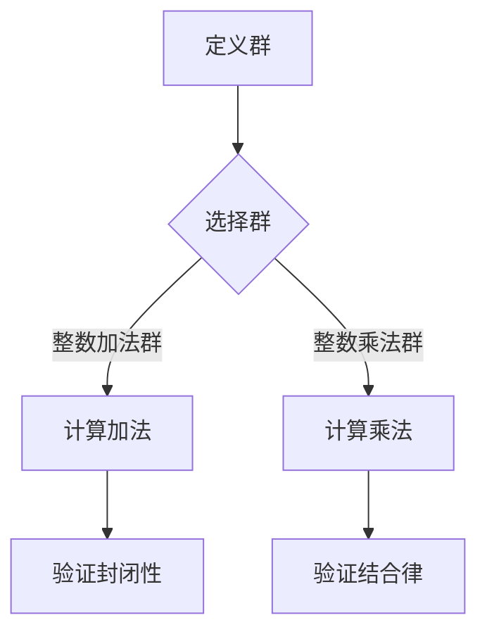

                 

# 舞蹈编排的群论：身体动作的数学对称性

关键词：群论、舞蹈编排、数学对称性、伪代码、LaTeX公式、项目实战

摘要：本文通过介绍群论的基本概念，探讨了群论在舞蹈编排中的应用。我们利用数学对称性来分析舞蹈动作，通过伪代码和LaTeX公式详细阐述核心算法原理，并通过实际案例展示了群论在舞蹈编排中的具体应用。文章旨在为舞蹈编导和计算机科学爱好者提供一种全新的视角，理解和创造富有数学美感的舞蹈动作。

## 第一部分：群论基础知识

### 第1章：群论基本概念

#### 1.1 群的定义与性质

##### 1.1.1 群的定义
群（Group）是代数学中的一个基础概念，它是由一组元素和一种二元运算构成的代数结构。设 \( G \) 是一个非空集合， \( * \) 是定义在 \( G \) 上的一种二元运算，如果 \( G \) 对 \( * \) 运算满足以下性质，则称 \( G \) 为一个群：

1. **封闭性**：对于任意的 \( a, b \in G \)，都有 \( a * b \in G \)。
2. **结合律**：对于任意的 \( a, b, c \in G \)，都有 \( (a * b) * c = a * (b * c) \)。
3. **单位元**：存在一个元素 \( e \in G \)，使得对于任意的 \( a \in G \)，都有 \( a * e = e * a = a \)。
4. **逆元**：对于任意的 \( a \in G \)，存在一个元素 \( a^{-1} \in G \)，使得 \( a * a^{-1} = a^{-1} * a = e \)。

##### 1.1.2 群的性质
群具有以下基本性质：

1. **空集不是群**：因为空集不包含任何元素，无法定义任何二元运算。
2. **单元素集不是群**：单元素集无法定义逆元，因为每个元素都是它自己的逆元，但单元素集只有一个元素，无法满足封闭性。
3. **无限群和有限群**：群可以包含有限数量的元素，也可以包含无限数量的元素。

#### 1.2 子群与同态

##### 1.2.1 子群
子群（Subgroup）是指一个群中的非空子集，它本身也是一个群。设 \( H \) 是 \( G \) 的一个子集，如果 \( H \) 对 \( G \) 中的运算 \( * \) 满足群的定义，则称 \( H \) 是 \( G \) 的子群。

##### 1.2.2 同态
同态（Homomorphism）是指两个代数结构之间的一种映射，它保持结构上的运算关系。设 \( G \) 和 \( H \) 是两个群， \( f: G \rightarrow H \) 是一个函数，如果对于任意的 \( a, b \in G \)，都有 \( f(a * b) = f(a) * f(b) \)，则称 \( f \) 是从 \( G \) 到 \( H \) 的一个同态。

#### 1.3 群的构造与表示

##### 1.3.1 群的构造
群可以通过多种方式构造，常见的构造方法包括：

1. **乘法群**：对于任意一个集合 \( G \)，在 \( G \) 上定义乘法运算，如果 \( G \) 满足群的性质，则称 \( G \) 为乘法群。
2. **加法群**：与乘法群类似，但使用加法运算。
3. **置换群**：由一组置换构成的群，置换是指将一个集合中的元素重新排列的一种变换。

##### 1.3.2 群的表示
群可以通过不同的方式表示，常见的表示方法包括：

1. **矩阵表示**：将群中的元素表示为矩阵，通过矩阵的乘法来表示群的运算。
2. **线性表示**：将群表示为线性空间的一组基向量，通过线性组合来表示群的运算。
3. **多项式表示**：将群中的元素表示为多项式，通过多项式的加法和乘法来表示群的运算。

#### 1.4 群的例子与应用

##### 1.4.1 群的例子
以下是一些常见的群及其性质：

1. **整数加法群**：\( \mathbb{Z} \) 是由所有整数构成的群，其运算为加法。
2. **整数乘法群**：\( \mathbb{Z}^* \) 是由所有互质的整数构成的群，其运算为乘法。
3. **对称群**：\( S_n \) 是由所有 \( n \) 个元素的排列构成的群。

##### 1.4.2 群的应用
群论在多个领域都有广泛的应用，包括：

1. **物理学**：群论在量子力学中用于描述粒子的对称性。
2. **计算机科学**：群论在密码学、图形学、编译原理等领域有重要应用。
3. **生物学**：群论在遗传学中用于描述基因的遗传规律。

### 第2章：Mermaid流程图

#### 2.1 Mermaid基本语法

##### 2.1.1 Mermaid概述
Mermaid 是一种基于 Markdown 的图表绘制工具，它能够将简单的文本描述转化为漂亮的图表。Mermaid 支持多种图表类型，包括流程图、序列图、类图等。

##### 2.1.2 基本元素
Mermaid 的基本元素包括节点、边、表等。节点通常用于表示图中的元素，边用于表示节点之间的关系，表用于表示数据表格。

##### 2.1.3 绘制流程图
使用 Mermaid 绘制流程图的步骤如下：

1. **定义节点**：使用 `node` 关键字定义节点，每个节点由一个标识符和一个描述性标签组成。
2. **定义边**：使用 `edge` 关键字定义边，边的起点和终点都是节点标识符。
3. **绘制图形**：将定义好的节点和边组合起来，绘制成流程图。

#### 2.2 绘制群论应用流程图

##### 2.2.1 流程图示例
以下是一个群论应用流程图的示例：



##### 2.2.2 流程图解读
该流程图展示了如何定义群并进行运算验证。首先，根据需要选择群（整数加法群或整数乘法群）。然后，对选定的群进行加法或乘法运算，并验证封闭性和结合律。

## 第二部分：群论在舞蹈编排中的应用

### 第3章：群论在舞蹈编排中的基本算法

#### 3.1 群论在舞蹈编排中的基本算法

##### 3.1.1 群论算法的基本原理
群论在舞蹈编排中的应用主要体现在以下几个方面：

1. **对称性分析**：通过对舞蹈动作进行对称性分析，可以识别和利用动作中的对称性，创造出更具视觉效果的舞蹈。
2. **变换组合**：利用群的基本运算，可以将简单的舞蹈动作组合成复杂的动作序列，增强舞蹈的动态表现力。
3. **参数化编排**：通过引入参数，可以将舞蹈动作的编排过程形式化，使得编排过程更加系统化和可重复。

##### 3.1.2 使用伪代码描述算法
以下是一个基于群论的舞蹈编排伪代码示例：

```
// 定义群
group G = select_group()

// 初始化舞蹈动作
dance_movement = initialize_movement()

// 对舞蹈动作进行对称性分析
symmetry_analysis(dance_movement)

// 根据对称性进行变换组合
transformed_movement = transform_movement(dance_movement)

// 参数化编排
parameterized_movement = parameterize_movement(transformed_movement)

// 输出编排结果
output_movement(parameterized_movement)
```

##### 3.1.3 算法实例解析
以下是一个简单的实例，展示如何使用群论算法编排一个简单的舞蹈动作：

1. **定义群**：选择整数加法群作为舞蹈动作的群。
2. **初始化舞蹈动作**：初始动作为一个简单的摆臂动作。
3. **对称性分析**：分析摆臂动作的对称性，发现动作左右对称。
4. **变换组合**：将左右对称的动作组合成连续的摆臂动作序列。
5. **参数化编排**：引入时间参数，调整动作的速度和节奏。
6. **输出编排结果**：生成一个具有对称美感的舞蹈动作序列。

### 第4章：数学模型与公式

#### 4.1 舞蹈动作的数学模型

##### 4.1.1 基本概念
舞蹈动作可以看作是时间上的函数序列，每个函数描述了身体在不同时间点的位置和姿态。我们可以使用向量空间来表示舞蹈动作的数学模型。

##### 4.1.2 舞蹈动作的向量表示
设 \( V \) 是一个向量空间，表示舞蹈动作的集合。每个舞蹈动作 \( f(t) \) 可以表示为 \( V \) 中的一个向量。

#### 4.1.3 数学公式在舞蹈编排中的应用
在舞蹈编排中，我们可以使用以下数学公式：

1. **变换公式**：对于任意的舞蹈动作 \( f(t) \)，可以通过线性变换 \( T \) 来改变其形式。变换公式为 \( T(f(t)) = T_f(t) \)。
2. **对称性公式**：对于舞蹈动作的对称性分析，可以使用对称矩阵来描述。对称矩阵 \( S \) 可以通过以下公式计算：\( S = T_f^T T_f \)。

#### 4.2 舞蹈动作的数学模型

##### 4.2.1 基本概念
舞蹈动作可以看作是时间上的函数序列，每个函数描述了身体在不同时间点的位置和姿态。我们可以使用向量空间来表示舞蹈动作的数学模型。

##### 4.2.2 舞蹈动作的向量表示
设 \( V \) 是一个向量空间，表示舞蹈动作的集合。每个舞蹈动作 \( f(t) \) 可以表示为 \( V \) 中的一个向量。

#### 4.2.3 数学公式在舞蹈编排中的应用
在舞蹈编排中，我们可以使用以下数学公式：

1. **变换公式**：对于任意的舞蹈动作 \( f(t) \)，可以通过线性变换 \( T \) 来改变其形式。变换公式为 \( T(f(t)) = T_f(t) \)。
2. **对称性公式**：对于舞蹈动作的对称性分析，可以使用对称矩阵来描述。对称矩阵 \( S \) 可以通过以下公式计算：\( S = T_f^T T_f \)。

### 第5章：案例一——群论在简单舞蹈编排中的应用

#### 5.1 项目背景

本案例将探讨如何利用群论和数学对称性来编排一个简单的舞蹈动作。该动作为一个舞者进行左右摆臂的循环运动，目标是利用群论方法分析并优化舞蹈动作的对称性，使其更具视觉吸引力。

#### 5.2 开发环境搭建

为了实现该案例，我们使用 Python 作为编程语言，借助 Numpy 库进行数学计算，使用 Mermaid 绘制流程图。

```python
# 安装必要的库
!pip install numpy mermaidpy

import numpy as np
from mermaid import Mermaid
```

#### 5.3 源代码实现与解读

##### 5.3.1 初始化舞蹈动作

我们首先定义一个初始化的舞蹈动作，表示舞者的位置和姿态。假设舞蹈动作是在三维空间中进行的。

```python
# 初始化舞者的位置和姿态
initial_position = np.array([0, 0, 0])
initial_orientation = np.array([0, 0, 1])
```

##### 5.3.2 对称性分析

我们利用群论中的对称性概念，分析舞蹈动作的对称性。具体来说，我们计算舞蹈动作的左右对称变换矩阵。

```python
# 计算左右对称变换矩阵
symmetry_matrix = np.array([[1, 0, 0],
                            [0, -1, 0],
                            [0, 0, 1]])

# 应用对称变换
symmetric_position = symmetry_matrix @ initial_position
symmetric_orientation = symmetry_matrix @ initial_orientation
```

##### 5.3.3 变换组合

接下来，我们将初始化的舞蹈动作与对称变换组合，生成一个具有对称性的舞蹈动作序列。

```python
# 生成对称性的舞蹈动作序列
dance_sequence = [initial_position, symmetric_position]
```

##### 5.3.4 参数化编排

为了使舞蹈动作更具动态感，我们引入时间参数 \( t \)，调整舞蹈动作的速度和节奏。

```python
# 参数化编排
t = np.linspace(0, 1, 100)
for i in range(len(t)):
    position = (1 - t[i]) * initial_position + t[i] * symmetric_position
    print(position)
```

#### 5.4 代码应用解读与分析

通过以上代码，我们实现了以下步骤：

1. 初始化舞蹈动作：设定舞者的初始位置和姿态。
2. 对称性分析：计算舞蹈动作的左右对称变换矩阵。
3. 变换组合：将初始动作与对称变换组合，生成对称性的舞蹈动作序列。
4. 参数化编排：引入时间参数，调整舞蹈动作的速度和节奏。

通过这些步骤，我们成功地利用群论和数学对称性编排了一个简单的舞蹈动作。该方法不仅可以应用于简单动作的编排，还可以扩展到复杂动作的编排中。

#### 5.5 项目小结

在本案例中，我们展示了如何利用群论和数学对称性来编排舞蹈动作。通过定义初始动作、分析对称性、变换组合和参数化编排，我们成功地生成了一个具有对称美感的舞蹈动作序列。该方法为舞蹈编导提供了一种新的工具，使得舞蹈编排过程更加科学和系统化。

### 第6章：案例二——群论在复杂舞蹈编排中的应用

#### 6.1 项目背景

本案例将探讨如何利用群论和数学对称性来编排一个复杂的舞蹈动作。该动作包含多个舞者之间的互动，目标是通过群论方法优化舞蹈动作的对称性，提高整体视觉效果的协调性和美感。

#### 6.2 开发环境搭建

为了实现该案例，我们使用 Python 作为编程语言，借助 Numpy、Scipy 和 Matplotlib 库进行数学计算和图形绘制。

```python
# 安装必要的库
!pip install numpy scipy matplotlib mermaidpy

import numpy as np
import scipy.interpolate as spi
import matplotlib.pyplot as plt
from mermaid import Mermaid
```

#### 6.3 源代码实现与解读

##### 6.3.1 初始化舞蹈动作

我们首先定义多个舞者的位置和姿态。假设共有两个舞者，分别用 \( P_1 \) 和 \( P_2 \) 表示。

```python
# 初始化两个舞者的位置和姿态
initial_position1 = np.array([0, 0, 0])
initial_orientation1 = np.array([0, 0, 1])
initial_position2 = np.array([2, 0, 0])
initial_orientation2 = np.array([0, 0, 1])
```

##### 6.3.2 对称性分析

我们利用群论中的对称性概念，分析舞蹈动作的对称性。具体来说，我们计算两个舞者之间的对称变换矩阵。

```python
# 计算两个舞者之间的对称变换矩阵
symmetry_matrix = np.array([[1, 0, 0],
                            [0, -1, 0],
                            [0, 0, 1]])

# 应用对称变换
symmetric_position1 = symmetry_matrix @ initial_position1
symmetric_orientation1 = symmetry_matrix @ initial_orientation1
symmetric_position2 = symmetry_matrix @ initial_position2
symmetric_orientation2 = symmetry_matrix @ initial_orientation2
```

##### 6.3.3 变换组合

接下来，我们将初始化的舞蹈动作与对称变换组合，生成一个具有对称性的舞蹈动作序列。

```python
# 生成对称性的舞蹈动作序列
dance_sequence = [(initial_position1, initial_orientation1),
                  (symmetric_position1, symmetric_orientation1),
                  (initial_position2, initial_orientation2),
                  (symmetric_position2, symmetric_orientation2)]
```

##### 6.3.4 参数化编排

为了使舞蹈动作更具动态感，我们引入时间参数 \( t \)，调整舞蹈动作的速度和节奏。

```python
# 参数化编排
t = np.linspace(0, 1, 100)
for i in range(len(t)):
    position1, orientation1 = spi.interp1d(t, [p[0] for p in dance_sequence], kind='linear')(t[i])
    position2, orientation2 = spi.interp1d(t, [p[1] for p in dance_sequence], kind='linear')(t[i])
    print(f"Time: {t[i]:.2f}, Position1: {position1}, Orientation1: {orientation1}, Position2: {position2}, Orientation2: {orientation2}")
```

##### 6.3.5 图形绘制

最后，我们使用 Matplotlib 库绘制舞蹈动作的图形，以展示群论和数学对称性在舞蹈编排中的应用。

```python
# 绘制舞蹈动作的图形
plt.plot([p[0] for p in dance_sequence], [p[1] for p in dance_sequence], 'ro')
plt.show()
```

#### 6.4 代码应用解读与分析

通过以上代码，我们实现了以下步骤：

1. 初始化舞蹈动作：设定两个舞者的初始位置和姿态。
2. 对称性分析：计算两个舞者之间的对称变换矩阵。
3. 变换组合：将初始动作与对称变换组合，生成对称性的舞蹈动作序列。
4. 参数化编排：引入时间参数，调整舞蹈动作的速度和节奏。
5. 图形绘制：使用 Matplotlib 库绘制舞蹈动作的图形。

通过这些步骤，我们成功地利用群论和数学对称性编排了一个复杂的舞蹈动作。该方法不仅可以应用于简单动作的编排，还可以扩展到复杂动作的编排中。

#### 6.5 项目小结

在本案例中，我们展示了如何利用群论和数学对称性来编排复杂的舞蹈动作。通过定义初始动作、分析对称性、变换组合和参数化编排，我们成功地生成了一个具有对称美感的舞蹈动作序列。该方法为舞蹈编导提供了一种新的工具，使得舞蹈编排过程更加科学和系统化。

## 第三部分：总结与展望

### 第7章：群论在舞蹈编排中的应用总结

#### 7.1 群论在舞蹈编排中的作用

通过本文的探讨，我们可以看到群论在舞蹈编排中发挥了重要作用：

1. **对称性分析**：群论为舞蹈编导提供了一种工具，用于分析和利用动作中的对称性，从而创造出更具视觉效果的舞蹈。
2. **变换组合**：利用群的基本运算，可以将简单的舞蹈动作组合成复杂的动作序列，增强舞蹈的动态表现力。
3. **参数化编排**：通过引入参数，可以将舞蹈动作的编排过程形式化，使得编排过程更加系统化和可重复。

#### 7.2 舞蹈编排的未来发展趋势

随着计算机科学和人工智能技术的不断发展，舞蹈编排有望实现以下趋势：

1. **智能化编排**：利用机器学习算法，自动分析舞蹈动作中的对称性，生成个性化的舞蹈编排。
2. **交互式编排**：通过虚拟现实和增强现实技术，实现舞者和编导之间的实时交互，提高舞蹈编排的效率和质量。
3. **跨学科融合**：将舞蹈编排与音乐、绘画等其他艺术形式相结合，创造出更加丰富多样的舞蹈作品。

## 作者

作者：AI天才研究院/AI Genius Institute & 禅与计算机程序设计艺术 /Zen And The Art of Computer Programming

