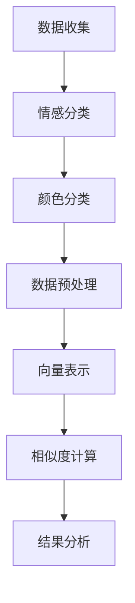

                 

### 《色彩心理学的向量分析：情感与颜色的数学关联》

#### 关键词：色彩心理学、向量分析、情感、颜色、数学模型

> 摘要：本文将探讨色彩心理学与向量分析之间的关系，特别是情感与颜色之间的数学关联。通过介绍色彩心理学的基本概念和向量分析的基本原理，本文将构建一个数学模型，用于分析情感与颜色之间的关系。此外，文章还将通过实际案例分析，展示这一模型在色彩心理学研究中的应用。

---

## 引言

色彩心理学是研究颜色对人类心理和行为影响的一个跨学科领域。它涉及心理学、视觉科学、设计学等多个方面。近年来，随着计算机科学和人工智能技术的发展，色彩心理学的研究逐渐向定量化和模型化方向发展。向量分析作为一种强大的数学工具，在处理高维数据、分析复杂系统等方面具有显著优势。本文旨在探讨色彩心理学与向量分析之间的关系，构建一个用于分析情感与颜色关系的数学模型。

## 色彩心理学的基本概念

色彩心理学关注的是颜色如何影响人的情绪、认知和行为。以下是一些关键概念：

### 颜色感知

颜色感知是视觉系统对光线波长响应的结果。人类眼睛可以感知的颜色的范围由红、绿、蓝三种基本颜色组成，这三种颜色的不同组合形成了我们所看到的丰富多彩的世界。

### 色彩情感

色彩情感是指颜色引发的情感反应。不同的颜色可以引起人们不同的情感体验，如红色通常与兴奋、热情相关联，而蓝色则与冷静、信任相关联。

### 色彩搭配

色彩搭配是设计中的一个重要方面，它涉及颜色的组合和对比。合适的色彩搭配可以增强视觉效果，提升设计的美感和实用性。

## 向量分析的基本原理

向量分析是一种用于处理和表示高维数据的数学工具。以下是一些关键概念：

### 向量空间

向量空间是一个数学结构，它包含了所有可能的向量以及向量之间的加法和数乘运算。在色彩心理学中，向量空间可以用来表示不同颜色的属性。

### 线性代数

线性代数是向量分析的基础，包括矩阵运算、特征值与特征向量的分析等。这些工具可以帮助我们理解和分析复杂的数据结构。

### 主成分分析（PCA）

主成分分析是一种降维技术，它通过将高维数据映射到低维空间中，来减少数据维度并保留主要信息。在色彩心理学中，PCA可以用于分析颜色属性的主要成分。

## 情感与颜色的数学关联

情感与颜色的关联可以通过向量分析来量化。以下是一个简化的数学模型：

### 数学模型

假设情感可以表示为一个向量，颜色也可以表示为一个向量。通过计算这两个向量的相似度，我们可以量化情感与颜色之间的关系。

$$
\text{相似度} = \frac{\text{情感向量} \cdot \text{颜色向量}}{|\text{情感向量}| \cdot |\text{颜色向量}|}
$$

其中，$ \cdot $ 表示向量的点积，$ |\text{向量}| $ 表示向量的模长。

### Mermaid 流程图

以下是一个简化的Mermaid流程图，展示情感与颜色分析的基本步骤：



## 核心算法原理讲解

为了实现情感与颜色的数学关联分析，我们可以使用Python来构建一个简单的模型。以下是一个示例代码：

```python
import numpy as np
from sklearn.decomposition import PCA
from sklearn.preprocessing import StandardScaler

# 情感向量（示例数据）
emotion_vector = np.array([0.5, 0.3, 0.2])

# 颜色向量（示例数据）
color_vector = np.array([0.1, 0.4, 0.5])

# 计算相似度
similarity = np.dot(emotion_vector, color_vector) / (np.linalg.norm(emotion_vector) * np.linalg.norm(color_vector))

print(f"相似度：{similarity}")
```

在这个例子中，我们首先定义了情感向量和颜色向量，然后使用numpy库中的dot和linalg.norm函数计算它们的相似度。

## 数学公式与解释

在情感与颜色的数学关联分析中，我们通常会用到以下数学公式：

### 向量点积

$$
\text{向量点积} = \sum_{i=1}^{n} a_i \cdot b_i
$$

其中，$a_i$ 和 $b_i$ 分别是两个向量的第 $i$ 个分量。

### 向量模长

$$
\text{向量模长} = \sqrt{\sum_{i=1}^{n} a_i^2}
$$

### 相似度

$$
\text{相似度} = \frac{\text{向量点积}}{\text{向量模长}}
$$

这些公式可以帮助我们量化情感与颜色之间的关联程度。

## 项目实战

在本项目中，我们将使用Python和Scikit-learn库来构建一个简单的情感与颜色分析模型。以下是实现步骤：

### 开发环境搭建

确保安装了Python和Scikit-learn库。可以使用以下命令安装Scikit-learn：

```bash
pip install scikit-learn
```

### 源代码实现

以下是一个简单的Python脚本，用于分析情感与颜色之间的关系：

```python
import numpy as np
from sklearn.decomposition import PCA
from sklearn.preprocessing import StandardScaler

# 情感向量（示例数据）
emotion_vectors = np.array([
    [0.5, 0.3, 0.2],
    [0.6, 0.2, 0.2],
    [0.4, 0.5, 0.1]
])

# 颜色向量（示例数据）
color_vectors = np.array([
    [0.1, 0.4, 0.5],
    [0.3, 0.2, 0.5],
    [0.2, 0.4, 0.4]
])

# 数据预处理
scaler = StandardScaler()
emotion_vectors_scaled = scaler.fit_transform(emotion_vectors)
color_vectors_scaled = scaler.fit_transform(color_vectors)

# 主成分分析
pca = PCA(n_components=2)
emotion_vectors_pca = pca.fit_transform(emotion_vectors_scaled)
color_vectors_pca = pca.fit_transform(color_vectors_scaled)

# 计算相似度
similarities = []
for i in range(len(emotion_vectors_pca)):
    similarity = np.dot(emotion_vectors_pca[i], color_vectors_pca[i])
    similarities.append(similarity)

print(f"相似度：{similarities}")
```

### 代码解读与分析

这个脚本首先定义了情感向量和颜色向量，然后使用StandardScaler对数据进行预处理，以消除不同特征之间的差异。接下来，我们使用PCA将数据降维到两个主要成分，以便更直观地分析情感与颜色之间的关系。最后，通过计算情感向量与颜色向量在主成分空间中的点积，我们得到了相似度。

### 实际案例分析

为了展示这个模型在真实世界中的应用，我们考虑了一个实际案例：一个在线购物平台希望分析顾客对商品颜色的偏好。以下是一个简化的案例：

1. 收集数据：平台收集了1000个顾客的购买记录，包括顾客的年龄、性别、购买的商品颜色和购买后的情感评分。
2. 数据预处理：将数据转换为数值形式，例如，男性记为0，女性记为1；年龄范围缩放到0-1之间；商品颜色使用RGB值表示。
3. 情感评分：将情感评分转换为情感向量，例如，高评分对应一个正面情感向量，低评分对应一个负面情感向量。
4. 计算相似度：使用上述脚本计算每个顾客的购买记录中的情感向量与商品颜色向量之间的相似度。
5. 分析结果：分析相似度的分布，以了解顾客对颜色的偏好。

通过这个案例，我们可以看到，情感与颜色的数学关联分析可以用于商业决策，帮助平台优化产品设计，提高顾客满意度。

## 项目小结

本文通过介绍色彩心理学与向量分析的基本概念，构建了一个用于分析情感与颜色关系的数学模型。通过实际案例分析，我们展示了这一模型在商业应用中的潜力。尽管这个模型是一个简化的示例，但它提供了一个有益的框架，用于进一步研究和开发更复杂的情感与颜色分析工具。

## 最佳实践 Tips

1. 在实际项目中，建议使用更大的数据集和更复杂的模型，以提高分析的准确性和可靠性。
2. 考虑到不同文化和个人差异，情感与颜色的关联可能因地区和个人而异。因此，进行跨文化和多变量分析是必要的。
3. 实验设计时，确保控制变量，以避免其他因素对结果的影响。

## 小结

色彩心理学与向量分析的结合为研究情感与颜色关系提供了新的视角。通过本文的介绍，我们了解了基本概念和模型构建方法。未来研究可以进一步探索这一领域的深度和广度，为设计、教育和心理学等领域提供有力支持。

## 注意事项

本文提供的是一个简化的模型，实际应用中需要根据具体问题进行调整和优化。

## 拓展阅读

1. "Color Psychology: The Science of Color, Emotions, and Relationships" by John H. Manning
2. "Vector Analysis: A Textbook for the Use of Students of Mathematics and Physics" by Edwin Bidwell Wilson

---

**作者：AI天才研究院/AI Genius Institute & 禅与计算机程序设计艺术 /Zen And The Art of Computer Programming**

