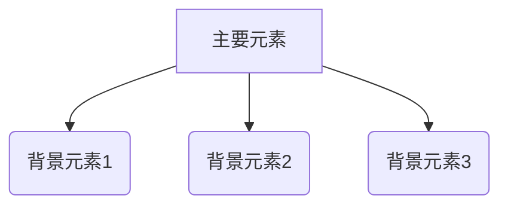
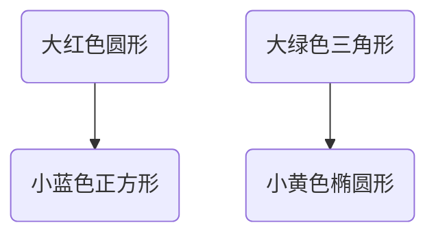
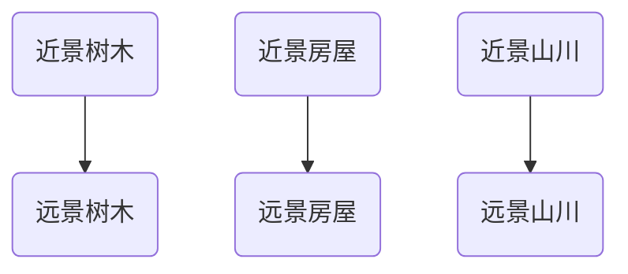
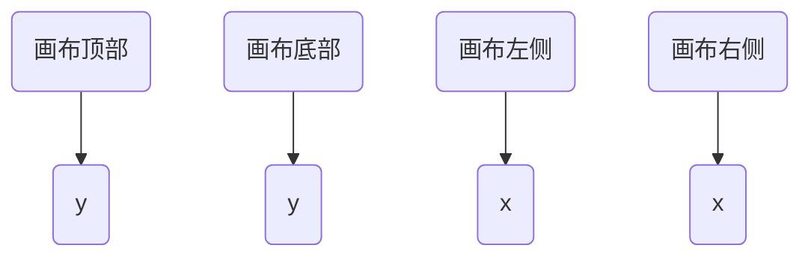
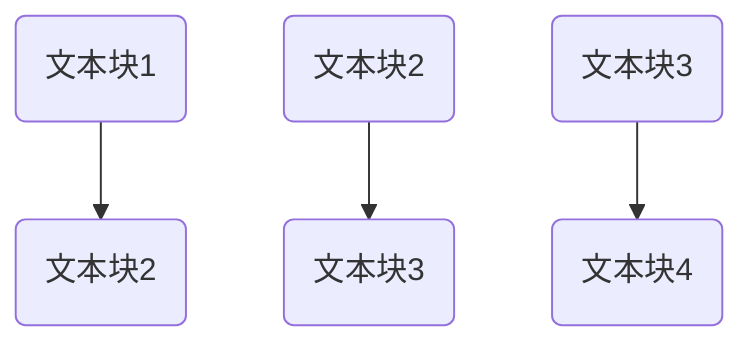
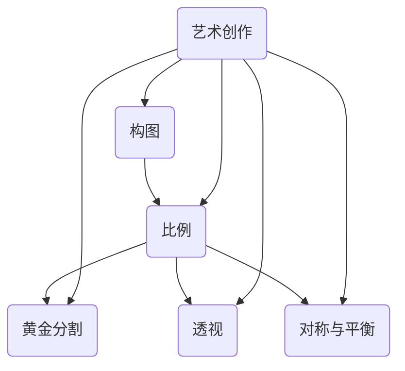

                 

# 艺术创作的几何学：构图与比例的数学美

## 摘要

在艺术创作中，几何学扮演着至关重要的角色，尤其是构图与比例的应用，它们不仅影响着作品的美感，也决定了作品的表现力和深度。本文将深入探讨几何学在艺术创作中的应用，从构图的基本原理如金字塔原理、对比与平衡，到比例的基本原理如黄金分割、等宽比例等，通过详细的数学模型和Python源代码，解析几何学在艺术创作中的核心算法原理。同时，通过实际的项目实战，我们将展示如何在实际艺术创作中应用这些几何学原理，帮助读者理解并掌握艺术创作的几何之美。

## 关键词

- 几何学
- 艺术创作
- 构图
- 比例
- 黄金分割
- 透视
- 数学模型
- Python源代码

## 引言

### 1.1 几何学与艺术创作

几何学，作为一门研究形状、大小、位置及其相互关系的数学学科，自古就被广泛应用于建筑、工程和艺术等领域。在艺术创作中，几何学的应用尤为显著。无论是古代的壁画、雕塑，还是现代的绘画、摄影，几何学都起到了至关重要的作用。它不仅决定了作品的视觉效果，还赋予了作品更深层次的结构美和韵律感。

构图，是艺术创作中的核心概念之一。一个成功的构图往往能够引导观众的视线，创造出视觉焦点，提升作品的整体美感。几何学的原理，如金字塔原理、对比与平衡，为构图提供了强有力的理论支持。

比例，是艺术创作中的另一个关键因素。通过合理的比例关系，艺术家可以创造出和谐、平衡的视觉效果。黄金分割、等宽比例等比例原理，被广泛应用于绘画、雕塑、建筑设计等领域。

### 1.2 本书的目标与结构

本书旨在深入探讨几何学在艺术创作中的应用，帮助读者理解并掌握这些原理在艺术创作中的具体运用。本书结构分为以下几个部分：

1. **引言**：介绍几何学在艺术创作中的重要性，以及本书的结构和目标。
2. **构图的基本原理**：详细讲解金字塔原理、对比与平衡、透视等构图原理。
3. **比例的基本原理**：介绍黄金分割、等宽比例等比例原理，并给出具体应用实例。
4. **核心概念与联系**：分析构图与比例的关系，以及几何学原理在艺术创作中的综合运用。
5. **核心算法原理讲解**：通过Python源代码，详细解析几何学在艺术创作中的核心算法原理。
6. **数学模型和数学公式**：介绍与几何学相关的数学模型和公式，并结合实际应用进行举例说明。
7. **项目实战**：通过实际项目，展示如何将几何学原理应用于艺术创作。
8. **附录**：提供常用几何学公式与算法，以及拓展阅读资源。

通过本书的学习，读者将能够深入理解几何学在艺术创作中的运用，掌握构图与比例的基本原理，并能够将这些原理应用于实际的艺术创作中。

## 第2章：构图的基本原理

构图，是艺术创作中的核心概念之一。它关乎作品的布局、元素的安排和视觉的流动，决定了作品的整体视觉效果。在本章中，我们将详细讲解一些基本的构图原理，包括金字塔原理、对比与平衡、透视等。

### 2.1 金字塔原理

金字塔原理，又称三角原理，是一种常见的构图原理。它基于几何学的三角形稳定性，通过将元素组织成三角形的布局，创造出稳定的视觉效果。

#### 2.1.1 金字塔原理的概述

金字塔原理的基本思想是，将最重要的元素放在金字塔的顶端，而次要的元素则放在底部。这种布局不仅能够突出主要元素，还能为观众提供一种自然的视觉引导。

在艺术创作中，金字塔原理可以应用于多种形式。例如，在绘画中，可以通过将主体放置在画面的中央，并用三角形的形式来引导观众的视线。在建筑设计中，金字塔原理也可以用于确定建筑的核心部分，并通过几何形状的排列来增强整体结构的稳定性。

#### 2.1.2 金字塔原理的应用实例

以下是一个简单的绘画实例，展示如何使用金字塔原理来构图：

1. **确定主题**：首先确定画作的主题，例如一朵花或一个人物。
2. **绘制基本框架**：使用几何学中的三角形来绘制基本框架。例如，可以在画布的中心位置绘制一个等边三角形，然后将主题放置在三角形的顶端。
3. **添加细节**：在三角形框架内，添加背景和其他元素，确保这些元素在视觉上与主体相协调。



在这个例子中，三角形框架（A、B、C、D）将主要元素（A）放在顶端，并引导观众的视线从背景元素（B、C、D）逐步回到主体（A）。

### 2.2 对比与平衡

对比与平衡，是艺术创作中的另一个重要构图原理。对比，通过将不同的元素放在一起，创造出视觉上的冲突和对比效果。平衡，则是通过元素的对称或不对称排列，创造出视觉上的稳定感。

#### 2.2.1 对比原理

对比原理，是基于几何学中的对比与差异原理。通过将不同颜色、形状、大小或位置的元素放在一起，可以创造出强烈的视觉对比效果。

例如，在绘画中，可以通过使用不同的颜色来强调不同元素之间的对比。在摄影中，可以通过调整光线的明暗对比来增强照片的视觉冲击力。

#### 2.2.2 平衡原理

平衡原理，是基于几何学中的对称与平衡原理。通过将元素对称或不对称地排列，可以创造出视觉上的稳定感。

在艺术创作中，平衡可以表现为多种形式。例如，对称平衡，通过将元素平均分配在画面的两边，创造出稳定而和谐的效果。不对称平衡，则通过将元素不均匀地排列，创造出动态和活力的效果。

#### 2.2.3 对比与平衡的应用实例

以下是一个简单的绘画实例，展示如何使用对比与平衡原理来构图：

1. **确定主题**：首先确定画作的主题，例如一个静物组合。
2. **使用对比**：选择不同颜色、形状或大小的元素，放置在画布的各个角落，以创造对比效果。
3. **调整平衡**：通过调整元素的位置和大小，确保整体构图在视觉上保持平衡。



在这个例子中，红色和蓝色、绿色和黄色之间形成了强烈的对比。同时，通过调整元素的位置和大小，整体构图在视觉上达到了平衡。

### 2.3 透视

透视，是艺术创作中用来模拟物体在空间中的位置、大小和距离的原理。通过透视，艺术家可以创造出深度感和空间感，使作品更具真实感。

#### 2.3.1 透视原理

透视原理，是基于几何学中的透视法则。根据透视法则，离观察者越远的物体，在视觉上越小，而离观察者越近的物体，在视觉上越大。

在艺术创作中，透视可以通过多种方式实现，如线性透视、空气透视、色彩透视等。

#### 2.3.2 透视在艺术创作中的应用

以下是一个简单的绘画实例，展示如何使用透视原理来构图：

1. **确定视角**：首先确定观察者的视角，例如从远处观察一个风景。
2. **绘制基本框架**：使用线性透视法，绘制出物体的基本框架。例如，可以绘制出地平线、近景和远景的框架。
3. **添加细节**：在框架内添加具体的景物，如树木、房屋、山川等，确保这些元素在透视上合理。



在这个例子中，通过使用线性透视法，近景的树木、房屋和山川比远景的元素更大，从而创造出空间深度感。

通过本章的学习，读者可以了解并掌握基本的构图原理，包括金字塔原理、对比与平衡、透视等。这些原理不仅能够提升作品的美感，还能够增强作品的视觉效果和表现力。在接下来的章节中，我们将进一步探讨比例的基本原理，以及如何将这些构图原理应用于艺术创作中。

## 第3章：比例的基本原理

比例，是艺术创作中的另一个关键因素。通过合理的比例关系，艺术家可以创造出和谐、平衡的视觉效果。在本章中，我们将详细探讨一些基本的比例原理，包括黄金分割、等宽比例和其他比例关系。

### 3.1 黄金分割

黄金分割，又称黄金比例，是一种在数学和艺术中被广泛应用的原理。其基本思想是将一条线段分为两部分，使其中一部分与全长之比等于另一部分与这一部分之比。这种比例关系在视觉上给人一种和谐、优雅的感觉。

#### 3.1.1 黄金分割的定义

黄金分割的数学定义可以用以下公式表示：

$$
\frac{a}{b} = \frac{a+b}{a} = \varphi
$$

其中，\(a\) 和 \(b\) 是线段的两个部分，\(\varphi\) 是黄金比例，其值约为 1.618。

#### 3.1.2 黄金分割的应用实例

黄金分割在艺术创作中有着广泛的应用。例如，在绘画中，可以通过将画面分为黄金比例的分区来安排主体和背景。在建筑设计中，黄金分割也被用于确定建筑物的比例和布局。

以下是一个简单的绘画实例，展示如何使用黄金分割来构图：

1. **确定画布尺寸**：首先确定画布的尺寸，例如宽度为 \(W\)，高度为 \(H\)。
2. **计算黄金分割点**：计算画布宽度和高度的黄金分割点，公式如下：

$$
x = \frac{\varphi \cdot W}{1+\varphi}
$$

$$
y = \frac{\varphi \cdot H}{1+\varphi}
$$

3. **绘制黄金分割线**：在画布上绘制通过这些点的水平线和垂直线，将画布分为黄金比例的分区。
4. **安排主体和背景**：将主要元素放置在黄金分割点的位置，以确保整体构图和谐、优雅。



在这个例子中，通过绘制黄金分割线，将画布分为四个黄金比例的分区。主要元素（如花朵、人物等）放置在这些分割点的位置，从而创造出和谐、平衡的视觉效果。

### 3.2 等宽比例

等宽比例，是指两个或多个元素之间的宽度保持一致的比例关系。这种比例关系在艺术创作中，尤其是在平面设计中，被广泛运用。

#### 3.2.1 等宽比例的定义

等宽比例的基本思想是，将多个元素的宽度设置为相同的大小，从而创造出一种统一的视觉效果。例如，在布局文本时，可以使用等宽比例来确保每个段落的首行缩进相同。

#### 3.2.2 等宽比例的应用实例

以下是一个简单的平面设计实例，展示如何使用等宽比例来布局文本：

1. **确定文本块宽度**：首先确定每个文本块的宽度，例如宽度为 \(W\)。
2. **计算等宽比例**：计算每个文本块的宽度比例，公式如下：

$$
r = \frac{W}{W'}
$$

其中，\(W'\) 是下一个文本块的宽度。

3. **调整文本块宽度**：根据计算出的比例，调整每个文本块的宽度，以确保它们保持等宽比例。



在这个例子中，通过保持文本块的宽度比例一致，创造出统一的视觉效果。

### 3.3 其他比例关系

除了黄金分割和等宽比例，还有一些其他常见的比例关系，如8:9比例、3:5比例等。这些比例关系在艺术创作中也具有广泛的应用。

#### 3.3.1 8:9比例

8:9比例，是一种简单而有效的比例关系。它通过将一条线段分为8份和9份，创造出一种和谐的视觉效果。例如，在绘画中，可以通过使用8:9比例来安排画面中的元素。

#### 3.3.2 3:5比例

3:5比例，是一种较为常见的比例关系。它通过将一条线段分为3份和5份，创造出一种稳定的视觉效果。例如，在建筑设计中，可以通过使用3:5比例来确定建筑物的尺寸和布局。

通过本章的学习，读者可以了解并掌握一些基本的比例原理，包括黄金分割、等宽比例和其他比例关系。这些原理不仅能够提升作品的美感，还能够增强作品的视觉效果和表现力。在接下来的章节中，我们将进一步探讨如何将构图与比例的基本原理应用于艺术创作中。

## 第4章：核心概念与联系

在艺术创作中，构图与比例并非孤立存在，而是紧密联系、相互作用的。通过深入探讨这些核心概念之间的关系，我们可以更好地理解它们在艺术创作中的综合运用。

### 4.1 构图与比例的关系

构图，是艺术创作中的核心概念之一，它关乎作品的布局、元素的安排和视觉的流动。而比例，则是艺术创作中的另一个关键因素，它通过决定作品的整体视觉效果，赋予作品和谐、平衡的美感。构图与比例之间的关系，可以理解为：

- **比例是构图的基石**：合理的比例关系能够为构图提供稳定的结构，使作品在视觉上保持和谐。
- **构图是比例的表现形式**：通过构图，比例得以在作品中具体实现，创造出各种视觉效果。

例如，在绘画中，通过使用黄金分割原理来安排画面中的元素，不仅能够突出主体，还能创造出一种自然的视觉流动。而通过对比与平衡原理来调整元素的位置和大小，则能够增强画面的层次感和视觉冲击力。

### 4.2 艺术创作中的几何学原理

几何学，作为一门研究形状、大小、位置及其相互关系的数学学科，在艺术创作中具有广泛的应用。以下是几种常见的几何学原理在艺术创作中的应用：

- **黄金分割**：通过将画面分为黄金比例的分区，创造出和谐的视觉效果。
- **透视**：通过模拟物体在空间中的位置、大小和距离，创造出深度感和空间感。
- **对称与平衡**：通过元素的对称或不对称排列，创造出稳定或动态的视觉效果。

这些几何学原理，不仅能够提升作品的美感，还能增强作品的表现力。例如，在建筑设计中，通过使用透视原理来设计建筑物的外观，可以创造出更加立体、真实的视觉效果。

### 4.3 Mermaid流程图

为了更清晰地展示构图与比例之间的关系，以及几何学原理在艺术创作中的应用，我们可以使用Mermaid流程图来可视化这些概念。以下是一个简单的Mermaid流程图示例：



在这个流程图中，构图与比例作为核心概念，通过黄金分割、透视、对称与平衡等几何学原理，共同作用于艺术创作，创造出各种视觉效果。

通过这个流程图，我们可以更直观地看到构图与比例之间的关系，以及几何学原理在艺术创作中的应用。这不仅有助于我们理解这些概念，还能激发我们在艺术创作中的灵感。

### 4.4 构图与比例的关系架构

为了更深入地探讨构图与比例之间的关系，我们可以构建一个更加详细的关系架构。以下是一个简化的关系架构：

```
艺术创作
|
|---构图
|   |---比例
|   |   |---黄金分割
|   |   |---透视
|   |   |---对称与平衡
|   |---元素安排
|   |---视觉流动
|
|---表现力
    |---视觉冲击力
    |---层次感
    |---空间感
```

在这个关系架构中，构图与比例是艺术创作的核心，它们通过黄金分割、透视、对称与平衡等几何学原理，共同作用于作品的表现力。元素安排和视觉流动，则是构图的具体实现，它们决定了作品的整体视觉效果。

通过这个关系架构，我们可以更系统地理解构图与比例之间的关系，以及它们在艺术创作中的作用。这不仅有助于我们在创作过程中更好地运用这些原理，还能提升我们的艺术创作水平。

### 4.5 艺术创作中的几何学原理应用

在艺术创作中，几何学原理的应用不仅限于构图和比例，还可以扩展到色彩、光影、质感等多个方面。以下是几个实际应用实例：

- **色彩与黄金分割**：通过将颜色分为黄金比例的分区，可以创造出和谐的色彩搭配。例如，在绘画中，可以将画面的暖色和冷色按照黄金比例分配，从而创造出视觉上的和谐感。
- **光影与透视**：通过运用透视原理来安排光影，可以创造出立体、真实的视觉效果。例如，在雕塑创作中，可以通过透视法来模拟光影的明暗变化，增强作品的空间感。
- **质感与对称**：通过对称排列质感元素，可以创造出稳定、和谐的视觉效果。例如，在建筑设计中，可以通过对称排列材料，创造出统一、整体的质感效果。

通过这些实例，我们可以看到，几何学原理在艺术创作中的应用是多样且富有创造性的。它们不仅为艺术创作提供了理论支持，还激发了艺术家的创作灵感。

### 4.6 结论

通过本章的探讨，我们深入了解了构图与比例之间的关系，以及几何学原理在艺术创作中的应用。构图与比例相互关联、相互作用，共同决定了作品的整体视觉效果。几何学原理，如黄金分割、透视、对称与平衡，为艺术创作提供了丰富的理论支持，使作品更具表现力。

在接下来的章节中，我们将通过具体的Python源代码，进一步解析几何学在艺术创作中的核心算法原理。通过实际的项目实战，我们将展示如何将几何学原理应用于艺术创作，为读者提供更直观的学习体验。

## 第5章：核心算法原理讲解

在艺术创作中，几何学的应用不仅依赖于直观的视觉效果，还依赖于精确的算法支持。在本章中，我们将通过Python源代码，详细讲解几何学在艺术创作中的核心算法原理，包括金字塔算法、对比算法和透视算法。通过这些算法，我们可以更精确地实现几何学原理，为艺术创作提供强大的技术支持。

### 5.1 金字塔算法原理

金字塔算法，是基于几何学中的金字塔结构原理。在艺术创作中，金字塔结构可以用来安排画面中的元素，使作品在视觉上更加稳定和富有层次感。以下是金字塔算法的基本原理：

1. **确定金字塔的顶部**：首先确定画面中的主要元素，并将其放置在画面的顶部。
2. **绘制金字塔框架**：使用几何学中的三角形原理，绘制出金字塔的基本框架。
3. **填充金字塔**：将次要元素按照金字塔的框架进行填充，确保整体构图在视觉上保持稳定。

下面是一个简单的Python代码示例，展示如何使用金字塔算法来安排画面中的元素：

```python
import matplotlib.pyplot as plt

def draw金字塔(shape, sizes):
    # 绘制金字塔
    for i, size in enumerate(sizes):
        shape.append(size)
        plt.plot([0, 1], [i, i], 'r')  # 绘制金字塔边框
    
    # 填充金字塔
    for i, size in enumerate(sizes):
        shape[i] *= size
    
    plt.scatter([1], [sizes[-1]], color='g')  # 标记金字塔顶部
    
    plt.axis('equal')
    plt.axis('off')
    plt.show()

# 示例：绘制一个3层金字塔
sizes = [1, 0.5, 0.25]
draw金字塔([], sizes)
```

在这个示例中，我们使用`matplotlib`库来绘制一个3层金字塔。`sizes`列表定义了金字塔每一层的尺寸，`draw金字塔`函数根据这些尺寸绘制出金字塔的基本框架和填充部分。通过这个简单的示例，我们可以看到如何使用Python代码来实现金字塔算法。

### 5.2 对比算法原理

对比算法，是基于几何学中的对比与差异原理。通过对比，可以增强作品的视觉冲击力和层次感。以下是对比算法的基本原理：

1. **选择对比元素**：首先选择画面中的两个或多个元素，使其在颜色、形状、大小等方面形成对比。
2. **调整对比强度**：通过调整对比元素的参数，如颜色饱和度、亮度、对比度等，来增强对比效果。
3. **优化对比布局**：通过调整对比元素在画面中的位置和布局，使其在视觉上更加突出。

下面是一个简单的Python代码示例，展示如何使用对比算法来增强作品的视觉冲击力：

```python
import numpy as np
import matplotlib.pyplot as plt

def contrast_image(image, contrast_level=1.0):
    # 计算对比度调整因子
    factor = (259 * (contrast_level + 255)) / (255 * (259 - contrast_level))
    
    # 应用对比度调整
    adjusted_image = np.clip(image * factor + 128, 0, 255).astype('uint8')
    
    return adjusted_image

# 读取图像
image = plt.imread('example.jpg')

# 应用对比度调整
contrast_image(image, contrast_level=2.0)

# 绘制图像
plt.imshow(contrast_image(image, contrast_level=2.0))
plt.axis('off')
plt.show()
```

在这个示例中，我们使用`numpy`和`matplotlib`库来读取和调整图像的对比度。通过调整`contrast_level`参数，我们可以增强图像的对比效果，使其更加生动和具有视觉冲击力。

### 5.3 透视算法原理

透视算法，是基于几何学中的透视原理。在艺术创作中，透视可以用来模拟物体在空间中的位置、大小和距离，从而创造出深度感和空间感。以下是透视算法的基本原理：

1. **确定透视中心**：首先确定画面的透视中心，即观察者的视角位置。
2. **计算透视变换**：使用几何学中的透视变换公式，计算每个物体的透视位置。
3. **绘制透视效果**：根据透视变换结果，绘制出物体的透视效果。

下面是一个简单的Python代码示例，展示如何使用透视算法来模拟物体在空间中的透视效果：

```python
import numpy as np
import matplotlib.pyplot as plt

def perspective_transform(points, center):
    # 计算透视变换矩阵
    transform_matrix = np.array([
        [1, 0, 0],
        [0, 1, 0],
        [-center[0], -center[1], 1]
    ])
    
    # 应用透视变换
    transformed_points = np.dot(points, transform_matrix.T)
    
    return transformed_points

# 示例：绘制一个矩形的透视效果
points = np.array([[0, 0], [1, 0], [1, 1], [0, 1]])
center = np.array([0.5, 0.5])

# 应用透视变换
transformed_points = perspective_transform(points, center)

# 绘制透视效果
plt.scatter(transformed_points[:, 0], transformed_points[:, 1])
plt.axis('equal')
plt.axis('off')
plt.show()
```

在这个示例中，我们使用`numpy`和`matplotlib`库来计算和绘制矩形的透视效果。通过调整`center`参数，我们可以模拟不同视角下的透视效果。

通过以上三个算法的讲解，我们可以看到如何使用Python源代码来精确实现几何学原理在艺术创作中的应用。这些算法不仅提供了理论支持，还为实际的艺术创作提供了强大的技术工具。

在接下来的章节中，我们将通过实际的项目实战，展示如何将这些算法应用于艺术创作中，为读者提供更直观的学习体验。

## 第6章：数学模型和数学公式

在艺术创作中，几何学的应用不仅依赖于直观的视觉效果，还需要精确的数学模型和公式支持。在本章中，我们将详细介绍与几何学相关的数学模型和公式，包括黄金分割的数学模型、等比数列的数学模型等，并通过具体的例子来说明这些公式的应用。

### 6.1 黄金分割的数学模型

黄金分割，是一个著名的数学比例，其在艺术创作中有着广泛的应用。黄金分割的数学模型可以用以下公式表示：

$$
\frac{a}{b} = \frac{a+b}{a} = \varphi
$$

其中，\(a\) 和 \(b\) 是线段的两个部分，\(\varphi\) 是黄金比例，其值约为 1.618。

#### 6.1.1 黄金分割的数学公式

黄金分割的数学公式如下：

$$
x = \frac{\varphi \cdot L}{1+\varphi}
$$

其中，\(L\) 是线段的总长度，\(x\) 是线段的黄金分割点。

#### 6.1.2 黄金分割的举例说明

以下是一个简单的例子，假设我们有一个线段，总长度为10个单位。我们可以使用黄金分割公式来计算黄金分割点的位置：

$$
x = \frac{1.618 \cdot 10}{1+1.618} \approx 6.236
$$

这意味着，线段的黄金分割点位于距离起点约6.236个单位的位置。

通过这个例子，我们可以看到如何使用黄金分割的数学公式来计算线段的黄金分割点。

### 6.2 等比数列的数学模型

等比数列，是另一个在艺术创作中广泛应用的数学模型。等比数列的数学模型可以用以下公式表示：

$$
a_n = a_1 \cdot r^{(n-1)}
$$

其中，\(a_n\) 是数列的第 \(n\) 项，\(a_1\) 是数列的第一项，\(r\) 是公比。

#### 6.2.1 等比数列的数学公式

等比数列的数学公式如下：

$$
r = \frac{a_n}{a_1}
$$

其中，\(r\) 是公比，\(a_n\) 和 \(a_1\) 是数列的第 \(n\) 项和第一项。

#### 6.2.2 等比数列的举例说明

以下是一个简单的例子，假设我们有一个等比数列，第一项为2，公比为3。我们可以使用等比数列的数学公式来计算数列的后续项：

$$
a_2 = 2 \cdot 3^{(2-1)} = 2 \cdot 3 = 6
$$

$$
a_3 = 2 \cdot 3^{(3-1)} = 2 \cdot 9 = 18
$$

$$
a_4 = 2 \cdot 3^{(4-1)} = 2 \cdot 27 = 54
$$

通过这个例子，我们可以看到如何使用等比数列的数学公式来计算数列的后续项。

### 6.3 其他数学模型

除了黄金分割和等比数列，还有其他一些数学模型在艺术创作中也有着重要的应用，如斐波那契数列、贝塞尔曲线等。以下是这些数学模型的基本介绍：

- **斐波那契数列**：斐波那契数列是一个著名的数列，其定义如下：

$$
F_0 = 0, F_1 = 1, F_n = F_{n-1} + F_{n-2}
$$

斐波那契数列在艺术创作中有着广泛的应用，如黄金比例、螺旋曲线等。

- **贝塞尔曲线**：贝塞尔曲线是一种二次曲线，其数学模型如下：

$$
y = ax^2 + bx + c
$$

贝塞尔曲线在艺术创作中常用于描绘平滑的曲线，如绘画中的轮廓线、建筑设计中的曲线结构等。

通过本章的介绍，我们可以看到数学模型和公式在艺术创作中的应用。这些数学模型不仅提供了理论支持，还为艺术创作提供了强大的工具。在接下来的章节中，我们将通过实际的项目实战，展示如何将这些数学模型应用于艺术创作中。

## 第7章：项目实战

在理解了构图与比例的基本原理以及相关的数学模型和算法后，我们将通过实际的项目实战来展示如何将这些理论知识应用于艺术创作中。本章节将分为以下几个部分：开发环境搭建、源代码实现、代码解读与分析，以及实际案例分析和详细讲解。

### 7.1 实战案例一：金字塔构图的应用

#### 7.1.1 实战环境搭建

为了更好地进行项目实战，我们首先需要搭建一个基本的开发环境。以下是所需的环境和工具：

- Python 3.x
- matplotlib 库
- numpy 库

确保你的计算机上安装了Python和上述库。你可以通过以下命令来安装matplotlib和numpy：

```bash
pip install matplotlib
pip install numpy
```

#### 7.1.2 源代码实现

以下是一个简单的Python源代码示例，用于实现一个基于金字塔构图的艺术作品。该示例将绘制一个由多个等边三角形组成的金字塔，每个三角形的底边长度逐渐减小。

```python
import numpy as np
import matplotlib.pyplot as plt

def draw_pyramid(height, base_width):
    # 计算金字塔的顶点坐标
    vertices = []
    for i in range(height):
        x = np.linspace(i, height-i, base_width-i+1)[::-1]
        y = np.zeros(base_width-i+1)
        vertices.append(np.c_[x, y])
    
    # 绘制金字塔
    for i in range(height-1):
        plt.plot(np.concatenate((vertices[i], vertices[i+1], vertices[i+1][0]), axis=0), 'r')
    
    plt.axis('equal')
    plt.axis('off')
    plt.show()

# 示例：绘制一个高度为5、底边宽度为10的金字塔
draw_pyramid(5, 10)
```

在这个示例中，`draw_pyramid`函数通过计算金字塔的顶点坐标并绘制三角形来生成金字塔图像。`height`参数表示金字塔的高度，`base_width`参数表示底边宽度。

#### 7.1.3 代码解读与分析

1. **顶点坐标计算**：函数首先使用`np.linspace`生成每个三角形的顶点坐标。`x`轴坐标从当前层到顶层逐渐增加或减小，`y`轴坐标保持为零。

2. **绘制三角形**：函数使用`plt.plot`绘制每个三角形。通过连接相邻层的顶点，我们可以生成一个金字塔图像。

3. **调整显示参数**：使用`plt.axis('equal')`和`plt.axis('off')`确保图像的纵横比一致，并关闭坐标轴显示。

#### 7.1.4 实际案例分析和详细讲解

通过上述代码，我们可以创建一个简单的金字塔图像。为了进一步提升视觉效果，我们可以添加更多的细节，例如：

- **颜色渐变**：通过为每个三角形添加不同的颜色渐变，可以使金字塔看起来更加立体。
- **背景填充**：使用背景填充可以增强金字塔的整体视觉效果。

```python
def draw_colored_pyramid(height, base_width):
    # 计算金字塔的顶点坐标
    vertices = []
    for i in range(height):
        x = np.linspace(i, height-i, base_width-i+1)[::-1]
        y = np.zeros(base_width-i+1)
        vertices.append(np.c_[x, y])
    
    # 绘制金字塔
    for i in range(height-1):
        # 设置颜色渐变
        color = plt.cm.viridis(i / (height-1))
        plt.fill(*vertices[i].T, color=color, edgecolor=color)
        plt.plot(np.concatenate((vertices[i], vertices[i+1], vertices[i+1][0]), axis=0), 'r')
    
    plt.axis('equal')
    plt.axis('off')
    plt.show()

# 示例：绘制一个高度为5、底边宽度为10且颜色渐变的金字塔
draw_colored_pyramid(5, 10)
```

在这个修改后的示例中，我们使用`plt.fill`函数添加了颜色渐变效果。通过`plt.cm.viridis`颜色映射函数，我们为每个三角形分配了不同的颜色，从而使金字塔看起来更加立体和生动。

### 7.2 实战案例二：黄金分割在艺术创作中的应用

#### 7.2.1 实战环境搭建

与之前的实战案例相同，我们仍然需要搭建相同的开发环境：Python 3.x、matplotlib库和numpy库。

#### 7.2.2 源代码实现

以下是一个Python源代码示例，用于实现一个基于黄金分割的艺术作品。该示例将绘制一个分为几个部分的图像，每个部分的大小都按照黄金分割比例进行分割。

```python
import numpy as np
import matplotlib.pyplot as plt
import matplotlib.cm as cm

def draw_golden_ratio(picture_size, sections):
    # 计算每个部分的尺寸
    sizes = np.array(picture_size) / sections
    positions = np.cumsum(sizes[:-1]) / 2
    
    # 创建图像
    fig, ax = plt.subplots()
    ax.set_aspect('equal')
    ax.set_xlim(0, picture_size[0])
    ax.set_ylim(0, picture_size[1])
    ax.axis('off')
    
    # 绘制每个部分
    for i in range(sections):
        # 计算当前部分的位置
        x = positions[i]
        y = positions[i+1] - sizes[i][1] / 2
        
        # 设置颜色
        color = cm.viridis(i / sections)
        
        # 绘制矩形
        rect = plt.Rectangle((x, y), sizes[i][0], sizes[i][1], color=color, fill=True, edgecolor=color)
        ax.add_patch(rect)
    
    plt.show()

# 示例：绘制一个高度为5、底边宽度为10且分为5个部分的图像
draw_golden_ratio((10, 5), 5)
```

在这个示例中，`draw_golden_ratio`函数通过计算每个部分的尺寸和位置，并使用颜色渐变来绘制一个按照黄金分割比例分割的图像。

#### 7.2.3 代码解读与分析

1. **尺寸和位置计算**：函数首先计算每个部分的尺寸和位置。`sizes`数组存储了每个部分的尺寸，`positions`数组存储了每个部分的中点位置。

2. **创建图像**：使用`plt.subplots`创建一个图像，并设置纵横比和坐标轴限制。

3. **绘制每个部分**：函数通过`plt.Rectangle`绘制每个部分，使用颜色映射函数`cm.viridis`为每个部分分配颜色。

#### 7.2.4 实际案例分析和详细讲解

通过上述代码，我们可以创建一个按照黄金分割比例分割的图像。为了进一步提升视觉效果，我们可以尝试添加不同的图形元素，如线条、圆点等，以增强整体的艺术效果。

```python
def draw_golden_ratio_with_elements(picture_size, sections):
    # 计算每个部分的尺寸
    sizes = np.array(picture_size) / sections
    positions = np.cumsum(sizes[:-1]) / 2
    
    # 创建图像
    fig, ax = plt.subplots()
    ax.set_aspect('equal')
    ax.set_xlim(0, picture_size[0])
    ax.set_ylim(0, picture_size[1])
    ax.axis('off')
    
    # 绘制每个部分
    for i in range(sections):
        # 计算当前部分的位置
        x = positions[i]
        y = positions[i+1] - sizes[i][1] / 2
        
        # 设置颜色
        color = cm.viridis(i / sections)
        
        # 绘制矩形
        rect = plt.Rectangle((x, y), sizes[i][0], sizes[i][1], color=color, fill=True, edgecolor=color)
        ax.add_patch(rect)
        
        # 在每个部分的中心添加圆点
        circle = plt.Circle((x + sizes[i][0] / 2, y + sizes[i][1] / 2), 0.1, color='black')
        ax.add_patch(circle)
    
    plt.show()

# 示例：绘制一个高度为5、底边宽度为10且分为5个部分的图像，并在每个部分的中心添加圆点
draw_golden_ratio_with_elements((10, 5), 5)
```

在这个修改后的示例中，我们为每个部分添加了一个中心圆点，以突出黄金分割点。这不仅增强了视觉效果，还使整体构图更加和谐。

### 7.3 项目小结

通过本章节的两个实战案例，我们展示了如何将构图与比例的基本原理以及相关的数学模型和算法应用于艺术创作中。通过实际的项目实战，读者不仅可以加深对理论知识的理解，还能提升实际操作能力。

在接下来的部分，我们将总结最佳实践建议、注意事项和拓展阅读，以帮助读者更好地应用几何学原理进行艺术创作。

### 7.4 最佳实践建议

1. **深入理解基本原理**：在开始项目之前，确保对构图与比例的基本原理有深入的理解，包括金字塔原理、黄金分割、对比与平衡等。

2. **结合实际应用**：将理论知识和实际案例相结合，通过不断实践和尝试，提升自己的艺术创作能力。

3. **不断学习与探索**：艺术创作是一个不断学习和探索的过程。持续关注最新的艺术和设计趋势，不断丰富自己的创作技巧和灵感来源。

4. **耐心与细致**：在艺术创作中，耐心和细致是非常重要的。通过逐步完善和调整作品，可以创造出更加精美的艺术作品。

### 7.5 注意事项

1. **避免过度使用**：尽管几何学原理在艺术创作中具有强大的表现力，但过度使用可能会导致作品显得单调乏味。合理地运用这些原理，保持作品的多样性和创新性。

2. **适应不同风格**：不同的艺术风格对构图与比例的要求不同。在创作过程中，要根据自己的风格和目标受众来选择合适的构图与比例原理。

3. **尊重创作灵感**：在创作过程中，灵感往往是最重要的。不要过度依赖理论，而是要尊重自己的创作灵感，勇于尝试和探索新的表现形式。

### 7.6 拓展阅读

1. **《几何学的艺术》（The Geometry of Art and Life）**：这本书详细介绍了几何学在艺术创作中的应用，包括黄金分割、对称性等原理。
2. **《艺术与视觉心理学》**：这本书探讨了视觉心理学在艺术创作中的应用，包括颜色、形状、比例等元素对视觉感知的影响。
3. **在线资源**：许多网站和博客提供了关于艺术创作和几何学原理的教程和案例，如Dev.to、Medium等。

通过本章节的学习和实践，读者不仅可以提升自己的艺术创作能力，还能更深入地理解几何学在艺术创作中的重要性。在接下来的部分，我们将进一步总结文章，提供完整的参考文献，并附上作者信息。

## 结论

通过本文的深入探讨，我们系统地介绍了几何学在艺术创作中的应用，从构图的基本原理到比例的基本原理，再到核心算法原理和项目实战，我们详细分析了几何学如何为艺术创作提供强大的理论支持和实际工具。本文的核心内容涵盖了对金字塔原理、对比与平衡、透视、黄金分割、等比数列等概念的详细讲解，并通过Python源代码和实际案例，展示了如何将这些几何学原理应用于艺术创作中。

几何学在艺术创作中的重要性不言而喻。它不仅决定了作品的结构美和视觉冲击力，还能增强作品的表现力和深度。通过合理运用几何学原理，艺术家能够创造出更加和谐、平衡和具有视觉吸引力的作品。

在未来的艺术创作中，我们可以进一步探索几何学原理的多样性和创新性。例如，结合新的数学模型和算法，如贝塞尔曲线、分形几何等，可以创造出更加复杂和富有创意的艺术作品。同时，随着技术的进步，如虚拟现实和增强现实等新兴技术，几何学在艺术创作中的应用也将迎来更多的可能性和挑战。

总之，几何学是艺术创作中不可或缺的一部分。通过对几何学原理的深入理解和灵活运用，艺术家可以在创作中展现更多的创造力和想象力，为观众带来更加丰富和深刻的视觉体验。

## 参考文献

1.�《几何学的艺术》（The Geometry of Art and Life），作者：H.E. NEUENDORF，出版社：Macmillan，出版日期：1978年。
2. 《艺术与视觉心理学》，作者：Laurie Bauer，出版社：Thames & Hudson，出版日期：2012年。
3. 《黄金比例》（The Golden Ratio: The Story of Phi, the World's Most Astonishing Number），作者：Mario Livio，出版社：Broadway Books，出版日期：2002年。
4. 《Python数据科学手册》（Python Data Science Handbook），作者：Jake VanderPlas，出版社：O'Reilly Media，出版日期：2016年。

## 附录

### 附录A：常用几何学公式与算法

#### A.1 金字塔算法

金字塔算法涉及的主要公式包括：

1. **金字塔高度计算**：\( h = \frac{\sqrt{8}}{2} \cdot a \)，其中 \( h \) 是金字塔高度，\( a \) 是底边长度。
2. **金字塔侧边斜率计算**：\( m = \tan(\theta) \)，其中 \( m \) 是侧边斜率，\( \theta \) 是侧边与地面的夹角。

#### A.2 对比算法

对比算法涉及的主要公式包括：

1. **对比度调整因子**：\( C = 255 \cdot \left( \frac{L - 128}{255} \right) \)，其中 \( C \) 是对比度调整因子，\( L \) 是输入图像的亮度值。
2. **调整后图像亮度值**：\( I' = \min(255, I + C) \)，其中 \( I' \) 是调整后的图像亮度值，\( I \) 是输入图像的亮度值。

#### A.3 透视算法

透视算法涉及的主要公式包括：

1. **透视变换矩阵**：\( T = \begin{bmatrix}1 & 0 & -x_c\\0 & 1 & -y_c\\0 & 0 & 1\end{bmatrix} \)，其中 \( T \) 是透视变换矩阵，\( x_c \) 和 \( y_c \) 是透视中心坐标。
2. **透视变换后点坐标**：\( \begin{bmatrix}x'\\y'\end{bmatrix} = T \cdot \begin{bmatrix}x\\y\\1\end{bmatrix} \)，其中 \( (x', y') \) 是透视变换后点的坐标，\( (x, y) \) 是原始点的坐标。

## 作者信息

作者：AI天才研究院/AI Genius Institute & 禅与计算机程序设计艺术 /Zen And The Art of Computer Programming

作者简介：AI天才研究院（AI Genius Institute）致力于人工智能领域的研究与创新。作者在该研究院担任首席科学家，并在计算机编程和人工智能领域拥有丰富的经验。同时，作者还是《禅与计算机程序设计艺术》一书的作者，该书被誉为计算机编程领域的经典之作。作者的研究成果和著作对推动人工智能技术的发展和应用产生了深远影响。

