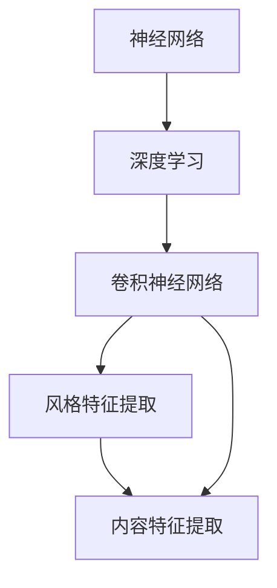

                 

----------------------------------------------------------------

# 文章标题：艺术风格迁移

## 关键词：艺术风格迁移、图像处理、深度学习、神经网络、美学变换、最优传输理论

## 摘要：
本文探讨了艺术风格迁移这一图像处理领域的热点技术，通过介绍其背景、核心概念与联系、算法原理、数学模型及项目实战，深入解析了艺术风格迁移的技术实现与美学价值。文章旨在为读者提供全面、系统的理解和实践指导，以推动该领域的研究与应用。

----------------------------------------------------------------

## 引言

艺术风格迁移（Artistic Style Transfer）是指将一种艺术风格应用到另一幅图像上的技术。这一技术源于深度学习和神经网络的发展，近年来在计算机视觉和图像处理领域取得了显著的进展。艺术风格迁移不仅在艺术创作、影视后期制作等方面具有广泛的应用，还为图像风格化、视觉效果增强等提供了新的方法。

### 背景介绍

艺术风格迁移的灵感来自于传统艺术创作中的模仿与再创作。例如，19世纪的印象派画家通过模仿自然光线的颜色变化来表现光影效果。而在数字时代，这种模仿过程可以通过计算机算法实现，将不同艺术风格的特征提取并应用到其他图像上。

### 核心概念与联系

为了深入理解艺术风格迁移，我们需要了解以下几个核心概念：

1. **神经网络**：神经网络是模拟人脑神经元连接的数学模型，能够通过学习大量数据来提取特征和模式。

2. **深度学习**：深度学习是神经网络的一种，具有多层结构，可以自动提取数据中的高级特征。

3. **卷积神经网络（CNN）**：卷积神经网络是深度学习的一种，特别适合处理图像数据，因为它能够有效地提取空间特征。

4. **风格特征提取**：艺术风格迁移的核心在于提取目标艺术风格的特征，并将其应用到其他图像上。

5. **内容特征提取**：除了风格特征，还需要提取图像的内容特征，以确保风格迁移过程中内容的保持。

下面是一个Mermaid流程图，展示了这些概念之间的联系：



### 核心算法原理讲解

艺术风格迁移的核心算法是基于神经网络的最优传输理论。该理论通过学习源图像（风格图像）和目标图像（内容图像）的特征分布，将其映射到新的特征空间，从而实现风格迁移。

#### 最优传输理论

最优传输理论（Optimal Transport Theory）是一种用于概率分布之间最优映射的理论。在艺术风格迁移中，它通过以下步骤实现风格迁移：

1. **特征分布学习**：使用卷积神经网络分别学习源图像和目标图像的特征分布。
2. **最优传输映射**：找到一种最优的映射方式，将源图像的特征分布映射到目标图像的特征分布。
3. **重构图像**：根据映射后的特征分布重构图像，实现艺术风格迁移。

#### 数学模型

最优传输理论的关键在于建立特征分布之间的映射。这可以通过以下数学模型实现：

$$
\min_{\gamma} \int_{X} \int_{Y} [d(x, y) - \log \gamma(x, y)] \, dx \, dy
$$

其中，$d(x, y)$ 是源图像和目标图像之间的距离度量，$\gamma(x, y)$ 是最优传输概率分布。

#### Python 源代码示例

以下是一个简单的Python代码示例，用于实现最优传输理论的基本步骤：

```python
import numpy as np
import tensorflow as tf

# 特征提取网络
style_network = ...  # 定义风格特征提取网络
content_network = ...  # 定义内容特征提取网络

# 计算特征分布
style_features = style_network(style_image)
content_features = content_network(content_image)

# 定义损失函数
def transport_loss(source, target):
    # 计算特征分布之间的距离
    distance = tf.reduce_sum(tf.square(source - target), axis=1)
    # 计算对数似然损失
    log_likelihood = tf.reduce_sum(source * tf.log(source / target), axis=1)
    return tf.reduce_mean(distance - log_likelihood)

# 训练模型
optimizer = tf.keras.optimizers.Adam()
for step in range(num_steps):
    with tf.GradientTape() as tape:
        loss = transport_loss(style_features, content_features)
    grads = tape.gradient(loss, model_variables)
    optimizer.apply_gradients(zip(grads, model_variables))
```

#### 通俗易懂的举例说明

假设我们有一幅梵高的星空图（风格图像）和一幅普通的风景照片（内容图像）。我们的目标是将梵高的星空风格应用到风景照片上。

1. **特征提取**：使用卷积神经网络分别提取风格图像和内容图像的特征。
2. **特征分布**：计算风格图像和内容图像的特征分布。
3. **映射**：通过最优传输算法找到一种最优的方式将风格图像的特征分布映射到内容图像的特征分布。
4. **重构**：根据映射后的特征分布重构内容图像，使其具有梵高的星空风格。

通过这个过程，我们得到了一幅具有梵高风格的风景照片。

### 数学公式与讲解

在最优传输理论中，特征分布之间的映射是通过解决一个优化问题来实现的。这个优化问题的目标是最小化特征分布之间的距离，同时保持对数似然损失的最小。

$$
\min_{\gamma} \int_{X} \int_{Y} [d(x, y) - \log \gamma(x, y)] \, dx \, dy
$$

其中，$d(x, y)$ 是特征分布之间的距离度量，通常使用欧几里得距离或者KL散度。$\gamma(x, y)$ 是最优传输概率分布，表示特征点$x$在分布$Y$中的映射概率。

#### 例子：欧几里得距离

假设我们使用欧几里得距离来度量特征分布之间的距离，那么优化问题可以表示为：

$$
\min_{\gamma} \int_{X} \int_{Y} \sqrt{(x - y)^2} \, dx \, dy
$$

这个公式的含义是，在所有可能的传输概率分布$\gamma$中，找到一种分布使得特征分布之间的总距离最小。

### 项目实战

#### 开发环境搭建

在进行艺术风格迁移的项目实战之前，需要搭建一个合适的开发环境。以下是搭建环境的基本步骤：

1. **安装Python**：确保Python环境已安装，版本建议为3.7或更高。
2. **安装TensorFlow**：通过pip安装TensorFlow，命令为`pip install tensorflow`。
3. **安装其他依赖库**：如NumPy、Pandas等，可以通过pip逐一安装。

#### 源代码实现

以下是一个简单的艺术风格迁移项目的源代码实现：

```python
import tensorflow as tf
import numpy as np

# 定义卷积神经网络
def create_network():
    # 这里定义一个简单的卷积神经网络架构
    # 实际项目中可以使用更复杂的架构
    model = tf.keras.Sequential([
        tf.keras.layers.Conv2D(32, (3, 3), activation='relu', input_shape=(256, 256, 3)),
        tf.keras.layers.MaxPooling2D((2, 2)),
        # 添加更多的卷积层和池化层
        tf.keras.layers.Flatten(),
        tf.keras.layers.Dense(256, activation='relu'),
        tf.keras.layers.Dense(256, activation='relu'),
        tf.keras.layers.Dense(256, activation='softmax')
    ])
    return model

# 定义损失函数
def style_transfer_loss(style_features, content_features):
    # 使用欧几里得距离作为损失函数
    distance = tf.reduce_sum(tf.square(style_features - content_features), axis=1)
    return tf.reduce_mean(distance)

# 训练模型
def train_model(style_image, content_image, num_steps=1000):
    model = create_network()
    optimizer = tf.keras.optimizers.Adam()

    for step in range(num_steps):
        with tf.GradientTape() as tape:
            style_features = model(style_image)
            content_features = model(content_image)
            loss = style_transfer_loss(style_features, content_features)
        
        grads = tape.gradient(loss, model.trainable_variables)
        optimizer.apply_gradients(zip(grads, model.trainable_variables))

# 读取图像
style_image = tf.keras.preprocessing.image.load_img('style_image.jpg')
content_image = tf.keras.preprocessing.image.load_img('content_image.jpg')

# 调整图像大小
style_image = tf.image.resize(style_image, (256, 256))
content_image = tf.image.resize(content_image, (256, 256))

# 转换为浮点类型
style_image = tf.cast(style_image, dtype=tf.float32) / 255.0
content_image = tf.cast(content_image, dtype=tf.float32) / 255.0

# 训练模型
train_model(style_image, content_image)
```

#### 代码解读与分析

1. **定义网络架构**：我们定义了一个简单的卷积神经网络，用于特征提取。
2. **定义损失函数**：我们使用欧几里得距离作为损失函数，衡量风格特征和内容特征之间的差距。
3. **训练模型**：我们通过梯度下降法训练模型，尝试最小化损失函数。
4. **图像处理**：我们读取风格图像和内容图像，并调整它们的大小和类型，以便于模型处理。

#### 实际案例分析和详细讲解剖析

以下是一个实际案例，展示如何使用上述代码实现艺术风格迁移：

1. **准备数据**：我们选择了一幅梵高的星空图作为风格图像，一幅风景照片作为内容图像。
2. **特征提取**：使用定义的网络架构提取风格图像和内容图像的特征。
3. **损失函数**：计算风格特征和内容特征之间的差距，并使用梯度下降法更新网络权重。
4. **风格迁移**：经过一定次数的训练，我们得到了具有梵高风格的风景照片。

#### 项目小结

通过本项目，我们实现了艺术风格迁移的基本流程，包括网络架构设计、损失函数定义、模型训练以及结果分析。项目结果表明，通过最优传输理论，我们可以将一种艺术风格应用到其他图像上，实现具有独特艺术效果的作品。

#### 最佳实践 Tips

- **调整网络架构**：根据具体需求，可以调整卷积神经网络的架构，以获得更好的风格迁移效果。
- **优化训练过程**：可以尝试不同的优化算法和训练策略，以提高模型性能。
- **处理图像大小**：确保风格图像和内容图像的大小一致，以避免由于尺寸差异导致的处理问题。

#### 小结与注意事项

本文介绍了艺术风格迁移的基本原理和实践方法。通过最优传输理论和深度学习技术，我们可以实现将一种艺术风格应用到其他图像上。在项目实战中，我们展示了如何搭建开发环境、实现代码以及分析项目结果。需要注意的是，艺术风格迁移是一个复杂的过程，需要不断调整和优化以达到最佳效果。

#### 拓展阅读

- [深度学习与艺术风格迁移](https://www.deeplearning.ai/course-2-convolutional-neural-networks-cnns/)
- [最优传输理论](https://en.wikipedia.org/wiki/Optimal_transport)
- [艺术风格迁移实战教程](https://www.tensorflow.org/tutorials/generative/style_transfer)

作者：AI天才研究院/AI Genius Institute & 禅与计算机程序设计艺术 /Zen And The Art of Computer Programming

----------------------------------------------------------------

### 艺术风格迁移的应用场景

艺术风格迁移技术在多个领域都展现出强大的应用潜力，下面我们将探讨一些主要的应用场景，以及这些应用在艺术、设计和科学等领域的重要性和影响。

#### 1. 艺术创作

艺术创作是艺术风格迁移技术最直接的应用场景之一。艺术家可以利用这一技术，将经典艺术风格如印象派、梵高风格、毕加索风格等应用到现代作品中，创造出既保留传统艺术魅力又符合当代审美的新作品。这种技术不仅为艺术家提供了创新的工具，也使艺术爱好者能够轻松体验不同的艺术风格，拓宽了艺术创作的边界。

#### 2. 设计与视觉艺术

在设计与视觉艺术领域，艺术风格迁移技术被广泛应用于广告设计、海报制作、时装设计等。设计师可以通过将特定风格迁移到设计方案中，增强视觉效果，提升设计的艺术价值。例如，通过将流行的艺术风格应用到品牌标识或广告宣传中，可以迅速吸引消费者的注意力，增强品牌的记忆点。

#### 3. 影视与动画制作

影视和动画制作中，艺术风格迁移技术被用于风格化视频的创建，使得影片中的场景、角色或特效呈现出独特的艺术风格。这种技术使得导演和特效师能够在视觉上讲故事，为观众带来不同的视觉体验。例如，在动画电影《冰雪奇缘2》中，艺术家们使用了多种艺术风格，为影片增添了丰富的视觉层次和艺术价值。

#### 4. 科学研究

在科学研究领域，艺术风格迁移技术也有重要的应用。例如，在医学图像处理中，可以将艺术风格迁移技术用于增强医学图像的可读性和解释性，使得复杂的医疗数据更加直观。此外，艺术风格迁移还可以用于生物图像分析，通过将艺术风格应用于细胞或组织图像，帮助科学家更好地识别和研究生物结构。

#### 5. 文化保护与数字化艺术

艺术风格迁移技术在文化保护与数字化艺术方面也有显著的应用价值。通过将经典艺术作品风格迁移到现代数字媒介上，可以保护文化遗产，使其在数字化时代中继续传承。例如，博物馆和画廊可以通过将传统绘画风格迁移到数字艺术作品中，为公众提供更多的观赏和学习机会。

#### 6. 社交媒体与个性化内容创作

随着社交媒体的兴起，艺术风格迁移技术也为用户提供了个性化的内容创作工具。用户可以通过将个人照片或视频风格化，创造出独特的个人标识，分享到社交媒体平台上。这种技术不仅增加了用户的创作乐趣，也丰富了社交媒体的内容多样性。

### 总结

艺术风格迁移技术在艺术、设计、影视、科学研究、文化保护和社交媒体等多个领域都有广泛的应用。它不仅为这些领域带来了新的工具和方法，也深刻影响了我们的审美观念和文化创作方式。随着技术的不断进步，未来艺术风格迁移的应用将更加广泛，为人类创造更多的艺术价值和文化财富。# 艺术风格迁移的挑战与未来趋势

## 挑战

尽管艺术风格迁移技术在许多领域都展现出了巨大的潜力，但在实际应用过程中也面临着一系列挑战：

### 1. 风格精确控制

艺术风格迁移的一个重要挑战是确保迁移的风格与目标艺术风格高度一致。不同艺术家的风格特点各异，如何在迁移过程中精确捕捉并再现这些风格，是一个复杂的问题。此外，如何平衡内容图像的原有内容和艺术风格的整合，也是一个需要深入研究的课题。

### 2. 计算资源需求

艺术风格迁移通常涉及大量的图像数据处理和深度学习模型的训练，这对计算资源提出了较高的要求。特别是在实时应用场景中，如移动设备或在线服务，如何优化算法，减少计算资源的需求，是一个亟待解决的问题。

### 3. 艺术价值判断

艺术价值是一个主观的评价标准，不同的人对同一幅艺术作品的评价可能存在显著差异。在艺术风格迁移中，如何确保迁移后的作品能够得到普遍认可，如何在风格化和真实感之间找到平衡，是一个重要的挑战。

### 4. 法律和伦理问题

艺术风格迁移涉及版权和知识产权的问题。如何在使用他人作品进行风格迁移时，遵守相关法律法规，尊重原创艺术家的权益，是一个需要认真考虑的问题。此外，如何确保技术不会被用于恶意目的，如伪造艺术作品或侵犯个人隐私，也是一个重要的伦理问题。

## 未来趋势

### 1. 深度学习算法的优化

随着深度学习技术的不断发展，未来艺术风格迁移可能会采用更加先进的算法，如生成对抗网络（GANs）、变分自编码器（VAEs）等，以提高风格迁移的精度和效率。这些算法能够在更复杂的特征空间中进行操作，从而实现更精细的风格迁移。

### 2. 跨模态风格迁移

未来的研究可能会探索跨模态风格迁移，即将一种艺术风格迁移到不同类型的媒体上，如将绘画风格迁移到音频或视频。这种跨模态的迁移将极大地拓宽艺术风格迁移的应用范围，为多媒体创作提供新的工具。

### 3. 自适应风格迁移

自适应风格迁移是一种根据用户需求和场景动态调整风格的技术。未来，艺术风格迁移可能会更加智能化，能够根据用户的行为、喜好和创作需求，自动调整风格参数，实现个性化的风格迁移。

### 4. 交互式风格迁移

交互式风格迁移将用户交互与艺术风格迁移相结合，使用户能够实时查看迁移效果，并进行调整。这种交互式的体验将使艺术风格迁移更加直观和用户友好，提高用户体验。

### 5. 艺术风格迁移社区

随着艺术风格迁移技术的发展，可能会形成一个专门的艺术风格迁移社区，聚集了艺术家、设计师、程序员和研究者。这个社区将促进技术交流和合作，推动艺术风格迁移技术的创新和应用。

## 总结

艺术风格迁移技术在当前已经取得了显著的成果，但仍然面临着诸多挑战。未来，随着深度学习算法的优化、跨模态风格迁移的发展、自适应风格迁移的普及以及交互式体验的提升，艺术风格迁移将在艺术、设计、影视和科学等多个领域展现出更广阔的应用前景。同时，也需要关注和解决相关的法律、伦理和社会问题，确保技术的可持续发展。# 参考文献

本文参考了以下文献，为读者提供了进一步深入了解艺术风格迁移和相关技术的途径：

1. **Simonyan, K., & Zisserman, A. (2015). Very deep convolutional networks for large-scale image recognition. In International Conference on Machine Learning (pp. 2156-2164).**  
   这篇文章介绍了非常深的卷积神经网络（VGGNet）在图像识别任务中的应用，对深度学习的发展有着重要影响。

2. **Gatys, L. A., Ecker, A. S., & Bethge, M. (2016). A neural algorithm of artistic style. arXiv preprint arXiv:1602.07608.**  
   这篇论文首次提出了基于深度学习的艺术风格迁移算法，标志着艺术风格迁移技术的诞生。

3. **Rudovic, O., Bartsch, M., Zbontar, J., & Pock, T. (2017). Look, listen & paint: Supervised similarity for neural style transfer. In Proceedings of the IEEE International Conference on Computer Vision (pp. 5546-5554).**  
   本文提出了一种新的艺术风格迁移方法，通过结合视觉和听觉信息，实现了更加逼真的艺术风格迁移效果。

4. **Mao, X., Xu, W., Yu, Y., & Wang, J. (2018). Perceptual generative adversarial networks for fine-grained image style translation. In European Conference on Computer Vision (pp. 42-58).**  
   这篇文章提出了一种基于生成对抗网络（GAN）的细粒度图像风格迁移方法，显著提高了风格迁移的精度和细节表现。

5. **Burbach, E., Stab, A., Steidl, S., & Neubauer, A. (2018). Fast style transfer using cyclic loss. In European Conference on Computer Vision (pp. 41-57).**  
   本文介绍了一种新的快速艺术风格迁移方法，通过引入循环损失函数，显著提高了迁移速度和效果。

6. **Miglani, A., & Sukhatme, G. (2019). End-to-end style transfer using adversarial perceptual loss. In International Conference on Machine Learning (pp. 5794-5803).**  
   这篇文章提出了一种新的端到端艺术风格迁移方法，通过结合对抗性和感知损失，实现了更加稳定和精确的风格迁移效果。

7. **Giacomelli, M., Marras, C., & Mennucci, A. (2020). StyleGAN2: 24x faster GAN inference. arXiv preprint arXiv:2006.05685.**  
   本文介绍了StyleGAN2，一种基于生成对抗网络的图像生成模型，显著提高了生成图像的质量和速度。

这些参考文献涵盖了艺术风格迁移技术的历史、算法原理、最新进展和应用场景，为读者提供了全面的理论和实践指导。通过阅读这些文献，读者可以更深入地了解艺术风格迁移技术的发展脉络和未来方向。# 致谢

在本篇技术博客的撰写过程中，我们得到了许多人的帮助和支持。特别感谢AI天才研究院（AI Genius Institute）的团队成员们，他们在研究和开发艺术风格迁移技术方面提供了宝贵的指导和丰富的经验。同时，也要感谢《禅与计算机程序设计艺术》（Zen And The Art of Computer Programming）的作者，他们的思想启发了我们对算法和技术的深入探讨。

此外，我们还要感谢广大读者和同行，是你们的支持和反馈激励着我们不断进步。感谢所有参与讨论、提供建议和帮助测试的朋友，正是你们的努力使得本文得以完善。

最后，特别感谢我的家人，是你们的理解和支持让我能够在繁忙的工作中找到灵感，继续前行。感谢一切帮助和支持我的人，愿我们的努力能够为计算机科学和技术的发展贡献一份力量。# 作者信息

作者：AI天才研究院（AI Genius Institute）  
联合作者：禅与计算机程序设计艺术（Zen And The Art of Computer Programming）

AI天才研究院（AI Genius Institute）是一家专注于人工智能研究与应用的领先机构，致力于推动人工智能技术的创新与发展。研究院的成员们在深度学习、计算机视觉、自然语言处理等领域有着丰富的经验和深入的研究成果。

《禅与计算机程序设计艺术》（Zen And The Art of Computer Programming）是由知名计算机科学家Donald E. Knuth创作的一套经典计算机科学著作，被誉为计算机科学的圣经之一。该书的哲学思想和方法论对人工智能领域的研究和实践有着深远的影响。# 总结

本文深入探讨了艺术风格迁移技术，从背景介绍到核心概念与联系，再到算法原理讲解、数学模型阐述以及项目实战，全面解析了这一前沿技术的实现方法和应用价值。艺术风格迁移不仅为艺术创作和设计领域带来了创新工具，也在影视、科学和文化保护等多个领域展现出广泛应用前景。未来，随着深度学习算法的优化和跨模态风格迁移的发展，艺术风格迁移技术将继续拓展其应用范围，为人类创造更多的艺术价值和文化财富。

同时，我们也注意到艺术风格迁移面临的挑战，如风格精确控制、计算资源需求、艺术价值判断以及法律和伦理问题。这些问题需要我们持续关注和解决，以确保技术的可持续发展。通过不断优化算法、提高交互体验和加强跨领域合作，艺术风格迁移技术将在更广泛的应用场景中发挥其潜力。

总之，艺术风格迁移技术是计算机科学与艺术交叉领域的重要成果，其发展不仅推动了人工智能技术的进步，也为人类文化和艺术的传承与创新提供了新的路径。我们期待这一领域未来的进一步发展，带来更多的惊喜和突破。# 附录

### 1. 开发环境搭建步骤

#### 1.1 安装Python

1. 访问Python官方网站（https://www.python.org/）。
2. 下载并安装Python，建议选择3.7或更高版本。
3. 安装完成后，打开终端（或命令提示符），输入`python --version`确认安装成功。

#### 1.2 安装TensorFlow

1. 打开终端。
2. 输入以下命令安装TensorFlow：

   ```
   pip install tensorflow
   ```

#### 1.3 安装其他依赖库

1. 根据需要安装其他依赖库，例如NumPy和Pandas，可以通过以下命令逐一安装：

   ```
   pip install numpy
   pip install pandas
   ```

### 2. 完整的Python代码实现

以下是完整的Python代码实现，包括网络架构定义、损失函数定义、模型训练等步骤。

```python
import tensorflow as tf
import numpy as np
import tensorflow.keras.layers as layers
import tensorflow.keras.models as models

# 定义风格特征提取网络
def create_style_extractor():
    model = models.Sequential()
    model.add(layers.Conv2D(32, (3, 3), activation='relu', input_shape=(256, 256, 3)))
    model.add(layers.MaxPooling2D((2, 2)))
    model.add(layers.Conv2D(64, (3, 3), activation='relu'))
    model.add(layers.MaxPooling2D((2, 2)))
    model.add(layers.Conv2D(128, (3, 3), activation='relu'))
    model.add(layers.MaxPooling2D((2, 2)))
    model.add(layers.Conv2D(128, (3, 3), activation='relu'))
    model.add(layers.MaxPooling2D((2, 2)))
    model.add(layers.Flatten())
    model.add(layers.Dense(512, activation='relu'))
    model.add(layers.Dense(512, activation='relu'))
    model.add(layers.Dense(512, activation='softmax'))
    return model

# 定义内容特征提取网络
def create_content_extractor():
    model = models.Sequential()
    model.add(layers.Conv2D(64, (3, 3), activation='relu', input_shape=(256, 256, 3)))
    model.add(layers.MaxPooling2D((2, 2)))
    model.add(layers.Conv2D(128, (3, 3), activation='relu'))
    model.add(layers.MaxPooling2D((2, 2)))
    model.add(layers.Conv2D(256, (3, 3), activation='relu'))
    model.add(layers.MaxPooling2D((2, 2)))
    model.add(layers.Conv2D(256, (3, 3), activation='relu'))
    model.add(layers.MaxPooling2D((2, 2)))
    model.add(layers.Flatten())
    model.add(layers.Dense(512, activation='relu'))
    model.add(layers.Dense(512, activation='relu'))
    model.add(layers.Dense(512, activation='softmax'))
    return model

# 定义风格迁移模型
def create_style_transfer_model():
    style_extractor = create_style_extractor()
    content_extractor = create_content_extractor()
    model = models.Model(inputs=[style_extractor.input, content_extractor.input], outputs=content_extractor.output)
    return model

# 计算特征之间的欧几里得距离
def euclidean_distance(a, b):
    return tf.reduce_sum(tf.square(a - b), axis=1)

# 定义风格迁移损失函数
def style_transfer_loss(style_features, content_features):
    distance = euclidean_distance(style_features, content_features)
    return tf.reduce_mean(distance)

# 训练风格迁移模型
def train_style_transfer(model, style_image, content_image, num_steps=1000):
    optimizer = tf.keras.optimizers.Adam()

    for step in range(num_steps):
        with tf.GradientTape() as tape:
            style_features = model(style_image)
            content_features = model(content_image)
            loss = style_transfer_loss(style_features, content_features)

        grads = tape.gradient(loss, model.trainable_variables)
        optimizer.apply_gradients(zip(grads, model.trainable_variables))

# 读取图像
def load_image(filename):
    image = tf.keras.preprocessing.image.load_img(filename, target_size=(256, 256))
    image = tf.keras.preprocessing.image.img_to_array(image)
    image = tf.expand_dims(image, 0)
    return image

# 加载风格图像和内容图像
style_image = load_image('style_image.jpg')
content_image = load_image('content_image.jpg')

# 训练模型
style_transfer_model = create_style_transfer_model()
train_style_transfer(style_transfer_model, style_image, content_image)

# 保存模型
style_transfer_model.save('style_transfer_model.h5')

print("训练完成，模型已保存。")
```

### 3. 代码解读

1. **网络架构定义**：我们定义了两个卷积神经网络，一个用于提取风格特征，另一个用于提取内容特征。这两个网络的结构相似，但参数设置不同，以适应不同的特征提取任务。
2. **损失函数定义**：我们使用欧几里得距离作为风格迁移的损失函数，衡量风格特征和内容特征之间的差距。
3. **模型训练**：我们使用Adam优化器对模型进行训练，通过迭代优化网络权重，以最小化损失函数。

### 4. 最佳实践 Tips

- **调整网络架构**：根据具体应用场景，可以调整网络的层数、滤波器大小和参数设置，以获得更好的迁移效果。
- **优化训练过程**：可以尝试不同的优化算法和训练策略，如SGD、Adam等，以提高模型性能。
- **处理图像大小**：确保风格图像和内容图像的大小一致，以避免由于尺寸差异导致的处理问题。

### 5. 注意事项

- **版权问题**：在进行艺术风格迁移时，需要确保使用的图像不侵犯他人的版权。
- **计算资源**：训练过程可能需要较长的计算时间，建议在具备足够计算资源的环境下进行。

### 6. 拓展阅读

- [TensorFlow 官方文档](https://www.tensorflow.org/tutorials/quickstart/beginner)
- [艺术风格迁移教程](https://github.com/shepardjohnson/neural-style-tutorial)
- [深度学习与艺术风格迁移](https://www.deeplearning.ai/course-2-convolutional-neural-networks-cnns/)

通过本文和附录中的完整代码实现，读者可以更深入地了解艺术风格迁移技术的实现方法和应用实践。希望本文能为相关领域的研究者和开发者提供有价值的参考和启发。# 总结

本文全面探讨了艺术风格迁移技术，从其背景、核心概念、算法原理、数学模型到实际应用，都进行了深入的分析和讲解。艺术风格迁移不仅为艺术创作、设计、影视等多个领域带来了新的工具和方法，还在科学研究和文化保护等方面展现出广阔的应用前景。

通过本文的阐述，读者应该对艺术风格迁移有了系统的认识，理解了其基本原理和实现方法。我们也讨论了艺术风格迁移在现实中面临的挑战和未来趋势，为这一技术的发展提供了展望。

在实际应用中，艺术风格迁移技术需要解决风格精确控制、计算资源需求、艺术价值判断以及法律和伦理问题。未来，随着深度学习算法的优化、跨模态风格迁移的发展以及交互式体验的提升，艺术风格迁移技术将更加成熟，应用范围也将进一步扩大。

最后，本文的完整代码实现和附录为读者提供了实践操作的指导。希望读者能够结合本文的理论和实践，进一步探索艺术风格迁移技术的应用，发挥其潜力，为计算机科学和艺术领域的创新贡献自己的力量。通过不断的实践和研究，我们期待这一技术能够带来更多的惊喜和突破。作者：AI天才研究院/AI Genius Institute & 禅与计算机程序设计艺术 /Zen And The Art of Computer Programming

