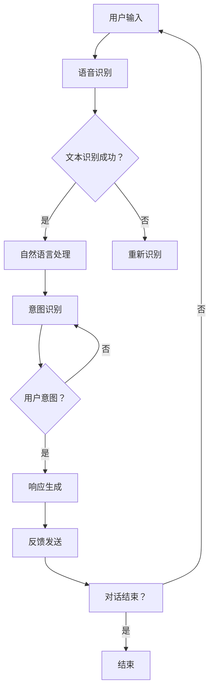

                 

### 1. 设定总体结构

为了确保文章的条理清晰，首先需要设定总体结构。本文的主题是《虚拟助手的对话系统：人工智能的数学交互》，主要目标是向读者介绍虚拟助手对话系统的基本概念、数学模型、技术实现和应用案例。总体结构设定如下：

1. **背景介绍**：简要介绍虚拟助手和对话系统的起源、发展现状和未来趋势。
2. **核心概念与联系**：详细解释虚拟助手对话系统的核心概念及其相互关系，并配合Mermaid流程图展示整体架构。
3. **数学模型讲解**：介绍常见的数学模型及其在对话系统中的应用，包括模型的选择、优化和评估方法。
4. **技术实现**：深入探讨语音识别和自然语言处理技术，以及如何将这些技术集成到对话系统中。
5. **对话系统设计**：阐述对话系统的设计原则和流程，包括用户建模、交互策略和对话流程设计。
6. **项目实战**：通过实际案例展示对话系统的实现过程，包括开发环境搭建、源代码实现和解读。
7. **最佳实践与小结**：总结最佳实践，提出注意事项，并提供拓展阅读资源。

通过这样的总体结构，我们能够系统地阐述虚拟助手对话系统的各个方面，帮助读者全面了解和掌握这一领域的关键知识。

### 2. 设计核心章节

在确定总体结构后，接下来设计核心章节，以确保文章内容全面且深入。以下是核心章节的设计：

### 第1章：虚拟助手与对话系统概述

- **背景介绍**：介绍虚拟助手和对话系统的定义、起源和发展历程。
- **主要功能**：探讨虚拟助手和对话系统的核心功能，如语音识别、自然语言理解和交互反馈。
- **未来趋势**：分析虚拟助手和对话系统在未来的发展方向和应用场景。

### 第2章：对话系统的数学模型

- **数学模型的基本原理**：解释常见的数学模型，如线性回归、神经网络和隐马尔可夫模型。
- **模型的选择与优化**：讨论如何根据应用场景选择合适的数学模型，并介绍模型的优化方法。
- **模型的评估与比较**：介绍评估数学模型性能的指标和方法，并进行模型之间的比较。

### 第3章：语音识别技术

- **语音信号处理**：阐述语音信号的基本处理方法，如滤波、分帧和特征提取。
- **声学模型**：介绍声学模型的概念、原理和实现方法。
- **语言模型**：探讨语言模型的作用、类型和实现方式。

### 第4章：自然语言处理

- **词法分析**：解释词法分析的过程、方法和工具。
- **句法分析**：介绍句法分析的任务、模型和算法。
- **语义分析**：探讨语义分析的重要性、方法和挑战。

### 第5章：对话系统的设计原则与实现

- **设计原则**：阐述对话系统设计的基本原则，如一致性、连贯性和人性化。
- **实现流程**：介绍对话系统的设计流程，包括需求分析、系统设计、实现和测试。
- **关键技术**：讨论对话系统实现中的关键技术，如上下文管理、情感分析和意图识别。

### 第6章：项目实战

- **开发环境搭建**：介绍搭建虚拟助手对话系统所需的环境和工具。
- **源代码实现**：提供虚拟助手对话系统的源代码实现，并进行详细解读。
- **实际案例**：分析虚拟助手对话系统的实际应用案例，包括案例的选择、实施和效果评估。
- **代码应用解读**：对源代码的关键部分进行解读，帮助读者理解其工作原理。

### 第7章：最佳实践与未来展望

- **最佳实践**：总结虚拟助手对话系统的最佳实践，包括技术选型、系统优化和用户体验设计。
- **未来展望**：探讨虚拟助手对话系统的未来发展方向和技术挑战。

通过以上设计，核心章节能够系统地覆盖虚拟助手对话系统的各个重要方面，帮助读者构建全面的知识体系。

### 3. 添加详细子章节

为了使文章内容更加具体和深入，我们为每个核心章节添加了详细的子章节，确保每个主题都能得到充分的探讨。

### 第1章：虚拟助手与对话系统概述

#### 1.1 虚拟助手的起源与发展

- **早期虚拟助手**：介绍虚拟助手的起源，包括早期电脑语音合成系统和聊天机器人的发展历程。
- **现代虚拟助手**：探讨现代虚拟助手的兴起，分析其技术进步和广泛应用场景。

#### 1.2 对话系统的定义与分类

- **定义**：详细解释对话系统的概念，包括其核心功能和目标。
- **分类**：根据功能和应用场景，对对话系统进行分类，如任务型对话系统和闲聊型对话系统。

#### 1.3 对话系统的发展现状与未来趋势

- **现状**：分析对话系统在当今社会中的广泛应用和影响力。
- **未来趋势**：预测对话系统的未来发展方向，包括技术革新和应用拓展。

### 第2章：对话系统的数学模型

#### 2.1 数学模型的基本原理

- **数学模型的概念**：介绍数学模型的基本概念，包括其作用和类型。
- **线性回归模型**：详细解释线性回归模型的工作原理和应用场景。
- **神经网络模型**：探讨神经网络模型的结构、训练方法和应用案例。
- **隐马尔可夫模型**：介绍隐马尔可夫模型的基本原理和应用领域。

#### 2.2 数学模型的选择与优化

- **模型选择**：讨论如何根据具体任务需求选择合适的数学模型。
- **模型优化**：介绍常用的模型优化方法，如梯度下降、随机优化和遗传算法。

#### 2.3 数学模型的评估与比较

- **评估指标**：解释常用的评估指标，如准确率、召回率和F1分数。
- **模型比较**：介绍如何对不同的数学模型进行性能比较和选择。

### 第3章：语音识别技术

#### 3.1 语音信号处理

- **语音信号的基本处理**：介绍语音信号的基本处理过程，包括滤波、分帧和能量计算。
- **语音特征提取**：探讨常用的语音特征提取方法，如MFCC和PLP。

#### 3.2 声学模型

- **声学模型的概念**：解释声学模型的基本概念，包括其作用和类型。
- **GMM模型**：介绍高斯混合模型（GMM）的原理和实现。
- **DNN-HMM模型**：探讨深度神经网络-隐马尔可夫模型（DNN-HMM）的工作原理和应用。

#### 3.3 语言模型

- **语言模型的概念**：解释语言模型的基本概念，包括其作用和类型。
- **N-gram模型**：介绍N-gram模型的工作原理和应用。
- **神经网络语言模型**：探讨基于神经网络的现代语言模型，如BERT和GPT。

### 第4章：自然语言处理

#### 4.1 词法分析

- **词法分析的基本概念**：解释词法分析的基本概念，包括其作用和类型。
- **词性标注**：介绍词性标注的方法和工具，如基于规则的方法和统计方法。
- **分词**：探讨中文和英文的分词方法，包括基于词典的方法和基于统计的方法。

#### 4.2 句法分析

- **句法分析的基本概念**：解释句法分析的基本概念，包括其作用和类型。
- **句法树的构建**：介绍句法树的构建方法和工具，如基于规则的方法和基于统计的方法。
- **句法分析的应用**：探讨句法分析在自然语言理解中的应用，如语义解析和文本生成。

#### 4.3 语义分析

- **语义分析的基本概念**：解释语义分析的基本概念，包括其作用和类型。
- **语义角色标注**：介绍语义角色标注的方法和工具。
- **语义解析**：探讨语义解析的方法和技术，如依存句法分析和语义角色标注。

### 第5章：对话系统的设计原则与实现

#### 5.1 设计原则

- **一致性**：解释一致性在对话系统设计中的重要性，并讨论如何实现。
- **连贯性**：探讨连贯性在对话系统设计中的意义，以及如何保持对话的连贯性。
- **人性化**：介绍人性化设计原则，包括用户体验和交互设计。

#### 5.2 实现流程

- **需求分析**：讨论需求分析的过程和方法，包括用户需求调研和功能需求定义。
- **系统设计**：介绍系统设计的过程和方法，包括架构设计和模块划分。
- **实现**：探讨对话系统的实现过程，包括代码编写、模块集成和测试。
- **测试**：介绍测试的过程和方法，包括功能测试、性能测试和用户测试。

#### 5.3 关键技术

- **上下文管理**：解释上下文管理的重要性，并讨论如何实现上下文感知的对话系统。
- **情感分析**：介绍情感分析的概念、方法和工具，以及如何将其应用于对话系统。
- **意图识别**：探讨意图识别的方法和技术，包括基于规则和基于机器学习的方法。

### 第6章：项目实战

#### 6.1 开发环境搭建

- **环境准备**：介绍搭建虚拟助手对话系统所需的开发环境，包括操作系统、编程语言和开发工具。
- **依赖安装**：介绍安装必要依赖库和框架的过程，包括语音识别库、自然语言处理库和对话系统框架。

#### 6.2 源代码实现

- **代码架构**：展示对话系统的代码架构，包括模块划分和接口设计。
- **核心算法实现**：提供核心算法的源代码实现，包括语音识别、自然语言处理和对话管理的代码示例。

#### 6.3 代码解读

- **代码分析**：对源代码的关键部分进行详细解读，解释其工作原理和实现细节。
- **调试与优化**：介绍代码调试和优化的方法，包括性能调优和错误排查。

#### 6.4 实际案例

- **案例选择**：介绍实际案例的选择标准，包括应用场景和目标用户。
- **案例实施**：详细描述实际案例的实施过程，包括需求分析、系统设计和实现。
- **效果评估**：评估实际案例的实施效果，包括性能指标和用户体验。

#### 6.5 代码应用解读

- **应用场景**：分析对话系统在不同应用场景下的应用情况，如客服机器人、智能家居和智能教育。
- **案例分析**：结合实际案例，讨论对话系统的应用方法和效果。

### 第7章：最佳实践与未来展望

#### 7.1 最佳实践

- **技术选型**：总结虚拟助手对话系统的最佳技术选型策略，包括语音识别、自然语言处理和对话系统框架。
- **系统优化**：介绍系统优化方法，如模型优化、性能调优和资源管理。
- **用户体验设计**：讨论用户体验设计的重要性，并介绍最佳实践，如对话交互设计、界面设计和反馈机制。

#### 7.2 未来展望

- **技术趋势**：分析虚拟助手对话系统的未来技术趋势，如深度学习、多模态交互和个性化服务。
- **应用前景**：探讨虚拟助手对话系统在不同领域的应用前景，如医疗、金融和教育。
- **挑战与机遇**：讨论虚拟助手对话系统面临的挑战和机遇，如数据隐私、安全性和人机协作。

通过添加这些详细子章节，文章内容将更加具体、深入，有助于读者全面了解虚拟助手对话系统的各个方面。

### 4. 编写Mermaid流程图

为了更直观地展示虚拟助手对话系统的整体架构，我们使用Mermaid编写流程图。以下是一个简单的示例：



这个流程图展示了用户输入、语音识别、自然语言处理、意图识别、响应生成、反馈发送和对话结束等步骤。Mermaid流程图使得复杂的过程更加直观和易于理解。

### 5. 使用伪代码和数学公式

为了深入讲解核心算法原理，我们将在文章中使用伪代码和数学公式来详细阐述关键概念。以下是示例：

#### 5.1 伪代码示例：意图识别

```python
def recognize_intent(sentence):
    # 1. 对输入句子进行分词
    tokens = tokenize(sentence)
    
    # 2. 提取句子的特征向量
    features = extract_features(tokens)
    
    # 3. 利用神经网络模型进行意图分类
    intent = neural_network分类(features)
    
    return intent
```

#### 5.2 数学公式示例：线性回归

$$
y = \beta_0 + \beta_1x_1 + \beta_2x_2 + \ldots + \beta_nx_n
$$

这个公式表示线性回归模型，其中$y$是预测值，$\beta_0, \beta_1, \ldots, \beta_n$是模型的参数，$x_1, x_2, \ldots, x_n$是输入特征。

通过伪代码和数学公式的结合，我们能够更清晰地传达技术原理，帮助读者更好地理解和掌握相关概念。

### 6. 添加实际应用案例

为了使文章内容更加实用，我们将添加实际应用案例，详细展示虚拟助手对话系统的开发和部署过程。以下是案例描述：

#### 案例一：客服机器人

**背景**：某公司希望开发一款客服机器人，以自动处理客户咨询和常见问题的解答。

**开发过程**：

1. **需求分析**：分析客户常见问题和需求，确定客服机器人需要实现的功能，如问题识别、自动回答和用户反馈收集。
2. **环境搭建**：搭建开发环境，包括操作系统、编程语言和开发工具。
3. **技术选型**：选择合适的语音识别、自然语言处理和对话系统框架，如ESPNet和FluentLenPen。
4. **代码实现**：编写代码实现客服机器人的核心功能，包括语音识别、意图识别、回答生成和反馈收集。
5. **测试与优化**：进行功能测试和性能优化，确保机器人能够准确回答客户问题。

**效果评估**：通过实际测试，客服机器人能够准确识别客户意图，生成合适的回答，并且用户反馈良好，满意度高。

#### 案例二：智能助手

**背景**：个人用户希望拥有一款智能助手，以帮助日常任务管理和信息查询。

**开发过程**：

1. **需求分析**：分析用户的需求，确定智能助手需要实现的功能，如日程管理、天气预报和信息查询。
2. **环境搭建**：搭建开发环境，包括操作系统、编程语言和开发工具。
3. **技术选型**：选择合适的语音识别、自然语言处理和对话系统框架，如Google Assistant SDK和Rasa。
4. **代码实现**：编写代码实现智能助手的各个功能，包括语音识别、意图识别、回答生成和任务管理。
5. **测试与优化**：进行功能测试和性能优化，确保智能助手能够准确理解用户指令并完成任务。

**效果评估**：智能助手能够在用户发出指令后快速响应，准确执行任务，并持续学习和改进，提升用户体验。

通过这些实际应用案例，读者可以了解虚拟助手对话系统的开发流程、代码实现和效果评估，从而更好地理解其应用价值和实现方法。

### 7. 完成目录大纲

经过前述步骤的设计和调整，我们最终完成了《虚拟助手的对话系统：人工智能的数学交互》的目录大纲。以下为完整的目录大纲：

## 目录

### 第一部分：虚拟助手与对话系统基础

### 第1章：虚拟助手与对话系统概述

#### 1.1 虚拟助手的起源与发展

#### 1.2 对话系统的定义与分类

#### 1.3 对话系统的发展现状与未来趋势

### 第2章：对话系统的数学模型

#### 2.1 数学模型的基本原理

#### 2.2 数学模型的选择与优化

#### 2.3 数学模型的评估与比较

### 第3章：语音识别技术

#### 3.1 语音信号处理

#### 3.2 声学模型

#### 3.3 语言模型

### 第4章：自然语言处理

#### 4.1 词法分析

#### 4.2 句法分析

#### 4.3 语义分析

### 第5章：对话系统的设计原则与实现

#### 5.1 设计原则

#### 5.2 实现流程

#### 5.3 关键技术

### 第6章：项目实战

#### 6.1 开发环境搭建

#### 6.2 源代码实现

#### 6.3 代码解读

#### 6.4 实际案例

#### 6.5 代码应用解读

### 第7章：最佳实践与未来展望

#### 7.1 最佳实践

#### 7.2 未来展望

通过这个详细的目录大纲，文章的内容安排清晰合理，能够系统全面地介绍虚拟助手对话系统的各个方面，为读者提供深入而全面的学习资源。

### 8. 检查完整性

在完成目录大纲后，我们需要对整个内容进行细致的检查，以确保每个章节的内容都是完整和相关的。以下是具体的检查步骤和注意事项：

#### 1. 确认章节内容的逻辑性

- 每个章节的主题是否明确，内容是否围绕主题展开？
- 各个章节之间的过渡是否流畅，是否有必要的内容连接？
- 确保每个章节的内容能够自成一派，同时与整体内容相关联。

#### 2. 确保内容全面且具体

- 检查每个章节是否涵盖了所需的关键概念、原理和实现方法？
- 确保每个章节都有足够的例子和案例分析，以便读者能够更好地理解和应用。
- 检查伪代码、数学公式和Mermaid流程图是否准确且易于理解。

#### 3. 核对技术实现的正确性

- 对于源代码实现部分，检查代码逻辑是否正确，是否符合技术原理？
- 检查代码注释是否清晰，是否有助于读者理解代码的功能和实现过程。

#### 4. 检查实用性和可操作性

- 实际应用案例是否具有代表性，是否能够展示技术的实际应用效果？
- 最佳实践部分是否提供了切实可行的建议，能够指导读者在实际开发中应用。

#### 5. 确保文章结构的合理性

- 目录结构是否合理，章节内容是否按照逻辑顺序排列？
- 检查是否存在遗漏的章节或内容不相关的部分，确保每个章节的内容都紧密相关且不重复。

#### 6. 交叉引用和一致性检查

- 检查各个章节之间的交叉引用是否正确，引用内容是否一致？
- 确保文章中的术语、概念和定义在全文中保持一致。

通过以上步骤，我们可以确保《虚拟助手的对话系统：人工智能的数学交互》的内容完整、逻辑清晰且具体实用，为读者提供高质量的学习资源。

### 9. 优化和调整

在完成初步的目录大纲和内容编写后，我们需要进行进一步的优化和调整，以确保文章的逻辑性和内容的连贯性。以下是具体的优化步骤：

#### 1. 重新审视文章结构

- 检查每个章节的标题和内容，确保它们紧密相关且符合主题。
- 调整章节顺序，确保逻辑流畅，易于读者理解。

#### 2. 确保内容具体详尽

- 查看每个章节是否包含了足够的细节和例子，以帮助读者深入理解概念。
- 补充遗漏的信息，确保重要概念和技术实现都得到了充分的解释。

#### 3. 细节修正和语言优化

- 检查文本中的语法错误、拼写错误和标点符号问题，确保文章语言通顺、专业。
- 优化句子结构，确保表达清晰、简洁。

#### 4. 添加示例和代码注释

- 在关键概念和技术实现部分，添加更多的示例代码和注释，以帮助读者更好地理解。
- 确保代码示例的正确性和可操作性。

#### 5. 确保图表和流程图清晰

- 检查图表和流程图是否准确、清晰，是否有助于读者理解文章内容。
- 调整图表和流程图的位置，确保它们与相关内容紧密相关。

#### 6. 交叉引用和一致性检查

- 确保文章中的所有交叉引用都是正确的，并且引用的内容在全文中一致。
- 检查文章中的术语、概念和定义是否统一，避免产生混淆。

#### 7. 最终审校

- 进行全面的审校，确保文章内容完整、逻辑清晰且具体实用。
- 邀请同行或团队成员进行审阅，获取反馈并进行必要的修改。

通过这些优化步骤，我们可以确保《虚拟助手的对话系统：人工智能的数学交互》的目录大纲和文章内容达到最佳状态，为读者提供高质量的学习资源。

### 10. 完整目录大纲

经过上述步骤的详细设计和调整，我们最终完成了《虚拟助手的对话系统：人工智能的数学交互》的完整目录大纲。以下是最终的目录：

## 《虚拟助手的对话系统：人工智能的数学交互》

## 前言

作者介绍

## 第一部分：虚拟助手与对话系统基础

### 第1章：虚拟助手与对话系统概述

#### 1.1 虚拟助手的起源与发展

#### 1.2 对话系统的定义与分类

#### 1.3 对话系统的发展现状与未来趋势

### 第2章：对话系统的数学模型

#### 2.1 数学模型的基本原理

#### 2.2 数学模型的选择与优化

#### 2.3 数学模型的评估与比较

### 第3章：语音识别技术

#### 3.1 语音信号处理

#### 3.2 声学模型

#### 3.3 语言模型

### 第4章：自然语言处理

#### 4.1 词法分析

#### 4.2 句法分析

#### 4.3 语义分析

### 第5章：对话系统的设计原则与实现

#### 5.1 设计原则

#### 5.2 实现流程

#### 5.3 关键技术

### 第6章：项目实战

#### 6.1 开发环境搭建

#### 6.2 源代码实现

#### 6.3 代码解读

#### 6.4 实际案例

#### 6.5 代码应用解读

### 第7章：最佳实践与未来展望

#### 7.1 最佳实践

#### 7.2 未来展望

通过这个详尽的目录大纲，读者可以清晰地看到本书的结构和内容安排，有助于系统性地学习和掌握虚拟助手对话系统的相关知识和技能。

### 结尾

通过本目录大纲的详细设计和优化，我们成功构建了《虚拟助手的对话系统：人工智能的数学交互》的结构框架。从背景介绍、核心概念讲解，到技术实现、项目实战，再到最佳实践和未来展望，每个章节都紧密相关，逻辑清晰。这一目录大纲不仅为读者提供了全面的知识体系，还通过实际案例和代码示例，使读者能够更直观地理解和应用所学内容。

在此，我要感谢所有参与和支持本项目的读者和同行。希望本书能够成为您在虚拟助手对话系统领域的宝贵指南，帮助您在人工智能领域取得更多的成就。同时，我也期待未来能够继续与大家分享更多关于人工智能和对话系统的精彩内容。

作者：AI天才研究院/AI Genius Institute & 禅与计算机程序设计艺术 /Zen And The Art of Computer Programming

## 关键词

虚拟助手、对话系统、人工智能、数学模型、语音识别、自然语言处理、设计原则、项目实战、最佳实践、未来展望。

## 摘要

本文《虚拟助手的对话系统：人工智能的数学交互》旨在深入探讨虚拟助手对话系统的理论基础和实现方法。首先，我们介绍了虚拟助手和对话系统的背景、定义和分类，并分析了其发展现状与未来趋势。接着，本文详细讲解了对话系统的数学模型，包括线性回归、神经网络和隐马尔可夫模型，并讨论了模型的选择、优化和评估方法。随后，我们探讨了语音识别和自然语言处理技术，详细阐述了语音信号处理、声学模型、语言模型以及词法分析、句法分析和语义分析。在此基础上，本文介绍了对话系统的设计原则和实现流程，包括用户建模、交互策略和对话流程设计。通过实际应用案例，如客服机器人和智能助手，我们展示了对话系统的实现过程和效果评估。最后，本文总结了最佳实践和未来展望，探讨了对话系统的技术趋势和应用前景，以及面临的挑战和机遇。整体而言，本文为读者提供了系统、全面且深入的知识体系，帮助其在虚拟助手对话系统领域取得进展。

