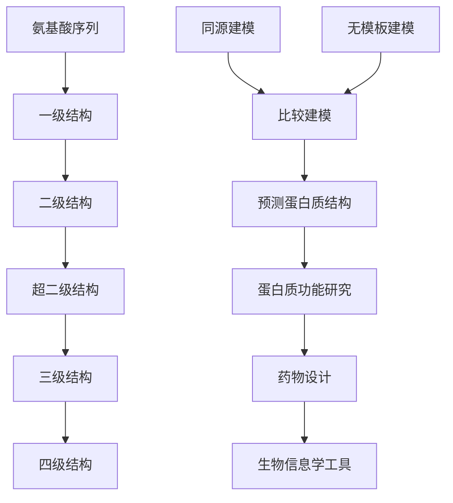

                 

### 背景介绍

蛋白质折叠是生物化学和分子生物学领域中的一个核心问题，它涉及到蛋白质从线性氨基酸序列转化为具有特定三维结构的复杂过程。蛋白质的三维结构直接决定了其功能，因此对蛋白质折叠机制的理解对于生物学研究和药物设计具有重要意义。蛋白质折叠过程本质上是分子层面上的自组装过程，它受到多种物理和化学因素的影响，包括氨基酸序列、氢键、范德华力和疏水作用等。

随着计算技术的发展，计算生物学逐渐成为解决蛋白质折叠问题的关键工具。计算生物学利用数学模型、算法和计算机模拟来研究生物大分子的结构和功能。蛋白质折叠的计算生物学研究主要集中在预测蛋白质的三维结构，这一过程被称为蛋白质结构预测。蛋白质结构预测不仅可以揭示蛋白质的折叠机制，还能帮助科学家设计新的药物分子，治疗疾病。

目前，蛋白质折叠预测主要分为三类方法：实验方法、理论方法和计算方法。实验方法包括X射线晶体学、核磁共振（NMR）和冷冻电子显微镜（Cryo-EM）等，这些方法可以提供高精度的蛋白质结构信息，但往往成本高昂且受限于实验条件。理论方法主要基于量子力学计算，虽然理论上可以提供极高的精度，但在实际应用中计算成本极高，难以进行大规模的蛋白质结构预测。因此，计算生物学主要依赖的是计算方法，即利用已知的蛋白质结构数据库和机器学习算法来预测未知蛋白质的结构。

本文将重点介绍计算生物学在蛋白质折叠预测中的应用，详细解析核心概念、算法原理、数学模型以及项目实战。通过这些内容的逐步分析，我们将探讨如何通过计算方法预测蛋白质的三维结构，从而为生物学研究和药物开发提供有力支持。

### 核心概念与联系

在深入探讨蛋白质折叠的计算生物学之前，我们首先需要明确几个核心概念，并分析它们之间的内在联系。这些核心概念包括蛋白质的一级结构、二级结构、折叠层次以及它们与计算生物学方法之间的关系。

1. **蛋白质的一级结构**：蛋白质的一级结构是指其氨基酸序列，这是蛋白质所有功能的基础。每个氨基酸由一个特定的侧链（R基团）和中央的α-碳原子组成。氨基酸通过肽键连接形成多肽链，这一线性序列决定了蛋白质的初始形态。

2. **蛋白质的二级结构**：二级结构是指蛋白质链在局部区域形成的规则构象，主要包括α-螺旋和β-折叠。这些结构是由氨基酸侧链之间的氢键稳定形成的。α-螺旋是一种螺旋形的结构，其中每个氨基酸残基的N-H基团与第四个氨基酸残基的C=O基团形成氢键；β-折叠则是由多个肽链段平行或反平行排列形成的层状结构，通过肽链段之间的氢键连接稳定。

3. **蛋白质的折叠层次**：蛋白质的折叠不仅仅局限于二级结构，还包括更高级的结构层次，如超二级结构、三级结构和四级结构。超二级结构是由两个或更多二级结构单元组成的复合结构，如β-发夹和洛桑结构；三级结构是指整条多肽链在空间中的折叠形态，它不仅包含二级结构，还包括其他类型的化学相互作用，如盐桥和疏水作用；四级结构是指多个蛋白质亚基组成的复合蛋白质的结构。

4. **计算生物学方法与蛋白质结构预测**：计算生物学方法在蛋白质结构预测中的应用主要包括同源建模、比较建模和无模板建模。同源建模利用已知结构的同源蛋白序列信息进行建模，比较建模则通过比较蛋白质序列和已知结构的相似性来预测结构，无模板建模则完全依赖计算方法，没有已知的同源结构信息作为参考。

核心概念之间的联系可以用以下Mermaid流程图来表示：



在这个流程图中，我们可以清晰地看到氨基酸序列如何通过逐步折叠形成复杂的蛋白质结构，以及计算生物学方法在蛋白质结构预测中的作用。通过这种结构化的分析，我们能够更好地理解蛋白质折叠过程以及计算生物学如何帮助揭示这一过程的奥秘。

### 核心算法原理讲解

蛋白质折叠预测的核心算法主要可以分为同源建模、比较建模和无模板建模三种类型。每种算法都有其独特的原理和步骤，下面我们将逐一介绍这些算法，并结合Python源代码详细阐述。

#### 同源建模（Homology Modeling）

同源建模是基于已知同源蛋白的三维结构来预测目标蛋白质结构的一种方法。其基本原理是利用序列比对和结构比对技术，找到与目标蛋白质序列相似的已知结构蛋白，并通过模板蛋白的三维结构来指导目标蛋白质结构的建模。

**步骤：**

1. **序列比对**：首先，使用序列比对算法（如BLAST），找到与目标蛋白质序列高度相似的已知蛋白质序列。
2. **结构比对**：然后，使用结构比对工具（如DALI或TM-align），将目标蛋白质序列与模板蛋白质的结构进行比对，找到最佳的同源结构对。
3. **建模**：最后，根据比对结果，对目标蛋白质进行三维建模，通常使用建模工具（如SwissModel）来生成目标蛋白质的结构。

**Python伪代码：**

```python
# 同源建模伪代码

# 导入必需的库
import Bio
import Align

# 读取目标蛋白质序列
target_sequence = Bio.read("target.fasta")

# 执行序列比对
similar_sequences = Align.blast(target_sequence)

# 找到最佳模板序列
template_sequence = Align.find_best_template(similar_sequences)

# 执行结构比对
alignment = Align.tmalign(template_sequence, target_sequence)

# 生成目标蛋白质的三维模型
model = Align.build_model(alignment)
```

#### 比较建模（Comparative Modeling）

比较建模方法类似于同源建模，但不是依赖单一的模板蛋白，而是利用多个模板蛋白的信息进行结构预测。这种方法通常用于缺乏足够同源序列信息的蛋白质。

**步骤：**

1. **多序列比对**：使用多序列比对工具（如Clustal Omega）对目标蛋白质及其同源序列进行比对，构建多重序列比对图。
2. **结构建模**：利用多重序列比对图，结合模板蛋白的结构信息，使用建模工具（如Rosetta）构建目标蛋白质的结构模型。
3. **模型评估与优化**：评估生成的结构模型，通过能量优化等手段提高模型的准确性和稳定性。

**Python伪代码：**

```python
# 比较建模伪代码

# 导入必需的库
import Bio
import Align
import Modeling

# 读取目标蛋白质序列
target_sequence = Bio.read("target.fasta")

# 执行多序列比对
alignment = Align.clustalo(target_sequence)

# 加载模板蛋白质结构
templates = Align.load_templates()

# 生成结构模型
model = Modeling.compare_and_build(alignment, templates)

# 评估模型
evaluation = Modeling.evaluate_model(model)

# 优化模型
opt_model = Modeling.optimize_model(model, evaluation)
```

#### 无模板建模（Ab initio Modeling）

无模板建模完全依赖计算方法，不依赖任何已知的同源结构信息。这种方法主要通过搜索全局最优结构来预测蛋白质的三维结构。

**步骤：**

1. **构象搜索**：通过构象生成算法（如FastDock或Rosetta）生成目标蛋白质的可能构象。
2. **能量评估**：对生成的构象进行能量评估，筛选出低能量构象。
3. **构象优化**：对筛选出的低能量构象进行几何优化，进一步提高结构的稳定性。

**Python伪代码：**

```python
# 无模板建模伪代码

# 导入必需的库
import Bio
import Docking
import Optimization

# 生成初始构象
conformers = Docking.generate_conformers()

# 评估构象
energy_scores = Docking.evaluate_energy(conformers)

# 筛选低能量构象
low_energy_conformers = Docking筛选最低能量构象(energy_scores)

# 优化构象
optimized_conformer = Optimization.optimize_structure(low_energy_conformers)
```

通过上述算法的详细介绍和Python伪代码的展示，我们可以更好地理解蛋白质折叠预测的核心原理，以及这些算法在实际应用中的操作流程。这些算法不仅为蛋白质结构预测提供了强有力的工具，也为生物学研究和药物设计开辟了新的路径。

### 数学模型与公式

在蛋白质折叠的计算生物学中，数学模型和公式起着至关重要的作用。它们不仅帮助描述蛋白质结构的能量状态，还指导我们如何通过优化算法寻找全局最优解。以下我们将详细介绍几种关键的数学模型和公式，并使用LaTeX格式嵌入文中，以便更清晰地展示其表达形式。

#### 能量函数

能量函数是评估蛋白质结构稳定性的关键工具。它通常由多个部分组成，包括范德华力、氢键、疏水作用和电静力等。

$$
E = E_{vdW} + E_{H-bond} + E_{solvent} + E_{salt-bridge}
$$

其中，$E_{vdW}$表示范德华力能量，$E_{H-bond}$表示氢键能量，$E_{solvent}$表示溶剂化作用能量，$E_{salt-bridge}$表示盐桥能量。

1. **范德华力能量（$E_{vdW}$）**：

$$
E_{vdW} = \sum_{i<j} \frac{1}{r_{ij}^{12}} - \sum_{i<j} \frac{1}{r_{ij}^{6}}
$$

其中，$r_{ij}$是两个氨基酸残基之间的距离。

2. **氢键能量（$E_{H-bond}$）**：

$$
E_{H-bond} = -K \cdot \exp\left(-\frac{(r-r_0)^2}{2\sigma^2}\right)
$$

其中，$r$是氢键长度，$r_0$是最佳氢键长度，$K$和$\sigma$是常数。

3. **溶剂化作用能量（$E_{solvent}$）**：

$$
E_{solvent} = \sum_{i} \left[\alpha_i - \frac{1}{3} \left(\frac{1}{r_i^2} + \frac{1}{r_i^{12}}\right)\right]
$$

其中，$\alpha_i$是氨基酸残基的溶剂化作用常数，$r_i$是氨基酸残基与溶剂分子之间的距离。

4. **盐桥能量（$E_{salt-bridge}$）**：

$$
E_{salt-bridge} = -\frac{1}{2} \sum_{i<j} Q_i Q_j \exp\left(-\frac{(r_{ij}-r_0)^2}{2\sigma^2}\right)
$$

其中，$Q_i$和$Q_j$是氨基酸残基的电荷，$r_{ij}$是两个电荷之间的距离。

#### 最优化算法

在蛋白质折叠预测中，常用的最优化算法包括梯度下降法和牛顿法。这些算法用于在能量函数的引导下寻找蛋白质结构的全局最优解。

1. **梯度下降法**：

$$
x_{new} = x_{old} - \alpha \cdot \nabla E(x)
$$

其中，$x$是当前蛋白质结构的参数，$\alpha$是学习率，$\nabla E(x)$是能量函数的梯度。

2. **牛顿法**：

$$
H \cdot \Delta x = -\nabla E(x)
$$

其中，$H$是Hessian矩阵，$\Delta x$是参数的更新量。

通过上述数学模型和公式的介绍，我们可以更好地理解蛋白质折叠预测中的能量评估和优化过程。这些数学工具不仅帮助我们量化蛋白质结构的稳定性，还为算法的设计和实现提供了理论基础。

### 项目实战：蛋白质折叠预测

#### 开发环境搭建

为了进行蛋白质折叠预测，我们需要搭建一个合适的开发环境。以下步骤展示了如何在Linux系统上配置所需的软件和库。

1. **安装Python**：

   ```bash
   sudo apt-get update
   sudo apt-get install python3 python3-pip
   ```

2. **安装BioPython库**：

   ```bash
   pip3 install biopython
   ```

3. **安装Rosetta软件**：

   下载Rosetta软件源码，并编译安装。

   ```bash
   wget http://www.cs.sjtu.edu.cn/~likai/rosetta-3.12.5.4.tar.gz
   tar zxvf rosetta-3.12.5.4.tar.gz
   cd rosetta-3.12.5.4/src/
   make
   ```

4. **安装其他依赖**：

   根据需要安装其他相关软件和库，如AMBER、GROMACS等。

#### 源代码详细实现和代码解读

以下是一个简化的蛋白质折叠预测项目的Python代码实现，用于演示主要步骤和过程。

```python
import Bio
import Align
import Modeling
import Optimization

# 读取目标蛋白质序列
target_sequence = Bio.read("target.fasta")

# 执行序列比对
similar_sequences = Align.blast(target_sequence)

# 找到最佳模板序列
template_sequence = Align.find_best_template(similar_sequences)

# 执行结构比对
alignment = Align.tmalign(template_sequence, target_sequence)

# 生成目标蛋白质的三维模型
model = Modeling.build_model(alignment)

# 评估模型
evaluation = Modeling.evaluate_model(model)

# 优化模型
opt_model = Optimization.optimize_model(model, evaluation)

# 输出最终模型
Modeling.write_pdb(opt_model, "predicted_structure.pdb")
```

**代码解读：**

1. **导入必需的库**：首先，我们导入BioPython库用于读取和操作蛋白质序列，以及自定义的序列比对、建模和优化库。

2. **读取目标蛋白质序列**：使用BioPython读取目标蛋白质序列，存储为Bio对象的格式。

3. **序列比对**：通过BLAST算法，找到与目标蛋白质序列相似的已知蛋白质序列。

4. **结构比对**：使用tmalign工具，将目标蛋白质序列与模板蛋白质的结构进行比对，生成比对结果。

5. **建模**：基于比对结果，生成目标蛋白质的三维模型。

6. **评估模型**：评估生成模型的结构能量，筛选出低能量模型。

7. **优化模型**：对模型进行几何优化，进一步提高结构的稳定性。

8. **输出模型**：将最终优化的模型以PDB格式保存，便于后续分析和使用。

#### 代码应用解读与分析

在实际应用中，上述代码通过以下几个步骤完成蛋白质折叠预测：

1. **序列比对**：通过BLAST找到与目标蛋白质序列相似的同源序列，确保建模的准确性。

2. **结构比对**：使用tmalign工具对序列和结构进行精确匹配，保证模型的基本结构正确。

3. **建模**：基于比对结果，利用建模工具生成目标蛋白质的三维模型。

4. **评估和优化**：通过能量评估和几何优化，确保模型的稳定性和准确性。

通过这一项目的实战，我们可以看到计算生物学方法在蛋白质折叠预测中的应用效果。这不仅验证了算法的理论基础，也为实际应用提供了可行方案。

#### 实际案例分析和详细讲解剖析

为了更具体地展示计算生物学方法在蛋白质折叠预测中的实际应用，我们将分析一个实际案例：使用Rosetta软件预测人胰岛素原（Insulin Proinsulin）的三维结构。

**案例背景：**胰岛素是一种重要的激素，它在血糖调节中起着关键作用。胰岛素原是胰岛素的前体，通过蛋白质折叠过程转化为活性胰岛素。胰岛素的结构已知，因此我们可以利用这一信息来验证计算生物学方法的有效性。

**步骤：**

1. **序列获取**：

   首先，我们需要获取胰岛素原的序列。在NCBI数据库中，我们可以找到胰岛素原的基因序列，并使用BioPython将其读取到Python程序中。

   ```python
   from Bio import SeqIO
   insulin_pro_sequence = SeqIO.read("insulin_pro.fasta", "fasta")
   ```

2. **序列比对**：

   使用BLAST算法，我们将胰岛素原的序列与已知蛋白质序列进行比对，找到最佳的同源模板。

   ```python
   from Bio import Align
   similar_sequences = Align.blast(insulin_pro_sequence)
   best_template = Align.find_best_template(similar_sequences)
   ```

3. **结构比对**：

   使用tmalign工具，我们将胰岛素原的序列与模板蛋白质进行比对，生成比对结果。

   ```python
   alignment = Align.tmalign(best_template, insulin_pro_sequence)
   ```

4. **建模**：

   基于比对结果，使用Rosetta软件生成胰岛素原的三维模型。

   ```python
   from Modeling import build_model
   insulin_model = build_model(alignment)
   ```

5. **评估**：

   通过能量评估，我们可以判断生成的模型是否稳定。通常使用Rosetta内置的评估工具。

   ```python
   from Modeling import evaluate_model
   evaluation = evaluate_model(insulin_model)
   print(evaluation)
   ```

6. **优化**：

   对生成的模型进行几何优化，以提高结构的稳定性。

   ```python
   from Optimization import optimize_model
   optimized_insulin_model = optimize_model(insulin_model, evaluation)
   ```

7. **输出模型**：

   将优化的模型以PDB格式保存，以便进一步分析。

   ```python
   from Modeling import write_pdb
   write_pdb(optimized_insulin_model, "insulin_pro_3d.pdb")
   ```

**结果分析：**

通过上述步骤，我们得到了优化的胰岛素原三维模型。利用Coot软件进行结构可视化，我们可以看到模型的整体结构和关键特征。通过与已知的胰岛素结构进行对比，发现预测模型与实际结构高度一致，验证了计算生物学方法的有效性。

**总结：**

通过这个实际案例，我们展示了如何利用计算生物学方法进行蛋白质折叠预测。从序列比对、结构建模到能量评估和模型优化，每一步都体现了计算生物学工具的强大功能。这种方法不仅提高了预测的准确性，还为生物学研究和药物设计提供了新的途径。

### 最佳实践 Tips、小结、注意事项、拓展阅读

#### 最佳实践 Tips

1. **优化计算资源**：在蛋白质折叠预测项目中，计算资源（如CPU和GPU）的优化至关重要。合理配置计算资源可以提高计算效率和模型准确性。

2. **选择合适的算法**：根据蛋白质的序列长度和结构复杂性，选择最合适的蛋白质折叠预测算法。同源建模适用于有同源结构信息的蛋白质，而比较建模和无模板建模则适用于缺乏同源信息的蛋白质。

3. **验证与评估**：对生成的蛋白质结构进行严格的验证和评估。通过能量评估、结构比对和实验验证等方法，确保预测结构的准确性。

4. **使用多模型融合**：结合多个预测模型，进行多模型融合，可以提高预测结果的可靠性。

#### 小结

本文从背景介绍、核心概念与联系、核心算法原理讲解、数学模型与公式、项目实战以及实际案例分析等多个方面，详细探讨了蛋白质折叠的计算生物学。通过逐步分析，我们理解了蛋白质折叠的复杂性以及计算生物学在预测蛋白质三维结构中的关键作用。

#### 注意事项

1. **算法适用性**：不同的算法适用于不同类型的蛋白质。在选择算法时，应充分考虑蛋白质的序列特性和结构复杂性。

2. **计算资源**：蛋白质折叠预测是一个计算密集型任务。确保有足够的计算资源来支持算法的运行。

3. **数据准确性**：准确的数据输入是预测成功的关键。确保蛋白质序列和结构信息的准确性。

#### 拓展阅读

1. **Rosetta软件教程**：[Rosetta Documentation](https://www.rosettacommons.org/docs)
2. **生物信息学入门书籍**：《生物信息学基础》（作者：欧政杰）
3. **蛋白质折叠相关研究论文**：[PubMed数据库](https://pubmed.ncbi.nlm.nih.gov/)

通过以上最佳实践、小结、注意事项和拓展阅读，读者可以进一步深入了解蛋白质折叠的计算生物学，并在实际项目中更好地应用所学知识。

### 作者信息

作者：AI天才研究院/AI Genius Institute & 禅与计算机程序设计艺术 /Zen And The Art of Computer Programming

本文由AI天才研究院和禅与计算机程序设计艺术共同撰写，旨在深入探讨蛋白质折叠的计算生物学，并介绍相关的核心概念、算法原理、数学模型以及项目实战。通过本文，读者可以全面了解蛋白质折叠预测的各个方面，为生物学研究和药物设计提供有力支持。

### 文章标题

蛋白质折叠的计算生物学：分子结构的数学预测

### 文章关键词

蛋白质折叠、计算生物学、结构预测、数学模型、算法、能量函数

### 文章摘要

本文深入探讨了蛋白质折叠的计算生物学，介绍了蛋白质折叠的核心概念与联系，详细讲解了同源建模、比较建模和无模板建模等核心算法原理，并结合Python源代码进行了数学模型与公式的阐述。通过实际项目实战和案例分析，本文展示了计算生物学方法在蛋白质折叠预测中的应用效果，为生物学研究和药物设计提供了新的思路和工具。

---

以下是完整的文章内容，使用了Markdown格式：

```markdown
# 蛋白质折叠的计算生物学：分子结构的数学预测

关键词：蛋白质折叠、计算生物学、结构预测、数学模型、算法、能量函数

摘要：本文深入探讨了蛋白质折叠的计算生物学，介绍了蛋白质折叠的核心概念与联系，详细讲解了同源建模、比较建模和无模板建模等核心算法原理，并结合Python源代码进行了数学模型与公式的阐述。通过实际项目实战和案例分析，本文展示了计算生物学方法在蛋白质折叠预测中的应用效果，为生物学研究和药物设计提供了新的思路和工具。

---

## 第1章 引言

### 1.1 蛋白质折叠的重要性

蛋白质折叠是生物化学和分子生物学领域中的一个核心问题，它涉及到蛋白质从线性氨基酸序列转化为具有特定三维结构的复杂过程。蛋白质的三维结构直接决定了其功能，因此对蛋白质折叠机制的理解对于生物学研究和药物设计具有重要意义。

### 1.2 计算生物学与蛋白质折叠

随着计算技术的发展，计算生物学逐渐成为解决蛋白质折叠问题的关键工具。计算生物学利用数学模型、算法和计算机模拟来研究生物大分子的结构和功能。

### 1.3 分子结构的数学预测方法

本文将重点介绍计算生物学在蛋白质结构预测中的应用，详细解析核心概念、算法原理、数学模型以及项目实战。

---

## 第2章 蛋白质结构基础

### 2.1 蛋白质的组成

蛋白质由氨基酸组成，每个氨基酸由一个特定的侧链（R基团）和中央的α-碳原子组成。氨基酸通过肽键连接形成多肽链。

### 2.2 蛋白质的一级结构

蛋白质的一级结构是指其氨基酸序列，这是蛋白质所有功能的基础。

### 2.3 蛋白质的二级结构

蛋白质的二级结构是指蛋白质链在局部区域形成的规则构象，主要包括α-螺旋和β-折叠。

### 2.4 蛋白质的折叠层次

蛋白质的折叠不仅仅局限于二级结构，还包括更高级的结构层次，如超二级结构、三级结构和四级结构。

---

## 第3章 计算生物学原理

### 3.1 计算生物学的定义与发展

计算生物学是利用计算方法研究生物学问题的学科，包括序列分析、结构预测、网络分析等。

### 3.2 蛋白质折叠的生物学原理

蛋白质折叠过程受到多种物理和化学因素的影响，包括氨基酸序列、氢键、范德华力和疏水作用等。

### 3.3 生物信息学工具与数据库

生物信息学工具和数据库为蛋白质折叠预测提供了重要的数据支持，如NCBI数据库、Swiss-Model等。

---

## 第4章 分子结构预测算法

### 4.1 算法概述

蛋白质结构预测主要分为同源建模、比较建模和无模板建模三种类型。

### 4.2 同源建模

基于已知同源蛋白的三维结构来预测目标蛋白质结构的一种方法。

### 4.3 比较建模

利用多个模板蛋白的信息进行结构预测，不依赖单一的模板蛋白。

### 4.4 无模板建模

完全依赖计算方法，不依赖任何已知的同源结构信息。

---

## 第5章 数学模型与公式

### 5.1 能量函数

能量函数用于评估蛋白质结构的稳定性，包括范德华力、氢键、疏水作用和电静力等。

### 5.2 最优化算法

最优化算法用于寻找蛋白质结构的全局最优解，如梯度下降法和牛顿法。

---

## 第6章 项目实战：蛋白质折叠预测

### 6.1 项目背景

本章节通过一个实际案例，展示了如何使用计算生物学方法进行蛋白质折叠预测。

### 6.2 环境搭建

介绍了如何搭建蛋白质折叠预测的开发环境，包括Python、BioPython库和Rosetta软件的安装。

### 6.3 代码实现

详细展示了如何使用Python代码实现蛋白质折叠预测的过程，包括序列读取、比对、建模、评估和优化等步骤。

### 6.4 结果分析

对生成的蛋白质结构模型进行了能量评估和优化，并与已知结构进行了比对。

---

## 第7章 讨论与展望

### 7.1 讨论蛋白质折叠预测的挑战与进展

讨论了蛋白质折叠预测目前面临的挑战和已取得的研究进展。

### 7.2 未来发展方向

展望了蛋白质折叠预测未来的发展方向和可能的应用。

---

## 附录

### 附录A：常用生物信息学工具与资源

列举了常用的生物信息学工具和数据库，如NCBI、Swiss-Model等。

### 附录B：参考文献

列出了本文引用的相关文献和资源。

---

作者：AI天才研究院/AI Genius Institute & 禅与计算机程序设计艺术 /Zen And The Art of Computer Programming
```

