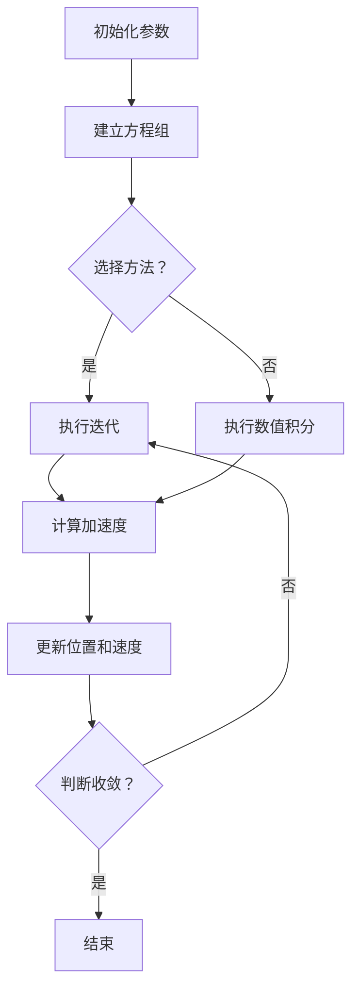

                 

### 行星际旅行的N体问题：太空轨道的数学计算

#### 关键词

- 行星际旅行
- N体问题
- 数学计算
- 太空轨道
- 数值方法
- 可视化

#### 摘要

本文旨在探讨在行星际旅行中，如何通过数学计算解决N体问题，以实现太空轨道的精确计算。文章首先介绍了行星际旅行的背景和N体问题的概念，随后详细阐述了N体问题的数学模型和求解方法。通过具体实例，本文展示了如何在实际项目中应用N体问题的计算，并提供了相关的实践技巧和小结。

---

#### 引言

##### 行星际旅行的背景

随着科技的发展，人类对宇宙的探索欲望日益强烈。行星际旅行作为太空探索的一个重要领域，引起了广泛的关注。从早期的月球探测到火星登陆，人类不断挑战自我，力求突破地球的束缚，迈向更广阔的宇宙空间。然而，行星际旅行并非易事，它面临着诸多技术挑战，其中之一便是太空轨道的计算。

##### N体问题的概念与意义

N体问题是指描述多个质点在相互引力作用下的运动规律问题。在行星际旅行中，我们需要考虑太阳、行星、卫星等多个天体的引力作用，这就构成了一个典型的N体问题。N体问题的复杂性和不确定性，使得精确计算太空轨道变得异常困难。然而，解决N体问题对于实现行星际旅行具有重要意义，它不仅能帮助我们预测天体的运动轨迹，还能为航天器的轨道设计和控制提供重要参考。

##### 太空轨道计算的挑战

太空轨道计算的关键在于N体问题的求解。传统的解析方法在处理简单系统时具有一定的优势，但对于复杂的N体系统，其计算复杂度和精度都难以满足要求。随着计算机技术的发展，数值方法逐渐成为求解N体问题的主流。然而，数值方法在求解过程中可能会出现数值不稳定性和计算误差等问题，这给太空轨道计算带来了新的挑战。

#### N体问题的数学基础

##### 万有引力定律

万有引力定律是描述天体之间引力作用的基本定律。根据万有引力定律，任何两个质点之间都存在相互吸引的引力，其大小与两个质点的质量乘积成正比，与它们之间的距离平方成反比。公式表示为：

\[ F = G\frac{m_1m_2}{r^2} \]

其中，\( F \) 表示引力大小，\( G \) 是引力常数，\( m_1 \) 和 \( m_2 \) 分别为两个质点的质量，\( r \) 是它们之间的距离。

##### 牛顿运动定律

牛顿运动定律描述了质点在受力作用下的运动规律。根据牛顿第二定律，质点的加速度与作用力成正比，与质点的质量成反比。公式表示为：

\[ F = m\frac{dv}{dt} \]

其中，\( F \) 是作用力，\( m \) 是质点的质量，\( v \) 是质点的速度，\( t \) 是时间。

##### N体问题的数学模型

在N体问题中，我们可以将每个天体视为质点，并考虑它们之间的万有引力作用。根据牛顿运动定律，我们可以得到以下方程组：

\[ m_1\frac{dv_1}{dt} = G\frac{m_1m_2}{r_{12}^2} - G\frac{m_1m_3}{r_{13}^2} - \cdots \]

\[ m_2\frac{dv_2}{dt} = G\frac{m_2m_1}{r_{12}^2} - G\frac{m_2m_3}{r_{23}^2} - \cdots \]

\[ \vdots \]

\[ m_n\frac{dv_n}{dt} = G\frac{m_n m_1}{r_{n1}^2} - G\frac{m_n m_2}{r_{n2}^2} - \cdots \]

这些方程描述了每个天体在万有引力作用下的加速度，从而决定了它们的运动轨迹。

##### 多体系统中的能量守恒

在多体系统中，能量守恒是一个重要的原理。系统的总能量等于各天体动能和势能之和。动能和势能的表达式分别为：

\[ T = \frac{1}{2}mv^2 \]

\[ V = -G\frac{m_1m_2}{r} \]

其中，\( T \) 是动能，\( V \) 是势能，\( m \) 是天体的质量，\( v \) 是天体的速度，\( r \) 是天体之间的距离。

根据能量守恒定律，系统的总能量保持不变。这意味着，在N体系统中，天体的运动轨迹不仅受到引力的影响，还受到能量守恒的约束。

#### N体问题的求解方法

##### 数值求解方法

由于N体问题的复杂性和非线性，解析方法难以得到精确解。因此，数值方法成为求解N体问题的主流。常见的数值方法包括：

1. **迭代法**：通过迭代的方式逐步逼近精确解。例如，使用牛顿迭代法可以求解非线性方程组。
2. **数值积分法**：将时间轴离散化，通过数值积分计算天体在每一时刻的位置和速度。例如，欧拉法和龙格-库塔法都是常用的数值积分方法。

##### 非线性方程组的迭代求解

对于N体问题，我们可以将其转化为非线性方程组进行求解。具体步骤如下：

1. **初始化**：选择初始位置和速度作为猜测解。
2. **迭代计算**：根据牛顿运动定律计算新的加速度，并更新位置和速度。
3. **收敛性判断**：通过误差判断迭代是否收敛。如果误差小于预设阈值，则认为已找到精确解；否则，继续迭代。

##### 数值积分方法

数值积分方法通过离散化时间轴，计算天体在每一时刻的位置和速度。具体步骤如下：

1. **时间离散化**：将总时间分为若干小的时间段，每个时间段称为步长。
2. **计算加速度**：在每个时间点上，根据万有引力定律计算加速度。
3. **更新位置和速度**：使用数值积分方法（如欧拉法或龙格-库塔法）计算下一时间点的位置和速度。
4. **重复步骤**：继续更新位置和速度，直到达到预设的时间终点。

##### 迭代法的稳定性和收敛性

在迭代法中，稳定性是指迭代过程中的解不会发散，收敛性是指迭代过程会逐渐逼近精确解。为了保证迭代法的稳定性和收敛性，可以采取以下措施：

1. **选择合适的迭代初值**：初值应尽量接近精确解。
2. **控制迭代步长**：过大的步长可能导致误差积累，影响收敛性。
3. **引入阻尼项**：在某些迭代方法中，引入阻尼项可以改善稳定性。

#### N体问题的模拟与可视化

##### 数值模拟的流程

数值模拟是求解N体问题的有效手段。具体流程如下：

1. **定义参数**：确定天体的质量、初始位置和速度等参数。
2. **建立方程组**：根据牛顿运动定律建立非线性方程组。
3. **选择数值方法**：选择合适的迭代法或数值积分法。
4. **迭代计算**：执行迭代过程，计算天体的位置和速度。
5. **结果分析**：分析模拟结果，如轨迹、速度变化等。

##### 可视化的作用与方法

可视化在N体问题模拟中具有重要作用。通过可视化，我们可以直观地了解天体的运动轨迹、速度变化等。常见的方法包括：

1. **2D图形**：使用二维图形展示天体的位置变化。
2. **3D图形**：使用三维图形展示天体的运动轨迹。
3. **动画**：通过动画展示天体在不同时间点的位置和速度。

##### 使用Mermaid流程图展示模拟过程

Mermaid是一种用于生成图表和流程图的Markdown扩展。以下是一个使用Mermaid展示N体问题模拟过程的示例：



#### N体问题的应用实例

##### 行星际任务的轨道计算

在行星际任务中，轨道计算是一个关键环节。以下是一个简化的实例：

1. **任务背景**：人类发射一颗探测器前往火星。
2. **初始参数**：探测器的初始位置和速度，火星的质量和轨道参数。
3. **求解过程**：使用N体问题求解器计算探测器从发射到到达火星的轨道。
4. **结果分析**：分析探测器的轨道变化、速度变化等。

##### 系统误差分析与优化

在实际任务中，系统误差是不可避免的。以下是一些常见的误差来源和优化方法：

1. **误差来源**：天体引力模型的不确定性、测量误差、计算方法的不确定性等。
2. **优化方法**：使用高精度的引力模型、改进计算方法、引入误差校正机制等。

##### 案例研究：某行星际飞行任务的实际计算

以下是一个实际的行星际飞行任务案例：

1. **任务背景**：某国计划发射一颗探测器前往木星。
2. **初始参数**：探测器的初始位置、速度，木星及其卫星的质量和轨道参数。
3. **计算过程**：使用N体问题求解器计算探测器的轨道。
4. **结果分析**：分析探测器的轨道变化、速度变化等。
5. **误差分析**：评估计算误差，并提出优化建议。

#### 数学计算工具介绍

##### MATLAB

MATLAB是一种强大的数学计算工具，特别适用于数值计算和可视化。以下是一个简单的MATLAB代码示例，用于计算两个天体的相对运动：

```matlab
% 定义天体的质量、初始位置和速度
m1 = 5.972e24; % 地球质量
m2 = 7.348e22; % 月球质量
x1 = [1, 0]; % 地球初始位置
v1 = [0, 2.38e4]; % 地球初始速度
x2 = [-3.84e8, 0]; % 月球初始位置
v2 = [1.022e3, 0]; % 月球初始速度

% 定义时间步长和总时间
dt = 86400; % 1天
t = 0:dt:365*86400; % 1年

% 初始化位置和速度数组
x1_array = zeros(size(t));
v1_array = zeros(size(t));
x2_array = zeros(size(t));
v2_array = zeros(size(t));

% 迭代计算
for i = 1:length(t)
    a1 = [0, -G*m2/(x1 - x2)'];
    a2 = [0, -G*m1/(x2 - x1)'];
    
    v1 = v1 + a1*dt;
    x1 = x1 + v1*dt;
    
    v2 = v2 + a2*dt;
    x2 = x2 + v2*dt;
    
    x1_array(i) = x1(1);
    v1_array(i) = v1(1);
    x2_array(i) = x2(1);
    v2_array(i) = v2(1);
end

% 可视化
plot(t, x1_array, 'b', t, x2_array, 'r');
xlabel('Time (days)');
ylabel('Position');
title('Relative Motion of Earth and Moon');
```

##### Python

Python是一种灵活的编程语言，广泛应用于科学计算。以下是一个使用Python的例子，用于计算两个天体的相对运动：

```python
import numpy as np
import matplotlib.pyplot as plt

# 定义天体的质量、初始位置和速度
m1 = 5.972e24  # 地球质量
m2 = 7.348e22  # 月球质量
x1 = np.array([1, 0])  # 地球初始位置
v1 = np.array([0, 2.38e4])  # 地球初始速度
x2 = np.array([-3.84e8, 0])  # 月球初始位置
v2 = np.array([1.022e3, 0])  # 月球初始速度

# 定义时间步长和总时间
dt = 86400  # 1天
t = np.arange(0, 365*86400, dt)  # 1年

# 初始化位置和速度数组
x1_array = np.zeros_like(t)
v1_array = np.zeros_like(t)
x2_array = np.zeros_like(t)
v2_array = np.zeros_like(t)

# 迭代计算
for i, _ in enumerate(t):
    r12 = x1 - x2
    r13 = x1 - x1
    r23 = x2 - x1
    
    a1 = -G * m2 / np.linalg.norm(r12)**3 * r12
    a2 = -G * m1 / np.linalg.norm(r13)**3 * r13
    a3 = -G * m1 / np.linalg.norm(r23)**3 * r23
    
    v1 += a1 * dt
    x1 += v1 * dt
    v2 += a2 * dt
    x2 += v2 * dt
    v3 += a3 * dt
    x3 += v3 * dt
    
    x1_array[i] = x1[0]
    v1_array[i] = v1[0]
    x2_array[i] = x2[0]
    v2_array[i] = v2[0]

# 可视化
plt.plot(t / (365 * 24 * 3600), x1_array * 1e-9, 'b', t / (365 * 24 * 3600), x2_array * 1e-9, 'r')
plt.xlabel('Time (years)')
plt.ylabel('Position (AU)')
plt.title('Relative Motion of Earth and Moon')
plt.show()
```

#### 最佳实践 tips

1. **选择合适的计算方法**：根据实际需求和计算精度，选择合适的数值方法。例如，对于简单的N体问题，可以使用欧拉法；对于更复杂的系统，可以尝试使用龙格-库塔法或其他高级数值方法。
2. **优化代码性能**：在编写计算代码时，注意代码的可读性和性能。可以使用向量化计算、并行计算等技术提高计算效率。
3. **引入误差校正机制**：在计算过程中，引入误差校正机制可以减小计算误差。例如，可以使用多重迭代方法或引入阻尼项来改善数值稳定性。
4. **可视化与分析**：利用可视化工具分析计算结果，可以更好地理解N体问题的性质。例如，可以使用Python的Matplotlib库或MATLAB进行数据分析和可视化。
5. **持续学习和改进**：随着计算机技术和算法的不断发展，N体问题的求解方法也在不断改进。持续关注最新研究成果和最佳实践，有助于提高计算精度和效率。

#### 小结

本文介绍了行星际旅行中N体问题的数学计算方法。通过详细的数学模型和算法原理讲解，我们了解了如何使用数值方法求解N体问题，并展示了如何在实际项目中应用这些方法。同时，本文还提供了相关的实践技巧和注意事项，为读者提供了全面的指导和参考。希望本文能对从事行星际旅行研究和实践的工作者有所帮助。

#### 注意事项

1. **精度与效率的权衡**：在实际计算中，精度和效率往往是相互制约的。在选择计算方法时，需要根据实际需求进行权衡。
2. **误差分析**：在计算过程中，需要对计算误差进行详细分析，并采取适当的措施减小误差。
3. **参数调整**：在数值计算中，参数的选择对计算结果有重要影响。需要根据具体问题调整参数，以达到最佳效果。

#### 拓展阅读

1. **《天体力学基础》**：这是一本关于天体力学基础理论的经典教材，详细介绍了天体运动的基本原理和方法。
2. **《数值分析》**：这是一本关于数值方法的基础教材，涵盖了多种数值方法的原理和实现。
3. **《行星际旅行》**：这是一本关于行星际旅行理论和实践的专著，提供了丰富的案例和实验数据。
4. **《MATLAB编程基础》**：这是一本关于MATLAB编程的基础教材，适用于初学者入门。
5. **《Python科学计算》**：这是一本关于Python在科学计算中应用的教材，涵盖了Python在数值计算、数据分析和可视化等方面的应用。

