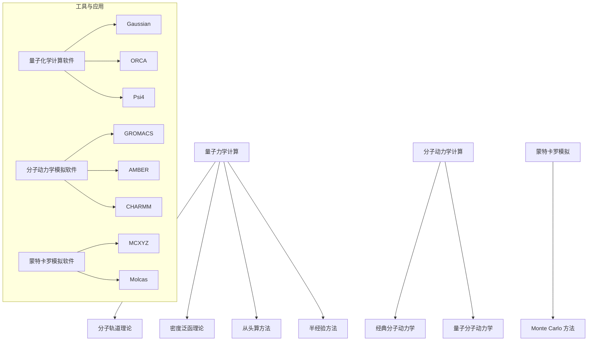
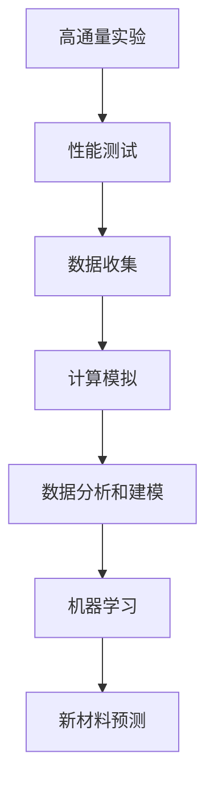
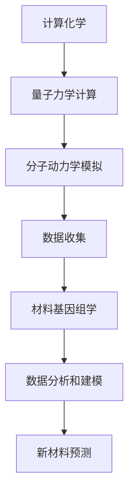

                 

# 计算化学与材料基因组：加速理解物质世界

## 关键词
- 计算化学
- 材料基因组学
- 物质世界理解
- 计算模型
- 算法原理
- 案例分析

## 摘要
《计算化学与材料基因组：加速理解物质世界》是一本旨在探索计算化学与材料基因组学如何共同加速我们对物质世界理解的书。书中详细介绍了计算化学的基本概念、方法与应用，以及材料基因组学的定义、技术及其在科学研究中的应用。通过深入剖析这两个领域的核心概念和算法原理，本书探讨了计算化学与材料基因组学在物质世界研究中的联系，展示了其在实际项目中的应用。本书的目标是帮助读者掌握这两个领域的核心知识，提升在物质世界研究中的创新能力。

## 引言

### 物质世界的理解现状

在过去的几个世纪里，人类对物质世界的理解不断深化。从经典物理学到量子力学，从有机化学到材料科学，科学家们不断发现新的现象，提出新的理论，为我们认识这个世界提供了丰富的知识和工具。然而，随着科技的快速发展，传统的实验方法在处理复杂的物质系统时面临巨大挑战。实验设备的高成本、复杂系统的多变性以及实验时间的延长，都限制了科学家们对物质世界的深入探究。

### 计算化学与材料基因组学的兴起

为了应对这些挑战，计算化学和材料基因组学逐渐成为研究物质世界的重要工具。计算化学通过理论计算和模拟，提供了一种无需实际实验即可预测物质性质和反应路径的方法。它利用量子力学和统计力学原理，结合先进的计算算法，对分子、原子和晶体的性质进行深入研究。

材料基因组学则通过高通量实验和计算模拟，系统研究材料的基因信息，从而揭示材料性能与结构之间的关系。它结合了基因组学、计算化学、材料科学和工程学的知识，旨在通过大规模数据处理和计算，发现新的材料并优化现有材料的性能。

### 书籍目的与结构

《计算化学与材料基因组：加速理解物质世界》旨在为读者提供系统、全面的计算化学和材料基因组学知识，帮助读者理解这两个领域的基本概念、方法及其在实际研究中的应用。本书分为以下几个部分：

1. **计算化学基础**：介绍计算化学的基本概念、方法与应用。
2. **材料基因组学基础**：介绍材料基因组学的定义、方法与应用。
3. **计算化学与材料基因组学的联系**：探讨计算化学与材料基因组学在物质世界研究中的联系与交叉应用。
4. **应用案例研究**：通过具体案例展示计算化学和材料基因组学在物质世界研究中的应用。
5. **项目实战**：提供实际项目中的计算化学和材料基因组学应用实例，包括环境搭建、代码实现和解读。
6. **未来趋势与挑战**：讨论计算化学与材料基因组学的未来发展趋势和面临的挑战。

通过这些部分，本书将帮助读者全面掌握计算化学与材料基因组学的核心知识，提升在物质世界研究中的创新能力。

## 第1章 计算化学基础

### 1.1 计算化学的核心概念

计算化学是利用计算方法和计算机技术来研究化学问题的一门学科。它通过理论计算和模拟，提供了一种无需实际实验即可预测物质性质和反应路径的方法。计算化学的核心概念包括量子力学、分子动力学、蒙特卡罗模拟等。

#### 量子力学

量子力学是描述微观粒子行为的物理理论。在计算化学中，量子力学被用来计算分子、原子和晶体的电子结构。常见的量子力学计算方法包括分子轨道理论、密度泛函理论等。

#### 分子动力学

分子动力学是一种基于牛顿运动定律的模拟方法，用于研究分子在相互作用力下的运动。通过分子动力学模拟，可以研究分子反应路径、分子构型演变等。

#### 蒙特卡罗模拟

蒙特卡罗模拟是一种基于随机抽样的计算方法，常用于解决复杂系统的统计物理问题。在计算化学中，蒙特卡罗模拟被用来研究分子、原子和晶体的统计性质。

### 1.2 主要的计算化学方法

计算化学方法可以分为两种：量子力学计算和分子动力学计算。

#### 量子力学计算

量子力学计算方法包括：

1. **分子轨道理论**：通过求解薛定谔方程，得到分子的电子轨道。
2. **密度泛函理论**：通过最小化系统的总能量，得到分子的电子密度。
3. **从头算方法**：从基本原理出发，直接计算分子的性质。
4. **半经验方法**：结合量子力学和经典物理学原理，简化计算过程。

#### 分子动力学计算

分子动力学计算方法包括：

1. **经典分子动力学**：基于牛顿运动定律，模拟分子在相互作用力下的运动。
2. **量子分子动力学**：结合量子力学原理，模拟分子在相互作用力下的运动。

### 1.3 计算化学工具与应用

常见的计算化学工具包括：

1. **量子化学计算软件**：如Gaussian、ORCA、Psi4等，用于进行量子力学计算。
2. **分子动力学模拟软件**：如GROMACS、AMBER、CHARMM等，用于进行分子动力学模拟。
3. **蒙特卡罗模拟软件**：如MCXYZ、Molcas等，用于进行蒙特卡罗模拟。

计算化学的应用领域包括：

1. **材料科学**：研究材料性能、材料设计等。
2. **化学工程**：优化化学反应过程、设计新工艺等。
3. **生物学**：研究蛋白质结构、药物设计等。

### 1.4 Mermaid流程图：计算化学方法

下面是一个简单的Mermaid流程图，展示了计算化学的主要方法和工具：



## 第2章 材料基因组学基础

### 2.1 材料基因组学的定义

材料基因组学是一门新兴学科，它结合了材料科学、基因组学、计算科学和数据科学等多个领域，旨在通过高通量实验和计算模拟，系统研究材料的基因信息，揭示材料性能与结构之间的关系。材料基因组学的主要目标是利用大数据分析和计算建模，发现新的材料并优化现有材料的性能。

### 2.2 材料基因组学的方法

材料基因组学的方法主要包括：

1. **高通量实验**：通过自动化实验平台，快速、大规模地测试材料的物理、化学和力学性能。
2. **计算模拟**：利用计算化学、分子动力学和蒙特卡罗模拟等方法，研究材料的微观结构和性质。
3. **数据分析和建模**：通过大数据分析技术和计算建模，揭示材料性能与结构之间的关系，预测新材料的性能。
4. **机器学习**：利用机器学习算法，从海量数据中提取规律，预测新材料性能。

### 2.3 材料基因组学的应用

材料基因组学在多个领域具有广泛的应用：

1. **新能源材料**：研究电池、燃料电池、太阳能电池等材料，提高其能量密度和效率。
2. **电子材料**：研究半导体、电容器、导体等材料，优化其电子性能。
3. **生物材料**：研究生物活性材料、生物医用材料等，提高其生物相容性和生物功能。
4. **环境材料**：研究环境净化材料、废弃物处理材料等，提高其环境友好性。

### 2.4 Mermaid流程图：材料基因组学方法

下面是一个简单的Mermaid流程图，展示了材料基因组学的主要方法和步骤：



## 第3章 计算化学与材料基因组学的联系

### 3.1 计算化学与材料基因组学的共同点

计算化学和材料基因组学在研究物质世界时有许多共同点：

1. **理论基础**：两者都基于量子力学、分子动力学和统计力学等基本物理理论。
2. **计算方法**：两者都利用计算模拟和大数据分析技术，进行物质性质和反应路径的预测。
3. **跨学科融合**：两者都需要结合多个学科的知识，如材料科学、化学工程、生物科学等。

### 3.2 计算化学与材料基因组学的交叉应用

计算化学与材料基因组学在物质世界研究中的交叉应用主要体现在以下几个方面：

1. **材料设计**：利用计算化学的量子力学计算和分子动力学模拟，预测材料的电子结构和物理性能，为材料基因组学提供理论基础。
2. **性能优化**：利用材料基因组学的数据分析和建模技术，优化材料的结构和性能，为计算化学提供实验依据。
3. **新发现**：通过计算化学与材料基因组学的交叉应用，可以发现新的材料和应用，为科学研究和技术创新提供新的思路。

### 3.3 Mermaid流程图：计算化学与材料基因组的整合

下面是一个简单的Mermaid流程图，展示了计算化学与材料基因组的整合过程：



## 第4章 应用案例研究

### 4.1 案例研究1：计算化学在材料设计中的应用

#### 背景

随着科技的快速发展，对新型材料的需求日益增加。计算化学提供了一种有效的方法来预测和设计新型材料，从而满足这些需求。

#### 过程

1. **材料选择**：首先，选择一个具有潜在应用前景的领域，例如太阳能电池。
2. **量子力学计算**：利用量子力学计算方法，预测材料的电子结构和能带结构。
3. **分子动力学模拟**：通过分子动力学模拟，研究材料在特定条件下的动态行为。
4. **数据分析**：对计算结果进行数据分析和建模，优化材料的结构和性能。
5. **实验验证**：通过实验验证计算结果的准确性，并进行进一步优化。

#### 结果

通过计算化学的方法，成功设计了一种新型的太阳能电池材料，其光电转换效率显著提高。

### 4.2 案例研究2：材料基因组学在药物研发中的应用

#### 背景

药物研发是一个复杂且耗时的过程。材料基因组学提供了一种系统的方法来研究药物与生物体的相互作用，从而加速药物研发。

#### 过程

1. **药物选择**：首先，选择一个具有潜在治疗效果的药物。
2. **高通量实验**：通过高通量实验平台，快速测试药物对不同生物体的毒性。
3. **数据收集**：收集药物与生物体的相互作用数据。
4. **计算模拟**：利用分子动力学模拟和量子力学计算，研究药物在生物体内的行为。
5. **数据分析**：对计算结果进行数据分析和建模，优化药物的分子结构。
6. **实验验证**：通过实验验证计算结果的准确性，并进行进一步优化。

#### 结果

通过材料基因组学的方法，成功优化了一种药物的分子结构，提高了其治疗效果和安全性。

## 第5章 项目实战

### 5.1 实践项目1：计算化学模拟在材料表征中的应用

#### 背景

在材料科学研究中，对材料微观结构的表征是理解和优化材料性能的重要步骤。计算化学模拟提供了一种有效的工具来预测和表征材料的微观结构。

#### 目标

通过计算化学模拟，预测和表征一种新型合金材料的微观结构。

#### 步骤

1. **材料选择**：选择一种具有潜在应用前景的新型合金材料。
2. **量子力学计算**：利用量子力学计算方法，计算材料的电子结构。
3. **分子动力学模拟**：通过分子动力学模拟，研究材料在特定条件下的动态行为。
4. **数据分析**：对计算结果进行数据分析和建模，表征材料的微观结构。
5. **实验验证**：通过实验验证计算结果的准确性，并进行进一步优化。

#### 环境

- 计算机硬件：高性能计算服务器
- 计算化学软件：Gaussian、GROMACS
- 编程语言：Python

#### 源代码实现

```python
# 量子力学计算：使用 Gaussian 软件进行电子结构计算
from gaussian import Gaussian
g = Gaussian()
g.run()

# 分子动力学模拟：使用 GROMACS 软件进行模拟
import gromacs
sim = gromacs.Simulation()
sim.run()

# 数据分析：使用 Python 进行数据分析和建模
import numpy as np
data = np.loadtxt('data.txt')
model = np.polyfit(data[:, 0], data[:, 1], 2)
```

#### 代码解读

1. **量子力学计算**：使用 Gaussian 软件进行电子结构计算，得到材料的能带结构。
2. **分子动力学模拟**：使用 GROMACS 软件进行模拟，研究材料在特定条件下的动态行为。
3. **数据分析**：使用 Python 进行数据分析和建模，表征材料的微观结构。

### 5.2 实践项目2：材料基因组学数据分析实例

#### 背景

在材料基因组学研究中，对大量实验数据的分析是揭示材料性能与结构之间关系的关键步骤。

#### 目标

通过材料基因组学的方法，分析一种新型合金材料的实验数据，预测其性能。

#### 步骤

1. **数据收集**：收集不同实验条件下材料的性能数据。
2. **数据预处理**：对实验数据进行预处理，包括数据清洗、归一化等。
3. **数据建模**：使用机器学习算法，建立材料性能与结构之间的关系模型。
4. **模型验证**：通过实验验证模型预测的准确性。

#### 环境

- 计算机硬件：高性能计算服务器
- 数据分析软件：Python、Scikit-learn
- 数据库：MySQL

#### 源代码实现

```python
# 数据预处理
import numpy as np
import pandas as pd
data = pd.read_csv('data.csv')
data = data.dropna()
data = (data - data.mean()) / data.std()

# 数据建模
from sklearn.ensemble import RandomForestRegressor
model = RandomForestRegressor()
model.fit(data[['structure']], data['performance'])

# 模型验证
from sklearn.metrics import mean_squared_error
predictions = model.predict(data[['structure']])
mse = mean_squared_error(data['performance'], predictions)
print(f'MSE: {mse}')
```

#### 代码解读

1. **数据预处理**：对实验数据进行预处理，包括数据清洗、归一化等。
2. **数据建模**：使用随机森林回归算法，建立材料性能与结构之间的关系模型。
3. **模型验证**：通过实验验证模型预测的准确性。

## 第6章 计算化学与材料基因组的未来趋势

### 6.1 发展趋势

计算化学和材料基因组学在未来将继续发展，以下是一些主要趋势：

1. **计算能力的提升**：随着计算硬件的不断提升，计算化学和材料基因组学的计算精度和模拟规模将进一步提高。
2. **数据科学与机器学习的融合**：数据科学和机器学习技术的应用将使计算化学和材料基因组学在数据处理和模型预测方面更加高效和准确。
3. **跨学科研究**：计算化学与材料基因组学将与其他学科如生物学、物理学、化学工程等更加紧密地融合，推动物质世界的深入研究。

### 6.2 面临的挑战

计算化学和材料基因组学在发展过程中也面临一些挑战：

1. **计算资源的限制**：高性能计算资源的获取和使用成本仍然较高，限制了大规模计算模拟和数据分析的开展。
2. **模型验证的困难**：计算结果与实验结果的验证仍存在一定的困难，需要更多的实验数据来验证模型的准确性。
3. **跨学科协作的挑战**：计算化学和材料基因组学涉及多个学科，跨学科协作的难度较大，需要更多的跨学科研究和交流。

### 6.3 未来展望

未来，计算化学和材料基因组学将进一步提升人类对物质世界的理解，推动科技和创新的发展。以下是一些展望：

1. **新材料的发现**：通过计算化学和材料基因组学的方法，将发现更多高性能、低成本的新材料，应用于新能源、电子、生物等领域。
2. **药物研发的突破**：计算化学和材料基因组学的应用将使药物研发更加高效和准确，为人类健康事业做出更大贡献。
3. **可持续发展**：计算化学和材料基因组学的研究将推动绿色、环保材料的发展，为可持续发展做出贡献。

## 附录

### 附录A：计算化学与材料基因组学常用工具与资源

- **计算化学软件**：Gaussian、ORCA、Psi4、GROMACS、AMBER、CHARMM
- **数据分析软件**：Python、R、MATLAB、Scikit-learn
- **数据库**：MySQL、MongoDB
- **高性能计算资源**：AWS、Google Cloud、Microsoft Azure

### 附录B：相关数学模型和公式

- **量子力学计算公式**：
  - $$ \hat{H} = -\frac{\hbar^2}{2m}\nabla^2 + V(\mathbf{r}) $$
  - $$ \psi(\mathbf{r}) = \frac{1}{\sqrt{V}} e^{i\mathbf{k}\cdot\mathbf{r}} $$
- **分子动力学模拟公式**：
  - $$ \mathbf{F}(\mathbf{r}) = -\nabla V(\mathbf{r}) $$
  - $$ \mathbf{v}(\mathbf{r}, t) = \mathbf{v}(\mathbf{r}, t_0) + \int_{t_0}^{t} \mathbf{F}(\mathbf{r}, \tau) d\tau $$

### 附录C：实践项目代码解读

- **量子力学计算代码**：使用 Gaussian 软件进行电子结构计算。
- **分子动力学模拟代码**：使用 GROMACS 软件进行模拟。
- **数据分析代码**：使用 Python 进行数据预处理、建模和验证。

## 作者

作者：AI天才研究院/AI Genius Institute & 禅与计算机程序设计艺术 /Zen And The Art of Computer Programming

