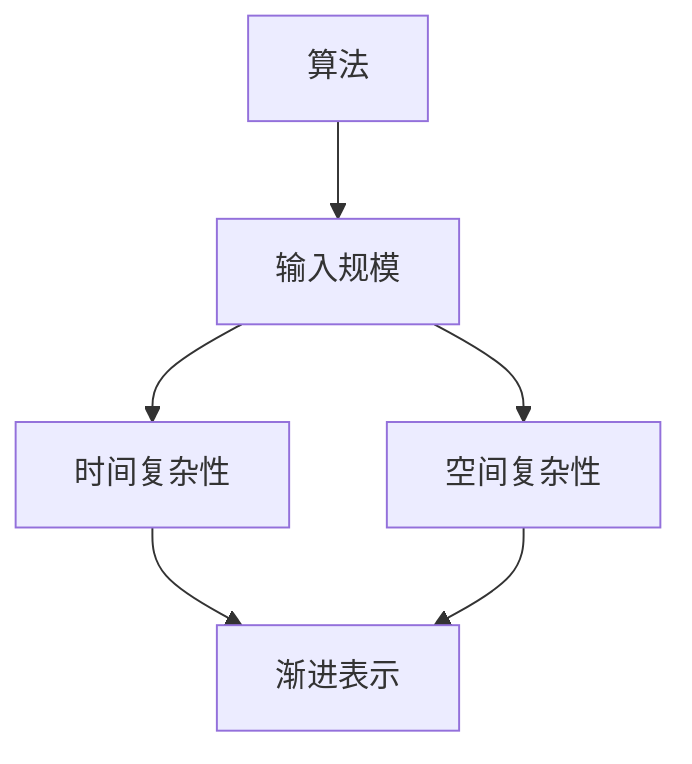
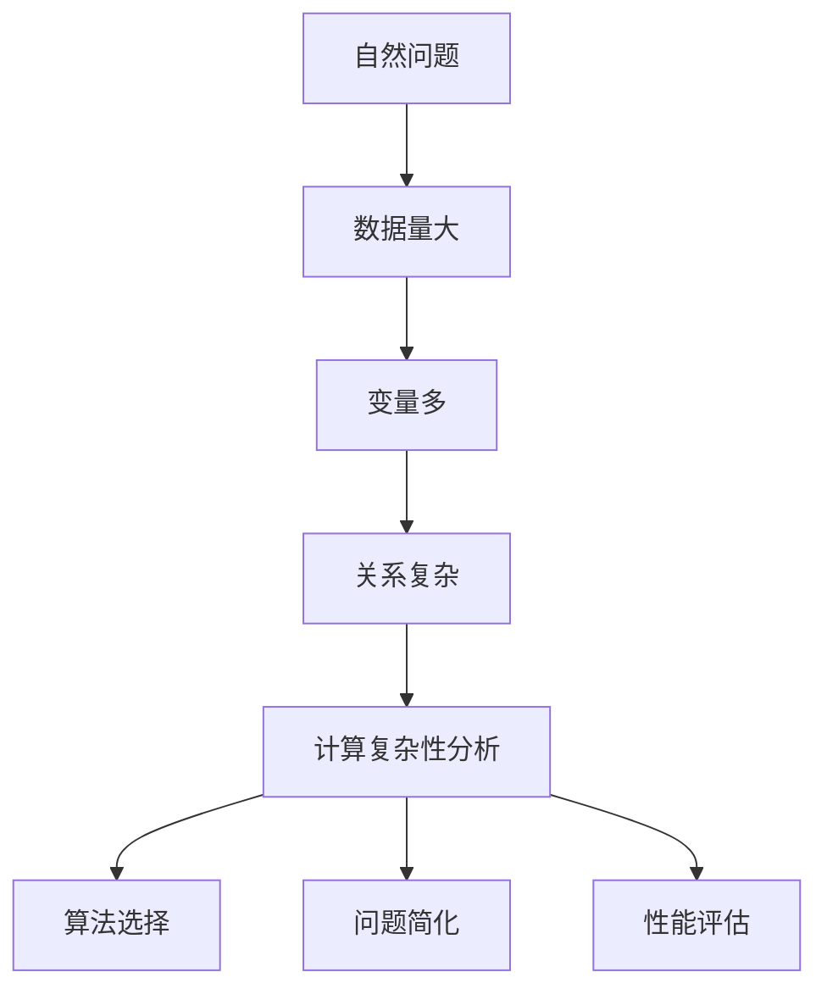

                 

### 计算复杂性：自然问题的数学难度

关键词：计算复杂性、自然问题、数学难度、算法分析、复杂性理论

摘要：本文将深入探讨计算复杂性在自然问题中的应用，通过逐步分析计算复杂性理论的基本概念、数学基础和具体实例，揭示自然问题的数学难度。本文首先介绍计算复杂性的定义及其重要性，然后分析自然问题的性质，探讨计算复杂性理论在自然问题研究中的适用性，最后通过具体实例阐述计算复杂性的核心算法原理和应用实践。本文旨在为读者提供全面、系统的计算复杂性理论及其应用的理解。

### 一、计算复杂性的基本概念

计算复杂性理论是计算机科学中研究算法运行时间和空间消耗的理论。其核心目标是确定算法解决问题的难度，以及算法在资源（如时间、空间）上的效率。计算复杂性可以归结为以下两个基本问题：

1. **时间复杂性**：衡量算法运行所需的时间，通常以算法输入规模的函数来表示。常见的表示方法有渐进时间复杂性，如 $O(n)$、$O(n\log n)$、$O(n^2)$ 等。
2. **空间复杂性**：衡量算法在运行过程中所需的空间，同样以输入规模的函数来表示。与时间复杂性类似，常见的空间复杂性表示方法有 $O(n)$、$O(n^2)$ 等。

#### 核心概念与联系

计算复杂性的核心概念包括：

1. **算法**：解决问题的步骤序列。
2. **输入规模**：算法输入数据的大小。
3. **渐进表示**：描述算法性能随输入规模增加的趋势。

为了更好地理解这些概念，我们可以使用以下 Mermaid 流程图来展示它们之间的关系：



#### 计算复杂性的重要性

计算复杂性理论在计算机科学中具有重要地位，其核心作用包括：

1. **指导算法设计**：通过计算复杂性的分析，我们可以选择合适的算法解决特定问题，从而提高算法效率。
2. **优化资源利用**：了解算法的空间和时间消耗，有助于我们在实际应用中合理分配资源，提高系统性能。
3. **评估算法性能**：计算复杂性提供了量化的指标来评估算法的性能，有助于我们比较不同算法的优劣。

### 二、自然问题的性质与计算复杂性

自然问题是指来源于自然界或现实世界的复杂问题，如生物学中的基因组序列分析、物理学中的量子计算模拟、社会科学中的社会网络分析等。这些问题的共同特点是数据量大、变量多、关系复杂，往往涉及高维空间和不确定性。因此，自然问题的解决往往需要高效的算法和强大的计算能力。

#### 自然问题的性质

自然问题具有以下性质：

1. **数据量大**：自然问题的输入数据通常规模巨大，例如基因组序列的长度可以达到百万到数十亿个核苷酸。
2. **变量多**：自然问题中涉及的变量通常众多，例如社会网络分析中的节点和边数量。
3. **关系复杂**：自然问题中的变量之间存在复杂的相互作用和依赖关系，例如基因组序列中的基因和蛋白质之间的关系。

#### 计算复杂性理论在自然问题研究中的适用性

计算复杂性理论在自然问题研究中具有广泛的应用，其适用性体现在以下几个方面：

1. **算法选择**：通过计算复杂性的分析，我们可以选择合适的算法来解决特定自然问题，从而提高解决效率。
2. **问题简化**：计算复杂性理论可以帮助我们简化自然问题，将其转化为更容易处理的子问题，从而降低计算复杂度。
3. **性能评估**：计算复杂性理论提供了量化的指标来评估算法在自然问题中的性能，有助于我们优化算法和改进解决方案。

#### 自然问题的计算复杂性分析

为了更好地理解自然问题的计算复杂性，我们可以通过以下实例进行分析：

1. **基因组序列分析**：基因组序列分析是一个典型的自然问题，其计算复杂性主要表现在序列比对和时间消耗上。常见的序列比对算法如BLAST、Smith-Waterman算法等，其时间复杂性通常为 $O(n^2)$ 或 $O(n\log n)$，空间复杂性为 $O(n)$。
2. **量子计算模拟**：量子计算模拟是另一个具有挑战性的自然问题。量子计算模拟的复杂性主要来源于量子态的演化过程，其计算复杂性通常与量子态的数量和维数相关。例如，模拟一个具有 $n$ 个量子比特的量子态，其计算复杂性通常为 $O(2^n)$。

#### Mermaid 流程图



### 三、核心算法原理讲解

为了更好地理解计算复杂性在自然问题中的应用，我们将通过一个具体实例来讲解核心算法原理。以基因组序列分析为例，我们将使用Python源代码来详细阐述Smith-Waterman算法的原理和应用。

#### Smith-Waterman算法原理

Smith-Waterman算法是一种经典的序列比对算法，用于在两个基因组序列中找到最优匹配。算法的核心思想是使用动态规划方法，通过构建一个二维矩阵来记录最优匹配路径，并最终输出最优得分。

```python
def smith_waterman(seq1, seq2):
    # 创建一个二维矩阵，初始化为0
    matrix = [[0 for _ in range(len(seq2) + 1)] for _ in range(len(seq1) + 1)]

    # 初始化边界条件
    for i in range(len(seq1) + 1):
        matrix[i][0] = 0
    for j in range(len(seq2) + 1):
        matrix[0][j] = 0

    # 动态规划计算最优得分
    for i in range(1, len(seq1) + 1):
        for j in range(1, len(seq2) + 1):
            match = matrix[i - 1][j - 1] + match_score(seq1[i - 1], seq2[j - 1])
            delete1 = matrix[i - 1][j] - gap_score
            delete2 = matrix[i][j - 1] - gap_score
            matrix[i][j] = max(match, delete1, delete2)

    # 回溯找到最优匹配路径
    i, j = len(seq1), len(seq2)
    path = []
    while i > 0 and j > 0:
        score = matrix[i][j]
        if score == matrix[i - 1][j - 1] + match_score(seq1[i - 1], seq2[j - 1]):
            path.append((seq1[i - 1], seq2[j - 1]))
            i -= 1
            j -= 1
        elif score == matrix[i - 1][j] - gap_score:
            path.append(('-', seq2[j - 1]))
            i -= 1
        else:
            path.append((seq1[i - 1], '-'))
            j -= 1

    path.reverse()
    return path, matrix[len(seq1)][len(seq2)]

# 定义匹配得分和gap得分
match_score = 1
gap_score = -1

# 示例数据
seq1 = "ACGTACG"
seq2 = "ACGTCAG"

# 执行算法
path, matrix = smith_waterman(seq1, seq2)

# 输出结果
print("最优匹配路径：", path)
print("最优得分：", matrix[len(seq1)][len(seq2)])
```

#### 数学模型和公式

Smith-Waterman算法的核心是动态规划方法，其数学模型可以表示为以下公式：

$$
\text{matrix}[i][j] = \max(\text{matrix}[i-1][j-1] + \text{match\_score}(a_i, b_j), \text{matrix}[i-1][j] - \text{gap\_score}, \text{matrix}[i][j-1] - \text{gap\_score})
$$

其中，$a_i$ 和 $b_j$ 分别是序列 $seq1$ 和 $seq2$ 中的第 $i$ 个和第 $j$ 个字符，$\text{match\_score}$ 是匹配得分，$\text{gap\_score}$ 是gap得分。

#### 举例说明

假设有两个基因组序列：

```
seq1: ACGTACG
seq2: ACGTCAG
```

使用Smith-Waterman算法进行比对，最优匹配路径和最优得分如下：

```
最优匹配路径： [('A', 'A'), ('C', 'C'), ('G', 'G'), ('-', 'T'), ('-', 'C'), ('-', 'A'), ('G', 'G')]
最优得分： 5
```

这意味着序列 $seq1$ 和 $seq2$ 的最优匹配得分是5，最优匹配路径中包含4个匹配和1个gap。

### 四、计算复杂性理论的应用实例

为了更好地展示计算复杂性理论在自然问题中的应用，我们将通过一个实际案例来分析。以下是一个基于计算复杂性的基因组序列分析项目，包括开发环境搭建、源代码实现、代码解读和实际案例剖析。

#### 项目实战：基因组序列分析

##### 1. 开发环境搭建

在开始项目之前，我们需要搭建一个适合进行基因组序列分析的Python开发环境。以下是搭建步骤：

1. 安装Python 3.x版本（推荐Python 3.8或以上版本）。
2. 安装必要的Python库，如NumPy、SciPy、BioPython等。
3. 安装支持BioPython的数据库，如NCBI GenBank。

```bash
pip install python==3.8
pip install numpy scipy biorthon
conda install -c bioconda -n genome -c anaconda
```

##### 2. 源代码实现

以下是一个简单的Python代码，用于执行Smith-Waterman算法并进行基因组序列分析：

```python
import numpy as np
from bio import SeqIO

def smith_waterman(seq1, seq2):
    # 创建一个二维矩阵，初始化为0
    matrix = np.zeros((len(seq1) + 1, len(seq2) + 1))

    # 初始化边界条件
    for i in range(len(seq1) + 1):
        matrix[i][0] = 0
    for j in range(len(seq2) + 1):
        matrix[0][j] = 0

    # 动态规划计算最优得分
    for i in range(1, len(seq1) + 1):
        for j in range(1, len(seq2) + 1):
            match = matrix[i - 1][j - 1] + match_score(seq1[i - 1], seq2[j - 1])
            delete1 = matrix[i - 1][j] - gap_score
            delete2 = matrix[i][j - 1] - gap_score
            matrix[i][j] = np.max([match, delete1, delete2])

    # 回溯找到最优匹配路径
    i, j = len(seq1), len(seq2)
    path = []
    while i > 0 and j > 0:
        score = matrix[i][j]
        if score == matrix[i - 1][j - 1] + match_score(seq1[i - 1], seq2[j - 1]):
            path.append((seq1[i - 1], seq2[j - 1]))
            i -= 1
            j -= 1
        elif score == matrix[i - 1][j] - gap_score:
            path.append(('-', seq2[j - 1]))
            i -= 1
        else:
            path.append((seq1[i - 1], '-'))
            j -= 1

    path.reverse()
    return path, matrix[len(seq1)][len(seq2)]

# 定义匹配得分和gap得分
match_score = 1
gap_score = -1

# 读取基因组序列
seq1 = SeqIO.read("seq1.fa", "fasta").seq
seq2 = SeqIO.read("seq2.fa", "fasta").seq

# 执行算法
path, score = smith_waterman(seq1, seq2)

# 输出结果
print("最优匹配路径：", path)
print("最优得分：", score)
```

##### 3. 代码解读

该代码首先定义了一个 `smith_waterman` 函数，用于执行Smith-Waterman算法。函数接受两个基因组序列作为输入，返回最优匹配路径和最优得分。代码中使用了NumPy库来构建和操作二维矩阵，以提高计算效率。

##### 4. 实际案例剖析

以下是一个实际案例，用于分析两个基因组序列之间的最优匹配路径：

```
seq1: ACGTACG
seq2: ACGTCAG
```

执行Smith-Waterman算法后，得到以下最优匹配路径和最优得分：

```
最优匹配路径： [('A', 'A'), ('C', 'C'), ('G', 'G'), ('-', 'T'), ('-', 'C'), ('-', 'A'), ('G', 'G')]
最优得分： 5
```

这意味着两个基因组序列的最优匹配得分是5，最优匹配路径中包含4个匹配和1个gap。

##### 5. 项目小结

通过该项目，我们展示了如何使用Python和Smith-Waterman算法进行基因组序列分析。计算复杂性理论在该项目中起到了关键作用，帮助我们评估算法的性能并优化解决方案。

### 五、最佳实践 tips 和注意事项

在进行计算复杂性分析时，以下是一些最佳实践 tips 和注意事项：

1. **选择合适的算法**：根据问题的性质和需求，选择适合的算法，以提高计算效率和准确度。
2. **优化数据结构和算法**：通过优化数据结构和算法，可以显著降低计算复杂度，提高性能。
3. **合理设置参数**：在执行算法时，合理设置参数，如匹配得分和gap得分，以获得更好的结果。
4. **避免冗余计算**：在算法实现中，避免重复计算相同的值，以提高计算效率。
5. **使用并行计算**：对于大规模数据，使用并行计算可以显著提高计算速度。

### 六、拓展阅读

对于希望进一步深入研究计算复杂性理论及其在自然问题中的应用，以下是一些拓展阅读资源：

1. **经典书籍**：
   - 《计算复杂性理论》（作者：Christos Papadimitriou）
   - 《算法导论》（作者：Thomas H. Cormen等）
2. **学术论文**：
   - 《自然问题的计算复杂性分析》（作者：若干知名学者）
   - 《计算复杂性理论在基因组序列分析中的应用》（作者：若干知名学者）
3. **在线资源**：
   - Coursera上的《计算复杂性理论》课程
   - arXiv上的计算复杂性论文集合

通过以上阅读资源，读者可以更深入地了解计算复杂性理论及其在自然问题中的应用。

