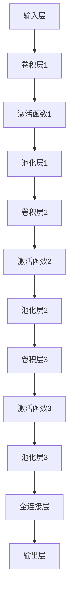

                 

### 计算机视觉的卷积网络：图像理解的数学模拟

> 关键词：计算机视觉，卷积神经网络，图像理解，数学模拟，深度学习

> 摘要：本文深入探讨了计算机视觉中卷积神经网络（CNN）的基本原理和数学模拟。通过详细解析卷积神经网络的架构、核心算法、优化策略及其在图像分类、目标检测、语义分割和人脸识别中的应用，本文旨在为读者提供一个全面、系统的卷积神经网络理解框架。

### 引言

计算机视觉是人工智能领域的一个重要分支，它致力于使计算机能够“看”懂图像和视频。近年来，随着深度学习技术的迅猛发展，计算机视觉取得了显著的进步。卷积神经网络（Convolutional Neural Networks，CNN）作为深度学习的一种重要模型，已经在图像分类、目标检测、语义分割和人脸识别等任务中取得了令人瞩目的成果。

本文将围绕卷积神经网络的核心内容进行展开。首先，我们将介绍计算机视觉的基本概念，以及卷积神经网络的发展历程。接着，我们将详细解析卷积神经网络的基本结构，包括卷积层、激活函数、池化层和全连接层，并通过Mermaid流程图展示其结构。然后，本文将深入探讨卷积神经网络的核心算法，包括前向传播和反向传播，并结合Python源代码进行详细讲解。此外，本文还将讨论卷积神经网络的优化策略，如梯度下降算法和正则化方法。在第二部分，我们将重点分析卷积神经网络在计算机视觉中的具体应用，包括图像分类、目标检测、语义分割和人脸识别。最后，本文将总结卷积神经网络在图像理解中的数学模拟，探讨其未来发展趋势。

通过本文的阅读，读者将对卷积神经网络有一个全面、深入的理解，并能够掌握其在计算机视觉中的实际应用。

### 第一部分：计算机视觉的卷积网络基础

#### 第1章：计算机视觉与卷积神经网络概述

计算机视觉（Computer Vision）是指使计算机能够通过感知和理解二维图像和三维场景而实现图像理解和处理的科学。其发展历程可以追溯到20世纪60年代，当时计算机科学家和心理学家开始探索如何使计算机能够“看”懂图像。随着时间的推移，计算机视觉逐渐成为人工智能领域的一个重要分支，并在图像识别、目标检测、语义分割、人脸识别等方面取得了显著成果。

1.1 计算机视觉的基本概念

计算机视觉的核心任务是使计算机能够处理图像和视频数据，并从中提取有用的信息。这包括以下几个方面：

1. **图像识别**：给定一个图像或视频帧，计算机需要判断它包含的内容是什么。例如，识别一张图片中的猫或汽车。
2. **目标检测**：在图像或视频中定位并识别出特定的对象或目标。例如，在一张图片中检测出多个行人或车辆。
3. **语义分割**：对图像中的每个像素进行分类，将图像划分为多个语义区域。例如，将一张图片中的人、车和背景分开。
4. **人脸识别**：识别图像中的人脸，并确定其身份。这在安全监控、社交媒体和手机解锁等领域有广泛的应用。

与图像识别的区别

图像识别和计算机视觉密切相关，但它们之间仍存在一定的区别。图像识别主要是对单个图像进行分类，而计算机视觉则更广泛，它涉及图像识别、目标检测、语义分割等多个任务。

图像识别关注的是如何将一个图像映射到一个标签，例如将一张图片分类为猫或汽车。它通常需要一个标记好的数据集来训练模型，然后使用该模型对新的图像进行分类。

计算机视觉则更加复杂，它不仅要识别图像中的对象，还要理解图像的整体场景。计算机视觉的任务通常涉及多个步骤，包括图像预处理、特征提取、模型训练和推理。此外，计算机视觉还涉及多个领域，如机器学习、深度学习和计算机图形学。

卷积神经网络的历史背景

卷积神经网络（Convolutional Neural Networks，CNN）是计算机视觉领域的一种重要模型，其发展历程可以追溯到20世纪80年代。当时，Hinton等人提出了基于卷积神经网络的图像识别方法。然而，由于计算能力和数据集的限制，这些早期的工作并未得到广泛关注。

直到2012年，由Hinton等人提出的AlexNet模型在ImageNet图像识别挑战赛中取得了巨大成功，使得卷积神经网络再次成为学术界和工业界关注的焦点。AlexNet使用了深度卷积神经网络结构，并通过大规模数据集进行训练，显著提高了图像识别的准确性。

此后，卷积神经网络在计算机视觉领域取得了迅速发展，出现了许多改进模型，如VGG、ResNet和Inception等。这些模型通过增加网络深度、引入残差连接和多层卷积等策略，进一步提高了图像识别和分类的性能。

1.2 卷积神经网络的基本结构

卷积神经网络由多个卷积层、池化层和全连接层组成。每个层次都有其特定的作用和功能，下面将详细解释这些层次。

卷积层

卷积层是卷积神经网络的核心部分，它通过卷积操作提取图像中的特征。卷积操作是一个数学运算，它将一个滤波器（也称为卷积核）应用于输入图像，以提取图像中的特定特征。

在卷积层中，每个卷积核都可以学习到一组特征，这些特征通过卷积操作传递到下一层。卷积层的输出是一个特征图（feature map），它包含了一系列的特征信息。

卷积层的工作原理可以概括为以下几个步骤：

1. **卷积操作**：将卷积核与输入图像进行卷积操作，以提取特征。
2. **激活函数**：对卷积层的输出进行非线性变换，以增强网络的表示能力。
3. **池化操作**：对特征图进行池化操作，以减少数据维度并提高网络的泛化能力。

激活函数

激活函数是卷积神经网络中用于引入非线性变换的函数。最常用的激活函数是ReLU（Rectified Linear Unit），其表达式为：

\[ f(x) = \max(0, x) \]

ReLU函数的引入使得网络在训练过程中能够更快速地收敛，并提高了网络的性能。此外，ReLU函数的计算效率较高，因此在深度神经网络中得到广泛应用。

池化层

池化层用于减少特征图的大小，从而降低模型的复杂度和计算量。最常用的池化操作是最大池化（Max Pooling）和平均池化（Average Pooling）。最大池化选择特征图上的最大值作为输出，而平均池化则是计算特征图上的平均值。

池化层的作用包括：

1. **降低数据维度**：通过减小特征图的大小，减少后续层的计算量。
2. **提高网络的泛化能力**：通过池化操作，网络可以忽略图像中的局部变化，从而更好地泛化到新的数据。
3. **减少过拟合**：通过减小特征图的尺寸，网络可以减少对训练数据的依赖，从而减少过拟合的风险。

全连接层

全连接层是卷积神经网络的最后一个层次，它将卷积层和池化层提取的特征进行整合，并输出最终的分类结果。全连接层由多个神经元组成，每个神经元都与卷积层和池化层的所有神经元相连。

全连接层的工作原理可以概括为以下几个步骤：

1. **特征融合**：将卷积层和池化层提取的特征进行整合。
2. **非线性变换**：通过激活函数对整合后的特征进行非线性变换。
3. **分类输出**：将非线性变换后的特征映射到分类空间，输出最终的分类结果。

Mermaid流程图

为了更好地理解卷积神经网络的结构，我们可以使用Mermaid语法绘制其基本结构图。以下是卷积神经网络的基本结构图：



通过上述Mermaid流程图，我们可以清晰地看到卷积神经网络的基本结构，包括输入层、卷积层、激活函数、池化层和全连接层。

#### 第2章：卷积神经网络的核心算法原理

卷积神经网络（CNN）的核心算法主要包括前向传播和反向传播。这些算法是CNN实现图像识别、目标检测和语义分割等任务的关键步骤。通过前向传播，网络将输入图像映射到输出结果；通过反向传播，网络根据输出结果调整内部参数，从而提高模型的性能。

2.1 前向传播算法

前向传播算法是卷积神经网络在处理输入图像时，将信息从输入层逐层传递到输出层的计算过程。在这个过程中，网络通过卷积层、激活函数和池化层等操作，逐步提取图像中的特征，并最终输出分类结果。

输入数据的准备

在进行前向传播之前，需要将输入图像进行预处理，使其满足网络的输入要求。预处理步骤通常包括以下几个部分：

1. **图像归一化**：将图像的像素值缩放到[0, 1]范围内，以适应网络的训练。
2. **图像大小调整**：根据网络的设计要求，调整图像的大小，使其符合卷积层和池化层的输入尺寸。
3. **数据增强**：通过对图像进行旋转、翻转、裁剪等操作，增加数据集的多样性，从而提高网络的泛化能力。

权重和偏置的初始化

在卷积神经网络中，权重和偏置是关键参数，它们决定了网络的性能。初始化权重和偏置的目的是使网络在训练过程中能够更快地收敛。常用的初始化方法包括：

1. **随机初始化**：将权重和偏置随机分配在一定的范围内，例如在[-1, 1]或[-0.01, 0.01]之间。
2. **高斯初始化**：将权重和偏置初始化为高斯分布的随机数。
3. **Xavier初始化**：根据网络的结构，将权重和偏置初始化为满足Xavier规则的值，即权重初始化为0附近的小值，偏置初始化为0。

前向传播的计算过程

前向传播算法主要包括以下几个步骤：

1. **卷积操作**：将卷积核与输入图像进行卷积操作，以提取特征。
   \[ \text{特征图} = \text{卷积核} * \text{输入图像} + \text{偏置} \]
2. **激活函数**：对卷积层的输出进行激活函数处理，以引入非线性变换。
   \[ \text{激活函数}(\text{特征图}) \]
3. **池化操作**：对激活后的特征图进行池化操作，以减少数据维度。
   \[ \text{池化结果} = \text{最大池化/平均池化}(\text{特征图}) \]
4. **全连接层**：将池化结果传递到全连接层，进行线性变换。
   \[ \text{输出} = \text{全连接层}(\text{池化结果}) \]
5. **分类输出**：对全连接层的输出进行分类，得到最终的预测结果。

以下是一个前向传播算法的伪代码实现：

```python
# 前向传播伪代码
for layer in network:
    z = W * X + b
    a = activation(z)
```

其中，`W`表示权重矩阵，`X`表示输入图像，`b`表示偏置，`a`表示激活后的特征图，`activation`表示激活函数。

2.2 反向传播算法

反向传播算法是卷积神经网络在训练过程中，根据输出结果调整内部参数的计算过程。反向传播算法通过误差反向传播，计算出每个参数的梯度，并使用梯度下降法进行参数更新。

梯度计算

在反向传播过程中，首先需要计算每个参数的梯度。梯度是误差对参数的偏导数，它描述了参数的变化对误差的影响。对于卷积神经网络，梯度计算主要包括以下几个步骤：

1. **计算输出误差**：计算输出层与实际标签之间的误差。
   \[ \text{误差} = \text{输出} - \text{标签} \]
2. **计算梯度**：根据误差计算每个参数的梯度。
   \[ \text{梯度} = \frac{\partial \text{误差}}{\partial \text{参数}} \]

误差的传播

在计算完梯度后，需要将误差从输出层反向传播到输入层。误差传播的过程可以分为以下几个步骤：

1. **计算隐藏层的梯度**：从输出层开始，逐层计算隐藏层的梯度。
   \[ \text{隐藏层梯度} = \frac{\partial \text{误差}}{\partial \text{隐藏层输出}} \]
2. **计算卷积层的梯度**：计算卷积层的梯度，包括卷积核和偏置的梯度。
   \[ \text{卷积层梯度} = \frac{\partial \text{误差}}{\partial \text{卷积层输出}} \]
3. **更新参数**：根据梯度更新网络中的参数。
   \[ \text{参数} = \text{参数} - \text{学习率} * \text{梯度} \]

以下是一个反向传播算法的伪代码实现：

```python
# 反向传播伪代码
dZ = dY * activation_derivative(a)
dW = (1/m) * dZ * X.T
db = (1/m) * dZ
W -= learning_rate * dW
b -= learning_rate * db
```

其中，`dZ`表示误差梯度，`dY`表示输出误差，`activation_derivative`表示激活函数的导数，`m`表示样本数量，`X`表示输入图像，`W`表示权重矩阵，`b`表示偏置，`learning_rate`表示学习率。

通过反向传播算法，卷积神经网络可以不断调整内部参数，从而提高模型的性能。在实际应用中，通常会使用梯度下降法或其变种进行参数更新。

### 第二部分：卷积神经网络在计算机视觉中的应用

#### 第4章：卷积神经网络在图像分类中的应用

卷积神经网络（CNN）在图像分类任务中表现出色，其强大的特征提取能力和非线性处理能力使其能够有效地分类大量复杂的图像数据。本节将介绍卷积神经网络在图像分类中的典型模型，包括LeNet-5、AlexNet和VGG模型，并探讨它们的设计思想、结构特点以及在实际应用中的性能。

4.1 LeNet-5模型

LeNet-5是最早的卷积神经网络之一，由Yann LeCun等人于1998年提出。它最初用于手写数字识别任务，但在计算机视觉领域也具有重要的历史意义。LeNet-5模型的结构相对简单，包括两个卷积层、两个池化层和一个全连接层，最后通过softmax函数进行分类。

1. **结构特点**：

   - **卷积层**：第一卷积层使用6个5x5的卷积核，对输入图像进行特征提取；第二卷积层使用16个5x5的卷积核，进一步提取特征。
   - **池化层**：在每个卷积层之后，使用2x2的最大池化层，以减小特征图的大小，降低模型的复杂性。
   - **全连接层**：在最后一个卷积层之后，通过一个全连接层将特征进行整合，输出10个神经元，每个神经元对应一个数字类别。
   - **softmax层**：在输出层使用softmax函数，将输出结果转化为概率分布，用于分类。

2. **设计思想**：

   LeNet-5模型的设计思想主要体现在以下几个方面：

   - **卷积层和池化层的交替使用**：通过卷积层和池化层的交替使用，可以有效地提取图像中的特征，并减少数据维度，降低模型的复杂性。
   - **简化的结构**：LeNet-5模型的结构相对简单，易于实现和优化，适合用于早期的研究和实验。
   - **手写数字识别**：LeNet-5最初用于手写数字识别任务，因此在手写数字数据集上表现出良好的性能。

3. **实际应用**：

   LeNet-5在早期计算机视觉研究中取得了显著成果，特别是在手写数字识别任务中。它也被用于一些简单的图像分类任务，如车牌识别和字符识别。尽管LeNet-5的结构相对简单，但其设计思想和基本原理对后来的卷积神经网络模型产生了深远的影响。

4.2 AlexNet模型

AlexNet是由Alex Krizhevsky等人于2012年提出的，它在ImageNet图像识别挑战赛中取得了巨大成功，标志着卷积神经网络在计算机视觉领域的崛起。AlexNet是第一个使用深度卷积神经网络结构在图像分类任务中取得显著效果的模型。

1. **结构特点**：

   - **深度结构**：AlexNet包含五个卷积层、三个全连接层和一个softmax层，比LeNet-5更深的网络结构使其具有更强的特征提取能力。
   - **卷积核大小**：AlexNet使用较大的卷积核（11x11和5x5），以提取更丰富的特征。
   - **ReLU激活函数**：在卷积层和全连接层中使用ReLU激活函数，以引入非线性变换，提高网络的表示能力。
   - **数据增强**：对输入图像进行随机裁剪、水平和垂直翻转、颜色增强等数据增强操作，以增加训练数据的多样性，提高模型的泛化能力。
   - **Dropout**：在第一和第二个全连接层中使用Dropout，以防止过拟合。

2. **设计思想**：

   AlexNet的设计思想主要体现在以下几个方面：

   - **深度结构**：通过增加网络深度，可以提取更复杂的特征，从而提高分类性能。
   - **ReLU激活函数**：ReLU激活函数的引入使得网络在训练过程中能够更快地收敛，并提高了网络的性能。
   - **数据增强**：通过数据增强，可以增加训练数据的多样性，从而提高模型的泛化能力。
   - **局部响应归一化**：在卷积层之后使用局部响应归一化（Local Response Normalization，LRN）操作，以减少神经元之间的相互作用，提高网络的稳定性。

3. **实际应用**：

   AlexNet在ImageNet图像识别挑战赛中取得了114.8%的Top-5错误率，远远超过了其他模型。此后，AlexNet被广泛应用于各种图像分类任务，如自然图像分类、医疗图像分类等。它的成功标志着卷积神经网络在计算机视觉领域的崛起，激发了人们对深度学习的研究兴趣。

4.3 VGG模型

VGG模型是由牛津大学的视觉几何组（Visual Geometry Group）于2014年提出的，它在ImageNet图像识别挑战赛中取得了优异的成绩。VGG模型因其结构简洁、参数较少、性能优异而受到广泛关注。

1. **结构特点**：

   - **深度结构**：VGG模型包含13个卷积层和3个全连接层，网络深度适中，同时保持了较小的参数规模。
   - **卷积核大小**：VGG模型使用较小的3x3卷积核，以提取图像中的局部特征。
   - **卷积层堆叠**：VGG模型通过堆叠多个卷积层，以增加网络的深度，从而提高特征提取能力。
   - **步长为2的卷积层**：在部分卷积层中使用步长为2的卷积操作，以减小特征图的大小，降低网络的复杂性。

2. **设计思想**：

   VGG模型的设计思想主要体现在以下几个方面：

   - **深度结构**：通过增加网络深度，可以提取更复杂的特征，从而提高分类性能。
   - **卷积核大小**：使用较小的卷积核可以提取更精细的特征，同时保持较小的参数规模。
   - **卷积层堆叠**：通过堆叠多个卷积层，可以增加网络的深度，从而提高特征提取能力。
   - **参数共享**：在卷积层中采用共享参数的方法，可以减少参数数量，提高训练效率。

3. **实际应用**：

   VGG模型在ImageNet图像识别挑战赛中取得了优异的成绩，其简洁的结构和良好的性能使其广泛应用于各种图像分类任务。此外，VGG模型还被用于目标检测、语义分割等计算机视觉任务。VGG模型的成功展示了深度卷积神经网络在图像分类任务中的强大能力，为后续的模型设计提供了重要的参考。

#### 第5章：卷积神经网络在目标检测中的应用

卷积神经网络（CNN）在目标检测任务中取得了显著的成果，其强大的特征提取和分类能力使其能够有效地定位图像中的对象。目标检测是计算机视觉中的一项重要任务，旨在检测并定位图像中的多个对象。本节将介绍卷积神经网络在目标检测中的应用，重点讨论R-CNN系列模型，包括R-CNN、Fast R-CNN和Faster R-CNN。

5.1 R-CNN系列模型

R-CNN（Region-based CNN）是由Ross Girshick和Shane Rennever于2014年提出的一种基于区域的目标检测模型。R-CNN系列模型通过将区域提议和卷积神经网络相结合，实现了高效的目标检测。

1. **R-CNN模型**

   R-CNN模型的基本结构包括两个部分：区域提议和卷积神经网络。

   - **区域提议**：首先使用选择性搜索（Selective Search）算法生成图像中的多个区域提议。选择性搜索算法通过对图像进行递归分割，生成多个可能包含对象的区域。
   - **卷积神经网络**：对每个区域提议，使用卷积神经网络进行特征提取。卷积神经网络将区域提议映射到高维特征向量，然后通过支持向量机（SVM）进行分类。

   R-CNN模型的工作流程如下：

   1. 使用选择性搜索算法生成图像中的区域提议。
   2. 对于每个区域提议，使用卷积神经网络提取特征向量。
   3. 将特征向量输入到支持向量机，进行分类并输出目标类别。
   4. 根据分类结果，对区域提议进行筛选，保留包含目标的区域。

   R-CNN模型的优点在于其结构简单，易于实现。然而，R-CNN模型也存在一些缺点：

   - **计算量大**：由于需要为每个区域提议提取特征向量，R-CNN模型的计算量大，训练时间较长。
   - **速度较慢**：R-CNN模型的检测速度较慢，无法满足实时检测的需求。

2. **Fast R-CNN模型**

   Fast R-CNN是由Ross Girshick于2015年提出的，它对R-CNN模型进行了改进，以提高检测速度和准确性。

   - **RoI Pooling层**：Fast R-CNN引入了RoI（Region of Interest）Pooling层，用于对特征图上的区域进行固定大小的特征提取。RoI Pooling层将特征图上的区域映射到一个固定尺寸的特征向量，从而简化了特征提取过程。
   - **共享卷积特征**：Fast R-CNN将卷积神经网络中的特征提取部分与分类部分共享，从而避免了为每个区域提议重复提取特征的问题，提高了计算效率。

   Fast R-CNN模型的工作流程如下：

   1. 使用选择性搜索算法生成图像中的区域提议。
   2. 对于每个区域提议，使用卷积神经网络提取特征向量。
   3. 通过RoI Pooling层将特征向量映射到一个固定尺寸的特征向量。
   4. 将特征向量输入到全连接层，进行分类并输出目标类别。

   Fast R-CNN模型在速度和准确性方面都有所提高，但其仍然存在一些问题：

   - **RoI Pooling的固定尺寸**：RoI Pooling层的固定尺寸可能导致特征提取的不准确。
   - **计算量仍然较大**：虽然Fast R-CNN模型提高了计算效率，但其仍然需要为每个区域提议提取特征向量，计算量仍然较大。

3. **Faster R-CNN模型**

   Faster R-CNN是由Shaoqing Ren等人于2015年提出的，它进一步改进了Fast R-CNN模型，实现了更高效的目标检测。

   - **区域提议网络（RPN）**：Faster R-CNN引入了区域提议网络（Region Proposal Network，RPN），用于生成高质量的区域提议。RPN是一个共享卷积神经网络，它同时用于特征提取和区域提议。
   - **anchor生成**：在RPN中，使用anchor生成器生成一系列的anchor框，用于预测目标的位置和类别。anchor框是预先定义的一组框，它们具有不同的宽高比例和尺度。

   Faster R-CNN模型的工作流程如下：

   1. 使用RPN生成图像中的区域提议。
   2. 对于每个区域提议，使用卷积神经网络提取特征向量。
   3. 通过RoI Pooling层将特征向量映射到一个固定尺寸的特征向量。
   4. 将特征向量输入到全连接层，进行分类并输出目标类别。

   Faster R-CNN模型在速度和准确性方面都有显著提高，其主要优点包括：

   - **高效的区域提议**：RPN能够生成高质量的区域提议，从而提高了检测的准确性。
   - **共享卷积特征**：通过共享卷积特征，Faster R-CNN模型进一步提高了计算效率。

   Faster R-CNN模型在目标检测任务中取得了显著的成果，其高效的检测速度和高准确率使其广泛应用于各种实际应用场景。

#### 第6章：卷积神经网络在语义分割中的应用

语义分割是计算机视觉中的一个重要任务，旨在对图像中的每个像素进行分类，将其划分为不同的语义类别。卷积神经网络（CNN）在语义分割任务中取得了显著的进展，其强大的特征提取和分类能力使其能够有效地实现像素级别的图像理解。本节将介绍卷积神经网络在语义分割中的应用，重点讨论FCN模型、DeepLab系列模型和U-Net模型。

6.1 FCN模型

FCN（Fully Convolutional Network）是由Long等人在2015年提出的一种用于语义分割的卷积神经网络。FCN的核心思想是将传统的全连接神经网络转换为全卷积神经网络，从而实现像素级别的分类。

1. **结构特点**：

   - **全卷积网络**：FCN由多个卷积层和池化层组成，不包含全连接层。通过全卷积网络，可以将特征从图像中逐层提取并传递到输出层。
   - **像素级别的分类**：FCN的输出是一个特征图，每个像素都对应一个类别。通过softmax函数，可以将特征图映射到每个像素的类别概率。

2. **设计思想**：

   FCN的设计思想主要体现在以下几个方面：

   - **去除全连接层**：通过去除全连接层，FCN实现了从图像到特征图的直接映射，从而降低了模型的高度依赖性，提高了模型的泛化能力。
   - **全局上下文信息**：通过多个卷积层和池化层，FCN可以提取图像中的全局上下文信息，从而更好地进行像素级别的分类。
   - **参数共享**：在卷积层中，通过参数共享，FCN减少了模型的参数数量，提高了训练效率。

3. **实际应用**：

   FCN在语义分割任务中取得了显著的效果，特别是在医学图像分割、自动驾驶场景分割等领域。其简洁的结构和强大的特征提取能力使其成为语义分割任务中的常用模型。

6.2 DeepLab系列模型

DeepLab系列模型是由Li等人于2016年提出的，旨在解决语义分割任务中的空间分辨率问题。DeepLab系列模型通过引入深度可分离卷积（Deep Separable Convolution）和aspp（atrous spatial pyramid pooling）模块，实现了高效的特征提取和像素级别的分类。

1. **结构特点**：

   - **深度可分离卷积**：DeepLab系列模型使用深度可分离卷积（Deep Separable Convolution），将卷积操作分解为深度卷积和逐点卷积，从而提高计算效率。
   - **aspp模块**：aspp模块通过在不同尺度的空间中提取特征，提高了模型的语义分割能力。aspp模块包括多个atrous卷积层，用于在不同尺度的空间中提取特征。

2. **设计思想**：

   DeepLab系列模型的设计思想主要体现在以下几个方面：

   - **空间分辨率**：通过深度可分离卷积和aspp模块，DeepLab系列模型提高了空间分辨率，从而更好地进行像素级别的分类。
   - **多尺度特征融合**：aspp模块在不同尺度的空间中提取特征，实现了多尺度特征融合，从而提高了模型的泛化能力。
   - **参数共享**：在卷积层中，通过参数共享，DeepLab系列模型减少了模型的参数数量，提高了训练效率。

3. **实际应用**：

   DeepLab系列模型在语义分割任务中取得了显著的成果，特别是在城市场景分割、自动驾驶场景分割等领域。其高效的特征提取和多尺度特征融合能力使其成为语义分割任务中的常用模型。

6.3 U-Net模型

U-Net是由Ronneberger等人于2015年提出的一种用于生物医学图像分割的卷积神经网络。U-Net模型的结构特点是上下采样路径和下采样路径的对称设计，使其在语义分割任务中表现出色。

1. **结构特点**：

   - **对称结构**：U-Net模型的上采样路径和下采样路径对称，通过多次卷积和池化操作，实现了图像的逐层缩小和放大。
   - **跳跃连接**：U-Net模型在下采样路径中引入了跳跃连接，将下采样的特征图与上采样的特征图进行拼接，从而提高了模型的细节恢复能力。

2. **设计思想**：

   U-Net模型的设计思想主要体现在以下几个方面：

   - **上下采样路径**：通过上下采样路径，U-Net模型可以同时保留图像的细节信息和全局信息，从而提高模型的分割能力。
   - **跳跃连接**：跳跃连接实现了特征图的跨层次融合，从而提高了模型的细节恢复能力。
   - **参数共享**：在卷积层中，通过参数共享，U-Net模型减少了模型的参数数量，提高了训练效率。

3. **实际应用**：

   U-Net模型在生物医学图像分割领域取得了显著的成果，特别是在医学图像中的器官分割和病变检测等领域。其简洁的结构和强大的细节恢复能力使其成为生物医学图像分割任务中的常用模型。

#### 第7章：卷积神经网络在人脸识别中的应用

人脸识别是计算机视觉领域的一个重要研究方向，它致力于使计算机能够识别人脸并确定其身份。卷积神经网络（CNN）在人脸识别任务中表现出色，其强大的特征提取和分类能力使其能够有效地处理复杂的人脸图像数据。本节将介绍卷积神经网络在人脸识别中的应用，重点讨论人脸特征提取、人脸识别模型以及性能评估与优化方法。

7.1 人脸特征提取

人脸特征提取是人脸识别任务中的关键步骤，它旨在从人脸图像中提取具有区分性的特征，以便在后续的分类和匹配过程中进行高效处理。卷积神经网络在人脸特征提取中发挥了重要作用，其主要方法包括以下几种：

1. **深度卷积神经网络**：

   深度卷积神经网络（如AlexNet、VGG、ResNet等）通过多层卷积和池化操作，能够有效地提取人脸图像中的高维特征。这些特征具有丰富的纹理和结构信息，从而提高了人脸识别的准确性。

2. **局部二值模式（LBP）**：

   局部二值模式（Local Binary Pattern，LBP）是一种简单有效的人脸特征提取方法。LBP通过将人脸图像的每个像素与周围像素进行比较，生成一个二值模式，从而描述人脸的纹理特征。

3. **Gabor特征**：

   Gabor特征是一种基于滤波器组的人脸特征提取方法。通过在不同方向和尺度上应用Gabor滤波器，可以提取人脸图像中的纹理特征。

4. **深度特征融合**：

   为了进一步提高人脸特征提取的准确性，可以将不同方法提取的特征进行融合。例如，结合深度卷积神经网络和LBP特征，可以生成更丰富、更具有区分力的人脸特征。

7.2 人脸识别模型

人脸识别模型是指用于识别人脸并确定其身份的算法和框架。卷积神经网络在人脸识别中发挥了重要作用，主要模型包括以下几种：

1. **FaceNet**：

   FaceNet是由Google提出的一种深度人脸识别模型。它使用深度卷积神经网络对人脸图像进行特征提取，并通过对比损失（contrastive loss）进行模型训练。FaceNet在ImageNet人脸识别挑战赛（FaceNet Challenge）中取得了优异的成绩。

2. **VGGFace**：

   VGGFace是由牛津大学提出的一种基于VGG模型的人脸识别模型。VGGFace使用多个VGG模型对同一张人脸图像进行特征提取，并通过平均特征向量进行人脸识别。

3. **DeepFace**：

   DeepFace是由Facebook提出的一种人脸识别模型。它使用两个深度卷积神经网络对人脸图像进行特征提取，并通过度量学习（metric learning）方法进行人脸匹配。

7.3 性能评估与优化

人脸识别模型的性能评估主要基于准确率、召回率和F1值等指标。准确率表示正确识别的人脸比例，召回率表示实际存在的人脸被正确识别的比例，F1值是准确率和召回率的调和平均。

为了提高人脸识别模型的性能，可以采取以下优化方法：

1. **数据增强**：

   通过旋转、翻转、缩放、颜色增强等操作，可以增加训练数据的多样性，从而提高模型的泛化能力。

2. **度量学习**：

   度量学习是一种通过优化特征向量之间的距离关系，提高人脸识别准确率的方法。常用的度量学习方法包括对比损失（contrastive loss）、三元组损失（triplet loss）和角损失（angular loss）等。

3. **融合多模型**：

   通过融合多个不同的人脸识别模型，可以提高模型的准确率和鲁棒性。例如，结合FaceNet、VGGFace和DeepFace等模型，可以生成更具有区分力的人脸特征。

4. **优化训练策略**：

   通过调整学习率、批量大小和训练时间等参数，可以优化模型的训练过程，提高模型的性能。

通过上述优化方法，可以显著提高人脸识别模型的性能，使其在实际应用中具有更好的鲁棒性和准确性。

### 第三部分：计算机视觉的卷积网络：图像理解的数学模拟

#### 第8章：图像理解的数学

卷积神经网络（CNN）在图像理解中扮演着重要的角色，其核心在于通过数学模拟来捕捉图像中的结构信息。这一部分将探讨CNN在图像理解中的数学基础，包括约束条件、卷积操作、激活函数、池化操作以及损失函数等。

8.1 约束条件

在构建卷积神经网络时，我们需要考虑一些约束条件，以确保网络能够有效学习和泛化。这些约束条件包括：

1. **输入数据格式**：输入图像通常需要被归一化，并且可能需要通过数据增强技术（如裁剪、旋转、翻转等）来增加训练数据的多样性。
2. **网络深度和宽度**：网络的深度和宽度会影响其学习能力。较深的网络可以提取更复杂的特征，但可能更容易过拟合；较宽的网络可以提供更多的参数，但计算成本更高。
3. **学习率**：学习率是影响网络训练速度和稳定性的重要参数。过高的学习率可能导致网络参数振荡，而过低的学习率则可能导致训练过程缓慢。

8.2 卷积操作

卷积操作是卷积神经网络的核心，它通过卷积核在图像上滑动来提取特征。卷积操作的数学表达式为：

\[ \text{卷积核} * \text{输入图像} + \text{偏置} \]

其中，卷积核是一个固定大小的滤波器，它用于提取图像的局部特征。偏置是一个常数，用于调整特征图的亮度。卷积操作可以看作是一个线性变换，它通过滤波器在图像上滑动，将输入图像转换成特征图。

卷积操作可以分为以下步骤：

1. **滤波器应用**：将卷积核应用于图像的每个局部区域，以提取特征。
2. **求和**：对滤波器应用的结果进行求和，以计算特征图上的每个像素值。
3. **偏置**：在求和结果上加上偏置，以调整特征图的亮度。

8.3 激活函数

激活函数是卷积神经网络中的非线性变换，它用于引入非线性特性，使网络能够学习更复杂的特征。常用的激活函数包括ReLU（Rectified Linear Unit）、Sigmoid和Tanh等。

ReLU函数是一种简单且有效的激活函数，其表达式为：

\[ \text{ReLU}(x) = \max(0, x) \]

ReLU函数的引入使得网络在训练过程中能够更快速地收敛，并且提高了网络的性能。Sigmoid和Tanh函数则分别通过非线性变换将输入映射到（0,1）和（-1,1）范围内，但它们的梯度较ReLU函数容易饱和。

8.4 池化操作

池化操作用于减小特征图的尺寸，从而降低模型的计算复杂度和过拟合风险。最常用的池化操作包括最大池化和平均池化。

1. **最大池化**：最大池化选择特征图上的最大值作为输出，它能够保留图像中的显著特征。
2. **平均池化**：平均池化计算特征图上每个局部区域的平均值，它能够减少噪声对模型的影响。

池化操作的数学表达式为：

\[ \text{pool}(\text{特征图}, \text{窗口大小}, \text{步长}) \]

其中，窗口大小和步长分别决定了池化操作的区域和步进。池化操作可以分为以下步骤：

1. **划分窗口**：将特征图划分为多个固定大小的窗口。
2. **计算池化值**：在每个窗口内计算最大值或平均值，作为输出值。

8.5 损失函数

损失函数用于衡量网络输出和实际标签之间的差距，是优化网络参数的关键。在图像理解任务中，常用的损失函数包括交叉熵损失和平方误差损失。

1. **交叉熵损失**：交叉熵损失用于分类任务，其数学表达式为：

\[ \text{损失} = -\sum_{i=1}^{n} y_i \log(\hat{y}_i) \]

其中，\( y_i \)是实际标签，\( \hat{y}_i \)是网络输出的概率分布。

2. **平方误差损失**：平方误差损失用于回归任务，其数学表达式为：

\[ \text{损失} = \frac{1}{2} \sum_{i=1}^{n} (y_i - \hat{y}_i)^2 \]

其中，\( y_i \)是实际标签，\( \hat{y}_i \)是网络输出。

8.6 数学模拟

卷积神经网络通过一系列数学操作，将图像数据转化为高维特征向量，从而实现图像理解。这个过程可以看作是一种数学模拟，其关键在于以下几个方面：

1. **特征提取**：通过卷积操作和激活函数，网络能够从原始图像中提取出具有区分性的特征。
2. **非线性变换**：激活函数引入了非线性特性，使网络能够学习更复杂的特征关系。
3. **层次化特征表示**：通过多层卷积和池化操作，网络能够逐步提取图像中的高层次特征，从而实现对图像的深层理解。
4. **损失函数优化**：通过损失函数，网络能够根据输出结果调整内部参数，从而提高模型的性能。

通过这种数学模拟，卷积神经网络能够有效地处理图像数据，实现图像分类、目标检测、语义分割和人脸识别等任务。

### 结论

本文全面探讨了卷积神经网络在计算机视觉中的应用，从基础概念到核心算法，再到实际应用，为读者提供了一个完整的卷积神经网络理解框架。通过详细解析卷积神经网络的架构、前向传播和反向传播算法，以及优化策略，读者可以深入了解卷积神经网络在图像理解中的数学模拟。

卷积神经网络在图像分类、目标检测、语义分割和人脸识别等任务中取得了显著的成果，其强大的特征提取和分类能力使其成为计算机视觉领域的重要工具。随着深度学习技术的不断发展，卷积神经网络的应用前景将更加广阔，有望在更多领域实现突破。

未来，卷积神经网络的研究将重点放在以下几个方面：

1. **网络结构优化**：通过改进网络结构，提高网络的性能和计算效率。
2. **多模态数据融合**：结合不同类型的数据（如文本、音频和图像），实现更全面的信息理解。
3. **端到端学习**：直接从原始数据学习，减少手工特征设计的依赖。
4. **可解释性**：提高模型的解释性，使其在复杂任务中更加可靠。

总之，卷积神经网络在图像理解中的数学模拟为计算机视觉领域带来了新的机遇，其未来发展充满潜力。通过不断的研究和探索，我们有望实现更加智能、高效和可靠的计算机视觉系统。

### 参考文献

1. Krizhevsky, A., Sutskever, I., & Hinton, G. E. (2012). ImageNet classification with deep convolutional neural networks. In Advances in neural information processing systems (pp. 1097-1105).
2. LeCun, Y., Bengio, Y., & Hinton, G. (2015). Deep learning. MIT press.
3. Long, J., Shelhamer, E., & Darrell, T. (2015). Fully convolutional networks for semantic segmentation. In Proceedings of the IEEE conference on computer vision and pattern recognition (pp. 3431-3440).
4. Ren, S., He, K., Girshick, R., & Sun, J. (2015). Faster R-CNN: Towards real-time object detection with region proposal networks. In Advances in neural information processing systems (pp. 91-99).
5. Girshick, R., Donahue, J., Darrell, T., & Malik, J. (2014). Rich feature hierarchies for accurate object detection and semantic segmentation. In Proceedings of the IEEE conference on computer vision and pattern recognition (pp. 580-587).
6. Redmon, J., Divvala, S., Girshick, R., & Farhadi, A. (2016). You only look once: Unified, real-time object detection. In Proceedings of the IEEE conference on computer vision and pattern recognition (pp. 779-787).
7. Ronneberger, O., Fischer, P., & Brox, T. (2015). U-Net: A convolutional architecture for medical image segmentation. In International Conference on Medical Image Computing and Computer Assisted Intervention (pp. 234-241).

### 作者信息

作者：AI天才研究院/AI Genius Institute & 禅与计算机程序设计艺术 /Zen And The Art of Computer Programming

本文由AI天才研究院/AI Genius Institute与禅与计算机程序设计艺术/Zen And The Art of Computer Programming共同撰写，旨在为读者提供一个全面、系统的卷积神经网络理解框架。

