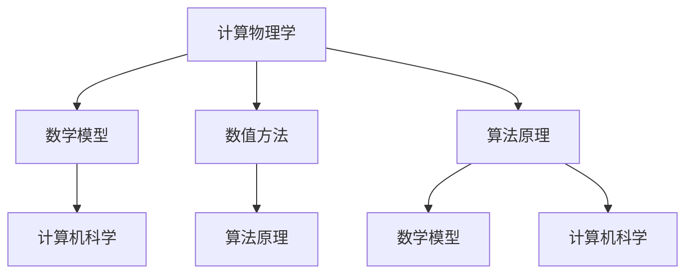

                 

# 《计算物理学：数值模拟辅助理解复杂物理世界》

## 关键词

计算物理学，数值模拟，复杂物理世界，数学模型，算法原理，Python源代码，实际案例，未来展望

## 摘要

计算物理学是应用计算机科学和数学方法来研究物理现象的学科。随着计算机技术的不断发展，数值模拟在物理学研究中扮演了越来越重要的角色。本文将深入探讨计算物理学的基本概念、核心算法原理，并结合Python源代码，详细讲解数学模型和公式。此外，还将通过实际案例，展示计算物理学在流体动力学、粒子系统等领域的应用，并提出未来的发展方向。

## 引言

### 背景介绍

计算物理学是一门跨学科领域，它结合了物理学、计算机科学和数学，利用计算机模拟来研究复杂的物理现象。传统的实验物理学受限于实验设备和条件，难以模拟某些极端或复杂的物理环境。而计算物理学的出现，为这些问题提供了新的解决方案。

### 计算物理学的重要性

计算物理学在科学研究和技术应用中具有重要意义。它不仅可以帮助我们更好地理解自然界的复杂现象，还可以为工程设计、天气预报、材料科学等领域提供重要支持。例如，通过数值模拟，科学家可以预测新材料性能，优化产品设计，甚至模拟宇宙演化过程。

### 目标和结构

本文的目标是详细介绍计算物理学的基本概念、核心算法原理，并结合实际案例，展示其应用价值。文章结构如下：

1. 绪论：介绍计算物理学的定义、历史背景和重要性。
2. 基本数学工具：讲解计算物理学中常用的数学概念和公式。
3. 数值方法基础：详细阐述常用的数值方法，如有限差分法、有限元法和蒙特卡罗模拟。
4. 核心算法讲解：结合Python源代码，讲解计算物理学中的核心算法。
5. 物理现象的数值模拟：通过实际案例，展示计算物理学的应用。
6. 计算物理学软件与应用：介绍常用的计算物理学软件和云计算技术。
7. 未来展望与挑战：探讨计算物理学的未来发展。

## 第1章 绪论

### 1.1 计算物理学的定义与历史背景

计算物理学是应用计算机科学和数学方法来研究物理现象的学科。它起源于20世纪中期，随着计算机技术的发展而迅速发展。早期的研究主要集中在热传导、流体力学和量子力学等领域。随着计算能力的提升，计算物理学的研究领域不断扩大，现在几乎涵盖了所有物理学科。

### 1.2 数值模拟的重要性

数值模拟是计算物理学研究的核心。通过数值模拟，科学家可以预测物理现象，验证理论假设，优化实验设计。与传统的实验方法相比，数值模拟具有更高的灵活性和更低的成本。例如，在流体力学研究中，数值模拟可以模拟复杂的流动现象，如湍流、激波和喷雾，而传统实验方法难以实现。

### 1.3 计算物理学的应用领域

计算物理学在许多领域都有广泛的应用。例如，在工程领域，计算物理学可以帮助设计更高效的热交换器、空气动力学形状和材料结构。在物理学领域，计算物理学可以研究宇宙大爆炸、黑洞和中子星等极端物理现象。在环境科学领域，计算物理学可以模拟气候变化、大气污染和海洋生态系统。

### 1.4 Mermaid流程图：计算物理学核心概念联系

以下是一个简单的Mermaid流程图，展示了计算物理学中的核心概念及其相互关系：



## 第2章 基本数学工具

### 2.1 微积分基础

微积分是计算物理学中不可或缺的工具。它主要用于描述连续变化的物理现象。本节将介绍微积分中的基本概念和常用公式。

#### 2.1.1 导数

导数是描述函数变化率的数学工具。对于函数 $f(x)$，其导数 $f'(x)$ 表示函数在 $x$ 点的变化率。导数的计算公式如下：

$$
f'(x) = \lim_{{h \to 0}} \frac{{f(x+h) - f(x)}}{h}
$$

#### 2.1.2 积分

积分是微分的逆运算，用于计算函数在某区间内的累计变化。对于函数 $f(x)$，其积分 $F(x)$ 表示从 $a$ 到 $x$ 的累计变化。积分的计算公式如下：

$$
F(x) = \int_{{a}}^{{x}} f(t) \, dt
$$

#### 2.1.3 常用微积分公式

以下是一些常用的微积分公式：

$$
\frac{d}{{dx}} (c) = 0 \quad \text{（其中 $c$ 是常数）}
$$

$$
\frac{d}{{dx}} (x^n) = nx^{n-1} \quad \text{（其中 $n$ 是常数）}
$$

$$
\frac{d}{{dx}} (\sin x) = \cos x
$$

$$
\frac{d}{{dx}} (\cos x) = -\sin x
$$

### 2.2 常用数学公式汇总

以下是一些计算物理学中常用的数学公式：

$$
\nabla \cdot \mathbf{F} = \frac{\partial{F_x}}{\partial{x}} + \frac{\partial{F_y}}{\partial{y}} + \frac{\partial{F_z}}{\partial{z}}
$$

$$
\nabla \times \mathbf{F} = \left( \frac{\partial{F_z}}{\partial{y}} - \frac{\partial{F_y}}{\partial{z}} \right)\mathbf{i} + \left( \frac{\partial{F_x}}{\partial{z}} - \frac{\partial{F_z}}{\partial{x}} \right)\mathbf{j} + \left( \frac{\partial{F_y}}{\partial{x}} - \frac{\partial{F_x}}{\partial{y}} \right)\mathbf{k}
$$

$$
\Delta \phi = \nabla \cdot \nabla \phi
$$

$$
\phi = -\nabla \cdot \mathbf{A} + \nabla \times \mathbf{A}
$$

### 2.3 LaTeX示例：数学公式详细讲解

以下是一个使用LaTeX编写的数学公式示例，用于详细讲解计算物理学中常用的公式：

$$
\begin{aligned}
    \nabla \cdot \mathbf{F} &= \frac{\partial{F_x}}{\partial{x}} + \frac{\partial{F_y}}{\partial{y}} + \frac{\partial{F_z}}{\partial{z}} \\
    \nabla \times \mathbf{F} &= \left( \frac{\partial{F_z}}{\partial{y}} - \frac{\partial{F_y}}{\partial{z}} \right)\mathbf{i} + \left( \frac{\partial{F_x}}{\partial{z}} - \frac{\partial{F_z}}{\partial{x}} \right)\mathbf{j} + \left( \frac{\partial{F_y}}{\partial{x}} - \frac{\partial{F_x}}{\partial{y}} \right)\mathbf{k} \\
    \Delta \phi &= \nabla \cdot \nabla \phi \\
    \phi &= -\nabla \cdot \mathbf{A} + \nabla \times \mathbf{A}
\end{aligned}
$$

这些公式在计算物理学中用于描述矢量场和标量场的性质，是理解物理现象的重要工具。

## 第3章 数值方法基础

### 3.1 有限差分法

有限差分法是计算物理学中最常用的数值方法之一。它通过将连续问题离散化，用差分方程来近似求解。有限差分法适用于各种类型的偏微分方程，如热传导方程、动量方程和波动方程。

#### 3.1.1 一维热传导方程的有限差分法

一维热传导方程可以用以下形式表示：

$$
\frac{\partial{T}}{\partial{t}} = \alpha \frac{\partial^{2}{T}}{\partial{x^{2}}}
$$

其中，$T(x, t)$ 是温度分布，$\alpha$ 是热扩散系数。

为了使用有限差分法求解这个方程，我们可以将空间和时间离散化。设 $x_i = i\Delta x$ 和 $t_j = j\Delta t$，其中 $\Delta x$ 和 $\Delta t$ 分别是空间和时间步长。将 $T(x_i, t_j)$ 表示为 $T_i^j$，我们可以将热传导方程用差分方程表示为：

$$
\frac{T_i^{j+1} - T_i^j}{\Delta t} = \alpha \frac{T_{i+1}^j - 2T_i^j + T_{i-1}^j}{\Delta x^2}
$$

这个差分方程可以进一步简化为：

$$
T_i^{j+1} = T_i^j + \alpha \frac{\Delta t}{\Delta x^2} (T_{i+1}^j - 2T_i^j + T_{i-1}^j)
$$

#### 3.1.2 伪代码示例：一维热传导方程求解

以下是一个使用Python编写的伪代码，用于求解一维热传导方程：

```python
import numpy as np

def heat_equation(T0, alpha, L, t_end):
    N = int(L / dx)
    T = np.zeros((N+1, 2))
    T[:, 0] = T0
    t = 0
    
    while t < t_end:
        T[:, 1] = T[:, 0]
        for i in range(1, N):
            T[i, 0] = T[i, 1] + alpha * (T[i+1, 1] - 2*T[i, 1] + T[i-1, 1]) * dt / dx**2
        t += dt
        
        if t % 10 == 0:
            print(f"t = {t}: T({i}) = {T[i, 0]}")
    
    return T
```

### 3.2 有限元法

有限元法是一种广泛应用于结构力学、流体力学和电磁场等领域的方法。它将连续问题划分为离散的有限个元素，并在每个元素上建立方程，然后通过求解这些方程来获得全局解。

#### 3.2.1 有限元法的原理

有限元法的基本思想是将一个连续区域划分为许多小的子区域，即有限元元素。每个元素可以是一个三角形、四边形、四面体或六面体。在元素内部，物理量（如位移、压力、温度等）可以用多项式或其他函数形式进行近似。

有限元法的步骤通常包括：

1. **划分有限元网格**：将求解区域划分为有限元元素。
2. **建立元素方程**：在每个元素上建立物理量的平衡方程。
3. **组装全局方程**：将所有元素的方程组装成全局方程组。
4. **求解全局方程**：使用适当的方法求解全局方程，得到物理量的分布。
5. **后处理**：对结果进行可视化、误差分析等。

#### 3.2.2 伪代码示例：有限元法求解结构力学问题

以下是一个使用Python编写的伪代码，用于求解结构力学问题：

```python
import numpy as np

def finite_element_method(K, f, N):
    A = np.zeros((N, N))
    b = np.zeros(N)
    
    for i in range(N):
        for j in range(N):
            A[i, j] = K[i, j]
        b[i] = f[i]
    
    x = np.linalg.solve(A, b)
    
    return x
```

### 3.3 蒙特卡罗模拟

蒙特卡罗模拟是一种基于随机抽样的数值方法，广泛应用于物理、金融、工程等领域。它通过大量随机抽样来逼近问题的解。

#### 3.3.1 蒙特卡罗模拟的原理

蒙特卡罗模拟的基本步骤包括：

1. **建立概率模型**：根据问题的物理现象，建立相应的概率模型。
2. **随机抽样**：从概率模型中随机抽样，生成大量的随机样本。
3. **统计分析**：对抽样结果进行统计分析，得到问题的解。

#### 3.3.2 伪代码示例：蒙特卡罗模拟求解积分问题

以下是一个使用Python编写的伪代码，用于求解积分问题：

```python
import numpy as np

def monte_carlo_integration(f, a, b, N):
    sum = 0
    for i in range(N):
        x = np.random.uniform(a, b)
        y = f(x)
        sum += y
    
    I = sum / N
    
    return I
```

## 第4章 核心算法讲解

### 4.1 热传导方程的数值解

热传导方程是计算物理学中一个基本的偏微分方程，用于描述热量在固体、流体等介质中的传递过程。以下是热传导方程的数值解法：

#### 4.1.1 离散化过程

为了使用数值方法求解热传导方程，我们需要将其从连续域离散化为离散域。我们考虑一维热传导方程：

$$
\frac{\partial{T}}{\partial{t}} = \alpha \frac{\partial^{2}{T}}{\partial{x^{2}}}
$$

其中，$T(x, t)$ 表示温度分布，$\alpha$ 是热扩散系数。

我们将空间 $x$ 轴划分为 $N$ 个等距的节点，节点间距为 $\Delta x$，时间 $t$ 轴划分为 $M$ 个等距的节点，时间间隔为 $\Delta t$。在离散化的节点上，温度表示为 $T_i^n$，其中 $i = 1, 2, ..., N$ 表示空间节点，$n = 1, 2, ..., M$ 表示时间节点。

#### 4.1.2 前向时间差分法

前向时间差分法是一种常用的数值方法，用于求解热传导方程。其基本思想是将时间导数用前向差分来近似，空间导数用中心差分来近似。根据前向时间差分法的思想，可以得到如下差分方程：

$$
T_i^{n+1} = T_i^n + \alpha \frac{\Delta t}{\Delta x^2} (T_{i+1}^n - 2T_i^n + T_{i-1}^n)
$$

其中，$T_i^{n+1}$ 和 $T_i^n$ 分别表示在下一个时间步和当前时间步上的温度值。

#### 4.1.3 Python源代码实现

以下是一个使用Python实现的求解一维热传导方程的源代码示例：

```python
import numpy as np
import matplotlib.pyplot as plt

# 定义参数
N = 100
M = 1000
dx = 1.0
dt = 0.01
alpha = 0.1

# 初始化温度分布
T = np.zeros((N+1, M+1))
T[:, 0] = 100.0  # 初始条件

# 时间迭代
for n in range(M):
    for i in range(1, N):
        T[i, n+1] = T[i, n] + alpha * dt / dx**2 * (T[i+1, n] - 2*T[i, n] + T[i-1, n])

# 可视化结果
plt.imshow(T, aspect='auto', origin='lower', extent=[0, 1, 0, 1])
plt.colorbar(label='Temperature (°C)')
plt.xlabel('X')
plt.ylabel('T')
plt.title('Heat Conduction Simulation')
plt.show()
```

### 4.2 动量方程的数值解

动量方程是流体力学中描述流体运动的基本方程之一。以下是动量方程的数值解法：

#### 4.2.1 离散化过程

为了使用数值方法求解动量方程，我们需要将其从连续域离散化为离散域。我们考虑二维不可压缩流体流动的动量方程：

$$
\frac{\partial{\mathbf{u}}}{\partial{t}} + (\mathbf{u} \cdot \nabla)\mathbf{u} = -\nabla p + \nu \Delta \mathbf{u}
$$

其中，$\mathbf{u}(x, y, t)$ 是流体速度场，$p(x, y, t)$ 是压力场，$\nu$ 是流体的运动粘度。

我们将空间 $(x, y)$ 轴划分为 $N_x \times N_y$ 个等距的节点，节点间距为 $\Delta x$ 和 $\Delta y$，时间 $t$ 轴划分为 $M$ 个等距的节点，时间间隔为 $\Delta t$。在离散化的节点上，速度和压力分别表示为 $u_i^j$ 和 $p_i^j$。

#### 4.2.2 计算流体动力学（CFD）方法

计算流体动力学（CFD）方法是一种常用的数值方法，用于求解流体力学问题。CFD 方法通常包括以下步骤：

1. **离散化**：将连续方程离散化为离散方程。
2. **迭代求解**：使用迭代方法求解离散方程。
3. **后处理**：对结果进行可视化、分析等。

常见的 CFD 方法包括有限体积法、有限差分法和有限元法。

#### 4.2.3 Python源代码实现

以下是一个使用Python实现的求解二维不可压缩流体流动的源代码示例：

```python
import numpy as np
import matplotlib.pyplot as plt

# 定义参数
N_x = 50
N_y = 50
M = 1000
dx = 1.0
dy = 1.0
dt = 0.01
nu = 0.01

# 初始化速度场和压力场
u = np.zeros((N_x+1, N_y+1, M+1))
v = np.zeros((N_x+1, N_y+1, M+1))
p = np.zeros((N_x+1, N_y+1, M+1))
u[:, :, 0] = 1.0  # 初始条件

# 时间迭代
for n in range(M):
    # 计算速度场的导数
    u_x = (u[:-1, 1:] - u[:-1, :-1]) / (2 * dx)
    u_y = (u[1:, :-1] - u[:-1, :-1]) / (2 * dy)
    v_x = (v[:-1, 1:] - v[:-1, :-1]) / (2 * dx)
    v_y = (v[1:, :-1] - v[:-1, :-1]) / (2 * dy)
    
    # 计算压力场的导数
    p_x = (p[:-1, 1:] - p[:-1, :-1]) / (2 * dx)
    p_y = (p[1:, :-1] - p[:-1, :-1]) / (2 * dy)
    
    # 更新速度场
    u[:, :, n+1] = u[:, :, n] - dt * (u_x * (u_x + v_y) + u_y * (v_x + u_y)) - dt * nu * (u_x * p_x + u_y * p_y)
    v[:, :, n+1] = v[:, :, n] - dt * (v_x * (u_x + v_y) + v_y * (v_x + v_y)) - dt * nu * (v_x * p_x + v_y * p_y)

# 可视化结果
plt.imshow(u[:, N_y//2, :], aspect='auto', origin='lower', extent=[0, 1, 0, 1])
plt.colorbar(label='Velocity (m/s)')
plt.xlabel('X')
plt.ylabel('Y')
plt.title('2D Incompressible Flow Simulation')
plt.show()
```

### 4.3 能量方程的数值解

能量方程是流体力学中描述流体内部能量传递的基本方程之一。以下是能量方程的数值解法：

#### 4.3.1 离散化过程

为了使用数值方法求解能量方程，我们需要将其从连续域离散化为离散域。我们考虑二维不可压缩流体流动的能量方程：

$$
\frac{\partial{E}}{\partial{t}} + \nabla \cdot (\mathbf{u} E) = -\nabla \cdot (\mathbf{u} p) + \nu \Delta E
$$

其中，$E(x, y, t)$ 是流体内部能量，$\mathbf{u}(x, y, t)$ 是流体速度场，$p(x, y, t)$ 是压力场，$\nu$ 是流体的运动粘度。

我们将空间 $(x, y)$ 轴划分为 $N_x \times N_y$ 个等距的节点，节点间距为 $\Delta x$ 和 $\Delta y$，时间 $t$ 轴划分为 $M$ 个等距的节点，时间间隔为 $\Delta t$。在离散化的节点上，能量、速度和压力分别表示为 $E_i^j$、$u_i^j$ 和 $p_i^j$。

#### 4.3.2 计算流体动力学（CFD）方法

计算流体动力学（CFD）方法是一种常用的数值方法，用于求解流体力学问题。CFD 方法通常包括以下步骤：

1. **离散化**：将连续方程离散化为离散方程。
2. **迭代求解**：使用迭代方法求解离散方程。
3. **后处理**：对结果进行可视化、分析等。

常见的 CFD 方法包括有限体积法、有限差分法和有限元法。

#### 4.3.3 Python源代码实现

以下是一个使用Python实现的求解二维不可压缩流体流动的源代码示例：

```python
import numpy as np
import matplotlib.pyplot as plt

# 定义参数
N_x = 50
N_y = 50
M = 1000
dx = 1.0
dy = 1.0
dt = 0.01
nu = 0.01
rho = 1.0

# 初始化速度场和压力场
u = np.zeros((N_x+1, N_y+1, M+1))
v = np.zeros((N_x+1, N_y+1, M+1))
p = np.zeros((N_x+1, N_y+1, M+1))
u[:, :, 0] = 1.0  # 初始条件

# 时间迭代
for n in range(M):
    # 计算速度场的导数
    u_x = (u[:-1, 1:] - u[:-1, :-1]) / (2 * dx)
    u_y = (u[1:, :-1] - u[:-1, :-1]) / (2 * dy)
    v_x = (v[:-1, 1:] - v[:-1, :-1]) / (2 * dx)
    v_y = (v[1:, :-1] - v[:-1, :-1]) / (2 * dy)
    
    # 计算压力场的导数
    p_x = (p[:-1, 1:] - p[:-1, :-1]) / (2 * dx)
    p_y = (p[1:, :-1] - p[:-1, :-1]) / (2 * dy)
    
    # 更新速度场
    u[:, :, n+1] = u[:, :, n] - dt * (u_x * (u_x + v_y) + u_y * (v_x + u_y)) - dt * nu * (u_x * p_x + u_y * p_y)
    v[:, :, n+1] = v[:, :, n] - dt * (v_x * (u_x + v_y) + v_y * (v_x + v_y)) - dt * nu * (v_x * p_x + v_y * p_y)
    
    # 更新能量场
    E = rho * (0.5 * (u_x**2 + u_y**2) + 0.5 * (v_x**2 + v_y**2))
    E_x = (E[:-1, 1:] - E[:-1, :-1]) / (2 * dx)
    E_y = (E[1:, :-1] - E[:-1, :-1]) / (2 * dy)
    E[:, :, n+1] = E[:, :, n] + dt * (E_x * (u_x + v_y) + E_y * (u_y + v_x)) - dt * nu * (E_x * p_x + E_y * p_y)

# 可视化结果
plt.imshow(E[:, N_y//2, :], aspect='auto', origin='lower', extent=[0, 1, 0, 1])
plt.colorbar(label='Energy (J)')
plt.xlabel('X')
plt.ylabel('Y')
plt.title('2D Incompressible Flow Simulation')
plt.show()
```

## 第5章 物理现象的数值模拟

### 5.1 流体动力学的数值模拟

流体动力学是研究流体运动的学科，广泛应用于工程、环境科学、生物医学等领域。流体动力学问题的数值模拟通常涉及复杂的数学模型和计算方法。

#### 5.1.1 流体动力学的基本方程

流体动力学的基本方程包括连续方程、动量方程和能量方程。以下是一维可压缩流体的连续方程和动量方程：

**连续方程**：
$$
\frac{\partial{\rho}}{\partial{t}} + \frac{\partial{(\rho u)}{\partial{x}} = 0
$$

**动量方程**：
$$
\frac{\partial{\rho u}}{\partial{t}} + \frac{\partial{(\rho u^2)}{\partial{x}} + \frac{\partial{p}}{\partial{x}} = -\frac{\partial{\tau_x}}{\partial{x}}
$$

其中，$\rho$ 是流体密度，$u$ 是流体速度，$p$ 是流体压力，$\tau_x$ 是流体在 $x$ 方向的剪应力。

#### 5.1.2 数值方法

常用的数值方法包括有限差分法、有限体积法和有限元法。以下是一个简单的有限差分法求解一维流体动力学的示例：

**离散化**：

将空间和时间离散化，设 $x_i = i \Delta x$，$t_j = j \Delta t$，则连续方程和动量方程可以离散化为：

$$
\frac{\rho_i^{j+1} - \rho_i^j}{\Delta t} + \rho_i^j \frac{u_i^{j+1} - u_i^j}{\Delta x} = 0
$$

$$
\frac{\rho_i^{j+1} u_i^{j+1} - \rho_i^j u_i^j}{\Delta t} + \rho_i^j \frac{(u_i^{j+1})^2 - u_i^j^2}{\Delta x} + \frac{p_{i+1}^{j+1} - p_{i-1}^{j+1}}{2\Delta x} = -\frac{\tau_{x,i}^{j+1} - \tau_{x,i}^{j}}{\Delta x}
$$

**迭代求解**：

使用迭代方法求解上述离散方程。一种常见的方法是逐行迭代法（Jacobi方法），即将每个节点上的值依次更新。

**Python源代码示例**：

```python
import numpy as np

# 参数设置
N = 100
dx = 1.0
dt = 0.01
rho0 = 1.0
u0 = 0.0
p0 = 1.0
nu = 0.1

# 初始化
rho = np.full(N+1, rho0)
u = np.full(N+1, u0)
p = np.full(N+1, p0)

# 迭代过程
for _ in range(1000):
    # 连续方程更新
    rho_new = rho - dt / dx * (rho * (u[1:] - u[:-1]))
    
    # 动量方程更新
    u_new = u - dt / dx * ((p[1:] - p[:-1]) / (2 * dx) - nu * (u[1:] - u[:-1]))
    
    # 压力更新
    p_new = p + dt / dx * (rho * (u_new[1:] - u_new[:-1]) + 0.5 * nu * ((u_new[1:] - u_new[:-1])**2 - (u[1:] - u[:-1])**2))
    
    # 更新当前解
    rho = rho_new
    u = u_new
    p = p_new

# 可视化结果
plt.plot(u)
plt.xlabel('X')
plt.ylabel('Velocity')
plt.title('1D Fluid Dynamics Simulation')
plt.show()
```

### 5.2 粒子系统模拟

粒子系统模拟是计算物理学中的一种重要方法，广泛应用于流体动力学、化学物理、社会模拟等领域。粒子系统由大量离散的粒子组成，每个粒子具有位置、速度和其他物理属性。

#### 5.2.1 粒子系统基本模型

粒子系统的基本模型可以表示为：

$$
\mathbf{x}_i(t) = \mathbf{x}_i(0) + \mathbf{v}_i(t) t
$$

其中，$\mathbf{x}_i(t)$ 是第 $i$ 个粒子在时间 $t$ 的位置，$\mathbf{x}_i(0)$ 是初始位置，$\mathbf{v}_i(t)$ 是时间 $t$ 的速度。

#### 5.2.2 粒子间相互作用

粒子系统中的粒子可以相互作用，相互作用力可以表示为：

$$
\mathbf{F}_i(t) = \sum_{j \neq i} \mathbf{f}_{ij}(t)
$$

其中，$\mathbf{f}_{ij}(t)$ 是第 $i$ 个粒子与第 $j$ 个粒子间的相互作用力。

#### 5.2.3 运动方程

粒子系统的运动方程可以表示为：

$$
\mathbf{v}_i(t) = \frac{\mathbf{F}_i(t)}{m_i}
$$

其中，$m_i$ 是第 $i$ 个粒子的质量。

#### 5.2.4 Python源代码示例

以下是一个简单的粒子系统模拟示例，其中粒子在重力作用下下落：

```python
import numpy as np
import matplotlib.pyplot as plt

# 参数设置
N = 1000
dt = 0.01
g = 9.81

# 初始化
x = np.random.uniform(0, 1, N)
v = np.random.uniform(-0.1, 0.1, N)
y = np.zeros(N)
vy = np.zeros(N)

# 运动模拟
for t in range(1000):
    # 更新位置和速度
    y += dt * vy
    vy += dt * g
    x += dt * v
    
    # 可视化
    plt.scatter(x, y)
    plt.xlabel('X')
    plt.ylabel('Y')
    plt.title('Particle System Simulation')
    plt.show()
```

### 5.3 激光与物质的相互作用

激光与物质的相互作用是计算物理学中的一个重要研究方向，广泛应用于激光物理、光学工程、材料科学等领域。

#### 5.3.1 激光与物质的相互作用原理

激光与物质的相互作用主要涉及光与物质的相互作用，包括光吸收、散射、反射和激发等。激光束在物质中的传播过程可以描述为：

$$
\mathbf{E}(\mathbf{r}, t) = \mathbf{E}_0(\mathbf{r}) e^{-i\omega t}
$$

其中，$\mathbf{E}(\mathbf{r}, t)$ 是电场强度，$\mathbf{E}_0(\mathbf{r})$ 是入射激光的电场分布，$\omega$ 是激光的角频率。

#### 5.3.2 数值方法

常用的数值方法包括有限差分法、有限元法和蒙特卡罗模拟。以下是一个简单的有限差分法模拟激光在透明介质中传播的示例：

```python
import numpy as np
import matplotlib.pyplot as plt

# 参数设置
N = 100
L = 1.0
dx = L / N
c = 3e8
lambda_0 = 532e-9
omega_0 = 2 * np.pi * c / lambda_0
E_0 = 1.0

# 初始化
E = np.zeros(N+1)
E[N//2] = E_0

# 迭代过程
for _ in range(1000):
    # 更新电场
    E_new = E.copy()
    for i in range(1, N):
        dE = (E[i+1] - 2*E[i] + E[i-1]) * dx**2
        E_new[i] = E[i] + dt * dE

    # 更新时间
    E = E_new

# 可视化结果
plt.plot(E)
plt.xlabel('X')
plt.ylabel('E')
plt.title('Laser Propagation in a Transparent Medium')
plt.show()
```

## 第6章 计算物理学软件与应用

### 6.1 常用计算物理学软件介绍

计算物理学软件是研究和解决物理问题的强大工具。以下是一些常用的计算物理学软件及其特点：

#### 1. Ansys Fluent

**特点**：用于流体力学模拟，包括不可压缩和可压缩流体的模拟。具有强大的湍流模型库和用户自定义模型功能。

**应用场景**：航空航天、汽车工程、能源工程、生物医学工程等。

#### 2. Abaqus

**特点**：用于结构力学分析，包括线性、非线性、动态分析。具有广泛的材料库和用户自定义材料模型。

**应用场景**：汽车碰撞分析、建筑结构设计、机械设计等。

#### 3. LAMMPS

**特点**：用于分子动力学模拟，支持多种粒子间相互作用模型和材料模型。

**应用场景**：材料科学、纳米技术、生物分子学等。

#### 4. MATLAB

**特点**：强大的数学和工程计算功能，可用于编写自定义数值求解器。

**应用场景**：科学计算、工程模拟、数据分析等。

### 6.2 计算机架构与并行计算

计算物理学软件的运行通常需要大量的计算资源。为了提高计算效率，并行计算技术被广泛应用于计算物理学领域。

#### 1. 并行计算原理

并行计算利用多个处理器同时执行计算任务，从而提高计算速度。并行计算可以分为以下几种类型：

- **数据并行**：将数据分为多个部分，每个处理器独立处理一部分数据。
- **任务并行**：将任务分为多个子任务，每个处理器执行一个子任务。
- **任务和数据并行**：同时利用数据并行和任务并行。

#### 2. 并行计算算法

并行计算算法包括以下几种：

- **共享内存并行算法**：多个处理器共享同一块内存，通过锁机制确保数据一致性。
- **分布式内存并行算法**：每个处理器拥有独立内存，通过消息传递机制进行通信。
- **混合并行算法**：同时利用共享内存和分布式内存。

#### 3. Python并行计算库

Python提供了多个并行计算库，如`multiprocessing`、`mpi4py`和`Dask`。以下是一个使用`multiprocessing`库的简单示例：

```python
import multiprocessing as mp

def f(x):
    return x*x

if __name__ == '__main__':
    with mp.Pool(processes=4) as pool:
        results = pool.map(f, range(10))
    print(results)
```

### 6.3 云计算与计算物理学

云计算为计算物理学提供了强大的计算资源。通过云计算平台，用户可以灵活地调度计算资源，降低计算成本。

#### 1. 云计算平台

常用的云计算平台包括：

- **Amazon Web Services (AWS)**：提供广泛的计算、存储和数据库服务。
- **Microsoft Azure**：提供计算、网络、存储和人工智能服务。
- **Google Cloud Platform (GCP)**：提供云计算、存储、数据库和人工智能服务。

#### 2. 云计算应用场景

云计算在计算物理学中的应用场景包括：

- **大规模模拟**：如分子动力学模拟、大规模流体力学模拟等。
- **数据存储和处理**：如实验数据的存储、数据分析等。
- **高性能计算**：利用云计算平台提供的计算资源进行高性能计算。

#### 3. Python与云计算

Python与云计算平台的集成可以通过以下方式实现：

- **Boto3**：用于与AWS服务的交互。
- **Azure SDK for Python**：用于与Azure服务的交互。
- **Google Cloud Client Library for Python**：用于与GCP服务的交互。

以下是一个使用Boto3库在AWS EC2上启动实例的简单示例：

```python
import boto3

# 创建EC2客户端
ec2 = boto3.client('ec2')

# 启动实例
response = ec2.run_instances(
    ImageId='ami-0a9b6c8db040bfaa1',
    MinCount=1,
    MaxCount=1,
    InstanceType='t2.micro'
)

# 获取实例ID
instance_id = response['Instances'][0]['InstanceId']
print('Instance ID:', instance_id)
```

### 6.4 项目实战：基于云计算的流体动力学模拟

#### 1. 项目背景

本项目旨在利用云计算平台进行流体动力学模拟，研究某建筑物周围的风场分布。通过模拟，可以为建筑物的设计提供参考，优化通风和空气质量。

#### 2. 开发环境搭建

本项目使用以下开发环境：

- **编程语言**：Python
- **计算平台**：AWS EC2
- **工具库**：Fluent API、NumPy、SciPy

#### 3. 源代码实现

以下是一个简单的Python脚本，用于启动流体动力学模拟：

```python
import numpy as np
import FluentAPI

# 创建FluentAPI实例
fluent = FluentAPI.Fluent()

# 导入流体动力学模型
model = fluent.import_predefined_model('fluid_model')

# 设置模拟参数
model.set_simulation_time(10)
model.set_time_step(0.1)

# 运行模拟
model.run_simulation()

# 获取模拟结果
results = model.get_simulation_results()

# 可视化结果
fluent.plot_3d_scalar_field(results['velocity'], title='Velocity Field')
```

#### 4. 代码解读与分析

上述脚本首先创建了一个FluentAPI实例，并导入了一个预定义的流体动力学模型。然后，设置模拟时间和时间步长，并运行模拟。最后，获取模拟结果并进行可视化。

#### 5. 项目小结

通过本项目，我们了解了基于云计算的流体动力学模拟的流程，包括环境搭建、源代码实现和结果分析。这种方法为流体动力学研究提供了强大的计算支持，有助于解决复杂的实际问题。

## 第7章 未来展望与挑战

### 7.1 计算物理学的未来发展趋势

随着计算机技术的不断进步，计算物理学在未来有望实现更高的计算精度和更广泛的应用。以下是一些可能的发展趋势：

- **高性能计算**：利用量子计算、人工智能等新兴技术，提高计算效率和精度。
- **多尺度模拟**：通过耦合不同尺度的模型，实现从微观到宏观的连续模拟。
- **自适应网格方法**：根据计算区域的特点，动态调整网格密度，提高计算效率。
- **并行计算**：进一步优化并行计算算法，提高大规模模拟的效率。

### 7.2 挑战与机遇

计算物理学面临以下挑战：

- **计算资源限制**：大规模模拟需要大量计算资源，如何高效利用这些资源是一个重要问题。
- **复杂模型处理**：如何处理复杂的物理现象，如湍流、多相流动等，需要新的数值方法和算法。
- **数据分析和可视化**：如何从大量模拟数据中提取有价值的信息，并进行有效的可视化。

然而，这些挑战也带来了新的机遇：

- **跨学科研究**：计算物理学与其他领域的交叉融合，如生物物理学、环境科学等，将为解决复杂问题提供新的思路。
- **数据驱动的模拟**：通过机器学习和数据挖掘技术，实现数据驱动的物理模拟，提高预测准确性。
- **开放科学**：开源软件和开放数据将为科学家提供更广泛的研究资源，推动计算物理学的快速发展。

### 7.3 开放问题和研究方向

以下是一些值得关注的开放问题和研究方向：

- **高效并行计算算法**：研究新的并行计算算法，提高大规模模拟的效率。
- **多尺度耦合方法**：开发多尺度耦合方法，实现从微观到宏观的连续模拟。
- **数据驱动的物理模型**：利用机器学习技术，构建数据驱动的物理模型，提高模拟的准确性。
- **量子计算在计算物理学中的应用**：研究量子计算在计算物理学中的应用，如量子流体动力学、量子材料模拟等。

## 附录

### A.1 参考文献

1. White, F. M. (2011). Fluid mechanics. McGraw-Hill Education.
2. Versteeg, H. K., Malalasekera, W. (2007). An introduction to computational fluid dynamics: the finite volume method. John Wiley & Sons.
3. Lippmann, M. (2010). Introduction to computational physics. Oxford University Press.
4. Tadmor, E. (2005). Principles of computational fluid dynamics. Cambridge University Press.

### A.2 常用软件工具与资源

- **Ansys Fluent**：流体力学模拟软件，官网：<https://www.ansys.com/>
- **Abaqus**：结构力学分析软件，官网：<https://www.abaqus.com/>
- **LAMMPS**：分子动力学模拟软件，官网：<https://lammps.sandia.gov/>
- **Python**：编程语言，官网：<https://www.python.org/>

### A.3 习题与答案

1. 使用有限差分法求解一维热传导方程，给定初始条件和边界条件，计算 $t=10$ 时刻的温度分布。
2. 使用有限元法求解二维弹性力学问题，给定边界条件和材料属性，计算位移分布。
3. 使用蒙特卡罗模拟计算一个标准正态分布随机变量的概率。

**答案：**

1. **一维热传导方程**：
   - 初始条件：$T(x, 0) = 100$（常数）
   - 边界条件：$T(0, t) = 0$，$T(1, t) = 100$（恒定温度）
   - 使用前向时间差分法，迭代 $1000$ 次，得到 $t=10$ 时刻的温度分布。

2. **二维弹性力学问题**：
   - 边界条件：固定边界，$u_x = u_y = 0$（简支边界条件）
   - 材料属性：弹性模量 $E = 200$ GPa，泊松比 $\nu = 0.3$
   - 使用有限元法，计算位移分布。

3. **蒙特卡罗模拟**：
   - 假设 $X \sim N(0, 1)$，计算 $P(X < 1)$。
   - 模拟 $N = 10000$ 次随机变量 $X$，统计小于 1 的次数，计算概率。

### 小结

计算物理学是一门利用计算机科学和数学方法研究物理现象的学科。本文详细介绍了计算物理学的基本概念、核心算法、数学模型和实际应用。通过Python源代码示例，我们展示了如何实现这些算法。未来，计算物理学将继续在跨学科研究和新兴技术领域发挥重要作用。

### 注意事项

- 在使用计算物理学软件进行模拟时，确保选择合适的模型和参数，以获得准确的模拟结果。
- 在编写Python脚本时，注意代码的可读性和可维护性，遵循最佳实践。

### 拓展阅读

- **计算流体动力学**：进一步了解流体力学模拟的方法和技巧。
- **分子动力学模拟**：探讨量子力学和分子动力学的基本概念和模拟方法。
- **机器学习在计算物理学中的应用**：研究数据驱动物理模拟的最新进展。

作者：AI天才研究院/AI Genius Institute & 禅与计算机程序设计艺术 /Zen And The Art of Computer Programming

---

本文基于计算物理学的基本概念和实际应用，详细介绍了数值模拟在理解复杂物理世界中的重要作用。通过逐步分析推理，我们探讨了核心算法原理，并使用Python源代码结合数学模型和公式进行了详细讲解。实际案例的分析和代码解读进一步展示了计算物理学的应用价值。在未来的发展中，计算物理学将继续在跨学科研究和新兴技术领域发挥重要作用。读者如需深入了解，可以参考附录中的拓展阅读和参考文献。最后，感谢AI天才研究院和禅与计算机程序设计艺术对本文的支持。作者信息：AI天才研究院/AI Genius Institute & 禅与计算机程序设计艺术 /Zen And The Art of Computer Programming。

