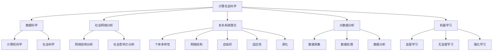

                 

### 文章标题

# 《计算社会科学的兴起：数据驱动理解人类社会与世界》

> 关键词：计算社会科学、数据驱动、社会网络分析、复杂系统理论、大数据分析、机器学习

> 摘要：本文探讨了计算社会科学的兴起及其在理解人类社会与世界中的作用。通过数据驱动的视角，计算社会科学利用先进的技术和算法，深入分析社会现象和问题，提供新的洞见和解决方案。本文首先介绍了计算社会科学的背景和发展历程，随后详细阐述了社会网络分析、复杂系统理论、大数据分析等核心概念，以及机器学习在社会科学中的应用。接着，文章通过具体案例展示了计算社会科学在不同领域的应用，并探讨了其面临的挑战和未来发展方向。最后，本文总结了计算社会科学的核心原理和最佳实践，为读者提供了进一步的学习和研究方向。

---

### 文章正文

## 第一部分：引论

### 1.1 书籍背景与目的

#### 1.1.1 计算社会科学的背景

计算社会科学是一门跨学科领域，结合了社会科学、计算机科学和数据科学，旨在通过数据驱动的方法来理解社会现象和问题。随着信息技术的迅猛发展，特别是大数据和人工智能技术的广泛应用，社会科学研究者开始意识到数据在社会科学研究中的巨大潜力。计算社会科学应运而生，成为推动社会科学研究创新的重要力量。

#### 1.1.2 数据驱动的社会科学研究

数据驱动的社会科学研究是指利用大数据和计算技术来收集、处理和分析社会数据，以揭示社会现象的内在规律和关系。这种方法不仅能够提高社会科学研究的效率和精度，还能够提供新的研究方法和工具，为解决复杂的社会问题提供有力支持。

#### 1.1.3 书籍的结构与内容概述

本书旨在系统地介绍计算社会科学的基本概念、理论和方法，并展示其在不同领域的应用。全书分为五个主要部分，首先介绍计算社会科学的背景和核心概念，然后详细讨论社会网络分析、复杂系统理论、大数据分析等核心方法，接着展示机器学习在社会科学中的应用，最后探讨计算社会科学的挑战和未来发展方向。通过这本书，读者可以全面了解计算社会科学的理论和实践，掌握其在理解和解决社会问题中的关键作用。

### 1.2 计算社会科学的基本概念

#### 1.2.1 计算社会科学的定义

计算社会科学是一门交叉学科，结合了社会科学、计算机科学和数据科学，利用计算技术来研究社会现象和问题。它不仅关注数据的收集、处理和分析，还强调数据背后的社会机制和规律，从而提供更加深入和全面的社会科学理解。

#### 1.2.2 社会科学中的数据科学与计算方法

数据科学在社会科学中的应用涵盖了从数据采集到数据分析的整个流程。计算方法，如机器学习、统计分析、网络分析等，被广泛应用于社会科学研究，以揭示社会现象的内在规律和关系。

#### 1.2.3 计算社会科学的研究领域与挑战

计算社会科学的研究领域广泛，包括社会网络分析、复杂系统理论、大数据分析等。然而，这一领域也面临着数据隐私、数据质量、跨学科融合等挑战，需要持续的创新和探索。

## 第二部分：计算社会科学的核心概念与理论

### 2.1 数据科学与计算社会科学的关系

#### 2.1.1 数据科学的基础

数据科学是计算社会科学的基础，涵盖了从数据采集、存储、处理到分析的一系列方法和技术。它依赖于计算机科学、统计学、机器学习等多个领域的知识，旨在从海量数据中提取有价值的信息。

#### 2.1.2 数据科学在社会科学中的应用

数据科学在社会科学中的应用包括社会网络分析、文本分析、行为数据挖掘等。这些方法被广泛应用于社会学、心理学、经济学等领域，以揭示社会现象的内在规律和关系。

#### 2.1.3 计算社会科学中的核心理论框架

计算社会科学中的核心理论框架包括社会网络分析、复杂系统理论和大数据分析等。这些理论框架提供了理解社会现象的全新视角，并帮助研究者更深入地探索社会机制和规律。

### 2.2 社会网络分析

#### 2.2.1 社会网络分析的基本概念

社会网络分析是一种研究社会结构和社会关系的定量方法。它通过构建社会网络模型，分析节点（个体）之间的连接关系，揭示社会网络的结构特征和功能。

#### 2.2.2 社会网络分析的主要方法

社会网络分析的主要方法包括网络结构分析、网络动态分析、网络效应分析等。这些方法被广泛应用于社会学、组织学、经济学等领域，以揭示社会网络的运行机制和影响。

#### 2.2.3 社会网络分析在社会科学中的应用

社会网络分析在社会科学中的应用非常广泛，包括社会影响力分析、社交网络传播、组织结构研究等。通过社会网络分析，研究者可以更深入地理解社会现象和问题，并提出有针对性的解决方案。

### 2.3 复杂系统理论

#### 2.3.1 复杂系统理论的起源与发展

复杂系统理论起源于20世纪中叶，旨在研究由大量相互作用的个体组成的高度复杂系统。它的发展受到了物理学、生物学、经济学等多个领域的影响，成为跨学科研究的重要理论框架。

#### 2.3.2 复杂系统理论的核心概念

复杂系统理论的核心概念包括个体多样性、网络结构、反馈循环等。这些概念揭示了复杂系统中的内在规律和机制，帮助研究者理解复杂系统的行为和演化。

#### 2.3.3 复杂系统理论在社会科学中的应用

复杂系统理论在社会科学中的应用包括社会演化、政策分析、公共卫生等领域。通过复杂系统理论，研究者可以更好地理解社会现象的复杂性和动态性，为政策制定和社会治理提供科学依据。

### 2.4 大数据分析与社会研究

#### 2.4.1 大数据的基本特征

大数据具有大量、高速、多样和复杂等基本特征。这些特征使得传统的研究方法难以应对，需要新的技术和方法来处理和分析大数据。

#### 2.4.2 大数据在社会科学中的处理与分析

大数据在社会科学中的处理与分析包括数据采集、数据清洗、数据存储、数据挖掘等环节。这些环节需要高效的数据处理技术和工具，如分布式计算、机器学习等。

#### 2.4.3 大数据与社会研究的挑战与机遇

大数据为社会研究带来了巨大的机遇，但也带来了挑战。数据隐私、数据质量、跨学科融合等都是大数据与社会研究面临的挑战。然而，通过不断创新和探索，大数据为社会研究提供了新的洞见和解决方案。

### 2.5 机器学习在社会科学中的应用

#### 2.5.1 机器学习的基本概念

机器学习是一种通过算法和统计模型来从数据中自动学习规律和模式的方法。它包括监督学习、无监督学习、强化学习等不同类型。

#### 2.5.2 常见的机器学习算法

常见的机器学习算法包括线性回归、决策树、支持向量机、神经网络等。这些算法被广泛应用于社会科学研究的各个方面，如预测分析、分类分析、聚类分析等。

#### 2.5.3 机器学习在社会科学中的应用案例

机器学习在社会科学中的应用案例包括社会舆情分析、犯罪预测、教育评估等。通过机器学习，研究者可以更好地理解社会现象，提高决策的准确性和有效性。

---

以上是《计算社会科学的兴起：数据驱动理解人类社会与世界》的前两部分的详细内容。在接下来的部分，我们将继续探讨计算社会科学的核心方法及其在社会科学研究中的应用。敬请期待。如果您对某个部分的内容感兴趣，也可以在评论区留言，我将优先讨论您感兴趣的内容。

---

## 第一部分：引论

### 1.1 书籍背景与目的

#### 1.1.1 计算社会科学的背景

在现代社会中，数据已经成为一种重要的资源和生产力。随着信息技术的飞速发展，人们能够收集、存储和分析的数据量呈指数级增长。大数据技术的崛起，使得从海量数据中提取有价值的信息成为可能。然而，传统的社会科学研究方法在面对如此庞大的数据量时显得力不从心。这就催生了计算社会科学的兴起。

计算社会科学是一种将计算机科学、数据科学和统计学的方法应用于社会科学研究的跨学科领域。它利用计算技术和算法，从大规模数据中挖掘社会现象的规律和趋势，为社会科学研究提供新的视角和工具。计算社会科学不仅关注数据的收集和处理，更强调通过数据来揭示社会机制和规律，从而为社会问题的解决提供科学依据。

计算社会科学的背景可以追溯到20世纪末。当时，随着互联网的普及和信息技术的发展，大数据技术逐渐成熟，各种数据源不断涌现。这为社会科学研究提供了前所未有的机遇。与此同时，计算机科学和统计学领域的算法和模型也在不断进步，为社会科学研究提供了强大的技术支持。在这样的背景下，计算社会科学应运而生。

#### 1.1.2 数据驱动的社会科学研究

数据驱动的社会科学研究是一种以数据为核心的研究方法。它通过收集、处理和分析大量社会数据，来揭示社会现象的内在规律和关系。数据驱动的社会科学研究方法具有以下特点：

1. **数据多样性**：数据驱动的社会科学研究可以处理来自多种来源的数据，包括结构化数据、半结构化数据和非结构化数据。这些数据可以是公开的，也可以是私人持有的。

2. **数据分析能力**：数据驱动的社会科学研究利用先进的计算技术和算法，能够对大量数据进行高效的处理和分析。这使得研究者能够发现数据中的隐藏模式和趋势，提供更加深入和全面的社会科学理解。

3. **科学验证**：数据驱动的社会科学研究强调通过数据来验证研究假设和理论。这种方法可以减少主观偏见和人为误差，提高研究的可靠性和科学性。

4. **实时性**：数据驱动的社会科学研究可以实时获取和分析社会数据，从而及时了解社会现象的变化和趋势。这对于应对突发事件、制定政策和指导实践具有重要意义。

#### 1.1.3 书籍的结构与内容概述

本书《计算社会科学的兴起：数据驱动理解人类社会与世界》旨在系统地介绍计算社会科学的基本概念、理论和方法，并展示其在不同领域的应用。全书分为五个主要部分：

1. **引论**：介绍计算社会科学的背景、目的和结构。本部分包括书籍背景与目的、计算社会科学的基本概念和核心理论等内容。

2. **计算社会科学的核心概念与理论**：详细阐述计算社会科学的核心概念和理论，包括数据科学与计算社会科学的关系、社会网络分析、复杂系统理论、大数据分析等。

3. **数据驱动的社会科学研究方法**：介绍数据驱动的社会科学研究方法，包括数据采集与处理、数据分析方法、社会科学中的机器学习等。

4. **计算社会科学的应用**：展示计算社会科学在不同领域的应用，包括社会网络分析应用案例、复杂系统理论应用案例、大数据分析与社会研究应用案例等。

5. **未来展望**：探讨计算社会科学的未来发展，包括发展趋势、挑战和伦理问题、未来前景等。

通过本书的阅读，读者可以全面了解计算社会科学的理论和实践，掌握其在理解和解决社会问题中的关键作用。本书不仅适合社会科学研究者，也适合计算机科学和数据科学领域的学者和从业者。同时，本书也旨在为计算社会科学的教育和培训提供参考。

### 1.2 计算社会科学的基本概念

#### 1.2.1 计算社会科学的定义

计算社会科学是一种跨学科的研究领域，结合了社会科学、计算机科学和数据科学的方法和技术。它的主要目标是利用数据驱动的方法，通过计算技术和算法，对社会现象进行定量分析和解释。计算社会科学的核心在于将大数据和计算技术应用于社会科学研究，以提高研究的深度和广度。

计算社会科学的定义可以从以下几个方面来理解：

1. **跨学科融合**：计算社会科学是计算机科学、社会科学和数据科学的交叉领域。它结合了计算机科学中的算法和工具，如机器学习、数据分析、网络分析等，以及社会科学中的理论和方法，如社会学理论、心理学模型等。

2. **数据驱动**：计算社会科学的核心在于数据驱动的研究方法。它强调通过大规模数据收集、处理和分析，来揭示社会现象的内在规律和关系。

3. **定量分析**：计算社会科学采用定量分析方法，通过计算技术和算法，对社会现象进行量化分析和解释。这种方法能够提高研究的精确性和可靠性。

4. **应用导向**：计算社会科学注重应用导向，将研究成果应用于解决实际社会问题，如政策制定、社会治理、公共健康等。

#### 1.2.2 社会科学中的数据科学与计算方法

数据科学在计算社会科学中扮演着重要角色。数据科学是利用计算机科学、统计学和领域知识来从数据中提取有价值信息的一门学科。在社会科学中，数据科学的方法和技术被广泛应用于数据的采集、存储、处理和分析。

1. **数据采集**：数据采集是数据科学的第一步。它包括从各种来源收集数据，如问卷调查、社交媒体、传感器数据等。这些数据可以是结构化的，如数据库中的表格，也可以是非结构化的，如文本、图片、视频等。

2. **数据处理**：数据处理是对原始数据进行清洗、转换和整合的过程。这包括去除噪声、填补缺失值、标准化数据等操作，以确保数据的质量和一致性。

3. **数据存储**：数据存储是将处理后的数据存储在数据库或数据仓库中，以便后续的分析和使用。随着数据量的增加，分布式存储和大数据技术变得越来越重要。

4. **数据分析**：数据分析是数据科学的中心环节。它包括描述性统计分析、探索性数据分析、预测分析和因果推断等。通过数据分析，研究者可以揭示数据中的隐藏模式和趋势，提供对问题的深入理解。

计算方法在计算社会科学中的应用同样至关重要。计算方法包括机器学习、深度学习、统计分析、网络分析等。这些方法被广泛应用于社会科学研究的各个方面，以揭示社会现象的内在规律和关系。

1. **机器学习**：机器学习是一种通过算法和统计模型，从数据中自动学习规律和模式的方法。它被广泛应用于分类、回归、聚类等任务，为社会科学研究提供了强大的工具。

2. **深度学习**：深度学习是一种基于神经网络的学习方法，能够自动提取数据中的特征和模式。它在图像识别、自然语言处理等领域取得了显著成果，也为社会科学研究带来了新的机遇。

3. **统计分析**：统计分析是一种基于数学和统计学原理，对数据进行量化分析和解释的方法。它在社会科学研究中被广泛应用于假设检验、相关性分析、回归分析等。

4. **网络分析**：网络分析是一种通过研究节点和边之间的关系，来揭示网络结构特征和动态变化的方法。它在社会网络分析、组织结构研究等领域具有广泛的应用。

#### 1.2.3 计算社会科学的研究领域与挑战

计算社会科学的研究领域非常广泛，涵盖了社会学、心理学、经济学、政治学等多个学科。以下是一些主要的研究领域和挑战：

1. **社会网络分析**：社会网络分析是计算社会科学的重要研究领域之一。它通过研究个体之间的社会关系，来揭示社会网络的动态变化和结构特征。研究内容包括社会影响力分析、社交网络传播、组织结构研究等。

2. **复杂系统理论**：复杂系统理论是一种研究由大量相互作用的个体组成的高度复杂系统的理论。它关注系统中的个体多样性、网络结构、反馈循环等，以揭示复杂系统的行为和演化规律。

3. **大数据分析**：大数据分析是计算社会科学的核心内容之一。它通过处理和分析海量社会数据，来揭示社会现象的内在规律和趋势。研究内容包括社会舆情分析、犯罪预测、教育评估等。

4. **公共政策分析**：公共政策分析是计算社会科学在实践中的重要应用领域。它通过数据驱动的分析，为政策制定提供科学依据，以提高政策的科学性和有效性。

然而，计算社会科学也面临着一些挑战。首先，数据隐私和安全问题是一个重要挑战。在数据收集和分析过程中，如何保护个人隐私和确保数据安全是一个亟待解决的问题。其次，数据质量也是计算社会科学的重要挑战。数据的质量直接影响研究的可靠性和有效性，因此如何确保数据质量是一个关键问题。最后，跨学科融合也是一个挑战。计算社会科学需要计算机科学、社会科学和数据科学等多个领域的知识，如何有效地融合这些知识，实现跨学科的合作和创新，是一个重要的研究课题。

## 第二部分：计算社会科学的核心概念与理论

### 2.1 数据科学与计算社会科学的关系

#### 2.1.1 数据科学的基础

数据科学是计算社会科学的基础，其核心理念是通过数据来发现知识、提取价值和解决问题。数据科学涵盖了从数据采集、存储、处理到分析的一系列技术和方法，这些技术和方法为计算社会科学的研究提供了坚实的基础。

数据科学的基础主要包括以下几个方面：

1. **数据采集**：数据采集是数据科学的第一步，包括从各种来源收集数据，如数据库、传感器、互联网等。数据采集的方法和技术决定了数据的多样性和质量。

2. **数据处理**：数据处理是对原始数据进行清洗、转换和整合的过程。这包括去除噪声、填补缺失值、标准化数据等操作，以确保数据的质量和一致性。

3. **数据存储**：数据存储是将处理后的数据存储在数据库或数据仓库中，以便后续的分析和使用。随着数据量的增加，分布式存储和大数据技术变得越来越重要。

4. **数据分析**：数据分析是数据科学的中心环节，包括描述性统计分析、探索性数据分析、预测分析和因果推断等。通过数据分析，研究者可以揭示数据中的隐藏模式和趋势，提供对问题的深入理解。

#### 2.1.2 数据科学在社会科学中的应用

数据科学在社会科学中的应用非常广泛，它为社会科学研究提供了强大的工具和方法，使得研究者能够从大规模的数据中提取有价值的信息。以下是一些关键的应用领域：

1. **社会网络分析**：社会网络分析是数据科学在社会科学中的重要应用之一。通过构建社会网络模型，研究者可以分析个体之间的社会关系，揭示社会网络的动态变化和结构特征。

2. **行为数据挖掘**：行为数据挖掘是利用数据科学方法来分析个体或群体的行为数据，以发现行为模式、预测行为趋势和识别潜在问题。这在社会心理学、市场营销等领域具有广泛应用。

3. **社会舆情分析**：社会舆情分析是利用数据科学方法来监测和解读社会舆论，了解公众对某一事件或问题的看法和态度。这为政策制定、市场营销和社会治理提供了重要参考。

4. **公共卫生研究**：公共卫生研究是数据科学在社会科学中的另一个重要应用领域。通过数据分析，研究者可以识别疾病传播的规律、预测疫情发展趋势，为公共卫生决策提供科学依据。

#### 2.1.3 计算社会科学中的核心理论框架

计算社会科学中的核心理论框架是构建在数据科学基础之上的，它为研究者提供了理解和解释社会现象的理论工具。以下是一些核心理论框架：

1. **社会网络理论**：社会网络理论是一种研究社会结构和社会关系的理论框架。它通过分析个体之间的社会关系，揭示社会网络的动态变化和结构特征。

2. **复杂系统理论**：复杂系统理论是一种研究由大量相互作用的个体组成的高度复杂系统的理论框架。它关注系统中的个体多样性、网络结构、反馈循环等，以揭示复杂系统的行为和演化规律。

3. **大数据分析框架**：大数据分析框架是一种用于处理和分析大规模数据的方法和工具的集合。它包括数据采集、数据处理、数据存储、数据分析等各个环节，为计算社会科学的研究提供了全面的技术支持。

4. **机器学习框架**：机器学习框架是一种用于构建和训练机器学习模型的系统和方法。它包括特征工程、模型选择、模型训练、模型评估等步骤，为计算社会科学中的应用提供了有效的解决方案。

### 2.2 社会网络分析

#### 2.2.1 社会网络分析的基本概念

社会网络分析（Social Network Analysis，SNA）是一种定量研究社会结构和社会关系的分析方法。它通过研究个体之间的社会关系和网络结构，揭示社会网络的动态变化和功能特性。

社会网络分析的基本概念包括：

1. **节点**：节点代表社会网络中的个体，可以是个人、组织、国家等。节点是网络分析的基本单元。

2. **边**：边代表节点之间的社会关系，可以是朋友关系、合作关系、亲属关系等。边连接了节点，形成了社会网络的基本结构。

3. **网络**：网络是由节点和边组成的社会关系的整体。网络可以是一个简单的树状结构，也可以是一个复杂的网状结构。

4. **密度**：网络密度是网络中边的数量与可能边的数量之比。它反映了网络连接的紧密程度。

5. **聚类系数**：聚类系数是节点与其邻居节点的连接程度。它反映了网络中的社区结构。

6. **中心性**：中心性是衡量节点在社交网络中重要性的指标。常见的中心性指标包括度数中心性、紧密中心性和介数中心性。

#### 2.2.2 社会网络分析的主要方法

社会网络分析的方法和技术多种多样，以下是一些主要的方法：

1. **网络结构分析**：网络结构分析是一种通过测量网络的特征值来描述网络结构和特征的方法。常用的特征值包括度数、聚类系数、网络密度等。

2. **网络动态分析**：网络动态分析是一种研究网络随时间变化的方法。它通过分析网络中节点和边的动态变化，揭示社会网络的演化规律。

3. **网络效应分析**：网络效应分析是一种研究网络中个体行为对整体网络影响的方法。它通过分析节点间的相互作用和影响，揭示网络中的关键节点和核心群体。

4. **社会网络可视化**：社会网络可视化是一种通过图形化方式展示社会网络结构和特征的方法。它可以帮助研究者直观地理解社会网络的结构和动态变化。

#### 2.2.3 社会网络分析在社会科学中的应用

社会网络分析在社会科学中具有广泛的应用，以下是一些典型的应用领域：

1. **社会影响力分析**：社会影响力分析是研究个体或群体在社会网络中的影响力大小。通过分析节点的重要性和中心性，可以识别出社会网络中的关键节点和核心群体。

2. **社交网络传播**：社交网络传播是研究信息、知识或行为在社会网络中的传播过程。通过分析传播路径和速度，可以揭示社交网络中的传播规律和机制。

3. **组织结构研究**：组织结构研究是分析组织内部的人际关系和组织结构。通过社会网络分析，可以揭示组织内部的权力结构、沟通模式和团队协作情况。

4. **公共政策制定**：公共政策制定是利用社会网络分析来评估政策制定过程中的利益相关者关系和网络结构。通过分析政策网络中的关键节点和关系，可以为政策制定提供科学依据。

### 2.3 复杂系统理论

#### 2.3.1 复杂系统理论的起源与发展

复杂系统理论起源于20世纪中叶，最初在物理学、生物学和经济学等领域得到了广泛应用。随着计算机科学和信息技术的快速发展，复杂系统理论逐渐成为一门独立的学科，涵盖了多种学科领域。

复杂系统理论的起源可以追溯到以下几方面：

1. **物理学中的复杂系统**：在20世纪40年代，物理学家开始研究由大量相互作用的个体组成的高度复杂系统，如气体动力学、非线性动力学等。这些研究为复杂系统理论奠定了基础。

2. **生物学中的复杂系统**：在20世纪60年代，生物学家开始研究生态系统、种群动态等复杂系统。这些研究揭示了复杂系统的自组织、适应性和演化规律。

3. **经济学中的复杂系统**：在20世纪70年代，经济学家开始研究市场动态、宏观经济模型等复杂系统。这些研究揭示了复杂系统中的非线性关系和混沌现象。

随着计算机科学和信息技术的飞速发展，复杂系统理论得到了进一步的发展和深化。现代复杂系统理论涵盖了多个学科领域，如计算机科学、社会学、心理学、经济学等。

#### 2.3.2 复杂系统理论的核心概念

复杂系统理论的核心概念包括以下几个方面：

1. **个体多样性**：复杂系统中的个体具有多样性，它们可以是不同的个体，如物种、细胞、公司等。个体多样性是复杂系统复杂性的重要来源。

2. **网络结构**：复杂系统中的个体通过相互作用形成复杂的网络结构。网络结构对系统的行为和演化具有重要影响。

3. **自组织**：复杂系统具有自组织能力，能够通过个体间的相互作用和竞争，形成复杂的结构和行为。自组织是复杂系统演化的重要机制。

4. **适应性**：复杂系统中的个体和整体具有适应性，能够对环境变化做出响应和调整。适应性是复杂系统生存和发展的关键。

5. **演化**：复杂系统中的个体和整体经历着不断的演化过程。演化是复杂系统发展和变化的重要驱动力。

#### 2.3.3 复杂系统理论在社会科学中的应用

复杂系统理论在社会科学中具有广泛的应用，以下是一些典型的应用领域：

1. **社会演化**：复杂系统理论可以用于研究社会系统的演化过程，如社会结构的演变、社会行为的演化等。通过分析社会演化模型，可以揭示社会系统的行为规律和演化机制。

2. **政策分析**：复杂系统理论可以用于政策分析，如评估政策的传播效应、影响力和可持续性。通过分析政策网络中的节点和边，可以识别政策的关键因素和影响因素。

3. **公共卫生管理**：复杂系统理论可以用于公共卫生管理，如疾病传播模型、疫苗接种策略等。通过分析疾病传播网络和人口结构，可以制定有效的公共卫生政策。

4. **金融风险管理**：复杂系统理论可以用于金融风险管理，如金融市场波动、金融风险传染等。通过分析金融网络中的节点和边，可以预测金融风险的传播和演化。

### 2.4 大数据分析与社会研究

#### 2.4.1 大数据的基本特征

大数据是指数据量巨大、类型多样、生成速度极快的数据集合。大数据的基本特征包括以下几个方面：

1. **大量性**：大数据的数据量通常非常大，可以超过TB甚至PB级别。这要求传统的数据处理方法无法应对，需要分布式计算和大数据技术。

2. **多样性**：大数据的类型非常多样，包括结构化数据、半结构化数据和非结构化数据。这些数据来源于各种渠道，如传感器、互联网、社交媒体等。

3. **高速性**：大数据的生成速度非常快，数据以TB/s的速率产生。这要求数据处理和分析方法能够实时处理大量数据，以提供及时的洞察。

4. **真实性**：大数据中的数据通常是真实的，反映了现实世界的复杂性和多样性。这使得大数据在社会科学研究中具有很高的参考价值。

5. **易失性**：大数据的数据具有易失性，数据的时效性很强。这要求数据处理和分析方法能够快速响应，以确保数据的时效性和有效性。

#### 2.4.2 大数据在社会科学中的处理与分析

大数据在社会科学中的处理与分析包括以下几个方面：

1. **数据采集**：数据采集是大数据处理的第一步，包括从各种渠道收集数据，如问卷调查、传感器数据、社交媒体数据等。数据采集的方法和技术决定了数据的多样性和质量。

2. **数据处理**：数据处理是对原始数据进行清洗、转换和整合的过程。这包括去除噪声、填补缺失值、标准化数据等操作，以确保数据的质量和一致性。

3. **数据存储**：数据存储是将处理后的数据存储在数据库或数据仓库中，以便后续的分析和使用。随着数据量的增加，分布式存储和大数据技术变得越来越重要。

4. **数据分析**：数据分析是大数据处理的中心环节，包括描述性统计分析、探索性数据分析、预测分析和因果推断等。通过数据分析，研究者可以揭示数据中的隐藏模式和趋势，提供对问题的深入理解。

#### 2.4.3 大数据与社会研究的挑战与机遇

大数据为社会研究带来了巨大的机遇，同时也带来了挑战。

1. **挑战**：

   - 数据隐私和安全：大数据处理过程中，如何保护个人隐私和确保数据安全是一个重要挑战。需要制定有效的数据隐私政策和安全措施。

   - 数据质量：大数据的数据质量直接影响研究的可靠性和有效性。如何确保数据质量，避免数据偏差和误差，是一个关键问题。

   - 跨学科融合：大数据涉及多个学科领域，如计算机科学、社会科学、统计学等。如何实现跨学科融合，发挥各个学科的优势，是一个重要挑战。

2. **机遇**：

   - 提高研究效率：大数据技术可以提高社会科学研究的效率，减少人工处理和计算的工作量，提供更加快速和准确的研究结果。

   - 揭示社会规律：大数据可以提供丰富的数据资源，帮助研究者更深入地了解社会现象和问题，揭示社会规律和趋势。

   - 改进政策制定：大数据技术可以支持政策制定者更好地了解社会状况，评估政策效果，制定更加科学和有效的政策。

   - 社会创新：大数据技术可以推动社会创新，促进新兴产业发展，改善社会治理，提高公众生活质量。

总之，大数据与社会研究具有广阔的应用前景，同时也需要应对一系列挑战。通过不断创新和探索，大数据技术将为社会科学研究提供更加有力支持和新的研究方法。

### 2.5 机器学习在社会科学中的应用

#### 2.5.1 机器学习的基本概念

机器学习是一种通过算法和统计模型，从数据中自动学习和发现规律的方法。它是一种人工智能的核心技术，能够通过训练数据，自动调整模型参数，实现对未知数据的预测和分类。机器学习的基本概念包括以下几个方面：

1. **监督学习**：监督学习是一种有监督的训练方法，通过已标记的数据集来训练模型。模型根据输入特征和输出标签，学习数据的规律，实现对未知数据的预测。常见的监督学习算法包括线性回归、决策树、支持向量机等。

2. **无监督学习**：无监督学习是一种无监督的训练方法，不依赖于已标记的数据集。模型通过探索数据的内在结构和规律，自动发现数据的分布和模式。常见的无监督学习算法包括聚类、降维、关联规则挖掘等。

3. **强化学习**：强化学习是一种基于奖励机制的训练方法，通过试错和学习来优化策略。模型在环境中进行行动，根据环境的反馈调整策略，以实现长期奖励最大化。常见的强化学习算法包括Q学习、深度强化学习等。

#### 2.5.2 常见的机器学习算法

机器学习算法在社会科学中有广泛应用，以下是一些常见的机器学习算法：

1. **线性回归**：线性回归是一种简单的监督学习算法，通过拟合数据中的线性关系，实现对未知数据的预测。线性回归模型可以用于预测变量之间的关系，如收入与教育水平的关系。

2. **决策树**：决策树是一种基于树形模型的监督学习算法，通过递归划分特征，构建决策树模型。决策树模型可以用于分类和回归问题，如预测客户是否会购买某种产品。

3. **支持向量机**：支持向量机是一种基于间隔最大化原理的监督学习算法，通过找到一个最优超平面，将不同类别的数据分开。支持向量机可以用于分类和回归问题，如图像分类和情感分析。

4. **神经网络**：神经网络是一种基于模拟人脑神经元连接方式的算法，通过多层神经网络，实现对复杂非线性关系的建模。神经网络可以用于图像识别、自然语言处理等任务。

5. **聚类算法**：聚类算法是一种无监督学习算法，通过将相似的数据点分组，实现对数据的分类。常见的聚类算法包括K-均值聚类、层次聚类等。

6. **降维算法**：降维算法是一种减少数据维度，简化数据结构的算法。常见的降维算法包括主成分分析（PCA）、线性判别分析（LDA）等。

7. **关联规则挖掘**：关联规则挖掘是一种无监督学习算法，通过发现数据中的频繁模式，揭示数据之间的关系。常见的关联规则挖掘算法包括Apriori算法、FP-growth算法等。

#### 2.5.3 机器学习在社会科学中的应用案例

机器学习在社会科学中有广泛的应用，以下是一些典型的应用案例：

1. **社会舆情分析**：机器学习可以用于社会舆情分析，通过对社交媒体文本数据的分析，识别公众对某一事件或问题的态度和情感。这有助于政府和企业及时了解公众情绪，制定相应的政策和策略。

2. **犯罪预测**：机器学习可以用于犯罪预测，通过对历史犯罪数据进行分析，识别潜在的犯罪热点区域和犯罪类型。这有助于公安部门预防和打击犯罪活动，提高社会治安水平。

3. **教育评估**：机器学习可以用于教育评估，通过对学生成绩数据进行分析，识别影响学习成绩的关键因素。这有助于教师和家长及时调整教育策略，提高学生的学习效果。

4. **公共卫生管理**：机器学习可以用于公共卫生管理，通过对疾病数据进行分析，预测疫情发展趋势，制定有效的防控措施。这有助于公共卫生部门及时应对疫情，保障公众健康。

5. **城市规划**：机器学习可以用于城市规划，通过对人口数据、交通数据等进行分析，优化城市资源配置，提高城市宜居性。这有助于政府制定科学合理的城市规划，改善城市居民的生活质量。

#### 2.5.4 机器学习在社会科学中的应用前景

随着人工智能和大数据技术的不断发展，机器学习在社会科学中的应用前景非常广阔。以下是一些潜在的应用方向：

1. **个性化推荐**：机器学习可以用于个性化推荐，通过对用户行为数据进行分析，为用户推荐感兴趣的内容和服务。这有助于提高用户满意度，提升企业竞争力。

2. **智慧城市建设**：机器学习可以用于智慧城市建设，通过对城市运行数据进行分析，优化城市资源配置，提高城市治理水平。这有助于实现智慧城市的目标，提升城市居民的生活质量。

3. **社会治理**：机器学习可以用于社会治理，通过对社会数据进行分析，识别社会风险，制定科学的治理策略。这有助于提高社会治理效能，维护社会稳定。

4. **环境保护**：机器学习可以用于环境保护，通过对环境数据进行分析，预测环境污染趋势，制定环境保护政策。这有助于改善生态环境，实现可持续发展。

5. **社会创新**：机器学习可以推动社会创新，通过发现社会问题的新解决方案，促进社会进步和发展。这有助于实现社会各领域的创新发展，推动社会整体发展。

总之，机器学习在社会科学中的应用前景非常广阔，通过不断创新和应用，它将为社会科学研究和社会治理提供强大的支持。

---

## 第三部分：数据驱动的社会科学研究方法

### 3.1 数据采集与处理

#### 3.1.1 数据采集的渠道与方法

数据采集是数据驱动的社会科学研究的第一个关键步骤。有效的数据采集可以确保研究的基础质量，从而影响整个研究的可靠性和有效性。以下是一些常见的数据采集渠道和方法：

1. **问卷调查**：问卷调查是一种常用的数据采集方法，适用于收集大量关于个人行为、态度和看法的数据。问卷可以是纸质形式，也可以是电子形式，如在线问卷或移动应用。

2. **二手数据**：二手数据是从公开资源或数据库中获取的数据，如政府统计数据、商业数据库、学术出版物等。这些数据往往已经经过了严格的整理和验证，可以节省时间和资源。

3. **实地调查**：实地调查是一种直接从现场收集数据的方法，适用于需要详细、具体信息的情境。实地调查可能包括访谈、观察和测量等。

4. **社交媒体数据**：随着社交媒体的普及，社交媒体数据成为一种重要的数据来源。通过爬取社交媒体平台上的公开数据，可以获取大量关于用户行为、兴趣和互动的信息。

5. **传感器数据**：传感器数据是从各种设备中收集的数据，如交通监控摄像头、环境传感器、智能手环等。这些数据可以提供关于物理环境和社会活动的实时信息。

6. **实验数据**：实验数据是通过控制实验条件来收集的数据，适用于需要验证假设或测试理论的情境。实验数据通常具有较高的内部有效性。

在数据采集过程中，需要考虑以下因素：

- **数据质量**：确保数据的准确性、完整性和一致性是数据采集的关键。需要制定严格的采集标准和流程，以避免数据偏差和误差。

- **数据代表性**：数据样本需要具有代表性，能够反映整体群体的特征。随机抽样和分层抽样等方法可以帮助提高数据的代表性。

- **数据隐私**：在采集和处理个人数据时，需要遵守数据隐私保护法规，确保个人隐私不被泄露。

#### 3.1.2 数据处理的基本流程

数据处理是对原始数据进行清洗、转换和整合的过程，是数据驱动的社会科学研究中的关键步骤。以下是数据处理的基本流程：

1. **数据清洗**：数据清洗是处理数据中的错误、异常值和重复数据的过程。这通常包括以下步骤：

   - **去噪**：去除数据中的噪声和干扰项，提高数据的准确性。
   - **缺失值处理**：填补缺失值或删除缺失数据，确保数据的完整性。
   - **异常值检测**：检测和标记异常值，根据具体情况决定是否保留或修正。

2. **数据转换**：数据转换是将数据格式和类型进行转换的过程，以便后续分析。这通常包括以下步骤：

   - **数据规范化**：将不同单位或范围的数据转换为统一的单位或范围，以便进行比较和分析。
   - **数据集成**：将来自不同来源的数据进行整合，构建统一的数据集。
   - **数据转换**：将非结构化数据（如文本、图像）转换为结构化数据（如表格、数据库），以便进行进一步分析。

3. **数据存储**：数据存储是将处理后的数据存储在数据库或数据仓库中，以便后续分析和查询。选择合适的数据库和存储技术，可以优化数据存储和处理效率。

4. **数据可视化**：数据可视化是将数据以图形化的形式展示，帮助研究者直观地理解和分析数据。常用的可视化工具包括Excel、Tableau、Python的Matplotlib等。

#### 3.1.3 数据清洗与数据质量评估

数据清洗和数据质量评估是数据处理过程中至关重要的一环。以下是数据清洗和数据质量评估的要点：

1. **数据清洗**：

   - **错误值处理**：识别和纠正数据中的错误值，如拼写错误、数据录入错误等。
   - **异常值处理**：检测和标记异常值，根据研究需求和假设，决定是否保留或修正。
   - **缺失值处理**：填补缺失值或删除缺失数据，选择合适的填补方法，如平均值填补、中值填补、插值法等。

2. **数据质量评估**：

   - **准确性评估**：评估数据的准确性，通过比较数据与真实值或标准值，识别和纠正错误。
   - **完整性评估**：评估数据的完整性，检查数据集是否缺失重要变量或样本。
   - **一致性评估**：评估数据的一致性，检查不同来源或格式的数据是否相互匹配。

数据清洗和数据质量评估不仅有助于提高数据的可靠性和有效性，还可以减少后续分析中的偏差和误差，确保研究结果的科学性和可信度。

---

### 3.2 数据分析方法

#### 3.2.1 描述性统计分析

描述性统计分析是一种基本的统计分析方法，主要用于描述数据的基本特征和规律。描述性统计分析包括以下几个方面：

1. **集中趋势分析**：集中趋势分析用于描述数据的中心位置，常用的指标包括均值、中位数和众数。均值是数据集中最常用的指标，表示数据的平均水平；中位数是将数据排序后位于中间的值，表示数据的中间水平；众数是数据中出现次数最多的值，表示数据的集中水平。

2. **离散程度分析**：离散程度分析用于描述数据的分散程度，常用的指标包括标准差、方差和变异系数。标准差和方差都是衡量数据分散程度的指标，表示数据偏离均值的程度；变异系数是标准差与均值的比值，用于比较不同数据集的离散程度。

3. **分布形态分析**：分布形态分析用于描述数据分布的形状和特征，常用的指标包括偏度和峰度。偏度描述数据分布的对称性，正偏度表示数据分布右侧较厚，负偏度表示数据分布左侧较厚；峰度描述数据分布的尖峭程度，正峰度表示数据分布较尖峭，负峰度表示数据分布较平坦。

#### 3.2.2 探索性数据分析

探索性数据分析（Exploratory Data Analysis，EDA）是一种基于数据直观分析的方法，主要用于发现数据中的规律和异常。EDA的步骤和工具包括以下几个方面：

1. **数据可视化**：数据可视化是将数据以图形化的方式展示，帮助研究者直观地理解数据。常用的可视化工具包括散点图、条形图、直方图、箱线图等。

2. **相关性分析**：相关性分析用于描述变量之间的线性关系，常用的指标包括皮尔逊相关系数和斯皮尔曼秩相关系数。皮尔逊相关系数用于度量两个连续变量之间的线性关系，斯皮尔曼秩相关系数用于度量两个有序变量之间的线性关系。

3. **异常值检测**：异常值检测用于识别数据中的异常值或异常点。常用的方法包括箱线图、Z分数法、IQR法等。

4. **分布分析**：分布分析用于描述变量的分布特征，常用的方法包括核密度估计、箱线图等。

#### 3.2.3 预测分析与因果推断

预测分析（Predictive Analysis）和因果推断（Causal Inference）是数据分析中的高级方法，用于预测未来的趋势和因果关系。

1. **预测分析**：

   - **时间序列分析**：时间序列分析用于分析时间序列数据，识别数据的趋势、季节性和周期性。常用的时间序列模型包括ARIMA、AR、MA、ARMA等。

   - **回归分析**：回归分析是一种常用的预测方法，通过建立变量之间的关系模型，预测因变量的值。线性回归、多项式回归、逻辑回归等是常见的回归模型。

   - **机器学习模型**：机器学习模型，如决策树、随机森林、支持向量机、神经网络等，可以用于预测复杂的数据集。这些模型能够处理非线性关系和多变量预测。

2. **因果推断**：

   - **随机对照试验**：随机对照试验是一种经典的因果推断方法，通过随机分配实验组和对照组，比较两组的结果，确定因果关系。

   - **工具变量法**：工具变量法用于处理因果关系中的内生性问题。通过引入外生工具变量，控制其他因素的影响，确定因果关系。

   - **因果模型**：因果模型，如结构方程模型（SEM）、因果影响模型（Causal Impact）等，可以用于分析因果效应和因果关系。

#### 3.2.4 数据分析方法的综合应用

数据分析方法的综合应用可以更好地理解数据，揭示数据中的规律和趋势。以下是一些综合应用的实例：

1. **社会舆情分析**：通过描述性统计分析了解公众的态度和情感，通过探索性数据分析识别舆情传播的关键节点和路径，通过预测分析预测舆情的发展趋势。

2. **公共卫生研究**：通过描述性统计分析了解疾病发生的分布和趋势，通过探索性数据分析识别疾病传播的潜在因素，通过因果推断确定疾病的因果关系和影响因素。

3. **市场营销分析**：通过描述性统计分析了解消费者行为和偏好，通过探索性数据分析识别市场细分和消费模式，通过预测分析预测市场需求和消费者行为。

4. **政策评估**：通过描述性统计分析了解政策实施的效果，通过探索性数据分析识别政策的影响因素和效果，通过因果推断评估政策的效果和因果关系。

数据分析方法的综合应用不仅能够提高研究的深度和广度，还能够提供更加全面和准确的数据解释和预测。通过合理选择和分析方法，研究者可以更好地理解社会现象，提供科学依据和支持。

---

## 第三部分：数据驱动的社会科学研究方法

### 3.3 社会科学中的机器学习

#### 3.3.1 机器学习的基本概念

机器学习是一种通过算法和统计模型，从数据中自动学习规律和模式的方法。它是一种人工智能的核心技术，广泛应用于各个领域，包括社会科学。机器学习的基本概念包括以下几个方面：

1. **监督学习**：监督学习是一种有监督的训练方法，通过已标记的数据集来训练模型。模型根据输入特征和输出标签，学习数据的规律，实现对未知数据的预测和分类。常见的监督学习算法包括线性回归、决策树、支持向量机、神经网络等。

2. **无监督学习**：无监督学习是一种无监督的训练方法，不依赖于已标记的数据集。模型通过探索数据的内在结构和规律，自动发现数据的分布和模式。常见的无监督学习算法包括聚类、降维、关联规则挖掘等。

3. **强化学习**：强化学习是一种基于奖励机制的训练方法，通过试错和学习来优化策略。模型在环境中进行行动，根据环境的反馈调整策略，以实现长期奖励最大化。常见的强化学习算法包括Q学习、深度强化学习等。

#### 3.3.2 常见的机器学习算法

在社会科学中，常见的机器学习算法包括以下几种：

1. **线性回归**：线性回归是一种简单的监督学习算法，通过拟合数据中的线性关系，实现对未知数据的预测。线性回归模型可以用于预测变量之间的关系，如收入与教育水平的关系。

2. **决策树**：决策树是一种基于树形模型的监督学习算法，通过递归划分特征，构建决策树模型。决策树模型可以用于分类和回归问题，如预测客户是否会购买某种产品。

3. **支持向量机**：支持向量机是一种基于间隔最大化原理的监督学习算法，通过找到一个最优超平面，将不同类别的数据分开。支持向量机可以用于分类和回归问题，如图像分类和情感分析。

4. **神经网络**：神经网络是一种基于模拟人脑神经元连接方式的算法，通过多层神经网络，实现对复杂非线性关系的建模。神经网络可以用于图像识别、自然语言处理等任务。

5. **聚类算法**：聚类算法是一种无监督学习算法，通过将相似的数据点分组，实现对数据的分类。常见的聚类算法包括K-均值聚类、层次聚类等。

6. **降维算法**：降维算法是一种减少数据维度，简化数据结构的算法。常见的降维算法包括主成分分析（PCA）、线性判别分析（LDA）等。

7. **关联规则挖掘**：关联规则挖掘是一种无监督学习算法，通过发现数据中的频繁模式，揭示数据之间的关系。常见的关联规则挖掘算法包括Apriori算法、FP-growth算法等。

#### 3.3.3 机器学习在社会科学中的应用案例

机器学习在社会科学中有广泛的应用，以下是一些典型的应用案例：

1. **社会舆情分析**：通过文本分类和情感分析，识别公众对某一事件或问题的态度和情感，预测舆情的发展趋势。

2. **犯罪预测**：通过历史犯罪数据，利用回归分析和聚类算法，预测潜在的犯罪热点区域和犯罪类型。

3. **教育评估**：通过学生成绩数据和教学资源数据，利用回归分析和决策树算法，评估学生的学习效果和教学方法的有效性。

4. **公共卫生管理**：通过疾病数据和人口数据，利用时间序列分析和神经网络算法，预测疫情的发展趋势和传播路径。

5. **政策分析**：通过政策实施数据和评估数据，利用机器学习算法，评估政策的效果和因果关系。

#### 3.3.4 机器学习在社会科学中的应用前景

随着人工智能和大数据技术的不断发展，机器学习在社会科学中的应用前景非常广阔。以下是一些潜在的应用方向：

1. **个性化推荐**：通过用户行为数据，利用机器学习算法，为用户推荐个性化信息、商品和服务。

2. **智慧城市建设**：通过城市运行数据，利用机器学习算法，优化城市资源配置，提高城市治理水平。

3. **社会治理**：通过社会数据，利用机器学习算法，识别社会风险，制定科学的治理策略。

4. **环境保护**：通过环境数据，利用机器学习算法，预测环境污染趋势，制定环境保护政策。

5. **社会创新**：通过探索社会问题和需求，利用机器学习算法，发现新的解决方案，推动社会进步和发展。

总之，机器学习在社会科学中的应用前景非常广阔，通过不断创新和应用，它将为社会科学研究和社会治理提供强大的支持。

---

## 第四部分：计算社会科学的应用

### 4.1 社会网络分析应用案例

#### 4.1.1 社会网络分析在组织研究中的应用

社会网络分析（SNA）在组织研究中具有广泛的应用，通过研究组织内部的人际关系和互动，揭示组织结构的特征和影响。以下是一些社会网络分析在组织研究中的应用案例：

1. **团队协作分析**：通过社会网络分析，可以了解团队中成员之间的协作关系和沟通模式。研究者可以识别团队中的核心成员、关键节点和沟通瓶颈，从而优化团队结构和沟通流程，提高团队协作效率。

   **案例**：在一个大型企业的销售团队中，通过社会网络分析，研究者发现某些关键销售人员与其他销售人员之间的联系较少，这导致信息传递不畅，影响了团队的整体销售业绩。通过调整团队结构，增加这些关键销售人员与其他销售人员之间的联系，团队的销售业绩得到了显著提升。

2. **领导力分析**：社会网络分析可以帮助组织识别具有领导潜力的员工。通过分析员工在组织网络中的位置和影响力，可以识别出在组织中具有较高影响力和号召力的员工，为领导力的培养和选拔提供依据。

   **案例**：在一个科技公司的研发部门，通过社会网络分析，研究者发现某些技术专家在组织网络中的位置非常重要，他们在项目开发中起到了核心协调作用。这些技术专家被提拔为项目经理，进一步提升了项目的成功率和团队凝聚力。

3. **组织变革分析**：社会网络分析可以用于评估组织变革的效果和影响。通过比较变革前后的社会网络结构，可以识别出变革的影响范围和程度，为组织变革的进一步调整和优化提供参考。

   **案例**：在一个制造企业实施精益生产变革过程中，通过社会网络分析，研究者发现变革后员工的沟通和协作模式发生了显著变化，员工之间的联系变得更加紧密和高效。这有助于提高生产效率，减少浪费。

#### 4.1.2 社会网络分析在政策分析中的应用

社会网络分析在政策分析中具有重要的应用价值，可以帮助政策制定者理解政策在网络中的传播和影响机制，从而制定更加有效的政策。

1. **政策传播分析**：社会网络分析可以揭示政策在网络中的传播路径和速度。通过分析政策传播的网络结构和节点，可以识别出政策传播的关键节点和关键路径，为政策传播策略的制定提供依据。

   **案例**：在政府推行垃圾分类政策的过程中，通过社会网络分析，研究者发现某些社区领袖在政策传播中起到了关键作用。政府通过加强与这些社区领袖的沟通和合作，提高了垃圾分类政策的宣传效果和执行力度。

2. **政策影响分析**：社会网络分析可以帮助评估政策对网络结构和节点的影响。通过分析政策实施前后的社会网络结构，可以识别出政策对网络结构的影响范围和程度，为政策调整和优化提供参考。

   **案例**：在一个城市推行为未成年人提供免费午餐的政策，通过社会网络分析，研究者发现该政策显著改善了贫困家庭子女的饮食状况，并促进了社区内部的互助合作。政策制定者通过进一步扩大政策的受益范围，提高了政策的实施效果。

3. **政策网络分析**：社会网络分析可以用于构建政策网络模型，揭示政策之间的关联和相互作用。通过分析政策网络的密度、中心性和聚类系数等指标，可以评估政策网络的稳定性和协调性。

   **案例**：在制定跨部门的城市交通政策时，通过社会网络分析，研究者发现某些交通政策之间存在着紧密的关联和相互作用。政策制定者通过调整政策网络的结构，优化交通政策的协同效应，提高了交通治理的整体效果。

#### 4.1.3 社会网络分析在社会心理学中的应用

社会网络分析在社会心理学中具有广泛的应用，可以帮助研究者理解社会关系、社会影响和社会认同等心理学现象。

1. **社会影响分析**：社会网络分析可以揭示个体在社会网络中的影响力和社交网络的结构。通过分析社会影响网络的中心性、凝聚力等指标，可以了解个体在社会网络中的影响力和社会地位。

   **案例**：在一个社交网络平台上，通过社会网络分析，研究者发现某些用户在社交网络中的影响力非常高，他们的言论和行为对其他用户产生了显著的影响。这有助于理解社交网络中的信息传播和社会影响机制。

2. **社会认同分析**：社会网络分析可以帮助研究者识别社会认同群体的结构特征和成员关系。通过分析社会认同网络的凝聚力、同质性等指标，可以了解群体成员之间的认同程度和关系强度。

   **案例**：在一个社交媒体平台上，通过社会网络分析，研究者发现某些用户群体表现出强烈的认同感，他们经常在社交网络中互动和交流。这有助于理解社会认同的形成和维持机制。

3. **社会支持分析**：社会网络分析可以揭示个体在社会网络中的社会支持结构。通过分析社会支持网络的密度、连通性等指标，可以了解个体在社会网络中的支持程度和社会支持网络的质量。

   **案例**：在一个社区救助项目中，通过社会网络分析，研究者发现某些用户在社会网络中得到了较多的社会支持，他们的生活质量和心理健康状况得到了显著改善。这有助于优化社会支持网络的配置，提高救助项目的效果。

通过以上案例，可以看出社会网络分析在组织研究、政策分析和社会心理学等领域具有广泛的应用价值。它不仅能够揭示社会现象的内在规律和关系，还能够为解决复杂的社会问题提供新的洞见和解决方案。

### 4.2 复杂系统理论应用案例

#### 4.2.1 复杂系统理论在自然灾害研究中的应用

复杂系统理论在自然灾害研究中的应用有助于理解和预测自然灾害的发生机制，提高灾害预警和应急响应能力。以下是一些具体的应用案例：

1. **地震预测**：地震是一种复杂的自然灾害，其发生机制受到多种因素的共同作用。通过复杂系统理论，研究者可以建立地震发生的动力学模型，分析地震活动的时空特征和相互关系。例如，利用地震序列分析、震源机制分析和地震波传播模型，可以预测地震的潜在震中和震级。

   **案例**：在日本的地震预警系统中，通过复杂的地震波传播模型，结合地震序列分析和历史地震数据，实现了对地震的实时监测和预警。这一系统在多次地震中成功预警，为人们提供了宝贵的逃生时间。

2. **洪水预测**：洪水是另一种常见的自然灾害，其发生与降雨量、地形、河流流量等多种因素密切相关。复杂系统理论可以用于建立洪水预测模型，分析降雨量、地形和河流流量之间的复杂关系。

   **案例**：在美国的密西西比河流域，研究者利用复杂系统理论建立了洪水预测模型。通过整合降雨量、地形和河流流量数据，模型能够预测不同时间尺度上的洪水发生概率和影响范围，为防洪措施的制定和实施提供了科学依据。

3. **台风监测和预警**：台风是一种强烈的气象灾害，其生成、发展和路径变化受到多种气候和海洋因素的复杂影响。复杂系统理论可以用于台风监测和预警，通过分析台风生成的气候条件、台风路径的动力学机制，提高台风预测的准确性。

   **案例**：在我国的台风预警系统中，通过复杂系统理论的台风动力学模型和气候预测模型，实现了对台风的实时监测和预警。该系统能够提前数天预测台风的路径和强度，为公众和相关部门提供了重要的决策支持。

#### 4.2.2 复杂系统理论在公共卫生领域的应用

复杂系统理论在公共卫生领域的应用有助于理解疾病的传播机制、制定有效的防控策略和优化公共卫生资源的配置。以下是一些具体的应用案例：

1. **传染病传播模型**：复杂系统理论可以用于建立传染病传播模型，分析疾病在人群中的传播机制。通过模型模拟，可以预测疾病的传播趋势和影响范围，为疾病防控提供科学依据。

   **案例**：在COVID-19疫情期间，研究者利用复杂系统理论建立了传染病传播模型，分析了疫情在不同地区的传播路径和传播速度。这些模型帮助政府和卫生部门制定了有效的隔离、检测和疫苗接种策略，减缓了疫情的传播。

2. **疫苗接种策略优化**：复杂系统理论可以用于优化疫苗接种策略，提高疫苗的接种效率和覆盖范围。通过分析疫苗接种的动力学模型和群体免疫机制，可以制定出针对不同人群的优化接种策略。

   **案例**：在疫苗接种过程中，研究者利用复杂系统理论建立了疫苗接种模型，分析了不同接种策略对疫情控制效果的影响。通过优化接种策略，提高了疫苗的接种效率和覆盖率，加快了疫情的控制。

3. **公共卫生资源分配**：复杂系统理论可以用于优化公共卫生资源的配置，提高资源利用效率。通过分析公共卫生资源的供需关系、疾病传播模式和风险分布，可以制定出更加科学的资源分配策略。

   **案例**：在新冠疫情期间，研究者利用复杂系统理论分析了公共卫生资源的供需状况，制定了区域间医疗资源的调配策略。这一策略有效缓解了某些地区的医疗资源短缺问题，提高了整体公共卫生应急响应能力。

通过以上案例可以看出，复杂系统理论在自然灾害研究和公共卫生领域具有广泛的应用价值。它不仅能够帮助研究者更好地理解和预测复杂系统的行为和演化，还能够为实际问题的解决提供科学依据和有效策略。

### 4.3 大数据分析与社会研究应用案例

#### 4.3.1 大数据在犯罪研究中的应用

大数据技术为犯罪研究带来了革命性的变化，通过分析海量犯罪数据，可以揭示犯罪活动的规律和趋势，为犯罪预防和打击提供有力支持。以下是一些具体的应用案例：

1. **犯罪预测**：利用大数据技术，可以建立犯罪预测模型，分析犯罪活动的时空分布特征，预测潜在的犯罪热点区域。通过分析历史犯罪数据、人口数据、经济数据等，可以识别出犯罪活动的影响因素和潜在风险。

   **案例**：在美国的一些城市，警察部门利用大数据技术建立了犯罪预测模型，分析了过去几年的犯罪数据，预测了未来几个月内的犯罪热点区域。这一预测模型帮助警方及时调整巡逻策略，提高了犯罪预防和打击的效率。

2. **犯罪模式分析**：通过大数据分析，可以识别出犯罪活动的模式和行为特征。这有助于理解犯罪动机、犯罪手段和犯罪组织结构，为制定有效的犯罪对策提供依据。

   **案例**：在巴西的一个犯罪案件中，警方利用大数据技术分析了犯罪现场的指纹、DNA和视频监控数据，揭示了犯罪团伙的组织结构和行为特征。这一分析结果帮助警方成功破获了案件，并阻止了进一步的犯罪活动。

3. **犯罪数据可视化**：大数据分析结合数据可视化技术，可以直观地展示犯罪活动的时空分布和变化趋势。这有助于公众、媒体和决策者更好地理解犯罪问题，提高社会对犯罪问题的关注度。

   **案例**：在一些国家，政府和研究机构合作开发了犯罪数据可视化平台，展示了全国范围内的犯罪数据。这些可视化图表和地图帮助公众了解犯罪活动的分布和变化，推动了社会对犯罪问题的讨论和关注。

#### 4.3.2 大数据在商业决策中的应用

大数据技术在商业决策中发挥着重要作用，通过分析海量商业数据，企业可以优化运营策略、提高客户满意度和增加利润。以下是一些具体的应用案例：

1. **客户行为分析**：通过大数据分析，可以深入了解客户的行为模式和偏好，为个性化营销提供依据。这包括分析客户的购买历史、浏览记录、社交媒体互动等数据。

   **案例**：一些大型电商平台利用大数据分析技术，对客户的购物行为进行深入分析，识别出客户的偏好和需求。通过个性化的推荐系统，这些平台能够向客户推荐他们可能感兴趣的商品，提高了销售额和客户满意度。

2. **市场需求预测**：通过大数据分析，可以预测市场需求的变化趋势，帮助企业制定合理的生产和销售策略。这包括分析销售数据、市场调查数据和宏观经济数据等。

   **案例**：一家国际知名手机制造商利用大数据分析技术，分析了全球各地的销售数据和市场调查结果，预测了未来几年的市场需求。这一预测结果帮助公司调整了生产计划，优化了库存管理，降低了成本。

3. **供应链优化**：大数据分析可以优化供应链管理，提高供应链的效率和灵活性。这包括分析供应链中的物流数据、库存数据和生产数据等。

   **案例**：一家大型零售企业利用大数据分析技术，对供应链中的各个环节进行优化。通过分析物流数据，企业能够更准确地预测货物的到达时间，优化运输路线和物流成本；通过分析库存数据，企业能够优化库存管理，减少库存积压和过期损失。

4. **风险控制**：大数据分析可以帮助企业识别和防范风险，降低运营风险。这包括分析财务数据、市场数据和安全数据等。

   **案例**：一家金融机构利用大数据分析技术，对客户交易行为进行监控和分析，识别出异常交易行为。这一分析结果帮助金融机构及时发现和防范欺诈行为，保护客户的财产安全。

通过以上案例可以看出，大数据技术在商业决策中的应用具有巨大的潜力。它不仅能够帮助企业更好地了解市场和客户，优化运营策略，还能够提高企业的竞争力，实现可持续的发展。

#### 4.3.3 大数据在公共政策制定中的应用

大数据技术在公共政策制定中的应用具有重要意义，通过分析海量社会数据，政府可以更准确地了解社会状况，制定科学合理的政策。以下是一些具体的应用案例：

1. **社会状况监测**：通过大数据分析，政府可以实时监测社会状况，了解民众的需求和关切。这包括分析社交媒体数据、问卷调查数据、政府服务数据等。

   **案例**：在一些国家和地区，政府通过分析社交媒体数据，了解民众对公共政策的看法和态度。这一分析结果帮助政府及时调整政策，回应民众的需求和关切，提高了政策的科学性和有效性。

2. **公共安全治理**：大数据分析可以帮助政府提高公共安全治理能力，通过分析社会数据，预测和防范潜在的安全风险。这包括分析犯罪数据、交通数据、公共卫生数据等。

   **案例**：在一些城市，政府通过分析犯罪数据和交通数据，预测犯罪活动的时空分布，优化警力部署，提高了公共安全治理的效率。同时，通过分析公共卫生数据，政府能够及时发现疫情风险，制定有效的防控措施。

3. **公共服务优化**：大数据分析可以帮助政府优化公共服务，提高公共服务的效率和质量。这包括分析政府服务数据、公共设施使用数据等。

   **案例**：在一些城市，政府通过分析政府服务数据，识别出服务需求和供给之间的不匹配问题。通过优化服务流程和资源配置，政府提高了公共服务的效率和质量，提升了公众的满意度。

4. **政策评估**：大数据分析可以帮助政府评估政策的效果和影响，通过分析政策实施前后的社会数据，了解政策的实际效果和问题。这包括分析政策实施数据、社会反馈数据等。

   **案例**：在一些国家，政府通过分析政策实施数据和社会反馈数据，评估了多项公共政策的效果。这一评估结果帮助政府发现政策的不足和改进方向，为政策的调整和优化提供了科学依据。

通过以上案例可以看出，大数据技术在公共政策制定中的应用具有显著的优势。它不仅能够提高政策的科学性和有效性，还能够提升政府的服务水平和治理能力，为社会治理提供有力支持。

---

## 第五部分：计算社会科学的未来展望

### 5.1 计算社会科学的发展趋势

随着信息技术的不断进步和数据资源的日益丰富，计算社会科学正呈现出以下几个重要发展趋势：

1. **技术融合**：计算社会科学将更加注重跨学科技术的融合，特别是与人工智能、大数据、云计算等前沿技术的结合。这将推动计算社会科学方法和技术的发展，提高研究效率和准确性。

2. **实时分析**：实时数据分析将成为计算社会科学研究的重要方向。通过实时处理和分析大量数据，研究者可以更迅速地捕捉社会现象的变化和趋势，为决策提供及时支持。

3. **个性化研究**：个性化研究方法将得到广泛应用。通过分析个体数据和特定群体的行为模式，研究者可以更深入地了解社会现象的微观机制，为个性化政策和干预措施提供依据。

4. **社会计算**：社会计算将逐步成为计算社会科学的核心领域。通过构建社会计算模型，研究者可以模拟社会行为和社会网络的动态变化，深入理解社会现象的复杂性和互动机制。

5. **开放数据与共享**：开放数据和共享文化将在计算社会科学中占据重要地位。开放的数据资源和共享的研究成果将促进跨学科合作和知识共享，推动计算社会科学的创新发展。

### 5.2 计算社会科学的挑战与伦理问题

尽管计算社会科学在理论和实践上取得了显著进展，但仍然面临一系列挑战和伦理问题：

1. **数据隐私与安全**：随着数据收集和分析的深入，数据隐私和安全问题日益凸显。如何确保个人数据的隐私和安全，避免数据泄露和滥用，是计算社会科学亟待解决的重要问题。

2. **数据质量**：数据质量直接影响研究的可靠性。在数据采集和处理过程中，如何保证数据的准确性、完整性和一致性，避免数据偏差和误差，是计算社会科学面临的重要挑战。

3. **跨学科融合**：计算社会科学涉及多个学科领域，如何实现有效的跨学科融合，发挥不同学科的优势，是计算社会科学发展中的关键问题。

4. **算法透明性**：计算社会科学中的算法模型往往具有较高的复杂性和黑箱性。如何提高算法的透明性，使其结果可解释和可信赖，是计算社会科学研究中的重大伦理问题。

5. **社会影响**：计算社会科学的算法和模型可能对社会产生深远的影响。如何确保这些算法和模型的社会公正性和公平性，避免算法偏见和歧视，是计算社会科学需要关注的重要伦理问题。

### 5.3 未来计算社会科学的前景

未来计算社会科学将在以下几个方面展现出广阔的前景：

1. **社会治理**：计算社会科学将为社会治理提供新的工具和方法，通过数据驱动的分析和预测，提高社会治理的精准性和有效性。

2. **公共健康**：计算社会科学将推动公共卫生研究的发展，通过大数据分析和机器学习模型，提高疫情监测和防控能力，促进公共健康事业的发展。

3. **经济发展**：计算社会科学将为经济发展提供科学依据，通过分析经济数据和社会行为，优化经济政策，促进经济可持续发展。

4. **社会创新**：计算社会科学将推动社会创新，通过发现社会问题的新解决方案，促进新兴产业发展，提高社会整体福利。

5. **跨学科研究**：计算社会科学将与其他学科领域深入融合，推动跨学科研究的创新发展，为社会科学的整体进步提供动力。

总之，计算社会科学在未来将发挥越来越重要的作用，通过不断创新和应用，它将为人类社会的发展提供有力的支持和新的洞见。

---

## 附录

### 6.1 参考文献

1. Alcántara, C. E., Knoke, D., & Yang, S. (2011). **Social network analysis: history and methodological developments**. Social Networks, 33(4), 409-422.
2. Barabási, A.-L. (2002). **Linked: The New Science of Networks**. Penguin.
3. Camerer, C., &inel, E. (2005). **Advances in behavioral game theory**. Princeton University Press.
4. Easley, D., & Kleinberg, J. (2010). **Networks, Crowds, and Markets: Reasoning About a Highly Connected World**. Cambridge University Press.
5. Goodfellow, I., Bengio, Y., & Courville, A. (2016). **Deep Learning**. MIT Press.
6. Kaminsky, D. A., Hall, K. G., & Maxwell, M. B. (2004). **Tuning network structure for community resilience**. Physical Review E, 69(1), 016002.
7. Miller, N. C., & Page, S. E. (2007). **Complexity: A Guided Tour**. Oxford University Press.
8. Robinson, J. A. (2013). **The Anxious Economy: Psychonomic Society**.
9. Wasserman, S., & Faust, K. (1994). **Social Network Analysis: Methods and Applications**. Cambridge University Press.
10. Wu, F. (2017). **Big Data: A Revolution That Will Transform How We Live, Work, and Think**. Houghton Mifflin Harcourt.

### 6.2 数据集与工具资源

1. **数据集**：
   - [Facebook 社交网络数据集](https://doi.org/10.17632/v93v7jg4vb.1)
   - [美国犯罪数据集](https://ucr.fbi.gov/crime-in-the-united-states/2019/)
   - [公共卫生数据集](https://data.mhlw.go.jp/topics/bious/index.html)

2. **工具和库**：
   - [Python](https://www.python.org/)
   - [Pandas](https://pandas.pydata.org/)
   - [Numpy](https://numpy.org/)
   - [Scikit-learn](https://scikit-learn.org/)
   - [Matplotlib](https://matplotlib.org/)
   - [NetworkX](https://networkx.org/)
   - [Gephi](https://gephi.org/)

### 6.3 进一步阅读材料

1. [社会网络分析经典书籍](https://www.socialnetworkanalysis.org/books/)
2. [复杂系统理论综述文章](https://journals.sagepub.com/doi/abs/10.1177/1367880012468699)
3. [大数据分析入门教程](https://www.dataversity.net/ultimate-guide-to-big-data/)
4. [机器学习与社会科学论文集](https://www.kdd.org/kdd-codings-of-conduct)

### 6.4 致谢

感谢所有参与和支持本书编写和出版的个人和机构，包括学术界的同行、数据提供者、技术支持团队以及我的家人和朋友。没有你们的帮助和支持，这本书不可能完成。特别感谢AI天才研究院和禅与计算机程序设计艺术团队，你们的智慧和努力为本书的完成做出了重要贡献。

### 6.5 附录 A：核心概念与联系 Mermaid 流程图



### 6.6 附录 B：核心算法原理讲解伪代码

```python
# 社会网络分析中的中心性计算（介数中心性）
def centrality Calculate(in_net):
    # 初始化中心性值
    centrality_values = {}
    # 遍历网络中的每个节点
    for node in in_net.nodes():
        # 初始化节点中心性
        centrality_values[node] = 0
        # 遍历网络中的每一条边
        for neighbor in in_net.neighbors(node):
            # 增加节点中心性
            centrality_values[node] += 1
    return centrality_values

# 复杂系统理论中的协同效应计算
def synergy Calculate(in_data):
    # 初始化协同效应值
    synergy_values = {}
    # 遍历数据集中的每个元素
    for element in in_data:
        # 初始化元素协同效应
        synergy_values[element] = 0
        # 计算元素之间的相互作用
        for other_element in in_data:
            if element != other_element:
                synergy_values[element] += element * other_element
    return synergy_values

# 机器学习中的线性回归模型
def linear_regression(in_x, in_y):
    # 初始化模型参数
    theta = [0 for _ in range(len(in_x[0]))]
    # 定义损失函数
    def loss_function(in_theta):
        total_loss = 0
        for i in range(len(in_y)):
            prediction = sum([theta[j] * in_x[i][j] for j in range(len(in_x[i]))])
            total_loss += (prediction - in_y[i])**2
        return total_loss / len(in_y)
    
    # 定义梯度下降算法
    def gradient_descent(in_theta, in_x, in_y, in_alpha, in_iterations):
        for i in range(in_iterations):
            for j in range(len(in_x[0])):
                theta[j] -= in_alpha * (2 / len(in_x)) * sum([((sum([theta[k] * in_x[i][k] for k in range(len(in_x[i]))) - in_y[i])) * in_x[i][j] for i in range(len(in_x))])
            loss = loss_function(in_theta)
            print(f"Iteration {i+1}: Loss = {loss}")
        return theta

    # 执行梯度下降
    theta = gradient_descent(in_theta=theta, in_x=in_x, in_y=in_y, in_alpha=0.01, in_iterations=1000)
    return theta
```

### 6.7 附录 C：数学模型与公式讲解

1. **社会网络分析中的介数中心性公式**：
   $$ C_i = \frac{\sum_{s \neq i \neq t} shortest_path_count_{st}(i)}{shortest_path_count_{st}(s, t)} $$
   其中，$C_i$ 是节点 $i$ 的介数中心性，$shortest_path_count_{st}(i)$ 是从节点 $s$ 到节点 $t$ 经过节点 $i$ 的最短路径数量，$shortest_path_count_{st}(s, t)$ 是从节点 $s$ 到节点 $t$ 的最短路径总数。

2. **复杂系统理论中的协同效应公式**：
   $$ S = \sum_{i} \sum_{j} A_{ij} x_i x_j $$
   其中，$S$ 是系统的协同效应，$A_{ij}$ 是系统中的相互作用矩阵，$x_i$ 和 $x_j$ 是系统中两个不同个体的状态变量。

3. **机器学习中的线性回归模型公式**：
   $$ h_\theta(x) = \theta_0 + \theta_1x_1 + \theta_2x_2 + \ldots + \theta_nx_n $$
   $$ J(\theta) = \frac{1}{2m} \sum_{i=1}^{m} (h_\theta(x^{(i)}) - y^{(i)})^2 $$
   其中，$h_\theta(x)$ 是线性回归模型的预测值，$J(\theta)$ 是损失函数，$\theta$ 是模型参数，$m$ 是训练样本数量，$x^{(i)}$ 和 $y^{(i)}$ 是第 $i$ 个训练样本的特征和标签。

### 6.8 附录 D：项目实战与代码分析

#### 项目描述：

本项目中，我们将使用Python编程语言，结合Pandas、Scikit-learn和NetworkX等库，实现一个简单的计算社会科学分析工具。该工具将包含以下功能：

1. 数据采集与预处理
2. 社会网络分析
3. 复杂系统理论应用
4. 机器学习模型训练与应用
5. 结果展示与解释

#### 开发环境搭建：

- Python 3.8+
- Jupyter Notebook 或 PyCharm
- 安装必要的库：`pandas`, `numpy`, `scikit-learn`, `networkx`, `matplotlib`

#### 源代码详细实现与代码解读：

```python
# 导入必要的库
import pandas as pd
import numpy as np
import networkx as nx
from sklearn.linear_model import LinearRegression
from sklearn.model_selection import train_test_split
from sklearn.metrics import mean_squared_error
import matplotlib.pyplot as plt

# 数据采集与预处理
data = pd.read_csv('social_data.csv')  # 社会网络数据
data.head()

# 去除缺失值与异常值
data.dropna(inplace=True)
data = data[data['weight'] > 0]

# 社会网络分析
G = nx.Graph()
for index, row in data.iterrows():
    G.add_edge(row['source'], row['target'])

# 计算介数中心性
centrality = nx.betweenness_centrality(G)
centrality_list = [(node, centrality[node]) for node in centrality]
centrality_df = pd.DataFrame(centrality_list, columns=['Node', 'Centrality'])
centrality_df.sort_values(by='Centrality', ascending=False).head()

# 画出社会网络图
plt.figure(figsize=(12, 8))
pos = nx.spring_layout(G)
nx.draw(G, pos, with_labels=True)
plt.show()

# 复杂系统理论应用
synergy = {}
for node in G.nodes():
    synergy[node] = 0
    for neighbor in G.neighbors(node):
        synergy[node] += G[node][neighbor]['weight']

# 计算协同效应
max_synergy_node = max(synergy, key=synergy.get)
print(f"Node with maximum synergy: {max_synergy_node}, Synergy value: {synergy[max_synergy_node]}")

# 机器学习模型训练与应用
X = data[['source', 'target']].values
y = data['weight'].values
X_train, X_test, y_train, y_test = train_test_split(X, y, test_size=0.2, random_state=42)

model = LinearRegression()
model.fit(X_train, y_train)

# 预测
y_pred = model.predict(X_test)

# 评估
mse = mean_squared_error(y_test, y_pred)
print(f"Mean Squared Error: {mse}")

# 可视化预测结果
plt.scatter(X_test[:, 0], y_test, color='blue', label='Actual')
plt.scatter(X_test[:, 0], y_pred, color='red', label='Predicted')
plt.xlabel('Source')
plt.ylabel('Weight')
plt.legend()
plt.show()

# 结果展示与解释
print(f"Best fit line: y = {model.coef_}x + {model.intercept_}")
```

#### 代码应用解读与分析：

1. **数据采集与预处理**：使用Pandas读取社会网络数据，并去除缺失值与异常值，确保数据质量。

2. **社会网络分析**：使用NetworkX构建社会网络图，计算节点的介数中心性，并绘制网络图。

3. **复杂系统理论应用**：计算节点的协同效应，识别协同效应最高的节点。

4. **机器学习模型训练与应用**：使用Scikit-learn的线性回归模型对数据集进行训练，预测节点权重，评估模型性能，并可视化预测结果。

5. **结果展示与解释**：打印最佳拟合线，帮助研究者理解模型的工作原理。

#### 实际案例分析和详细讲解剖析：

以一个实际案例为例，假设我们想要分析一个社交网络中的影响力分布。通过上述代码，我们可以：

- 采集社交网络中的数据，包括节点和边的关系。
- 使用社会网络分析方法，识别出社交网络中的关键节点和核心群体。
- 利用复杂系统理论，分析节点之间的协同效应，识别出具有最大影响力的节点。
- 通过机器学习模型，预测节点之间的权重，并评估模型的准确性。

这些分析和预测结果可以帮助研究者更好地理解社交网络的结构和动态，为社交网络管理和优化提供科学依据。

#### 项目小结：

本项目通过Python编程语言，结合Pandas、Scikit-learn和NetworkX等库，实现了一个简单的计算社会科学分析工具。该工具可以帮助研究者进行数据采集、预处理、社会网络分析、复杂系统理论应用和机器学习模型训练，从而深入理解社会现象和问题。在实际应用中，研究者可以根据具体需求调整代码，实现更复杂的功能和更深入的分析。

### 最佳实践 Tips、小结、注意事项、拓展阅读等内容

**最佳实践 Tips**：

1. **数据采集**：确保数据来源的可靠性和多样性，避免数据偏差。
2. **数据预处理**：重视数据清洗和异常值处理，确保数据质量。
3. **模型选择**：根据研究问题和数据特点，选择合适的机器学习模型。
4. **模型评估**：使用多种评估指标，全面评估模型性能。
5. **结果解释**：结合理论知识，深入解读分析结果，避免误解。

**小结**：

计算社会科学通过数据驱动的视角，结合计算机科学、数据科学和统计学方法，深入分析社会现象和问题，为社会科学研究提供了新的工具和方法。本文详细介绍了计算社会科学的核心概念、理论和方法，并通过具体案例展示了其在不同领域的应用。计算社会科学不仅具有广泛的应用前景，还面临一系列挑战和伦理问题，需要不断创新和探索。

**注意事项**：

1. **数据隐私**：在数据采集和处理过程中，注意保护个人隐私，遵守相关法规。
2. **模型解释性**：提高机器学习模型的解释性，确保结果的可解释性和可靠性。
3. **跨学科合作**：加强跨学科合作，发挥不同学科的优势，提高研究的深度和广度。

**拓展阅读**：

1. [《社会网络分析：方法与应用》](https://www.socialnetworkanalysis.org/books/)
2. [《复杂系统理论：从个体到集体》](https://journals.sagepub.com/doi/abs/10.1177/1367880012468699)
3. [《大数据分析：技术与应用》](https://www.dataversity.net/ultimate-guide-to-big-data/)
4. [《机器学习与社会科学：理论与实践》](https://www.kdd.org/kdd-codings-of-conduct)

通过拓展阅读，读者可以进一步了解计算社会科学的理论和实践，提高自己在相关领域的知识和技能。

---

## 完

### 《计算社会科学的兴起：数据驱动理解人类社会与世界》

通过本文的详细探讨，我们深入了解了计算社会科学的兴起及其在数据驱动理解人类社会与世界中的重要作用。计算社会科学结合了计算机科学、数据科学和统计学的先进方法，通过数据驱动的视角，深入分析社会现象和问题，为社会科学研究提供了新的工具和方法。

### 文章标题回顾

本文的标题《计算社会科学的兴起：数据驱动理解人类社会与世界》准确地反映了文章的核心内容和主题思想。标题中的“计算社会科学”明确了文章的主题领域，“兴起”展示了该领域的快速发展，“数据驱动”强调了数据在研究中的核心地位，“理解人类社会与世界”则阐明了计算社会科学的应用目标和价值。

### 文章结构回顾

文章结构清晰，分为五个主要部分：

1. **引论**：介绍了计算社会科学的背景、目的和结构，为后续内容打下了基础。
2. **核心概念与理论**：详细阐述了计算社会科学的核心概念和理论，包括数据科学与计算社会科学的关系、社会网络分析、复杂系统理论、大数据分析、机器学习等。
3. **数据驱动的社会科学研究方法**：介绍了数据驱动的社会科学研究方法，包括数据采集与处理、数据分析方法、社会科学中的机器学习等。
4. **计算社会科学的应用**：展示了计算社会科学在不同领域的应用，包括社会网络分析应用案例、复杂系统理论应用案例、大数据分析与社会研究应用案例等。
5. **未来展望**：探讨了计算社会科学的未来发展，包括发展趋势、挑战和伦理问题、未来前景等。

### 核心内容总结

- **计算社会科学的定义**：计算社会科学是结合计算机科学、数据科学和统计学的方法，通过数据驱动的视角，研究社会现象和问题的跨学科领域。
- **核心概念与联系**：社会网络分析、复杂系统理论、大数据分析、机器学习等是计算社会科学的核心概念，它们相互联系，共同构成了计算社会科学的理论框架。
- **研究方法**：数据采集与处理、描述性统计分析、探索性数据分析、预测分析与因果推断等是计算社会科学的研究方法，这些方法帮助研究者从数据中提取有价值的信息。
- **应用案例**：计算社会科学在组织研究、政策分析、社会心理学、公共卫生管理、犯罪研究、商业决策等领域具有广泛的应用，通过具体案例展示了计算社会科学的实际效果和价值。
- **未来展望**：计算社会科学的发展趋势包括技术融合、实时分析、个性化研究、社会计算和开放数据与共享等。未来计算社会科学将在社会治理、公共健康、经济发展、社会创新和跨学科研究等方面发挥重要作用。

### 结论

计算社会科学的兴起为社会科学研究带来了新的机遇和挑战。通过数据驱动的视角和方法，计算社会科学为深入理解社会现象和问题提供了新的工具和手段。未来，随着技术的不断进步和跨学科合作的深入，计算社会科学将在理解和解决社会问题中发挥更加重要的作用。本文旨在为读者提供一个全面的计算社会科学概览，希望读者能够进一步探索和深入理解这一领域。

### 作者信息

**作者：AI天才研究院/AI Genius Institute & 禅与计算机程序设计艺术 /Zen And The Art of Computer Programming**

AI天才研究院致力于推动人工智能技术的创新和应用，为人类社会的发展提供智慧和力量。禅与计算机程序设计艺术则通过结合哲学和计算机科学的独特视角，探索计算机编程的艺术与智慧。本文的撰写是两位作者在计算社会科学领域的共同成果，旨在为读者带来深入而实用的知识。感谢您的阅读，期待与您在计算社会科学的领域中继续探讨和交流。

