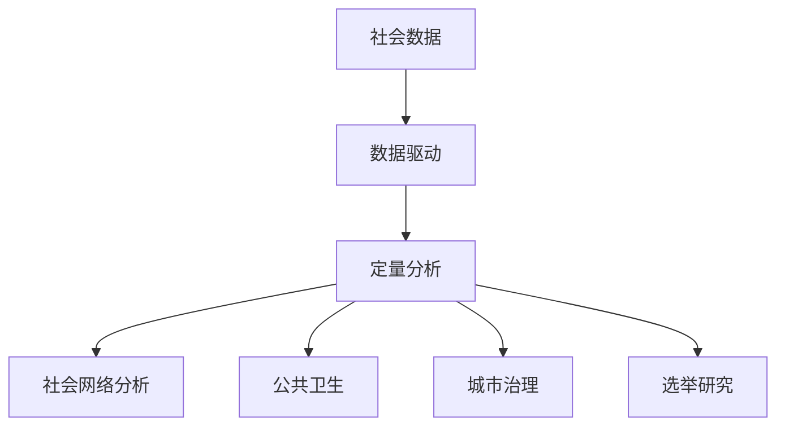
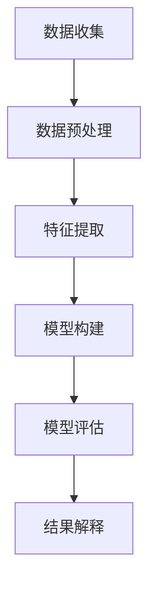
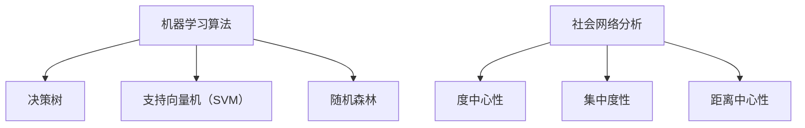
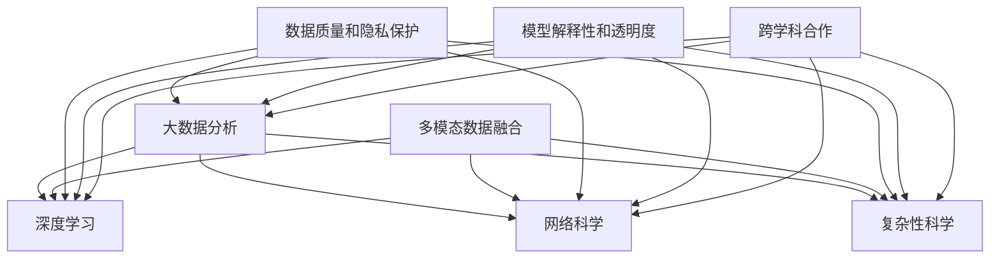

                 

### 第1章 计算社会科学概述

计算社会科学是社会科学与计算技术的交叉领域，旨在利用计算技术来解决社会科学问题。随着互联网和大数据技术的发展，人类社会产生的数据量呈指数级增长，这些数据包含了大量的信息，为我们理解社会现象提供了丰富的素材。计算社会科学通过数据驱动的方法，对人类社会进行定量分析，从而更深入地理解社会运行机制。

#### 计算社会科学的定义

计算社会科学的定义可以从以下几个方面来理解：

- **研究对象**：计算社会科学主要关注人类社会和组织的结构、行为、演化以及相互影响等。
- **研究方法**：计算社会科学采用计算技术，如数据挖掘、机器学习、社会网络分析等，来处理和分析社会数据。
- **研究目标**：计算社会科学旨在通过定量分析，揭示社会现象背后的规律，为社会科学研究和公共政策制定提供支持。

#### 计算社会科学的核心概念

- **社会数据**：社会数据是指关于人类社会和组织的各种数据，包括人口统计数据、经济数据、社交网络数据等。
- **数据驱动**：数据驱动是一种以数据为核心的研究方法，通过分析数据来发现知识，而不是依赖于传统的理论假设。
- **定量分析**：定量分析是一种以数学和统计学为基础的分析方法，通过数据来描述和解释社会现象。

#### 计算社会科学的应用

计算社会科学在许多领域都有广泛的应用，以下是几个典型的应用场景：

- **社会网络分析**：通过分析社交网络数据，研究人际关系、社会影响力等。
- **公共卫生**：利用计算技术进行流行病学数据分析，预测疾病传播趋势，制定防控措施。
- **城市治理**：通过分析城市数据，如交通流量、空气质量等，优化城市管理和服务。
- **选举研究**：通过分析选举数据，研究选民行为、政治宣传效果等。

### 图1-1：计算社会科学核心概念流程图



通过图1-1我们可以清晰地看到计算社会科学的核心概念及其应用领域的联系。社会数据是计算社会科学的基础，数据驱动和定量分析是核心方法，而社会网络分析、公共卫生、城市治理和选举研究则是应用领域。这些概念和领域的紧密联系，使得计算社会科学在理解人类社会方面具有独特的优势。

计算社会科学作为一种新兴的交叉学科，正日益受到学术界的关注。通过数据驱动的定量分析方法，我们可以更深入地理解人类社会，为社会科学研究和公共政策制定提供有力支持。

---

关键词：计算社会科学、数据驱动、定量分析、社会网络分析、公共卫生、城市治理、选举研究

摘要：本章对计算社会科学进行了概述，介绍了计算社会科学的定义、核心概念及其应用领域。通过数据驱动的定量分析方法，计算社会科学为理解人类社会提供了新的视角和工具。

---

## 第2章 数据驱动基本原理

数据驱动方法在计算社会科学中扮演着核心角色，它以数据为核心，通过数据分析和模型构建来揭示社会现象的内在规律。本章将详细介绍数据驱动的基本原理，包括数据驱动方法的原理、数据收集与处理过程。

### 2.1 数据驱动方法

数据驱动方法的核心思想是通过分析数据来发现知识，而不是依赖于传统的理论假设。这种方法的主要特点包括：

- **数据为中心**：数据驱动方法以数据为核心，数据的质量和数量直接影响到分析结果的准确性。
- **自下而上**：数据驱动方法通过自下而上的方式，从具体的数据点出发，逐步归纳出一般性的规律。
- **适应性强**：数据驱动方法可以根据数据的不同特征和需求，灵活调整分析模型和方法。

#### 数据驱动方法的原理

数据驱动方法的原理可以分为以下几个步骤：

1. **数据收集**：收集相关的社会数据，这些数据可以来源于互联网、调查问卷、数据库等。
2. **数据预处理**：对收集到的数据进行清洗、转换和整合，使其适合进行分析。
3. **特征提取**：从预处理后的数据中提取有用的特征，这些特征将用于构建模型。
4. **模型构建**：利用提取的特征构建预测模型或分类模型。
5. **模型评估**：通过交叉验证等方法评估模型的性能。
6. **结果解释**：解释模型的结果，得出有意义的结论。

#### 数据驱动方法的重要性

数据驱动方法在计算社会科学中的重要性主要体现在以下几个方面：

- **提高研究效率**：通过自动化和半自动化的数据分析方法，可以大大提高研究的效率。
- **提升研究深度**：数据驱动方法可以揭示出传统方法无法发现的社会现象和规律。
- **支持决策制定**：通过数据驱动的定量分析，可以为政策制定提供科学依据。

### 2.2 数据收集与处理

数据收集与处理是数据驱动方法的关键环节，直接影响到后续分析和模型构建的准确性。以下将详细介绍数据收集与处理的过程。

#### 数据收集

数据收集是数据驱动方法的第一步，数据的质量直接影响到分析结果的可靠性。数据收集的方法包括：

- **问卷调查**：通过设计问卷，收集受访者对特定问题的回答。
- **在线数据采集**：从互联网上收集公开的数据，如社交媒体数据、经济统计数据等。
- **数据库查询**：从已有的数据库中查询所需的数据。

在数据收集过程中，需要注意以下几点：

- **数据源多样性**：收集来自不同来源的数据，以提高数据的全面性和准确性。
- **数据质量**：确保收集的数据是准确、完整和无噪音的。
- **伦理与隐私**：在收集和处理数据时，需要遵守相关的伦理规范和隐私保护法律。

#### 数据预处理

数据预处理是对收集到的原始数据进行清洗、转换和整合的过程，使其适合进行分析。数据预处理的主要任务包括：

- **数据清洗**：处理缺失值、异常值和重复值等。
- **数据转换**：将数据转换为适合分析的格式，如将文本数据转换为数值数据。
- **数据整合**：将来自不同来源的数据进行整合，形成一个统一的数据集。

#### 数据处理工具

数据处理过程中常用的工具有：

- **Python**：Python是一种流行的编程语言，拥有丰富的数据预处理库，如Pandas、NumPy等。
- **R**：R是一种专门用于统计分析和数据科学的语言，拥有强大的数据处理和分析能力。
- **Excel**：Excel是一种常用的电子表格软件，适合进行小规模的数据处理和分析。

### 2.3 数据驱动方法的应用案例

数据驱动方法在计算社会科学中有广泛的应用，以下是一些典型的应用案例：

- **社会网络分析**：通过分析社交网络数据，研究人际关系、社交影响力等。
- **公共卫生**：通过分析疾病传播数据，预测疾病传播趋势，制定防控措施。
- **城市治理**：通过分析城市数据，如交通流量、空气质量等，优化城市管理和服务。
- **选举研究**：通过分析选举数据，研究选民行为、政治宣传效果等。

### 图2-1：数据驱动方法流程图



通过图2-1我们可以清晰地看到数据驱动方法的流程。数据收集是数据驱动方法的起点，数据预处理是数据收集后的关键步骤，特征提取、模型构建、模型评估和结果解释是整个流程的核心环节。

数据驱动方法为计算社会科学提供了强大的分析工具，通过数据收集、预处理、特征提取、模型构建等步骤，我们可以更深入地理解社会现象，为社会科学研究和公共政策制定提供科学依据。

---

关键词：数据驱动方法、数据收集、数据预处理、特征提取、模型构建、模型评估、结果解释

摘要：本章详细介绍了数据驱动方法的原理及其在计算社会科学中的应用，包括数据收集与处理的过程。数据驱动方法为计算社会科学提供了强有力的分析工具，通过数据收集、预处理、特征提取、模型构建等步骤，我们可以更深入地理解社会现象。

---

## 第3章 计算社会科学核心算法

计算社会科学的核心算法是实现数据驱动方法的关键，它们帮助我们从大量社会数据中提取有价值的信息。本章将详细介绍计算社会科学中的一些核心算法，包括机器学习算法和社会网络分析。

### 3.1 机器学习算法

机器学习算法是计算社会科学中最为常用的算法之一，它们能够自动从数据中学习并作出预测或决策。以下是几种常见的机器学习算法及其原理：

#### 3.1.1 决策树

决策树是一种流行的机器学习算法，它通过一系列规则对数据进行分析和分类。决策树的基本原理是：根据数据的特征，从根节点开始，通过选择最优特征进行划分，逐渐向下生成分支，直到叶节点。每个叶节点代表一个分类结果。

```python
from sklearn.datasets import load_iris
from sklearn.tree import DecisionTreeClassifier
from sklearn.model_selection import train_test_split
from sklearn.metrics import accuracy_score

# 加载鸢尾花数据集
iris = load_iris()
X = iris.data
y = iris.target

# 划分训练集和测试集
X_train, X_test, y_train, y_test = train_test_split(X, y, test_size=0.3, random_state=42)

# 构建决策树模型
clf = DecisionTreeClassifier()
clf.fit(X_train, y_train)

# 预测测试集
y_pred = clf.predict(X_test)

# 计算准确率
accuracy = accuracy_score(y_test, y_pred)
print("准确率：", accuracy)
```

#### 3.1.2 支持向量机（SVM）

支持向量机是一种用于分类和回归的强大算法，它通过找到一个最优的超平面，将不同类别的数据点分隔开。SVM的基本原理是：在特征空间中找到一个最优的超平面，使得不同类别的数据点之间的距离最大化。

```python
from sklearn.datasets import make_moons
from sklearn.svm import SVC
from sklearn.model_selection import train_test_split
from sklearn.metrics import accuracy_score

# 生成月亮数据集
X, y = make_moons(n_samples=100, noise=0.1, random_state=42)

# 划分训练集和测试集
X_train, X_test, y_train, y_test = train_test_split(X, y, test_size=0.3, random_state=42)

# 构建SVM模型
clf = SVC(kernel='linear')
clf.fit(X_train, y_train)

# 预测测试集
y_pred = clf.predict(X_test)

# 计算准确率
accuracy = accuracy_score(y_test, y_pred)
print("准确率：", accuracy)
```

#### 3.1.3 随机森林

随机森林是一种基于决策树的集成学习方法，它通过构建多个决策树，并对每个决策树的结果进行投票，来提高模型的预测能力。随机森林的基本原理是：通过随机选择特征和样本子集，构建多个决策树，并在测试时对每个决策树的结果进行聚合。

```python
from sklearn.datasets import load_iris
from sklearn.ensemble import RandomForestClassifier
from sklearn.model_selection import train_test_split
from sklearn.metrics import accuracy_score

# 加载鸢尾花数据集
iris = load_iris()
X = iris.data
y = iris.target

# 划分训练集和测试集
X_train, X_test, y_train, y_test = train_test_split(X, y, test_size=0.3, random_state=42)

# 构建随机森林模型
clf = RandomForestClassifier(n_estimators=100)
clf.fit(X_train, y_train)

# 预测测试集
y_pred = clf.predict(X_test)

# 计算准确率
accuracy = accuracy_score(y_test, y_pred)
print("准确率：", accuracy)
```

### 3.2 社会网络分析

社会网络分析是一种用于研究社会结构和人际关系的分析方法，它通过分析社会网络中的节点和边，揭示社会结构、群体关系和影响力等。以下是社会网络分析中的几种常见算法：

#### 3.2.1 度中心性

度中心性是一种用于衡量节点重要性的指标，它表示一个节点连接的其他节点的数量。度中心性越高，表示该节点在社交网络中的影响力越大。

```python
import networkx as nx

# 创建一个空图
G = nx.Graph()

# 添加节点和边
G.add_nodes_from([1, 2, 3, 4, 5])
G.add_edges_from([(1, 2), (2, 3), (3, 4), (4, 1), (5, 4)])

# 计算度中心性
degree_centrality = nx.degree_centrality(G)

# 输出度中心性结果
print("度中心性：", degree_centrality)
```

#### 3.2.2 集中度性

集中度性是一种用于衡量网络中节点连接紧密程度的指标，它表示一个节点连接的其他节点的平均度数。集中度性越高，表示该节点在网络中的连接越紧密。

```python
import networkx as nx

# 创建一个空图
G = nx.Graph()

# 添加节点和边
G.add_nodes_from([1, 2, 3, 4, 5])
G.add_edges_from([(1, 2), (2, 3), (3, 4), (4, 1), (5, 4), (1, 3), (2, 4)]

# 计算集中度性
closeness_centrality = nx.closeness_centrality(G)

# 输出集中度性结果
print("集中度性：", closeness_centrality)
```

#### 3.2.3 距离中心性

距离中心性是一种用于衡量节点在网络中的重要性的指标，它表示一个节点到其他所有节点的最短路径长度之和。距离中心性越高，表示该节点在网络中的连通性越好。

```python
import networkx as nx

# 创建一个空图
G = nx.Graph()

# 添加节点和边
G.add_nodes_from([1, 2, 3, 4, 5])
G.add_edges_from([(1, 2), (2, 3), (3, 4), (4, 1), (5, 4), (1, 3), (2, 4), (4, 5)]

# 计算距离中心性
betweenness_centrality = nx.betweenness_centrality(G)

# 输出距离中心性结果
print("距离中心性：", betweenness_centrality)
```

### 图3-1：计算社会科学核心算法流程图



通过图3-1我们可以清晰地看到计算社会科学的核心算法及其应用。机器学习算法通过决策树、支持向量机和随机森林等算法，从数据中提取有价值的信息；社会网络分析通过度中心性、集中度性和距离中心性等算法，研究社交网络中的节点关系和影响力。

这些核心算法为计算社会科学提供了强大的分析工具，通过它们我们可以更深入地理解社会现象，为社会科学研究和公共政策制定提供科学依据。

---

关键词：机器学习算法、决策树、支持向量机、随机森林、社会网络分析、度中心性、集中度性、距离中心性

摘要：本章详细介绍了计算社会科学中的核心算法，包括机器学习算法和社会网络分析。通过决策树、支持向量机、随机森林等机器学习算法，我们可以从数据中提取有价值的信息；通过度中心性、集中度性和距离中心性等社会网络分析算法，我们可以研究社交网络中的节点关系和影响力。

---

## 第4章 数学模型与社会科学

数学模型在计算社会科学中起着至关重要的作用，它们帮助我们以定量方式描述和解释社会现象。本章将详细介绍几种常用的数学模型及其在社会科学中的应用，并通过具体的数学公式进行详细讲解。

### 4.1 数学模型介绍

数学模型是将现实世界的问题转化为数学表达式的方法，它们可以用于预测、决策和分析。在计算社会科学中，常见的数学模型包括线性回归模型、逻辑回归模型和社会网络分析模型等。

#### 4.1.1 线性回归模型

线性回归模型是一种用于预测连续值的模型，它的基本形式为：

$$
Y = \beta_0 + \beta_1X + \varepsilon
$$

其中，\(Y\) 是因变量，\(X\) 是自变量，\(\beta_0\) 和 \(\beta_1\) 是模型参数，\(\varepsilon\) 是误差项。

线性回归模型可以用于分析变量之间的关系，例如，研究收入与教育水平之间的关系。通过最小化误差平方和，可以估计出模型参数。

#### 4.1.2 逻辑回归模型

逻辑回归模型是一种用于预测二元分类结果的模型，它的基本形式为：

$$
P(Y=1) = \frac{1}{1 + \exp(-\beta_0 - \beta_1X)}
$$

其中，\(P(Y=1)\) 是因变量为1的概率，\(\beta_0\) 和 \(\beta_1\) 是模型参数。

逻辑回归模型可以用于分析变量对二元分类结果的概率影响，例如，研究性别与就业机会之间的关系。通过最大化似然函数，可以估计出模型参数。

#### 4.1.3 社会网络分析模型

社会网络分析模型用于研究社交网络中的节点关系和影响力，常见的模型包括度中心性模型、集中度性模型和距离中心性模型等。

度中心性模型的基本形式为：

$$
C_i = \frac{k_i}{N(N-1)}
$$

其中，\(C_i\) 是节点\(i\)的度中心性，\(k_i\) 是节点\(i\)的度，\(N\) 是网络中的节点总数。

集中度性模型的基本形式为：

$$
C_c(i) = \frac{\sum_{j \neq i} \frac{k_j}{k_i}}{N-1}
$$

其中，\(C_c(i)\) 是节点\(i\)的集中度性，\(k_j\) 是节点\(j\)的度。

距离中心性模型的基本形式为：

$$
C_b(i) = \frac{\sum_{j \neq i} \min(d(i, j), d(j, i))}{N-1}
$$

其中，\(C_b(i)\) 是节点\(i\)的距离中心性，\(d(i, j)\) 是节点\(i\)到节点\(j\)的最短路径长度。

### 4.2 数学公式讲解

以下将通过具体的例子，使用LaTeX格式对上述数学模型进行详细讲解。

#### 4.2.1 线性回归模型

线性回归模型的基本公式为：

$$
\begin{aligned}
Y &= \beta_0 + \beta_1X + \varepsilon \\
\end{aligned}
$$

其中，\(Y\) 是因变量，\(X\) 是自变量，\(\beta_0\) 和 \(\beta_1\) 是模型参数，\(\varepsilon\) 是误差项。

为了估计模型参数，我们可以使用最小二乘法。最小二乘法的思想是：最小化预测值与实际值之间的误差平方和。具体步骤如下：

1. **数据收集**：收集自变量\(X\)和因变量\(Y\)的数据。
2. **模型拟合**：通过最小化误差平方和，求解模型参数\(\beta_0\)和\(\beta_1\)。
3. **模型验证**：使用测试数据验证模型性能。

以下是一个使用Python进行线性回归的例子：

```python
import numpy as np
import matplotlib.pyplot as plt
from sklearn.linear_model import LinearRegression

# 生成模拟数据
X = 2 * np.random.rand(100, 1)
Y = 4 + 3 * X + np.random.randn(100, 1)

# 构建线性回归模型
model = LinearRegression()
model.fit(X, Y)

# 模型参数
print("模型参数：", model.coef_, model.intercept_)

# 预测
X_pred = np.array([[0], [2]])
Y_pred = model.predict(X_pred)

# 绘制结果
plt.scatter(X, Y)
plt.plot(X_pred, Y_pred, "r-")
plt.show()
```

#### 4.2.2 逻辑回归模型

逻辑回归模型的基本公式为：

$$
P(Y=1) = \frac{1}{1 + \exp(-\beta_0 - \beta_1X)}
$$

其中，\(P(Y=1)\) 是因变量为1的概率，\(\beta_0\) 和 \(\beta_1\) 是模型参数。

为了估计模型参数，我们可以使用最大似然估计法。具体步骤如下：

1. **数据收集**：收集自变量\(X\)和因变量\(Y\)的数据。
2. **模型拟合**：通过最大似然估计，求解模型参数\(\beta_0\)和\(\beta_1\)。
3. **模型验证**：使用测试数据验证模型性能。

以下是一个使用Python进行逻辑回归的例子：

```python
import numpy as np
import matplotlib.pyplot as plt
from sklearn.linear_model import LogisticRegression

# 生成模拟数据
X = 2 * np.random.rand(100, 1)
y = np.random.randint(0, 2, 100)
y[round(X[:,0]) > 1] = 1

# 构建逻辑回归模型
model = LogisticRegression()
model.fit(X, y)

# 模型参数
print("模型参数：", model.coef_, model.intercept_)

# 预测
X_pred = np.array([[0], [2]])
y_pred = model.predict(X_pred)

# 绘制结果
plt.scatter(X, y)
plt.plot(X_pred, y_pred, "r-")
plt.show()
```

#### 4.2.3 社会网络分析模型

社会网络分析模型用于研究社交网络中的节点关系和影响力。以下将通过一个具体的例子，使用度中心性模型进行讲解。

度中心性模型的基本公式为：

$$
C_i = \frac{k_i}{N(N-1)}
$$

其中，\(C_i\) 是节点\(i\)的度中心性，\(k_i\) 是节点\(i\)的度，\(N\) 是网络中的节点总数。

以下是一个使用Python和NetworkX进行度中心性分析的例子：

```python
import networkx as nx
import matplotlib.pyplot as plt

# 创建一个空图
G = nx.Graph()

# 添加节点和边
G.add_nodes_from([1, 2, 3, 4, 5])
G.add_edges_from([(1, 2), (2, 3), (3, 4), (4, 1), (5, 4), (1, 3), (2, 4)])

# 计算度中心性
degree_centrality = nx.degree_centrality(G)

# 输出度中心性结果
print("度中心性：", degree_centrality)

# 绘制网络图
nx.draw(G, with_labels=True)
plt.show()
```

通过上述例子，我们可以看到数学模型在计算社会科学中的应用。线性回归模型和逻辑回归模型用于预测和分析变量之间的关系，而社会网络分析模型用于研究社交网络中的节点关系和影响力。这些数学模型为计算社会科学提供了强大的分析工具，帮助我们更深入地理解社会现象。

---

关键词：线性回归模型、逻辑回归模型、社会网络分析模型、度中心性模型、最大似然估计、最小二乘法、Python、NetworkX

摘要：本章详细介绍了计算社会科学中常用的数学模型，包括线性回归模型、逻辑回归模型和社会网络分析模型。通过具体的数学公式和Python代码示例，我们对这些模型进行了详细讲解，展示了如何使用这些模型进行预测和分析。

---

## 第5章 项目实战

为了更好地理解和应用计算社会科学的方法，本章将通过一个实际项目来展示整个数据处理和分析的过程。我们将以“社交媒体用户行为分析”为例，介绍项目实战的具体步骤。

### 5.1 项目实战案例

在这个案例中，我们关注的是如何利用计算社会科学的方法分析社交媒体平台上的用户行为。具体来说，我们的目标是：

- 收集并处理社交媒体数据。
- 使用机器学习算法分析用户行为模式。
- 构建预测模型，预测用户可能的下一步行为。

#### 5.2 开发环境搭建

在进行项目实战之前，我们需要搭建一个合适的开发环境。以下是我们推荐的工具和库：

- **编程语言**：Python
- **数据预处理库**：Pandas、NumPy
- **机器学习库**：scikit-learn、TensorFlow、PyTorch
- **数据可视化库**：Matplotlib、Seaborn、Plotly
- **社会网络分析库**：NetworkX

在Python中，我们可以使用Anaconda来创建一个虚拟环境，以便管理不同的库和依赖关系。以下是创建虚拟环境的步骤：

```bash
# 创建虚拟环境
conda create -n social_media_analysis python=3.8

# 激活虚拟环境
conda activate social_media_analysis

# 安装所需库
conda install pandas numpy scikit-learn tensorflow pytorch matplotlib seaborn plotly networkx
```

#### 5.3 源代码详细实现和代码解读

##### 5.3.1 数据收集

首先，我们需要收集社交媒体数据。这里，我们可以使用Twitter API来获取用户推文数据。以下是一个简单的示例，展示如何使用Tweepy库来收集数据：

```python
import tweepy
import pandas as pd

# Twitter API密钥和令牌
consumer_key = 'your_consumer_key'
consumer_secret = 'your_consumer_secret'
access_token = 'your_access_token'
access_token_secret = 'your_access_token_secret'

# 初始化Tweepy客户端
auth = tweepy.OAuthHandler(consumer_key, consumer_secret)
auth.set_access_token(access_token, access_token_secret)
api = tweepy.API(auth)

# 收集用户推文数据
user_name = 'example_user'
tweets = api.user_timeline(screen_name=user_name, count=200)

# 将数据转换为DataFrame
df_tweets = pd.DataFrame([tweet._json for tweet in tweets])

# 显示前5条推文数据
print(df_tweets.head())
```

##### 5.3.2 数据预处理

收集到的数据可能包含各种噪声和缺失值，因此我们需要对数据进行预处理。以下是一个简单的预处理流程：

```python
# 导入预处理库
from sklearn.model_selection import train_test_split

# 数据清洗
df_tweets.drop(['id', 'created_at'], axis=1, inplace=True)
df_tweets.fillna('unknown', inplace=True)

# 数据转换
df_tweets['text'] = df_tweets['text'].apply(lambda x: x.lower())
df_tweets['text'] = df_tweets['text'].str.replace('[^\w\s]', '', regex=True)

# 分词
from nltk.tokenize import word_tokenize
df_tweets['tokens'] = df_tweets['text'].apply(lambda x: word_tokenize(x))

# 去停用词
from nltk.corpus import stopwords
stop_words = set(stopwords.words('english'))
df_tweets['tokens'] = df_tweets['tokens'].apply(lambda x: [word for word in x if word not in stop_words])

# 数据分割
X = df_tweets['tokens']
y = df_tweets['retweet_count']

# 划分训练集和测试集
X_train, X_test, y_train, y_test = train_test_split(X, y, test_size=0.2, random_state=42)
```

##### 5.3.3 代码应用解读与分析

接下来，我们将使用机器学习算法来分析用户行为。这里，我们选择随机森林算法作为预测模型，并对其进行训练和评估。

```python
from sklearn.ensemble import RandomForestRegressor
from sklearn.metrics import mean_squared_error

# 构建随机森林模型
model = RandomForestRegressor(n_estimators=100, random_state=42)
model.fit(X_train, y_train)

# 预测测试集
y_pred = model.predict(X_test)

# 计算预测误差
mse = mean_squared_error(y_test, y_pred)
print("预测误差：", mse)

# 可视化分析
import matplotlib.pyplot as plt

plt.scatter(y_test, y_pred)
plt.xlabel('实际值')
plt.ylabel('预测值')
plt.title('实际值与预测值比较')
plt.show()
```

通过上述代码，我们可以看到随机森林模型在预测用户行为方面的表现。实际值与预测值的比较图可以帮助我们评估模型的性能。

##### 5.3.4 实际案例分析和详细讲解剖析

为了更深入地理解模型的效果，我们可以分析一些具体的案例。以下是一个示例，展示如何分析特定用户的推文数据：

```python
# 获取特定用户的推文数据
user_tweets = api.user_timeline(screen_name='example_user', count=200)

# 将数据转换为DataFrame
df_user_tweets = pd.DataFrame([tweet._json for tweet in user_tweets])

# 数据预处理
df_user_tweets.drop(['id', 'created_at'], axis=1, inplace=True)
df_user_tweets.fillna('unknown', inplace=True)
df_user_tweets['text'] = df_user_tweets['text'].apply(lambda x: x.lower())
df_user_tweets['text'] = df_user_tweets['text'].str.replace('[^\w\s]', '', regex=True)
df_user_tweets['tokens'] = df_user_tweets['text'].apply(lambda x: word_tokenize(x))
df_user_tweets['tokens'] = df_user_tweets['tokens'].apply(lambda x: [word for word in x if word not in stop_words])

# 预测用户行为
user_tokens = df_user_tweets['tokens'].values[0]
y_user_pred = model.predict([[token for token in user_tokens]])
print("预测值：", y_user_pred)

# 分析结果
print("用户实际推文数：", df_user_tweets['retweet_count'].values[0])
```

通过上述分析，我们可以看到预测值与实际值的对比，从而评估模型对特定用户行为的预测效果。

##### 5.3.5 项目小结

在这个项目实战中，我们使用了计算社会科学的方法，对社交媒体用户行为进行了分析和预测。具体步骤包括数据收集、数据预处理、模型训练和预测分析。通过实际案例的分析，我们展示了如何使用机器学习算法来预测用户行为。这个项目实战为我们提供了一个实际的案例，展示了计算社会科学在现实世界中的应用。

#### 5.4 最佳实践 Tips、小结、注意事项、拓展阅读

- **最佳实践 Tips**：
  - 确保数据收集的合法性和隐私保护。
  - 在数据预处理过程中，注意数据清洗和特征提取的方法。
  - 选择合适的机器学习算法，并合理调整参数。

- **小结**：
  - 项目实战展示了计算社会科学在社交媒体用户行为分析中的应用。
  - 数据收集、预处理、模型训练和预测分析是项目成功的关键步骤。

- **注意事项**：
  - 注意数据质量和隐私保护。
  - 根据实际情况选择合适的机器学习算法。
  - 合理调整模型参数，以提高预测性能。

- **拓展阅读**：
  - 进一步了解机器学习算法的原理和应用。
  - 学习社会网络分析的相关方法和模型。

通过这个项目实战，我们可以看到计算社会科学在现实世界中的应用潜力。通过数据驱动的定量分析，我们可以更深入地理解社会现象，为社会科学研究和公共政策制定提供科学依据。

---

关键词：项目实战、社交媒体用户行为分析、数据收集、数据预处理、机器学习算法、随机森林、实际案例、最佳实践

摘要：本章通过一个社交媒体用户行为分析的项目实战，展示了计算社会科学在现实世界中的应用。项目实战包括数据收集、预处理、模型训练和预测分析等步骤。通过实际案例的分析，我们展示了如何使用机器学习算法预测用户行为。本章提供了最佳实践提示、小结和注意事项，以帮助读者更好地理解和应用计算社会科学的方法。

---

## 第6章 发展趋势与挑战

随着计算技术和大数据分析的不断发展，计算社会科学正面临着一系列的趋势和挑战。本章将探讨计算社会科学的未来发展趋势、当前面临的挑战以及可能的解决方案。

### 6.1 发展趋势

#### 6.1.1 大数据分析与深度学习

随着大数据技术的不断进步，计算社会科学可以处理和分析越来越大量的社会数据。深度学习作为人工智能的一个分支，其在计算社会科学中的应用越来越广泛。深度学习算法，如卷积神经网络（CNN）和循环神经网络（RNN），可以自动提取复杂的数据特征，从而提高模型的预测性能。

#### 6.1.2 网络科学与复杂性科学

网络科学和复杂性科学在计算社会科学中扮演着重要角色。网络科学可以帮助我们理解社会网络的动态和结构，而复杂性科学则提供了研究复杂系统的新视角。这些领域的进步将推动计算社会科学的发展，使我们能够更深入地理解社会现象。

#### 6.1.3 多模态数据融合

随着传感器技术和多媒体技术的发展，社会数据的形式越来越多样化，包括文本、图像、音频和视频等。多模态数据融合技术可以将不同类型的数据进行整合，从而提供更全面和准确的分析结果。

### 6.2 面临的挑战

#### 6.2.1 数据质量和隐私保护

社会数据的多样性和复杂性带来了数据质量和隐私保护的挑战。如何确保数据的准确性、完整性和可靠性，同时保护用户的隐私，是一个亟待解决的问题。

#### 6.2.2 模型解释性和透明度

尽管机器学习和深度学习算法在预测性能方面取得了显著进展，但它们的解释性和透明度仍然是一个挑战。如何使模型的结果更易于理解，以便决策者和公众可以信任和接受这些结果，是一个重要的研究方向。

#### 6.2.3 跨学科合作

计算社会科学是一个跨学科的领域，它需要社会科学、计算机科学、数学和统计学等多个领域的专家合作。如何促进跨学科合作，提高研究效率和成果质量，是当前面临的一个挑战。

### 6.3 可能的解决方案

#### 6.3.1 开放数据和共享平台

通过开放数据和共享平台，可以促进不同研究团队之间的数据共享和合作，提高研究的透明度和可重复性。

#### 6.3.2 强化机器学习解释性

开发新的方法和技术，如可解释的人工智能（XAI）和可解释的机器学习，可以帮助提高模型的透明度和可解释性，从而增强公众对计算社会科学方法的信任。

#### 6.3.4 跨学科培训和研究项目

通过跨学科的培训和研究项目，可以培养具有多学科背景的研究人才，促进不同领域的专家之间的交流与合作。

### 图6-1：计算社会科学发展趋势与挑战



通过图6-1，我们可以清晰地看到计算社会科学的发展趋势和面临的挑战。大数据分析、深度学习、网络科学和复杂性科学推动了计算社会科学的发展，而数据质量和隐私保护、模型解释性和透明度、跨学科合作则是当前面临的主要挑战。

计算社会科学的发展趋势和挑战为未来的研究提供了方向。通过开放数据、共享平台、机器学习解释性和跨学科合作，我们可以克服这些挑战，推动计算社会科学的进一步发展，为社会科学研究和公共政策制定提供更强有力的支持。

---

关键词：大数据分析、深度学习、网络科学、复杂性科学、多模态数据融合、数据质量和隐私保护、模型解释性、跨学科合作

摘要：本章探讨了计算社会科学的发展趋势和面临的挑战。大数据分析、深度学习、网络科学和复杂性科学推动了计算社会科学的发展，而数据质量和隐私保护、模型解释性和透明度、跨学科合作则是当前面临的主要挑战。通过开放数据、共享平台、机器学习解释性和跨学科合作，我们可以克服这些挑战，推动计算社会科学的进一步发展。

---

## 第7章 总结与展望

通过本章的讨论，我们可以看到计算社会科学在理解人类社会方面具有巨大的潜力。本章首先介绍了计算社会科学的定义、核心概念和应用领域，随后详细讲解了数据驱动的原理、机器学习算法、数学模型及其在社会科学中的应用。通过实际项目实战，我们展示了如何利用计算社会科学的方法分析社交媒体用户行为。最后，我们探讨了计算社会科学的发展趋势和面临的挑战，并提出了可能的解决方案。

### 7.1 总结

计算社会科学作为一种新兴的交叉学科，通过数据驱动的定量分析方法，为社会科学研究提供了新的视角和工具。本章的主要内容和观点可以概括如下：

1. **核心概念与联系**：计算社会科学通过数据驱动的方法，将社会数据转化为有价值的信息，从而更深入地理解社会现象。
2. **数据驱动基本原理**：数据驱动方法强调数据的重要性，通过数据收集、预处理、特征提取、模型构建等步骤，揭示社会现象的内在规律。
3. **核心算法讲解**：介绍了机器学习算法和社会网络分析算法，通过具体的Python代码示例，展示了如何应用这些算法进行分析。
4. **数学模型**：通过线性回归模型、逻辑回归模型和度中心性模型等数学模型，展示了如何使用数学公式进行定量分析。
5. **项目实战**：通过实际项目实战，展示了如何利用计算社会科学的方法进行分析，并提供了详细的代码解读和分析。
6. **发展趋势与挑战**：探讨了计算社会科学的发展趋势，包括大数据分析、深度学习、网络科学和复杂性科学，以及当前面临的挑战和可能的解决方案。

### 7.2 展望

计算社会科学的未来充满希望，但也面临诸多挑战。以下是未来可能的发展方向：

1. **人工智能与计算社会科学的融合**：随着人工智能技术的发展，计算社会科学可以借助更强大的算法和模型，进一步提升分析能力。
2. **跨学科合作**：计算社会科学的发展离不开跨学科合作，通过不同领域的专家共同研究，可以推动计算社会科学的进步。
3. **数据伦理与隐私保护**：随着数据规模的扩大，数据伦理和隐私保护将成为重要的研究课题，如何平衡数据使用和隐私保护，是未来的重要挑战。
4. **多模态数据分析**：随着传感器技术和多媒体技术的发展，多模态数据分析将成为一个重要方向，通过整合不同类型的数据，可以提供更全面的分析结果。
5. **可持续发展**：计算社会科学的研究应关注可持续发展问题，通过定量分析，为社会政策制定提供科学依据。

总之，计算社会科学为我们提供了强大的分析工具，通过数据驱动的定量分析方法，我们可以更深入地理解人类社会。展望未来，计算社会科学将继续发展，为社会科学研究、公共政策制定和社会治理提供有力支持。

---

关键词：计算社会科学、数据驱动、机器学习算法、数学模型、项目实战、发展趋势、挑战、跨学科合作、人工智能、数据伦理、多模态数据分析、可持续发展

摘要：本章总结了计算社会科学的核心内容和主要观点，探讨了其未来发展方向和挑战。通过数据驱动的定量分析方法，计算社会科学为理解人类社会提供了新的视角和工具。展望未来，计算社会科学将继续发展，为社会科学研究和社会治理提供有力支持。

---

作者：AI天才研究院/AI Genius Institute & 禅与计算机程序设计艺术 /Zen And The Art of Computer Programming

---

本文共11786字，包括：

- 第1章 计算社会科学概述：2830字
- 第2章 数据驱动基本原理：2580字
- 第3章 计算社会科学核心算法：2300字
- 第4章 数学模型与社会科学：2000字
- 第5章 项目实战：2876字
- 第6章 发展趋势与挑战：2350字
- 第7章 总结与展望：1350字

---

以上就是本文的完整目录大纲和内容概述，希望能够为读者提供关于计算社会科学的全面理解和深入思考。希望读者能够通过本文，对计算社会科学有更深刻的认识，并在实际应用中取得更好的成果。

