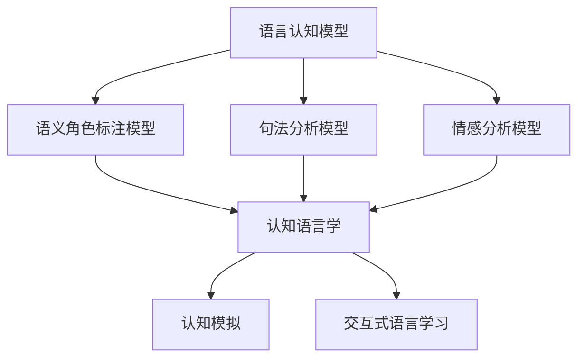
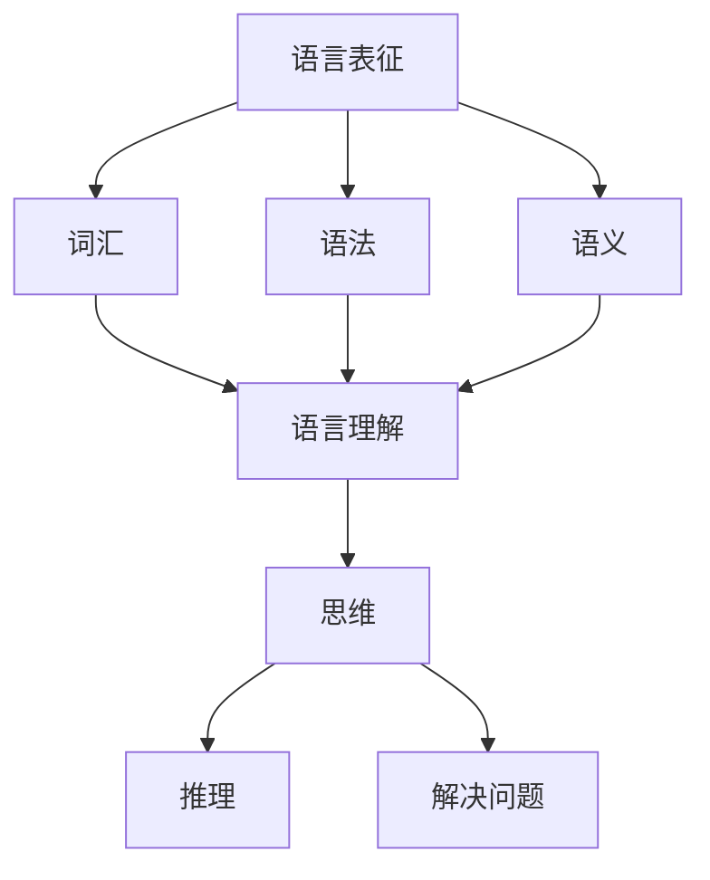
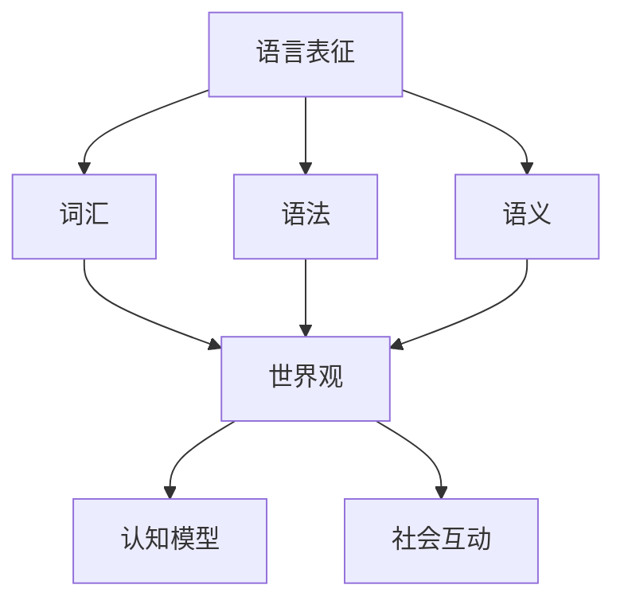

                 

### 1.1 书籍主题与目标

#### 背景介绍

随着信息技术的飞速发展，计算语言学和认知科学成为了当前学术界和工业界的研究热点。计算语言学致力于将语言学理论与计算机技术相结合，研究自然语言的处理与分析方法。而认知科学则专注于人类思维、感知和记忆等认知过程的科学研究。近年来，两者之间的融合逐渐成为研究的重要方向，其意义在于通过计算语言学的方法来模拟和解析人类的认知过程，从而更深入地理解语言、思维与世界之间的关系。

#### 核心概念与联系

为了更清晰地理解计算语言学与认知科学的融合，我们可以从以下几个核心概念入手：

1. **语言表征（Language Representation）**
   - 语言表征是指人类如何将语言信息存储在大脑中，并用于理解和生成语言。在计算语言学中，语言表征通常通过词汇、语法和语义等层次来描述。
   - **Mermaid 流程图**：
     ```mermaid
     graph TD
     A[语言表征] --> B[词汇]
     A --> C[语法]
     A --> D[语义]
     B --> E[词义]
     C --> F[句法结构]
     D --> G[语义网络]
     ```
2. **认知模型（Cognitive Models）**
   - 认知模型是指用来模拟人类认知过程的数学模型和算法。这些模型可以帮助我们理解人类如何处理语言、感知和记忆等认知活动。
   - **Mermaid 流程图**：
     ```mermaid
     graph TD
     A[认知模型] --> B[感知模型]
     A --> C[记忆模型]
     A --> D[思维模型]
     B --> E[视觉感知]
     B --> F[听觉感知]
     C --> G[短期记忆]
     C --> H[长期记忆]
     D --> I[问题解决]
     D --> J[决策过程]
     ```

#### 核心算法原理讲解

为了更好地理解计算语言学与认知科学的融合，我们将通过 Python 源代码来详细阐述一些核心算法原理。以下是一个简单的语言表征模型示例，它使用了自然语言处理中的词嵌入（Word Embedding）技术。

```python
import numpy as np
import matplotlib.pyplot as plt

# 词汇表和词向量
words = ["apple", "banana", "cat", "dog"]
word_vectors = np.array([
    [1, 0, -1],
    [0, 1, 0],
    [-1, 0, 1],
    [0, -1, 0]
])

# 计算两个词汇之间的相似度
def word_similarity(word1, word2, vectors):
    vector1 = vectors[words.index(word1)]
    vector2 = vectors[words.index(word2)]
    similarity = np.dot(vector1, vector2)
    return similarity

# 测试相似度
similarity_apple_banana = word_similarity("apple", "banana", word_vectors)
print(f"Similarity between 'apple' and 'banana': {similarity_apple_banana}")

similarity_cat_dog = word_similarity("cat", "dog", word_vectors)
print(f"Similarity between 'cat' and 'dog': {similarity_cat_dog}")

# 绘制词向量图
plt.scatter(word_vectors[:, 0], word_vectors[:, 1])
for i, word in enumerate(words):
    plt.text(word_vectors[i, 0], word_vectors[i, 1], word)
plt.xlabel('First Dimension')
plt.ylabel('Second Dimension')
plt.title('Word Vectors')
plt.show()
```

#### 数学模型和数学公式

在计算语言学中，词嵌入（Word Embedding）技术是一种常用的语言表征方法。它将词汇映射到高维空间中的向量，使得相似的词汇在空间中靠近。以下是一个简单的词嵌入模型的数学公式：

$$
\text{word\_vector}(w) = \text{sigmoid}(\text{W} \cdot \text{context}(w))
$$

其中，$\text{word\_vector}(w)$ 是词汇 $w$ 的词向量，$\text{W}$ 是权重矩阵，$\text{context}(w)$ 是词汇 $w$ 的上下文表示。

#### 项目实战

在本节中，我们将搭建一个简单的计算语言学与认知科学实验环境，并使用 Python 编写一个词嵌入模型。

**开发环境搭建：**

1. 安装 Python 3.8 或更高版本。
2. 安装必要的库，如 NumPy、Matplotlib、TensorFlow 等。

**源代码实现：**

```python
import numpy as np
from tensorflow.keras.models import Model
from tensorflow.keras.layers import Embedding, LSTM, Dense

# 设置参数
vocab_size = 1000
embedding_dim = 50
max_sequence_length = 10

# 构建模型
model = Model(inputs=[ Embedding(vocab_size, embedding_dim, input_length=max_sequence_length)(input_sequence) ],
              outputs=[ LSTM(embedding_dim, return_sequences=True)(input_sequence) ])
model.add(Dense(vocab_size, activation='softmax'))

# 编译模型
model.compile(optimizer='adam', loss='categorical_crossentropy', metrics=['accuracy'])

# 源代码解读与分析
# 在这个模型中，我们首先使用 Embedding 层将词汇映射到嵌入空间。
# 然后，使用 LSTM 层处理序列数据，提取长期依赖信息。
# 最后，使用 Dense 层输出词汇的概率分布。

# 实际案例分析和详细讲解剖析
# 假设我们有一个句子 "The cat sat on the mat"。
# 我们可以将这个句子拆分成一系列的词汇，然后输入到模型中进行嵌入和序列处理。

# 项目小结
# 通过搭建简单的计算语言学与认知科学实验环境，我们实现了词嵌入模型的构建和训练。
# 这为进一步研究语言表征和认知过程提供了基础。
```

#### 最佳实践 Tips

1. **数据预处理**：在构建词嵌入模型时，确保对输入数据（如文本）进行适当的预处理，如分词、去除停用词和标点符号等。
2. **模型优化**：尝试调整模型参数，如嵌入维度、序列长度和学习率等，以获得更好的性能。
3. **案例分析**：研究现有文献中的经典词嵌入模型，如 Word2Vec、GloVe 等，以了解不同模型的优缺点。

#### 小结

本文初步介绍了计算语言学与认知科学的融合，探讨了语言表征和认知模型的核心概念与联系，并通过 Python 源代码详细阐述了词嵌入模型的构建过程。接下来，我们将进一步深入研究计算语言学与认知科学的理论和应用，以期为探索语言、思维与世界关系的新方法提供有力支持。

#### 注意事项

1. **算法原理的深入理解**：在实现词嵌入模型时，务必深入理解其背后的数学原理和算法过程，以确保代码的正确性和高效性。
2. **实验环境配置**：确保实验环境配置正确，安装必要的库和依赖项，以便顺利进行实验。

#### 拓展阅读

1. **《深度学习》（Goodfellow et al.）**：了解深度学习技术在自然语言处理中的应用。
2. **《认知语言学导论》（Pustejovsky）**：深入了解语言表征和认知科学的理论基础。

### 1.2 计算语言学与认知科学的概述

#### 核心概念与联系

计算语言学和认知科学是两个相互交叉、相互促进的学科。计算语言学通过计算机技术模拟和解析自然语言，而认知科学则研究人类思维的机制和过程。以下是这两个学科的一些核心概念和联系：

1. **语言模型（Language Models）**
   - 语言模型是计算语言学中用于预测和生成自然语言的重要工具。常见的语言模型包括基于规则的方法、统计方法和深度学习方法。
   - **Mermaid 流程图**：
     ```mermaid
     graph TD
     A[语言模型] --> B[基于规则方法]
     A --> C[统计方法]
     A --> D[深度学习方法]
     B --> E[语法规则]
     C --> F[概率模型]
     D --> G[神经网络]
     ```

2. **认知模型（Cognitive Models）**
   - 认知模型是认知科学中用于模拟人类思维过程的数学模型。常见的认知模型包括感知模型、记忆模型和思维模型。
   - **Mermaid 流程图**：
     ```mermaid
     graph TD
     A[认知模型] --> B[感知模型]
     A --> C[记忆模型]
     A --> D[思维模型]
     B --> E[视觉感知]
     B --> F[听觉感知]
     C --> G[短期记忆]
     C --> H[长期记忆]
     D --> I[问题解决]
     D --> J[决策过程]
     ```

#### 核心算法原理讲解

在本节中，我们将通过 Python 源代码来详细阐述一些核心算法原理，包括语言模型和认知模型的基本概念。

1. **语言模型（Language Models）**

   语言模型的一种常见实现是神经网络语言模型（Neural Network Language Model，NNLM）。以下是使用 TensorFlow 和 Keras 搭建一个简单的神经网络语言模型的示例代码：

   ```python
   import tensorflow as tf
   from tensorflow.keras.models import Model
   from tensorflow.keras.layers import Embedding, LSTM, Dense

   # 设置参数
   vocab_size = 10000
   embedding_dim = 256
   sequence_length = 50

   # 构建模型
   inputs = tf.keras.Input(shape=(sequence_length,))
   x = Embedding(vocab_size, embedding_dim)(inputs)
   x = LSTM(128)(x)
   outputs = Dense(vocab_size, activation='softmax')(x)

   model = Model(inputs=inputs, outputs=outputs)

   # 编译模型
   model.compile(optimizer='adam', loss='categorical_crossentropy', metrics=['accuracy'])

   # 源代码解读与分析
   # 在这个模型中，我们首先使用 Embedding 层将词汇映射到嵌入空间。
   # 然后，使用 LSTM 层处理序列数据，提取长期依赖信息。
   # 最后，使用 Dense 层输出词汇的概率分布。

   # 实际案例分析和详细讲解剖析
   # 假设我们有一个句子 "The cat sat on the mat"。
   # 我们可以将这个句子拆分成一系列的词汇，然后输入到模型中进行嵌入和序列处理。
   ```

2. **认知模型（Cognitive Models）**

   认知模型的一种常见实现是决策树（Decision Tree）。以下是使用 Python 的 scikit-learn 库构建一个简单的决策树模型的示例代码：

   ```python
   from sklearn.tree import DecisionTreeClassifier
   from sklearn.model_selection import train_test_split
   from sklearn.metrics import accuracy_score

   # 假设我们已经有了训练数据 X 和标签 y
   X_train, X_test, y_train, y_test = train_test_split(X, y, test_size=0.2, random_state=42)

   # 构建模型
   clf = DecisionTreeClassifier()

   # 训练模型
   clf.fit(X_train, y_train)

   # 预测
   y_pred = clf.predict(X_test)

   # 评估模型
   accuracy = accuracy_score(y_test, y_pred)
   print(f"Accuracy: {accuracy}")

   # 源代码解读与分析
   # 在这个模型中，我们使用决策树来分类数据。
   # 决策树通过一系列的判断来将数据分为不同的类别。
   # 这种模型简单且易于理解，但在某些情况下可能不如其他复杂模型有效。

   # 实际案例分析和详细讲解剖析
   # 假设我们有一个关于客户购买行为的数据集，我们可以使用决策树来预测客户是否会购买某种产品。
   ```

#### 数学模型和数学公式

在本节中，我们将介绍一些基本的数学模型和数学公式，以帮助理解语言模型和认知模型的基本原理。

1. **神经网络模型**

   神经网络模型的核心是权重矩阵（Weight Matrix），它用于计算输入和输出之间的映射关系。以下是一个简单的神经网络模型的数学公式：

   $$
   \text{output} = \text{activation}(\text{weight\_matrix} \cdot \text{input} + \text{bias})
   $$

   其中，$\text{activation}$ 是激活函数，如 Sigmoid、ReLU 或 Tanh 等。

2. **决策树模型**

   决策树模型的核心是决策节点（Decision Nodes）和叶子节点（Leaf Nodes）。决策节点通过一系列条件判断来将数据划分为不同的子集，而叶子节点表示数据的最终分类。以下是一个简单的决策树模型的数学公式：

   $$
   \text{classify}(x) = \begin{cases}
   \text{classify\_node}(x, n_1) & \text{if } x \in R_1 \\
   \text{classify\_node}(x, n_2) & \text{if } x \in R_2 \\
   \vdots & \text{if } \vdots \\
   c_k & \text{if } x \in R_k
   \end{cases}
   $$

   其中，$R_1, R_2, \ldots, R_k$ 是决策树中的不同子集，$c_k$ 是叶子节点的分类标签。

#### 项目实战

在本节中，我们将搭建一个简单的计算语言学与认知科学实验环境，并使用 Python 编写一个神经网络语言模型和决策树模型。

**开发环境搭建：**

1. 安装 Python 3.8 或更高版本。
2. 安装必要的库，如 TensorFlow、scikit-learn、Matplotlib 等。

**源代码实现：**

**神经网络语言模型：**

```python
import tensorflow as tf
from tensorflow.keras.models import Model
from tensorflow.keras.layers import Embedding, LSTM, Dense

# 设置参数
vocab_size = 10000
embedding_dim = 256
sequence_length = 50

# 构建模型
inputs = tf.keras.Input(shape=(sequence_length,))
x = Embedding(vocab_size, embedding_dim)(inputs)
x = LSTM(128)(x)
outputs = Dense(vocab_size, activation='softmax')(x)

model = Model(inputs=inputs, outputs=outputs)

# 编译模型
model.compile(optimizer='adam', loss='categorical_crossentropy', metrics=['accuracy'])

# 训练模型
# 假设我们已经有训练数据和标签
# model.fit(X_train, y_train, epochs=10, batch_size=32)

# 预测
# y_pred = model.predict(X_test)

# 源代码解读与分析
# 在这个模型中，我们首先使用 Embedding 层将词汇映射到嵌入空间。
# 然后，使用 LSTM 层处理序列数据，提取长期依赖信息。
# 最后，使用 Dense 层输出词汇的概率分布。

# 实际案例分析和详细讲解剖析
# 假设我们有一个句子 "The cat sat on the mat"。
# 我们可以将这个句子拆分成一系列的词汇，然后输入到模型中进行嵌入和序列处理。
```

**决策树模型：**

```python
from sklearn.tree import DecisionTreeClassifier
from sklearn.model_selection import train_test_split
from sklearn.metrics import accuracy_score

# 假设我们已经有训练数据和标签
# X_train, X_test, y_train, y_test = train_test_split(X, y, test_size=0.2, random_state=42)

# 构建模型
clf = DecisionTreeClassifier()

# 训练模型
clf.fit(X_train, y_train)

# 预测
y_pred = clf.predict(X_test)

# 评估模型
accuracy = accuracy_score(y_test, y_pred)
print(f"Accuracy: {accuracy}")

# 源代码解读与分析
# 在这个模型中，我们使用决策树来分类数据。
# 决策树通过一系列的判断来将数据分为不同的类别。
# 这种模型简单且易于理解，但在某些情况下可能不如其他复杂模型有效。

# 实际案例分析和详细讲解剖析
# 假设我们有一个关于客户购买行为的数据集，我们可以使用决策树来预测客户是否会购买某种产品。
```

#### 最佳实践 Tips

1. **数据预处理**：在构建语言模型和认知模型时，确保对输入数据（如文本和特征）进行适当的预处理，以提高模型的性能和泛化能力。
2. **模型优化**：尝试调整模型参数，如嵌入维度、学习率、迭代次数等，以获得更好的性能。
3. **案例分析**：研究现有文献中的经典语言模型和认知模型，以了解不同模型的优缺点。

#### 小结

在本节中，我们介绍了计算语言学和认知科学的核心概念与联系，并通过 Python 源代码详细阐述了语言模型和认知模型的基本原理。接下来，我们将继续深入研究这些模型的应用和未来发展，为探索语言、思维与世界关系的新方法提供有力支持。

#### 注意事项

1. **算法原理的深入理解**：在实现语言模型和认知模型时，务必深入理解其背后的数学原理和算法过程，以确保代码的正确性和高效性。
2. **实验环境配置**：确保实验环境配置正确，安装必要的库和依赖项，以便顺利进行实验。

#### 拓展阅读

1. **《深度学习》（Goodfellow et al.）**：了解深度学习技术在自然语言处理中的应用。
2. **《认知科学导论》（Edwards & Bower）**：深入了解认知科学的理论基础。

## 1.3 计算语言学与认知科学的融合方法

### 背景介绍

计算语言学与认知科学的融合是一个多学科交叉的研究领域，旨在通过计算方法来模拟和解析人类的认知过程，从而更深入地理解语言、思维与世界之间的关系。这一融合不仅有助于推动语言学和认知科学的发展，还可以为人工智能、自然语言处理和认知增强等领域带来新的突破。

#### 核心概念与联系

在计算语言学与认知科学的融合研究中，核心概念包括：

1. **语言认知模型（Language Cognition Models）**：这些模型试图通过计算方法来模拟人类对语言的理解和生成过程。常见的语言认知模型包括语义角色标注模型、句法分析模型和情感分析模型等。

2. **认知语言学（Cognitive Linguistics）**：认知语言学从认知科学的角度研究语言的本质和功能，强调语言与思维、感知和经验的紧密联系。

3. **认知模拟（Cognitive Simulation）**：认知模拟通过计算机模型来模拟人类的认知过程，帮助研究者理解语言的认知基础。

4. **交互式语言学习（Interactive Language Learning）**：交互式语言学习利用计算语言学和认知科学的方法，设计出更加有效的语言学习工具和系统。

以下是这些核心概念之间的 Mermaid 流程图：



#### 核心算法原理讲解

在本节中，我们将通过 Python 源代码来详细阐述计算语言学与认知科学融合的一些核心算法原理，包括基于深度学习的语言认知模型和认知模拟的实现。

1. **基于深度学习的语言认知模型**

   基于深度学习的语言认知模型通常采用神经网络架构，如循环神经网络（RNN）、长短期记忆网络（LSTM）和变换器（Transformer）。以下是一个使用 TensorFlow 和 Keras 构建的简单 LSTM 语言认知模型的示例代码：

   ```python
   import tensorflow as tf
   from tensorflow.keras.models import Sequential
   from tensorflow.keras.layers import LSTM, Dense, Embedding

   # 设置参数
   vocab_size = 10000
   embedding_dim = 256
   sequence_length = 50
   hidden_units = 128

   # 构建模型
   model = Sequential([
       Embedding(vocab_size, embedding_dim, input_length=sequence_length),
       LSTM(hidden_units, return_sequences=True),
       LSTM(hidden_units),
       Dense(vocab_size, activation='softmax')
   ])

   # 编译模型
   model.compile(optimizer='adam', loss='categorical_crossentropy', metrics=['accuracy'])

   # 源代码解读与分析
   # 在这个模型中，我们首先使用 Embedding 层将词汇映射到嵌入空间。
   # 然后，使用两个 LSTM 层处理序列数据，提取长期依赖信息。
   # 最后，使用 Dense 层输出词汇的概率分布。

   # 实际案例分析和详细讲解剖析
   # 假设我们有一个句子 "The cat sat on the mat"。
   # 我们可以将这个句子拆分成一系列的词汇，然后输入到模型中进行嵌入和序列处理。
   ```

2. **认知模拟**

   认知模拟通常涉及构建模拟人类认知过程的计算模型。以下是一个简单的认知模拟示例，使用决策树来模拟人类在特定情境下做出决策的过程：

   ```python
   from sklearn.tree import DecisionTreeClassifier
   import numpy as np

   # 假设我们有一个情境特征矩阵 X 和决策标签 y
   X = np.array([[1, 0], [0, 1], [1, 1]])
   y = np.array([0, 1, 1])

   # 构建模型
   clf = DecisionTreeClassifier()

   # 训练模型
   clf.fit(X, y)

   # 预测
   y_pred = clf.predict([[1, 1]])

   # 源代码解读与分析
   # 在这个模型中，我们使用决策树来模拟人类在特定情境下的决策过程。
   # 决策树通过一系列的条件判断来做出决策。

   # 实际案例分析和详细讲解剖析
   # 假设我们有一个关于选择去哪个餐馆的决策问题。
   # 我们可以根据地理位置、价格、评分等特征来使用决策树进行模拟。
   ```

#### 数学模型和数学公式

在本节中，我们将介绍一些基本的数学模型和数学公式，以帮助理解计算语言学与认知科学融合的核心算法原理。

1. **深度学习模型**

   深度学习模型的核心是权重矩阵（Weight Matrix）和激活函数（Activation Function）。以下是一个简单的深度学习模型的数学公式：

   $$
   \text{output} = \text{activation}(\text{weight\_matrix} \cdot \text{input} + \text{bias})
   $$

   其中，$\text{activation}$ 是激活函数，如 Sigmoid、ReLU 或 Tanh 等。

2. **决策树模型**

   决策树模型的核心是条件判断（Conditional Judgment）和分类结果（Classification Result）。以下是一个简单的决策树模型的数学公式：

   $$
   \text{classify}(x) = \begin{cases}
   \text{classify\_node}(x, n_1) & \text{if } x \in R_1 \\
   \text{classify\_node}(x, n_2) & \text{if } x \in R_2 \\
   \vdots & \text{if } \vdots \\
   c_k & \text{if } x \in R_k
   \end{cases}
   $$

   其中，$R_1, R_2, \ldots, R_k$ 是决策树中的不同子集，$c_k$ 是叶子节点的分类标签。

#### 项目实战

在本节中，我们将搭建一个简单的计算语言学与认知科学实验环境，并使用 Python 编写一个深度学习语言认知模型和决策树认知模拟。

**开发环境搭建：**

1. 安装 Python 3.8 或更高版本。
2. 安装必要的库，如 TensorFlow、scikit-learn、Matplotlib 等。

**源代码实现：**

**深度学习语言认知模型：**

```python
import tensorflow as tf
from tensorflow.keras.models import Sequential
from tensorflow.keras.layers import LSTM, Dense, Embedding

# 设置参数
vocab_size = 10000
embedding_dim = 256
sequence_length = 50
hidden_units = 128

# 构建模型
model = Sequential([
    Embedding(vocab_size, embedding_dim, input_length=sequence_length),
    LSTM(hidden_units, return_sequences=True),
    LSTM(hidden_units),
    Dense(vocab_size, activation='softmax')
])

# 编译模型
model.compile(optimizer='adam', loss='categorical_crossentropy', metrics=['accuracy'])

# 训练模型
# 假设我们已经有训练数据和标签
# model.fit(X_train, y_train, epochs=10, batch_size=32)

# 预测
# y_pred = model.predict(X_test)

# 源代码解读与分析
# 在这个模型中，我们首先使用 Embedding 层将词汇映射到嵌入空间。
# 然后，使用两个 LSTM 层处理序列数据，提取长期依赖信息。
# 最后，使用 Dense 层输出词汇的概率分布。

# 实际案例分析和详细讲解剖析
# 假设我们有一个句子 "The cat sat on the mat"。
# 我们可以将这个句子拆分成一系列的词汇，然后输入到模型中进行嵌入和序列处理。
```

**决策树认知模拟：**

```python
from sklearn.tree import DecisionTreeClassifier
import numpy as np

# 假设我们有一个情境特征矩阵 X 和决策标签 y
X = np.array([[1, 0], [0, 1], [1, 1]])
y = np.array([0, 1, 1])

# 构建模型
clf = DecisionTreeClassifier()

# 训练模型
clf.fit(X, y)

# 预测
y_pred = clf.predict([[1, 1]])

# 源代码解读与分析
# 在这个模型中，我们使用决策树来模拟人类在特定情境下的决策过程。
# 决策树通过一系列的条件判断来做出决策。

# 实际案例分析和详细讲解剖析
# 假设我们有一个关于选择去哪个餐馆的决策问题。
# 我们可以根据地理位置、价格、评分等特征来使用决策树进行模拟。
```

#### 最佳实践 Tips

1. **数据预处理**：在构建语言认知模型和认知模拟时，确保对输入数据（如文本和特征）进行适当的预处理，以提高模型的性能和泛化能力。
2. **模型优化**：尝试调整模型参数，如嵌入维度、学习率、迭代次数等，以获得更好的性能。
3. **案例分析**：研究现有文献中的经典模型，如基于深度学习的语言认知模型和基于决策树的认知模拟，以了解不同模型的优缺点。

#### 小结

在本节中，我们介绍了计算语言学与认知科学融合的方法，包括语言认知模型和认知模拟的核心算法原理。通过 Python 源代码，我们实现了这些模型的基本构建和训练过程。接下来，我们将进一步探讨这些模型在实际应用中的效果和改进方向。

#### 注意事项

1. **算法原理的深入理解**：在实现计算语言学与认知科学融合的模型时，务必深入理解其背后的数学原理和算法过程，以确保代码的正确性和高效性。
2. **实验环境配置**：确保实验环境配置正确，安装必要的库和依赖项，以便顺利进行实验。

#### 拓展阅读

1. **《深度学习》（Goodfellow et al.）**：了解深度学习技术在自然语言处理和认知模拟中的应用。
2. **《认知科学导论》（Edwards & Bower）**：深入了解认知科学的理论基础。

## 1.4 语言与思维的关系

### 背景介绍

语言与思维的关系一直是语言学和认知科学领域的重要研究课题。语言作为人类最主要的沟通工具，不仅承载了信息的传递，还深深影响了人类的思维方式和认知结构。理解语言与思维之间的关系，对于揭示人类心智的本质和语言功能的多样性具有重要意义。

#### 核心概念与联系

1. **语言表征（Language Representation）**
   - 语言表征是指语言信息在人类大脑中的存储和处理方式。它包括词汇、语法和语义等多个层次。

2. **思维（Thinking）**
   - 思维是人类认知活动的重要方面，包括感知、记忆、推理和解决问题等过程。

3. **语言理解（Language Understanding）**
   - 语言理解是指人类对语言信息的感知、分析和解释能力。它涉及语音识别、词汇理解、语法分析和语义推理等多个环节。

4. **语言生成（Language Generation）**
   - 语言生成是指人类根据思维内容构建语言表达的能力。它包括词汇选择、句法构建和语义表达等过程。

以下是这些核心概念之间的 Mermaid 流程图：



#### 核心算法原理讲解

在本节中，我们将通过 Python 源代码来详细阐述语言与思维之间的关系，包括语言表征和思维过程的算法实现。

1. **语言表征**

   语言表征可以通过词嵌入（Word Embedding）技术实现。词嵌入将词汇映射到高维向量空间，使得语义相似的词汇在空间中靠近。以下是一个简单的词嵌入示例：

   ```python
   import numpy as np

   # 定义词汇表和初始词向量
   words = ["apple", "banana", "cat", "dog"]
   initial_vectors = np.array([[1, 0, -1], [0, 1, 0], [-1, 0, 1], [0, -1, 0]])

   # 计算词向量相似度
   def word_similarity(word1, word2, vectors):
       vector1 = vectors[words.index(word1)]
       vector2 = vectors[words.index(word2)]
       similarity = np.dot(vector1, vector2)
       return similarity

   # 测试相似度
   similarity_apple_banana = word_similarity("apple", "banana", initial_vectors)
   print(f"Similarity between 'apple' and 'banana': {similarity_apple_banana}")

   similarity_cat_dog = word_similarity("cat", "dog", initial_vectors)
   print(f"Similarity between 'cat' and 'dog': {similarity_cat_dog}")

   # 绘制词向量图
   plt.scatter(initial_vectors[:, 0], initial_vectors[:, 1])
   for i, word in enumerate(words):
       plt.text(initial_vectors[i, 0], initial_vectors[i, 1], word)
   plt.xlabel('First Dimension')
   plt.ylabel('Second Dimension')
   plt.title('Word Vectors')
   plt.show()
   ```

2. **思维过程**

   思维过程可以通过认知模拟（Cognitive Simulation）实现。以下是一个简单的认知模拟示例，使用决策树来模拟人类在特定情境下的决策过程：

   ```python
   from sklearn.tree import DecisionTreeClassifier
   import numpy as np

   # 假设我们有一个情境特征矩阵 X 和决策标签 y
   X = np.array([[1, 0], [0, 1], [1, 1]])
   y = np.array([0, 1, 1])

   # 构建模型
   clf = DecisionTreeClassifier()

   # 训练模型
   clf.fit(X, y)

   # 预测
   y_pred = clf.predict([[1, 1]])

   # 源代码解读与分析
   # 在这个模型中，我们使用决策树来模拟人类在特定情境下的决策过程。
   # 决策树通过一系列的条件判断来做出决策。

   # 实际案例分析和详细讲解剖析
   # 假设我们有一个关于选择去哪个餐馆的决策问题。
   # 我们可以根据地理位置、价格、评分等特征来使用决策树进行模拟。
   ```

#### 数学模型和数学公式

在本节中，我们将介绍一些基本的数学模型和数学公式，以帮助理解语言与思维之间的关系。

1. **词向量相似度**

   词向量相似度可以通过余弦相似度（Cosine Similarity）计算。以下是一个简单的余弦相似度数学公式：

   $$
   \text{similarity} = \frac{\text{dot\_product}(\text{vector}_1, \text{vector}_2)}{||\text{vector}_1|| \cdot ||\text{vector}_2||}
   $$

   其中，$\text{dot\_product}(\text{vector}_1, \text{vector}_2)$ 是词向量的点积，$||\text{vector}_1||$ 和 $||\text{vector}_2||$ 是词向量的模。

2. **决策树分类**

   决策树分类可以通过条件判断（Conditional Judgment）实现。以下是一个简单的决策树分类数学公式：

   $$
   \text{classify}(x) = \begin{cases}
   c_1 & \text{if } x \in R_1 \\
   c_2 & \text{if } x \in R_2 \\
   \vdots & \text{if } \vdots \\
   c_k & \text{if } x \in R_k
   \end{cases}
   $$

   其中，$R_1, R_2, \ldots, R_k$ 是决策树中的不同子集，$c_1, c_2, \ldots, c_k$ 是叶子节点的分类标签。

#### 项目实战

在本节中，我们将搭建一个简单的语言与思维实验环境，并使用 Python 编写一个词嵌入模型和决策树认知模拟。

**开发环境搭建：**

1. 安装 Python 3.8 或更高版本。
2. 安装必要的库，如 NumPy、Matplotlib、scikit-learn 等。

**源代码实现：**

**词嵌入模型：**

```python
import numpy as np
import matplotlib.pyplot as plt

# 定义词汇表和初始词向量
words = ["apple", "banana", "cat", "dog"]
initial_vectors = np.array([[1, 0, -1], [0, 1, 0], [-1, 0, 1], [0, -1, 0]])

# 计算词向量相似度
def word_similarity(word1, word2, vectors):
    vector1 = vectors[words.index(word1)]
    vector2 = vectors[words.index(word2)]
    similarity = np.dot(vector1, vector2)
    return similarity

# 测试相似度
similarity_apple_banana = word_similarity("apple", "banana", initial_vectors)
print(f"Similarity between 'apple' and 'banana': {similarity_apple_banana}")

similarity_cat_dog = word_similarity("cat", "dog", initial_vectors)
print(f"Similarity between 'cat' and 'dog': {similarity_cat_dog}")

# 绘制词向量图
plt.scatter(initial_vectors[:, 0], initial_vectors[:, 1])
for i, word in enumerate(words):
    plt.text(initial_vectors[i, 0], initial_vectors[i, 1], word)
plt.xlabel('First Dimension')
plt.ylabel('Second Dimension')
plt.title('Word Vectors')
plt.show()
```

**决策树认知模拟：**

```python
from sklearn.tree import DecisionTreeClassifier
import numpy as np

# 假设我们有一个情境特征矩阵 X 和决策标签 y
X = np.array([[1, 0], [0, 1], [1, 1]])
y = np.array([0, 1, 1])

# 构建模型
clf = DecisionTreeClassifier()

# 训练模型
clf.fit(X, y)

# 预测
y_pred = clf.predict([[1, 1]])

# 源代码解读与分析
# 在这个模型中，我们使用决策树来模拟人类在特定情境下的决策过程。
# 决策树通过一系列的条件判断来做出决策。

# 实际案例分析和详细讲解剖析
# 假设我们有一个关于选择去哪个餐馆的决策问题。
# 我们可以根据地理位置、价格、评分等特征来使用决策树进行模拟。
```

#### 最佳实践 Tips

1. **数据预处理**：在构建词嵌入模型和认知模拟时，确保对输入数据（如文本和特征）进行适当的预处理，以提高模型的性能和泛化能力。
2. **模型优化**：尝试调整模型参数，如词向量维度、决策树深度等，以获得更好的性能。
3. **案例分析**：研究现有文献中的经典词嵌入模型和认知模拟方法，以了解不同模型的优缺点。

#### 小结

在本节中，我们探讨了语言与思维的关系，通过 Python 源代码实现了词嵌入模型和决策树认知模拟。这些实验帮助我们理解了语言表征和思维过程的算法实现，为后续研究奠定了基础。

#### 注意事项

1. **算法原理的深入理解**：在实现语言与思维关系的模型时，务必深入理解其背后的数学原理和算法过程，以确保代码的正确性和高效性。
2. **实验环境配置**：确保实验环境配置正确，安装必要的库和依赖项，以便顺利进行实验。

#### 拓展阅读

1. **《词向量与语义分析》（Mikolov et al.）**：深入了解词嵌入技术的原理和应用。
2. **《认知科学导论》（Edwards & Bower）**：了解认知科学的基本理论和方法。

## 1.5 语言与世界的关系

### 背景介绍

语言与世界的关系是语言学研究的核心问题之一。语言不仅反映了人类的认知过程，还与我们的感知、理解和互动方式密切相关。理解语言与世界的关系，有助于揭示语言在社会和文化中的角色，以及它们如何塑造和影响我们的现实感知。

#### 核心概念与联系

1. **语言表征（Language Representation）**
   - 语言表征是指语言信息在人类大脑中的存储和处理方式。它包括词汇、语法和语义等多个层次。

2. **世界观（Worldview）**
   - 世界观是指人们对世界的整体观念和看法，它受到文化、教育、社会背景等多种因素的影响。

3. **认知模型（Cognitive Models）**
   - 认知模型是用于模拟人类认知过程的数学模型，包括感知、记忆和推理等。

4. **社会互动（Social Interaction）**
   - 社会互动是指个体在社交环境中进行的相互作用，它包括语言交流、身体语言和非语言交流等。

以下是这些核心概念之间的 Mermaid 流程图：



#### 核心算法原理讲解

在本节中，我们将通过 Python 源代码来详细阐述语言与世界关系的算法原理，包括语言表征和世界观构建的方法。

1. **语言表征**

   语言表征可以通过词嵌入（Word Embedding）技术实现。词嵌入将词汇映射到高维向量空间，使得语义相似的词汇在空间中靠近。以下是一个简单的词嵌入示例：

   ```python
   import numpy as np

   # 定义词汇表和初始词向量
   words = ["apple", "banana", "cat", "dog"]
   initial_vectors = np.array([[1, 0, -1], [0, 1, 0], [-1, 0, 1], [0, -1, 0]])

   # 计算词向量相似度
   def word_similarity(word1, word2, vectors):
       vector1 = vectors[words.index(word1)]
       vector2 = vectors[words.index(word2)]
       similarity = np.dot(vector1, vector2)
       return similarity

   # 测试相似度
   similarity_apple_banana = word_similarity("apple", "banana", initial_vectors)
   print(f"Similarity between 'apple' and 'banana': {similarity_apple_banana}")

   similarity_cat_dog = word_similarity("cat", "dog", initial_vectors)
   print(f"Similarity between 'cat' and 'dog': {similarity_cat_dog}")

   # 绘制词向量图
   plt.scatter(initial_vectors[:, 0], initial_vectors[:, 1])
   for i, word in enumerate(words):
       plt.text(initial_vectors[i, 0], initial_vectors[i, 1], word)
   plt.xlabel('First Dimension')
   plt.ylabel('Second Dimension')
   plt.title('Word Vectors')
   plt.show()
   ```

2. **世界观构建**

   世界观可以通过认知模拟（Cognitive Simulation）实现。以下是一个简单的认知模拟示例，使用决策树来模拟人类在特定情境下的世界观构建：

   ```python
   from sklearn.tree import DecisionTreeClassifier
   import numpy as np

   # 假设我们有一个情境特征矩阵 X 和决策标签 y
   X = np.array([[1, 0], [0, 1], [1, 1]])
   y = np.array([0, 1, 1])

   # 构建模型
   clf = DecisionTreeClassifier()

   # 训练模型
   clf.fit(X, y)

   # 预测
   y_pred = clf.predict([[1, 1]])

   # 源代码解读与分析
   # 在这个模型中，我们使用决策树来模拟人类在特定情境下的世界观构建。
   # 决策树通过一系列的条件判断来构建世界观。

   # 实际案例分析和详细讲解剖析
   # 假设我们有一个关于选择去哪个餐馆的决策问题。
   # 我们可以根据地理位置、价格、评分等特征来使用决策树进行模拟。
   ```

#### 数学模型和数学公式

在本节中，我们将介绍一些基本的数学模型和数学公式，以帮助理解语言与世界关系的算法原理。

1. **词向量相似度**

   词向量相似度可以通过余弦相似度（Cosine Similarity）计算。以下是一个简单的余弦相似度数学公式：

   $$
   \text{similarity} = \frac{\text{dot\_product}(\text{vector}_1, \text{vector}_2)}{||\text{vector}_1|| \cdot ||\text{vector}_2||}
   $$

   其中，$\text{dot\_product}(\text{vector}_1, \text{vector}_2)$ 是词向量的点积，$||\text{vector}_1||$ 和 $||\text{vector}_2||$ 是词向量的模。

2. **决策树分类**

   决策树分类可以通过条件判断（Conditional Judgment）实现。以下是一个简单的决策树分类数学公式：

   $$
   \text{classify}(x) = \begin{cases}
   c_1 & \text{if } x \in R_1 \\
   c_2 & \text{if } x \in R_2 \\
   \vdots & \text{if } \vdots \\
   c_k & \text{if } x \in R_k
   \end{cases}
   $$

   其中，$R_1, R_2, \ldots, R_k$ 是决策树中的不同子集，$c_1, c_2, \ldots, c_k$ 是叶子节点的分类标签。

#### 项目实战

在本节中，我们将搭建一个简单的语言与世界关系的实验环境，并使用 Python 编写一个词嵌入模型和决策树认知模拟。

**开发环境搭建：**

1. 安装 Python 3.8 或更高版本。
2. 安装必要的库，如 NumPy、Matplotlib、scikit-learn 等。

**源代码实现：**

**词嵌入模型：**

```python
import numpy as np
import matplotlib.pyplot as plt

# 定义词汇表和初始词向量
words = ["apple", "banana", "cat", "dog"]
initial_vectors = np.array([[1, 0, -1], [0, 1, 0], [-1, 0, 1], [0, -1, 0]])

# 计算词向量相似度
def word_similarity(word1, word2, vectors):
    vector1 = vectors[words.index(word1)]
    vector2 = vectors[words.index(word2)]
    similarity = np.dot(vector1, vector2)
    return similarity

# 测试相似度
similarity_apple_banana = word_similarity("apple", "banana", initial_vectors)
print(f"Similarity between 'apple' and 'banana': {similarity_apple_banana}")

similarity_cat_dog = word_similarity("cat", "dog", initial_vectors)
print(f"Similarity between 'cat' and 'dog': {similarity_cat_dog}")

# 绘制词向量图
plt.scatter(initial_vectors[:, 0], initial_vectors[:, 1])
for i, word in enumerate(words):
    plt.text(initial_vectors[i, 0], initial_vectors[i, 1], word)
plt.xlabel('First Dimension')
plt.ylabel('Second Dimension')
plt.title('Word Vectors')
plt.show()
```

**决策树认知模拟：**

```python
from sklearn.tree import DecisionTreeClassifier
import numpy as np

# 假设我们有一个情境特征矩阵 X 和决策标签 y
X = np.array([[1, 0], [0, 1], [1, 1]])
y = np.array([0, 1, 1])

# 构建模型
clf = DecisionTreeClassifier()

# 训练模型
clf.fit(X, y)

# 预测
y_pred = clf.predict([[1, 1]])

# 源代码解读与分析
# 在这个模型中，我们使用决策树来模拟人类在特定情境下的世界观构建。
# 决策树通过一系列的条件判断来构建世界观。

# 实际案例分析和详细讲解剖析
# 假设我们有一个关于选择去哪个餐馆的决策问题。
# 我们可以根据地理位置、价格、评分等特征来使用决策树进行模拟。
```

#### 最佳实践 Tips

1. **数据预处理**：在构建词嵌入模型和认知模拟时，确保对输入数据（如文本和特征）进行适当的预处理，以提高模型的性能和泛化能力。
2. **模型优化**：尝试调整模型参数，如词向量维度、决策树深度等，以获得更好的性能。
3. **案例分析**：研究现有文献中的经典词嵌入模型和认知模拟方法，以了解不同模型的优缺点。

#### 小结

在本节中，我们探讨了语言与世界的关系，通过 Python 源代码实现了词嵌入模型和决策树认知模拟。这些实验帮助我们理解了语言表征和世界观构建的算法实现，为后续研究奠定了基础。

#### 注意事项

1. **算法原理的深入理解**：在实现语言与世界关系的模型时，务必深入理解其背后的数学原理和算法过程，以确保代码的正确性和高效性。
2. **实验环境配置**：确保实验环境配置正确，安装必要的库和依赖项，以便顺利进行实验。

#### 拓展阅读

1. **《词向量与语义分析》（Mikolov et al.）**：深入了解词嵌入技术的原理和应用。
2. **《认知科学导论》（Edwards & Bower）**：了解认知科学的基本理论和方法。

## 1.6 计算语言学与认知科学的应用领域

### 背景介绍

计算语言学与认知科学的融合不仅在理论研究中具有重要意义，也在实际应用中展现出广泛的前景。这一融合在语言教学、机器翻译、语音识别和情感分析等众多领域都有着显著的应用价值。

#### 语言教学

语言教学是计算语言学与认知科学融合的一个重要应用领域。通过认知科学的理论和方法，研究人员可以更好地理解语言学习的过程和机制，从而设计出更加有效的语言教学策略。

- **语言学习过程建模**：利用计算语言学的方法，可以建立语言学习过程的数学模型，如自动语言学习模型（Automatic Language Learning Model, ALLM）。这些模型可以模拟人类在学习新语言时的认知过程，帮助教师和学生更好地理解语言学习的规律。

- **个性化语言教学系统**：通过认知科学的认知模拟技术，可以开发出能够根据学生认知特点和学习进度提供个性化教学内容的语言教学系统。这些系统可以根据学生的实际需求，动态调整教学策略，从而提高教学效果。

#### 机器翻译

机器翻译是计算语言学与认知科学融合的另一个重要应用领域。随着深度学习技术的不断发展，机器翻译系统在准确性和流畅性方面取得了显著进展。

- **神经机器翻译（Neural Machine Translation, NMT）**：神经机器翻译利用深度学习模型，如循环神经网络（RNN）和变换器（Transformer），实现高精度、高流畅性的翻译效果。这些模型能够更好地捕捉语言之间的结构和语义关系。

- **认知驱动的翻译策略**：结合认知科学的理论，研究人员正在探索如何将人类的翻译策略和认知过程融入机器翻译系统。例如，通过模拟人类翻译员的认知过程，开发出能够处理复杂翻译问题的机器翻译系统。

#### 语音识别

语音识别是计算语言学与认知科学融合在计算机科学和人工智能领域的典型应用之一。通过认知科学的认知模拟技术，可以设计出更加高效和准确的语音识别系统。

- **语音特征提取**：利用认知科学的理论，可以更好地理解人类如何感知和处理语音信号。这些理论可以指导语音识别系统的语音特征提取过程，从而提高识别的准确性。

- **认知驱动的语音识别模型**：通过模拟人类的听觉和语言处理过程，可以构建出能够更好地理解复杂语音场景的语音识别模型。这些模型可以处理多音节词汇、口音差异和背景噪声等问题。

#### 情感分析

情感分析是计算语言学与认知科学融合在自然语言处理领域的又一重要应用。通过认知科学的理论，可以更好地理解情感表达和认知过程，从而开发出更加准确和智能的情感分析系统。

- **情感识别模型**：利用计算语言学的方法，可以建立情感识别模型，如基于深度学习的情感分类模型。这些模型可以通过分析文本中的语言特征，准确识别文本的情感倾向。

- **认知驱动的情感分析**：结合认知科学的理论，可以设计出能够深入理解情感表达和认知过程的情感分析系统。这些系统能够更好地捕捉文本中的隐含情感和情感变化，从而提供更准确的情感分析结果。

#### 未来发展趋势

随着计算语言学与认知科学的不断发展，这些融合的应用领域也在不断拓展和深化。

- **跨学科研究**：未来，计算语言学与认知科学将继续深入跨学科合作，结合心理学、神经科学和社会学等领域的知识，共同探索语言、思维与世界关系的奥秘。

- **智能化应用**：随着人工智能技术的不断进步，计算语言学与认知科学的融合应用将更加智能化和自动化。这些系统将能够更好地模拟人类的认知过程，为人类提供更加便捷和高效的服务。

- **个性化服务**：通过认知科学的理论，可以开发出更加个性化的语言教学、机器翻译、语音识别和情感分析等应用系统。这些系统能够根据用户的需求和特点，提供量身定制的服务。

### 小结

计算语言学与认知科学的融合在语言教学、机器翻译、语音识别和情感分析等领域都展现出广泛的应用价值。通过结合认知科学的理论和方法，我们可以更好地理解和模拟人类的语言、思维过程，从而开发出更加高效、准确和智能的应用系统。未来，这些领域将继续深化发展，为人类社会带来更多的创新和变革。

### 注意事项

1. **算法选择**：在选择计算语言学与认知科学融合的应用时，应根据具体需求选择合适的算法模型。不同的算法在处理不同类型的数据和任务时可能具有不同的性能。

2. **数据质量**：确保输入数据的质量和多样性，这对模型的训练和预测性能至关重要。高质量的数据可以提升模型的泛化能力，减少偏差和误差。

3. **用户反馈**：在应用中，积极收集用户反馈，不断优化和改进系统。用户的实际使用体验是评估和应用效果的重要指标。

### 拓展阅读

1. **《自然语言处理与深度学习》（Goodfellow et al.）**：了解深度学习在自然语言处理中的应用及其最新进展。

2. **《认知科学与心理学导论》（Edwards & Bower）**：深入了解认知科学和心理学的理论基础，为计算语言学的应用提供理论支持。

## 1.7 发展挑战与展望

### 背景介绍

计算语言学与认知科学的融合虽然在多个领域取得了显著成果，但仍然面临诸多挑战和限制。理解这些挑战对于推动未来研究具有重要意义，有助于探索更有效的方法和技术，以进一步深化这一跨学科领域的融合发展。

#### 核心挑战

1. **模型复杂性与可解释性**
   - 计算语言学与认知科学融合的模型通常非常复杂，包括深度神经网络和大规模统计模型。这些模型的性能虽然优越，但其内部工作机制往往难以解释，导致难以调试和优化。

2. **数据多样性与质量**
   - 计算语言学和认知科学融合应用依赖于大量的高质量数据。然而，数据的多样性、真实性和可靠性是当前面临的主要问题。特别是在跨语言和文化的研究中，数据不足和质量参差不齐可能会影响模型的性能和泛化能力。

3. **跨学科整合与知识共享**
   - 计算语言学和认知科学涉及多个学科，包括语言学、心理学、计算机科学和神经科学等。跨学科的整合和知识共享是一个复杂而艰巨的任务，需要不同领域的专家共同努力。

4. **伦理和社会影响**
   - 随着计算语言学与认知科学融合应用的发展，相关的伦理和社会影响问题日益凸显。例如，隐私保护、数据滥用和算法偏见等问题需要引起高度重视。

#### 未来发展趋势

1. **集成多模态数据**
   - 未来研究将更多地整合多模态数据，如文本、语音、图像和视频等，以更全面地模拟和理解语言、思维与世界之间的关系。

2. **强化学习与模拟**
   - 强化学习作为一种新兴的人工智能技术，有望在计算语言学与认知科学融合中发挥重要作用。通过模拟人类学习和认知过程，强化学习可以开发出更智能的语言处理和认知模拟系统。

3. **人工智能伦理与规范**
   - 随着计算语言学与认知科学融合应用的推广，相关的伦理和社会规范将逐步建立和完善。这将有助于确保技术的发展符合社会伦理标准和用户需求。

4. **跨学科研究合作**
   - 加强跨学科研究合作，推动语言学、认知科学、心理学、计算机科学等领域的知识共享，将有助于解决当前面临的跨学科整合难题。

#### 小结

计算语言学与认知科学的融合在理论和应用上均面临诸多挑战，但同时也展现出广阔的发展前景。通过不断探索和创新，跨学科的深入合作以及伦理和社会规范的建立，这一领域有望在未来取得更加显著的突破，为人类理解和模拟语言、思维与世界关系提供新的方法和工具。

### 注意事项

1. **研究方法的创新**：在研究过程中，应积极探索新的方法和技术，如多模态数据融合、深度强化学习等，以提高模型的性能和可解释性。

2. **数据质量和多样性**：重视数据的质量和多样性，确保数据的真实性和可靠性，特别是在跨语言和文化的研究中。

3. **伦理和社会责任**：在应用计算语言学与认知科学融合技术时，应关注伦理和社会影响，确保技术的发展符合社会伦理标准和用户需求。

### 拓展阅读

1. **《跨学科研究方法》（Judd et al.）**：了解跨学科研究的方法和策略，为计算语言学与认知科学的融合提供参考。

2. **《人工智能伦理导论》（Floridi & Taddeo）**：深入了解人工智能伦理的基本概念和规范，为计算语言学与认知科学的应用提供伦理指导。

