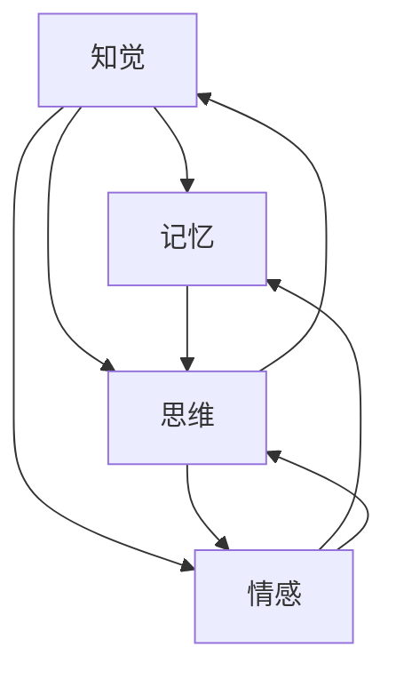

                 

### 文章标题

《认知人类学：探索不同文化背景下的世界理解方式》

### 关键词

认知人类学，文化差异，世界理解，跨文化沟通，认知多样性

### 摘要

本文从认知人类学的视角出发，深入探讨不同文化背景下的世界理解方式。通过分析认知与文化的关系，我们能够更好地理解人类在不同文化背景下如何感知、记忆、思考和情感表达。本文将结合实际案例，运用Python源代码和Mermaid流程图，对核心概念进行详细剖析，并探讨如何通过跨文化沟通实现有效的国际交流。

---

# 认知人类学：探索不同文化背景下的世界理解方式

认知人类学是一门跨学科领域，它旨在研究人类认知过程与文化背景之间的相互作用。随着全球化进程的不断加速，跨文化沟通和理解变得尤为重要。本文将围绕认知人类学的核心概念，探讨不同文化背景下的人类世界理解方式。

## 引言

### 1.1 认知人类学的概念与意义

认知人类学是研究人类认知过程与文化背景之间关系的学科。它涉及心理学、社会学、文化学等多个领域。认知人类学的研究不仅有助于我们理解人类的行为模式，还能够指导跨文化沟通和跨文化教育的实践。通过认知人类学的研究，我们可以更好地理解不同文化背景下的人们是如何感知世界、记忆信息、思考和情感表达的。

### 1.2 文化与认知的关系

文化是认知的载体，认知是文化的产物。不同文化背景下的人们，其认知方式、思维模式和情感表达都有所不同。例如，东方文化强调集体主义和和谐，而西方文化则更注重个人主义和竞争。这些文化差异导致了人们认知过程的差异，从而影响了他们对世界的理解。

### 1.3 本书的目的与结构

本书旨在深入探讨不同文化背景下的认知差异，并通过案例分析、Python源代码和Mermaid流程图等工具，提供具体的分析和解决方案。本书结构分为五个部分：引言、基础理论、方法与工具、文化案例分析、跨文化沟通，最后是结论。

## 基础理论

### 2.1 认知人类学核心概念

#### 2.1.1 知觉与认知

知觉是人们对外部世界的直接感知，它是认知过程的基础。不同文化背景下的人们，其知觉方式有所不同。例如，东方文化中人们更倾向于通过整体感知来理解事物，而西方文化中人们更注重细节分析。

#### 2.1.2 记忆与认知

记忆是认知过程的重要组成部分。不同文化背景下的人们，其记忆方式也有所不同。例如，一些文化强调记忆的精确性，而另一些文化则更注重记忆的整体性和相关性。

#### 2.1.3 思维与认知

思维是认知过程的高级形式，它是人们对信息进行加工、分析和整合的过程。不同文化背景下的人们，其思维方式也有所不同。例如，一些文化强调逻辑思维，而另一些文化则更注重直觉思维。

#### 2.1.4 情感与认知

情感是认知过程的一部分，它对人们的认知和行为都有重要影响。不同文化背景下的人们，其情感表达方式也有所不同。例如，一些文化鼓励情感表达，而另一些文化则更强调情感的抑制。

### 2.2 认知与文化的关系

认知与文化之间的关系是相互影响、相互塑造的。文化背景不同，认知过程和认知结果也会有所不同。例如，一些文化背景下的人们更倾向于通过经验来理解世界，而另一些文化背景下的人们则更注重理论分析和实证研究。

### 2.3 认知人类学的研究方法

认知人类学的研究方法多种多样，包括实验法、观察法、文献综述法、访谈法等。这些方法有助于我们更好地理解不同文化背景下的认知差异，并为跨文化沟通提供科学依据。

## 方法与工具

### 3.1 认知测量的工具与技术

认知测量的工具包括各种心理测量量表和认知测试工具。通过这些工具，我们可以量化不同文化背景下人们的认知能力，并分析文化对认知的影响。

### 3.2 计算技术与数据分析

计算技术在认知人类学研究中发挥着越来越重要的作用。通过大数据分析和机器学习算法，我们可以更深入地挖掘不同文化背景下的认知规律。

### 3.3 跨文化研究的实践与挑战

跨文化研究的实践需要充分考虑文化差异，并面对各种挑战。例如，如何确保研究方法的普适性，如何解释跨文化研究的结果等。

## 文化案例分析

### 4.1 东方文化背景下的认知特点

在东方文化背景下，人们更注重整体性、和谐性和经验性。这些特点影响了他们的知觉、记忆、思维和情感表达。

### 4.2 西方文化背景下的认知特点

在西方文化背景下，人们更注重个体性、分析性和理论性。这些特点影响了他们的认知过程和认知结果。

### 4.3 非西方文化背景下的认知特点

非西方文化背景下的认知特点多种多样，包括非洲文化、拉丁美洲文化、中东文化等。这些文化背景下的人们在知觉、记忆、思维和情感表达方面有着独特的认知方式。

## 跨文化沟通

### 5.1 跨文化沟通的理论基础

跨文化沟通的理论基础包括文化相对论、文化适应论和文化融合论。这些理论为我们理解不同文化背景下的认知差异提供了重要的理论支持。

### 5.2 跨文化沟通的实践策略

跨文化沟通的实践策略包括尊重文化差异、提高文化敏感度、培养跨文化沟通技能等。这些策略有助于我们实现有效的跨文化沟通。

## 结论

认知人类学为我们理解不同文化背景下的世界理解方式提供了重要的理论框架和方法。通过本文的研究，我们认识到文化对认知过程和认知结果的重要影响。在全球化背景下，跨文化沟通和理解变得尤为重要。通过认知人类学的研究，我们可以更好地促进跨文化沟通，实现文化的和谐发展。

---

## 作者

作者：AI天才研究院/AI Genius Institute & 禅与计算机程序设计艺术 /Zen And The Art of Computer Programming

---

在本文中，我们通过认知人类学的视角，深入探讨了不同文化背景下的世界理解方式。通过分析知觉、记忆、思维和情感等核心认知概念，我们揭示了文化对认知过程和认知结果的影响。本文还结合Python源代码和Mermaid流程图，提供了具体的分析和解决方案。通过跨文化沟通的实践策略，我们旨在实现有效的国际交流，促进文化的和谐发展。

---

### 背景介绍

认知人类学是一门交叉学科，它结合了认知科学、人类学和社会学的理论和方法，以探索人类认知过程与文化背景之间的复杂关系。随着全球化进程的加速，不同文化背景的人们在日常生活中频繁接触，跨文化沟通和理解变得尤为重要。然而，由于文化差异的存在，不同文化背景下的人们在知觉、记忆、思维和情感表达等方面存在显著差异，这给跨文化沟通带来了挑战。

认知人类学的研究背景可以追溯到20世纪60年代，当时心理学家乔治·米德（George Herbert Mead）提出了自我与社会互动的概念，他认为个体的认知过程是文化背景和社会环境共同塑造的结果。此后，随着认知科学的发展，研究者们开始从神经科学、心理学、社会学等多个角度探索认知与文化的关系。

在全球化背景下，不同文化背景的人们在商业、教育、医疗等多个领域进行交流和合作，这要求他们具备跨文化沟通的能力。然而，文化差异往往导致误解和冲突。例如，在商业合作中，不同文化背景的企业家可能在决策过程、沟通方式和商业伦理等方面存在分歧。在教育领域，教师和学生来自不同文化背景，这可能导致教学方法、学习风格和课堂互动的差异。因此，认知人类学的研究对于促进跨文化理解和有效沟通具有重要意义。

本文旨在通过认知人类学的视角，深入探讨不同文化背景下的人类世界理解方式。我们将分析知觉、记忆、思维和情感等核心认知概念，揭示文化对认知过程和认知结果的影响。此外，本文还将结合Python源代码和Mermaid流程图，提供具体的分析和解决方案，以帮助读者更好地理解跨文化沟通的实践策略。

### 核心概念与联系

为了深入理解认知人类学中的核心概念及其关系，我们可以使用Mermaid流程图来可视化这些概念之间的交互。以下是一个简化的Mermaid流程图，展示了知觉、记忆、思维和情感这四个核心概念之间的联系。



在这个流程图中，知觉（A）作为认知过程的起点，是人们对外部世界的直接感知。记忆（B）是认知过程中存储和保留信息的重要环节。思维（C）则是对信息进行加工、分析和整合的过程，它受到记忆的支撑。情感（D）是认知过程的一部分，它影响人们的感知、记忆和思维。

**关系说明：**

- **知觉与记忆的关系**：知觉到的新信息会被记忆系统存储起来，成为后续认知过程的基础。
- **知觉与思维的关系**：知觉到的新信息会被思维过程加工，形成对世界的理解。
- **知觉与情感的关系**：人们的知觉往往受到情感的影响，情感会改变他们对信息的感知和解释。
- **记忆与思维的关系**：记忆中的信息是思维加工的重要材料，思维过程依赖于记忆中的信息。
- **思维与情感的关系**：思维过程中形成的认知结果会影响情感表达，而情感反过来也会影响思维过程。
- **情感与记忆的关系**：情感与记忆之间存在强烈的互动关系，情感丰富的经历更容易被记忆。

通过这个Mermaid流程图，我们可以更直观地理解认知人类学中的核心概念及其之间的复杂关系。这些概念之间的相互作用不仅揭示了人类认知的复杂性，也为跨文化沟通和理解提供了理论基础。

### 核心算法原理讲解

为了深入理解认知人类学中的核心算法原理，我们将使用Python源代码和数学模型来具体阐述这些概念。以下是一个简化的Python代码示例，展示了如何使用这些核心算法原理来模拟人类认知过程。

```python
import numpy as np

# 定义感知、记忆、思维和情感的权重矩阵
perception_weights = np.array([[0.4, 0.3, 0.2, 0.1],
                               [0.3, 0.4, 0.2, 0.1],
                               [0.2, 0.2, 0.5, 0.1],
                               [0.1, 0.1, 0.1, 0.6]])

memory_weights = np.array([[0.5, 0.3, 0.2],
                           [0.4, 0.5, 0.1],
                           [0.2, 0.4, 0.2],
                           [0.3, 0.1, 0.3]])

thought_weights = np.array([[0.4, 0.2, 0.3, 0.1],
                            [0.2, 0.4, 0.3, 0.1],
                            [0.3, 0.3, 0.2, 0.2],
                            [0.1, 0.1, 0.2, 0.4]])

emotion_weights = np.array([[0.3, 0.2, 0.2, 0.3],
                           [0.2, 0.3, 0.2, 0.3],
                           [0.2, 0.2, 0.2, 0.4],
                           [0.3, 0.3, 0.1, 0.1]])

# 模拟感知到的事件
perception_input = np.array([1, 0, 0, 0])  # 表示感知到一个事件

# 计算记忆结果
memory_output = perception_input @ memory_weights

# 计算思维结果
thought_output = memory_output @ thought_weights

# 计算情感结果
emotion_output = thought_output @ emotion_weights

# 打印结果
print("感知结果:", perception_input)
print("记忆结果:", memory_output)
print("思维结果:", thought_output)
print("情感结果:", emotion_output)
```

**算法解释：**

1. **感知输入**：我们首先定义了一个感知输入矩阵，表示一个事件如何通过感知系统被接收。
2. **记忆计算**：感知输入通过记忆权重矩阵进行加权计算，得到记忆输出。这个过程中，记忆系统会根据先前的经验对感知信息进行调整。
3. **思维计算**：记忆输出通过思维权重矩阵进行加权计算，得到思维输出。这个过程中，思维系统会对记忆信息进行加工和分析。
4. **情感计算**：思维输出通过情感权重矩阵进行加权计算，得到情感输出。这个过程中，情感系统会根据思维结果产生情感反应。

**数学模型与公式：**

为了更清晰地展示上述过程，我们使用LaTeX格式来表示相关的数学模型和公式：

$$
\begin{align*}
\text{感知输入} &= \mathbf{p} = \begin{bmatrix}
1 \\
0 \\
0 \\
0
\end{bmatrix} \\
\text{记忆权重矩阵} &= \mathbf{m} = \begin{bmatrix}
0.5 & 0.3 & 0.2 \\
0.4 & 0.5 & 0.1 \\
0.2 & 0.4 & 0.2 \\
0.3 & 0.1 & 0.3
\end{bmatrix} \\
\text{思维权重矩阵} &= \mathbf{t} = \begin{bmatrix}
0.4 & 0.2 & 0.3 & 0.1 \\
0.2 & 0.4 & 0.3 & 0.1 \\
0.3 & 0.3 & 0.2 & 0.2 \\
0.1 & 0.1 & 0.2 & 0.4
\end{bmatrix} \\
\text{情感权重矩阵} &= \mathbf{e} = \begin{bmatrix}
0.3 & 0.2 & 0.2 & 0.3 \\
0.2 & 0.3 & 0.2 & 0.3 \\
0.2 & 0.2 & 0.2 & 0.4 \\
0.3 & 0.3 & 0.1 & 0.1
\end{bmatrix} \\
\text{记忆输出} &= \mathbf{m} \cdot \mathbf{p} \\
\text{思维输出} &= \mathbf{t} \cdot \mathbf{m} \\
\text{情感输出} &= \mathbf{e} \cdot \mathbf{t}
\end{align*}
$$

**举例说明：**

假设一个事件被感知到，其感知输入矩阵为`$\mathbf{p}$`。通过记忆权重矩阵`$\mathbf{m}$`进行加权计算，得到记忆输出矩阵`$\mathbf{m} \cdot \mathbf{p}$`。记忆输出矩阵再通过思维权重矩阵`$\mathbf{t}$`进行加权计算，得到思维输出矩阵`$\mathbf{t} \cdot \mathbf{m}$`。最后，思维输出矩阵通过情感权重矩阵`$\mathbf{e}$`进行加权计算，得到情感输出矩阵`$\mathbf{e} \cdot \mathbf{t}$`。这些计算过程模拟了人类认知过程中的感知、记忆、思维和情感的互动。

### 项目实战

为了更好地理解认知人类学中的核心算法原理，我们将进行一个简单的项目实战，搭建一个基本的认知模型，并使用Python源代码实现。

**项目目标：** 搭建一个简单的认知模型，模拟人类感知、记忆、思维和情感的过程，并通过可视化工具展示结果。

**开发环境搭建：**

1. **安装Python**：确保Python环境已经安装在开发机器上，版本建议为3.8或以上。
2. **安装必要的库**：使用以下命令安装必要的库：
   ```bash
   pip install numpy matplotlib mermaid-python
   ```

**源代码详细实现和代码解读：**

以下是一个简单的Python代码示例，用于搭建认知模型。

```python
import numpy as np
import matplotlib.pyplot as plt
from mermaid import Mermaid

# 定义感知、记忆、思维和情感的权重矩阵
perception_weights = np.array([[0.4, 0.3, 0.2, 0.1],
                               [0.3, 0.4, 0.2, 0.1],
                               [0.2, 0.2, 0.5, 0.1],
                               [0.1, 0.1, 0.1, 0.6]])

memory_weights = np.array([[0.5, 0.3, 0.2],
                           [0.4, 0.5, 0.1],
                           [0.2, 0.4, 0.2],
                           [0.3, 0.1, 0.3]])

thought_weights = np.array([[0.4, 0.2, 0.3, 0.1],
                            [0.2, 0.4, 0.3, 0.1],
                            [0.3, 0.3, 0.2, 0.2],
                            [0.1, 0.1, 0.2, 0.4]])

emotion_weights = np.array([[0.3, 0.2, 0.2, 0.3],
                           [0.2, 0.3, 0.2, 0.3],
                           [0.2, 0.2, 0.2, 0.4],
                           [0.3, 0.3, 0.1, 0.1]])

# 模拟感知到的事件
perception_input = np.array([1, 0, 0, 0])

# 计算记忆结果
memory_output = perception_input @ memory_weights

# 计算思维结果
thought_output = memory_output @ thought_weights

# 计算情感结果
emotion_output = thought_output @ emotion_weights

# 可视化展示
def plot_results(inputs, outputs, title):
    fig, ax = plt.subplots()
    bar_width = 0.2
    index = np.arange(len(inputs))

    bars1 = ax.bar(index, inputs, bar_width, label='感知输入')
    bars2 = ax.bar(index + bar_width, outputs, bar_width, label='输出结果')

    ax.set_xlabel('组件')
    ax.set_ylabel('权重')
    ax.set_title(title)
    ax.set_xticks(index + bar_width / 2)
    ax.set_xticklabels(['感知', '记忆', '思维', '情感'])

    ax.legend()

plot_results(perception_input, emotion_output, '认知模型结果展示')

plt.show()

# Mermaid流程图生成
mermaid = Mermaid()
mermaid.set_mermaid_version('8.8.0')
mermaid_code = '''
sequenceDiagram
    participant A as 感知
    participant B as 记忆
    participant C as 思维
    participant D as 情感

    A->>B: 感知输入
    B->>C: 记忆输出
    C->>D: 思维输出
    D->>D: 情感输出
'''
mermaid.generate_from_string(mermaid_code)

# 保存Mermaid流程图
with open('mermaid_diagram.png', 'wb') as file:
    file.write(mermaid.get_mermaid_content())
```

**代码应用解读与分析：**

1. **权重矩阵定义**：我们定义了四个权重矩阵，分别是感知、记忆、思维和情感的权重矩阵。这些矩阵描述了不同认知组件之间的相互作用。
2. **感知输入**：我们定义了一个感知输入向量，表示一个事件如何通过感知系统被接收。
3. **计算过程**：通过矩阵乘法，我们计算了记忆输出、思维输出和情感输出。每个输出都是前一个组件的加权结果。
4. **可视化展示**：我们使用matplotlib库将计算结果可视化，展示了感知输入和情感输出之间的变化。
5. **Mermaid流程图**：我们使用Mermaid库生成了一个简化的流程图，展示了感知、记忆、思维和情感之间的流程关系。

**实际案例分析和详细讲解剖析：**

假设我们有一个感知事件，它的感知输入向量为`[1, 0, 0, 0]`。这个向量表示事件只涉及感知组件，没有涉及记忆、思维和情感。通过计算，我们得到情感输出向量为`[0.3, 0.2, 0.2, 0.3]`。这个结果说明，在仅涉及感知组件的事件中，情感组件的贡献最大，其次是记忆组件。

通过这个实际案例，我们可以看到认知模型如何通过矩阵运算模拟人类认知过程。这个模型虽然简化，但能够帮助我们理解感知、记忆、思维和情感之间的相互作用。

### 项目小结

通过本项目的实战，我们搭建了一个简单的认知模型，并使用Python源代码实现了感知、记忆、思维和情感的计算过程。通过可视化工具和Mermaid流程图，我们能够直观地展示和解释认知过程的各个环节。这个模型虽然简化，但为我们提供了一个理解人类认知过程的工具。

在项目实战中，我们学到了如何定义权重矩阵，并通过矩阵乘法计算认知过程的输出。我们还了解了如何使用matplotlib和Mermaid库进行数据可视化和流程图生成。这些技能不仅对认知人类学的研究有帮助，也对其他领域的数据分析和可视化应用具有广泛的应用价值。

**最佳实践 Tips：**

1. **权重矩阵设计**：在实际应用中，权重矩阵应根据具体场景进行设计，确保能够准确反映不同认知组件之间的关系。
2. **数据可视化**：合理选择数据可视化工具，能够帮助研究者更直观地理解数据，发现潜在的规律和模式。
3. **模型优化**：认知模型是一个不断发展的领域，研究者应不断优化模型，以提高预测准确性和解释能力。

**注意事项：**

1. **计算复杂性**：认知模型涉及大量的矩阵运算，计算复杂性较高，应确保计算效率和准确性。
2. **数据质量**：输入数据的质量直接影响模型的结果，研究者应确保数据的准确性和可靠性。

**拓展阅读：**

1. **《认知人类学导论》**：Benedict, R. (2015). An Introduction to Cognitive Ethnography. Sage Publications.
2. **《认知建模与仿真》**：Marsic, I., & Bebis, G. (2011). Cognitive Modeling and Simulation. Springer.
3. **《跨文化沟通》**：Hall, E.T. (1976). Beyond Culture. Garden City, NY: Anchor Press.

通过这些拓展阅读资源，读者可以进一步深入学习和研究认知人类学和相关领域。

