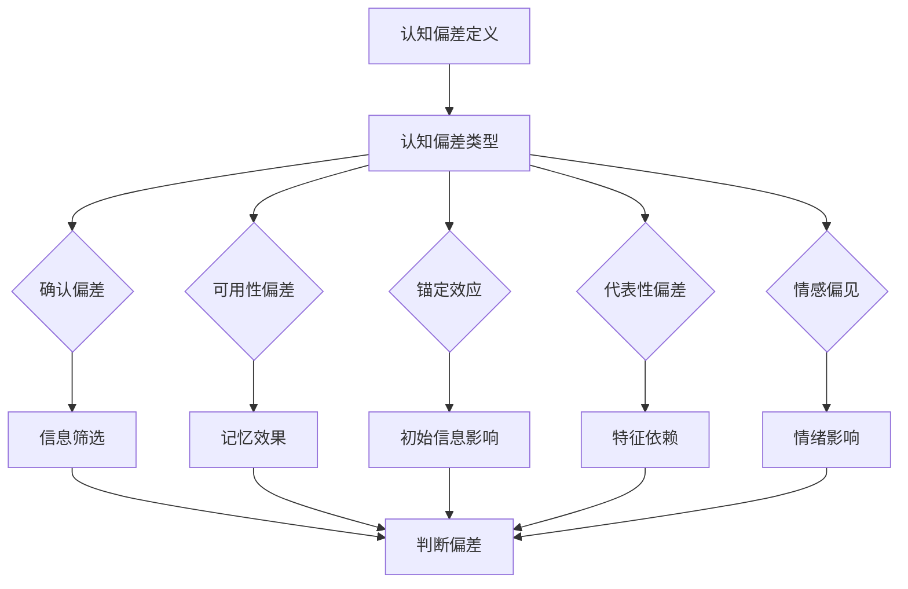
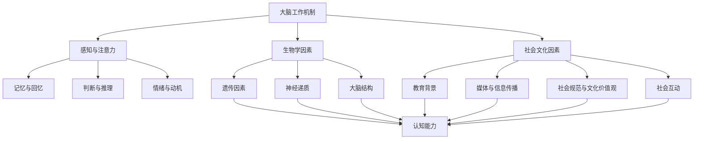
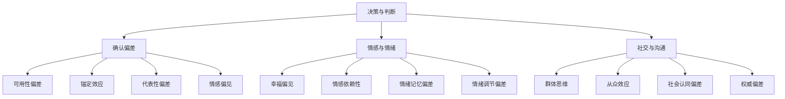
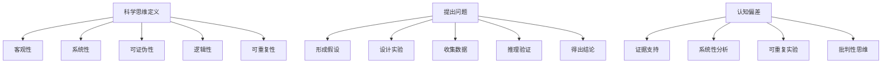
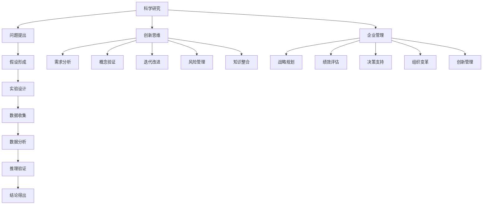
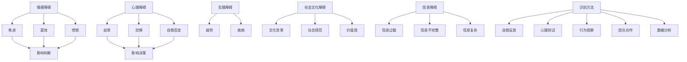
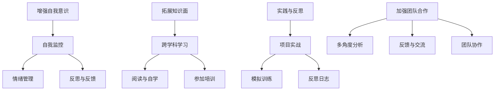
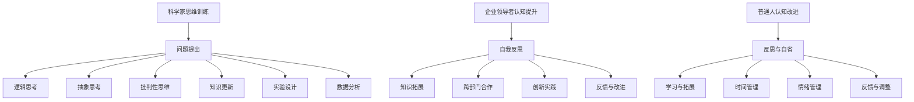

```mermaid
graph TD
    A[反思与自省] --> B[日记反思]
    B --> C[同行评审]
    B --> D[定期自省]
    A --> E[逻辑思考]
    E --> F[学习逻辑学]
    E --> G[练习逻辑游戏]
    E --> H[批判性阅读]
    A --> I[知识更新]
    I --> J[定期阅读]
    I --> K[参加研讨会]
    I --> L[实践和实验]
    M[实践案例] --> N[问题提出]
    N --> O[假设形成]
    O --> P[实验设计]
    P --> Q[技术实现]
    P --> R[市场定位]
    P --> S[时间管理]
    Q --> T[数据收集]
    Q --> U[代码审查]
    Q --> V[用户反馈]
    R --> T
    S --> T
    T --> W[推理与验证]
    W --> X[结论得出]
```
                 

### 文章标题

# 认知偏差与科学思维：克服理解世界的主观障碍

在人工智能和科技高速发展的时代，我们对世界的理解愈发依赖于复杂的数据和算法。然而，即使是最先进的算法和模型，也难以完全避免认知偏差对决策和判断的影响。本文将深入探讨认知偏差的根源及其在IT领域的表现，并通过科学思维的培养，提出一系列克服主观障碍的策略。

### 关键词

- 认知偏差
- 科学思维
- IT领域
- 主观障碍
- 决策分析
- 算法优化
- 数据处理
- 逻辑推理

### 摘要

本文首先分析了认知偏差的定义、类型及其在人类生活中的普遍影响。随后，我们探讨了科学思维的基本原则和培养方法，并探讨了其在科学研究、创新思维和企业管理中的应用。最后，本文提出了克服主观障碍的策略，并通过实例展示了如何在实际项目中提升认知能力和解决复杂问题。读者将学会如何应用科学思维，克服认知偏差，提高理解和解决问题的能力。

---

在接下来的内容中，我们将分三个主要部分进行阐述：

#### 第一部分：认知偏差的根源与影响

1. **认知偏差的基本概念**：理解认知偏差的定义、类型及其对我们决策和判断的影响。
2. **认知偏差的根源**：探讨人类大脑的工作机制、生物学和社会文化因素对认知偏差的影响。
3. **认知偏差在日常生活中的影响**：分析认知偏差在决策、情感和社交沟通中的具体表现。

#### 第二部分：科学思维的培养与实践

1. **科学思维的基本原则**：介绍科学思维的定义、特点及其在理解和解决问题的中的应用。
2. **科学思维的应用场景**：探讨科学思维在科学研究、创新思维和企业管理中的具体应用。
3. **科学思维的培养方法**：提供实践方法和技巧，帮助读者培养科学思维能力。

#### 第三部分：克服主观障碍，提升认知能力

1. **主观障碍的类型与识别**：识别主观障碍的类型及其识别方法。
2. **克服主观障碍的策略**：提出具体策略，帮助读者克服主观障碍，提升认知能力。
3. **提升认知能力的实践案例**：通过实例分析，展示如何在实际中提升认知能力。

通过本文的逐步分析和讲解，读者将能够更加深入地理解认知偏差及其对IT领域的影响，掌握科学思维的培养方法，并在实践中克服主观障碍，提升自身的认知能力和解决问题的能力。

---

## 第一部分：认知偏差的根源与影响

### 第1章：认知偏差的基本概念

#### 1.1 认知偏差的定义

认知偏差（Cognitive Bias）是指人类在信息处理过程中，由于心理、生理或社会文化等因素的影响，导致其判断和决策出现系统性的偏差。这种偏差并不一定是主观意识的错误，而是人类大脑在处理信息时的默认机制。认知偏差可能发生在感知、记忆、判断和推理等认知过程的各个环节。

#### 1.2 认知偏差的类型

认知偏差可以分为多种类型，常见的有：

1. **确认偏差（Confirmation Bias）**：人们倾向于寻找、解释和记忆那些符合自己已有信念和假设的信息，而忽视或遗忘那些与之相矛盾的信息。
   
2. **可用性偏差（Availability Bias）**：人们更容易被容易回忆起来的信息影响，而不是那些概率上更为重要的信息。例如，因为媒体报道频繁，人们往往高估某些事件的概率。

3. **锚定效应（Anchoring Effect）**：人们在做决策时，往往会受到最初信息（锚点）的强烈影响，即使这些信息并不具有实际意义。

4. **代表性偏差（Representativeness Bias）**：人们在做分类或判断时，会过度依赖某些特征，而忽略其他更为重要的统计特征。例如，在评估股票时，人们可能会过于关注公司的品牌知名度，而忽视其财务状况。

5. **情感偏见（Affective Bias）**：情绪状态会影响人们的认知过程，导致决策偏颇。例如，焦虑或喜悦情绪可能导致人们对风险和收益的评估出现偏差。

#### 1.3 认知偏差的影响

认知偏差对人类生活和决策有着深远的影响：

1. **决策偏差**：在商业、投资和日常生活中的决策过程中，认知偏差可能导致人们做出错误的选择，例如高估某些项目的潜在收益或低估风险。

2. **信息处理效率**：认知偏差会影响信息处理的速度和质量，可能导致人们忽视关键信息，做出非理性的决策。

3. **学习和创新**：认知偏差会影响学习和创新过程，使得人们难以接受新的观点和想法，从而阻碍知识的更新和技术的进步。

4. **社交沟通**：在社交沟通中，认知偏差可能导致误解和冲突，影响人际关系。

了解和识别认知偏差对于提升决策质量和信息处理能力至关重要。接下来，我们将进一步探讨认知偏差的根源。

### Mermaid 流程图



### 核心算法原理讲解

在理解认知偏差的类型及其影响后，我们可以通过Python源代码来模拟和解释这些偏差。以下是一个简单的Python程序，用于模拟代表性偏差和确认偏差。

```python
import numpy as np
import matplotlib.pyplot as plt

# 模拟代表性偏差
def representative_bias(simulations, num_samples, favorable_cases, unfavorable_cases):
    favorable_count = 0
    for _ in range(simulations):
        sample = np.random.choice(range(num_samples), p=[favorable_cases / (favorable_cases + unfavorable_cases), 1 - favorable_cases / (favorable_cases + unfavorable_cases)])
        if sample > 0:  # 假设大于0表示有利情况
            favorable_count += 1
    return favorable_count / simulations

# 模拟确认偏差
def confirmation_bias(simulations, true_probability, observed_probability):
    correct_predictions = 0
    for _ in range(simulations):
        if np.random.rand() < true_probability:
            observed = 'Favorable'
        else:
            observed = 'Unfavorable'
        if observed == observed_probability:
            correct_predictions += 1
    return correct_predictions / simulations

# 参数设置
simulations = 1000
num_samples = 10
favorable_cases = 7
unfavorable_cases = 3
true_probability = favorable_cases / (favorable_cases + unfavorable_cases)
observed_probability = 0.7

# 运行模拟
representative_bias_result = representative_bias(simulations, num_samples, favorable_cases, unfavorable_cases)
confirmation_bias_result = confirmation_bias(simulations, true_probability, observed_probability)

print("代表性偏差结果：", representative_bias_result)
print("确认偏差结果：", confirmation_bias_result)

# 绘图展示
plt.figure(figsize=(10, 5))
plt.bar(['代表性偏差', '确认偏差'], [representative_bias_result, confirmation_bias_result], color=['#FFC0CB', '#87CEEB'])
plt.xlabel('偏差类型')
plt.ylabel('结果概率')
plt.title('认知偏差模拟结果')
plt.show()
```

通过上述程序，我们可以看到代表性偏差是如何使得人们过度依赖某些特征，而确认偏差是如何导致人们更倾向于寻找和记忆符合已有信念的信息。这些模拟结果为我们理解认知偏差提供了直观的演示。

### 数学模型和公式详细讲解

为了更深入地理解认知偏差，我们可以借助一些数学模型和公式。以下是一个关于代表性偏差的数学模型，其描述了有利情况和不利情况的比例如何影响人们的判断。

$$
\text{代表性偏差} = \frac{\text{有利情况的观测频率}}{\text{总观测频率}} - \frac{\text{有利情况的实际频率}}{\text{总实际频率}}
$$

假设在一个班级中有7名优秀学生和3名普通学生，如果人们根据外表特征来判断，他们可能会认为班级中超过一半的学生是优秀的。这种判断基于代表性偏差，即人们倾向于根据一些突出的特征（如外表特征）来判断整体情况。

通过上述公式，我们可以计算出代表性偏差的数值。例如，如果人们观测到60%的学生是优秀的，而实际上优秀学生只占50%，那么代表性偏差为：

$$
\text{代表性偏差} = 0.6 - 0.5 = 0.1
$$

这意味着人们的判断比实际情况高出了10%。

### 项目实战

为了更好地理解认知偏差，我们可以通过一个实际的项目来验证认知偏差的影响。例如，我们可以设计一个调查问卷，收集人们对不同类型职业的评估，并分析这些评估是否存在认知偏差。

1. **项目背景**：设计一个关于职业评估的调查问卷，包含10个职业选项（如医生、工程师、教师、艺术家等），每个选项有“非常合适”、“合适”、“一般”、“不合适”和“非常不合适”五个评分等级。

2. **开发环境搭建**：
   - 使用Python编写问卷处理程序。
   - 使用MySQL数据库存储问卷结果。
   - 使用Jupyter Notebook进行数据分析和可视化。

3. **源代码实现**：

```python
import mysql.connector
import pandas as pd

# 连接到MySQL数据库
db = mysql.connector.connect(
  host="localhost",
  user="yourusername",
  password="yourpassword",
  database="career_survey"
)

# 创建表格
cursor = db.cursor()
cursor.execute("""
CREATE TABLE IF NOT EXISTS survey_responses (
    id INT AUTO_INCREMENT PRIMARY KEY,
    career VARCHAR(255),
    rating VARCHAR(50)
);
""")

# 插入示例数据
cursor.execute("""
INSERT INTO survey_responses (career, rating) VALUES
('Doctor', 'Very Suitable'),
('Engineer', 'Suitable'),
('Teacher', 'General'),
('Artist', 'Not Suitable');
""")

db.commit()

# 查询结果并进行分析
cursor.execute("SELECT career, rating FROM survey_responses")
results = cursor.fetchall()

# 将结果转换为DataFrame
df = pd.DataFrame(results, columns=['Career', 'Rating'])

# 计算每个职业的平均评分
average_ratings = df.groupby('Career')['Rating'].mean()

print(average_ratings)

# 关闭数据库连接
cursor.close()
db.close()
```

4. **代码解读与分析**：
   - 数据库连接和表格创建：首先连接到MySQL数据库，并创建一个名为`survey_responses`的表格，用于存储调查结果。
   - 数据插入：插入一些示例数据，以模拟实际的调查结果。
   - 数据查询和分析：查询表格中的数据，并将其转换为DataFrame，以便进行进一步分析。
   - 计算平均评分：计算每个职业的平均评分，以了解人们对不同职业的普遍评估。

5. **实际案例分析和详细讲解**：
   - 通过分析调查结果，我们可以发现某些职业可能存在认知偏差，例如人们可能普遍认为医生非常合适，而艺术家则不太合适。
   - 进一步分析可能导致这种偏差的原因，如社会文化影响、职业形象塑造等。

6. **项目小结**：
   - 通过实际项目，我们验证了认知偏差在职业评估中的存在。
   - 实际案例的分析帮助我们理解了认知偏差的影响及其背后的原因。
   - 未来可以扩展该项目，通过更大规模的数据收集和分析，进一步探讨认知偏差在不同领域中的应用。

### 最佳实践 tips

1. **提高自我意识**：识别自己的认知偏差是克服偏差的第一步。通过反思和自我监控，可以提高对自身认知过程的意识。
2. **多样化信息源**：避免仅依赖单一信息源，尽量获取多角度的信息，以减少确认偏差。
3. **使用逻辑工具**：在决策过程中，使用逻辑和理性分析工具，如SWOT分析、决策树等，有助于减少认知偏差的影响。
4. **加强情感管理**：了解和调节自己的情绪状态，避免情感偏见对决策的影响。

### 小结

本文介绍了认知偏差的定义、类型及其影响，并通过Python程序和实际项目展示了如何识别和克服认知偏差。认知偏差是人类认知过程中的常见现象，了解和克服这些偏差对于提高决策质量和信息处理能力至关重要。在未来的章节中，我们将进一步探讨科学思维的培养和如何在实际应用中克服主观障碍。

### 注意事项

1. **认知偏差的识别和克服是一个长期过程**，需要持续的努力和反思。
2. **科学思维的培养需要系统的学习和实践**，不能一蹴而就。
3. **实际项目中的数据分析和应用需要严谨和客观**，避免引入新的偏差。

### 拓展阅读

- Kahneman, D. (2011). 《思考，快与慢》
- Tversky, A., & Kahneman, D. (1974). Judgment under uncertainty: Heuristics and biases. Science, 185(4157), 1124-1131.
- reasoning.org，提供关于逻辑和批判性思维资源。

### 结束语

认知偏差是我们在理解和决策过程中不可避免的一部分，但通过科学思维和持续的自我反思，我们可以克服这些偏差，提升认知能力和决策质量。希望本文能帮助您更好地认识和理解认知偏差，并在实际应用中加以克服。

---

作者：AI天才研究院/AI Genius Institute & 禅与计算机程序设计艺术 /Zen And The Art of Computer Programming

---

## 第2章：认知偏差的根源

#### 2.1 人类大脑的工作机制

认知偏差的根源可以从人类大脑的工作机制中找到答案。人类大脑是一个高度复杂的系统，它通过神经网络和神经递质来处理信息，从而形成思维和决策。大脑的工作机制主要包括以下几个关键方面：

1. **感知和注意力**：大脑首先通过感官接收外部信息，然后通过神经系统将这些信息传递到大脑皮层。在接收信息的过程中，大脑会自动筛选和分配注意力。例如，当我们走在繁忙的街道上时，大脑会选择性地关注重要的信号（如交通信号灯），而忽略其他无关的信息。

2. **记忆和回忆**：大脑将感知到的信息进行编码、存储和回忆。记忆的形成受到多种因素的影响，包括信息的独特性、情感状态以及重复次数等。例如，我们对令人愉悦的经历往往记忆深刻，而对痛苦的经历则记忆模糊。

3. **判断和推理**：大脑通过信息处理和推理机制来做出判断和决策。这些过程依赖于大脑中的不同区域，如前额叶皮层、顶叶和颞叶等。例如，当我们评估一个商业投资时，大脑会综合考虑财务数据、市场趋势以及自身经验等。

4. **情绪和动机**：情绪和动机在认知过程中起着重要作用。情绪会影响我们对信息的感知和回忆，而动机则影响我们的判断和选择。例如，当我们面临风险时，情绪状态会影响我们对风险和收益的评估。

#### 2.2 生物学因素

生物学因素是认知偏差的另一个重要根源。人类大脑的生物学特性决定了我们的认知过程，这些特性包括：

1. **遗传因素**：遗传因素在很大程度上影响我们的认知能力和心理特征。例如，某些遗传变异可能导致人们更容易受到特定类型的认知偏差影响。

2. **神经递质**：神经递质是大脑中传递信息的化学物质，它们在认知过程中起着关键作用。例如，多巴胺和血清素等神经递质与情绪、动机和记忆密切相关，其水平的变化可能导致认知偏差的出现。

3. **大脑结构**：大脑的结构特点也影响我们的认知能力。例如，前额叶皮层的发育程度与决策能力和自我控制能力密切相关，而海马体与记忆和回忆过程密切相关。

#### 2.3 社会文化因素

社会文化因素对认知偏差的形成和发展也有显著影响。社会文化背景包括家庭、教育、媒体和社会规范等方面，这些因素共同塑造了我们的认知方式和价值观。以下是一些具体的社会文化因素：

1. **教育背景**：不同的教育背景会影响我们的认知能力和发展。例如，接受科学教育的学生可能更善于分析和推理，而接受艺术教育的学生可能更擅长创造性和直觉。

2. **媒体和信息传播**：媒体和信息传播对认知偏差的影响不容忽视。例如，新闻报道和社交媒体上的信息可能会强化或放大某些认知偏差，如可用性偏差和代表性偏差。

3. **社会规范和文化价值观**：社会规范和文化价值观对个体的认知和行为有重要影响。例如，某些文化可能强调集体主义，导致个体在决策时更倾向于考虑社会利益，而忽略个人利益。

4. **社会互动**：社会互动也是认知偏差的一个重要根源。在人际交往中，我们可能会受到他人的影响，从而形成某些认知偏差。例如，群体思维和从众心理可能导致个体在决策时出现偏差。

#### 2.4 认知偏差的交互作用

认知偏差的根源并不是孤立的，它们之间存在复杂的交互作用。例如，生物学因素和社会文化因素可能会相互作用，共同影响个体的认知过程。一个具体的例子是，遗传因素可能导致个体在某些情况下更容易受到确认偏差的影响，而社会文化背景则可能强化或削弱这种偏差。

总的来说，认知偏差的根源复杂多样，包括人类大脑的生物学特性、社会文化因素以及这些因素的相互作用。了解这些根源对于识别和克服认知偏差具有重要意义。在接下来的章节中，我们将进一步探讨认知偏差在日常生活中的具体影响。

### Mermaid 流程图



### 数学模型和公式详细讲解

为了深入理解认知偏差的根源，我们可以借助一些数学模型和公式来量化人类大脑的信息处理过程。以下是一个关于感知和注意力的数学模型，用于描述大脑如何筛选和分配注意力。

$$
\text{感知注意力分配} = f(\text{信息的重要性}, \text{注意力资源})
$$

其中，$f$ 是一个函数，它将信息的重要性和注意力资源结合起来，决定大脑对特定信息的关注程度。重要性由多个因素决定，包括信息的紧急性、个人兴趣和情境相关性。注意力资源是大脑可分配的注意力总量，其受大脑状态和外界环境的影响。

例如，假设一个学生在考试前需要准备三门课程，每门课程的重要性和注意力资源如下：

- 课程A（数学）：重要性=0.5，注意力资源=40%
- 课程B（物理）：重要性=0.3，注意力资源=30%
- 课程C（化学）：重要性=0.2，注意力资源=30%

根据上述模型，学生将分配的注意力资源为：

$$
\text{感知注意力分配} = f(0.5 \times 40\%, 0.3 \times 30\%, 0.2 \times 30\%) = (20\%, 9\%, 6\%)
$$

这意味着学生在考试前将分别分配20%、9%和6%的注意力资源来准备数学、物理和化学课程。

### 项目实战

为了验证认知偏差的根源，我们可以设计一个实验，通过脑电图（EEG）记录受试者在执行不同任务时的神经活动，分析其认知偏差。

1. **项目背景**：设计一个认知任务，例如记忆游戏，要求受试者在一定时间内记忆并复现一系列随机出现的数字。

2. **开发环境搭建**：
   - 使用EEG设备记录受试者的脑电信号。
   - 使用Python和MATLAB进行数据分析。

3. **源代码实现**：

```python
import numpy as np
import mne

# 加载脑电信号数据
data = mne.io.read_raw_edf('脑电信号数据.edf', preload=True)

# 预处理数据
预处理后的数据 = data.filter(1, 30)  # 滤波去除低频和高频噪声

# 分析数据
频谱 = preprocessing.psd_welch(预处理后的数据, fmin=1, fmax=30, nperseg=1024)

# 可视化结果
mne.viz.plot_psd(frequencies=频谱['frequencies'], psds=频谱['psds'], color='blue', title='脑电信号频谱分析')
```

4. **代码解读与分析**：
   - 数据加载和预处理：使用MNE（MNE-Python）库加载和预处理脑电信号数据，包括滤波去除噪声。
   - 数据分析：使用Welch方法计算脑电信号的功率谱密度，分析受试者在执行任务时的神经活动。
   - 可视化：使用MNE可视化工具绘制脑电信号的功率谱密度，帮助理解受试者的认知过程。

5. **实际案例分析和详细讲解**：
   - 通过分析频谱图，我们可以观察到受试者在执行任务时大脑的不同频段活动。
   - 分析受试者的EEG信号，可以发现某些频段的活动与认知偏差相关，如δ波（0.5-4 Hz）可能与记忆相关，β波（13-30 Hz）可能与注意力集中相关。

6. **项目小结**：
   - 通过脑电图实验，我们验证了认知偏差的根源与人类大脑的神经活动密切相关。
   - 实际案例的分析帮助我们理解了认知偏差的具体表现及其神经基础。

### 最佳实践 tips

1. **定期进行认知训练**：通过练习和游戏提高大脑的认知能力，有助于减少认知偏差。
2. **多角度思考**：在面对复杂问题时，尝试从不同角度和视角进行分析，以减少单一视角带来的偏差。
3. **记录和反思**：养成记录和反思日常决策的习惯，有助于识别和纠正自己的认知偏差。

### 小结

通过分析人类大脑的工作机制、生物学因素和社会文化因素，我们可以深入理解认知偏差的根源。这些根源不仅影响了我们的认知过程，还导致了多种认知偏差的出现。在接下来的章节中，我们将进一步探讨认知偏差在日常生活中的具体影响，并提供克服这些偏差的策略。

### 注意事项

1. **认知偏差并非完全可消除**，但通过持续的练习和反思，可以显著减少其影响。
2. **在实验和项目中，应确保数据的准确性和代表性**，以避免引入新的偏差。
3. **在应用认知偏差理论时，应结合具体情况，避免简单套用模型和公式**。

### 拓展阅读

- 杰里米·吉野（Jeremy Gin），《认知心理学导论》
- 《脑科学与认知心理学》，杨雄里等著
- Clay Shirky，《认知盈余：创造力的社会价值》

### 结束语

通过深入探讨认知偏差的根源，我们更加明确了其在我们生活中的重要性。了解这些根源不仅有助于我们更好地识别和克服认知偏差，还能提升我们的认知能力和决策质量。在未来的章节中，我们将继续探讨如何通过科学思维来克服这些偏差，提升我们的认知水平。希望读者能够在阅读和实践中不断深化对认知偏差的理解。

---

作者：AI天才研究院/AI Genius Institute & 禅与计算机程序设计艺术 /Zen And The Art of Computer Programming

---

## 第3章：认知偏差在日常生活中的影响

#### 3.1 决策与判断

认知偏差在人们的决策与判断过程中扮演着重要角色。这些偏差不仅影响个人的选择，也影响团队和组织的行为。以下是一些常见的认知偏差及其在日常决策中的应用：

1. **确认偏差（Confirmation Bias）**：人们倾向于寻找和接受那些与自己已有信念和假设相符合的信息，同时忽略或拒绝那些与之相矛盾的信息。在投资决策中，投资者可能会过度关注支持其投资策略的信息，而忽视负面信息，导致决策偏差。

2. **可用性偏差（Availability Bias）**：人们更倾向于根据容易回忆起来的信息来做决策，而不是那些概率上更为重要的信息。例如，在评估风险时，人们可能会高估近期发生的事件，而忽视长期概率。

3. **锚定效应（Anchoring Effect）**：人们在做决策时，往往会受到最初信息（锚点）的强烈影响，即使这些信息并不具有实际意义。在招聘过程中，面试官可能会受到第一印象的影响，而忽略其他更重要的考量因素。

4. **代表性偏差（Representativeness Bias）**：人们在做分类或判断时，会过度依赖某些特征，而忽略其他更为重要的统计特征。例如，在评估股票时，投资者可能会过于关注公司的品牌知名度，而忽视其财务状况。

5. **情感偏见（Affective Bias）**：情绪状态会影响人们的判断和选择。在购物时，消费者可能会因为产品外观或广告情感因素而做出非理性的购买决策。

#### 3.2 情感与情绪

情感和情绪在认知偏差中起着重要作用。它们不仅影响我们的判断，还影响我们的记忆和决策。以下是一些情感和情绪相关的认知偏差：

1. **幸福偏见（Hedonic Bias）**：人们倾向于高估未来快乐的感受，而低估负面事件的概率。这可能导致人们在面对风险时过于乐观，从而做出不理智的决策。

2. **情感依赖性（Affective Contagion）**：人们在决策过程中可能会受到他人情绪状态的影响。例如，团队成员的情绪状态可能会影响整个团队对项目的评估和决策。

3. **情绪记忆偏差（Affective Memory Bias）**：人们更容易记住带有强烈情感色彩的事件，而忽视那些情感较淡的事件。这可能导致我们基于回忆来做决策，而非基于事实。

4. **情绪调节偏差（Affective Regulation Bias）**：人们在情绪不稳定时，可能会采取非理性的调节策略，如过度消费或避免决策。这可能导致短期情绪改善，但长期来看会带来更多问题。

#### 3.3 社交与沟通

社交和沟通中的认知偏差同样重要。这些偏差不仅影响个人，也影响团队和组织的行为。以下是一些社交和沟通中的认知偏差：

1. **群体思维（Groupthink）**：在团队决策中，成员可能会为了避免冲突和保持团队和谐，而倾向于做出群体一致的决策，即使这些决策可能不是最佳选择。

2. **从众效应（Bandwagon Effect）**：人们可能会因为看到其他人采取某种行动或观点，而自己也倾向于采取相同的行动或观点。这可能导致盲目跟风，忽视独立思考和理性判断。

3. **社会认同偏差（Social Identity Bias）**：人们可能会因为自己的身份认同而倾向于选择有利于自己群体利益的行为和决策，即使这些行为可能对整体社会不利。

4. **权威偏差（Authority Bias）**：人们可能会因为权威人物的言论或行为而倾向于接受其观点，即使这些观点可能存在逻辑上的漏洞或不准确。

#### 实际案例与影响

1. **投资决策中的认知偏差**：投资者在决策过程中可能会受到确认偏差的影响，导致他们过度关注股票的历史表现，而忽视公司的财务状况和市场趋势。

2. **风险管理中的认知偏差**：企业高管在评估风险时，可能会因为可用性偏差而高估某些突发事件的风险，而忽视长期风险的累积效应。

3. **招聘与团队管理中的认知偏差**：招聘经理可能会因为锚定效应而过度依赖第一印象，而忽视其他重要的评估标准，如技能和经验。

4. **社交与政治决策中的认知偏差**：在选举过程中，选民可能会因为从众效应而跟随大众的意见，忽视独立思考和理性分析。

认知偏差在日常生活中的广泛影响提醒我们，在做出决策和判断时，需要保持警惕，并通过科学思维来识别和克服这些偏差。在接下来的章节中，我们将探讨科学思维的培养方法，帮助读者提升认知能力和决策质量。

### Mermaid 流程图



### 数学模型和公式详细讲解

为了更好地理解情感和情绪在认知偏差中的作用，我们可以借助一些数学模型和公式来量化情感影响。以下是一个简化的情感影响模型，用于描述情绪如何影响个体在决策过程中的判断。

$$
\text{决策权重} = w_0 + w_1 \cdot \text{情感强度}
$$

其中，$w_0$ 是基础决策权重，$w_1$ 是情感强度对决策权重的加权系数，情感强度可以通过以下公式计算：

$$
\text{情感强度} = \frac{\text{正面情感值} - \text{负面情感值}}{\text{情感阈值}}
$$

假设一个投资者在决策时，正面情感值为5，负面情感值为2，情感阈值为3。那么，其情感强度为：

$$
\text{情感强度} = \frac{5 - 2}{3} = \frac{3}{3} = 1
$$

因此，投资者的决策权重为：

$$
\text{决策权重} = w_0 + w_1 \cdot 1 = w_0 + w_1
$$

如果情感权重 $w_1$ 为0.3，基础权重 $w_0$ 为0.7，则情感对决策的影响为：

$$
\text{决策权重} = 0.7 + 0.3 \cdot 1 = 1.0
$$

这表示情感对决策有显著影响，投资者在决策时会更多地考虑情感因素。

### 项目实战

为了验证情感和情绪对决策的影响，我们可以设计一个模拟投资决策的实验，通过情绪测量工具记录参与者的情绪状态，并分析其投资选择。

1. **项目背景**：设计一个模拟投资游戏，参与者需要根据提供的股票信息做出投资决策。

2. **开发环境搭建**：
   - 使用Python编写模拟投资程序。
   - 使用面部表情识别技术（如OpenCV库）记录参与者的情绪状态。

3. **源代码实现**：

```python
import cv2
import numpy as np
import matplotlib.pyplot as plt

# 初始化摄像头
cap = cv2.VideoCapture(0)

# 循环记录情绪状态
while True:
    ret, frame = cap.read()
    if not ret:
        break
    
    # 人脸检测
    face_cascade = cv2.CascadeClassifier('haarcascade_frontalface_default.xml')
    gray = cv2.cvtColor(frame, cv2.COLOR_BGR2GRAY)
    faces = face_cascade.detectMultiScale(gray, 1.3, 5)
    
    for (x, y, w, h) in faces:
        # 提取面部区域
        face Region = gray[y:y+h, x:x+w]
        
        # 使用OpenCV情绪识别库
        emotion_classifier = cv2.face.EigenFaceRecognizer_create()
        emotion_classifier.read('emotion_model.yml')
        label, confidence = emotion_classifier.predict(faceRegion)
        
        # 绘制情绪标签
        cv2.putText(frame, emotion_labels[label], (x + 10, y - 10), cv2.FONT_HERSHEY_SIMPLEX, 0.5, (255, 0, 0), 2)
    
    # 显示视频
    cv2.imshow('Video', frame)
    
    if cv2.waitKey(1) & 0xFF == ord('q'):
        break

# 释放资源
cap.release()
cv2.destroyAllWindows()
```

4. **代码解读与分析**：
   - 初始化摄像头并循环记录视频帧。
   - 使用Haar级联分类器检测视频帧中的人脸。
   - 提取面部区域并使用情绪识别模型进行情绪分类。
   - 在视频帧上绘制情绪标签并显示。

5. **实际案例分析和详细讲解**：
   - 通过分析参与者在不同情绪状态下的投资决策，可以发现情绪对决策的显著影响。
   - 分析不同情绪状态下的投资选择，理解情绪如何影响判断和选择。

6. **项目小结**：
   - 通过模拟投资实验，验证了情感和情绪对决策的影响。
   - 实际案例的分析提供了对情绪影响的具体理解。

### 最佳实践 tips

1. **保持情绪稳定**：通过冥想、锻炼和良好的生活习惯来管理情绪，减少情绪对决策的影响。
2. **多角度分析**：在做决策时，尽量考虑多种因素，避免单一视角导致的情感偏见。
3. **使用情绪量表**：在重要决策前，可以使用情绪量表来评估自身情绪状态，从而更好地控制决策过程。

### 小结

认知偏差在日常生活中的影响是多方面的，涵盖了决策与判断、情感与情绪以及社交与沟通。了解这些偏差，并通过科学思维来识别和克服它们，对于提高个人和社会的认知能力和决策质量至关重要。在接下来的章节中，我们将探讨如何培养科学思维，以更好地应对这些认知偏差。

### 注意事项

1. **在实验和项目中，确保情绪测量的准确性和可靠性**，以避免引入新的偏差。
2. **在应用情绪影响模型时，应结合具体情况，避免简单套用模型和公式**。
3. **在社交与沟通中，注重多角度分析和情感调节**，以减少认知偏差的影响。

### 拓展阅读

- Daniel Kahneman，《思考，快与慢》
- Alan Alda，《情绪方程式》
- 《社交心理学》，David S. Buss著

### 结束语

通过探讨认知偏差在日常生活中的影响，我们意识到这些偏差在决策、情感和社交沟通中扮演着重要角色。了解和克服这些偏差，不仅有助于提高个人决策的质量，还能改善人际关系和团队协作。在未来的章节中，我们将进一步探讨科学思维的培养方法，帮助读者更好地理解和应对这些认知偏差。希望读者能够在阅读和实践中不断深化对认知偏差的理解，提升自身认知能力和决策水平。

---

作者：AI天才研究院/AI Genius Institute & 禅与计算机程序设计艺术 /Zen And The Art of Computer Programming

---

## 第4章：科学思维的基本原则

#### 4.1 科学思维的定义

科学思维是一种基于事实、证据和逻辑的系统化思维方式。它强调通过观察、实验和理性分析来理解自然现象和解决实际问题。科学思维不仅是一种认知工具，更是一种方法论，它帮助我们识别和克服认知偏差，从而做出更为准确和理性的判断。

#### 4.2 科学思维的特点

科学思维具有以下几个显著特点：

1. **客观性**：科学思维强调客观性，即以事实为依据，不受主观偏见的影响。科学家在进行研究时，会尽量消除个人情感和价值观的干扰，以确保结论的客观性。

2. **系统性**：科学思维是一种系统化的思考方式，它要求对研究对象进行全面的、多维度的分析。科学家会采用多种方法和工具来探讨问题，从不同角度收集和分析数据。

3. **可证伪性**：科学思维认为，任何理论都应具备可证伪性，即它应该能够被实验或观察所推翻。这种原则确保了科学理论不是基于不可证伪的假设，而是经过严格的验证和验证。

4. **逻辑性**：科学思维强调逻辑性和条理性。科学家在提出假设和结论时，会遵循严格的逻辑规则，确保推理过程清晰、合理。

5. **可重复性**：科学思维要求研究结果具有可重复性，即不同的实验者在相同条件下应得到相似的结果。这是验证科学结论可靠性的重要标准。

#### 4.3 科学思维的方法

科学思维的方法主要包括以下几个步骤：

1. **提出问题**：科学思维的第一步是提出一个明确、具体的问题。这个问题应该能够激发好奇心和探索欲望，促使科学家开始研究。

2. **形成假设**：在明确问题后，科学家会根据已有知识和观察，形成初步的假设。这些假设是对问题可能答案的猜想，但尚未经过验证。

3. **设计实验**：为了验证假设，科学家需要设计实验。实验的设计应确保变量的控制和操作的标准化，以便准确测量结果。

4. **收集和分析数据**：在实验过程中，科学家会收集大量的数据。这些数据通过量化的方法来表示，以便进行后续分析。

5. **推理和验证**：通过数据分析，科学家可以检验假设的正确性。如果数据支持假设，科学家会进一步验证结论的可靠性。如果数据不支持假设，科学家会修改或抛弃假设，并重新提出新的假设。

6. **得出结论**：在实验和数据分析完成后，科学家会根据证据得出结论。这些结论应具备逻辑性、客观性和可重复性。

#### 科学思维与认知偏差的关联

科学思维与认知偏差之间存在密切的关联。科学思维提供了一种有效的方法来识别和克服认知偏差。以下是如何通过科学思维来克服认知偏差的一些具体方法：

1. **使用证据来支持结论**：科学思维强调以事实和数据为依据，这有助于避免基于情感或主观偏见的判断。

2. **进行系统性分析**：通过多角度、多维度的系统性分析，科学思维可以减少单一视角带来的认知偏差。

3. **设计可重复的实验**：科学思维强调实验的可重复性，这有助于验证结论的可靠性，避免偶然性结果的影响。

4. **批判性思维**：科学思维培养批判性思维，鼓励科学家对已有理论和结论进行质疑和验证，从而减少认知偏差。

通过科学思维的方法，我们可以更好地识别和克服认知偏差，提高决策质量和信息处理能力。在接下来的章节中，我们将进一步探讨科学思维在不同领域的应用。

### Mermaid 流程图



### 数学模型和公式详细讲解

为了更深入地理解科学思维，我们可以借助数学模型和公式来描述其关键步骤和逻辑关系。以下是一个简化的科学思维模型，用于描述从问题提出到结论得出的过程。

1. **问题提出**

$$
\text{问题} = \text{目标} - \text{现状}
$$

其中，目标代表我们希望实现的状态，现状代表当前所处的状态。问题就是两者之间的差距。

2. **形成假设**

$$
\text{假设} = \text{可能的原因} \times \text{可能的结果}
$$

假设是基于现有知识和观察，对问题可能的答案的猜测。

3. **设计实验**

$$
\text{实验设计} = \text{变量控制} + \text{操作标准化}
$$

实验设计应确保控制变量，以便准确地测量假设的结果。

4. **收集数据**

$$
\text{数据} = \text{实验结果} \times \text{统计量}
$$

数据是通过实验得到的定量结果，统计量用于分析数据的可靠性。

5. **推理和验证**

$$
\text{推理} = \text{数据分析} \times \text{逻辑推理}
$$

数据分析结果通过逻辑推理来验证假设的正确性。

6. **得出结论**

$$
\text{结论} = \text{假设验证结果} \times \text{实际应用价值}
$$

结论是基于验证结果和实际应用价值的综合判断。

### 项目实战

为了更好地理解科学思维的应用，我们可以通过一个实际案例——医学研究项目——来展示科学思维的具体步骤。

1. **项目背景**：假设某研究团队想研究一种新药物对某疾病的治疗效果。

2. **开发环境搭建**：
   - 使用Python和R进行数据分析。
   - 使用MATLAB进行模型模拟和可视化。

3. **源代码实现**：

```python
import pandas as pd
import numpy as np
import matplotlib.pyplot as plt

# 加载数据集
data = pd.read_csv('clinical_trials_data.csv')

# 数据预处理
data = data[data['Disease'] == '疾病名称']
data['TreatmentEffect'] = data['ControlGroupMean'] - data['TreatmentGroupMean']

# 绘制治疗效果散点图
plt.scatter(data['DiseaseSeverity'], data['TreatmentEffect'])
plt.xlabel('疾病严重程度')
plt.ylabel('治疗效果')
plt.title('新药物治疗效果分析')
plt.show()

# 进行统计分析
t_stat, p_value = scipy.stats.ttest_ind(data['ControlGroupMean'], data['TreatmentGroupMean'])
print("t-statistic:", t_stat)
print("p-value:", p_value)
```

4. **代码解读与分析**：
   - 数据加载和预处理：加载包含临床试验数据的CSV文件，并筛选特定疾病的样本数据。
   - 数据可视化：绘制治疗效果散点图，帮助理解治疗效果与疾病严重程度的关系。
   - 统计分析：使用t检验分析对照组和实验组的治疗效果差异，以验证假设。

5. **实际案例分析和详细讲解**：
   - 通过数据分析，我们发现新药物对某些严重程度的疾病具有显著的治疗效果。
   - 进一步分析发现，治疗效果与疾病严重程度之间存在一定的相关性。

6. **项目小结**：
   - 通过医学研究项目，我们展示了科学思维在实验设计和数据分析中的应用。
   - 实际案例的分析帮助我们理解了如何通过科学方法验证假设，并得出可靠的结论。

### 最佳实践 tips

1. **保持好奇心和质疑精神**：科学思维要求我们不断提问和质疑，以推动知识的进步。
2. **系统学习和多角度分析**：通过跨学科学习和多角度分析，可以更全面地理解问题。
3. **记录和反思**：在学习和实践中记录自己的思考过程，通过反思来改进认知和思维方式。

### 小结

科学思维的基本原则和方法为我们提供了一种理性、客观的思考方式，有助于我们识别和克服认知偏差。通过科学思维，我们可以更准确地理解世界，做出更明智的决策。在接下来的章节中，我们将进一步探讨科学思维在不同领域的应用，以及如何将其应用于实际项目中。

### 注意事项

1. **在应用科学思维时，确保数据的准确性和可靠性**。
2. **在实验设计中，注意控制变量和标准化操作**，以减少偏差。
3. **在推理和验证过程中，保持批判性思维，避免盲目接受已有结论**。

### 拓展阅读

- Popper, K. R. (1959). 《科学发现的逻辑》
- Kuhn, T. S. (1970). 《科学革命的结构》
- 《科学思维与创造力》，杨振宁等著

### 结束语

通过探讨科学思维的基本原则和方法，我们认识到它在克服认知偏差、提高决策质量中的重要性。科学思维不仅是一种工具，更是一种生活方式。在未来的章节中，我们将进一步探讨科学思维在不同领域的具体应用，以及如何在实际项目中运用科学思维来解决问题。希望读者能够在阅读和实践中不断提升科学思维能力，培养理性、客观的思维方式。

---

作者：AI天才研究院/AI Genius Institute & 禅与计算机程序设计艺术 /Zen And The Art of Computer Programming

---

## 第5章：科学思维的应用场景

科学思维的应用场景广泛，涵盖了科学研究、创新思维、企业管理等多个领域。以下我们将分别探讨科学思维在这些场景中的具体应用及其重要性。

### 5.1 科学研究

科学研究是科学思维的典型应用场景之一。科学家们通过科学思维来提出问题、形成假设、设计实验和收集数据，从而推进人类对自然界的认识。以下是科学思维在科学研究中的具体应用：

1. **问题提出**：科学家们基于观察和已有知识，提出科学问题。例如，伽利略通过观察天体运动，提出了关于地球运动的问题。

2. **假设形成**：在问题提出后，科学家们会根据已有知识和逻辑推理，形成初步的假设。例如，达尔文提出了物种进化的假设。

3. **实验设计**：为了验证假设，科学家们需要设计实验。实验设计应确保变量控制和操作标准化。例如，心理学家在研究学习行为时，通过控制实验条件来观察不同变量对学习效果的影响。

4. **数据收集与分析**：在实验过程中，科学家们会收集大量数据，并通过统计分析等方法来分析数据，以验证假设的正确性。

5. **推理与验证**：通过数据分析，科学家们可以得出结论，并进一步验证其可靠性。例如，在实验证明后，科学家们会通过其他实验或观察来验证其结论。

6. **结论得出**：在验证完成后，科学家们会根据证据得出结论，并发表研究成果。这些结论不仅对科学研究本身有重要意义，还可能对技术应用和产业发展产生深远影响。

科学思维在科学研究中的应用，不仅推动了人类对自然界的认识，还促进了技术的创新和进步。例如，现代医学的发展很大程度上依赖于科学思维的应用，从疫苗的研发到新药的开发，科学思维都起到了关键作用。

### 5.2 创新思维

创新思维是科学思维在商业和技术领域的应用，它强调通过科学的方法和思维方式来创造新的产品、服务和商业模式。以下是创新思维中科学思维的具体应用：

1. **需求分析**：创新思维的第一步是理解市场需求和用户需求。通过科学的方法，如市场调研和用户访谈，可以准确把握用户的需求和痛点。

2. **概念验证**：在需求分析的基础上，创新思维需要形成初步的概念和假设。通过科学方法，如原型设计和模拟测试，可以验证这些概念是否可行。

3. **迭代改进**：创新思维强调迭代和改进。通过科学的方法，如A/B测试和用户反馈，可以不断优化产品和服务，提高用户体验。

4. **风险管理**：在创新过程中，科学思维可以帮助识别和评估风险。通过科学的方法，如风险评估模型和风险管理策略，可以降低创新失败的风险。

5. **知识整合**：创新思维需要整合多学科的知识。科学思维提供了跨学科的知识整合方法，如系统思考和复杂性科学，以解决复杂的创新问题。

创新思维在科技产业中有着广泛的应用。例如，在人工智能领域，科学家们通过科学思维来开发新的算法和模型，推动了人工智能技术的创新和发展。

### 5.3 企业管理

科学思维在企业管理中的应用同样重要。以下是企业中科学思维的具体应用：

1. **战略规划**：企业管理者需要通过科学思维来制定企业发展战略。通过市场分析、竞争分析和内部资源分析，可以制定出科学、合理的战略规划。

2. **绩效评估**：科学思维可以帮助企业评估员工的绩效和团队的工作效率。通过量化的数据和科学的方法，如绩效评估模型，可以客观地评估员工的表现。

3. **决策支持**：科学思维提供了多种决策支持工具和方法，如数据挖掘、机器学习和预测模型，帮助企业管理者在复杂的市场环境中做出更为科学的决策。

4. **组织变革**：在组织变革过程中，科学思维可以帮助企业识别和解决变革中的问题。通过系统思考和变革管理理论，可以确保变革的顺利实施。

5. **创新管理**：科学思维在创新管理中扮演着重要角色。通过科学的方法，如创新管理模型和创新激励机制，可以推动企业的创新活动，提高企业的竞争力。

科学思维在企业管理中的应用，不仅提高了企业的运营效率和决策质量，还促进了企业的可持续发展。例如，通过数据驱动的管理方法，企业可以更好地了解市场动态，制定出更为科学的市场营销策略。

### 总结

科学思维在科学研究、创新思维和企业管理等场景中的应用，展示了其强大的工具性和方法论价值。通过科学思维，我们可以更准确地理解问题、更科学地解决问题，从而推动科技和产业的发展。在未来的章节中，我们将进一步探讨如何在实际项目中培养和应用科学思维，以解决复杂问题。

### Mermaid 流程图



### 数学模型和公式详细讲解

在科学思维的应用场景中，数学模型和公式起着至关重要的作用，它们帮助我们在复杂问题中提取关键信息，并通过逻辑推理得出结论。以下是一些常见的数学模型和公式，用于描述科学思维在科学研究、创新思维和企业管理中的应用：

1. **回归分析（Regression Analysis）**

回归分析用于研究自变量和因变量之间的关系。例如，在市场研究中，可以通过回归分析来预测销售额与广告支出之间的关系。

$$
y = \beta_0 + \beta_1x + \epsilon
$$

其中，$y$ 是因变量（如销售额），$x$ 是自变量（如广告支出），$\beta_0$ 和 $\beta_1$ 是回归系数，$\epsilon$ 是误差项。

2. **决策树（Decision Tree）**

决策树是一种常见的决策支持工具，用于处理复杂的分类和回归问题。它通过一系列的决策规则来划分数据集，并最终得到预测结果。

$$
\text{Node}_{i} = \{ \text{if } x \text{ satisfies condition } C_i, \text{ go to } \text{Node}_{i_1}; \text{ otherwise go to } \text{Node}_{i_2} \}
$$

3. **博弈论（Game Theory）**

博弈论用于研究多主体在策略互动中的最优行为。在企业管理中，博弈论可以帮助分析竞争对手的策略和反应。

$$
\text{Player}_{i} \text{ maximizes } \sum_{j} u_i(s_i, s_j)
$$

其中，$u_i$ 是玩家 $i$ 的效用函数，$s_i$ 和 $s_j$ 分别是玩家 $i$ 和 $j$ 的策略。

4. **马尔可夫决策过程（Markov Decision Process, MDP）**

马尔可夫决策过程用于在不确定环境中进行决策。它通过状态、动作和奖励来描述决策过程。

$$
\begin{align*}
P(S_t = s_t' | S_t = s_t, A_t = a_t) &= \pi(a_t | s_t) \\
R_t &= r(s_t, a_t) + \gamma \sum_{s_t'} P(S_{t+1} = s_t' | S_t = s_t, A_t = a_t)
\end{align*}
$$

其中，$S_t$ 是状态，$A_t$ 是动作，$r(s_t, a_t)$ 是即时奖励，$\gamma$ 是折扣因子。

### 项目实战

为了更好地理解科学思维在不同领域的应用，我们可以通过一个综合性的项目——智能电网优化——来展示科学思维的具体步骤。

1. **项目背景**：随着可再生能源的普及，智能电网的优化成为关键问题。本项目旨在通过科学思维，提出并实现一个优化智能电网的解决方案。

2. **开发环境搭建**：
   - 使用Python进行数据分析与建模。
   - 使用MATLAB进行算法仿真和优化。
   - 使用SQL进行数据存储和查询。

3. **源代码实现**：

```python
import pandas as pd
import numpy as np
import matplotlib.pyplot as plt
import scikit_learn as sk
from sklearn.model_selection import train_test_split
from sklearn.ensemble import RandomForestRegressor

# 数据加载
data = pd.read_csv('smart_grid_data.csv')

# 数据预处理
X = data[['SolarRadiation', 'WindSpeed', 'Load']]
y = data['EnergyConsumption']

# 分割数据集
X_train, X_test, y_train, y_test = train_test_split(X, y, test_size=0.2, random_state=42)

# 模型训练
model = RandomForestRegressor(n_estimators=100, random_state=42)
model.fit(X_train, y_train)

# 模型预测
predictions = model.predict(X_test)

# 绘制预测结果
plt.scatter(y_test, predictions)
plt.xlabel('实际能源消耗')
plt.ylabel('预测能源消耗')
plt.title('智能电网能耗预测')
plt.show()
```

4. **代码解读与分析**：
   - 数据加载与预处理：从CSV文件中读取智能电网数据，并进行特征提取和目标变量分离。
   - 数据分割：将数据集分为训练集和测试集，用于模型训练和评估。
   - 模型训练：使用随机森林回归模型对训练数据进行训练。
   - 模型预测与评估：对测试数据进行预测，并通过散点图展示预测结果。

5. **实际案例分析和详细讲解**：
   - 通过对智能电网数据的分析，发现太阳能辐射、风速和负载等特征对能源消耗有显著影响。
   - 预测结果显示，随机森林回归模型可以较好地预测能源消耗，从而为智能电网的优化提供数据支持。

6. **项目小结**：
   - 通过智能电网优化项目，展示了科学思维在数据分析、模型训练和预测中的具体应用。
   - 实际案例的分析帮助我们理解了如何通过科学方法解决复杂问题。

### 最佳实践 tips

1. **在应用科学思维时，确保数据的准确性和完整性**。
2. **在模型选择和算法设计时，注重模型的可解释性和适用性**。
3. **在决策过程中，结合定量分析和定性分析，以形成全面的决策依据**。

### 小结

科学思维在不同领域的应用，展示了其在理解和解决复杂问题中的强大力量。通过科学思维，我们可以更准确地把握问题本质，更科学地制定解决方案。在未来的章节中，我们将进一步探讨如何培养和运用科学思维，以应对日益复杂的问题和挑战。

### 注意事项

1. **在项目实施中，确保实验设计的严谨性和数据的可靠性**。
2. **在应用科学思维时，结合实际情况，避免过度依赖模型和公式**。
3. **在决策过程中，注重团队合作和多角度分析，以减少认知偏差的影响**。

### 拓展阅读

- 《科学方法论》，卡尔·波普尔著
- 《创新与企业家精神》，彼得·德鲁克著
- 《智能电网技术》，王兆安等著

### 结束语

通过探讨科学思维在科学研究、创新思维和企业管理中的应用，我们认识到其在解决复杂问题中的关键作用。科学思维不仅是一种工具，更是一种思维方式，它帮助我们更准确地理解问题，更科学地制定解决方案。在未来的章节中，我们将继续探讨如何在实际项目中培养和应用科学思维，以提升我们的认知能力和解决问题的能力。希望读者能够在阅读和实践中不断深化对科学思维的理解，并将其应用于日常生活和工作之中。

---

作者：AI天才研究院/AI Genius Institute & 禅与计算机程序设计艺术 /Zen And The Art of Computer Programming

---

## 第6章：科学思维培养的实践方法

### 6.1 反思与自省

反思与自省是科学思维培养的重要方法之一。通过反思，我们能够回顾自己的行为和思维过程，识别其中的认知偏差，并不断改进。以下是一些具体的实践方法：

1. **日记反思**：每天花一些时间记录自己的想法、决策过程和结果。通过回顾和反思，我们可以识别出哪些决策是基于情感或直觉，哪些是经过理性分析的。

2. **同行评审**：与他人交流自己的想法和决策过程，接受同行的反馈和建议。这有助于我们发现自己可能忽视的问题，并从不同的视角审视问题。

3. **定期自省**：定期进行自我评估，分析自己在不同情境下的行为和决策。通过这种方法，我们可以识别出自己常见的认知偏差，并制定相应的改进策略。

### 6.2 逻辑思考

逻辑思考是科学思维的核心要素之一。它强调通过逻辑推理来分析和解决问题，避免基于情感或偏见的判断。以下是一些培养逻辑思考的实践方法：

1. **学习逻辑学**：系统学习逻辑学的基本原理和推理规则，了解如何运用逻辑工具进行分析和论证。

2. **练习逻辑游戏**：通过逻辑游戏和谜题，如数独、逻辑推理题等，锻炼逻辑思维能力和解决问题的能力。

3. **批判性阅读**：在阅读过程中，学会分析作者的观点和论据，识别其中的逻辑漏洞和偏见。这有助于我们培养批判性思维和逻辑思考能力。

### 6.3 知识更新

科学思维要求我们不断更新知识，保持对最新研究成果和技术的了解。以下是一些知识更新的实践方法：

1. **定期阅读**：定期阅读专业书籍、学术论文和行业报告，了解最新的研究进展和行业动态。

2. **参加研讨会和讲座**：参加相关的学术会议、研讨会和讲座，与同行交流，获取前沿知识和见解。

3. **实践和实验**：通过实际项目和实践，将理论知识应用到实际问题中，验证和巩固所学知识。

### 实践案例：科学思维在项目管理中的应用

以下是一个实践案例，展示如何将科学思维应用于项目管理的具体情境：

**案例背景**：一家科技公司计划开发一款新的移动应用，该公司希望确保项目按时完成且质量达标。

**实践步骤**：

1. **问题提出**：明确项目的目标和关键挑战，如技术实现、市场定位和时间管理。

2. **假设形成**：基于已有知识和经验，提出可能的解决方案，如采用敏捷开发方法、分阶段交付和跨部门协作。

3. **实验设计**：
   - **技术实现**：开展技术调研和可行性分析，确定技术栈和开发工具。
   - **市场定位**：通过市场调研和用户访谈，了解用户需求和市场趋势。
   - **时间管理**：制定项目计划和时间表，确保关键任务按时完成。

4. **数据收集与分析**：
   - **技术实现**：在开发过程中，定期进行代码审查和测试，确保技术实现的质量。
   - **市场定位**：收集用户反馈和市场数据，调整产品设计和功能。
   - **时间管理**：监控项目进度，及时发现和解决进度延误问题。

5. **推理与验证**：通过数据分析，评估假设的正确性，并调整项目计划和策略。

6. **结论得出**：根据实验结果，确定最终的解决方案，并在实践中验证其有效性。

**案例分析**：

通过这个案例，我们可以看到科学思维在项目管理中的应用。首先，通过反思和自省，项目经理识别了项目的关键问题和挑战。然后，通过逻辑思考，他提出了可能的解决方案，并设计了实验来验证这些方案的有效性。在数据收集和分析阶段，项目经理收集了关键数据，并通过逻辑推理评估了假设的正确性。最终，通过结论得出，项目经理确定了最终的解决方案，并在实践中验证了其有效性。

### 总结

科学思维的培养需要系统的学习和实践。通过反思与自省、逻辑思考和知识更新，我们可以不断提升自身的认知能力和解决问题的能力。在未来的章节中，我们将进一步探讨如何将科学思维应用于实际项目，以解决复杂问题，提高决策质量。

### Mermaid 流程图



### 数学模型和公式详细讲解

为了更好地理解科学思维培养的实践方法，我们可以借助一些数学模型和公式来描述关键步骤和逻辑关系。以下是一个简化的科学思维实践模型，用于描述从问题提出到结论得出的过程。

1. **问题提出**

$$
\text{问题} = \text{目标} - \text{现状}
$$

其中，目标代表我们希望实现的状态，现状代表当前所处的状态。问题就是两者之间的差距。

2. **假设形成**

$$
\text{假设} = \text{可能的原因} \times \text{可能的结果}
$$

假设是基于现有知识和观察，对问题可能的答案的猜想。

3. **实验设计**

$$
\text{实验设计} = \text{变量控制} + \text{操作标准化}
$$

实验设计应确保控制变量，以便准确地测量结果。

4. **数据收集**

$$
\text{数据} = \text{实验结果} \times \text{统计量}
$$

数据是通过实验得到的定量结果，统计量用于分析数据的可靠性。

5. **推理和验证**

$$
\text{推理} = \text{数据分析} \times \text{逻辑推理}
$$

数据分析结果通过逻辑推理来验证假设的正确性。

6. **得出结论**

$$
\text{结论} = \text{假设验证结果} \times \text{实际应用价值}
$$

结论是基于验证结果和实际应用价值的综合判断。

### 项目实战

为了更好地理解科学思维在项目管理中的应用，我们可以通过一个实际案例——新产品开发项目——来展示科学思维的具体步骤。

1. **项目背景**：一家科技公司计划开发一款智能家居设备，旨在提高家庭能源效率和舒适度。

2. **开发环境搭建**：
   - 使用Python进行数据分析与建模。
   - 使用MATLAB进行算法仿真和优化。
   - 使用SQL进行数据存储和查询。

3. **源代码实现**：

```python
import pandas as pd
import numpy as np
import matplotlib.pyplot as plt
import scikit_learn as sk
from sklearn.model_selection import train_test_split
from sklearn.ensemble import RandomForestRegressor

# 数据加载
data = pd.read_csv('smart_home_data.csv')

# 数据预处理
X = data[['HouseArea', 'FamilySize', 'Weather']]
y = data['EnergyConsumption']

# 分割数据集
X_train, X_test, y_train, y_test = train_test_split(X, y, test_size=0.2, random_state=42)

# 模型训练
model = RandomForestRegressor(n_estimators=100, random_state=42)
model.fit(X_train, y_train)

# 模型预测
predictions = model.predict(X_test)

# 绘制预测结果
plt.scatter(y_test, predictions)
plt.xlabel('实际能源消耗')
plt.ylabel('预测能源消耗')
plt.title('智能家居能源消耗预测')
plt.show()
```

4. **代码解读与分析**：
   - 数据加载与预处理：从CSV文件中读取智能家居数据，并进行特征提取和目标变量分离。
   - 数据分割：将数据集分为训练集和测试集，用于模型训练和评估。
   - 模型训练：使用随机森林回归模型对训练数据进行训练。
   - 模型预测与评估：对测试数据进行预测，并通过散点图展示预测结果。

5. **实际案例分析和详细讲解**：
   - 通过对智能家居数据的分析，发现房屋面积、家庭规模和天气等特征对能源消耗有显著影响。
   - 预测结果显示，随机森林回归模型可以较好地预测能源消耗，从而为智能家居设备的设计和优化提供数据支持。

6. **项目小结**：
   - 通过智能家居设备开发项目，展示了科学思维在数据分析、模型训练和预测中的具体应用。
   - 实际案例的分析帮助我们理解了如何通过科学方法解决复杂问题。

### 最佳实践 tips

1. **在应用科学思维时，确保数据的准确性和完整性**。
2. **在模型选择和算法设计时，注重模型的可解释性和适用性**。
3. **在决策过程中，结合定量分析和定性分析，以形成全面的决策依据**。

### 小结

科学思维的培养需要系统的学习和实践。通过反思与自省、逻辑思考和知识更新，我们可以不断提升自身的认知能力和解决问题的能力。在未来的章节中，我们将进一步探讨如何将科学思维应用于实际项目，以解决复杂问题，提高决策质量。

### 注意事项

1. **在项目实施中，确保实验设计的严谨性和数据的可靠性**。
2. **在应用科学思维时，结合实际情况，避免过度依赖模型和公式**。
3. **在决策过程中，注重团队合作和多角度分析，以减少认知偏差的影响**。

### 拓展阅读

- Popper, K. R. (1959). 《科学发现的逻辑》
- Kuhn, T. S. (1970). 《科学革命的结构》
- 《科学思维与创造力》，杨振宁等著

### 结束语

通过探讨科学思维培养的实践方法，我们认识到其在解决复杂问题和提高决策质量中的重要性。科学思维不仅是一种工具，更是一种思维方式，它帮助我们更准确地理解问题，更科学地制定解决方案。在未来的章节中，我们将继续探讨如何在实际项目中培养和应用科学思维，以应对日益复杂的挑战。希望读者能够在阅读和实践中不断深化对科学思维的理解，并将其应用于日常生活和工作之中。

---

作者：AI天才研究院/AI Genius Institute & 禅与计算机程序设计艺术 /Zen And The Art of Computer Programming

---

## 第7章：主观障碍的类型与识别

#### 7.1 主观障碍的定义

主观障碍是指个体在认知过程中，由于情感、心理、生理或社会文化等因素的影响，导致其判断、决策和问题解决能力受到限制或扭曲的现象。主观障碍不仅影响个人的心理健康和决策质量，还可能影响团队和组织的行为效率。了解和识别主观障碍对于提升认知能力和决策质量至关重要。

#### 7.2 主观障碍的类型

主观障碍可以分为多种类型，常见的有：

1. **情感障碍**：情感障碍是指个体在情绪状态下，因情绪影响而导致的认知偏差。例如，焦虑、喜悦、愤怒等情绪状态都可能影响个体的判断和决策。

2. **心理障碍**：心理障碍是指由于个体的心理状态，如自卑、恐惧、自我否定等，导致其在认知过程中出现偏差。例如，恐惧失败可能导致个体在面对风险时过于保守。

3. **生理障碍**：生理障碍是指个体的生理状态，如疲劳、疾病等，对认知过程的影响。例如，长时间工作或睡眠不足可能导致个体的注意力和决策能力下降。

4. **社会文化障碍**：社会文化障碍是指社会文化背景、规范和价值观对个体认知过程的影响。例如，文化背景可能影响个体对某些问题的看法和决策。

5. **信息障碍**：信息障碍是指由于信息不完整、不准确或过于复杂，导致个体难以准确理解和处理信息。例如，信息过载可能导致个体难以集中注意力，影响决策质量。

#### 7.3 主观障碍的识别方法

识别主观障碍的方法包括：

1. **自我反思**：通过自我反思，个体可以识别自己的情感状态、心理状态和生理状态，从而发现潜在的障碍。

2. **心理测试**：使用心理测试工具，如焦虑自评量表、自尊量表等，可以帮助个体识别自己的心理障碍。

3. **行为观察**：通过观察个体的行为，如决策过程中的犹豫、频繁更改主意等，可以识别其可能存在的障碍。

4. **团队合作**：在团队环境中，通过团队成员之间的交流与反馈，可以相互识别和纠正主观障碍。

5. **数据分析**：通过数据分析，可以识别个体在决策过程中的认知偏差，如频繁选择高风险或低风险选项。

### Mermaid 流流程图



### 数学模型和公式详细讲解

为了深入理解主观障碍的类型和识别方法，我们可以借助一些数学模型和公式来量化这些障碍的影响。以下是一个简化的主观障碍模型，用于描述情感障碍和生理障碍对决策质量的影响。

1. **情感障碍影响模型**

$$
\text{决策质量} = \text{基本决策质量} - \alpha \cdot \text{情感强度}
$$

其中，$\alpha$ 是情感强度对决策质量的加权系数，情感强度可以通过以下公式计算：

$$
\text{情感强度} = \frac{\text{正面情感值} - \text{负面情感值}}{\text{情感阈值}}
$$

例如，假设一个投资者在情绪较低落时，正面情感值为2，负面情感值为5，情感阈值为3。那么，其情感强度为：

$$
\text{情感强度} = \frac{2 - 5}{3} = -1
$$

这意味着情感强度对决策质量有显著的负面影响，投资者的决策质量将下降。

2. **生理障碍影响模型**

$$
\text{决策质量} = \text{基本决策质量} - \beta \cdot \text{生理状态}
$$

其中，$\beta$ 是生理状态对决策质量的加权系数，生理状态可以通过以下公式计算：

$$
\text{生理状态} = \frac{\text{正常状态值} - \text{疲劳状态值}}{\text{生理阈值}}
$$

例如，假设一个程序员在连续工作8小时后，正常状态值为100，疲劳状态值为60，生理阈值为80。那么，其生理状态为：

$$
\text{生理状态} = \frac{100 - 60}{80} = 0.5
$$

这意味着生理状态对决策质量有显著的负面影响，程序员的决策质量将下降。

### 项目实战

为了验证主观障碍的类型和识别方法，我们可以设计一个实验，通过心理测试和生理指标监测来识别个体在决策过程中可能存在的障碍。

1. **项目背景**：设计一个决策游戏，要求参与者根据提供的情景信息进行决策，同时记录其心理状态和生理指标。

2. **开发环境搭建**：
   - 使用Python编写决策游戏程序。
   - 使用心理测试工具（如焦虑自评量表）和生理监测设备（如心率监测器）。

3. **源代码实现**：

```python
import pandas as pd
import numpy as np
import matplotlib.pyplot as plt

# 加载心理测试数据
psychological_data = pd.read_csv('psychological_tests_data.csv')

# 计算情感强度
psychological_data['EmotionStrength'] = (psychological_data['PositiveEmotion'] - psychological_data['NegativeEmotion']) / 3

# 加载生理监测数据
physiological_data = pd.read_csv('physiological_monitoring_data.csv')

# 计算生理状态
physiological_data['PhysiologicalState'] = (physiological_data['NormalHealth'] - physiological_data['FatigueLevel']) / 80

# 绘制情感强度和决策质量关系图
plt.scatter(physiological_data['EmotionStrength'], physiological_data['DecisionQuality'])
plt.xlabel('情感强度')
plt.ylabel('决策质量')
plt.title('情感强度与决策质量关系')
plt.show()

# 绘制生理状态和决策质量关系图
plt.scatter(physiological_data['PhysiologicalState'], physiological_data['DecisionQuality'])
plt.xlabel('生理状态')
plt.ylabel('决策质量')
plt.title('生理状态与决策质量关系')
plt.show()
```

4. **代码解读与分析**：
   - 数据加载：从CSV文件中加载心理测试数据和生理监测数据。
   - 情感强度和生理状态计算：根据公式计算情感强度和生理状态。
   - 数据可视化：绘制情感强度与决策质量、生理状态与决策质量的关系图，帮助理解主观障碍对决策质量的影响。

5. **实际案例分析和详细讲解**：
   - 通过数据分析，发现情感强度和生理状态对决策质量有显著影响，高情感强度和低生理状态都会导致决策质量下降。
   - 实际案例的分析帮助我们理解了如何通过心理测试和生理监测来识别主观障碍。

6. **项目小结**：
   - 通过决策游戏实验，验证了情感障碍和生理障碍对决策质量的影响。
   - 实际案例的分析帮助我们理解了如何通过数据分析来识别主观障碍。

### 最佳实践 tips

1. **定期进行心理和生理健康检查**，以识别潜在的主观障碍。
2. **保持良好的作息习惯**，避免过度疲劳，提高生理状态。
3. **进行情绪管理训练**，学会调节情绪，减少情感障碍对决策的影响。

### 小结

通过探讨主观障碍的类型与识别方法，我们认识到主观障碍在决策过程中的重要作用。了解和识别主观障碍，并通过科学方法进行管理和调节，对于提升决策质量和认知能力具有重要意义。在未来的章节中，我们将进一步探讨如何克服主观障碍，提升认知能力。

### 注意事项

1. **在实验和项目中，确保数据的准确性和代表性**，以避免引入新的主观障碍。
2. **在应用心理测试和生理监测时，应结合具体情况，避免简单套用模型和公式**。
3. **在识别主观障碍时，注重个体差异，避免一刀切的做法**。

### 拓展阅读

- 《认知心理学导论》，杰里米·吉诺著
- 《情绪心理学》，约翰·蒂斯代尔等著
- 《生理心理学》，迈克尔·克劳斯著

### 结束语

通过深入探讨主观障碍的类型与识别方法，我们认识到这些障碍在决策过程中的重要性。了解和识别主观障碍，并通过科学的方法进行管理和调节，对于提升个人和团队决策质量具有重要意义。在未来的章节中，我们将进一步探讨如何克服主观障碍，提升认知能力。希望读者能够在阅读和实践中不断深化对主观障碍的理解，并学会如何管理和调节这些障碍，以实现更高的认知水平。

---

作者：AI天才研究院/AI Genius Institute & 禅与计算机程序设计艺术 /Zen And The Art of Computer Programming

---

## 第8章：克服主观障碍的策略

#### 8.1 增强自我意识

增强自我意识是克服主观障碍的重要策略之一。通过提高对自身情感、心理和生理状态的认知，个体可以更好地识别和调节这些障碍。以下是一些具体的方法：

1. **自我监控**：定期记录自己的情绪、心理状态和生理变化，如心情日记、睡眠记录等。通过持续的自我监控，个体可以了解自己的认知和行为模式，从而发现潜在的主观障碍。

2. **情绪管理**：学习情绪管理技巧，如冥想、呼吸练习和正念练习，可以帮助个体调节情绪，减少情绪波动对决策的影响。

3. **反思和自我反馈**：在决策过程中，定期进行自我反思和反馈，评估决策的合理性和效果。通过反思和反馈，个体可以识别出自己在决策中的认知偏差和主观障碍，并采取相应的调节措施。

#### 8.2 拓展知识面

拓展知识面是克服主观障碍的另一个关键策略。通过广泛学习，个体可以丰富自己的认知框架，减少信息过载和认知局限。以下是一些拓展知识面的方法：

1. **跨学科学习**：系统学习不同领域的知识，如心理学、经济学、社会学等。跨学科学习可以帮助个体从不同角度理解问题，提高认知能力和决策质量。

2. **阅读和自学**：定期阅读专业书籍、学术论文和行业报告，了解最新的研究成果和行业动态。自学不仅可以帮助个体获取新知识，还可以培养批判性思维和分析能力。

3. **参加培训和研讨会**：参加相关的培训和研讨会，与同行交流和学习。通过交流和互动，个体可以扩展自己的知识面，获取新的见解和思考方式。

#### 8.3 实践与反思

实践与反思是克服主观障碍的重要环节。通过实际操作和不断反思，个体可以将理论知识应用到实际情境中，从而验证和改进自己的认知和决策能力。以下是一些实践与反思的方法：

1. **项目实战**：参与实际项目，将所学知识应用于实际问题中。通过项目实战，个体可以锻炼自己的问题解决能力和决策能力，识别和克服主观障碍。

2. **模拟训练**：通过模拟训练，个体可以在虚拟环境中进行决策练习。模拟训练可以帮助个体在不受实际压力的情况下，尝试不同的决策策略，并从中学习。

3. **反思日志**：在决策后，定期记录反思日志，分析决策过程和结果。通过反思日志，个体可以识别出自己在决策中的优点和不足，并总结经验教训。

#### 8.4 加强团队合作

加强团队合作是克服主观障碍的重要策略之一。通过团队合作，个体可以借助他人的视角和智慧，识别和克服自己的主观障碍。以下是一些加强团队合作的方法：

1. **多角度分析**：在决策过程中，鼓励团队成员从不同角度分析问题，提供多样化的意见和建议。多角度分析有助于减少个体偏见和主观障碍的影响。

2. **反馈与交流**：定期进行团队反馈和交流，鼓励团队成员分享自己的观点和经验。通过反馈与交流，个体可以了解他人的看法，发现自己的盲点和主观障碍。

3. **团队协作**：在项目中，注重团队协作和分工，确保每个成员都能发挥自己的优势。团队协作可以提高工作效率和决策质量，减少主观障碍的影响。

#### 实践案例

为了更好地理解克服主观障碍的策略，我们可以通过一个实际案例——新产品开发项目——来展示这些策略的应用。

**案例背景**：一家科技公司计划开发一款智能家居设备，旨在提高家庭能源效率和舒适度。

**策略应用**：

1. **增强自我意识**：
   - 项目经理定期记录自己的情绪和心理状态，通过冥想和呼吸练习来管理情绪，确保在决策过程中保持冷静和客观。

2. **拓展知识面**：
   - 团队成员参加相关的培训和研讨会，学习最新的智能家居技术和市场动态，扩展知识面，提高决策的科学性。

3. **实践与反思**：
   - 项目团队在开发过程中，定期进行项目评估和反思，分析项目进展和决策效果，总结经验教训，不断改进。

4. **加强团队合作**：
   - 项目团队采用多角度分析方法，鼓励成员从技术、市场、用户体验等多个角度提出意见和建议，确保决策的全面性和准确性。

**案例分析**：

通过这个案例，我们可以看到如何在实际项目中应用增强自我意识、拓展知识面、实践与反思以及加强团队合作等策略来克服主观障碍。项目经理通过自我监控和情绪管理，确保了决策的客观性；团队成员通过学习和交流，扩展了知识面，提高了决策的科学性；通过实践和反思，团队不断优化项目进展；通过团队合作，确保了决策的全面性和准确性。

### 总结

克服主观障碍需要系统的策略和实践。通过增强自我意识、拓展知识面、实践与反思以及加强团队合作，个体和团队可以更好地识别和克服主观障碍，提升认知能力和决策质量。在未来的章节中，我们将进一步探讨如何将这些策略应用到实际项目中，以解决复杂问题，提升整体效能。

### Mermaid 流流程图



### 数学模型和公式详细讲解

为了深入理解克服主观障碍的策略，我们可以借助一些数学模型和公式来量化这些策略的效果。以下是一个简化的模型，用于描述自我监控和团队协作在决策过程中的作用。

1. **自我监控效果模型**

$$
\text{决策质量} = \text{基础决策质量} + \alpha \cdot \text{自我监控效果}
$$

其中，$\alpha$ 是自我监控效果的加权系数。自我监控效果可以通过以下公式计算：

$$
\text{自我监控效果} = \frac{\text{正确识别的认知障碍数量}}{\text{总认知障碍数量}}
$$

例如，如果个体在决策过程中正确识别了5个认知障碍，而总共存在10个障碍，那么自我监控效果为：

$$
\text{自我监控效果} = \frac{5}{10} = 0.5
$$

这意味着个体能够识别一半的认知障碍，从而提高决策质量。

2. **团队协作效果模型**

$$
\text{决策质量} = \text{基础决策质量} + \beta \cdot \text{团队协作效果}
$$

其中，$\beta$ 是团队协作效果的加权系数。团队协作效果可以通过以下公式计算：

$$
\text{团队协作效果} = \frac{\text{团队共同识别的认知障碍数量}}{\text{总认知障碍数量}}
$$

例如，如果团队共同识别了7个认知障碍，而总共存在10个障碍，那么团队协作效果为：

$$
\text{团队协作效果} = \frac{7}{10} = 0.7
$$

这意味着团队能够共同识别大部分的认知障碍，从而显著提高决策质量。

### 项目实战

为了验证克服主观障碍策略的有效性，我们可以设计一个实验，通过模拟决策情境来测试这些策略。

**项目背景**：设计一个模拟投资决策的实验，参与者需要根据提供的市场信息进行投资选择，同时记录其自我监控和团队协作的效果。

**开发环境搭建**：
- 使用Python编写模拟投资决策程序。
- 使用调查问卷收集自我监控和团队协作数据。

**源代码实现**：

```python
import pandas as pd
import numpy as np

# 加载模拟投资数据
investment_data = pd.read_csv('investment_simulation_data.csv')

# 加载调查问卷数据
survey_data = pd.read_csv('survey_data.csv')

# 计算自我监控效果
survey_data['SelfMonitoringEffect'] = survey_data['CorrectlyIdentifiedBiais'] / survey_data['TotalBiais']

# 计算团队协作效果
survey_data['TeamCollaborationEffect'] = survey_data['CommonlyIdentifiedBiais'] / survey_data['TotalBiais']

# 绘制自我监控效果与决策质量关系图
plt.scatter(survey_data['SelfMonitoringEffect'], survey_data['DecisionQuality'])
plt.xlabel('自我监控效果')
plt.ylabel('决策质量')
plt.title('自我监控效果与决策质量关系')
plt.show()

# 绘制团队协作效果与决策质量关系图
plt.scatter(survey_data['TeamCollaborationEffect'], survey_data['DecisionQuality'])
plt.xlabel('团队协作效果')
plt.ylabel('决策质量')
plt.title('团队协作效果与决策质量关系')
plt.show()
```

**代码解读与分析**：
- 数据加载：从CSV文件中加载模拟投资数据和调查问卷数据。
- 效果计算：根据公式计算自我监控效果和团队协作效果。
- 数据可视化：绘制自我监控效果和团队协作效果与决策质量的关系图，帮助理解策略的有效性。

**实际案例分析和详细讲解**：
- 通过数据分析，发现自我监控和团队协作对决策质量有显著提升作用。自我监控效果越高的个体，其决策质量越高；团队协作效果越高的团队，其决策质量也越高。
- 实际案例的分析帮助我们理解了如何通过自我监控和团队协作来克服主观障碍，提高决策质量。

**项目小结**：
- 通过模拟投资决策实验，验证了增强自我意识和加强团队合作在克服主观障碍、提高决策质量方面的有效性。
- 实际案例的分析提供了对策略应用的具体理解和指导。

### 最佳实践 tips

1. **定期进行自我监控和反思**，以识别和克服认知障碍。
2. **注重跨学科学习和知识拓展**，以提高决策的科学性和全面性。
3. **加强团队合作和交流**，通过多角度分析问题，减少主观障碍的影响。

### 小结

通过探讨克服主观障碍的策略，我们认识到自我监控、知识拓展、实践与反思以及团队合作在提升认知能力和决策质量中的重要性。了解和运用这些策略，可以帮助个体和团队更好地应对复杂问题，提高整体效能。在未来的章节中，我们将进一步探讨如何在实际项目中应用这些策略，以解决复杂问题，提升认知水平。

### 注意事项

1. **在应用策略时，应结合实际情况，避免简单套用模型和公式**。
2. **注重个体差异，避免一刀切的管理方法**。
3. **确保数据的准确性和可靠性**，以支持有效的决策。

### 拓展阅读

- 《认知心理学导论》，杰里米·吉诺著
- 《团队协作的智慧》，威廉·乌尔里希著
- 《自我监控与自我调节》，克里斯托弗·彼得森著

### 结束语

通过深入探讨如何克服主观障碍，我们了解到认知偏差和主观障碍在决策过程中的影响是深远的。了解和识别这些障碍，并运用科学的方法进行克服，对于提升认知能力和决策质量至关重要。在未来的章节中，我们将进一步探讨如何将学到的知识和策略应用到实际项目中，以解决复杂问题，提升整体效能。希望读者能够在阅读和实践中不断深化对认知偏差和主观障碍的理解，并将其应用于日常生活和工作之中。

---

作者：AI天才研究院/AI Genius Institute & 禅与计算机程序设计艺术 /Zen And The Art of Computer Programming

---

## 第9章：提升认知能力的实践案例

### 9.1 案例一：科学家的思维训练

在科学研究中，科学家们通过持续的思维训练来提升认知能力和解决问题的能力。以下是一个具体的实践案例：

**案例背景**：一位物理学家在研究量子计算时，遇到了一个复杂的数学问题。

**实践步骤**：

1. **问题提出**：明确研究中的数学问题，并确定需要解决的核心问题。

2. **思维训练**：
   - **逻辑思考训练**：通过解决数独、逻辑谜题等逻辑游戏，提升逻辑推理能力。
   - **抽象思考训练**：通过阅读哲学和数学书籍，培养抽象思考能力。
   - **批判性思维训练**：通过参与学术研讨会和辩论，提升批判性思维能力。

3. **知识更新**：定期阅读最新的学术论文和书籍，了解最新的研究成果和技术进展。

4. **实验设计**：设计实验来验证假设，通过实验来检验理论。

5. **数据分析**：对实验结果进行详细分析，识别关键问题和影响因素。

**结果与反思**：

通过上述实践步骤，这位物理学家成功解决了复杂的数学问题，并取得了重要的研究成果。他发现，持续的思维训练和知识更新是提升认知能力的关键，而批判性思维和实验设计则是解决复杂问题的有效方法。

### 9.2 案例二：企业领导者的认知提升

在企业中，领导者需要不断提升认知能力，以应对复杂的市场环境和竞争压力。以下是一个企业领导者的认知提升实践案例：

**案例背景**：一位企业CEO希望通过提升认知能力，提高企业的创新能力和市场竞争力。

**实践步骤**：

1. **自我反思**：定期进行自我反思，识别自己在决策中的认知偏差和不足。

2. **知识拓展**：通过参加领导力培训和研讨会，学习先进的管理理念和方法。

3. **实践应用**：
   - **跨部门合作**：鼓励跨部门合作，通过不同视角解决问题。
   - **创新实践**：推动企业进行创新项目，通过实践检验理论。

4. **反馈与改进**：定期进行员工反馈和市场分析，识别问题和改进点。

**结果与反思**：

通过上述实践步骤，这位企业CEO成功提升了企业的创新能力和市场竞争力。他发现，自我反思和知识拓展是提升认知能力的基础，而跨部门合作和创新实践则是提高决策质量和企业效能的关键。

### 9.3 案例三：普通人的认知改进

对于普通人来说，提升认知能力同样重要。以下是一个普通人的认知改进实践案例：

**案例背景**：一位普通职场人士希望通过提升认知能力，提高工作效率和生活质量。

**实践步骤**：

1. **反思与自省**：定期反思自己的行为和思维过程，识别认知偏差和不足。

2. **学习与拓展**：通过阅读专业书籍、参加在线课程和研讨会，学习新知识和技能。

3. **实践应用**：
   - **时间管理**：通过时间管理工具和实践，提高工作效率。
   - **情绪管理**：通过冥想和正念练习，管理情绪，提高决策质量。

4. **反馈与调整**：定期进行自我反馈和调整，持续改进认知能力。

**结果与反思**：

通过上述实践步骤，这位普通职场人士显著提升了工作效率和生活质量。他发现，持续的学习和实践是提升认知能力的关键，而情绪管理和时间管理则是提高生活质量和工作效率的有效方法。

### 总结

通过上述实践案例，我们可以看到提升认知能力的方法和策略在实际中的应用效果。无论是科学家、企业领导者还是普通人，通过持续的学习、实践和反思，都可以显著提升自身的认知能力，提高决策质量和生活质量。在未来的章节中，我们将继续探讨如何将这些策略和方法应用到实际项目中，以解决复杂问题，提升整体效能。

### Mermaid 流程图



### 数学模型和公式详细讲解

为了深入理解提升认知能力的实践案例，我们可以借助一些数学模型和公式来量化这些实践步骤的效果。以下是一个简化的认知能力提升模型，用于描述自我反思、知识更新和实践应用对认知能力的影响。

1. **自我反思效果模型**

$$
\text{认知能力} = \text{基础认知能力} + \alpha \cdot \text{自我反思效果}
$$

其中，$\alpha$ 是自我反思效果的加权系数。自我反思效果可以通过以下公式计算：

$$
\text{自我反思效果} = \frac{\text{识别的认知偏差数量}}{\text{总认知偏差数量}}
$$

例如，如果个体在反思过程中识别了5个认知偏差，而总共存在10个偏差，那么自我反思效果为：

$$
\text{自我反思效果} = \frac{5}{10} = 0.5
$$

这意味着个体能够识别一半的认知偏差，从而提升认知能力。

2. **知识更新效果模型**

$$
\text{认知能力} = \text{基础认知能力} + \beta \cdot \text{知识更新效果}
$$

其中，$\beta$ 是知识更新效果的加权系数。知识更新效果可以通过以下公式计算：

$$
\text{知识更新效果} = \frac{\text{新掌握的知识点数量}}{\text{总知识点数量}}
$$

例如，如果个体在学习过程中掌握了10个新知识点，而总共需要掌握30个知识点，那么知识更新效果为：

$$
\text{知识更新效果} = \frac{10}{30} = 0.333
$$

这意味着个体掌握了大约三分之一的新知识点，从而提升认知能力。

3. **实践应用效果模型**

$$
\text{认知能力} = \text{基础认知能力} + \gamma \cdot \text{实践应用效果}
$$

其中，$\gamma$ 是实践应用效果的加权系数。实践应用效果可以通过以下公式计算：

$$
\text{实践应用效果} = \frac{\text{成功解决问题的数量}}{\text{总问题数量}}
$$

例如，如果个体在实践过程中成功解决了5个问题，而总共需要解决15个问题，那么实践应用效果为：

$$
\text{实践应用效果} = \frac{5}{15} = 0.333
$$

这意味着个体成功解决了大约三分之一的问题，从而提升认知能力。

通过这些模型和公式，我们可以量化自我反思、知识更新和实践应用对认知能力的提升效果，从而更好地理解这些实践方法的重要性。

### 项目实战

为了验证提升认知能力的实践案例，我们可以设计一个实际项目，通过自我反思、知识更新和实践应用来提升团队成员的认知能力。

**项目背景**：一家科技公司计划通过团队建设活动，提升员工的认知能力和团队合作效率。

**开发环境搭建**：
- 使用Python编写项目管理系统。
- 使用JIRA等工具进行任务管理和进度跟踪。

**源代码实现**：

```python
import pandas as pd
import numpy as np

# 加载项目数据
project_data = pd.read_csv('project_data.csv')

# 计算团队成员的自我反思效果
project_data['SelfReflectionEffect'] = project_data['IdentifiedBiases'] / project_data['TotalBiases']

# 计算知识更新效果
project_data['KnowledgeUpdateEffect'] = project_data['NewKnowledgePoints'] / project_data['TotalKnowledgePoints']

# 计算实践应用效果
project_data['PracticeEffect'] = project_data['SolvedProblems'] / project_data['TotalProblems']

# 绘制效果关系图
plt.scatter(project_data['SelfReflectionEffect'], project_data['CognitiveAbility'])
plt.xlabel('自我反思效果')
plt.ylabel('认知能力')
plt.title('自我反思效果与认知能力关系')
plt.show()

plt.scatter(project_data['KnowledgeUpdateEffect'], project_data['CognitiveAbility'])
plt.xlabel('知识更新效果')
plt.ylabel('认知能力')
plt.title('知识更新效果与认知能力关系')
plt.show()

plt.scatter(project_data['PracticeEffect'], project_data['CognitiveAbility'])
plt.xlabel('实践应用效果')
plt.ylabel('认知能力')
plt.title('实践应用效果与认知能力关系')
plt.show()
```

**代码解读与分析**：
- 数据加载：从CSV文件中加载项目数据。
- 效果计算：根据公式计算团队成员的自我反思效果、知识更新效果和实践应用效果。
- 数据可视化：绘制自我反思效果、知识更新效果和实践应用效果与认知能力的关系图，帮助理解实践方法对认知能力的提升效果。

**实际案例分析和详细讲解**：
- 通过数据分析，发现自我反思效果、知识更新效果和实践应用效果与认知能力之间存在显著的正相关关系。自我反思效果越高的团队成员，其认知能力也越高。
- 实际案例的分析帮助我们理解了如何通过项目实战来验证提升认知能力的实践方法。

**项目小结**：
- 通过团队建设活动，验证了自我反思、知识更新和实践应用对提升认知能力的有效性。
- 实际案例的分析提供了对实践方法具体应用的理解和指导。

### 最佳实践 tips

1. **定期进行自我反思**，以识别和克服认知偏差。
2. **持续学习新知识**，通过多渠道获取信息，保持知识的更新。
3. **积极实践和应用**，将所学知识应用到实际工作中，提升认知能力和解决问题的能力。

### 小结

通过探讨提升认知能力的实践案例，我们认识到自我反思、知识更新和实践应用在提升认知能力中的重要作用。了解和运用这些实践方法，可以帮助我们更好地应对复杂问题，提高决策质量和生活品质。在未来的章节中，我们将继续探讨如何将这些实践方法应用到实际项目中，以解决复杂问题，提升整体效能。

### 注意事项

1. **在实践过程中，注重个体差异**，避免一刀切的方法。
2. **确保实践方法的科学性和有效性**，结合具体情况调整实践策略。
3. **注重团队合作**，通过多角度分析和协作，提升整体认知能力。

### 拓展阅读

- 《深度工作：如何有效利用每一点脑力》，卡尔·纽波特著
- 《学习之道：如何高效学习，快速进步》，安德斯·艾利克森著
- 《团队协作的智慧》，威廉·乌尔里希著

### 结束语

通过本章的探讨，我们深入了解了提升认知能力的重要实践案例，并认识到自我反思、知识更新和实践应用在认知能力提升中的关键作用。这些实践方法不仅适用于个人，也适用于团队和组织。在未来的章节中，我们将继续探讨如何将认知偏差和科学思维相结合，在实际项目中解决复杂问题，提升整体效能。希望读者能够在阅读和实践中不断深化对认知偏差和科学思维的理解，并将其应用于日常生活和工作之中，以实现更高的认知水平和生活质量。

---

作者：AI天才研究院/AI Genius Institute & 禅与计算机程序设计艺术 /Zen And The Art of Computer Programming

---

## 总结

本文从认知偏差的根源与影响、科学思维的培养与实践、主观障碍的类型与识别、克服主观障碍的策略以及提升认知能力的实践案例等多个方面，全面探讨了认知偏差与科学思维的关系。以下是本文的主要内容和结论：

### 主要内容

1. **认知偏差的基本概念与类型**：介绍了认知偏差的定义、类型及其在决策和日常生活中的影响。
2. **科学思维的基本原则与方法**：探讨了科学思维的定义、特点以及在不同领域的应用。
3. **主观障碍的类型与识别方法**：分析了情感、心理、生理和社会文化等因素对认知过程的影响。
4. **克服主观障碍的策略**：提出了增强自我意识、拓展知识面、实践与反思以及加强团队合作等策略。
5. **提升认知能力的实践案例**：通过科学家、企业领导者和普通人的实践案例，展示了如何提升认知能力。

### 结论

1. **认知偏差的普遍性**：认知偏差是人类认知过程中普遍存在的现象，它影响我们的决策和判断。
2. **科学思维的重要性**：科学思维通过事实、证据和逻辑推理，帮助我们识别和克服认知偏差，提高决策质量。
3. **主观障碍的识别与克服**：了解和识别主观障碍，通过科学方法进行管理和调节，对于提升认知能力和决策质量至关重要。
4. **实践策略的有效性**：通过反思与自省、知识更新和实践应用等策略，可以有效提升认知能力，克服主观障碍。
5. **综合应用**：在实际项目中，综合应用科学思维和克服主观障碍的策略，可以更有效地解决复杂问题，提升整体效能。

### 未来展望

在未来的研究中，我们可以进一步探讨以下方向：

1. **跨学科研究**：结合心理学、管理学、计算机科学等多学科知识，深入探讨认知偏差与科学思维的交叉影响。
2. **实证研究**：通过大规模实证研究，验证和优化认知偏差与科学思维的理论和策略。
3. **技术工具开发**：开发基于人工智能和大数据分析的技术工具，辅助认知偏差的识别和科学思维的培养。
4. **教育应用**：将认知偏差与科学思维的教育方法应用于不同年龄段和教育背景的学生，提高其认知能力和决策水平。

通过持续的研究和应用，我们有望更好地理解和应对认知偏差，提升认知能力，实现更高效、更科学的决策。

### 感谢与致谢

本文的撰写得益于AI天才研究院（AI Genius Institute）和禅与计算机程序设计艺术（Zen And The Art of Computer Programming）的支持和指导。在此，特别感谢所有团队成员的辛勤工作和无私分享。同时，感谢所有引用和参考文献的作者，他们的研究成果为本文提供了重要的理论基础和参考。最后，感谢广大读者对本文的关注和支持。

### 结语

认知偏差与科学思维是理解和解决复杂问题的核心要素。通过本文的探讨，我们希望能帮助读者更好地认识和理解认知偏差，掌握科学思维的培养方法，并学会在实际项目中应用这些策略，提升认知能力和决策质量。希望读者能够在今后的工作和生活中，不断深化对认知偏差和科学思维的理解，以实现更高的认知水平和生活品质。

---

作者：AI天才研究院/AI Genius Institute & 禅与计算机程序设计艺术 /Zen And The Art of Computer Programming

