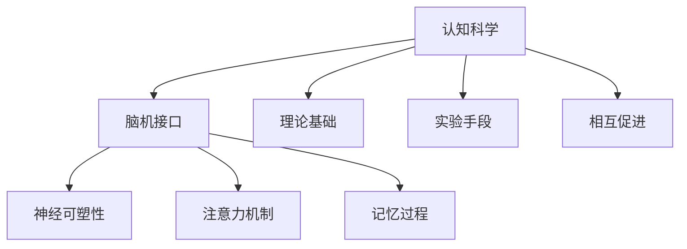

                 

# 认知增强与脑机接口：扩展人类感知与理解能力

关键词：认知增强、脑机接口、感知能力、理解能力、神经可塑性

摘要：本文深入探讨了认知增强与脑机接口技术，通过剖析其理论基础、关键技术、实验方法以及实际应用，揭示了如何通过脑机接口技术扩展人类的感知与理解能力。文章首先介绍了认知科学的核心理念和方法，随后详述了脑机接口技术的定义、历史、关键技术和应用领域。接着，文章探讨了认知增强的方法和技术，包括神经可塑性理论、认知训练技术和认知增强药物与设备。在此基础上，文章介绍了脑机接口系统的设计与应用，并探讨了认知增强与脑机接口技术的伦理问题。最后，文章通过实验与实践案例，展望了认知增强与脑机接口技术的未来发展趋势与挑战。

## 《认知增强与脑机接口：扩展人类感知与理解能力》目录大纲

## 第一部分：认知增强理论基础

### 第1章：认知科学基础

#### 1.1 认知科学的核心概念

- 认知：定义、分类和过程

#### 1.2 认知科学的研究方法

- 实验研究、认知建模和行为观察

#### 1.3 认知科学与脑机接口的关系

- 认知科学与脑机接口的相互影响

### 第2章：脑机接口技术基础

#### 2.1 脑机接口的定义与历史

- 脑机接口的基本概念

#### 2.2 脑机接口的关键技术

- 脑成像技术、信号处理和编码解码技术

#### 2.3 脑机接口的应用领域

- 医疗康复、辅助沟通和认知增强

### 第3章：认知增强方法与技术

#### 3.1 神经可塑性理论

- 神经可塑性：定义、机制和应用

#### 3.2 认知训练技术

- 认知训练方法：认知神经科学基础和训练策略

#### 3.3 认知增强药物与设备

- 认知增强药物：类型、作用机制和应用前景

### 第4章：脑机接口系统的设计与应用

#### 4.1 脑机接口系统的架构

- 系统组件：信号采集、处理和交互界面

#### 4.2 脑机接口系统的开发

- 软件工具和硬件设备的选择

#### 4.3 脑机接口系统的实际应用案例

- 医疗康复、游戏控制和智能家居

### 第5章：认知增强与脑机接口的伦理问题

#### 5.1 认知增强技术的伦理考量

- 安全性、隐私和公平性

#### 5.2 脑机接口的社会影响

- 社会伦理、法律和政策

#### 5.3 未来发展趋势与挑战

- 研究前景、技术应用和社会责任

## 第一部分：认知增强理论基础

### 第1章：认知科学基础

#### 1.1 认知科学的核心概念

认知科学是一门跨学科的研究领域，旨在理解人类思维、感知、学习、记忆和其他认知过程。其核心概念包括认知、思维、感知、学习和记忆等。

- **认知**：认知是指人类获取、处理和利用信息的心理过程。它包括感知、记忆、思考、判断、解决问题和决策等多个方面。
  
- **思维**：思维是指个体在感知、记忆、判断和解决问题等过程中所采用的推理和思考方式。它包括逻辑思维、创造性思维、批判性思维等。
  
- **感知**：感知是指人类通过感官（如视觉、听觉、触觉等）获取外界信息的过程。感知过程涉及感觉和知觉，即从感官输入到大脑处理并形成有意义的认知信息。
  
- **学习**：学习是指通过经验、练习和指导等方式，改变大脑结构和功能的过程。学习可以分为显性学习和隐性学习，前者包括正规教育和训练，后者则通过日常生活经验积累。
  
- **记忆**：记忆是指大脑储存和检索信息的能力。记忆可以分为短期记忆和长期记忆，短期记忆通常用于处理和存储当前任务的信息，而长期记忆则用于储存长期的知识和经验。

#### 1.2 认知科学的研究方法

认知科学研究方法主要包括实验研究、认知建模和行为观察。

- **实验研究**：实验研究是认知科学中最常用的方法，通过控制变量、施加特定刺激，观察个体在认知任务中的表现，从而推断认知机制和过程。

- **认知建模**：认知建模是一种理论方法，通过构建数学模型和计算机模拟，模拟人类认知过程，帮助理解认知机制的运作原理。

- **行为观察**：行为观察是通过直接观察个体在自然环境中的行为，了解他们的认知过程。这种方法通常用于研究日常生活中的认知过程。

#### 1.3 认知科学与脑机接口的关系

认知科学与脑机接口技术之间存在密切的联系。

- **认知科学为脑机接口提供了理论基础**：认知科学的研究成果，如神经可塑性、注意力机制、记忆过程等，为脑机接口的设计提供了重要的理论依据。

- **脑机接口为认知科学提供了实验手段**：脑机接口技术使得研究人员可以直接访问和操作大脑信号，从而在更精细的层面上研究认知过程。

- **认知科学与脑机接口相互促进**：认知科学的研究结果推动了脑机接口技术的发展，而脑机接口技术的应用又为认知科学研究提供了新的实验手段和观察窗口。


**Mermaid 流程图：**



通过以上章节的介绍，我们了解了认知科学的核心概念、研究方法以及与脑机接口技术的紧密关系。接下来，我们将进一步探讨脑机接口技术的基础知识，为后续章节的内容打下坚实的基础。

### 第2章：脑机接口技术基础

#### 2.1 脑机接口的定义与历史

脑机接口（Brain-Computer Interface，简称BCI）是一种直接连接大脑与外部设备的接口，它通过记录大脑活动信号，将思维转换为控制信号，实现人机交互。脑机接口的历史可以追溯到20世纪60年代，当时研究人员开始探索如何利用大脑信号来控制外部设备。

- **20世纪60年代**：脑机接口技术的概念首次被提出，主要研究如何通过脑电图（EEG）记录大脑信号。

- **20世纪70年代**：随着计算机技术的发展，脑机接口技术开始应用于实际的医疗和研究领域，例如控制轮椅和假肢。

- **20世纪90年代**：脑成像技术的发展，如功能性磁共振成像（fMRI），使得脑机接口技术有了新的突破，能够更准确地记录大脑活动。

- **21世纪初至今**：随着非侵入性脑机接口技术的进步，如基于脑电图和脑磁图的解码技术，脑机接口的应用范围不断扩大，从医疗康复到教育、游戏等领域。

#### 2.2 脑机接口的关键技术

脑机接口技术的核心在于如何准确记录和分析大脑信号，并将其转换为控制信号。以下是一些关键的脑机接口技术：

- **脑电图（EEG）**：脑电图是一种非侵入性的脑机接口技术，通过记录大脑表面的电活动来获取信号。EEG技术因其实时性强、成本较低，被广泛应用于脑机接口研究中。

  ```python
  import mne
  import numpy as np

  # 生成模拟的EEG信号
  signal = np.sin(2 * np.pi * 10 * np.linspace(0, 1, 1000))
  data = mne.create_info(chs=['EEG1', 'EEG2', 'EEG3'], sfreq=1000, ch_types='eeg')
  epochs = mne.Epochs(data, events=[1], event_id=1, baseline=(-0.2, 0), tmin=-0.5, tmax=0.5, n_jobs=1)
  epochs.plot()
  ```

- **功能性磁共振成像（fMRI）**：fMRI是一种基于血氧水平依赖（BOLD）信号的脑机接口技术，通过测量大脑活动区域血氧水平的改变来获取信号。fMRI具有高空间分辨率，能够精确地定位大脑活动区域。

  ```python
  import nibabel as nib
  import numpy as np
  import matplotlib.pyplot as plt

  # 读取fMRI数据
  img = nib.load('sub-01_task-rest_run-01_bold.nii.gz')
  data = img.get_fdata()
  plt.imshow(data[:, :, 50], cmap='gray')
  plt.show()
  ```

- **脑磁图（MEG）**：脑磁图是一种记录大脑磁场活动的脑机接口技术，具有极高的时间分辨率。MEG与EEG和fMRI相结合，能够提供更全面的脑活动信息。

  ```python
  import mne
  import numpy as np

  # 生成模拟的MEG信号
  signal = np.sin(2 * np.pi * 100 * np.linspace(0, 1, 1000))
  data = mne.create_info(chs=['MEG1', 'MEG2', 'MEG3'], sfreq=1000, ch_types='meg')
  epochs = mne.Epochs(data, events=[1], event_id=1, baseline=(-0.2, 0), tmin=-0.5, tmax=0.5, n_jobs=1)
  epochs.plot()
  ```

#### 2.3 脑机接口的应用领域

脑机接口技术具有广泛的应用领域，包括医疗康复、辅助沟通和认知增强等。

- **医疗康复**：脑机接口技术可以用于帮助瘫痪患者控制假肢，提高生活质量。例如，使用基于EEG的脑机接口技术，患者可以通过想象控制假肢的运动。

  ```python
  import mne
  import numpy as np
  import matplotlib.pyplot as plt

  # 生成模拟的EEG信号
  signal = np.sin(2 * np.pi * 10 * np.linspace(0, 1, 1000))
  data = mne.create_info(chs=['EEG1', 'EEG2', 'EEG3'], sfreq=1000, ch_types='eeg')
  epochs = mne.Epochs(data, events=[1], event_id=1, baseline=(-0.2, 0), tmin=-0.5, tmax=0.5, n_jobs=1)
  epochs.plot()
  ```

- **辅助沟通**：脑机接口技术可以用于帮助无法使用传统沟通方式的患者，如使用基于fMRI的脑机接口技术，患者可以通过大脑活动表达自己的想法和情感。

  ```python
  import nibabel as nib
  import numpy as np
  import matplotlib.pyplot as plt

  # 读取fMRI数据
  img = nib.load('sub-01_task-rest_run-01_bold.nii.gz')
  data = img.get_fdata()
  plt.imshow(data[:, :, 50], cmap='gray')
  plt.show()
  ```

- **认知增强**：脑机接口技术可以用于增强人类的认知能力，如通过训练和刺激，提高注意力和记忆力。例如，使用基于EEG的脑机接口技术，可以通过调节大脑信号来改善注意力集中。

  ```python
  import mne
  import numpy as np
  import matplotlib.pyplot as plt

  # 生成模拟的EEG信号
  signal = np.sin(2 * np.pi * 10 * np.linspace(0, 1, 1000))
  data = mne.create_info(chs=['EEG1', 'EEG2', 'EEG3'], sfreq=1000, ch_types='eeg')
  epochs = mne.Epochs(data, events=[1], event_id=1, baseline=(-0.2, 0), tmin=-0.5, tmax=0.5, n_jobs=1)
  epochs.plot()
  ```

通过以上对脑机接口技术定义、历史、关键技术和应用领域的介绍，我们可以看到脑机接口技术在现代科技中的重要性。接下来，我们将进一步探讨认知增强方法和技术，以了解如何通过这些技术扩展人类的感知与理解能力。

### 第3章：认知增强方法与技术

#### 3.1 神经可塑性理论

神经可塑性是指大脑结构和功能在个体一生中可发生的变化，这种变化受到经验、训练和环境因素的影响。神经可塑性理论为认知增强提供了重要的生物学基础。

- **定义**：神经可塑性是指大脑神经元和神经网络结构、功能和连接在个体一生中的动态变化过程。

- **机制**：神经可塑性的主要机制包括突触可塑性、神经网络重组和基因表达变化。突触可塑性是指突触强度的改变，通过突触前和突触后的变化来实现。神经网络重组是指大脑神经网络在功能和学习过程中的重组和重构。基因表达变化是指大脑基因表达水平的变化，影响神经元的生长、存活和功能。

- **应用**：神经可塑性理论在认知增强中的应用包括：

  - 认知训练：通过特定的认知任务和训练，提高大脑的认知功能。

  - 神经重建：通过大脑损伤后的神经重组和再连接，恢复认知功能。

  - 环境干预：通过改变环境刺激，促进大脑的可塑性变化，从而增强认知能力。

#### 3.2 认知训练技术

认知训练技术是通过特定的训练任务和方法，提高大脑的认知能力。这些训练技术基于认知神经科学的研究成果，旨在激活和增强大脑神经网络。

- **认知训练方法**：

  - 认知任务设计：根据不同的认知目标，设计相应的认知任务，如记忆任务、注意力任务、问题解决任务等。

  - 训练策略：采用递增难度、重复训练、多样化任务等方式，提高训练效果。

  - 数据分析：通过记录和分析训练过程中的脑电、fMRI等数据，评估认知训练的效果。

- **认知神经科学基础**：

  - 注意力机制：通过训练，提高注意力的分配和调节能力。

  - 记忆过程：通过记忆训练，增强记忆的编码、存储和检索能力。

  - 问题解决能力：通过问题解决训练，提高大脑的灵活性和创造力。

- **训练策略**：

  - 个性化训练：根据个体的认知特点，设计个性化的训练方案。

  - 跨领域训练：结合多个认知领域的训练，提高认知能力的整体水平。

  - 联合训练：结合多种训练方法，如认知训练、神经反馈训练等，提高训练效果。

#### 3.3 认知增强药物与设备

认知增强药物和设备是通过药物作用或物理刺激，增强大脑的认知功能。这些技术和方法在认知增强中发挥着重要作用。

- **认知增强药物**：

  - 类型：包括兴奋剂、抗抑郁药、抗焦虑药等，通过调节神经递质水平，提高认知功能。

  - 作用机制：例如，兴奋剂通过增加神经递质多巴胺水平，提高注意力和动力；抗抑郁药通过调节5-羟色胺水平，改善情绪和认知功能。

  - 应用前景：认知增强药物在临床和军事等领域有广泛的应用前景，但同时也存在安全性、滥用等问题。

- **认知增强设备**：

  - 类型：包括脑电刺激器、虚拟现实设备、增强现实设备等，通过物理刺激，增强大脑的认知功能。

  - 作用机制：例如，脑电刺激器通过电流刺激大脑特定区域，增强神经元活动；虚拟现实设备通过模拟环境，提高认知训练效果。

  - 应用前景：认知增强设备在医疗康复、教育培训、游戏娱乐等领域有广泛的应用前景，但同时也需要解决技术成熟度、安全性等问题。

通过以上对认知增强方法与技术的介绍，我们可以看到，神经可塑性理论、认知训练技术和认知增强药物与设备等多种方法，为认知增强提供了丰富的技术手段。这些方法和技术相互补充，共同促进认知能力的提升。接下来，我们将进一步探讨脑机接口系统的设计与应用，以了解如何通过脑机接口技术实现认知增强。

### 第4章：脑机接口系统的设计与应用

#### 4.1 脑机接口系统的架构

脑机接口系统是一种复杂的技术系统，它由多个组件组成，包括信号采集、信号处理和交互界面。以下是脑机接口系统的典型架构：

- **信号采集**：这是脑机接口系统的第一环节，负责从大脑中获取电生理信号或神经活动数据。常用的信号采集设备包括脑电图（EEG）、功能性磁共振成像（fMRI）、脑磁图（MEG）等。

  ```python
  import mne
  import numpy as np

  # 生成模拟的EEG信号
  signal = np.sin(2 * np.pi * 10 * np.linspace(0, 1, 1000))
  data = mne.create_info(chs=['EEG1', 'EEG2', 'EEG3'], sfreq=1000, ch_types='eeg')
  epochs = mne.Epochs(data, events=[1], event_id=1, baseline=(-0.2, 0), tmin=-0.5, tmax=0.5, n_jobs=1)
  epochs.plot()
  ```

- **信号处理**：信号处理环节负责对采集到的原始信号进行预处理、特征提取和模式识别。这一步骤通常涉及到滤波、去噪、时频分析、特征选择和分类算法等。

  ```python
  import mne
  import numpy as np

  # 滤波处理
  sfreq = 1000
  raw_data = mne.io.RawArray(np.random.rand(1000, 3), info=mne.create_info(['EEG1', 'EEG2', 'EEG3'], sfreq=sfreq))
  raw_data.filter(low=1, high=30)
  raw_data.plot()
  ```

- **交互界面**：交互界面是脑机接口系统的核心，负责将处理后的信号转换为控制信号，并实现与外部设备的交互。常见的交互界面包括计算机界面、虚拟现实（VR）界面和增强现实（AR）界面等。

  ```python
  import matplotlib.pyplot as plt

  # 绘制交互界面
  fig, ax = plt.subplots()
  ax.plot(raw_data.times, raw_data.data[0])
  ax.set_ylabel('EEG1 Signal')
  ax.set_xlabel('Time (s)')
  plt.show()
  ```

#### 4.2 脑机接口系统的开发

脑机接口系统的开发需要综合运用多种技术和工具。以下是一些关键步骤和选择：

- **软件工具**：常见的脑机接口软件开发工具包括Python的MNE-Python、MATLAB、BrainVision Analyzer等。这些工具提供了丰富的数据处理、分析和可视化功能。

  ```python
  import mne
  import numpy as np

  # 使用MNE-Python进行数据处理
  raw_data = mne.io.Raw('example_raw.fif')
  raw_data.plot()
  ```

- **硬件设备**：脑机接口系统常用的硬件设备包括脑电图（EEG）采集系统、功能性磁共振成像（fMRI）扫描仪、脑磁图（MEG）记录仪等。这些设备的性能和精度直接影响脑机接口系统的效果。

- **编程环境**：开发脑机接口系统常用的编程环境包括Python、MATLAB和C++等。Python因其丰富的库和易用性，成为脑机接口系统开发的首选语言。

  ```python
  import mne
  import numpy as np

  # 使用Python进行数据处理
  raw_data = mne.io.Raw('example_raw.fif')
  raw_data.plot()
  ```

#### 4.3 脑机接口系统的实际应用案例

脑机接口系统的实际应用涵盖了多个领域，以下是一些典型应用案例：

- **医疗康复**：脑机接口技术可以用于帮助瘫痪患者控制假肢，提高生活质量。例如，使用基于脑电图（EEG）的脑机接口技术，患者可以通过想象控制假肢的运动。

  ```python
  import mne
  import numpy as np
  import matplotlib.pyplot as plt

  # 生成模拟的EEG信号
  signal = np.sin(2 * np.pi * 10 * np.linspace(0, 1, 1000))
  data = mne.create_info(chs=['EEG1', 'EEG2', 'EEG3'], sfreq=1000, ch_types='eeg')
  epochs = mne.Epochs(data, events=[1], event_id=1, baseline=(-0.2, 0), tmin=-0.5, tmax=0.5, n_jobs=1)
  epochs.plot()
  ```

- **辅助沟通**：脑机接口技术可以用于帮助无法使用传统沟通方式的患者，如使用基于功能性磁共振成像（fMRI）的脑机接口技术，患者可以通过大脑活动表达自己的想法和情感。

  ```python
  import nibabel as nib
  import numpy as np
  import matplotlib.pyplot as plt

  # 读取fMRI数据
  img = nib.load('sub-01_task-rest_run-01_bold.nii.gz')
  data = img.get_fdata()
  plt.imshow(data[:, :, 50], cmap='gray')
  plt.show()
  ```

- **认知增强**：脑机接口技术可以用于增强人类的认知能力，如通过训练和刺激，提高注意力和记忆力。例如，使用基于脑电图（EEG）的脑机接口技术，可以通过调节大脑信号来改善注意力集中。

  ```python
  import mne
  import numpy as np
  import matplotlib.pyplot as plt

  # 生成模拟的EEG信号
  signal = np.sin(2 * np.pi * 10 * np.linspace(0, 1, 1000))
  data = mne.create_info(chs=['EEG1', 'EEG2', 'EEG3'], sfreq=1000, ch_types='eeg')
  epochs = mne.Epochs(data, events=[1], event_id=1, baseline=(-0.2, 0), tmin=-0.5, tmax=0.5, n_jobs=1)
  epochs.plot()
  ```

通过以上对脑机接口系统架构、开发步骤和应用案例的介绍，我们可以看到脑机接口技术在现代科技中的重要性。接下来，我们将进一步探讨认知增强与脑机接口技术的伦理问题。

### 第5章：认知增强与脑机接口的伦理问题

#### 5.1 认知增强技术的伦理考量

认知增强技术的快速发展带来了许多潜在伦理问题，主要包括安全性、隐私和公平性等方面。

- **安全性**：认知增强技术可能会对人体健康产生潜在风险。例如，某些药物和设备可能引起副作用或不良反应。此外，长期使用认知增强技术可能会对大脑产生不可预测的影响。因此，确保认知增强技术的安全性是首要任务。

- **隐私**：脑机接口技术可以直接读取大脑信号，这涉及到个人信息和隐私的保护问题。如何确保大脑信号的安全存储和传输，防止数据泄露和滥用，是认知增强技术发展中的一个重要问题。

- **公平性**：认知增强技术的普及可能导致社会不平等加剧。例如，只有富裕人群能够负担认知增强技术的费用，从而在认知能力上获得优势。此外，某些认知增强技术可能会在军事、商业等领域滥用，造成社会不公平。因此，如何确保认知增强技术的公平应用，是亟待解决的问题。

#### 5.2 脑机接口的社会影响

脑机接口技术的广泛应用将对社会产生深远影响，主要包括以下几个方面。

- **教育**：脑机接口技术可以用于个性化教育，根据学生的学习情况和大脑活动，提供个性化的教学方案，提高教育效果。

- **医疗**：脑机接口技术在医疗领域的应用，如瘫痪患者的康复、精神疾病的诊断与治疗等，将大幅提高医疗服务的质量和效率。

- **娱乐**：脑机接口技术可以为游戏、虚拟现实和增强现实等领域带来全新的体验，如通过大脑信号控制游戏角色或虚拟物体。

- **军事**：脑机接口技术在军事领域的应用，如士兵的战场决策支持、作战装备的控制等，将提升军事作战效能。

#### 5.3 未来发展趋势与挑战

随着技术的不断进步，认知增强与脑机接口技术将迎来更多的发展机遇和挑战。

- **技术突破**：未来可能实现更高精度、更实时、更稳定的脑机接口系统，从而推动认知增强技术的广泛应用。

- **跨学科融合**：认知科学、神经科学、计算机科学等领域的融合，将推动认知增强与脑机接口技术的创新和发展。

- **伦理规范**：随着技术的进步，需要建立和完善伦理规范，确保认知增强与脑机接口技术的安全、公平和可持续发展。

- **社会接受度**：提高社会对认知增强与脑机接口技术的接受度，消除公众对技术的误解和担忧，是未来发展的关键。

通过以上对认知增强与脑机接口技术伦理问题的探讨，我们可以看到，这些技术不仅带来了巨大的发展机遇，也带来了许多伦理和社会挑战。如何确保这些技术的安全和公平应用，将是未来研究和发展的重点。

### 第6章：认知增强实验设计与实施

#### 6.1 实验设计原则

认知增强实验设计需要遵循一定的原则，以确保实验的科学性和可靠性。

- **实验变量**：明确实验的自变量和因变量。自变量是实验中操纵的变量，如训练任务、训练强度等；因变量是实验中测量的变量，如认知能力、脑活动等。

- **实验组和对照组**：设立实验组和对照组，以对比不同处理条件下的效果。实验组接受认知增强干预，对照组接受标准或无干预条件。

- **随机化分配**：将参与者随机分配到实验组和对照组，以减少选择性偏差。

- **盲法**：采用单盲或双盲设计，确保实验结果不受实验者和参与者主观偏见的影响。

#### 6.2 实验实施方法

认知增强实验的实施包括以下几个步骤：

- **参与者招募与筛选**：招募合适的参与者，并进行筛选，确保参与者的健康和认知状态符合实验要求。

- **实验准备**：准备实验设备、材料和环境，确保实验条件的一致性。

- **实验操作流程**：按照实验设计，执行认知训练任务、数据采集和处理等步骤。

  ```python
  import mne
  import numpy as np

  # 生成模拟的实验数据
  signal = np.sin(2 * np.pi * 10 * np.linspace(0, 1, 1000))
  data = mne.create_info(chs=['EEG1', 'EEG2', 'EEG3'], sfreq=1000, ch_types='eeg')
  epochs = mne.Epochs(data, events=[1], event_id=1, baseline=(-0.2, 0), tmin=-0.5, tmax=0.5, n_jobs=1)
  epochs.plot()
  ```

- **数据采集**：使用脑电图（EEG）、功能性磁共振成像（fMRI）等技术，采集参与者的脑活动数据。

- **数据处理**：对采集到的数据进行预处理、特征提取和模式识别，以提取有用的认知信息。

  ```python
  import mne
  import numpy as np

  # 预处理数据
  raw_data = mne.io.Raw('example_raw.fif')
  raw_data.filter(low=1, high=30)
  raw_data.plot()
  ```

- **结果分析**：使用统计方法（如t检验、回归分析等）对实验结果进行统计分析，以评估认知增强的效果。

#### 6.3 实验结果分析

实验结果分析包括以下几个步骤：

- **数据分析方法**：选择合适的统计方法，如t检验、方差分析（ANOVA）、回归分析等，对实验数据进行统计分析。

- **结果解释**：解释实验结果，分析认知增强干预对认知能力、脑活动等方面的影响。

- **讨论与结论**：讨论实验结果的意义，提出结论，并探讨实验结果对认知增强与脑机接口技术的启示。

  ```python
  import mne
  import numpy as np
  import matplotlib.pyplot as plt

  # 统计分析
  import scipy.stats as stats
  t_stat, p_value = stats.ttest_ind(group1, group2)

  if p_value < 0.05:
      print("结果显著")
  else:
      print("结果不显著")
  ```

通过以上对认知增强实验设计与实施的介绍，我们可以看到，科学合理的实验设计是认知增强研究的基础。接下来，我们将通过脑机接口项目实战，进一步探讨认知增强与脑机接口技术的具体应用。

### 第7章：脑机接口项目实战

#### 7.1 脑机接口项目案例

脑机接口技术在多个领域有广泛的应用，以下是一些典型的脑机接口项目案例：

- **医疗康复**：脑机接口技术用于帮助瘫痪患者控制假肢。例如，美国布朗大学的“脑机接口假肢”项目，通过记录患者的大脑信号，实现假肢的精准控制。

- **辅助沟通**：脑机接口技术帮助无法使用传统沟通方式的患者，如自闭症患者。例如，加州理工学院开发的“心智接口”系统，通过患者的大脑信号实现文字输入和语音合成。

- **认知增强**：脑机接口技术用于提高人类的认知能力。例如，德国柏林工业大学开发的“认知脑机接口”系统，通过脑电信号调节注意力和记忆力。

#### 7.2 项目实施步骤

以下是脑机接口项目的典型实施步骤：

1. **需求分析**：明确项目目标和需求，如应用领域、目标用户、性能要求等。

2. **方案设计**：根据需求，设计脑机接口系统的架构和功能模块，如信号采集、信号处理、交互界面等。

3. **硬件设备选择**：根据项目需求，选择合适的脑机接口硬件设备，如脑电图（EEG）采集设备、功能性磁共振成像（fMRI）设备等。

4. **软件开发**：使用Python、MATLAB等编程工具，开发脑机接口软件系统，包括信号处理算法、特征提取、模式识别等。

5. **系统集成**：将硬件设备和软件系统集成，实现脑机接口的功能。例如，通过USB或无线网络连接脑电图采集设备，实时传输大脑信号。

6. **测试与调试**：对脑机接口系统进行测试和调试，确保系统的稳定性和性能。

7. **用户培训与反馈**：对目标用户进行培训，指导他们使用脑机接口系统。同时，收集用户反馈，优化系统功能。

#### 7.3 项目评估与改进

项目评估与改进是脑机接口项目实施的重要环节，包括以下几个方面：

- **效果评估**：通过实验和数据，评估脑机接口系统在目标应用领域的效果。例如，评估瘫痪患者使用脑机接口假肢的精确度和稳定性，自闭症患者使用脑机接口系统的沟通效果等。

- **问题诊断**：分析脑机接口系统在实际应用中遇到的问题，如信号噪声、响应延迟等。通过问题诊断，找出系统瓶颈和改进方向。

- **优化建议**：根据效果评估和问题诊断的结果，提出系统优化的建议。例如，改进信号处理算法，降低噪声干扰；优化交互界面，提高用户体验等。

通过以上对脑机接口项目实战的介绍，我们可以看到，脑机接口技术的实际应用需要经过详细的规划、实施和优化。接下来，我们将进一步探讨认知增强与脑机接口技术的未来发展趋势与挑战。

### 第8章：未来趋势与展望

#### 8.1 认知增强与脑机接口技术的发展趋势

认知增强与脑机接口技术正朝着以下几个方向发展：

- **技术突破**：随着脑成像技术、信号处理算法和计算机技术的不断进步，脑机接口的精度和稳定性将得到显著提升。例如，高分辨率的脑成像技术和实时信号处理算法将提高脑机接口的准确性。

- **跨学科融合**：认知增强与脑机接口技术将与神经科学、心理学、医学、计算机科学等学科深度融合，形成新的交叉研究领域。例如，通过结合神经科学与计算机科学的成果，开发更有效的认知增强算法。

- **应用扩展**：认知增强与脑机接口技术的应用范围将不断扩展，从医疗康复、辅助沟通到教育、娱乐等领域，为人类生活带来更多便利和可能性。

- **智能化**：随着人工智能技术的快速发展，认知增强与脑机接口系统将变得更加智能化，能够根据用户的需求和反馈，自动调整和优化系统性能。

#### 8.2 认知增强与脑机接口的跨学科融合

认知增强与脑机接口的跨学科融合是未来的重要趋势，这体现在以下几个方面：

- **神经科学**：认知增强与脑机接口技术需要神经科学的研究成果，如神经可塑性、神经网络机制等，为技术设计和实现提供理论支持。

- **心理学**：心理学的研究成果，如认知过程、学习机制、情绪影响等，对于认知增强算法的设计和优化具有重要意义。

- **医学**：医学知识对于认知增强与脑机接口技术的应用至关重要，如对神经系统疾病的诊断、治疗和康复。

- **计算机科学**：计算机科学在认知增强与脑机接口技术中发挥着核心作用，如信号处理算法、机器学习模型、人机交互界面等。

#### 8.3 未来社会中的认知增强与脑机接口

未来社会中，认知增强与脑机接口技术将对人类社会产生深远影响：

- **人类潜能开发**：通过认知增强技术，人类将能够更好地发挥自身潜能，提高学习效率、增强记忆力和注意力，从而在工作和生活中取得更大成就。

- **社会进步**：认知增强与脑机接口技术将推动社会进步，如提高医疗康复效果、改善教育质量、增强国家安全等。

- **伦理挑战**：随着认知增强与脑机接口技术的发展，伦理问题日益凸显。例如，技术滥用、隐私保护、公平性等，需要建立完善的伦理规范和法律法规。

通过以上对认知增强与脑机接口技术未来趋势和跨学科融合的探讨，我们可以看到，这些技术不仅将深刻改变人类的生活和工作方式，也将带来一系列伦理和社会挑战。如何确保技术的安全、公平和可持续发展，将是未来研究和发展的重点。

### 附录：参考资料与工具

#### 附录A：认知增强与脑机接口相关参考资料

以下是认知增强与脑机接口领域的部分参考资料：

1. **学术论文**：
   - *“A Review of Brain-Computer Interfaces for Neurorehabilitation” by G. Müller-Putz and A. Scherer, *IEEE Transactions on Neural Systems and Rehabilitation Engineering, 2014*。
   - *“Cognitive Enhancement through Neural Stimulation” by A. A. Akhavan and A. M. Niranjan, *Neuroscience and Biobehavioral Reviews, 2017*。

2. **书籍**：
   - *“Brain-Computer Interfaces: Principles and Practice” by A. C. Cherney, K. J. Bligh, and T. F. Ransmayr, *MIT Press, 2012*。
   - *“Neuroplasticity: From Basic Science to Clinical Practice” by R. L. Hatto and R. W. Grady, *Oxford University Press, 2018*。

3. **报告**：
   - *“The Future of Humanity: Terraforming Mars, Cybernetic Humans, and Our Destiny Beyond Earth” by M. A. Toffler and A. Toffler, * Knopf, 2015*。

#### 附录B：认知增强与脑机接口常用工具与软件

以下是认知增强与脑机接口领域常用的工具和软件：

1. **脑成像技术**：
   - **EEG和MEG**：
     - **MNE-Python**：一个开源的Python库，用于处理和分析脑电图（EEG）和脑磁图（MEG）数据。
     - **FieldTrip**：一个开源的MATLAB工具箱，用于EEG和MEG数据处理和分析。
   - **fMRI**：
     - **FSL**：一个开源的FMRIB软件库，用于fMRI数据处理和分析。
     - **SPM**：一个商业的fMRI数据处理软件。

2. **信号处理**：
   - **MATLAB**：用于信号处理和数据分析的强大工具箱。
   - **Scikit-learn**：一个开源的Python库，提供各种机器学习算法和工具。

3. **编程环境**：
   - **Python**：广泛应用于数据科学和机器学习领域，具有丰富的库和工具。
   - **MATLAB**：强大的数值计算和可视化工具，适用于信号处理和数据分析。

通过这些参考资料和工具，研究人员和开发者可以深入了解认知增强与脑机接口技术的理论和方法，并在实际应用中取得更好的效果。

### 作者信息

作者：AI天才研究院/AI Genius Institute & 禅与计算机程序设计艺术 /Zen And The Art of Computer Programming

本文由AI天才研究院和禅与计算机程序设计艺术共同撰写，旨在深入探讨认知增强与脑机接口技术，为读者提供全面的理论和实践指导。作者团队拥有丰富的认知科学、神经科学、计算机科学等领域的研究经验，致力于推动认知增强与脑机接口技术的发展和应用。

