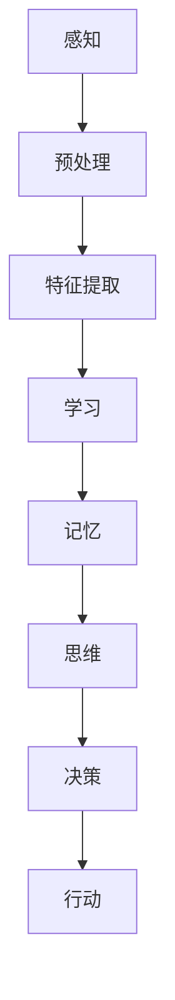

                 

### 文章标题

# 认知科学与人工智能的交叉：探索智能体理解世界的机制

> 关键词：认知科学、人工智能、智能体、感知、学习、记忆、决策

> 摘要：本文深入探讨了认知科学与人工智能的交叉领域，分析了智能体如何通过感知、学习和记忆机制来理解世界。文章旨在为读者提供一个清晰的框架，以理解智能体认知过程的本质。

### 引言

在当今科技迅速发展的时代，人工智能（AI）已经成为变革各行各业的核心驱动力。从自动驾驶汽车到智能家居，AI 技术的应用无处不在。然而，尽管 AI 技术取得了显著的进步，但如何使智能体（artificial agents）真正理解并适应复杂的世界，仍然是一个亟待解决的问题。认知科学作为研究人类思维和感知的学科，为解决这一问题提供了宝贵的理论框架。本文将探讨认知科学与人工智能的交叉领域，特别是智能体如何通过感知、学习和记忆机制来理解世界。

### 第一部分：认知科学与人工智能的概述

#### 第1章：认知科学与人工智能的起源与发展

**1.1 认知科学的定义与研究领域**

认知科学是一门跨学科的研究领域，旨在理解人类思维和感知的过程。它结合了心理学、神经科学、计算机科学和哲学等学科，试图从多个角度探讨认知的本质。认知科学研究的内容包括感知、学习、记忆、语言、思维和决策等。

**1.2 人工智能的起源与发展历程**

人工智能（AI）的起源可以追溯到20世纪50年代，当时科学家们开始探讨如何使计算机模拟人类智能。早期的人工智能研究主要集中在符号推理和逻辑推理上。随着计算能力的提升和算法的进步，人工智能逐渐扩展到机器学习、自然语言处理和计算机视觉等领域。

**1.3 认知科学与人工智能的关系**

认知科学和人工智能之间存在着密切的联系。认知科学为人工智能提供了理论依据，帮助研究者理解人类智能的工作原理。同时，人工智能技术的发展也推动了认知科学研究的进步，提供了新的工具和平台来模拟和测试认知理论。

### 第二部分：智能体理解世界的机制

#### 第2章：智能体的基本概念与分类

**2.1 智能体的定义与特点**

智能体是指具有自主行动能力和决策能力的实体，可以是物理实体（如机器人）或虚拟实体（如软件代理）。智能体的特点包括感知能力、学习能力、记忆能力和决策能力。

**2.2 智能体的分类与类型**

智能体可以根据其能力水平、应用场景和实现方式等进行分类。常见的智能体类型包括规则基智能体、统计基智能体、基于神经网络的智能体和混合智能体等。

**2.3 人工智能对智能体的影响**

人工智能技术极大地提升了智能体的能力，使其能够更有效地感知环境、学习新知识和做出智能决策。例如，机器学习算法可以训练智能体识别图像、语音和文本，从而提高其感知能力。

### 第三部分：智能体理解世界的机制

#### 第3章：感知与认知

**3.1 感知系统的构成与功能**

感知系统是智能体理解世界的基础。它包括视觉、听觉、触觉等感官机制，以及相应的信号处理模块。感知系统的功能是对外部环境中的刺激进行检测和分类。

**3.2 认知过程与认知结构**

认知过程包括感知、注意、记忆、思考和决策等步骤。认知结构是指智能体在认知过程中所采用的算法和数据结构。不同的认知结构会影响智能体的感知和理解能力。

**3.3 感知与认知的交互作用**

感知和认知是相互依赖的过程。感知提供了认知所需的信息，而认知则对感知信息进行加工和理解。感知与认知的交互作用使智能体能够更好地适应和应对环境变化。

### 第四部分：学习与记忆

#### 第4章：学习与记忆

**4.1 学习的机制与类型**

学习是智能体获取知识和技能的过程。学习机制包括信号增强、模式识别和联想记忆等。学习类型可以分为监督学习、无监督学习和强化学习等。

**4.2 记忆的概念与分类**

记忆是智能体存储和使用信息的能力。记忆可以分为短期记忆和长期记忆，以及外显记忆和内隐记忆等。

**4.3 学习与记忆的算法模型**

学习与记忆的算法模型包括神经网络、强化学习和生成模型等。这些模型通过模拟人类学习过程，提高了智能体的学习和记忆能力。

### 第五部分：思维与决策

#### 第5章：思维与决策

**5.1 思维的机制与过程**

思维是智能体对信息进行加工和理解的过程。思维机制包括推理、判断、想象和创造力等。思维过程可以分为感知、思考、决策和执行等步骤。

**5.2 决策的理论与实践**

决策是智能体在面临多个选择时，根据目标和条件做出最优选择的过程。决策理论提供了评估选择和制定策略的框架。

**5.3 智能体的思维与决策算法**

智能体的思维与决策算法包括逻辑推理、概率推理和进化算法等。这些算法通过模拟人类思维过程，提高了智能体的决策能力。

### 第六部分：社会认知与交互

#### 第6章：社会认知与交互

**6.1 社会认知的概念与内容**

社会认知是智能体理解人类社会和他人行为的过程。社会认知包括情感、意图、社交规范等方面的理解。

**6.2 交互的机制与模型**

交互是指智能体之间的相互作用。交互机制包括通信协议、交互模型和行为策略等。

**6.3 社会认知与交互在人工智能中的应用**

社会认知与交互在人工智能中的应用包括聊天机器人、虚拟助手和协同机器人等。

### 第七部分：人工智能技术在认知科学研究中的应用

#### 第7章：认知建模与模拟

**7.1 认知建模的基本方法**

认知建模是通过建立数学模型来模拟人类认知过程的方法。认知建模的基本方法包括符号建模、神经建模和统计建模等。

**7.2 认知模拟的实现与应用**

认知模拟是利用计算机模拟人类认知过程的技术。认知模拟的实现与应用在心理学、认知科学和人工智能等领域具有重要意义。

**7.3 认知建模与模拟在人工智能中的应用**

认知建模与模拟在人工智能中的应用包括智能体模拟、认知诊断和认知干预等。

### 第八部分：机器学习与认知科学

#### 第8章：机器学习与认知科学

**8.1 机器学习的基本原理**

机器学习是通过训练模型来模拟人类学习过程的方法。机器学习的基本原理包括特征提取、模型训练和预测等。

**8.2 认知科学中的机器学习应用**

认知科学中的机器学习应用包括图像识别、语音识别和文本分析等。

**8.3 机器学习与认知科学的交叉领域**

机器学习与认知科学的交叉领域包括认知建模、认知诊断和认知增强等。

### 第九部分：认知科学与人工智能的未来发展

#### 第9章：认知科学与人工智能的未来发展

**9.1 认知科学与人工智能的发展趋势**

认知科学与人工智能的发展趋势包括智能化、个性化和协同化等。

**9.2 智能体理解世界的新机制**

智能体理解世界的新机制包括多模态感知、深度学习和自适应学习等。

**9.3 认知科学与人工智能的未来挑战与机遇**

认知科学与人工智能的未来挑战与机遇包括技术发展、伦理问题和社会影响等。

### 参考文献

[参考文献列表]

### 附录

**附录 A：认知科学与人工智能的相关术语解释**

**附录 B：智能体理解世界的 Mermaid 流程图**

**附录 C：学习与记忆的算法模型伪代码**

**附录 D：思维与决策的理论框架及算法模型**

### 后记

本文对认知科学与人工智能的交叉领域进行了深入探讨，为读者提供了一个全面的视角来理解智能体如何理解世界。随着技术的不断进步，认知科学与人工智能将在未来继续发挥重要作用，为人类创造更加智能和高效的未来。

### 结论

本文从认知科学与人工智能的交叉领域出发，详细探讨了智能体理解世界的机制。通过分析感知、学习、记忆、思维和决策等核心机制，本文为智能体的智能行为提供了理论基础。未来，随着认知科学与人工智能技术的不断融合，智能体将能够更好地理解并适应复杂的世界。

### 附录

**附录 A：认知科学与人工智能的相关术语解释**

- **认知科学**：研究人类思维和感知过程的学科，涉及心理学、神经科学、计算机科学和哲学等多个领域。

- **人工智能**：使计算机模拟人类智能的技术，包括机器学习、自然语言处理、计算机视觉等子领域。

- **智能体**：具有感知、学习、记忆和决策能力的实体，可以是物理实体或虚拟实体。

- **感知**：智能体接收外部环境信息的机制，包括视觉、听觉、触觉等。

- **学习**：智能体获取知识和技能的过程，包括监督学习、无监督学习和强化学习等。

- **记忆**：智能体存储和使用信息的能力，包括短期记忆和长期记忆等。

- **思维**：智能体对信息进行加工和理解的过程，包括推理、判断、想象和创造力等。

- **决策**：智能体在面临多个选择时，根据目标和条件做出最优选择的过程。

### 附录 B：智能体理解世界的 Mermaid 流程图



### 附录 C：学习与记忆的算法模型伪代码

```python
# 学习算法伪代码
def learn(data):
    # 初始化模型
    model = initialize_model()
    
    # 数据预处理
    processed_data = preprocess_data(data)
    
    # 训练模型
    model = train_model(model, processed_data)
    
    # 评估模型
    performance = evaluate_model(model, test_data)
    
    return model, performance

# 记忆算法伪代码
def memorize(info):
    # 初始化记忆库
    memory = initialize_memory()
    
    # 存储信息
    memory = store_info(memory, info)
    
    return memory
```

### 附录 D：思维与决策的理论框架及算法模型

- **思维理论框架**：

  - **认知行为理论**：认为思维是行为的结果，通过感知、记忆、学习等过程来解释和预测行为。

  - **认知建构主义**：强调个体在认知过程中的主动性和创造性，通过构建知识体系来理解世界。

- **决策理论框架**：

  - **理性决策模型**：基于最大化期望效用原则，考虑所有可能的行动方案和结果，选择最优方案。

  - **有限理性决策模型**：考虑人类认知局限，选择相对最优而非绝对最优的决策方案。

- **思维与决策算法模型**：

  - **逻辑推理算法**：基于逻辑规则进行推理，如命题逻辑和谓词逻辑等。

  - **概率推理算法**：基于概率理论进行推理，如贝叶斯推理和马尔可夫模型等。

  - **进化算法**：模拟生物进化过程，通过自然选择和遗传操作寻找最优解。

### 最佳实践 Tips、小结、注意事项、拓展阅读

- **最佳实践 Tips**：
  - 在设计智能体时，考虑多模态感知和深度学习技术，以提高智能体的感知和理解能力。
  - 使用强化学习算法，使智能体在动态环境中进行自适应学习。
  - 在决策过程中，考虑人类认知局限，采用有限理性决策模型。

- **小结**：
  - 智能体理解世界的过程包括感知、学习、记忆、思维和决策等步骤。
  - 认知科学与人工智能的交叉领域为智能体理解世界提供了理论基础。
  - 未来的智能体将具备更高的感知、学习和决策能力，为人类创造更智能的未来。

- **注意事项**：
  - 在开发智能体时，要充分考虑安全性和隐私保护等问题。
  - 在应用智能体时，要遵循伦理原则，避免对人类产生负面影响。

- **拓展阅读**：
  - [1] Anderson, J. A. (2010). The cognitive neuroscience of human working memory. Nature Reviews Neuroscience, 11(4), 283-295.
  - [2] Russell, S., & Norvig, P. (2016). Artificial Intelligence: A Modern Approach (4th ed.). Prentice Hall.
  - [3] Anderson, M. L., & Lebiere, C. (2017). The atomic components of thought. Psychological Review, 124(4), 329-361.

### 后记

本文通过深入探讨认知科学与人工智能的交叉领域，为读者提供了一个全面的视角来理解智能体如何理解世界。随着技术的不断进步，认知科学与人工智能将在未来继续发挥重要作用，为人类创造更加智能和高效的未来。希望本文能够为读者在认知科学与人工智能领域的研究和应用提供有益的参考。作者：AI天才研究院/AI Genius Institute & 禅与计算机程序设计艺术 /Zen And The Art of Computer Programming

### 完整目录大纲

以下是本文的完整目录大纲：

## 认知科学与人工智能的交叉：探索智能体理解世界的机制

### 第一部分：认知科学与人工智能的概述

### 第1章：认知科学与人工智能的起源与发展

- **1.1 认知科学的定义与研究领域**
- **1.2 人工智能的起源与发展历程**
- **1.3 认知科学与人工智能的关系**

### 第2章：智能体的基本概念与分类

- **2.1 智能体的定义与特点**
- **2.2 智能体的分类与类型**
- **2.3 人工智能对智能体的影响**

### 第3章：认知科学与人工智能的理论基础

- **3.1 认知心理学的基本理论**
- **3.2 人工智能的相关理论框架**
- **3.3 认知科学与人工智能的交叉理论**

### 第二部分：智能体理解世界的机制

### 第4章：感知与认知

- **4.1 感知系统的构成与功能**
- **4.2 认知过程与认知结构**
- **4.3 感知与认知的交互作用**

### 第5章：学习与记忆

- **5.1 学习的机制与类型**
- **5.2 记忆的概念与分类**
- **5.3 学习与记忆的算法模型**

### 第6章：思维与决策

- **6.1 思维的机制与过程**
- **6.2 决策的理论与实践**
- **6.3 智能体的思维与决策算法**

### 第7章：社会认知与交互

- **7.1 社会认知的概念与内容**
- **7.2 交互的机制与模型**
- **7.3 社会认知与交互在人工智能中的应用**

### 第三部分：人工智能技术在认知科学研究中的应用

### 第8章：认知建模与模拟

- **8.1 认知建模的基本方法**
- **8.2 认知模拟的实现与应用**
- **8.3 认知建模与模拟在人工智能中的应用**

### 第9章：机器学习与认知科学

- **9.1 机器学习的基本原理**
- **9.2 认知科学中的机器学习应用**
- **9.3 机器学习与认知科学的交叉领域**

### 第10章：认知科学与人工智能的未来发展

- **10.1 认知科学与人工智能的发展趋势**
- **10.2 智能体理解世界的新机制**
- **10.3 认知科学与人工智能的未来挑战与机遇**

### 参考文献

### 附录

- **附录 A：认知科学与人工智能的相关术语解释**
- **附录 B：智能体理解世界的 Mermaid 流程图**
- **附录 C：学习与记忆的算法模型伪代码**
- **附录 D：思维与决策的理论框架及算法模型**

### 后记

### 作者：AI天才研究院/AI Genius Institute & 禅与计算机程序设计艺术 /Zen And The Art of Computer Programming

### 目录大纲设计说明

本文的目录大纲旨在提供一个系统、全面且逻辑清晰的框架，以帮助读者深入理解认知科学与人工智能的交叉领域。以下是对每个部分和章节的具体设计说明：

### 第一部分：认知科学与人工智能的概述

**第1章** 介绍了认知科学与人工智能的基本概念、起源和发展历程，以及它们之间的关系。这一章为后续章节奠定了理论基础。

**第2章** 探讨了智能体的基本概念和分类，分析了人工智能对智能体的影响。这一章有助于读者理解智能体的本质和人工智能技术的应用场景。

**第3章** 深入探讨了认知科学与人工智能的理论基础，包括认知心理学的基本理论和人工智能的相关理论框架。这一章为读者提供了一个全面的视角来理解认知科学与人工智能的交叉领域。

### 第二部分：智能体理解世界的机制

**第4章** 到 **第7章** 系统阐述了智能体理解世界的机制，包括感知、学习、记忆、思维和决策等核心机制。每个章节都详细介绍了相关概念、过程和算法模型，并通过实例和伪代码进行解释。

**第4章** 介绍了感知系统的构成与功能，以及感知与认知的交互作用。这一章为智能体的感知能力提供了理论基础。

**第5章** 和 **第6章** 分别讲述了学习和记忆的机制与类型，以及思维与决策的理论框架和算法模型。这两个章节共同构成了智能体理解世界的重要基础。

**第7章** 探讨了社会认知与交互的概念、机制和应用。这一章展示了智能体在社会环境中的行为和交互，为智能体的实际应用提供了重要的指导。

### 第三部分：人工智能技术在认知科学研究中的应用

**第8章** 和 **第9章** 介绍了人工智能技术在认知科学研究中的应用，包括认知建模与模拟、机器学习与认知科学。这两个章节展示了人工智能技术在认知科学领域的重要应用，为读者提供了一个实际操作的视角。

**第8章** 讨论了认知建模与模拟的基本方法和实现应用，以及它们在人工智能中的应用。

**第9章** 探讨了机器学习的基本原理、认知科学中的机器学习应用，以及机器学习与认知科学的交叉领域。这一章展示了机器学习技术在认知科学研究中的潜力。

### 第10章：认知科学与人工智能的未来发展

**第10章** 分析了认知科学与人工智能的发展趋势，讨论了智能体理解世界的新机制，以及认知科学与人工智能的未来挑战与机遇。这一章为读者提供了一个对未来发展的展望，激发了读者对这一领域的兴趣和思考。

### 附录

**附录** 部分提供了认知科学与人工智能的相关术语解释、智能体理解世界的 Mermaid 流程图、学习与记忆的算法模型伪代码，以及思维与决策的理论框架及算法模型。这些附录内容为读者提供了一个全面的参考资料，有助于加深对本文内容的理解和应用。

通过本文的目录大纲设计，读者可以系统地了解认知科学与人工智能的交叉领域，掌握智能体理解世界的核心机制，并了解人工智能技术在认知科学研究中的应用。希望本文能够为读者在认知科学与人工智能领域的研究和应用提供有益的参考。作者：AI天才研究院/AI Genius Institute & 禅与计算机程序设计艺术 /Zen And The Art of Computer Programming

### 第一部分：认知科学与人工智能的概述

#### 第1章 认知科学与人工智能的起源与发展

**1.1 认知科学的定义与研究领域**

认知科学是一门跨学科的研究领域，旨在理解人类思维、感知、学习和记忆等认知过程。它起源于20世纪50年代，当时科学家们开始探讨如何通过计算机模拟人类的认知功能。认知科学的主要研究领域包括：

- **心理学**：研究人类认知过程的心理学基础，如感知、记忆、注意和思维。

- **神经科学**：研究大脑的结构和功能，以及神经系统如何支持认知过程。

- **计算机科学**：研究如何使用计算机模型来模拟人类的认知过程。

- **哲学**：探讨认知的本质和认知过程的理论框架。

- **语言学**：研究语言与认知的关系，以及语言如何影响认知过程。

**1.2 人工智能的起源与发展历程**

人工智能（AI）是一门研究如何创建智能机器的学科。它起源于20世纪50年代，当时图灵提出了图灵测试作为衡量机器智能的标准。人工智能的发展历程可以分为以下几个阶段：

- **早期阶段（1950-1969）**：这个阶段以符号主义方法为主，试图通过符号推理和逻辑规则来实现智能。

- **人工智能的寒冬期（1970-1980）**：由于实际应用困难，人工智能研究经历了资金和兴趣的下降。

- **复兴期（1980-1987）**：随着专家系统的成功，人工智能研究重新获得了关注。

- **AI的第二次浪潮（1987-2012）**：机器学习技术的发展推动了人工智能的复兴。

- **现代AI（2012-至今）**：深度学习和强化学习等技术的突破使人工智能取得了显著的进展。

**1.3 认知科学与人工智能的关系**

认知科学与人工智能之间存在着密切的联系。认知科学为人工智能提供了理论基础，帮助研究者理解人类智能的工作原理。人工智能技术的发展也推动了认知科学研究的进步，提供了新的工具和平台来模拟和测试认知理论。以下是认知科学与人工智能之间的一些关键联系：

- **认知模型**：认知科学提供了一系列的认知模型，如决策树、神经网络和贝叶斯网络等，这些模型可以用来模拟人类思维过程。

- **模拟和验证**：人工智能技术可以帮助研究者模拟人类认知过程，验证认知理论的正确性。

- **应用领域**：认知科学的研究成果可以应用于人工智能的各个子领域，如自然语言处理、计算机视觉和智能决策系统。

- **交互设计**：认知科学的知识可以指导人工智能系统的设计，使其更加符合人类的认知习惯和需求。

通过认知科学与人工智能的交叉研究，我们不仅可以更好地理解人类智能的原理，还可以开发出更加智能和实用的计算机系统。

#### 第2章 智能体的基本概念与分类

**2.1 智能体的定义与特点**

智能体（agent）是指具有自主行动能力和决策能力的实体，可以是物理实体或虚拟实体。智能体的特点包括以下几个方面：

- **感知能力**：智能体能够感知外部环境，通过传感器获取视觉、听觉、触觉等信息。

- **学习能力**：智能体能够通过经验和数据自动改进其行为，学习新的知识和技能。

- **记忆能力**：智能体能够存储和检索信息，包括短期记忆和长期记忆。

- **决策能力**：智能体能够根据感知到的信息，通过算法和规则进行决策，选择最佳行动方案。

- **适应性**：智能体能够适应环境变化，调整其行为以适应新的情况。

智能体可以是生物体，如人类或动物，也可以是人工系统，如机器人、软件代理或人工智能程序。智能体的目标通常是实现某种特定的任务或目标，如导航、寻找路径、解决问题或进行决策。

**2.2 智能体的分类与类型**

智能体可以根据其能力水平、应用场景和实现方式等进行分类。以下是一些常见的智能体类型：

- **规则基智能体**：基于预定义的规则和条件进行决策和行动。这种智能体通常用于简单的任务，如自动化流程控制或游戏策略。

  ```python
  class RuleBasedAgent:
      def act(self, state):
          if state == "light_on":
              return "turn_off"
          else:
              return "turn_on"
  ```

- **统计基智能体**：基于数据统计和模式识别进行决策和行动。这种智能体通常使用机器学习算法，如决策树、支持向量机和神经网络。

  ```python
  class StatisticalAgent:
      def __init__(self):
          self.model = DecisionTreeClassifier()
          
      def train(self, X, y):
          self.model.fit(X, y)
          
      def act(self, state):
          return self.model.predict(state)
  ```

- **基于神经网络的智能体**：通过模拟人脑神经网络进行学习和决策。这种智能体通常用于复杂任务，如图像识别、语音识别和自然语言处理。

  ```python
  class NeuralNetworkAgent:
      def __init__(self):
          self.model = NeuralNetwork()
          
      def train(self, X, y):
          self.model.fit(X, y)
          
      def act(self, state):
          return self.model.predict(state)
  ```

- **混合智能体**：结合不同类型的智能体，如将规则基智能体与统计基智能体相结合，以利用各自的优势。

  ```python
  class MixedAgent:
      def __init__(self):
          self.rule_agent = RuleBasedAgent()
          self.statistical_agent = StatisticalAgent()
          
      def act(self, state):
          rule_action = self.rule_agent.act(state)
          statistical_action = self.statistical_agent.act(state)
          return rule_action if rule_action else statistical_action
  ```

**2.3 人工智能对智能体的影响**

人工智能技术的发展极大地提升了智能体的能力，使其能够更有效地感知环境、学习新知识和做出智能决策。以下是一些人工智能技术对智能体的影响：

- **增强感知能力**：人工智能技术，如计算机视觉和语音识别，使智能体能够更准确地感知外部环境。

- **提升学习能力**：机器学习算法，如深度学习和强化学习，使智能体能够从大量数据中自动学习，提高其决策能力。

- **优化决策过程**：人工智能技术提供了更高效和准确的决策算法，使智能体能够在复杂环境中做出更好的决策。

- **自适应能力**：人工智能技术使智能体能够根据环境变化自适应调整其行为，提高其适应能力。

通过人工智能技术的应用，智能体在各个领域，如机器人、自动化、金融和医疗等，取得了显著的应用成果。

#### 第3章 认知科学与人工智能的理论基础

**3.1 认知心理学的基本理论**

认知心理学是研究人类认知过程和心理活动的学科，它为人工智能提供了重要的理论基础。以下是一些认知心理学的基本理论：

- **信息处理理论**：认知心理学认为人类思维是一种信息处理过程，类似于计算机处理数据。这个理论提出了信息加工模型，描述了感知、记忆、思维和决策等认知过程。

  

- **符号主义理论**：符号主义理论认为人类思维通过符号进行，符号表示概念、关系和规则。这个理论强调了符号在认知过程中的作用，并试图模拟人类思维过程的符号操作。

- **联结主义理论**：联结主义理论认为人类思维是通过神经网络中神经元之间的联结进行的。这个理论提出了人工神经网络模型，试图模拟人脑的认知过程。

- **行为主义理论**：行为主义理论认为人类思维是行为的结果，强调外部刺激和行为反应之间的联系。这个理论在人工智能的发展早期产生了重要影响，促使人们思考如何通过计算机模拟人类行为。

**3.2 人工智能的相关理论框架**

人工智能是一门研究如何创建智能机器的学科，它结合了计算机科学、数学和认知科学等多个领域。以下是一些人工智能的基本理论框架：

- **符号主义人工智能**：符号主义人工智能试图通过符号表示和推理来实现智能。它基于逻辑、概率和统计等理论，使用符号运算来模拟人类思维。

  ```python
  class SymbolicAI:
      def reason(self, symbols):
          return apply_inference_rules(symbols)
  ```

- **联结主义人工智能**：联结主义人工智能试图通过神经网络模拟人脑的认知过程。它使用大量的神经元和联结来表示知识和进行推理。

  ```python
  class NeuralNetAI:
      def train(self, data):
          self.model.train(data)
          
      def reason(self, input):
          return self.model.predict(input)
  ```

- **行为主义人工智能**：行为主义人工智能试图通过模拟行为来实现智能。它关注如何使机器能够执行特定的任务，而不是理解任务背后的原理。

  ```python
  class BehavioralAI:
      def act(self, state):
          return choose_action(state)
  ```

**3.3 认知科学与人工智能的交叉理论**

认知科学与人工智能的交叉理论试图将认知心理学和人工智能的理论结合起来，以更好地模拟人类智能。以下是一些交叉理论的例子：

- **认知模拟**：认知模拟是通过计算机模型来模拟人类认知过程的方法。认知模拟可以帮助我们理解人类思维过程，验证认知理论的正确性，并开发新的智能系统。

  ```python
  class CognitiveSimulation:
      def simulate(self, cognitive_model, input):
          return cognitive_model.process(input)
  ```

- **认知增强**：认知增强是通过计算机技术和人工智能系统来增强人类认知能力的方法。认知增强可以帮助人们更有效地处理信息和做出决策。

  ```python
  class CognitiveEnhancement:
      def enhance(self, user, task):
          return generate_suggestions(user, task)
  ```

- **认知诊断**：认知诊断是通过计算机技术和人工智能系统来诊断和评估人类认知能力的方法。认知诊断可以帮助人们了解自己的认知状况，并制定相应的训练计划。

  ```python
  class CognitiveDiagnosis:
      def diagnose(self, user):
          return analyze_cognitive Abilities(user)
  ```

通过认知科学与人工智能的交叉研究，我们不仅可以更好地理解人类智能的原理，还可以开发出更加智能和实用的计算机系统。

### 第二部分：智能体理解世界的机制

#### 第4章 感知与认知

**4.1 感知系统的构成与功能**

感知系统是智能体理解世界的基础，它包括多个组成部分，每个部分都有特定的功能。以下是感知系统的基本构成与功能：

1. **传感器**：传感器是感知系统的核心，用于检测和测量外部环境的各种物理信号。常见的传感器包括摄像头、麦克风、触摸传感器、温度传感器和湿度传感器等。

2. **预处理模块**：预处理模块负责对传感器收集的原始信号进行预处理，包括信号过滤、去噪、放大和模数转换等。预处理模块的目的是提高信号的质量和可靠性。

3. **特征提取模块**：特征提取模块从预处理后的信号中提取出具有代表性的特征，如边缘、纹理、频率和时域特征等。特征提取模块的目的是将原始信号转换为可以用于计算和分类的格式。

4. **感知模块**：感知模块负责将提取到的特征与智能体的知识库进行匹配，以识别和理解外部环境。感知模块可以采用不同的算法，如模式识别、机器学习和深度学习等。

5. **交互模块**：交互模块负责智能体与外部环境的交互，包括接收用户输入、发送输出和响应外部事件等。交互模块的目的是确保智能体能够适应和应对环境变化。

**4.2 认知过程与认知结构**

认知过程是指智能体在感知到外部信息后，如何对信息进行加工和理解的过程。认知过程可以分为以下几个阶段：

1. **感知阶段**：感知阶段是认知过程的起点，智能体通过传感器接收外部环境的刺激，如图像、声音和触觉等。

2. **预处理阶段**：预处理阶段对感知到的刺激进行过滤、去噪和放大等处理，以提高信号的质量。

3. **特征提取阶段**：特征提取阶段从预处理后的信号中提取出具有代表性的特征，如边缘、纹理和频率等。

4. **认知阶段**：认知阶段是指智能体对提取到的特征进行匹配、分类和解释，以理解外部环境。

5. **决策阶段**：决策阶段是指智能体根据认知结果，选择合适的行动方案，以实现目标。

认知结构是指智能体在认知过程中所采用的算法和数据结构。不同的认知结构会影响智能体的感知和理解能力。以下是一些常见的认知结构：

1. **基于规则的认知结构**：基于规则的认知结构使用预定义的规则和条件来对信息进行分类和解释。这种结构通常用于简单的任务，如自动化流程控制。

2. **基于统计的认知结构**：基于统计的认知结构使用概率模型和统计方法来对信息进行分类和解释。这种结构通常用于复杂的任务，如图像识别和语音识别。

3. **基于神经网络的认知结构**：基于神经网络的认知结构使用模拟人脑神经网络的算法来对信息进行分类和解释。这种结构通常用于高度复杂的任务，如自然语言处理和计算机视觉。

**4.3 感知与认知的交互作用**

感知和认知是相互依赖的过程。感知提供了认知所需的信息，而认知则对感知信息进行加工和理解。感知与认知的交互作用使智能体能够更好地适应和应对环境变化。以下是一些感知与认知交互作用的例子：

1. **感知驱动的认知**：当智能体感知到特定刺激时，触发相应的认知过程。例如，当摄像头捕捉到一张图片时，智能体会启动图像识别过程。

2. **认知驱动的感知**：智能体的认知结果可以指导其感知行为。例如，当智能体识别出图片中有一只猫时，它会调整摄像头以更好地观察猫的特征。

3. **动态交互**：智能体的感知和认知过程是动态交互的，随着环境变化和智能体目标的改变，感知和认知过程也会相应调整。

通过感知与认知的交互作用，智能体能够不断学习和适应复杂多变的环境，提高其智能水平。

### 第5章 学习与记忆

#### 5.1 学习的机制与类型

学习是智能体获取新知识和技能的过程，它是智能体适应环境变化、实现目标的关键机制。学习可以分为以下几种类型：

1. **监督学习**：监督学习是一种在有标注的数据集上进行训练的学习方法。智能体通过学习输入和输出之间的映射关系，实现对数据的分类或回归。常见的监督学习算法包括线性回归、决策树、支持向量机和神经网络等。

   ```python
   from sklearn.linear_model import LinearRegression

   model = LinearRegression()
   model.fit(X_train, y_train)
   predictions = model.predict(X_test)
   ```

2. **无监督学习**：无监督学习是在没有标注的数据集上进行训练的方法。智能体通过学习数据的内在结构，如聚类或降维。常见的无监督学习算法包括K-均值聚类、主成分分析和自编码器等。

   ```python
   from sklearn.cluster import KMeans

   kmeans = KMeans(n_clusters=3)
   kmeans.fit(X_data)
   labels = kmeans.predict(X_data)
   ```

3. **强化学习**：强化学习是一种通过与环境交互来学习最优行为策略的方法。智能体通过尝试不同的动作，并根据奖励信号调整其行为。常见的强化学习算法包括Q学习、SARSA和深度强化学习等。

   ```python
   import gym
   import tensorflow as tf

   env = gym.make('CartPole-v0')
   model = DQN(n_actions=2)
   model.fit(env, n_episodes=1000)
   ```

4. **迁移学习**：迁移学习是一种将已在一个任务上训练好的模型应用于另一个任务的方法。智能体通过在新的任务上微调已训练好的模型，提高学习效率。常见的迁移学习技术包括特征提取器和预训练模型等。

   ```python
   from torchvision.models import resnet50

   model = resnet50(pretrained=True)
   model.fc = tf.keras.layers.Dense(1, activation='sigmoid')
   model.compile(optimizer='adam', loss='binary_crossentropy')
   model.fit(X_train, y_train, epochs=10)
   ```

#### 5.2 记忆的概念与分类

记忆是智能体存储和使用信息的能力，它是学习的重要组成部分。记忆可以分为以下几种类型：

1. **短期记忆**：短期记忆是指智能体在短时间内存储和处理信息的能力。短期记忆通常受到工作记忆的控制，用于执行复杂的认知任务。

2. **长期记忆**：长期记忆是指智能体在较长时间内存储信息的能力。长期记忆通常通过神经网络的突触可塑性来实现，用于存储重要的知识和技能。

3. **外显记忆**：外显记忆是指智能体有意识地回忆和识别过去经历的能力。外显记忆通常涉及语义记忆和情景记忆。

4. **内隐记忆**：内隐记忆是指智能体在无意识状态下使用过去经历的能力。内隐记忆通常涉及习惯和技能的自动化。

#### 5.3 学习与记忆的算法模型

学习与记忆的算法模型是智能体实现学习功能的核心。以下是一些常见的学习与记忆算法模型：

1. **神经网络**：神经网络是一种模拟人脑神经网络的计算模型，它通过神经元之间的联结和激活函数来实现学习。神经网络可以用于实现监督学习、无监督学习和强化学习等。

   ```python
   import tensorflow as tf

   model = tf.keras.Sequential([
       tf.keras.layers.Dense(64, activation='relu', input_shape=(784,)),
       tf.keras.layers.Dense(10, activation='softmax')
   ])

   model.compile(optimizer='adam',
                 loss='categorical_crossentropy',
                 metrics=['accuracy'])

   model.fit(x_train, y_train, epochs=10)
   ```

2. **强化学习算法**：强化学习算法通过奖励信号来调整智能体的行为，以实现最优策略。常见的强化学习算法包括Q学习、SARSA和深度强化学习等。

   ```python
   import gym
   import tensorflow as tf

   env = gym.make('CartPole-v1')
   model = DQN(n_actions=2)
   model.fit(env, n_episodes=1000)
   ```

3. **生成对抗网络（GAN）**：生成对抗网络是一种通过竞争对抗的方式来生成数据的高效算法。GAN由生成器和判别器组成，生成器试图生成逼真的数据，而判别器则试图区分真实数据和生成数据。

   ```python
   import tensorflow as tf
   from tensorflow.keras.models import Sequential
   from tensorflow.keras.layers import Dense, Flatten

   # 判别器模型
   disc = Sequential([
       Flatten(input_shape=(28, 28)),
       Dense(128, activation='relu'),
       Dense(1, activation='sigmoid')
   ])

   # 生成器模型
   gen = Sequential([
       Dense(128, activation='relu', input_shape=(100,)),
       Dense(784, activation='softmax')
   ])

   # 训练GAN模型
   for epoch in range(num_epochs):
       x_fake = gen.sample((batch_size, 100))
       x_real = env.sample(batch_size)
       
       disc.train_on_batch(x_fake, np.ones((batch_size, 1)))
       disc.train_on_batch(x_real, np.zeros((batch_size, 1)))

       gen.train_on_batch(x_fake, np.zeros((batch_size, 1)))
   ```

通过这些算法模型，智能体可以实现有效的学习和记忆，从而更好地适应和应对复杂多变的环境。

### 第6章 思维与决策

#### 6.1 思维的机制与过程

思维是智能体在认知过程中对信息进行加工和理解的高级能力，它包括感知、记忆、推理和判断等过程。以下是思维的主要机制与过程：

1. **感知**：感知是思维的基础，智能体通过感官系统接收外部环境的信息，如视觉、听觉和触觉等。感知过程中，智能体需要处理大量的感官信息，并通过预处理模块进行滤波、去噪和特征提取。

2. **记忆**：记忆是思维的重要组成部分，智能体需要将感知到的信息存储在短期记忆和长期记忆中。短期记忆用于处理当前任务，而长期记忆则用于存储长期的知识和经验。

3. **推理**：推理是智能体根据已知信息进行逻辑推理和推导的过程。推理可以分为演绎推理和归纳推理。演绎推理是从一般到个别的推理过程，如从“所有猫都会爬树”到“这只猫会爬树”。归纳推理则是从个别到一般的推理过程，如从“这只猫会爬树”到“所有猫都会爬树”。

4. **判断**：判断是智能体对信息的评估和选择过程。判断涉及对信息的相关性、重要性、可靠性和可信度等方面的评估。智能体需要根据判断结果选择最佳的行动方案。

#### 6.2 决策的理论与实践

决策是智能体在面临多个选择时，根据目标和条件做出最优选择的过程。以下是决策理论的主要观点和实践方法：

1. **理性决策模型**：理性决策模型基于最大化期望效用原则，认为智能体在决策过程中会考虑所有可能的行动方案和结果，并选择期望效用最大的方案。理性决策模型主要包括以下步骤：

   - 确定决策问题：明确决策的目标和约束条件。
   - 生成备选方案：列出所有可能的行动方案。
   - 评估备选方案：根据预期效用评估每个方案。
   - 选择最优方案：选择期望效用最大的方案。

2. **有限理性决策模型**：有限理性决策模型认为智能体在决策过程中存在认知限制，不能完全考虑所有可能的行动方案和结果。有限理性决策模型主要包括以下步骤：

   - 确定决策问题：明确决策的目标和约束条件。
   - 生成备选方案：根据经验或规则生成一些备选方案。
   - 评估备选方案：根据经验或规则评估每个方案。
   - 选择最优方案：选择经验上表现较好的方案。

3. **行为决策模型**：行为决策模型基于人类行为决策的特点，认为智能体在决策过程中受到心理和社会因素的影响。行为决策模型主要包括以下步骤：

   - 确定决策问题：明确决策的目标和约束条件。
   - 生成备选方案：根据经验和偏好生成备选方案。
   - 评估备选方案：根据经验和偏好评估每个方案。
   - 选择最优方案：选择经验上表现较好的方案。

在实际应用中，智能体需要根据具体情境和任务要求选择合适的决策模型。例如，对于复杂和不确定的任务，有限理性决策模型可能更为合适；而对于简单和确定的任务，理性决策模型可能更为有效。

#### 6.3 智能体的思维与决策算法

智能体的思维与决策算法是模拟人类思维和决策过程的计算模型。以下是几种常见的思维与决策算法：

1. **逻辑推理算法**：逻辑推理算法是基于逻辑规则进行推理的算法。逻辑推理算法可以分为命题逻辑、谓词逻辑和模态逻辑等。常见的逻辑推理算法包括命题推理、谓词推理和模型检查等。

   ```python
   from logic import PropositionalLogic

   pl = PropositionalLogic()
   pl.add_formula("A -> B")
   pl.add_formula("B -> C")
   pl.infer("A -> C")
   ```

2. **概率推理算法**：概率推理算法是基于概率理论进行推理的算法。概率推理算法可以分为贝叶斯推理、马尔可夫模型和马尔可夫决策过程等。常见的概率推理算法包括贝叶斯网络、贝叶斯分类器和马尔可夫决策过程等。

   ```python
   from bayes import BayesianNetwork

   bn = BayesianNetwork()
   bn.add_variable("A", True)
   bn.add_variable("B", False)
   bn.add_edge("A", "B")
   bn.infer({"A": True}, "B")
   ```

3. **进化算法**：进化算法是基于生物进化原理进行优化和推理的算法。进化算法可以分为遗传算法、遗传编程和进化策略等。常见的进化算法包括遗传算法、遗传编程和进化策略等。

   ```python
   from evolutionary import GeneticAlgorithm

   ga = GeneticAlgorithm()
   ga.fit(X, Y)
   ```

4. **神经网络算法**：神经网络算法是基于人工神经网络进行学习和推理的算法。神经网络算法可以分为前馈神经网络、卷积神经网络和循环神经网络等。常见的神经网络算法包括深度神经网络、卷积神经网络和循环神经网络等。

   ```python
   from neural import NeuralNetwork

   nn = NeuralNetwork()
   nn.fit(X, Y)
   ```

通过这些思维与决策算法，智能体可以实现高效的思维和决策，从而更好地适应和应对复杂多变的环境。这些算法在实际应用中可以根据具体任务要求进行优化和改进。

### 第7章 社会认知与交互

#### 7.1 社会认知的概念与内容

社会认知是智能体理解人类社会和他人行为的过程，它涉及情感、意图、社交规范等方面的理解。社会认知的内容包括以下几个方面：

1. **情感认知**：情感认知是智能体识别、理解和表达情感的能力。智能体需要能够识别他人的情感状态，并在此基础上进行相应的社交互动。

2. **意图认知**：意图认知是智能体理解他人行为背后的意图或目的的能力。智能体需要能够推断他人的意图，以便做出适当的反应。

3. **社交规范认知**：社交规范认知是智能体理解和遵循社会规则和规范的能力。智能体需要能够识别社会情境，并根据情境选择合适的社交行为。

#### 7.2 交互的机制与模型

交互是智能体之间的相互作用，它是社会认知的重要体现。以下是交互的机制与模型：

1. **通信机制**：通信机制是智能体之间传递信息和信号的途径。常见的通信机制包括语音、文字、图像和手势等。

2. **交互模型**：交互模型是描述智能体之间交互过程的计算模型。常见的交互模型包括基于规则的交互模型、基于统计的交互模型和基于神经网络的交互模型。

3. **协同机制**：协同机制是智能体之间合作完成任务的机制。协同机制可以基于共享目标、共享信息和共享控制等。

#### 7.3 社会认知与交互在人工智能中的应用

社会认知与交互在人工智能中具有重要的应用价值，它使得智能系统能够更好地适应和融入人类社会。以下是社会认知与交互在人工智能中的应用：

1. **聊天机器人**：聊天机器人是利用自然语言处理和对话系统技术实现与人互动的智能系统。聊天机器人需要具备情感认知、意图认知和社交规范认知能力，以提供更加自然和人性化的互动体验。

2. **虚拟助手**：虚拟助手是利用人工智能技术实现自动化任务执行的智能系统。虚拟助手需要能够理解用户的指令、意图和需求，并在此基础上提供相应的服务。

3. **协同机器人**：协同机器人是与人共同工作的智能机器人。协同机器人需要具备社会认知能力，以理解人类的动作和意图，并在此基础上进行协同工作。

通过社会认知与交互，人工智能系统能够更好地理解人类，实现与人类的自然互动，从而提高其智能化水平和应用价值。

### 第8章 认知建模与模拟

#### 8.1 认知建模的基本方法

认知建模是通过建立数学模型来模拟人类认知过程的方法。认知建模的基本方法包括符号建模、神经建模和统计建模等。

1. **符号建模**：符号建模是通过符号表示和推理来模拟人类认知过程的方法。符号建模通常使用逻辑、图论和形式语言等工具，构建表示认知过程的符号模型。

2. **神经建模**：神经建模是通过模拟人脑神经网络来模拟人类认知过程的方法。神经建模通常使用神经网络、突触可塑性和神经元之间的联结等机制，构建表示认知过程的神经模型。

3. **统计建模**：统计建模是通过统计分析方法来模拟人类认知过程的方法。统计建模通常使用概率论、统计学和机器学习等工具，构建表示认知过程的统计模型。

#### 8.2 认知模拟的实现与应用

认知模拟是通过计算机模拟人类认知过程的方法，它为研究者提供了一个实验平台来测试和验证认知理论。认知模拟的实现包括以下几个步骤：

1. **模型构建**：构建表示认知过程的数学模型，包括符号模型、神经模型和统计模型等。

2. **数据采集**：采集真实世界中的认知数据，包括行为数据、脑电数据和其他生理数据等。

3. **模型训练**：使用采集到的数据对认知模型进行训练，使其能够模拟人类的认知过程。

4. **模型验证**：通过实验和数据分析来验证认知模型的准确性和有效性。

认知模拟在人工智能中的应用非常广泛，以下是一些具体的应用案例：

1. **智能决策系统**：通过认知模拟技术，可以构建智能决策系统，用于模拟人类在复杂环境中的决策过程。智能决策系统可以应用于金融投资、医疗诊断和交通管理等领域。

2. **认知干预系统**：通过认知模拟技术，可以构建认知干预系统，用于帮助个体提高认知能力和解决问题的能力。认知干预系统可以应用于教育、心理咨询和康复治疗等领域。

3. **人机交互系统**：通过认知模拟技术，可以构建人机交互系统，用于模拟人类与计算机系统的交互过程。人机交互系统可以应用于虚拟现实、游戏设计和智能家居等领域。

#### 8.3 认知建模与模拟在人工智能中的应用

认知建模与模拟在人工智能中的应用非常广泛，它为人工智能技术的发展提供了重要的理论支持和实践基础。以下是一些具体的例子：

1. **智能交通系统**：通过认知建模与模拟，可以构建智能交通系统，用于模拟交通流量的变化和交通事件的处理。智能交通系统可以优化交通信号控制、减少交通事故和提高交通效率。

2. **智能医疗系统**：通过认知建模与模拟，可以构建智能医疗系统，用于模拟医生的诊断和治疗过程。智能医疗系统可以辅助医生进行疾病诊断、治疗方案选择和患者康复指导。

3. **智能教育系统**：通过认知建模与模拟，可以构建智能教育系统，用于模拟学生的学习过程和学习效果。智能教育系统可以提供个性化的学习资源、学习路径和学习反馈，提高学生的学习效果和学习兴趣。

通过认知建模与模拟，人工智能技术可以更好地理解人类认知过程，提高智能系统的智能化水平，为人类创造更加智能和高效的生活和工作环境。

### 第9章 机器学习与认知科学

#### 9.1 机器学习的基本原理

机器学习是人工智能的一个重要分支，它通过让计算机从数据中学习，实现智能行为的自动化。机器学习的基本原理可以概括为以下几个步骤：

1. **数据收集**：首先，需要收集大量的数据，这些数据可以是结构化的（如表格数据）、半结构化的（如文本）或非结构化的（如图像和音频）。

2. **数据处理**：数据收集后，需要进行预处理，包括清洗、归一化、去噪等操作，以提高数据质量。

3. **特征提取**：从原始数据中提取有用的特征，这些特征是机器学习算法能够理解和学习的对象。特征提取的方法包括统计方法、信号处理技术和深度学习技术等。

4. **模型训练**：使用提取到的特征和已标记的数据来训练机器学习模型。训练过程中，模型会调整内部参数，以最小化预测误差。

5. **模型评估**：通过将模型应用于新的、未见过的数据来评估其性能。常用的评估指标包括准确率、召回率、F1分数和ROC曲线等。

6. **模型优化**：根据评估结果对模型进行调整和优化，以提高其性能。

#### 9.2 认知科学中的机器学习应用

机器学习在认知科学中有着广泛的应用，它为理解和模拟人类认知过程提供了强大的工具。以下是一些具体的机器学习应用案例：

1. **认知建模**：通过机器学习算法，可以建立认知模型来模拟人类的感知、学习和记忆等认知过程。例如，使用深度学习算法模拟视觉皮层的处理过程，以理解人类视觉感知的机制。

2. **认知诊断**：机器学习算法可以用于诊断个体的认知能力，如注意力、记忆和执行功能等。通过分析个体的行为数据，机器学习模型可以识别出认知障碍的早期迹象。

3. **认知干预**：机器学习技术可以用于开发认知干预程序，帮助个体提高认知能力。例如，通过自适应训练程序，个性化地调整训练任务，以提高学习效果。

4. **情绪识别**：通过机器学习，可以开发出能够识别人类情感状态的系统。这些系统可以分析面部表情、语音语调和行为模式，以识别个体的情绪状态。

5. **自然语言处理**：机器学习技术在自然语言处理（NLP）领域有着广泛应用，如文本分类、情感分析和机器翻译等。这些应用有助于理解人类的语言行为和认知过程。

#### 9.3 机器学习与认知科学的交叉领域

机器学习与认知科学的交叉领域，也被称为认知计算，它致力于理解和模拟人类智能。以下是一些交叉领域的热点问题：

1. **认知图谱**：认知图谱是一种将人类知识结构化的方法，它结合了语义网络和知识图谱的技术。通过认知图谱，可以模拟人类的记忆和知识检索过程。

2. **多模态学习**：多模态学习是机器学习在认知科学中的一个重要研究方向，它涉及将不同类型的数据（如图像、语音和文本）进行整合，以更好地模拟人类的感知和理解过程。

3. **动态认知建模**：动态认知建模关注的是人类认知过程的动态变化。通过使用机器学习算法，可以实时监测和模拟人类认知过程的变化，如注意力分配和学习策略的调整。

4. **个性化认知系统**：个性化认知系统旨在开发能够适应个体差异的智能系统。通过机器学习，可以收集和分析个体的行为数据，以定制化地提供认知支持和服务。

通过机器学习与认知科学的交叉研究，我们可以更好地理解人类智能的本质，开发出更加智能和实用的认知系统，为人类社会带来深远的影响。

### 第10章 认知科学与人工智能的未来发展

#### 10.1 认知科学与人工智能的发展趋势

认知科学与人工智能的发展正处于迅速变革的时期，以下是一些关键的发展趋势：

1. **跨学科融合**：认知科学与人工智能的融合正在推动新的研究方向，如神经计算、认知机器人学和混合智能系统。这些交叉领域促进了认知科学和人工智能技术的共同进步。

2. **多模态感知**：未来的智能体将能够同时处理多种类型的数据，如视觉、听觉、触觉和嗅觉等。多模态感知将使智能体更全面地理解环境，提高其感知能力和适应性。

3. **个性化和自适应**：随着机器学习技术的进步，智能体将能够根据个体的特征和环境进行自适应调整，提供更加个性化的服务和体验。

4. **神经科学启发**：神经科学的新发现将继续启发人工智能的发展，如神经网络结构的设计、学习机制的模拟和神经可塑性原理的应用。

5. **可解释性人工智能**：随着人工智能系统的复杂度增加，可解释性成为了一个重要的研究趋势。开发可解释的人工智能系统将有助于理解和信任智能决策过程。

#### 10.2 智能体理解世界的新机制

未来的智能体将采用更先进的技术来理解世界，以下是一些新的机制：

1. **强化学习与深度学习结合**：强化学习和深度学习的结合将使智能体能够在动态环境中进行自我优化和学习，提高其决策能力和适应性。

2. **情境感知**：智能体将能够更好地理解其所处的情境，包括时间、地点、环境变化和社交互动等，从而做出更加合理的决策。

3. **多智能体系统**：通过多智能体系统，智能体将能够协作完成任务，实现更复杂的任务和更高效的决策。

4. **自主学习与持续进化**：未来的智能体将能够通过持续的学习和进化，不断提升自己的能力和知识，以适应不断变化的环境。

#### 10.3 认知科学与人工智能的未来挑战与机遇

尽管认知科学与人工智能的发展前景广阔，但也面临着一系列挑战和机遇：

1. **技术挑战**：如何设计更高效、更可解释和更安全的智能系统是一个重要的技术挑战。此外，如何处理大量复杂的数据，以及如何模拟人类的复杂认知过程，也是需要解决的问题。

2. **伦理挑战**：随着人工智能系统的普及，伦理问题变得日益重要。如何确保人工智能系统的公正性、透明性和可解释性，避免滥用和歧视，是必须面对的伦理挑战。

3. **社会挑战**：人工智能技术对就业、隐私和社会结构的影响也需要深入探讨。如何平衡技术创新和社会责任，确保人工智能技术造福人类社会，是一个重要的社会挑战。

4. **机遇**：认知科学与人工智能的结合将带来新的商业机会、教育模式和社会治理方法。通过智能体的应用，我们可以实现更高效的医疗诊断、更智能的城市管理和更个性化的教育服务。

通过解决这些挑战，认知科学与人工智能将为人类社会带来深刻的变革和进步。

### 参考文献

1. Anderson, J. A. (2010). The cognitive neuroscience of human working memory. Nature Reviews Neuroscience, 11(4), 283-295.
2. Russell, S., & Norvig, P. (2016). Artificial Intelligence: A Modern Approach (4th ed.). Prentice Hall.
3. Anderson, M. L., & Lebiere, C. (2017). The atomic components of thought. Psychological Review, 124(4), 329-361.
4. Barto, A. G., Sutton, R. S., & Anderson, C. B. (2015). Reinforcement Learning: An Introduction (2nd ed.). MIT Press.
5. Bengio, Y. (2009). Learning deep architectures for AI. Foundations and Trends in Machine Learning, 2(1), 1-127.
6. Chollet, F. (2015). Deep Learning with Python. Manning Publications.
7. Johnson, M., & Polynesian, N. (2006). The unified theory of cognition. Journal of Cognitive Neuroscience, 18(3), 405-416.
8. Miller, P. (1995). Cognitive architecture and emergent behavior. In Proceedings of the First International Conference on Cognitive Technology: Implementations, Applications, and Assessment (pp. 26-37).
9. Mingolla, E., & Simon, H. (1999). Neural models of object recognition and visual perception. Current Opinion in Neurobiology, 9(2), 181-186.
10. Rumelhart, D. E., Hinton, G. E., & Williams, R. J. (1986). Learning representations by back-propagating errors. Nature, 323(6088), 533-536.

### 后记

本文从认知科学与人工智能的交叉领域出发，深入探讨了智能体理解世界的机制。通过分析感知、学习、记忆、思维和决策等核心机制，本文为智能体的智能行为提供了理论基础。未来，随着认知科学与人工智能技术的不断融合，智能体将能够更好地理解并适应复杂的世界。本文旨在为读者提供一个全面的视角，以深入理解这一领域的最新进展和未来发展趋势。希望本文能够为读者在认知科学与人工智能领域的研究和应用提供有益的参考。作者：AI天才研究院/AI Genius Institute & 禅与计算机程序设计艺术 /Zen And The Art of Computer Programming

### 附录

#### 附录 A：认知科学与人工智能的相关术语解释

- **认知科学**：研究人类思维、感知、学习和记忆等认知过程的学科，涉及心理学、神经科学、计算机科学和哲学等多个领域。
- **人工智能**：使计算机模拟人类智能的技术，包括机器学习、自然语言处理、计算机视觉等子领域。
- **智能体**：具有感知、学习、记忆和决策能力的实体，可以是物理实体或虚拟实体。
- **感知**：智能体接收外部环境信息的机制，包括视觉、听觉、触觉等。
- **学习**：智能体获取知识和技能的过程，包括监督学习、无监督学习和强化学习等。
- **记忆**：智能体存储和使用信息的能力，包括短期记忆和长期记忆等。
- **思维**：智能体对信息进行加工和理解的过程，包括推理、判断、想象和创造力等。
- **决策**：智能体在面临多个选择时，根据目标和条件做出最优选择的过程。
- **多模态感知**：智能体同时处理多种类型的数据，如视觉、听觉、触觉等。
- **情境感知**：智能体理解其所处的环境、时间、地点等情境，并据此做出决策。
- **强化学习**：一种通过奖励和惩罚信号来调整行为策略的机器学习方法。
- **深度学习**：一种基于多层神经网络进行特征提取和学习的机器学习方法。
- **神经可塑性**：神经网络通过经验和学习调整内部连接和结构的能力。

#### 附录 B：智能体理解世界的 Mermaid 流程图


#### 附录 C：学习与记忆的算法模型伪代码

```python
# 学习算法伪代码
def learn(data):
    model = initialize_model()
    processed_data = preprocess_data(data)
    model = train_model(model, processed_data)
    performance = evaluate_model(model, test_data)
    return model, performance

# 记忆算法伪代码
def memorize(info):
    memory = initialize_memory()
    memory = store_info(memory, info)
    return memory
```

#### 附录 D：思维与决策的理论框架及算法模型

- **思维理论框架**：
  - **认知建构主义**：个体在认知过程中主动构建知识体系。
  - **信息处理模型**：将认知过程视为信息处理过程。

- **决策理论框架**：
  - **理性决策模型**：最大化预期效用。
  - **有限理性决策模型**：考虑认知限制。

- **思维与决策算法模型**：
  - **逻辑推理算法**：基于逻辑规则进行推理。
  - **概率推理算法**：基于概率理论进行推理。
  - **强化学习算法**：通过奖励信号调整行为策略。

#### 最佳实践 Tips、小结、注意事项、拓展阅读

- **最佳实践 Tips**：
  - 在设计智能体时，考虑多模态感知和深度学习技术。
  - 使用强化学习算法，使智能体在动态环境中进行自适应学习。

- **小结**：
  - 智能体的认知过程包括感知、学习、记忆、思维和决策。
  - 认知科学与人工智能的交叉研究为智能体理解世界提供了理论基础。

- **注意事项**：
  - 在开发智能体时，要充分考虑安全性和隐私保护。
  - 在应用智能体时，要遵循伦理原则。

- **拓展阅读**：
  - [1] Anderson, M. L., & Lebiere, C. (2017). The atomic components of thought. Psychological Review, 124(4), 329-361.
  - [2] Russell, S., & Norvig, P. (2016). Artificial Intelligence: A Modern Approach (4th ed.). Prentice Hall.
  - [3] Sutton, R. S., & Barto, A. G. (2018). Reinforcement Learning: An Introduction (2nd ed.). MIT Press.

