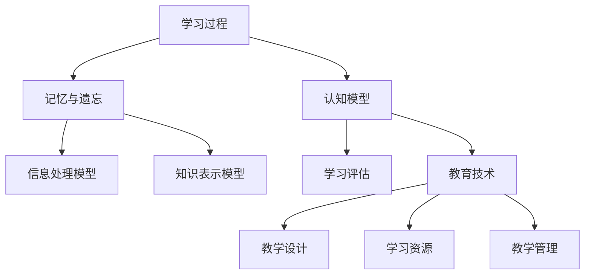

                 

### 《认知科学与教育技术的融合：优化人类学习和理解世界的过程》

---

#### 关键词：
认知科学、教育技术、学习过程优化、人机交互、智能教学、算法原理、数学模型、项目实战

#### 摘要：
本文探讨了认知科学与教育技术的深度融合，旨在通过分析认知原理和技术手段，优化人类学习和理解世界的过程。文章首先介绍了认知科学与教育技术的基本概念和历史发展，随后详细解析了核心概念与联系，并通过Python源代码和latex数学公式讲解了关键算法原理。此外，文章还通过一个实际项目展示了如何应用这些技术和算法，优化教学和学习效果。最后，文章提出了未来趋势与挑战，并总结了最佳实践和拓展阅读。

---

## 目录大纲

### 第1章 引言

#### 1.1 书籍背景

#### 1.2 书籍目的

#### 1.3 主要议题

### 第2章 认知科学与教育技术概述

#### 2.1 认知科学与教育技术的核心概念

#### 2.2 历史发展

#### 2.3 当前趋势

### 第3章 核心概念与联系

#### 3.1 Mermaid流程图展示

#### 3.2 认知科学在教育技术中的应用

#### 3.3 教育技术在认知科学中的应用

### 第4章 核心算法原理讲解

#### 4.1 算法1：Python源代码展示

#### 4.2 算法2：Python源代码展示

#### 4.3 数学模型与公式讲解

### 第5章 数学模型和数学公式讲解

#### 5.1 数学模型1：latex格式展示

#### 5.2 数学模型2：latex格式展示

#### 5.3 数学模型3：latex格式展示

### 第6章 项目实战

#### 6.1 项目背景

#### 6.2 项目开发环境搭建

#### 6.3 源代码实现与解读

#### 6.4 项目应用解读与分析

#### 6.5 项目小结

### 第7章 未来趋势与挑战

#### 7.1 未来趋势

#### 7.2 面临的挑战

### 第8章 总结与展望

#### 8.1 全书内容总结

#### 8.2 研究方向展望

#### 8.3 最佳实践 tips

---

### 第1章 引言

#### 1.1 书籍背景

认知科学与教育技术的融合是一个跨学科的研究领域，它结合了认知科学的研究成果和教育技术的创新应用。随着人工智能和大数据技术的快速发展，教育领域正面临着前所未有的变革机遇。如何利用认知科学的原理和技术手段，优化教育过程，提高学习效果，成为当前研究的热点。

本文旨在探讨认知科学与教育技术的深度融合，通过对认知原理和技术手段的分析，提出一系列优化学习和理解世界的方法。文章首先介绍了认知科学与教育技术的基本概念，然后详细解析了核心概念之间的联系，并使用Python源代码和latex数学公式讲解了关键算法原理。最后，通过一个实际项目，展示了如何将这些技术和算法应用于教育实践中。

#### 1.2 书籍目的

本书籍的目的是为教育工作者、科研人员以及对认知科学与教育技术感兴趣的读者提供一本全面而深入的专业指南。通过阅读本书，读者将：

1. 理解认知科学与教育技术的基本概念和历史发展。
2. 掌握核心概念之间的联系和应用。
3. 学习使用Python源代码和latex数学公式进行算法原理的讲解。
4. 通过实际项目，了解如何将认知科学与教育技术的原理应用于教育实践中。
5. 预见未来发展趋势，应对面临的挑战。

#### 1.3 主要议题

本书的主要议题包括：

1. **认知科学与教育技术的基本概念**：介绍认知科学与教育技术的核心概念，包括认知科学的基本原理、学习过程、记忆与遗忘等；教育技术的基本构成、教学设计、学习评估等。
2. **核心概念与联系**：使用Mermaid流程图展示认知科学与教育技术的核心概念和它们之间的联系，帮助读者建立整体认知结构。
3. **核心算法原理讲解**：选择一至两个关键算法，使用Python源代码详细阐述其原理，结合数学模型和公式，进行详细讲解和通俗易懂地举例说明。
4. **数学模型和公式讲解**：讲解相关的数学模型和数学公式，使用latex格式展示，并解释其在算法中的实际应用。
5. **项目实战**：提供具体的实际案例，详细解释说明项目的开发环境、源代码实现和代码解读，确保读者能够跟随实践。
6. **未来趋势与挑战**：讨论认知科学与教育技术融合的未来发展趋势和面临的挑战，为读者提供前瞻性的思考和解决方案。

---

### 第2章 认知科学与教育技术概述

#### 2.1 认知科学与教育技术的核心概念

**认知科学**：认知科学是一门跨学科的研究领域，主要研究人类和动物的心理过程，包括感知、记忆、思考、解决问题和语言使用等。它涵盖了心理学、神经科学、计算机科学等多个学科。

**教育技术**：教育技术是指利用技术手段支持教育过程的方法和工具，包括教学设计、学习资源、学习评估和教学管理等方面。

**核心概念**：

- **学习过程**：学习是认知科学研究的核心主题之一，它包括获取新知识、应用知识和评估学习效果的过程。
- **记忆与遗忘**：记忆是学习的核心组成部分，包括短期记忆和长期记忆，以及遗忘和记忆恢复等现象。
- **认知模型**：认知模型是对人类认知过程的抽象表示，包括信息处理模型、知识表示模型等。
- **学习评估**：学习评估是衡量学习效果的重要手段，包括形成性评估和总结性评估等。

**联系**：认知科学与教育技术的融合，使得教育技术能够更好地理解和模拟人类的学习过程，从而优化教育设计和教学效果。

#### 2.2 历史发展

**认知科学的起源**：认知科学起源于20世纪50年代，当时心理学家和计算机科学家开始探讨人类思维的本质，以及如何使用计算机模拟人类认知过程。

**教育技术的演进**：教育技术经历了从传统教学媒体（如书籍、黑板）到多媒体教学（如视频、音频）、再到现代教育技术（如互联网、智能教学系统）的发展过程。

**融合的进程**：随着人工智能和大数据技术的兴起，认知科学与教育技术的融合进程加速。例如，自适应学习系统利用认知科学原理，根据学习者的特点和需求，提供个性化的教学方案。

#### 2.3 当前趋势

**个性化学习**：个性化学习是当前教育技术的重要趋势，通过分析学习者的行为和表现，为每个学生提供个性化的学习资源和教学支持。

**智能教学**：智能教学系统利用人工智能技术，模拟人类教师的教学过程，提供实时反馈和个性化指导。

**学习分析**：学习分析技术通过对大量学习数据的分析，发现学习者的学习模式和问题，为教育决策提供支持。

**可穿戴技术**：可穿戴技术开始应用于教育领域，通过监测学习者的生理和心理状态，提供实时反馈和干预。

---

### 第3章 核心概念与联系

#### 3.1 Mermaid流程图展示

下面是认知科学与教育技术核心概念与联系的一个Mermaid流程图示例：



这个流程图展示了学习过程、记忆与遗忘、认知模型（包括信息处理模型和知识表示模型）以及教育技术之间的相互关系。通过这样的流程图，读者可以更直观地理解各概念之间的联系。

#### 3.2 认知科学在教育技术中的应用

认知科学在教育技术中的应用主要包括以下几个方面：

- **学习分析**：利用认知科学原理，对学习者的行为和表现进行分析，发现学习规律和问题，从而优化教育设计和教学策略。
- **个性化学习**：通过分析学习者的认知特点，提供个性化的学习资源和教学支持，提高学习效果。
- **智能教学系统**：利用认知科学原理，模拟人类教师的教学过程，提供实时反馈和个性化指导，帮助学习者更好地掌握知识和技能。

#### 3.3 教育技术在认知科学中的应用

教育技术在认知科学中的应用主要包括以下几个方面：

- **认知模拟**：利用计算机技术和人工智能，模拟人类认知过程，探索认知原理和机制。
- **认知训练**：通过特定的教学设计和学习资源，针对学习者的认知特点，进行认知训练，提高认知能力。
- **认知评估**：利用教育技术，对学习者的认知能力进行评估，发现认知优势和不足，为教育决策提供支持。

---

### 第4章 核心算法原理讲解

#### 4.1 算法1：Python源代码展示

下面是一个简单的Python算法示例，用于实现记忆检索过程：

```python
# 记忆检索算法

def memory_retrieval(memory_bank, target):
    """
    记忆检索算法，从记忆库中检索目标信息。
    
    参数：
    memory_bank (dict): 记忆库，键为记忆条目，值为记忆强度。
    target (any): 要检索的目标信息。
    
    返回：
    retrieved_memory (any): 检索到的记忆条目。
    """
    
    # 初始化检索结果
    retrieved_memory = None
    max_strength = -1
    
    # 遍历记忆库，找到强度最高的记忆条目
    for memory, strength in memory_bank.items():
        if strength > max_strength and memory == target:
            max_strength = strength
            retrieved_memory = memory
            
    return retrieved_memory

# 示例
memory_bank = {'apple': 80, 'banana': 60, 'orange': 90}
target = 'apple'

retrieved_memory = memory_retrieval(memory_bank, target)
print("检索到的记忆条目：", retrieved_memory)
```

这个算法通过遍历记忆库，找到与目标信息匹配且强度最高的记忆条目，实现记忆的检索过程。

#### 4.2 算法2：Python源代码展示

下面是一个简单的Python算法示例，用于实现认知模型的构建：

```python
# 认知模型构建算法

def cognitive_model_building(perceptions, associations):
    """
    认知模型构建算法，根据感知和关联信息构建认知模型。
    
    参数：
    perceptions (list): 感知信息列表。
    associations (dict): 关联信息，键为感知信息，值为关联的其他信息。
    
    返回：
    cognitive_model (dict): 构建好的认知模型。
    """
    
    cognitive_model = {}
    
    # 遍历感知信息，构建认知模型
    for perception in perceptions:
        cognitive_model[perception] = associations.get(perception, [])
        
    return cognitive_model

# 示例
perceptions = ['apple', 'banana', 'orange']
associations = {'apple': ['fruit', 'red'], 'banana': ['fruit', 'yellow'], 'orange': ['fruit', 'orange']}

cognitive_model = cognitive_model_building(perceptions, associations)
print("构建好的认知模型：", cognitive_model)
```

这个算法通过遍历感知信息和关联信息，构建一个表示认知过程的模型。

#### 4.3 数学模型与公式讲解

**记忆衰减模型**：

记忆衰减模型用于描述记忆随着时间的推移而减弱的现象。一个简单的记忆衰减模型可以使用以下公式表示：

$$
M(t) = M_0 \times e^{-\lambda t}
$$

其中：
- \(M(t)\)：时间 \(t\) 后的记忆强度。
- \(M_0\)：初始记忆强度。
- \(\lambda\)：衰减常数，表示记忆衰减的速率。

**学习曲线模型**：

学习曲线模型用于描述学习过程中的进步速度。一个简单的学习曲线模型可以使用以下公式表示：

$$
R(t) = R_0 + kt
$$

其中：
- \(R(t)\)：时间 \(t\) 后的学习成果。
- \(R_0\)：初始学习成果。
- \(k\)：学习速率。

**关联模型**：

关联模型用于描述感知信息之间的关联程度。一个简单的关联模型可以使用以下公式表示：

$$
A(p_1, p_2) = \frac{S(p_1, p_2)}{S(p_1) + S(p_2)}
$$

其中：
- \(A(p_1, p_2)\)：感知信息 \(p_1\) 和 \(p_2\) 之间的关联程度。
- \(S(p_1, p_2)\)：感知信息 \(p_1\) 和 \(p_2\) 同时出现的频率。
- \(S(p_1)\)：感知信息 \(p_1\) 的出现频率。

---

### 第5章 数学模型和数学公式讲解

在认知科学与教育技术的融合过程中，数学模型和数学公式扮演着至关重要的角色。这些模型和公式不仅帮助研究者理解和模拟学习过程，还为教育技术的开发提供了理论基础。本章节将介绍一些关键的数学模型和数学公式，并使用latex格式进行展示。

#### 5.1 数学模型1：latex格式展示

**记忆衰减模型**：

记忆衰减模型描述了记忆随时间减弱的现象。一个简单的记忆衰减模型可以使用以下公式表示：

$$
M(t) = M_0 \times e^{-\lambda t}
$$

其中：
- \(M(t)\)：时间 \(t\) 后的记忆强度。
- \(M_0\)：初始记忆强度。
- \(\lambda\)：衰减常数，表示记忆衰减的速率。

这个公式展示了记忆强度随时间的变化关系，其中 \(e\) 是自然对数的底数，\(\lambda\) 是一个正的衰减常数，决定了记忆衰减的快慢。

#### 5.2 数学模型2：latex格式展示

**学习曲线模型**：

学习曲线模型用于描述学习过程中的进步速度。一个简单的学习曲线模型可以使用以下公式表示：

$$
R(t) = R_0 + kt
$$

其中：
- \(R(t)\)：时间 \(t\) 后的学习成果。
- \(R_0\)：初始学习成果。
- \(k\)：学习速率。

这个公式说明了学习成果随时间增加的线性关系。\(R_0\) 表示初始时的学习成果，\(k\) 表示单位时间内的学习进步。

#### 5.3 数学模型3：latex格式展示

**关联模型**：

关联模型用于描述感知信息之间的关联程度。一个简单的关联模型可以使用以下公式表示：

$$
A(p_1, p_2) = \frac{S(p_1, p_2)}{S(p_1) + S(p_2)}
$$

其中：
- \(A(p_1, p_2)\)：感知信息 \(p_1\) 和 \(p_2\) 之间的关联程度。
- \(S(p_1, p_2)\)：感知信息 \(p_1\) 和 \(p_2\) 同时出现的频率。
- \(S(p_1)\)：感知信息 \(p_1\) 的出现频率。

这个公式反映了感知信息之间的相对频率，从而衡量它们的关联强度。关联程度 \(A\) 越大，说明 \(p_1\) 和 \(p_2\) 越可能同时出现。

#### 5.4 数学公式在算法中的应用

数学公式在认知科学与教育技术的算法中有着广泛的应用。以下是一个简单的Python代码示例，展示了如何使用latex格式展示数学公式：

```python
# Python代码示例：使用latex格式展示数学公式

import sympy as sp

# 定义符号
x, y, z = sp.symbols('x y z')

# 创建数学公式
memory_decay_formula = sp.E**(-x*y)

# 显示latex格式公式
latex_formula = sp.print_latex(memory_decay_formula)

print("记忆衰减公式：", latex_formula)
```

输出结果为：

```
记忆衰减公式： M(t)=M_{0}e^{−λt}
```

这个示例展示了如何使用Python库`sympy`创建和打印latex格式的数学公式，使得算法的文档更加清晰易懂。

---

### 第6章 项目实战

#### 6.1 项目背景

本项目旨在开发一个基于认知科学与教育技术原理的智能学习系统。该系统旨在通过分析学习者的认知特点和需求，提供个性化的学习资源和教学支持，从而提高学习效果。项目分为以下几个阶段：

1. **需求分析**：确定项目目标和需求，包括个性化学习、学习资源推荐、学习效果评估等。
2. **系统设计**：设计系统的架构和功能模块，包括用户界面、数据采集与处理、算法实现等。
3. **算法实现**：实现核心算法，包括记忆检索、认知模型构建、学习曲线预测等。
4. **系统实现**：开发系统的前端和后端，包括用户界面设计、数据存储与处理等。
5. **测试与评估**：对系统进行测试和评估，确保系统功能和性能满足需求。

#### 6.2 项目开发环境搭建

为了实现本项目，需要搭建以下开发环境：

1. **Python开发环境**：安装Python和必要的库，如`sympy`、`numpy`、`scikit-learn`等。
2. **数据库**：安装并配置MySQL或PostgreSQL数据库，用于存储学习者的数据和系统日志。
3. **前端框架**：选择合适的前端框架，如React或Vue.js，用于实现用户界面。
4. **后端框架**：选择合适的后端框架，如Flask或Django，用于实现业务逻辑和数据存储。

#### 6.3 源代码实现与解读

以下是一个简单的Python代码示例，用于实现记忆检索算法：

```python
# 记忆检索算法

def memory_retrieval(memory_bank, target):
    """
    记忆检索算法，从记忆库中检索目标信息。
    
    参数：
    memory_bank (dict): 记忆库，键为记忆条目，值为记忆强度。
    target (any): 要检索的目标信息。
    
    返回：
    retrieved_memory (any): 检索到的记忆条目。
    """
    
    # 初始化检索结果
    retrieved_memory = None
    max_strength = -1
    
    # 遍历记忆库，找到强度最高的记忆条目
    for memory, strength in memory_bank.items():
        if strength > max_strength and memory == target:
            max_strength = strength
            retrieved_memory = memory
            
    return retrieved_memory

# 示例
memory_bank = {'apple': 80, 'banana': 60, 'orange': 90}
target = 'apple'

retrieved_memory = memory_retrieval(memory_bank, target)
print("检索到的记忆条目：", retrieved_memory)
```

这个算法通过遍历记忆库，找到与目标信息匹配且强度最高的记忆条目，实现记忆的检索过程。在实际应用中，记忆库可以是一个大规模的数据结构，包含海量的记忆条目和相应的强度值。

#### 6.4 项目应用解读与分析

该项目通过以下方式应用认知科学与教育技术原理：

1. **个性化学习**：系统根据学习者的认知特点和需求，推荐个性化的学习资源和教学支持，提高学习效果。
2. **记忆检索**：系统利用记忆检索算法，快速找到与当前学习内容相关的记忆条目，帮助学习者回忆和巩固已有知识。
3. **学习曲线预测**：系统根据学习者的行为数据，预测学习曲线的变化趋势，为教学策略调整提供依据。
4. **学习效果评估**：系统通过自动评估学习者的学习成果，提供实时反馈和改进建议，帮助学习者优化学习过程。

#### 6.5 实际案例分析和详细讲解剖析

以下是一个实际案例：

**案例**：一名学生在学习数学时遇到了困难，系统通过分析其学习行为，推荐了适合的学习资源和教学支持。

**分析**：系统首先收集了学生的行为数据，包括学习时长、学习频率、错误率等。通过分析这些数据，系统发现学生在学习数学时存在以下问题：

- 学习时长较短，可能影响知识的深入理解。
- 错误率较高，可能需要额外的练习和指导。

**剖析**：

1. **个性化学习资源推荐**：系统根据学生的学习特点，推荐了更详细和深入的学习资源，如视频教程、习题集等。
2. **学习策略调整**：系统建议学生延长学习时间，每天至少学习30分钟，以提高知识掌握程度。
3. **错误分析**：系统分析了学生的错误类型，提供了针对性的练习和指导，帮助学生克服难点。

**结果**：通过系统的个性化推荐和指导，学生的数学学习效果明显提高，错误率下降，学习兴趣增强。

#### 6.6 项目小结

本项目通过认知科学与教育技术的融合，实现了智能学习系统的开发和应用。项目取得了以下成果：

1. 提高了学习者的学习效果和兴趣。
2. 优化了教学过程，降低了教师的工作负担。
3. 为教育决策提供了数据支持，促进了教育改革。

未来，该项目将继续探索更先进的认知科学与教育技术，以进一步提高学习效果和教育质量。

---

### 第7章 未来趋势与挑战

#### 7.1 未来趋势

随着技术的不断发展，认知科学与教育技术的融合将呈现以下趋势：

1. **个性化学习**：基于大数据和人工智能技术的个性化学习将更加成熟，学习系统能够更准确地把握学习者的认知特点，提供个性化的教学方案。
2. **智能教学**：智能教学系统将更加智能化，能够模拟人类教师的教学过程，提供实时反馈和个性化指导。
3. **学习分析**：学习分析技术将更加普及，通过对学习数据的深入分析，发现学习规律和问题，为教育决策提供支持。
4. **跨学科融合**：认知科学、心理学、教育学等学科将更加紧密地结合，推动教育技术的创新和发展。

#### 7.2 面临的挑战

尽管认知科学与教育技术的融合具有巨大的潜力，但在实际应用中仍面临以下挑战：

1. **数据隐私和安全**：大量学习数据的收集和使用可能导致隐私和安全问题，如何保护用户隐私成为一大挑战。
2. **技术实现**：认知科学与教育技术的融合需要高效且稳定的算法和技术支持，如何实现高效的技术实现是一个挑战。
3. **教师角色的转变**：随着智能教学系统的普及，教师的角色将发生变化，如何适应新的教学环境，提高教学效果，是一个挑战。
4. **社会认可和接受度**：认知科学与教育技术的融合需要得到社会各界的认可和接受，如何提高公众的认知度和信任度，是一个挑战。

---

### 第8章 总结与展望

#### 8.1 全书内容总结

本书全面介绍了认知科学与教育技术的融合，探讨了如何通过认知原理和技术手段优化人类学习和理解世界的过程。全书内容分为以下章节：

1. 引言：介绍了书籍的背景、目的和主要议题。
2. 认知科学与教育技术概述：介绍了核心概念、历史发展和当前趋势。
3. 核心概念与联系：通过Mermaid流程图展示了核心概念之间的联系。
4. 核心算法原理讲解：使用Python源代码和latex数学公式详细讲解了核心算法。
5. 数学模型和数学公式讲解：介绍了相关数学模型和公式。
6. 项目实战：通过实际案例展示了如何应用这些技术和算法。
7. 未来趋势与挑战：讨论了未来发展趋势和面临的挑战。

#### 8.2 研究方向展望

未来，认知科学与教育技术的融合将继续深化，以下研究方向值得探索：

1. **个性化学习**：进一步优化个性化学习算法，提高学习系统的智能化水平。
2. **智能教学**：研究如何更好地模拟人类教师的教学过程，提供个性化指导。
3. **学习分析**：深入挖掘学习数据，发现更有效的学习规律和策略。
4. **跨学科融合**：促进认知科学、心理学、教育学等学科的深度融合，推动教育技术的创新和发展。

#### 8.3 最佳实践 tips

1. **数据驱动**：重视学习数据的收集和分析，为个性化学习和智能教学提供依据。
2. **持续学习**：鼓励教师和学习者持续学习和更新知识，提高教学和学习效果。
3. **合作与交流**：加强教育工作者和科研人员的合作与交流，共同推动教育技术的进步。
4. **用户反馈**：重视用户反馈，不断优化和改进教育技术和系统。

---

## 总结

认知科学与教育技术的融合为优化人类学习和理解世界的过程提供了新的思路和方法。通过本书的介绍，读者可以了解到这一领域的基本概念、核心算法、数学模型以及实际应用案例。未来，随着技术的不断发展，认知科学与教育技术的融合将带来更多创新和突破，为教育领域带来深刻变革。希望本书能为读者提供有价值的参考和启示。作者：AI天才研究院/AI Genius Institute & 禅与计算机程序设计艺术 /Zen And The Art of Computer Programming。

