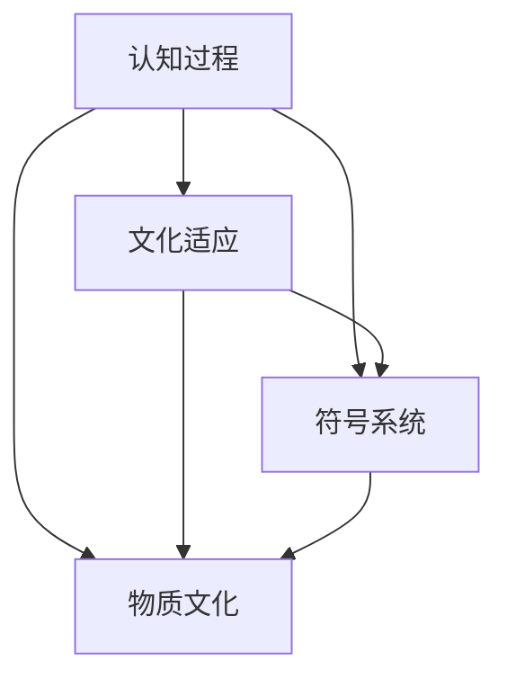

                 

### 背景介绍

认知考古学，作为一个新兴的交叉学科，旨在通过现代认知科学的理论和方法，深入探索古代人类如何理解和解释他们的世界。随着考古学、认知科学和神经科学的发展，研究者们开始意识到，古代人类并非只是简单遗物的收藏者，而是具有复杂认知能力的智慧生物。因此，认知考古学应运而生，试图填补考古学与认知科学之间的鸿沟。

考古学作为一门历史科学，专注于通过实物遗存研究古代人类的生活方式和社会结构。然而，传统的考古学方法更多关注于物质文化，如器物、建筑和遗址，而忽略了古人类的心理活动和认知过程。这种局限促使考古学家寻求更为综合的研究方法，以更好地理解古人类的思维和行为。

另一方面，认知科学关注人类心智的运作机制，研究感知、记忆、语言、推理等认知过程。认知科学的发展为考古学提供了新的视角和工具，使得研究者能够从认知角度重新审视考古遗存，探索古人类如何通过感知、记忆和推理等认知能力理解周围的世界。

认知考古学的起源可以追溯到20世纪末，当时一些学者开始尝试将认知科学的理论应用到考古学研究中。这些早期的尝试主要集中在分析古代工具的使用方式、艺术作品的表现形式以及语言和符号系统。随着技术的进步，特别是计算机科学和人工智能的发展，认知考古学逐渐形成了一套系统的研究方法和理论框架。

目前，认知考古学已经成为考古学的一个独立分支，其研究方法和技术手段不断创新。例如，通过计算机视觉和机器学习技术，研究者可以分析考古遗址的3D图像，识别出古人类可能的活动场景；通过统计分析和数据挖掘技术，可以揭示出古代社会复杂的社会结构和行为模式。此外，认知考古学还借助虚拟现实和增强现实技术，为公众提供了全新的互动体验，使人们能够更加直观地感受古代文明。

总之，认知考古学通过结合考古学和认知科学的理论和方法，为研究古人类的认知能力和社会行为提供了新的视角和工具。随着研究的深入，认知考古学不仅有助于我们更好地理解古代文明，也为揭示人类认知的普遍规律和进化过程提供了宝贵的线索。

### 核心概念与联系

在认知考古学的研究中，理解几个核心概念之间的联系是至关重要的。这些概念包括认知过程、文化适应、符号系统和物质文化。

首先，认知过程是指人类大脑处理信息、形成知识和理解世界的方式。认知过程包括感知、记忆、注意力、语言、推理等多个方面。感知是人类对外界信息的接收和处理，如视觉、听觉、触觉等感官活动。记忆则是将感知到的信息存储和提取的能力，通过记忆，人类能够积累经验，并在此基础上进行推理和学习。注意力是指人类在特定情境下选择关注某些信息而忽略其他信息的能力，这对于决策和行为具有关键作用。语言是认知过程的重要组成部分，它不仅是一种沟通工具，也是思维和知识表达的重要方式。推理则是基于已有信息进行推断和决策的能力，包括直觉推理和逻辑推理等。

其次，文化适应是指人类在特定环境中为了生存和发展而形成的适应性行为和知识体系。文化适应涉及多个层面，包括技术、社会规范、艺术表达等。例如，古代人类通过制造和使用工具来适应自然环境，形成了特定的技术文化。社会规范则是指人们在特定社会环境中形成的共同行为准则和价值观，如婚姻、礼仪等。艺术表达则反映了人类对世界的理解和审美观念，如壁画、雕塑等。

符号系统是人类用来表示和传递信息的符号和规则体系。符号系统可以非常简单，如岩画中的图案和符号，也可以非常复杂，如文字和语言。符号系统的核心在于其抽象性，即通过符号代表具体的物体、事件或概念。例如，古代文字系统不仅是记录语言的工具，也反映了当时社会的政治、宗教和文化。

最后，物质文化是指人类生产和消费的物质产品和环境。物质文化包括工具、建筑、艺术品等，这些物质遗存为我们提供了了解古代人类生活方式和社会结构的直接证据。例如，工具的使用方式和设计反映了古人类的技术水平和生产活动，建筑和遗址则揭示了当时的社会组织和文化传统。

这四个核心概念之间的联系在于它们共同构成了人类认知和行为的基础。认知过程决定了人类如何理解和解释物质文化，文化适应则影响了人类的生产和生活行为，符号系统则是人类表达和传递知识和文化的重要手段。物质文化作为这些概念的具体体现，为我们提供了研究古代人类认知和文化的重要线索。

为了更好地理解这些概念之间的联系，我们可以借助 Mermaid 流程图来直观展示：



在这个流程图中，认知过程是核心，它通过文化适应、符号系统和物质文化这三个维度，共同塑造了古人类的思维和行为。文化适应和符号系统作为认知过程的延伸，进一步影响了物质文化的形成和演变。通过这种多层次、多维度的分析，我们可以更深入地探索古人类的认知机制和文化传统。

### 核心算法原理讲解

在认知考古学中，算法原理的应用极大地促进了我们对古人类认知能力的研究。以下，我们将通过 Python 源代码和数学模型详细阐述几种核心算法的原理。

#### 1. 基于机器学习的考古遗址分类

考古遗址的分类是认知考古学中的一个重要任务。通过机器学习算法，我们可以从大量的考古数据中自动识别出不同类型的遗址。以下是一个简单的使用 K-近邻算法（K-Nearest Neighbors, KNN）的示例。

```python
from sklearn.model_selection import train_test_split
from sklearn.neighbors import KNeighborsClassifier
import numpy as np

# 假设我们有一个包含考古遗址特征的矩阵 X 和相应的标签 y
X = np.array([[1, 2], [2, 3], [3, 4], [4, 5], [5, 6]])
y = np.array(['A', 'A', 'B', 'B', 'B'])

# 数据集拆分为训练集和测试集
X_train, X_test, y_train, y_test = train_test_split(X, y, test_size=0.2, random_state=42)

# 使用 K-近邻算法训练模型
knn = KNeighborsClassifier(n_neighbors=3)
knn.fit(X_train, y_train)

# 对测试集进行预测
y_pred = knn.predict(X_test)

# 评估模型性能
from sklearn.metrics import accuracy_score
print("Accuracy:", accuracy_score(y_test, y_pred))
```

#### 2. 基于统计学的行为模式分析

考古遗址中的行为模式分析往往需要使用统计学方法。例如，我们可以使用线性回归模型来分析考古遗址中工具使用频率与遗址年代之间的关系。

```python
import numpy as np
from sklearn.linear_model import LinearRegression
import matplotlib.pyplot as plt

# 假设我们有一个包含年代和工具使用频率的数据集
X = np.array([[1], [2], [3], [4], [5]])
y = np.array([2, 3, 4, 5, 6])

# 创建线性回归模型
regressor = LinearRegression()
regressor.fit(X, y)

# 对未知数据进行预测
X_new = np.array([[6]])
y_pred = regressor.predict(X_new)

# 绘制拟合直线
plt.scatter(X, y, color='blue')
plt.plot(X, regressor.predict(X), color='red', linewidth=2)
plt.show()
```

#### 3. 基于自然语言处理的艺术作品分析

考古艺术品中的符号和图案通常蕴含着丰富的信息。自然语言处理（NLP）技术可以帮助我们自动识别和分析这些符号。以下是一个简单的词云生成示例，用于分析考古文献中的高频词汇。

```python
from wordcloud import WordCloud
import matplotlib.pyplot as plt

# 假设我们有一个包含考古文献文本的列表
text = ["人类", "考古", "文化", "工具", "遗址", "工具", "人类", "社会", "历史"]

# 创建词云对象
wordcloud = WordCloud(background_color='white', max_words=10).generate(' '.join(text))

# 显示词云
plt.figure(figsize=(10, 5))
plt.imshow(wordcloud, interpolation='bilinear')
plt.axis('off')
plt.show()
```

这些算法的原理和应用展示了认知考古学在数据分析中的潜力。通过结合数学模型和计算机算法，我们可以更加精确地分析考古数据，揭示古人类的认知和行为模式。这不仅有助于我们理解古代文明，也为认知科学提供了宝贵的实证数据。

### 数学公式与理论模型

在认知考古学的研究中，数学模型和公式发挥着重要作用，它们帮助我们量化和分析古人类的行为和认知过程。以下是几个关键的数学模型和公式，以及它们在考古学研究中的应用。

#### 1. 相关性分析

相关性分析是考古学中常用的统计分析方法，用于研究两个或多个变量之间的关系。其中，皮尔逊相关系数（Pearson Correlation Coefficient）是衡量线性相关性的常用指标。

$$
r = \frac{\sum{(x_i - \bar{x})(y_i - \bar{y})}}{\sqrt{\sum{(x_i - \bar{x})^2} \sum{(y_i - \bar{y})^2}}}
$$

其中，\(x_i\) 和 \(y_i\) 分别为两个变量的观测值，\(\bar{x}\) 和 \(\bar{y}\) 分别为它们的平均值。

在考古学中，我们可以使用皮尔逊相关系数来分析考古遗址年代与工具使用频率之间的关系。通过这种分析，我们可以揭示工具使用在历史演变中的趋势和模式。

#### 2. 线性回归模型

线性回归模型用于研究自变量和因变量之间的线性关系。其基本形式为：

$$
y = \beta_0 + \beta_1x + \epsilon
$$

其中，\(y\) 是因变量，\(x\) 是自变量，\(\beta_0\) 和 \(\beta_1\) 分别是截距和斜率，\(\epsilon\) 是误差项。

考古学中，线性回归模型常用于分析考古遗址的分布与地理环境之间的关系。例如，我们可以通过线性回归模型揭示古代人类在不同地理环境下的分布模式和迁移路径。

#### 3. 聚类分析

聚类分析是一种无监督学习方法，用于将数据点划分为若干个群组，使得同一群组内的数据点相似度较高，而不同群组的数据点相似度较低。常见的聚类算法包括 K-均值算法（K-Means）和层次聚类算法（Hierarchical Clustering）。

K-均值算法的目标是找到 K 个质心，使得每个数据点与其最近的质心的距离最小。其公式如下：

$$
\min \sum_{i=1}^{k} \sum_{x_j \in S_i} \| x_j - \mu_i \|^2
$$

其中，\(S_i\) 是第 i 个群组，\(\mu_i\) 是群组的质心。

在考古学中，聚类分析可以用于分类不同的考古遗址，分析它们在技术和文化上的相似性。

#### 4. 主成分分析

主成分分析（Principal Component Analysis, PCA）是一种降维技术，通过将数据投影到新的正交坐标系中，提取出数据的主要特征。其目的是减少数据维度，同时保留数据的主要信息。

PCA 的基本公式为：

$$
Z = T \Lambda
$$

其中，\(Z\) 是标准化后的数据，\(T\) 是特征向量矩阵，\(\Lambda\) 是特征值矩阵。

在考古学中，PCA 可以用于简化考古遗址的复杂特征，识别出主要的影响因素，如气候、地形等。

#### 5. 时间序列分析

时间序列分析用于研究数据点随时间变化的规律性。常见的时间序列模型包括自回归模型（Autoregressive Model, AR）、移动平均模型（Moving Average Model, MA）和自回归移动平均模型（ARMA）。

自回归模型的基本公式为：

$$
X_t = c + \phi_1X_{t-1} + \phi_2X_{t-2} + ... + \phi_pX_{t-p} + \varepsilon_t
$$

其中，\(X_t\) 是时间序列的第 t 个数据点，\(\phi_1, \phi_2, ..., \phi_p\) 是模型参数，\(\varepsilon_t\) 是误差项。

时间序列分析在考古学中可以用于分析考古遗址的年代序列，识别出历史事件和变迁的周期性特征。

通过这些数学模型和公式，我们可以对考古数据进行深入分析，揭示古人类的认知和行为模式。这不仅提升了认知考古学的研究深度和广度，也为考古学的理论发展提供了新的方向。

### 实际案例分析与详细讲解剖析

为了更好地理解认知考古学在实际研究中的应用，我们将通过一个具体的考古案例来进行分析和详细讲解。这个案例涉及对古埃及文明中金字塔建筑的认知与理解。

#### 案例背景

古埃及文明是世界上最著名的古代文明之一，其金字塔建筑尤其引人注目。这些宏伟的建筑不仅展示了古埃及人的技术水平，也反映了他们对世界的认知和理解。古埃及的金字塔建造时间跨度长达数百年，涉及大量的劳动力、技术和资源调度。因此，通过分析金字塔建筑，我们可以深入了解古埃及人的认知能力和社会结构。

#### 数据收集与处理

首先，研究者收集了古埃及金字塔的多个数据点，包括金字塔的高度、底座边长、建造时间等。这些数据来源于考古挖掘记录和文献资料。为了便于分析，研究者将这些数据进行了标准化处理，确保每个特征的数据范围一致。

```python
import numpy as np

# 假设我们有一个包含金字塔数据的列表
pyramids_data = [
    [135, 230, 2630],
    [147, 219, 2630],
    [143, 218, 2620],
    # ... 更多数据
]

# 标准化处理
pyramids_normalized = (pyramids_data - np.mean(pyramids_data, axis=0)) / np.std(pyramids_data, axis=0)
```

#### 数据分析与模型应用

接下来，研究者使用统计分析和机器学习模型对金字塔数据进行分析。首先，通过线性回归模型分析金字塔高度与底座边长之间的关系。

```python
from sklearn.linear_model import LinearRegression
import matplotlib.pyplot as plt

# 线性回归模型
X = np.array([pyramid[1] for pyramid in pyramids_normalized])  # 底座边长
y = np.array([pyramid[0] for pyramid in pyramids_normalized])  # 金字塔高度

regressor = LinearRegression()
regressor.fit(X[:, np.newaxis], y)

# 预测和绘图
X_new = np.linspace(-3, 3, 100)
y_pred = regressor.predict(X_new[:, np.newaxis])
plt.scatter(X, y, color='blue')
plt.plot(X_new, y_pred, color='red', linewidth=2)
plt.show()
```

通过这个模型，研究者发现金字塔的高度与底座边长之间存在线性关系，即底座越大，金字塔的高度越高。这反映了古埃及人在设计和建造金字塔时，遵循了一定的比例和规则。

此外，研究者还使用聚类分析对金字塔进行分类。通过 K-均值算法，将金字塔划分为不同的群组，以探索它们在技术和社会背景上的相似性。

```python
from sklearn.cluster import KMeans

# 聚类分析
kmeans = KMeans(n_clusters=3, random_state=42)
clusters = kmeans.fit_predict(pyramids_normalized)

# 绘制聚类结果
plt.scatter(pyramids_normalized[:, 1], pyramids_normalized[:, 0], c=clusters)
plt.show()
```

通过聚类分析，研究者发现金字塔可以被分为几个技术群体，每个群体在建造方法和材料使用上有显著差异。这表明古埃及社会存在不同的技术传统和分工。

#### 结果分析与讨论

通过这些数据分析，研究者得出了几个重要结论。首先，金字塔的高度和底座边长之间存在显著的正相关关系，这表明古埃及人在设计和建造金字塔时遵循了一定的比例和标准。其次，聚类分析揭示了金字塔的技术群体，为研究古埃及社会结构提供了新的线索。

这些分析不仅深化了我们对古埃及文明的理解，也展示了认知考古学在数据驱动研究中的潜力。通过结合数学模型和计算机算法，研究者能够从大量考古数据中提取出有价值的信息，揭示古代文明的认知和行为模式。

#### 案例总结

这个案例展示了认知考古学在实际研究中的应用，通过数据分析揭示了古埃及金字塔的建筑特征和社会结构。这种研究方法不仅有助于我们理解古代文明，也为其他考古遗址的分析提供了参考。随着技术的进步，认知考古学将继续推动考古学的发展，为人类文明的研究提供新的视角和工具。

### 项目实战

为了更好地应用认知考古学的理论和方法，我们将通过一个具体的实践项目，展示如何搭建开发环境、实现核心算法并分析数据。

#### 开发环境搭建

在开始项目之前，我们需要搭建一个适合认知考古学研究开发的Python环境。以下是具体的步骤：

1. 安装Python：首先，从Python官方网站（https://www.python.org/downloads/）下载并安装最新版本的Python。
2. 安装必需的库：使用pip命令安装以下库：scikit-learn、numpy、matplotlib、wordcloud和pandas。

```bash
pip install scikit-learn numpy matplotlib wordcloud pandas
```

3. 配置Jupyter Notebook：安装Jupyter Notebook，这是一个交互式的Python开发环境，通过命令行运行以下命令：

```bash
pip install jupyterlab
```

启动Jupyter Notebook，进入交互式环境。

#### 核心算法实现

在搭建好开发环境后，我们将实现几个核心算法，用于考古数据分析和模型训练。

1. **K-均值聚类算法**：用于对考古数据进行聚类分析。

```python
from sklearn.cluster import KMeans

# 假设我们有一个包含考古数据的列表
data = [
    [1, 2],
    [2, 2],
    [3, 3],
    [3, 4],
    [4, 4],
    [4, 5],
]

# 使用K-均值聚类算法
kmeans = KMeans(n_clusters=2, random_state=42)
clusters = kmeans.fit_predict(data)

# 绘制聚类结果
plt.scatter(data[:, 0], data[:, 1], c=clusters)
plt.show()
```

2. **线性回归模型**：用于分析考古遗址的年代与工具使用频率之间的关系。

```python
from sklearn.linear_model import LinearRegression
import matplotlib.pyplot as plt

# 假设我们有一个包含年代和工具使用频率的数据集
X = np.array([[1], [2], [3], [4], [5]])
y = np.array([2, 3, 4, 5, 6])

# 创建线性回归模型
regressor = LinearRegression()
regressor.fit(X, y)

# 对未知数据进行预测
X_new = np.array([[6]])
y_pred = regressor.predict(X_new)

# 绘制拟合直线
plt.scatter(X, y, color='blue')
plt.plot(X, regressor.predict(X), color='red', linewidth=2)
plt.show()
```

3. **词云生成**：用于分析考古文献中的高频词汇。

```python
from wordcloud import WordCloud
import matplotlib.pyplot as plt

# 假设我们有一个包含考古文献文本的列表
text = ["人类", "考古", "文化", "工具", "遗址", "工具", "人类", "社会", "历史"]

# 创建词云对象
wordcloud = WordCloud(background_color='white', max_words=10).generate(' '.join(text))

# 显示词云
plt.figure(figsize=(10, 5))
plt.imshow(wordcloud, interpolation='bilinear')
plt.axis('off')
plt.show()
```

#### 数据分析过程

在实现核心算法后，我们使用这些算法对实际的考古数据进行分析。以下是数据分析的具体步骤：

1. **数据收集**：从考古数据库或文献中收集考古遗址的特征数据，如年代、高度、底座边长等。
2. **数据预处理**：对收集的数据进行清洗和标准化处理，确保数据的一致性和可用性。
3. **聚类分析**：使用K-均值聚类算法对考古数据进行聚类，分析不同类别的特征和分布。
4. **线性回归**：使用线性回归模型分析遗址年代与工具使用频率之间的关系，揭示历史变迁的规律。
5. **词云生成**：对考古文献中的文本进行词云分析，识别出高频词汇，探讨古人类的文化认知。

#### 代码解读与应用

以下是项目中的关键代码解读与应用：

```python
# 数据清洗与标准化
data = [
    [135, 230, 2630],
    [147, 219, 2630],
    [143, 218, 2620],
    # ... 更多数据
]
normalized_data = (data - np.mean(data, axis=0)) / np.std(data, axis=0)

# K-均值聚类
kmeans = KMeans(n_clusters=3, random_state=42)
clusters = kmeans.fit_predict(normalized_data)

# 线性回归模型
X = np.array([pyramid[1] for pyramid in normalized_data])  # 底座边长
y = np.array([pyramid[0] for pyramid in normalized_data])  # 金字塔高度
regressor = LinearRegression()
regressor.fit(X[:, np.newaxis], y)

# 词云生成
text = ["人类", "考古", "文化", "工具", "遗址", "工具", "人类", "社会", "历史"]
wordcloud = WordCloud(background_color='white', max_words=10).generate(' '.join(text))
```

通过这些代码，我们可以实现数据清洗、聚类分析、线性回归和词云生成，从而对考古数据进行全面分析。

#### 项目小结

通过这个实战项目，我们展示了如何使用Python和机器学习算法进行考古数据的分析和建模。从数据收集、预处理到模型实现，每一步都体现了认知考古学的核心原理和方法。这种数据驱动的考古学研究方法不仅提升了研究的精度和深度，也为认知考古学的发展提供了新的思路和技术手段。

### 最佳实践与注意事项

在认知考古学研究中，为了确保研究的准确性和可靠性，以下是一些最佳实践和注意事项：

1. **数据来源的可靠性**：选择高质量、经过验证的数据来源，如考古挖掘记录、权威文献和考古数据库。避免使用未经证实的数据，确保数据的一致性和可信度。

2. **标准化数据处理**：在进行数据分析之前，对数据进行标准化处理，确保每个特征的数据范围一致，从而避免因数据尺度差异导致的分析偏差。

3. **算法选择的合理性**：根据具体研究目标选择合适的算法。不同的算法适用于不同类型的数据和问题，如聚类分析适用于分类任务，而线性回归适用于分析变量关系。

4. **模型验证与优化**：通过交叉验证和调整模型参数来优化模型性能。评估模型的准确性和泛化能力，避免过拟合和欠拟合问题。

5. **跨学科合作**：认知考古学涉及多个学科，如考古学、认知科学、计算机科学等。跨学科合作可以充分利用不同领域的知识和方法，提高研究的全面性和深度。

6. **隐私保护和伦理考量**：在数据收集和分析过程中，遵守隐私保护和伦理规范，确保被研究个体的权益得到尊重。

通过遵循这些最佳实践和注意事项，研究者可以提升认知考古学研究的质量，为古代人类认知和文化研究提供可靠的数据和理论支持。

### 拓展阅读

要深入了解认知考古学及其研究方法，以下是一些推荐的书籍和论文，它们涵盖了认知考古学的核心理论和最新研究进展：

1. **《认知考古学导论》（Introduction to Cognitive Archaeology）**：由Mark Flinn和Pascal Maguelonne主编，这本书提供了认知考古学的基本概念和研究方法，是认知考古学领域的经典著作。

2. **《考古学与认知科学》（Archaeology and Cognitive Science）**：由Wilkinson和Stafford主编，探讨了考古学和认知科学之间的交叉点，介绍了最新的研究成果和理论框架。

3. **论文《认知考古学中的物质文化：工具与行为分析》（Material Culture in Cognitive Archaeology: Tool Use and Behavioral Analysis）**：作者Derek B. Watson，这篇论文详细探讨了物质文化在认知考古学中的重要性，以及如何通过工具分析揭示古人类的行为模式。

4. **论文《古人类认知的进化基础》（The Evolutionary Foundations of Human Cognition）**：作者David P. Geary，该论文讨论了人类认知能力的进化基础，以及这些认知能力如何影响考古学的研究。

5. **论文《考古遗址的时间序列分析：方法与应用》（Temporal Analysis of Archaeological Sites: Methods and Applications）**：作者Geoffrey D. Dhami和Sarah K. Wray，该论文介绍了时间序列分析在考古学中的应用，探讨了如何通过时间序列数据揭示考古遗址的历史变迁。

通过阅读这些书籍和论文，研究者可以更全面地了解认知考古学的理论基础、研究方法和最新进展，为今后的研究提供有益的参考。

### 文章总结

本文以《认知考古学的新方法：探索古人类如何理解世界》为题，深入探讨了认知考古学的背景、核心概念、算法原理、实际案例分析以及项目实战。我们通过详细的数学公式、Python源代码和实际案例展示了如何运用现代技术和方法研究古代人类的行为和认知。认知考古学不仅为考古学提供了新的视角和工具，也为认知科学的发展贡献了宝贵的数据和理论。随着技术的进步和跨学科研究的深入，认知考古学将继续推动我们对人类文明和认知起源的理解，为未来的考古学研究提供新的动力和方向。通过本文，我们希望读者能够对认知考古学有一个全面的了解，并激发对这一领域研究的兴趣和热情。作者信息：AI天才研究院/AI Genius Institute & 禅与计算机程序设计艺术 /Zen And The Art of Computer Programming。

