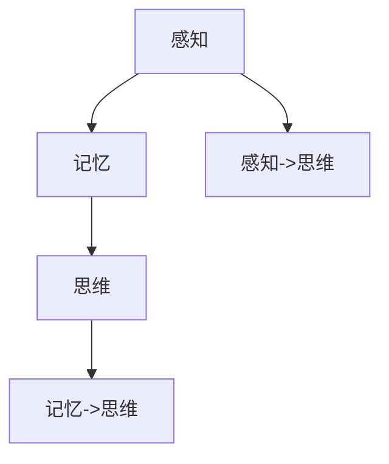

                 

### 引言

《认知考古学的新视角：探索古代人类如何理解世界》一书，为读者提供了一个全新的视角，通过认知考古学的理论和方法，重新审视古代人类的世界观和理解方式。书中以逻辑清晰、结构紧凑的叙述方式，探讨了古代人类如何感知、记忆、思维，以及他们如何通过这些认知过程来理解周围的世界。

认知考古学是一门新兴的交叉学科，它结合了认知科学、考古学和人类学等多个领域的知识，旨在通过研究古代人类的大脑和认知能力，揭示人类文化和社会发展的历程。这一领域的兴起，不仅为考古学研究提供了新的思路和方法，也为人类对自身认知能力的理解带来了深刻的启示。

本文将从以下几个方面进行探讨：

1. **认知考古学的背景**：介绍认知考古学的起源、研究领域和研究方法。
2. **核心理论**：阐述认知考古学的基本概念、理论框架和核心原理。
3. **方法学**：详细讲解认知考古学的研究方法，包括考古发掘、文献分析等。
4. **案例分析**：通过具体案例展示认知考古学在实践中的应用。
5. **结论与未来展望**：总结本书的主要发现，并提出未来研究的方向。

### 核心理论

#### 感知

感知是认知考古学的核心概念之一。感知是指人类通过感官接收外部信息的过程。在认知考古学中，感知不仅包括视觉、听觉、嗅觉、味觉和触觉等基本感官，还包括更高级的认知过程，如语言理解、情感体验等。

感知的重要性在于，它是人类理解世界的基础。通过感知，古代人类能够感知到自然界的规律，从而形成了他们的世界观。例如，古代人类通过观察星星的运行，形成了天文学的基础；通过观察动植物的生长，形成了生物学的基础。

在认知考古学中，研究感知的方法主要包括考古发掘和文献分析。通过考古发掘，可以获取古代人类使用的工具、装饰品等物品，从而推断他们如何感知和利用环境。通过文献分析，可以获取古代人类留下的文字记录，从而了解他们如何理解和描述周围的世界。

#### 记忆

记忆是另一个核心概念。记忆是指人类将感知到的信息存储在大脑中，并在需要时进行回忆的能力。记忆在认知考古学中具有重要的作用，因为它能够帮助古代人类在长期的生存和发展过程中积累经验。

记忆的形式可以分为短期记忆和长期记忆。短期记忆是指人类在短时间内能够保持的信息，如记住一个电话号码。长期记忆则是指人类在较长时间内能够保持的信息，如记住学过的知识。

在认知考古学中，研究记忆的方法主要包括神经影像技术和认知模拟。神经影像技术可以用来研究大脑的记忆功能，如通过功能磁共振成像（fMRI）观察大脑在不同记忆任务中的活动。认知模拟则通过计算机模型来模拟人类的记忆过程，从而更好地理解记忆的机制。

#### 思维

思维是认知考古学的核心概念之一。思维是指人类通过感知和记忆等过程，对信息进行加工、分析和推理的能力。思维是人类理解世界的高级形式，它不仅包括逻辑推理，还包括想象、创造和情感等。

在认知考古学中，研究思维的方法主要包括认知模拟和心理学实验。认知模拟通过计算机模型来模拟人类的思维过程，从而更好地理解思维的机制。心理学实验则通过设计不同的实验任务，来研究人类在不同思维任务中的表现。

#### 核心概念之间的关系

感知、记忆和思维是认知考古学的核心概念，它们相互关联，共同构成了人类的认知能力。感知是记忆的基础，没有感知就没有记忆。记忆是思维的基础，没有记忆就没有思维。思维则是感知和记忆的深化和扩展，它通过加工和分析感知和记忆的信息，形成对世界的理解。

为了更好地理解这些概念之间的关系，我们可以使用Mermaid流程图来表示：

在这个流程图中，感知、记忆和思维被表示为三个独立的节点，它们通过箭头相互连接，表示它们之间的相互关系。感知通过加工和存储形成记忆，记忆通过分析和推理形成思维。同时，感知和记忆也可以直接转化为思维，这表明思维不仅仅是对感知和记忆的加工，还包括感知和记忆的直接转化。

### 方法学

#### 考古发掘

考古发掘是认知考古学研究的重要方法之一。通过考古发掘，研究者可以获取古代人类使用的工具、装饰品、建筑遗迹等实物证据，从而推断他们的生活方式、社会结构和文化特征。

考古发掘的方法主要包括现场发掘、遥感技术和地理信息系统（GIS）。现场发掘是指研究者亲自到考古遗址进行挖掘，以获取实物证据。遥感技术则通过卫星图像、无人机等设备获取考古遗址的图像数据，从而进行远程探测。地理信息系统则用于管理和分析考古发掘的数据，如遗址的分布、文化层的分析等。

在认知考古学中，考古发掘的数据不仅用于揭示古代人类的生活方式，还可以用于研究他们的认知过程。例如，通过分析古代人类使用的工具，可以了解他们如何感知和使用环境；通过分析古代建筑遗迹，可以了解他们如何组织社会生活。

#### 文献分析

文献分析是认知考古学的另一种重要方法。通过分析古代人类留下的文字记录，研究者可以了解他们的世界观、价值观和社会结构。文献分析的方法主要包括文本分析、语境分析和比较分析。

文本分析是指对古代文献的文字内容进行逐字逐句的分析，以了解其含义和表达方式。语境分析则是指将文本放在具体的历史和文化背景中进行解读，以理解其背后的含义。比较分析则是通过对比不同文献的内容，来揭示它们之间的相似性和差异。

在认知考古学中，文献分析不仅可以揭示古代人类的世界观，还可以用于研究他们的认知过程。例如，通过分析古代文献中的描述，可以了解古代人类如何感知和描述自然现象；通过分析古代文学作品，可以了解古代人类如何表达情感和思想。

#### 数据挖掘

数据挖掘是认知考古学中的新兴方法。通过数据挖掘，研究者可以从大量的考古数据中提取有用的信息和知识，从而发现古代人类的行为模式和文化特征。

数据挖掘的方法主要包括统计分析、机器学习和数据可视化。统计分析用于分析考古数据的基本特征和趋势，如遗址的分布、文化层的深度等。机器学习则通过建立模型，来预测和解释考古数据中的模式。数据可视化则用于将复杂的考古数据以图表和图形的形式呈现，从而帮助研究者更好地理解和分析数据。

在认知考古学中，数据挖掘不仅可以揭示古代人类的行为模式，还可以用于研究他们的认知过程。例如，通过分析考古数据中的时间序列，可以了解古代人类的生活方式和社会变迁；通过分析考古数据中的空间分布，可以了解古代人类的文化交流和互动。

### 案例分析

#### 古代仪式的解读

古代仪式是认知考古学的一个重要研究对象。通过分析古代仪式的形式和内容，可以了解古代人类如何通过仪式来理解和表达他们的世界观。

以古埃及的葬礼仪式为例，古埃及人通过复杂的仪式来安葬死者，以期望他们在另一个世界中获得永生。这些仪式包括清洗尸体、制作木乃伊、摆放陪葬品等。通过分析这些仪式，可以发现古埃及人如何通过仪式来表达他们对生命的理解和对死后的期望。

具体来说，古埃及的葬礼仪式中，尸体清洗的步骤非常复杂，这表明古埃及人非常重视对尸体的处理。同时，在陪葬品中，经常发现大量的日常用品、金银珠宝和祭祀用品，这表明古埃及人希望通过陪葬品来满足死者在另一个世界中的需求。

通过这些仪式，古埃及人表达了他们对生命的尊重和对死亡的接受。这种对生命的理解和态度，不仅反映了古埃及人的世界观，也影响了他们的生活方式和社会结构。

#### 古代艺术的欣赏

古代艺术是认知考古学的另一个重要研究对象。通过分析古代艺术的形式和内容，可以了解古代人类如何通过艺术来表达他们的世界观和价值观。

以古希腊的雕塑为例，古希腊人通过雕塑来表现神话故事和历史事件。这些雕塑不仅具有美学价值，还蕴含了丰富的文化内涵。通过分析这些雕塑，可以发现古希腊人如何通过艺术来表达他们的世界观。

例如，古希腊的雕塑作品中，经常出现神话中的英雄和神祇。这些形象不仅具有壮美的外形，还体现了古希腊人对英雄主义和神性的崇拜。通过这些雕塑，古希腊人表达了他们对自然、人类和社会的理解。

#### 古代文字的解读

古代文字是认知考古学中的一个重要研究方向。通过解读古代文字，可以了解古代人类如何通过文字来表达他们的世界观和思想。

以古埃及的象形文字为例，古埃及人通过象形文字来记录他们的生活、信仰和思想。这些象形文字不仅具有文字功能，还蕴含了丰富的文化内涵。通过解读这些文字，可以发现古埃及人如何通过文字来表达他们的世界观。

例如，在古埃及的象形文字中，经常出现对神灵的描述和对自然的描绘。这些文字不仅记录了古埃及人的信仰和观念，也反映了他们对自然界的观察和理解。

通过这些文字，古埃及人表达了他们对生命、死亡和神灵的理解。这种对生命和死亡的理解，不仅影响了古埃及人的生活方式，也影响了他们的社会结构和宗教信仰。

### 结论和未来展望

通过本书的探讨，我们可以看到认知考古学为我们提供了一个全新的视角，通过研究古代人类的世界观和理解方式，揭示了人类文化和社会发展的历程。认知考古学不仅为考古学研究提供了新的思路和方法，也为人类对自身认知能力的理解带来了深刻的启示。

然而，认知考古学仍然面临着许多挑战。首先，考古发掘和数据挖掘的方法仍然存在局限，难以全面揭示古代人类的生活和文化。其次，文献分析的方法在解读古代文字时存在困难，需要更多的研究和验证。

未来的研究方向包括：

1. **跨学科研究**：认知考古学需要与其他学科如心理学、神经科学等相结合，通过多学科的研究来揭示古代人类的认知过程。
2. **科技手段的应用**：利用先进的科技手段如人工智能、虚拟现实等，可以更好地模拟和重现古代人类的生活和文化，从而更深入地理解他们的认知过程。
3. **国际合作与交流**：通过国际合作与交流，可以汇集全球的研究力量，共同推进认知考古学的发展。

总之，认知考古学为我们提供了一个全新的视角，通过研究古代人类的世界观和理解方式，揭示了人类文化和社会发展的历程。未来，随着科技的发展和跨学科研究的深入，认知考古学将继续为人类对自身认知能力的理解带来新的启示。

